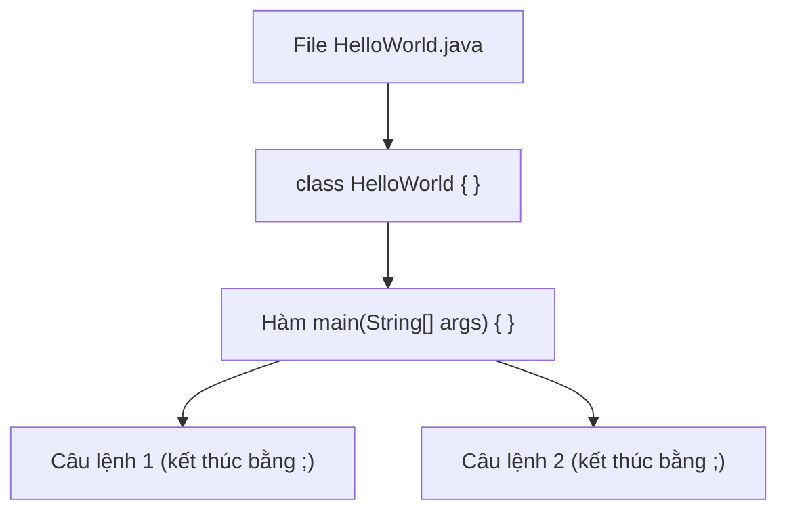

# Cú pháp cơ bản

Cú pháp là bộ quy tắc viết code mà Java bắt buộc bạn tuân theo, giống như ngữ pháp của một ngôn ngữ. Nắm vững cú pháp cơ bản giúp bạn viết được chương trình Java đầu tiên mà không bị máy báo lỗi. Bài này giới thiệu bộ khung tối thiểu của một file Java và các quy tắc nền tảng nhất; phần chi tiết nằm bên dưới.

---

:::note[Ghi nhớ nhanh]

- ⭐ **Mọi code phải nằm trong `class`** — và tên file phải trùng tên class `public`.
- ⭐ **Chương trình bắt đầu chạy từ hàm `main`** — đây là điểm vào duy nhất.
- **Mỗi câu lệnh kết thúc bằng `;`** — cặp `{ }` gom nhiều lệnh thành một khối.
- **In ra màn hình** — `System.out.println` in rồi xuống dòng, `print` thì không.
- **`Comment`** — ghi chú cho người đọc, máy bỏ qua hoàn toàn.

:::

---

## Mục lục

- [Vì sao Java có cú pháp chặt chẽ?](#vì-sao-java-có-cú-pháp-chặt-chẽ)
- [Cú pháp là gì?](#cú-pháp-là-gì)
- [Cấu trúc một file Java](#cấu-trúc-một-file-java)
- [Class — khối chứa code](#class--khối-chứa-code)
- [Hàm main — điểm bắt đầu](#hàm-main--điểm-bắt-đầu)
- [Câu lệnh và dấu chấm phẩy](#câu-lệnh-và-dấu-chấm-phẩy)
- [Dấu ngoặc nhọn và khối lệnh](#dấu-ngoặc-nhọn-và-khối-lệnh)
- [In ra màn hình với System.out.println](#in-ra-màn-hình-với-systemoutprintln)
- [Comment — ghi chú trong code](#comment--ghi-chú-trong-code)
- [Lỗi thường gặp](#lỗi-thường-gặp)
- [Tóm tắt](#tóm-tắt)

---

## Vì sao Java có cú pháp chặt chẽ?

**Vấn đề:** Các ngôn ngữ linh hoạt như Python hay JavaScript cho phép bạn viết code tự do — không cần khai báo kiểu, không cần class, thậm chí không cần dấu chấm phẩy. Điều này tiện khi viết script nhỏ, nhưng trong dự án lớn với hàng chục lập trình viên, code trở nên khó đọc và lỗi chỉ xuất hiện lúc chạy thật sự:

```java
// Ví dụ lỗi chỉ phát hiện lúc chạy (ngôn ngữ động)
// ten_nguoi_dung = "Alice"        ← chuỗi
// ten_nguoi_dung = 12345          ← bỗng dưng thành số → lỗi âm thầm
```

**Giải pháp:** Java áp đặt cú pháp chặt chẽ ngay từ đầu để **compiler** (chương trình dịch code) bắt lỗi trước khi chạy:

- **Mọi code nằm trong class** → xác định rõ phạm vi, tránh biến hay hàm "trôi nổi" không ai quản lý.
- **Bắt buộc có hàm `main`** → điểm vào duy nhất, ai đọc code cũng biết bắt đầu từ đâu.
- **Kết thúc câu lệnh bằng `;`** → compiler biết chính xác ranh giới từng lệnh, không đoán mò.
- **Kiểu tĩnh (static typing)** → phải khai báo kiểu dữ liệu, compiler phát hiện lỗi gán sai kiểu ngay lúc biên dịch.

```java
public class ViDuKieuTinh {
    public static void main(String[] args) {
        int tuoi = 25;
        // tuoi = "hai muoi lam"; // ← Lỗi biên dịch ngay lập tức, không chờ chạy
        System.out.println("Tuoi: " + tuoi);
    }
}
```

:::tip[Dùng thực tế]
- **Dự án nhóm lớn:** Quy tắc thống nhất giúp mọi người đọc code của nhau mà không cần hỏi.
- **Bảo trì code cũ:** Kiểu tĩnh giúp IDE gợi ý và tái cấu trúc an toàn sau nhiều tháng không đụng tới.
- **Ứng dụng doanh nghiệp:** Lỗi bị bắt lúc biên dịch thay vì lúc triển khai trên môi trường thật.
- **Onboarding nhân viên mới:** Cú pháp nhất quán giúp người mới hiểu codebase nhanh hơn.
:::

---

## Cú pháp là gì?

**Cú pháp** (syntax — bộ quy tắc viết code mà ngôn ngữ lập trình bắt buộc bạn tuân theo) giống như ngữ pháp của một ngôn ngữ tự nhiên. Khi nói tiếng Việt, bạn phải đặt từ đúng thứ tự thì người khác mới hiểu. Java cũng vậy: nếu viết sai cú pháp, máy tính sẽ không hiểu và báo lỗi.

Trong bài này, bạn sẽ làm quen với bộ khung tối thiểu của một chương trình Java và những quy tắc cơ bản nhất.

---

## Cấu trúc một file Java

Một chương trình Java đơn giản nhất trông như sau:

```java
// Đây là file HelloWorld.java
// Tên file PHẢI trùng với tên class public bên dưới

public class HelloWorld {
    // Hàm main là nơi chương trình bắt đầu chạy
    public static void main(String[] args) {
        // Lệnh in dòng chữ ra màn hình
        System.out.println("Xin chào, Java!");
    }
}
```

Quy tắc quan trọng: tên **file** (tệp tin) phải trùng với tên **class** (lớp — khối code chính) được khai báo `public`. Ví dụ class tên `HelloWorld` thì file phải là `HelloWorld.java`. Java phân biệt chữ HOA và chữ thường, nên `helloworld` khác `HelloWorld`.

Sơ đồ cấu trúc lồng nhau của một file Java:



---

## Class — khối chứa code

Trong Java, **mọi dòng code đều phải nằm trong một class**. Class giống như một chiếc hộp lớn chứa toàn bộ logic của chương trình.

```java
public class XinChao {
    // Toàn bộ code của bạn nằm bên trong cặp dấu { } này
}
```

Giải thích từng phần:

- `public` — **từ khóa** (keyword — từ có ý nghĩa đặc biệt mà Java dành riêng) cho biết class này có thể được truy cập từ bất cứ đâu.
- `class` — báo cho Java biết "tôi đang định nghĩa một class".
- `XinChao` — tên class do bạn đặt. Theo quy ước, tên class viết hoa chữ cái đầu mỗi từ (gọi là **PascalCase**).

---

## Hàm main — điểm bắt đầu

**Hàm** (method/function — một khối code thực hiện một nhiệm vụ) tên `main` là nơi Java bắt đầu chạy chương trình. Khi bạn khởi động chương trình, máy luôn tìm `main` đầu tiên.

```java
public static void main(String[] args) {
    // Code trong đây sẽ chạy khi chương trình khởi động
}
```

Giải thích "thần chú" này (bạn chưa cần hiểu hết ngay, cứ viết theo):

- `public` — ai cũng gọi được hàm này.
- `static` — **tĩnh** (chạy được mà không cần tạo đối tượng; sẽ học sau).
- `void` — hàm này không trả về giá trị nào.
- `main` — tên cố định mà Java quy định.
- `String[] args` — danh sách tham số dòng lệnh (tạm thời chưa dùng tới).

---

## Câu lệnh và dấu chấm phẩy

Mỗi **câu lệnh** (statement — một chỉ thị bảo máy làm một việc) trong Java phải kết thúc bằng dấu chấm phẩy `;`. Dấu này giống như dấu chấm hết câu trong tiếng Việt.

```java
public class ViDuCauLenh {
    public static void main(String[] args) {
        int tuoi = 25;                       // Câu lệnh 1: khai báo biến tuổi
        System.out.println("Tuoi: " + tuoi); // Câu lệnh 2: in ra màn hình
        tuoi = tuoi + 1;                     // Câu lệnh 3: tăng tuổi thêm 1
    }
}
```

Nếu quên dấu `;`, Java sẽ báo lỗi và không chạy được.

---

## Dấu ngoặc nhọn và khối lệnh

Cặp dấu ngoặc nhọn `{ }` dùng để gom nhiều câu lệnh thành một **khối** (block — nhóm các câu lệnh đi cùng nhau). Mỗi dấu `{` mở ra phải có một dấu `}` đóng lại tương ứng.

```java
public class ViDuKhoiLenh {
    public static void main(String[] args) {  // mở khối của main
        if (true) {                            // mở khối của if
            System.out.println("Luon chay");
        }                                      // đóng khối của if
    }                                          // đóng khối của main
}                                              // đóng khối của class
```

Mẹo: nên viết thụt lề (thêm khoảng trắng đầu dòng) để dễ nhìn khối nào lồng trong khối nào.

---

## In ra màn hình với System.out.println

Để hiển thị chữ ra **màn hình console** (cửa sổ kết quả văn bản), ta dùng:

```java
public class ViDuInRaManHinh {
    public static void main(String[] args) {
        // println: in xong rồi XUỐNG DÒNG (ln = line)
        System.out.println("Dong thu nhat");
        System.out.println("Dong thu hai");

        // print: in xong KHÔNG xuống dòng
        System.out.print("A");
        System.out.print("B"); // Kết quả: AB nằm cùng một dòng

        // Có thể ghép chuỗi và số bằng dấu +
        int diem = 10;
        System.out.println("Diem cua ban la: " + diem);
    }
}
```

Phân biệt nhanh:

- `System.out.println(...)` — in rồi tự động xuống dòng.
- `System.out.print(...)` — in nhưng giữ nguyên trên cùng dòng.

---

## Comment — ghi chú trong code

**Comment** (chú thích — ghi chú dành cho người đọc, máy bỏ qua hoàn toàn) giúp giải thích code. Java có 3 kiểu:

```java
public class ViDuComment {
    public static void main(String[] args) {
        // Comment một dòng: bắt đầu bằng hai dấu gạch chéo

        /*
           Comment nhiều dòng:
           nằm giữa dấu mở và dấu đóng.
        */

        /**
         * Comment dạng tài liệu (Javadoc):
         * dùng để mô tả class hoặc hàm.
         */
        System.out.println("Comment khong anh huong ket qua");
    }
}
```

Comment rất quan trọng để bạn (và người khác) hiểu code sau này. Hãy tập thói quen viết comment ngắn gọn, rõ ràng.

---

## Lỗi thường gặp

- **Quên dấu chấm phẩy `;`** ở cuối câu lệnh → lỗi biên dịch.
- **Tên file không trùng tên class public** → ví dụ class `HelloWorld` mà lưu file `hello.java` sẽ lỗi.
- **Thiếu dấu ngoặc nhọn đóng `}`** → mỗi `{` luôn cần một `}` tương ứng.
- **Viết sai chữ hoa/thường**: `System.out.println` đúng, còn `system.out.Println` sai.
- **Thiếu dấu ngoặc kép cho chuỗi**: phải viết `"Xin chao"`, không viết `Xin chao`.

---

## Tóm tắt

- Mọi code Java đều nằm trong **class**; tên file public phải trùng tên class.
- Chương trình bắt đầu chạy từ hàm **main**.
- Mỗi **câu lệnh** kết thúc bằng dấu `;`.
- Cặp `{ }` gom các câu lệnh thành một **khối**.
- `System.out.println` in ra màn hình rồi xuống dòng; `print` thì không.
- **Comment** giúp giải thích code và không ảnh hưởng tới kết quả chạy.
