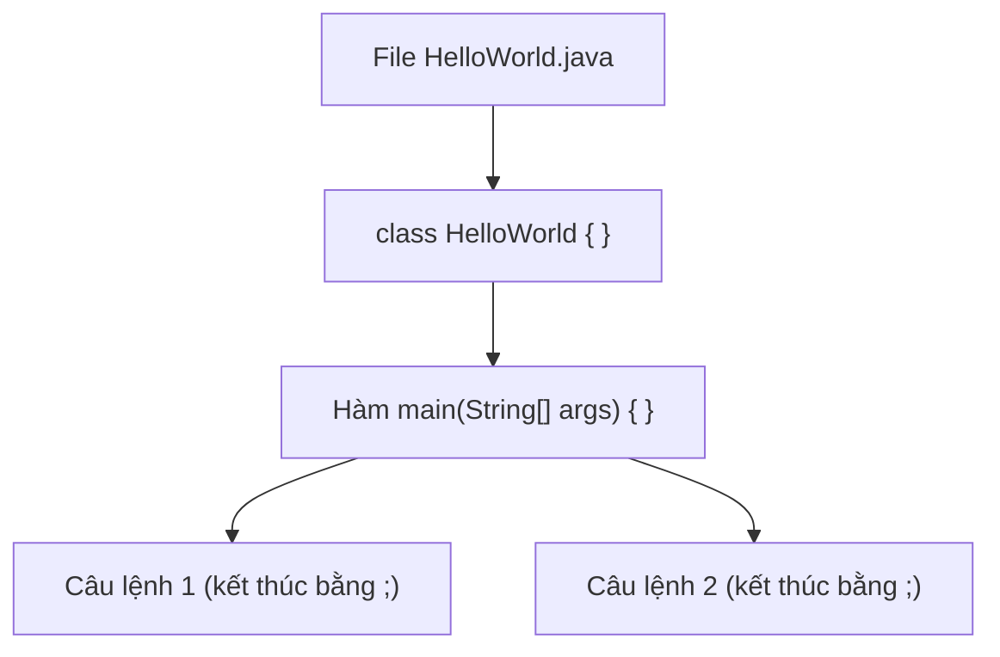

# Cú pháp cơ bản

Cú pháp là bộ quy tắc viết code mà Java bắt buộc bạn tuân theo, giống như ngữ pháp của một ngôn ngữ. Nắm vững cú pháp cơ bản giúp bạn viết được chương trình Java đầu tiên mà không bị máy báo lỗi. Bài này giới thiệu bộ khung tối thiểu của một file Java và các quy tắc nền tảng nhất; phần chi tiết nằm bên dưới.

[](pathname:///img/java/cu-phap-co-ban.webp)

---

:::note[Ghi nhớ nhanh]

- ⭐ **Mọi code phải nằm trong `class`** — và tên file phải trùng tên class `public`.
- ⭐ **Chương trình bắt đầu chạy từ hàm `main`** — đây là điểm vào duy nhất.
- **Mỗi câu lệnh kết thúc bằng `;`** — cặp `{ }` gom nhiều lệnh thành một khối.
- **In ra màn hình** — `System.out.println` in rồi xuống dòng, `print` thì không.
- **`Comment`** — ghi chú cho người đọc, máy bỏ qua hoàn toàn.

:::

---

## Mục lục

- [Vì sao Java có cú pháp chặt chẽ?](#vì-sao-java-có-cú-pháp-chặt-chẽ)
- [Cú pháp là gì?](#cú-pháp-là-gì)
- [Cấu trúc một file Java](#cấu-trúc-một-file-java)
- [Class — khối chứa code](#class--khối-chứa-code)
- [Hàm main — điểm bắt đầu](#hàm-main--điểm-bắt-đầu)
- [Câu lệnh và dấu chấm phẩy](#câu-lệnh-và-dấu-chấm-phẩy)
- [Dấu ngoặc nhọn và khối lệnh](#dấu-ngoặc-nhọn-và-khối-lệnh)
- [In ra màn hình với System.out.println](#in-ra-màn-hình-với-systemoutprintln)
- [Comment — ghi chú trong code](#comment--ghi-chú-trong-code)
- [Lỗi thường gặp](#lỗi-thường-gặp)
- [Tóm tắt](#tóm-tắt)
- [Câu hỏi phỏng vấn](#câu-hỏi-phỏng-vấn)

---

## Vì sao Java có cú pháp chặt chẽ?

**Vấn đề:** Các ngôn ngữ linh hoạt như Python hay JavaScript cho phép bạn viết code tự do — không cần khai báo kiểu, không cần class, thậm chí không cần dấu chấm phẩy. Điều này tiện khi viết script nhỏ, nhưng trong dự án lớn với hàng chục lập trình viên, code trở nên khó đọc và lỗi chỉ xuất hiện lúc chạy thật sự:

```java
// Ví dụ lỗi chỉ phát hiện lúc chạy (ngôn ngữ động)
// ten_nguoi_dung = "Alice"        ← chuỗi
// ten_nguoi_dung = 12345          ← bỗng dưng thành số → lỗi âm thầm
```

**Giải pháp:** Java áp đặt cú pháp chặt chẽ ngay từ đầu để **compiler** (chương trình dịch code) bắt lỗi trước khi chạy:

- **Mọi code nằm trong class** → xác định rõ phạm vi, tránh biến hay hàm "trôi nổi" không ai quản lý.
- **Bắt buộc có hàm `main`** → điểm vào duy nhất, ai đọc code cũng biết bắt đầu từ đâu.
- **Kết thúc câu lệnh bằng `;`** → compiler biết chính xác ranh giới từng lệnh, không đoán mò.
- **Kiểu tĩnh (static typing)** → phải khai báo kiểu dữ liệu, compiler phát hiện lỗi gán sai kiểu ngay lúc biên dịch.

```java
public class ViDuKieuTinh {
    public static void main(String[] args) {
        int tuoi = 25;
        // tuoi = "hai muoi lam"; // ← Lỗi biên dịch ngay lập tức, không chờ chạy
        System.out.println("Tuoi: " + tuoi);
    }
}
```

:::tip[Dùng thực tế]
- **Dự án nhóm lớn:** Quy tắc thống nhất giúp mọi người đọc code của nhau mà không cần hỏi.
- **Bảo trì code cũ:** Kiểu tĩnh giúp IDE gợi ý và tái cấu trúc an toàn sau nhiều tháng không đụng tới.
- **Ứng dụng doanh nghiệp:** Lỗi bị bắt lúc biên dịch thay vì lúc triển khai trên môi trường thật.
- **Onboarding nhân viên mới:** Cú pháp nhất quán giúp người mới hiểu codebase nhanh hơn.
:::

---

## Cú pháp là gì?

**Cú pháp** (syntax — bộ quy tắc viết code mà ngôn ngữ lập trình bắt buộc bạn tuân theo) giống như ngữ pháp của một ngôn ngữ tự nhiên. Khi nói tiếng Việt, bạn phải đặt từ đúng thứ tự thì người khác mới hiểu. Java cũng vậy: nếu viết sai cú pháp, máy tính sẽ không hiểu và báo lỗi.

Trong bài này, bạn sẽ làm quen với bộ khung tối thiểu của một chương trình Java và những quy tắc cơ bản nhất.

---

## Cấu trúc một file Java

Một chương trình Java đơn giản nhất trông như sau:

```java
// Đây là file HelloWorld.java
// Tên file PHẢI trùng với tên class public bên dưới

public class HelloWorld {
    // Hàm main là nơi chương trình bắt đầu chạy
    public static void main(String[] args) {
        // Lệnh in dòng chữ ra màn hình
        System.out.println("Xin chào, Java!");
    }
}
```

Quy tắc quan trọng: tên **file** (tệp tin) phải trùng với tên **class** (lớp — khối code chính) được khai báo `public`. Ví dụ class tên `HelloWorld` thì file phải là `HelloWorld.java`. Java phân biệt chữ HOA và chữ thường, nên `helloworld` khác `HelloWorld`.

Sơ đồ cấu trúc lồng nhau của một file Java:


```mermaid
flowchart TD
    F["File HelloWorld.java"] --> C["class HelloWorld { }"]
    C --> M["Hàm main(String[] args) { }"]
    M --> S1["Câu lệnh 1 (kết thúc bằng ;)"]
    M --> S2["Câu lệnh 2 (kết thúc bằng ;)"]
```

---

## Class — khối chứa code

Trong Java, **mọi dòng code đều phải nằm trong một class**. Class giống như một chiếc hộp lớn chứa toàn bộ logic của chương trình.

```java
public class XinChao {
    // Toàn bộ code của bạn nằm bên trong cặp dấu { } này
}
```

Giải thích từng phần:

- `public` — **từ khóa** (keyword — từ có ý nghĩa đặc biệt mà Java dành riêng) cho biết class này có thể được truy cập từ bất cứ đâu.
- `class` — báo cho Java biết "tôi đang định nghĩa một class".
- `XinChao` — tên class do bạn đặt. Theo quy ước, tên class viết hoa chữ cái đầu mỗi từ (gọi là **PascalCase**).

---

## Hàm main — điểm bắt đầu

**Hàm** (method/function — một khối code thực hiện một nhiệm vụ) tên `main` là nơi Java bắt đầu chạy chương trình. Khi bạn khởi động chương trình, máy luôn tìm `main` đầu tiên.

```java
public static void main(String[] args) {
    // Code trong đây sẽ chạy khi chương trình khởi động
}
```

Giải thích "thần chú" này (bạn chưa cần hiểu hết ngay, cứ viết theo):

- `public` — ai cũng gọi được hàm này.
- `static` — **tĩnh** (chạy được mà không cần tạo đối tượng; sẽ học sau).
- `void` — hàm này không trả về giá trị nào.
- `main` — tên cố định mà Java quy định.
- `String[] args` — danh sách tham số dòng lệnh (tạm thời chưa dùng tới).

---

## Câu lệnh và dấu chấm phẩy

Mỗi **câu lệnh** (statement — một chỉ thị bảo máy làm một việc) trong Java phải kết thúc bằng dấu chấm phẩy `;`. Dấu này giống như dấu chấm hết câu trong tiếng Việt.

```java
public class ViDuCauLenh {
    public static void main(String[] args) {
        int tuoi = 25;                       // Câu lệnh 1: khai báo biến tuổi
        System.out.println("Tuoi: " + tuoi); // Câu lệnh 2: in ra màn hình
        tuoi = tuoi + 1;                     // Câu lệnh 3: tăng tuổi thêm 1
    }
}
```

Nếu quên dấu `;`, Java sẽ báo lỗi và không chạy được.

---

## Dấu ngoặc nhọn và khối lệnh

Cặp dấu ngoặc nhọn `{ }` dùng để gom nhiều câu lệnh thành một **khối** (block — nhóm các câu lệnh đi cùng nhau). Mỗi dấu `{` mở ra phải có một dấu `}` đóng lại tương ứng.

```java
public class ViDuKhoiLenh {
    public static void main(String[] args) {  // mở khối của main
        if (true) {                            // mở khối của if
            System.out.println("Luon chay");
        }                                      // đóng khối của if
    }                                          // đóng khối của main
}                                              // đóng khối của class
```

Mẹo: nên viết thụt lề (thêm khoảng trắng đầu dòng) để dễ nhìn khối nào lồng trong khối nào.

---

## In ra màn hình với System.out.println

Để hiển thị chữ ra **màn hình console** (cửa sổ kết quả văn bản), ta dùng:

```java
public class ViDuInRaManHinh {
    public static void main(String[] args) {
        // println: in xong rồi XUỐNG DÒNG (ln = line)
        System.out.println("Dong thu nhat");
        System.out.println("Dong thu hai");

        // print: in xong KHÔNG xuống dòng
        System.out.print("A");
        System.out.print("B"); // Kết quả: AB nằm cùng một dòng

        // Có thể ghép chuỗi và số bằng dấu +
        int diem = 10;
        System.out.println("Diem cua ban la: " + diem);
    }
}
```

Phân biệt nhanh:

- `System.out.println(...)` — in rồi tự động xuống dòng.
- `System.out.print(...)` — in nhưng giữ nguyên trên cùng dòng.

---

## Comment — ghi chú trong code

**Comment** (chú thích — ghi chú dành cho người đọc, máy bỏ qua hoàn toàn) giúp giải thích code. Java có 3 kiểu:

```java
public class ViDuComment {
    public static void main(String[] args) {
        // Comment một dòng: bắt đầu bằng hai dấu gạch chéo

        /*
           Comment nhiều dòng:
           nằm giữa dấu mở và dấu đóng.
        */

        /**
         * Comment dạng tài liệu (Javadoc):
         * dùng để mô tả class hoặc hàm.
         */
        System.out.println("Comment khong anh huong ket qua");
    }
}
```

Comment rất quan trọng để bạn (và người khác) hiểu code sau này. Hãy tập thói quen viết comment ngắn gọn, rõ ràng.

---

## Lỗi thường gặp

- **Quên dấu chấm phẩy `;`** ở cuối câu lệnh → lỗi biên dịch.
- **Tên file không trùng tên class public** → ví dụ class `HelloWorld` mà lưu file `hello.java` sẽ lỗi.
- **Thiếu dấu ngoặc nhọn đóng `}`** → mỗi `{` luôn cần một `}` tương ứng.
- **Viết sai chữ hoa/thường**: `System.out.println` đúng, còn `system.out.Println` sai.
- **Thiếu dấu ngoặc kép cho chuỗi**: phải viết `"Xin chao"`, không viết `Xin chao`.

---

## Tóm tắt

- Mọi code Java đều nằm trong **class**; tên file public phải trùng tên class.
- Chương trình bắt đầu chạy từ hàm **main**.
- Mỗi **câu lệnh** kết thúc bằng dấu `;`.
- Cặp `{ }` gom các câu lệnh thành một **khối**.
- `System.out.println` in ra màn hình rồi xuống dòng; `print` thì không.
- **Comment** giúp giải thích code và không ảnh hưởng tới kết quả chạy.

---

## Câu hỏi phỏng vấn

Những câu thường gặp về chủ đề này. Tự trả lời trước, rồi bấm **Xem đáp án** để đối chiếu.

**1. Vì sao trong Java, tất cả biến và hàm đều phải khai báo bên trong một `class`, không thể tồn tại "trôi nổi" như ở một số ngôn ngữ khác?**

<details className="qa">
<summary>Xem đáp án</summary>

Java là ngôn ngữ hướng đối tượng thuần túy (mọi thứ xoay quanh **class**), nên trình biên dịch (compiler) yêu cầu mọi thành phần đều thuộc về một class cụ thể vì các lý do:

- **Không gian tên (namespace)**: class đóng vai trò như một "hộp chứa" giúp phân biệt các hàm/biến trùng tên ở nơi khác nhau (ví dụ `Car.start()` khác `Computer.start()`).
- **Đơn vị nạp của JVM**: khi chạy, JVM nạp (load) chương trình theo từng class — mỗi file `.class` tương ứng một class; JVM không có cơ chế nạp một hàm "tự do" không thuộc class nào.
- **Tính nhất quán hướng đối tượng**: ép buộc tư duy đóng gói dữ liệu và hành vi cùng nhau ngay từ đầu, tránh code rải rác khó bảo trì.

Một số ngôn ngữ khác (Python, JavaScript, C) cho phép hàm/biến toàn cục vì chúng không bắt buộc mô hình hướng đối tượng.

</details>

**2. Quy tắc về tên file `.java` so với tên class `public` bên trong là gì? Điều gì xảy ra nếu vi phạm quy tắc này?**

<details className="qa">
<summary>Xem đáp án</summary>

- Một file `.java` có thể chứa nhiều class, nhưng **tối đa một class `public`**.
- Nếu file có một class `public`, **tên file bắt buộc trùng chính xác** (kể cả chữ hoa/thường) với tên class đó.

```java
// File: HelloWorld.java
public class HelloWorld {   // OK, tên class trùng tên file
    // ...
}
```

Nếu đặt sai — ví dụ class là `HelloWorld` nhưng file lưu thành `hello.java` — trình biên dịch `javac` sẽ báo lỗi dạng `class HelloWorld is public, should be declared in a file named HelloWorld.java`.

Nếu file không có class nào là `public` (chỉ có class mặc định/package-private), tên file không bị ràng buộc phải trùng tên class.

</details>

**3. Phân biệt `System.out.println` với `System.out.print`. Ba loại comment trong Java khác nhau ở điểm nào và khi nào nên dùng loại nào?**

<details className="qa">
<summary>Xem đáp án</summary>

- `System.out.println(...)` — in ra rồi **tự động xuống dòng**.
- `System.out.print(...)` — in ra nhưng **giữ nguyên con trỏ trên cùng dòng**, lần in tiếp theo nối ngay sau.

Ba loại comment:

| Loại | Cú pháp | Khi dùng |
|------|---------|----------|
| Một dòng | `// nội dung` | Ghi chú ngắn cho một dòng code |
| Nhiều dòng | `/* ... */` | Ghi chú dài, tạm vô hiệu hóa (comment out) một đoạn code |
| Tài liệu (Javadoc) | `/** ... */` | Mô tả class/method để công cụ `javadoc` sinh tài liệu API tự động |

Javadoc thường đặt ngay trước khai báo class/method, có thể chứa các thẻ như `@param`, `@return`, `@author` để công cụ đọc và xuất ra trang tài liệu.

</details>

**4. Vì sao Java bắt buộc kết thúc mỗi câu lệnh bằng dấu `;`, trong khi một số ngôn ngữ như Python lại không cần? Điều này liên quan thế nào đến cách trình biên dịch hoạt động?**

<details className="qa">
<summary>Xem đáp án</summary>

- Python dùng xuống dòng và thụt lề làm ranh giới câu lệnh/khối lệnh — trình thông dịch dựa vào cấu trúc dòng để hiểu code.
- Java (giống C/C++) coi khoảng trắng và xuống dòng là **không có ý nghĩa cú pháp**; nhiều câu lệnh có thể viết trên cùng một dòng hoặc một câu lệnh trải dài nhiều dòng. Vì vậy `javac` cần một ký hiệu tường minh để biết "câu lệnh kết thúc ở đây" — đó là dấu `;`.

```java
int a = 1; int b = 2; // hai câu lệnh trên cùng một dòng — hợp lệ vì có dấu ;
```

Thiếu `;`, compiler báo lỗi `';' expected` vì nó không xác định được ranh giới câu lệnh.

</details>

**5. Đoạn code dưới đây in ra gì?**

```java
public class Demo {
    public static void main(String[] args) {
        System.out.print("Ket qua: ");
        System.out.print(5);
        System.out.println(5);
        System.out.println("Xong");
    }
}
```

<details className="qa">
<summary>Xem đáp án</summary>

Output:

```
Ket qua: 55
Xong
```

Giải thích: `print` không xuống dòng nên `"Ket qua: "`, `5` (từ `print`) và `5` (từ `println`) nối liền nhau trên cùng một dòng thành `Ket qua: 55`; `println` in xong số `5` đó rồi mới xuống dòng. Câu lệnh `println("Xong")` in tiếp ở dòng kế.

</details>

**6. Đoạn code sau có biên dịch được không? Nếu không, chỉ ra lỗi và cách sửa.**

```java
public class Demo {
    public static void main(String[] args) {
        int diem = 10
        System.out.println("Diem: " + diem);
    }
}
```

<details className="qa">
<summary>Xem đáp án</summary>

**Không biên dịch được.** Lỗi: thiếu dấu chấm phẩy `;` sau `int diem = 10`. Compiler báo `';' expected` tại vị trí đó.

Sửa lại:

```java
public class Demo {
    public static void main(String[] args) {
        int diem = 10;
        System.out.println("Diem: " + diem);
    }
}
```

Đây là lỗi cú pháp phổ biến nhất với người mới học Java.

</details>

**7. Chữ ký `public static void main(String[] args)` có ý nghĩa gì ở từng từ khóa? Nếu đổi thành `public void main(String[] args)` (bỏ `static`), chương trình có chạy được không?**

<details className="qa">
<summary>Xem đáp án</summary>

- `public` — JVM (gọi từ bên ngoài class) phải truy cập được hàm này.
- `static` — hàm chạy được mà không cần tạo đối tượng (instance) của class trước; JVM gọi thẳng `main` khi khởi động chương trình, lúc đó chưa có đối tượng nào tồn tại.
- `void` — không trả về giá trị.
- `main` — tên cố định do đặc tả Java quy định, JVM chỉ tìm đúng tên này.
- `String[] args` — mảng chứa các tham số truyền từ dòng lệnh.

**Nếu bỏ `static`:** chương trình **không chạy được**. JVM báo lỗi runtime dạng `Main method is not static in class Demo, please define the main method as: public static void main(String[] args)`, vì JVM cần gọi `main` mà không phải tạo đối tượng trước — thiếu `static` phá vỡ điều kiện đó.

</details>

**8. Bạn viết `public class Employee { ... }` nhưng vô tình lưu file thành `employee.java` (chữ thường). Trên Linux và trên macOS/Windows, kết quả biên dịch có giống nhau không? Vì sao?**

<details className="qa">
<summary>Xem đáp án</summary>

**Không giống nhau**, vì hệ thống file của các hệ điều hành xử lý chữ hoa/thường khác nhau:

- **Linux**: hệ thống file phân biệt hoa/thường (case-sensitive) → `employee.java` và `Employee.java` là hai file khác nhau → `javac` báo lỗi ngay vì tên file không khớp tên class `public`.
- **macOS mặc định (APFS) và Windows (NTFS)**: hệ thống file không phân biệt hoa/thường với người dùng thông thường → việc biên dịch/chạy đôi khi vẫn "qua" được một cách tình cờ, gây ảo giác code đúng.

Đây là lý do dự án thực tế nên luôn kiểm thử trên môi trường Linux (thường dùng cho server/CI) để tránh lỗi "chạy được ở máy tôi nhưng lỗi trên server".

</details>

**9. Một file `.java` có được phép chứa nhiều class không? Nêu quy tắc và khi nào nên tách class ra file riêng.**

<details className="qa">
<summary>Xem đáp án</summary>

Được phép, với điều kiện:

- Chỉ tối đa **một** class trong file được khai báo `public`.
- Các class còn lại phải là package-private (không có từ khóa `public`), và tên file phải trùng với tên class `public` (nếu có).

```java
// File: Bank.java
public class Bank {
    // ...
}

class Account { // không public — hợp lệ trong cùng file Bank.java
    // ...
}
```

**Khi nào nên tách file riêng:** khi class có kích thước lớn, được dùng lại ở nhiều nơi khác, hoặc cần khai báo `public` riêng để các package khác truy cập trực tiếp. Trong dự án thực tế, quy ước phổ biến là mỗi class `public` một file để dễ tìm kiếm, review và quản lý qua hệ thống quản lý phiên bản.

</details>
