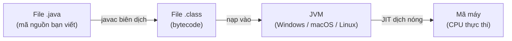
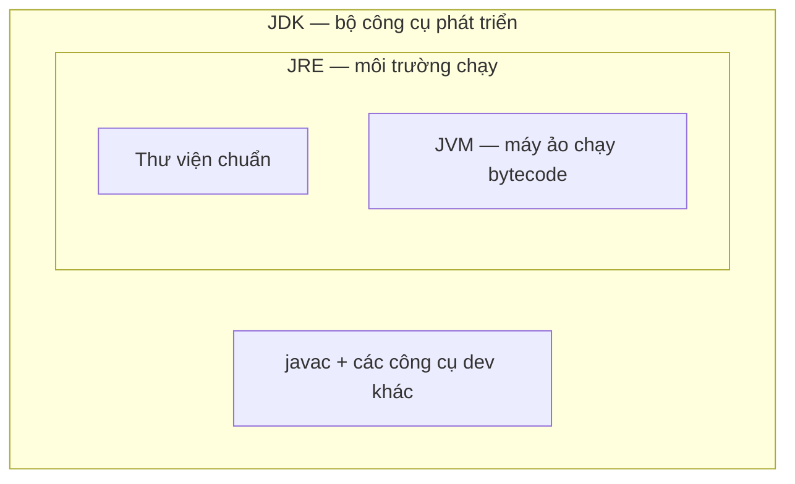

# Vòng đời của chương trình

Vòng đời của chương trình mô tả những gì xảy ra từ lúc bạn viết code cho tới khi nó chạy ra kết quả. Hiểu các bước này giúp bạn gỡ lỗi tốt hơn và biết vì sao Java "viết một lần, chạy mọi nơi". Bài này giới thiệu hành trình từ file .java qua biên dịch javac thành bytecode rồi được JVM thực thi, cùng phân biệt JDK, JRE, JVM; phần chi tiết nằm bên dưới.

---

:::note[Ghi nhớ nhanh]

- ⭐ **Vòng đời** — `.java` → `javac` biên dịch → `.class` (bytecode) → `JVM` chạy.
- ⭐ **Bytecode** — dạng trung gian giúp Java "viết một lần, chạy mọi nơi".
- **Ba lớp lồng nhau** — `JVM` chạy bytecode; `JRE` = JVM + thư viện; `JDK` = JRE + công cụ biên dịch.
- **Cài gì?** — người lập trình cần `JDK`, người chỉ chạy app cần `JRE`.
- **Lệnh chạy** — dùng `java ChaoBan` (không kèm đuôi `.class`).

:::

---

## Mục lục

- [Vì sao cần biết vòng đời?](#vì-sao-cần-biết-vòng-đời)
- [Vì sao Java cần biên dịch + JVM?](#vì-sao-java-cần-biên-dịch--jvm)
- [Tổng quan: từ code đến chạy](#tổng-quan-từ-code-đến-chạy)
- [Bước 1: Viết mã nguồn .java](#bước-1-viết-mã-nguồn-java)
- [Bước 2: Biên dịch với javac](#bước-2-biên-dịch-với-javac)
- [Bytecode và file .class](#bytecode-và-file-class)
- [Bước 3: JVM chạy chương trình](#bước-3-jvm-chạy-chương-trình)
- [JDK, JRE, JVM khác nhau thế nào?](#jdk-jre-jvm-khác-nhau-thế-nào)
- [Vì sao Java chạy được trên mọi máy?](#vì-sao-java-chạy-được-trên-mọi-máy)
- [Lỗi thường gặp](#lỗi-thường-gặp)
- [Tóm tắt](#tóm-tắt)

---

## Vì sao cần biết vòng đời?

Khi mới học, bạn chỉ cần biết "viết code rồi nhấn Run là chạy". Nhưng hiểu được điều gì xảy ra phía sau giúp bạn **gỡ lỗi** (debug — tìm và sửa lỗi) tốt hơn và hiểu vì sao Java có những đặc điểm riêng.

---

## Vì sao Java cần biên dịch + JVM?

**Vấn đề:** Ngôn ngữ biên dịch thẳng ra **mã máy** như C/C++ bị phụ thuộc hệ điều hành và CPU. Mỗi nền tảng cần một bản biên dịch riêng, rất khó phân phối. Ngôn ngữ thông dịch thuần thì dễ mang đi nhưng chạy **chậm**.

```bash
# C/C++: phải biên dịch lại cho TỪNG nền tảng
gcc app.c -o app-windows.exe   # chỉ chạy trên Windows
gcc app.c -o app-mac           # chỉ chạy trên macOS
gcc app.c -o app-linux         # chỉ chạy trên Linux
```

**Giải pháp:** Java biên dịch mã nguồn (`.java`) ra **bytecode** (`.class`) trung gian, chạy trên JVM của từng nền tảng → "Write Once, Run Anywhere". Khi chạy, JVM dùng **JIT** (Just-In-Time — biên dịch nóng) chuyển bytecode thành mã máy để nhanh, và **tự quản bộ nhớ** bằng GC (Garbage Collector — bộ dọn rác).

```bash
# Java: biên dịch MỘT lần, chạy mọi OS có JVM
javac App.java        # sinh ra App.class (bytecode)
java App              # JVM ở Windows / macOS / Linux đều chạy được
```

:::tip[Dùng thực tế]
- **Build một lần, chạy mọi nơi**: cùng file `.class` chạy trên server Linux, máy macOS của bạn và máy Windows của đồng nghiệp.
- **Đóng gói `.jar` để phân phối**: gom nhiều `.class` thành một file `.jar`, gửi đi mà không cần biên dịch lại.
- **JIT tối ưu lúc chạy**: đoạn code chạy nhiều lần sẽ được JIT biên dịch thành mã máy, nhanh gần bằng C.
- **Không quản bộ nhớ thủ công**: GC tự thu hồi bộ nhớ, bạn không phải tự cấp phát/giải phóng như C/C++.
:::

---

## Tổng quan: từ code đến chạy

Chương trình Java đi qua ba bước chính:

```
File .java   →   javac (biên dịch)   →   File .class (bytecode)   →   JVM (chạy)
(bạn viết)        (trình biên dịch)        (dạng máy ảo hiểu)            (kết quả)
```

Ví dụ đời thường: bạn viết công thức nấu ăn bằng tiếng Việt (`.java`), một người dịch nó sang ngôn ngữ ký hiệu chung (`.class`), rồi đầu bếp ở bất kỳ nước nào cũng đọc được ký hiệu đó để nấu (JVM).

Sơ đồ hoá toàn bộ hành trình từ code đến khi CPU thực thi:



---

## Bước 1: Viết mã nguồn .java

**Mã nguồn** (source code — code do con người viết) được lưu trong file có đuôi `.java`. Đây là thứ bạn gõ ra, con người đọc hiểu được nhưng máy tính thì chưa.

```java
// File: ChaoBan.java
public class ChaoBan {
    public static void main(String[] args) {
        System.out.println("Chao ban den voi Java!");
    }
}
```

---

## Bước 2: Biên dịch với javac

**Biên dịch** (compile — chuyển code của con người sang dạng máy/máy ảo hiểu) được thực hiện bởi công cụ `javac` (Java Compiler).

```bash
# Lệnh chạy trên terminal (cửa sổ dòng lệnh)
javac ChaoBan.java
# Sau khi chạy, sẽ sinh ra file ChaoBan.class
```

`javac` sẽ kiểm tra cú pháp của bạn. Nếu sai (ví dụ quên dấu `;`), nó báo lỗi và **không** sinh ra file `.class`.

---

## Bytecode và file .class

**Bytecode** (mã byte — dạng trung gian gồm các chỉ thị mà máy ảo Java hiểu) được lưu trong file `.class`. Bytecode không phải ngôn ngữ máy cụ thể của CPU nào cả, mà là ngôn ngữ chung cho **JVM**.

Đây chính là bí quyết "Viết một lần, chạy mọi nơi" (Write Once, Run Anywhere) của Java: cùng một file `.class` chạy được trên Windows, macOS, Linux mà không cần biên dịch lại.

---

## Bước 3: JVM chạy chương trình

**JVM** (Java Virtual Machine — Máy ảo Java, phần mềm giả lập một chiếc máy tính để chạy bytecode) đọc file `.class` và thực thi nó.

```bash
# Chạy chương trình (chú ý: KHÔNG ghi đuôi .class)
java ChaoBan
# Kết quả in ra: Chao ban den voi Java!
```

JVM dịch bytecode sang **ngôn ngữ máy** (machine code — chỉ thị mà CPU thật sự hiểu) ngay lúc chạy, sau đó CPU thực thi.

---

## JDK, JRE, JVM khác nhau thế nào?

Ba khái niệm này hay gây nhầm lẫn. Hãy hình dung chúng lồng nhau như các hộp:

```
┌─────────────────────────────────────────┐
│ JDK (bộ công cụ phát triển)             │
│  - javac (trình biên dịch)              │
│  - các công cụ khác                     │
│  ┌────────────────────────────────────┐ │
│  │ JRE (môi trường chạy)              │ │
│  │  - thư viện chuẩn                  │ │
│  │  ┌──────────────────────────────┐  │ │
│  │  │ JVM (máy ảo chạy bytecode)   │  │ │
│  │  └──────────────────────────────┘  │ │
│  └────────────────────────────────────┘ │
└─────────────────────────────────────────┘
```

- **JVM** (Java Virtual Machine): chạy bytecode. Đây là lõi trong cùng.
- **JRE** (Java Runtime Environment — Môi trường chạy Java): gồm JVM + các **thư viện** (library — code viết sẵn để tái sử dụng) cần thiết để chạy chương trình. Chỉ cần JRE là chạy được app Java.
- **JDK** (Java Development Kit — Bộ công cụ phát triển Java): gồm JRE + các công cụ để **viết và biên dịch** như `javac`. Người lập trình cần cài JDK.

Sơ đồ ba lớp lồng nhau — JDK bao ngoài cùng, JVM là lõi trong cùng:



Tóm gọn: muốn **chạy** app → cần JRE; muốn **lập trình** → cần JDK.

---

## Vì sao Java chạy được trên mọi máy?

Mỗi hệ điều hành (Windows, macOS, Linux) có một bản JVM riêng. Nhưng tất cả các JVM đều hiểu cùng một loại bytecode. Vì vậy:

- Bạn biên dịch code **một lần** ra `.class`.
- File `.class` đó đem sang máy nào cũng chạy được, miễn máy đó có cài JVM phù hợp.

Đây là lợi thế lớn so với một số ngôn ngữ phải biên dịch riêng cho từng hệ điều hành.

---

## Lỗi thường gặp

- **Chạy `java ChaoBan.class`** (kèm đuôi `.class`) → sai. Phải chạy `java ChaoBan` (không đuôi).
- **Quên biên dịch trước khi chạy** → chưa có file `.class` thì `java` không tìm thấy.
- **Sai đường dẫn**: phải đứng đúng thư mục chứa file khi chạy lệnh.
- **Nhầm JDK với JRE**: máy chỉ cài JRE thì không có `javac` để biên dịch.

---

## Tóm tắt

- Vòng đời: `.java` → **javac biên dịch** → `.class` (**bytecode**) → **JVM chạy**.
- **Bytecode** là dạng trung gian, giúp Java "viết một lần, chạy mọi nơi".
- **JVM** chạy bytecode; **JRE** = JVM + thư viện; **JDK** = JRE + công cụ biên dịch.
- Người lập trình cài **JDK**; người chỉ chạy app cần **JRE**.
