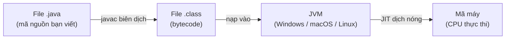
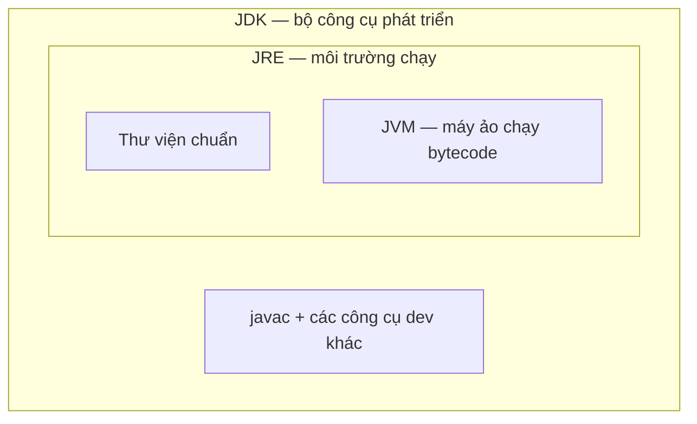

# Vòng đời của chương trình

Vòng đời của chương trình mô tả những gì xảy ra từ lúc bạn viết code cho tới khi nó chạy ra kết quả. Hiểu các bước này giúp bạn gỡ lỗi tốt hơn và biết vì sao Java "viết một lần, chạy mọi nơi". Bài này giới thiệu hành trình từ file .java qua biên dịch javac thành bytecode rồi được JVM thực thi, cùng phân biệt JDK, JRE, JVM; phần chi tiết nằm bên dưới.

[](pathname:///img/java/vong-doi-chuong-trinh.webp)

---

:::note[Ghi nhớ nhanh]

- ⭐ **Vòng đời** — `.java` → `javac` biên dịch → `.class` (bytecode) → `JVM` chạy.
- ⭐ **Bytecode** — dạng trung gian giúp Java "viết một lần, chạy mọi nơi".
- **Ba lớp lồng nhau** — `JVM` chạy bytecode; `JRE` = JVM + thư viện; `JDK` = JRE + công cụ biên dịch.
- **Cài gì?** — người lập trình cần `JDK`, người chỉ chạy app cần `JRE`.
- **Lệnh chạy** — dùng `java ChaoBan` (không kèm đuôi `.class`).

:::

---

## Mục lục

- [Vì sao cần biết vòng đời?](#vì-sao-cần-biết-vòng-đời)
- [Vì sao Java cần biên dịch + JVM?](#vì-sao-java-cần-biên-dịch--jvm)
- [Tổng quan: từ code đến chạy](#tổng-quan-từ-code-đến-chạy)
- [Bước 1: Viết mã nguồn .java](#bước-1-viết-mã-nguồn-java)
- [Bước 2: Biên dịch với javac](#bước-2-biên-dịch-với-javac)
- [Bytecode và file .class](#bytecode-và-file-class)
- [Bước 3: JVM chạy chương trình](#bước-3-jvm-chạy-chương-trình)
- [JDK, JRE, JVM khác nhau thế nào?](#jdk-jre-jvm-khác-nhau-thế-nào)
- [Vì sao Java chạy được trên mọi máy?](#vì-sao-java-chạy-được-trên-mọi-máy)
- [Lỗi thường gặp](#lỗi-thường-gặp)
- [Tóm tắt](#tóm-tắt)
- [Câu hỏi phỏng vấn](#câu-hỏi-phỏng-vấn)

---

## Vì sao cần biết vòng đời?

Khi mới học, bạn chỉ cần biết "viết code rồi nhấn Run là chạy". Nhưng hiểu được điều gì xảy ra phía sau giúp bạn **gỡ lỗi** (debug — tìm và sửa lỗi) tốt hơn và hiểu vì sao Java có những đặc điểm riêng.

---

## Vì sao Java cần biên dịch + JVM?

**Vấn đề:** Ngôn ngữ biên dịch thẳng ra **mã máy** như C/C++ bị phụ thuộc hệ điều hành và CPU. Mỗi nền tảng cần một bản biên dịch riêng, rất khó phân phối. Ngôn ngữ thông dịch thuần thì dễ mang đi nhưng chạy **chậm**.

```bash
# C/C++: phải biên dịch lại cho TỪNG nền tảng
gcc app.c -o app-windows.exe   # chỉ chạy trên Windows
gcc app.c -o app-mac           # chỉ chạy trên macOS
gcc app.c -o app-linux         # chỉ chạy trên Linux
```

**Giải pháp:** Java biên dịch mã nguồn (`.java`) ra **bytecode** (`.class`) trung gian, chạy trên JVM của từng nền tảng → "Write Once, Run Anywhere". Khi chạy, JVM dùng **JIT** (Just-In-Time — biên dịch nóng) chuyển bytecode thành mã máy để nhanh, và **tự quản bộ nhớ** bằng GC (Garbage Collector — bộ dọn rác).

```bash
# Java: biên dịch MỘT lần, chạy mọi OS có JVM
javac App.java        # sinh ra App.class (bytecode)
java App              # JVM ở Windows / macOS / Linux đều chạy được
```

:::tip[Dùng thực tế]
- **Build một lần, chạy mọi nơi**: cùng file `.class` chạy trên server Linux, máy macOS của bạn và máy Windows của đồng nghiệp.
- **Đóng gói `.jar` để phân phối**: gom nhiều `.class` thành một file `.jar`, gửi đi mà không cần biên dịch lại.
- **JIT tối ưu lúc chạy**: đoạn code chạy nhiều lần sẽ được JIT biên dịch thành mã máy, nhanh gần bằng C.
- **Không quản bộ nhớ thủ công**: GC tự thu hồi bộ nhớ, bạn không phải tự cấp phát/giải phóng như C/C++.
:::

---

## Tổng quan: từ code đến chạy

Chương trình Java đi qua ba bước chính:

```
File .java   →   javac (biên dịch)   →   File .class (bytecode)   →   JVM (chạy)
(bạn viết)        (trình biên dịch)        (dạng máy ảo hiểu)            (kết quả)
```

Ví dụ đời thường: bạn viết công thức nấu ăn bằng tiếng Việt (`.java`), một người dịch nó sang ngôn ngữ ký hiệu chung (`.class`), rồi đầu bếp ở bất kỳ nước nào cũng đọc được ký hiệu đó để nấu (JVM).

Sơ đồ hoá toàn bộ hành trình từ code đến khi CPU thực thi:


```mermaid
flowchart LR
    A["File .java<br/>(mã nguồn bạn viết)"] -->|"javac biên dịch"| B["File .class<br/>(bytecode)"]
    B -->|"nạp vào"| C["JVM<br/>(Windows / macOS / Linux)"]
    C -->|"JIT dịch nóng"| D["Mã máy<br/>(CPU thực thi)"]
```

---

## Bước 1: Viết mã nguồn .java

**Mã nguồn** (source code — code do con người viết) được lưu trong file có đuôi `.java`. Đây là thứ bạn gõ ra, con người đọc hiểu được nhưng máy tính thì chưa.

```java
// File: ChaoBan.java
public class ChaoBan {
    public static void main(String[] args) {
        System.out.println("Chao ban den voi Java!");
    }
}
```

---

## Bước 2: Biên dịch với javac

**Biên dịch** (compile — chuyển code của con người sang dạng máy/máy ảo hiểu) được thực hiện bởi công cụ `javac` (Java Compiler).

```bash
# Lệnh chạy trên terminal (cửa sổ dòng lệnh)
javac ChaoBan.java
# Sau khi chạy, sẽ sinh ra file ChaoBan.class
```

`javac` sẽ kiểm tra cú pháp của bạn. Nếu sai (ví dụ quên dấu `;`), nó báo lỗi và **không** sinh ra file `.class`.

---

## Bytecode và file .class

**Bytecode** (mã byte — dạng trung gian gồm các chỉ thị mà máy ảo Java hiểu) được lưu trong file `.class`. Bytecode không phải ngôn ngữ máy cụ thể của CPU nào cả, mà là ngôn ngữ chung cho **JVM**.

Đây chính là bí quyết "Viết một lần, chạy mọi nơi" (Write Once, Run Anywhere) của Java: cùng một file `.class` chạy được trên Windows, macOS, Linux mà không cần biên dịch lại.

---

## Bước 3: JVM chạy chương trình

**JVM** (Java Virtual Machine — Máy ảo Java, phần mềm giả lập một chiếc máy tính để chạy bytecode) đọc file `.class` và thực thi nó.

```bash
# Chạy chương trình (chú ý: KHÔNG ghi đuôi .class)
java ChaoBan
# Kết quả in ra: Chao ban den voi Java!
```

JVM dịch bytecode sang **ngôn ngữ máy** (machine code — chỉ thị mà CPU thật sự hiểu) ngay lúc chạy, sau đó CPU thực thi.

---

## JDK, JRE, JVM khác nhau thế nào?

Ba khái niệm này hay gây nhầm lẫn. Hãy hình dung chúng lồng nhau như các hộp:

```
┌─────────────────────────────────────────┐
│ JDK (bộ công cụ phát triển)             │
│  - javac (trình biên dịch)              │
│  - các công cụ khác                     │
│  ┌────────────────────────────────────┐ │
│  │ JRE (môi trường chạy)              │ │
│  │  - thư viện chuẩn                  │ │
│  │  ┌──────────────────────────────┐  │ │
│  │  │ JVM (máy ảo chạy bytecode)   │  │ │
│  │  └──────────────────────────────┘  │ │
│  └────────────────────────────────────┘ │
└─────────────────────────────────────────┘
```

- **JVM** (Java Virtual Machine): chạy bytecode. Đây là lõi trong cùng.
- **JRE** (Java Runtime Environment — Môi trường chạy Java): gồm JVM + các **thư viện** (library — code viết sẵn để tái sử dụng) cần thiết để chạy chương trình. Chỉ cần JRE là chạy được app Java.
- **JDK** (Java Development Kit — Bộ công cụ phát triển Java): gồm JRE + các công cụ để **viết và biên dịch** như `javac`. Người lập trình cần cài JDK.

Sơ đồ ba lớp lồng nhau — JDK bao ngoài cùng, JVM là lõi trong cùng:


```mermaid
flowchart TD
    subgraph JDK["JDK — bộ công cụ phát triển"]
        T["javac + các công cụ dev khác"]
        subgraph JRE["JRE — môi trường chạy"]
            L["Thư viện chuẩn"]
            V["JVM — máy ảo chạy bytecode"]
        end
    end
```

Tóm gọn: muốn **chạy** app → cần JRE; muốn **lập trình** → cần JDK.

---

## Vì sao Java chạy được trên mọi máy?

Mỗi hệ điều hành (Windows, macOS, Linux) có một bản JVM riêng. Nhưng tất cả các JVM đều hiểu cùng một loại bytecode. Vì vậy:

- Bạn biên dịch code **một lần** ra `.class`.
- File `.class` đó đem sang máy nào cũng chạy được, miễn máy đó có cài JVM phù hợp.

Đây là lợi thế lớn so với một số ngôn ngữ phải biên dịch riêng cho từng hệ điều hành.

---

## Lỗi thường gặp

- **Chạy `java ChaoBan.class`** (kèm đuôi `.class`) → sai. Phải chạy `java ChaoBan` (không đuôi).
- **Quên biên dịch trước khi chạy** → chưa có file `.class` thì `java` không tìm thấy.
- **Sai đường dẫn**: phải đứng đúng thư mục chứa file khi chạy lệnh.
- **Nhầm JDK với JRE**: máy chỉ cài JRE thì không có `javac` để biên dịch.

---

## Tóm tắt

- Vòng đời: `.java` → **javac biên dịch** → `.class` (**bytecode**) → **JVM chạy**.
- **Bytecode** là dạng trung gian, giúp Java "viết một lần, chạy mọi nơi".
- **JVM** chạy bytecode; **JRE** = JVM + thư viện; **JDK** = JRE + công cụ biên dịch.
- Người lập trình cài **JDK**; người chỉ chạy app cần **JRE**.

---

## Câu hỏi phỏng vấn

Những câu thường gặp về chủ đề này. Tự trả lời trước, rồi bấm **Xem đáp án** để đối chiếu.

**1. Mô tả ba bước vòng đời của một chương trình Java, từ lúc viết code tới lúc chạy ra kết quả.**

<details className="qa">
<summary>Xem đáp án</summary>

1. **Viết mã nguồn**: lập trình viên viết code trong file `.java`.
2. **Biên dịch**: công cụ `javac` (Java Compiler) kiểm tra cú pháp và dịch file `.java` thành file `.class` chứa **bytecode**.
3. **Thực thi**: `JVM` (Java Virtual Machine) nạp file `.class`, dịch bytecode sang mã máy (thường qua **JIT** — Just-In-Time compiler) rồi CPU thực thi.

```
File .java  →  javac (biên dịch)  →  File .class (bytecode)  →  JVM (chạy)
```

</details>

**2. Bytecode là gì? Vì sao nó là "bí quyết" giúp Java đạt được khẩu hiệu "Write Once, Run Anywhere"?**

<details className="qa">
<summary>Xem đáp án</summary>

**Bytecode** (mã byte) là dạng trung gian gồm các chỉ thị mà **JVM** hiểu được — nó không phải mã máy (machine code) riêng của bất kỳ CPU/hệ điều hành cụ thể nào.

Vì mỗi hệ điều hành chỉ cần cài một bản JVM tương ứng, mà mọi JVM đều hiểu cùng một loại bytecode, nên:

- Lập trình viên chỉ cần biên dịch **một lần** ra file `.class`.
- File `.class` đó chạy được trên Windows, macOS, Linux... miễn máy đó có JVM phù hợp — không cần biên dịch lại cho từng nền tảng.

Đây là điểm khác biệt lớn so với C/C++, nơi mỗi hệ điều hành cần một bản build (biên dịch) riêng ra thẳng mã máy.

</details>

**3. Phân biệt `JVM`, `JRE` và `JDK`. Người chỉ chạy ứng dụng Java và người lập trình Java cần cài gì?**

<details className="qa">
<summary>Xem đáp án</summary>

Ba khái niệm lồng nhau như các hộp, từ trong ra ngoài:

| Thành phần | Gồm | Vai trò |
|---|---|---|
| `JVM` (Java Virtual Machine) | Lõi trong cùng | Nạp và chạy bytecode |
| `JRE` (Java Runtime Environment) | `JVM` + thư viện chuẩn | Đủ để **chạy** một chương trình Java đã biên dịch |
| `JDK` (Java Development Kit) | `JRE` + công cụ (`javac`, debugger...) | Đủ để **viết và biên dịch** code Java |

- Người **chỉ chạy** ứng dụng Java (end user) → chỉ cần `JRE`.
- Người **lập trình** Java → cần `JDK` (vì cần `javac` để biên dịch).

Lưu ý: từ Java 11 trở đi, Oracle không phân phối `JRE` độc lập nữa — thường chỉ còn `JDK` để tải, nhưng khái niệm ba lớp vẫn đúng về mặt kiến trúc.

</details>

**4. `JIT` (Just-In-Time compiler) là gì? Nó khác gì so với việc thông dịch (interpret) thuần túy hay biên dịch thẳng ra mã máy như C/C++?**

<details className="qa">
<summary>Xem đáp án</summary>

- **Thông dịch thuần túy** (như một số ngôn ngữ script): đọc và chạy từng dòng lệnh, không cần biên dịch trước, nhưng chạy chậm vì phải "dịch lại" mỗi lần gặp.
- **Biên dịch thẳng ra mã máy** (C/C++): nhanh khi chạy, nhưng phải biên dịch riêng cho từng hệ điều hành/CPU, mất khả năng "chạy mọi nơi".
- **`JIT`**: là phần của JVM, biên dịch bytecode sang mã máy **ngay lúc chương trình đang chạy** (runtime), tập trung tối ưu những đoạn code chạy nhiều lần ("hot code"). Kết quả là Java vừa giữ được tính di động của bytecode, vừa đạt tốc độ gần với mã máy biên dịch sẵn sau khi JIT "làm nóng" (warm up).

Ngoài `JIT`, Java hiện đại còn hỗ trợ biên dịch **AOT** (Ahead-Of-Time, ví dụ qua GraalVM Native Image) để sinh thẳng file thực thi native, đánh đổi lấy thời gian khởi động nhanh hơn nhưng mất một phần tính "chạy mọi nơi" của bytecode.

</details>

**5. Bạn gõ `java ChaoBan.class` để chạy chương trình và bị lỗi. Lệnh đúng là gì, và vì sao lệnh sai lại gây lỗi?**

<details className="qa">
<summary>Xem đáp án</summary>

Lệnh đúng: `java ChaoBan` — **không kèm** đuôi `.class`.

Vì lệnh `java` nhận vào **tên class** (để JVM tìm và nạp đúng class có hàm `main`), không phải tên file. Khi gõ `java ChaoBan.class`, JVM hiểu nhầm `ChaoBan.class` (kèm cả dấu chấm) là tên class, không tìm thấy class nào tên như vậy nên báo lỗi dạng `Error: Could not find or load main class ChaoBan.class`.

</details>

**6. Bạn vừa sửa code trong file `.java` và chạy lại bằng `java TenClass`, nhưng vẫn thấy kết quả cũ như trước khi sửa. Nguyên nhân thường gặp nhất là gì?**

<details className="qa">
<summary>Xem đáp án</summary>

Nguyên nhân phổ biến nhất: **quên biên dịch lại** bằng `javac` sau khi sửa code.

Lệnh `java TenClass` chỉ chạy file `.class` (bytecode) đã có sẵn — nó **không** tự động đọc lại file `.java` gốc. Nếu bạn sửa `.java` mà không chạy lại `javac`, file `.class` cũ (chưa cập nhật) vẫn còn nằm đó và JVM cứ thế chạy bản cũ.

Cách khắc phục: luôn `javac TenClass.java` (biên dịch) trước, rồi mới `java TenClass` (chạy). Đây cũng là lý do các công cụ build (Maven, Gradle) hay IDE thường tự động biên dịch lại trước khi chạy, để tránh lỗi này.

</details>

**7. Một server production chỉ cần chạy ứng dụng Java đã đóng gói sẵn (file `.jar`), không cần biên dịch thêm gì. Đội vận hành nên cài `JDK` hay `JRE` trên server đó? Vì sao cân nhắc này quan trọng trong thực tế?**

<details className="qa">
<summary>Xem đáp án</summary>

Về nguyên tắc chỉ cần **`JRE`** (hoặc bản `JDK` đầy đủ nhưng chỉ dùng phần chạy), vì server chỉ **chạy** bytecode đã biên dịch sẵn trong file `.jar`, không cần `javac` hay các công cụ phát triển khác.

Cân nhắc này quan trọng vì:

- **Bảo mật/diện tích tấn công (attack surface)**: cài ít công cụ hơn trên server production giảm nguy cơ bị khai thác qua các thành phần không dùng tới.
- **Kích thước image**: trong container (ví dụ Docker), dùng base image JRE thay vì JDK giúp image nhẹ hơn đáng kể, triển khai nhanh hơn.
- Trong thực tế hiện nay, do Oracle không còn phân phối `JRE` độc lập từ Java 11, nhiều team dùng các bản JRE tối giản của OpenJDK hoặc công cụ `jlink` để tự tạo runtime image tối thiểu chỉ chứa module cần thiết.

</details>

**8. Bộ dọn rác (Garbage Collector — GC) nằm ở đâu trong vòng đời chương trình, và vì sao đây được xem là một lợi thế của Java so với C/C++?**

<details className="qa">
<summary>Xem đáp án</summary>

`GC` là một thành phần chạy **bên trong JVM**, hoạt động song song trong lúc chương trình đang chạy (giai đoạn thực thi ở bước 3 của vòng đời). Nó tự động phát hiện các đối tượng không còn được tham chiếu tới (unreachable) và thu hồi vùng nhớ (heap) mà chúng chiếm giữ.

So với C/C++ — nơi lập trình viên phải tự `malloc`/`free` (hoặc `new`/`delete`) bộ nhớ thủ công, dễ gây lỗi **rò rỉ bộ nhớ** (memory leak) khi quên giải phóng, hoặc **dangling pointer** khi giải phóng rồi vẫn dùng — Java giao việc quản lý vòng đời bộ nhớ cho JVM, giúp giảm hẳn nhóm lỗi này. Đánh đổi là JVM tốn thêm tài nguyên và có thể gây độ trễ ngắn (GC pause) khi dọn rác, dù các GC hiện đại (như G1, ZGC) đã tối ưu để độ trễ này rất nhỏ.

</details>

**9. `ClassLoader` là gì và nó liên quan thế nào tới vòng đời chương trình? Một class có bị nạp ngay từ đầu khi chương trình khởi động không?**

<details className="qa">
<summary>Xem đáp án</summary>

`ClassLoader` là thành phần của JVM chịu trách nhiệm **tìm và nạp file `.class` vào bộ nhớ** khi cần, chuyển bytecode thành các đối tượng `Class` mà JVM có thể dùng để tạo instance, gọi method...

Điểm hay bị hiểu nhầm: JVM **không nạp mọi class ngay khi khởi động chương trình**. Việc nạp class trong Java là **lazy** (trễ) — một class chỉ thực sự được nạp lần đầu tiên nó được dùng đến (ví dụ lần đầu gọi `new TenClass()`, truy cập static field, hay gọi static method của nó). Quá trình đầy đủ gồm ba giai đoạn: **loading** (nạp bytecode), **linking** (kiểm tra, chuẩn bị, liên kết tham chiếu) và **initialization** (chạy khối khởi tạo static và gán giá trị field static).

Hiểu cơ chế này giúp giải thích các hiện tượng như: chương trình chạy một lúc mới báo lỗi `ClassNotFoundException`/`NoClassDefFoundError` dù class đó "có vẻ" không liên quan đến đoạn code đang lỗi, hoặc vì sao static initializer chỉ chạy đúng một lần và đúng lúc class được dùng lần đầu.

</details>
