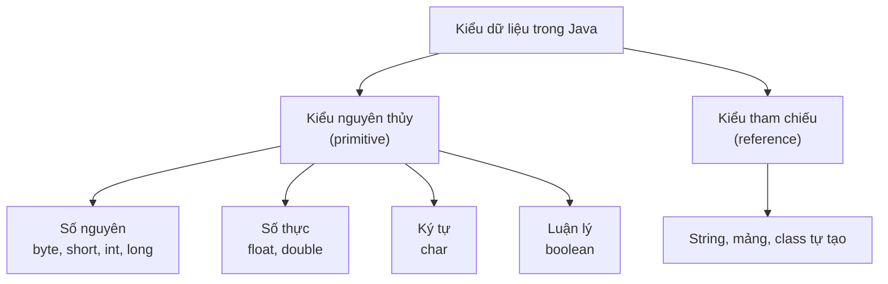

# Kiểu dữ liệu

Kiểu dữ liệu cho Java biết một giá trị là số nguyên, số thực, ký tự hay đúng/sai, từ đó máy biết cách lưu trữ và xử lý. Chọn đúng kiểu giúp tiết kiệm bộ nhớ và tránh lỗi khi tính toán. Bài này giới thiệu 8 kiểu nguyên thủy của Java cùng kiểu tham chiếu và giá trị mặc định; phần chi tiết nằm bên dưới.

---

## Mục lục

- [Vì sao Java có kiểu tĩnh & primitive?](#vì-sao-java-có-kiểu-tĩnh--primitive)
- [Kiểu dữ liệu là gì?](#kiểu-dữ-liệu-là-gì)
- [Hai nhóm kiểu trong Java](#hai-nhóm-kiểu-trong-java)
- [8 kiểu nguyên thủy](#8-kiểu-nguyên-thủy)
- [Bảng kích thước và phạm vi giá trị](#bảng-kích-thước-và-phạm-vi-giá-trị)
- [Ví dụ khai báo từng kiểu](#ví-dụ-khai-báo-từng-kiểu)
- [Kiểu tham chiếu](#kiểu-tham-chiếu)
- [Giá trị mặc định](#giá-trị-mặc-định)
- [Lỗi thường gặp](#lỗi-thường-gặp)
- [Tóm tắt](#tóm-tắt)

---

## Vì sao Java có kiểu tĩnh & primitive?

**Vấn đề:** Với ngôn ngữ **kiểu động** (dynamic type — biến gán gì cũng được), lỗi kiểu chỉ lộ ra MUỘN lúc chạy, dễ thành bug sản xuất. Ngoài ra, nếu mọi con số đều phải bọc thành object thì tốn bộ nhớ và chậm khi tính toán.

```java
// Giả lập tư duy kiểu động: 'soLuong' lúc là số, lúc thành chữ
var soLuong = 10;
soLuong = "mười";          // không khai báo kiểu nên "gán gì cũng được"
int tong = soLuong + 5;    // LỖI chỉ phát hiện lúc CHẠY → bug sản xuất

// Mỗi con số đều là object → tốn bộ nhớ, chậm
Integer a = 1, b = 2, c = a + b; // bọc/mở bọc object liên tục
```

**Giải pháp:** Java dùng **kiểu tĩnh** (static type — phải khai báo kiểu trước): compiler bắt lỗi NGAY lúc biên dịch và IDE gợi ý (autocomplete). Java có **primitive** (`int`, `double`, `boolean`...) lưu trực tiếp giá trị nên nhanh, nhẹ; và **wrapper** (`Integer`, `Double`...) khi cần object (dùng trong collections, generics, hoặc cần `null`), có **autoboxing** (tự chuyển qua lại primitive ↔ wrapper).

```java
int soLuong = 10;
// soLuong = "mười";       // compiler BÁO LỖI NGAY, chưa cần chạy
int tong = soLuong + 5;    // an toàn, IDE còn gợi ý kiểu int

int a = 1, b = 2, c = a + b; // primitive: tính toán nhanh, nhẹ

// wrapper cho khi cần object
java.util.List<Integer> diem = new java.util.ArrayList<>();
diem.add(8);               // autoboxing: int 8 → Integer tự động
Integer chuaCo = null;     // chỉ wrapper mới nhận null, int thì không
```

:::tip[Dùng thực tế]

- **Bắt lỗi sớm:** gán nhầm chuỗi cho biến `int` bị báo đỏ ngay lúc biên dịch, không chờ tới lúc chạy.
- **Tính toán hiệu năng:** vòng lặp, cộng dồn, xử lý số lớn → dùng primitive (`int`, `double`) cho nhanh và ít tốn bộ nhớ.
- **Trong collections/generics:** `List<Integer>`, `Map<String, Double>` bắt buộc dùng wrapper (object), nhờ autoboxing nên viết `list.add(5)` vẫn được.
- **Hiểu `null`:** chỉ wrapper (`Integer`, `Double`...) nhận `null`; primitive thì không — nên field có thể "chưa có giá trị" thường để wrapper.

:::

---

## Kiểu dữ liệu là gì?

**Kiểu dữ liệu** (data type — phân loại dữ liệu để máy biết cách lưu trữ và xử lý) cho Java biết một giá trị là số nguyên, số thực, ký tự hay đúng/sai. Giống như khi điền form, bạn biết "tuổi" là một con số còn "tên" là chữ.

Mỗi kiểu chiếm một lượng **bộ nhớ** (memory — nơi máy lưu dữ liệu) khác nhau và chứa được khoảng giá trị khác nhau.

---

## Hai nhóm kiểu trong Java

Java chia kiểu dữ liệu thành hai nhóm:

1. **Kiểu nguyên thủy** (primitive type — kiểu cơ bản dựng sẵn, lưu trực tiếp giá trị): có 8 kiểu, ví dụ `int`, `double`, `boolean`.
2. **Kiểu tham chiếu** (reference type — kiểu lưu địa chỉ trỏ tới đối tượng trong bộ nhớ): ví dụ `String`, mảng, và các class do bạn tạo.

Sơ đồ phân loại các kiểu dữ liệu trong Java:



---

## 8 kiểu nguyên thủy

Java có đúng 8 kiểu nguyên thủy, chia thành 4 nhóm:

- **Số nguyên** (whole number — số không có phần thập phân): `byte`, `short`, `int`, `long`.
- **Số thực** (floating point — số có phần thập phân): `float`, `double`.
- **Ký tự** (character — một chữ cái/ký hiệu đơn): `char`.
- **Luận lý** (boolean — chỉ đúng hoặc sai): `boolean`.

---

## Bảng kích thước và phạm vi giá trị

| Kiểu | Kích thước | Phạm vi giá trị | Dùng cho |
|------|-----------|-----------------|----------|
| `byte` | 8 bit (1 byte) | -128 đến 127 | Số nguyên rất nhỏ, tiết kiệm bộ nhớ |
| `short` | 16 bit (2 byte) | -32.768 đến 32.767 | Số nguyên nhỏ |
| `int` | 32 bit (4 byte) | khoảng -2,1 tỷ đến 2,1 tỷ | Số nguyên thông dụng nhất |
| `long` | 64 bit (8 byte) | rất lớn (~9,2 tỷ tỷ) | Số nguyên rất lớn |
| `float` | 32 bit (4 byte) | số thực, ~7 chữ số chính xác | Số thực ít chính xác |
| `double` | 64 bit (8 byte) | số thực, ~15 chữ số chính xác | Số thực thông dụng nhất |
| `char` | 16 bit (2 byte) | 1 ký tự Unicode | Một ký tự đơn |
| `boolean` | (1 bit về mặt logic) | `true` hoặc `false` | Đúng/sai |

Ghi chú: 1 **bit** là đơn vị nhỏ nhất (0 hoặc 1); 8 bit = 1 **byte**.

---

## Ví dụ khai báo từng kiểu

```java
public class ViDuKieuDuLieu {
    public static void main(String[] args) {
        // --- Nhóm số nguyên ---
        byte tuoi = 25;              // số nguyên nhỏ
        short namSinh = 1999;        // số nguyên nhỏ
        int danSo = 1000000;         // số nguyên thông dụng
        long khoangCachVuTru = 9000000000L; // 'L' báo đây là long

        // --- Nhóm số thực ---
        float nhietDo = 36.6f;       // 'f' báo đây là float
        double soPi = 3.14159265358; // số thực chính xác cao

        // --- Ký tự ---
        char hangChu = 'A';          // dùng nháy ĐƠN cho 1 ký tự

        // --- Luận lý ---
        boolean dangHoc = true;      // chỉ true hoặc false

        // In thử vài giá trị
        System.out.println("Tuoi: " + tuoi);
        System.out.println("So Pi: " + soPi);
        System.out.println("Dang hoc: " + dangHoc);
    }
}
```

Lưu ý hai hậu tố quan trọng:

- Số `long` lớn nên thêm `L` ở cuối: `9000000000L`.
- Số `float` nên thêm `f` ở cuối: `36.6f` (vì mặc định số thực là `double`).

---

## Kiểu tham chiếu

**Kiểu tham chiếu** không lưu trực tiếp giá trị mà lưu **địa chỉ** (reference — chỉ tới nơi chứa dữ liệu thật trong bộ nhớ). Ví dụ phổ biến nhất là `String` (chuỗi ký tự).

```java
public class ViDuKieuThamChieu {
    public static void main(String[] args) {
        // String: chuỗi ký tự, dùng nháy KÉP
        String hoTen = "Nguyen Van A";

        // Mảng cũng là kiểu tham chiếu (sẽ học ở bài Mảng)
        int[] daySo = {1, 2, 3};

        System.out.println("Ho ten: " + hoTen);
        System.out.println("Phan tu dau: " + daySo[0]);
    }
}
```

Khác biệt cốt lõi: `char` dùng nháy ĐƠN cho **một** ký tự (`'A'`), còn `String` dùng nháy KÉP cho **chuỗi** ký tự (`"ABC"`).

---

## Giá trị mặc định

Khi một biến **instance** (biến thuộc đối tượng — sẽ học sau) chưa được gán, Java cho nó giá trị mặc định:

| Kiểu | Mặc định |
|------|----------|
| Các kiểu số nguyên | `0` |
| `float`, `double` | `0.0` |
| `char` | ký tự rỗng `' '` |
| `boolean` | `false` |
| Kiểu tham chiếu | `null` (chưa trỏ tới đâu) |

Lưu ý: **biến cục bộ** (local variable — biến khai báo trong hàm) KHÔNG có giá trị mặc định, bạn bắt buộc phải gán trước khi dùng.

---

## Lỗi thường gặp

- **Gán số quá lớn cho kiểu nhỏ**: `byte b = 200;` lỗi vì `byte` chỉ tới 127.
- **Quên hậu tố `L` cho `long`** khi số vượt giới hạn `int`.
- **Dùng nháy kép cho `char`**: `char c = "A";` sai, phải là `char c = 'A';`.
- **Dùng biến cục bộ chưa gán giá trị** → Java báo lỗi "variable might not have been initialized".

---

## Tóm tắt

- Java có **8 kiểu nguyên thủy**: `byte`, `short`, `int`, `long`, `float`, `double`, `char`, `boolean`.
- Thông dụng nhất: `int` cho số nguyên, `double` cho số thực.
- **Kiểu tham chiếu** (như `String`, mảng) lưu địa chỉ trỏ tới dữ liệu.
- `long` thêm hậu tố `L`, `float` thêm `f`; `char` dùng nháy đơn, `String` dùng nháy kép.
- Biến cục bộ phải gán giá trị trước khi dùng.
