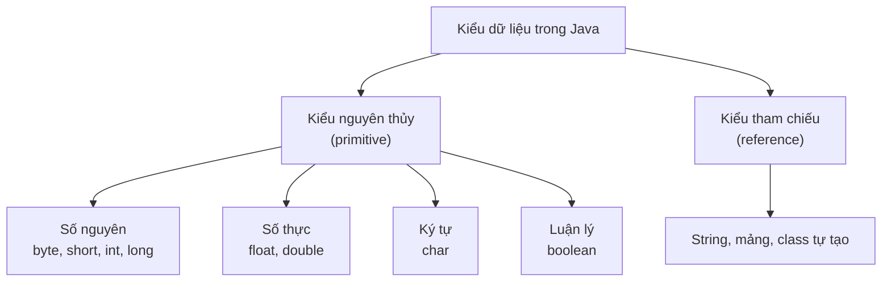

# Kiểu dữ liệu

Kiểu dữ liệu cho Java biết một giá trị là số nguyên, số thực, ký tự hay đúng/sai, từ đó máy biết cách lưu trữ và xử lý. Chọn đúng kiểu giúp tiết kiệm bộ nhớ và tránh lỗi khi tính toán. Bài này giới thiệu 8 kiểu nguyên thủy của Java cùng kiểu tham chiếu và giá trị mặc định; phần chi tiết nằm bên dưới.

[](pathname:///img/java/kieu-du-lieu.webp)

---

:::note[Ghi nhớ nhanh]

- ⭐ **8 kiểu nguyên thủy** — `byte`, `short`, `int`, `long`, `float`, `double`, `char`, `boolean`.
- **Thông dụng nhất** — `int` cho số nguyên, `double` cho số thực.
- **Kiểu tham chiếu** — như `String`, mảng — lưu địa chỉ trỏ tới dữ liệu.
- **Hậu tố & nháy** — `long` thêm `L`, `float` thêm `f`; `char` nháy đơn, `String` nháy kép.
- **Biến cục bộ** — phải gán giá trị trước khi dùng (không có giá trị mặc định).

:::

---

## Mục lục

- [Vì sao Java có kiểu tĩnh & primitive?](#vì-sao-java-có-kiểu-tĩnh--primitive)
- [Kiểu dữ liệu là gì?](#kiểu-dữ-liệu-là-gì)
- [Hai nhóm kiểu trong Java](#hai-nhóm-kiểu-trong-java)
- [8 kiểu nguyên thủy](#8-kiểu-nguyên-thủy)
- [Bảng kích thước và phạm vi giá trị](#bảng-kích-thước-và-phạm-vi-giá-trị)
- [Ví dụ khai báo từng kiểu](#ví-dụ-khai-báo-từng-kiểu)
- [Kiểu tham chiếu](#kiểu-tham-chiếu)
- [Giá trị mặc định](#giá-trị-mặc-định)
- [Lỗi thường gặp](#lỗi-thường-gặp)
- [Tóm tắt](#tóm-tắt)
- [Câu hỏi phỏng vấn](#câu-hỏi-phỏng-vấn)

---

## Vì sao Java có kiểu tĩnh & primitive?

**Vấn đề:** Với ngôn ngữ **kiểu động** (dynamic type — biến gán gì cũng được), lỗi kiểu chỉ lộ ra MUỘN lúc chạy, dễ thành bug sản xuất. Ngoài ra, nếu mọi con số đều phải bọc thành object thì tốn bộ nhớ và chậm khi tính toán.

```java
// Giả lập tư duy kiểu động: 'soLuong' lúc là số, lúc thành chữ
var soLuong = 10;
soLuong = "mười";          // không khai báo kiểu nên "gán gì cũng được"
int tong = soLuong + 5;    // LỖI chỉ phát hiện lúc CHẠY → bug sản xuất

// Mỗi con số đều là object → tốn bộ nhớ, chậm
Integer a = 1, b = 2, c = a + b; // bọc/mở bọc object liên tục
```

**Giải pháp:** Java dùng **kiểu tĩnh** (static type — phải khai báo kiểu trước): compiler bắt lỗi NGAY lúc biên dịch và IDE gợi ý (autocomplete). Java có **primitive** (`int`, `double`, `boolean`...) lưu trực tiếp giá trị nên nhanh, nhẹ; và **wrapper** (`Integer`, `Double`...) khi cần object (dùng trong collections, generics, hoặc cần `null`), có **autoboxing** (tự chuyển qua lại primitive ↔ wrapper).

```java
int soLuong = 10;
// soLuong = "mười";       // compiler BÁO LỖI NGAY, chưa cần chạy
int tong = soLuong + 5;    // an toàn, IDE còn gợi ý kiểu int

int a = 1, b = 2, c = a + b; // primitive: tính toán nhanh, nhẹ

// wrapper cho khi cần object
java.util.List<Integer> diem = new java.util.ArrayList<>();
diem.add(8);               // autoboxing: int 8 → Integer tự động
Integer chuaCo = null;     // chỉ wrapper mới nhận null, int thì không
```

:::tip[Dùng thực tế]

- **Bắt lỗi sớm:** gán nhầm chuỗi cho biến `int` bị báo đỏ ngay lúc biên dịch, không chờ tới lúc chạy.
- **Tính toán hiệu năng:** vòng lặp, cộng dồn, xử lý số lớn → dùng primitive (`int`, `double`) cho nhanh và ít tốn bộ nhớ.
- **Trong collections/generics:** `List<Integer>`, `Map<String, Double>` bắt buộc dùng wrapper (object), nhờ autoboxing nên viết `list.add(5)` vẫn được.
- **Hiểu `null`:** chỉ wrapper (`Integer`, `Double`...) nhận `null`; primitive thì không — nên field có thể "chưa có giá trị" thường để wrapper.

:::

---

## Kiểu dữ liệu là gì?

**Kiểu dữ liệu** (data type — phân loại dữ liệu để máy biết cách lưu trữ và xử lý) cho Java biết một giá trị là số nguyên, số thực, ký tự hay đúng/sai. Giống như khi điền form, bạn biết "tuổi" là một con số còn "tên" là chữ.

Mỗi kiểu chiếm một lượng **bộ nhớ** (memory — nơi máy lưu dữ liệu) khác nhau và chứa được khoảng giá trị khác nhau.

---

## Hai nhóm kiểu trong Java

Java chia kiểu dữ liệu thành hai nhóm:

1. **Kiểu nguyên thủy** (primitive type — kiểu cơ bản dựng sẵn, lưu trực tiếp giá trị): có 8 kiểu, ví dụ `int`, `double`, `boolean`.
2. **Kiểu tham chiếu** (reference type — kiểu lưu địa chỉ trỏ tới đối tượng trong bộ nhớ): ví dụ `String`, mảng, và các class do bạn tạo.

Sơ đồ phân loại các kiểu dữ liệu trong Java:


```mermaid
flowchart TD
    K["Kiểu dữ liệu trong Java"] --> P["Kiểu nguyên thủy<br/>(primitive)"]
    K --> R["Kiểu tham chiếu<br/>(reference)"]
    P --> N["Số nguyên<br/>byte, short, int, long"]
    P --> T["Số thực<br/>float, double"]
    P --> C["Ký tự<br/>char"]
    P --> B["Luận lý<br/>boolean"]
    R --> S["String, mảng, class tự tạo"]
```

---

## 8 kiểu nguyên thủy

Java có đúng 8 kiểu nguyên thủy, chia thành 4 nhóm:

- **Số nguyên** (whole number — số không có phần thập phân): `byte`, `short`, `int`, `long`.
- **Số thực** (floating point — số có phần thập phân): `float`, `double`.
- **Ký tự** (character — một chữ cái/ký hiệu đơn): `char`.
- **Luận lý** (boolean — chỉ đúng hoặc sai): `boolean`.

---

## Bảng kích thước và phạm vi giá trị

| Kiểu | Kích thước | Phạm vi giá trị | Dùng cho |
|------|-----------|-----------------|----------|
| `byte` | 8 bit (1 byte) | -128 đến 127 | Số nguyên rất nhỏ, tiết kiệm bộ nhớ |
| `short` | 16 bit (2 byte) | -32.768 đến 32.767 | Số nguyên nhỏ |
| `int` | 32 bit (4 byte) | khoảng -2,1 tỷ đến 2,1 tỷ | Số nguyên thông dụng nhất |
| `long` | 64 bit (8 byte) | rất lớn (~9,2 tỷ tỷ) | Số nguyên rất lớn |
| `float` | 32 bit (4 byte) | số thực, ~7 chữ số chính xác | Số thực ít chính xác |
| `double` | 64 bit (8 byte) | số thực, ~15 chữ số chính xác | Số thực thông dụng nhất |
| `char` | 16 bit (2 byte) | 1 ký tự Unicode | Một ký tự đơn |
| `boolean` | (1 bit về mặt logic) | `true` hoặc `false` | Đúng/sai |

Ghi chú: 1 **bit** là đơn vị nhỏ nhất (0 hoặc 1); 8 bit = 1 **byte**.

---

## Ví dụ khai báo từng kiểu

```java
public class ViDuKieuDuLieu {
    public static void main(String[] args) {
        // --- Nhóm số nguyên ---
        byte tuoi = 25;              // số nguyên nhỏ
        short namSinh = 1999;        // số nguyên nhỏ
        int danSo = 1000000;         // số nguyên thông dụng
        long khoangCachVuTru = 9000000000L; // 'L' báo đây là long

        // --- Nhóm số thực ---
        float nhietDo = 36.6f;       // 'f' báo đây là float
        double soPi = 3.14159265358; // số thực chính xác cao

        // --- Ký tự ---
        char hangChu = 'A';          // dùng nháy ĐƠN cho 1 ký tự

        // --- Luận lý ---
        boolean dangHoc = true;      // chỉ true hoặc false

        // In thử vài giá trị
        System.out.println("Tuoi: " + tuoi);
        System.out.println("So Pi: " + soPi);
        System.out.println("Dang hoc: " + dangHoc);
    }
}
```

Lưu ý hai hậu tố quan trọng:

- Số `long` lớn nên thêm `L` ở cuối: `9000000000L`.
- Số `float` nên thêm `f` ở cuối: `36.6f` (vì mặc định số thực là `double`).

---

## Kiểu tham chiếu

**Kiểu tham chiếu** không lưu trực tiếp giá trị mà lưu **địa chỉ** (reference — chỉ tới nơi chứa dữ liệu thật trong bộ nhớ). Ví dụ phổ biến nhất là `String` (chuỗi ký tự).

```java
public class ViDuKieuThamChieu {
    public static void main(String[] args) {
        // String: chuỗi ký tự, dùng nháy KÉP
        String hoTen = "Nguyen Van A";

        // Mảng cũng là kiểu tham chiếu (sẽ học ở bài Mảng)
        int[] daySo = {1, 2, 3};

        System.out.println("Ho ten: " + hoTen);
        System.out.println("Phan tu dau: " + daySo[0]);
    }
}
```

Khác biệt cốt lõi: `char` dùng nháy ĐƠN cho **một** ký tự (`'A'`), còn `String` dùng nháy KÉP cho **chuỗi** ký tự (`"ABC"`).

---

## Giá trị mặc định

Khi một biến **instance** (biến thuộc đối tượng — sẽ học sau) chưa được gán, Java cho nó giá trị mặc định:

| Kiểu | Mặc định |
|------|----------|
| Các kiểu số nguyên | `0` |
| `float`, `double` | `0.0` |
| `char` | ký tự rỗng `' '` |
| `boolean` | `false` |
| Kiểu tham chiếu | `null` (chưa trỏ tới đâu) |

Lưu ý: **biến cục bộ** (local variable — biến khai báo trong hàm) KHÔNG có giá trị mặc định, bạn bắt buộc phải gán trước khi dùng.

---

## Lỗi thường gặp

- **Gán số quá lớn cho kiểu nhỏ**: `byte b = 200;` lỗi vì `byte` chỉ tới 127.
- **Quên hậu tố `L` cho `long`** khi số vượt giới hạn `int`.
- **Dùng nháy kép cho `char`**: `char c = "A";` sai, phải là `char c = 'A';`.
- **Dùng biến cục bộ chưa gán giá trị** → Java báo lỗi "variable might not have been initialized".

---

## Tóm tắt

- Java có **8 kiểu nguyên thủy**: `byte`, `short`, `int`, `long`, `float`, `double`, `char`, `boolean`.
- Thông dụng nhất: `int` cho số nguyên, `double` cho số thực.
- **Kiểu tham chiếu** (như `String`, mảng) lưu địa chỉ trỏ tới dữ liệu.
- `long` thêm hậu tố `L`, `float` thêm `f`; `char` dùng nháy đơn, `String` dùng nháy kép.
- Biến cục bộ phải gán giá trị trước khi dùng.

---

## Câu hỏi phỏng vấn

Những câu thường gặp về chủ đề này. Tự trả lời trước, rồi bấm **Xem đáp án** để đối chiếu.

**1. Java có bao nhiêu kiểu nguyên thủy (primitive)? Kể tên và phân nhóm chúng.**

<details className="qa">
<summary>Xem đáp án</summary>

Java có đúng **8 kiểu nguyên thủy**, chia thành 4 nhóm:

- **Số nguyên**: `byte`, `short`, `int`, `long`.
- **Số thực**: `float`, `double`.
- **Ký tự**: `char`.
- **Luận lý**: `boolean`.

Đây là các kiểu dựng sẵn của ngôn ngữ, lưu trực tiếp giá trị (không phải object), khác với kiểu tham chiếu như `String` hay mảng.

</details>

**2. Phân biệt kiểu nguyên thủy (primitive) và kiểu tham chiếu (reference) trong Java. Cho ví dụ mỗi loại.**

<details className="qa">
<summary>Xem đáp án</summary>

| Tiêu chí | Kiểu nguyên thủy | Kiểu tham chiếu |
|---|---|---|
| Lưu trữ | Lưu **trực tiếp giá trị** | Lưu **địa chỉ** trỏ tới object trong bộ nhớ |
| Ví dụ | `int`, `double`, `boolean`, `char`... | `String`, mảng, các class tự tạo |
| Giá trị mặc định (biến instance) | `0`, `0.0`, `false`... | `null` |
| Có thể là `null` | Không | Có |

```java
int soNguyen = 5;              // lưu trực tiếp giá trị 5
String ten = "Java";           // "ten" lưu địa chỉ trỏ tới object chuỗi "Java"
```

</details>

**3. So sánh `int` với `Integer`. `Autoboxing`/`unboxing` là gì và khi nào bạn buộc phải dùng `Integer` thay vì `int`?**

<details className="qa">
<summary>Xem đáp án</summary>

- `int` — kiểu nguyên thủy, lưu trực tiếp giá trị, nhanh và nhẹ, **không** nhận `null`.
- `Integer` — kiểu tham chiếu (wrapper class bọc quanh `int`), là object thật sự, **có thể** là `null`, dùng được ở nơi yêu cầu object (như generics, `Collection`).

**Autoboxing**: Java tự động chuyển `int` → `Integer` khi cần một object (ví dụ đưa vào `List`). **Unboxing**: chiều ngược lại, tự động lấy giá trị `int` ra từ `Integer`.

```java
List<Integer> diem = new ArrayList<>();
diem.add(9);              // autoboxing: int 9 → Integer tự động
int x = diem.get(0);      // unboxing: Integer → int tự động
```

Bắt buộc dùng `Integer` (thay vì `int`) khi: dùng trong `List<Integer>`/`Map<..., Integer>` (generics không nhận primitive trực tiếp), hoặc khi field cần biểu diễn trạng thái "chưa có giá trị" bằng `null`.

</details>

**4. Vì sao khai báo số thực `float` cần thêm hậu tố `f` (ví dụ `36.6f`) nhưng `double` thì không cần hậu tố gì?**

<details className="qa">
<summary>Xem đáp án</summary>

Trong Java, **một số thực viết trực tiếp (literal) không có hậu tố mặc định được hiểu là `double`** (độ chính xác 64-bit). Vì vậy:

```java
float nhietDo = 36.6;   // LỖI biên dịch: incompatible types (double → float cần ép kiểu tường minh)
float nhietDo = 36.6f;  // ĐÚNG: hậu tố f báo cho compiler đây là giá trị float
double soPi = 3.14;     // ĐÚNG: không cần hậu tố vì mặc định đã là double
```

Gán một giá trị `double` (64-bit) cho biến `float` (32-bit) là ép kiểu thu hẹp (narrowing) tiềm ẩn mất dữ liệu, nên compiler bắt buộc phải có hậu tố `f` hoặc ép kiểu `(float)` tường minh.

</details>

**5. Đoạn code sau có biên dịch được không? Nếu có lỗi, hãy chỉ ra dòng gây lỗi và giải thích.**

```java
public class Demo {
    public static void main(String[] args) {
        byte diem = 120;
        byte tong = diem + 10;
        System.out.println(tong);
    }
}
```

<details className="qa">
<summary>Xem đáp án</summary>

**Không biên dịch được** ở dòng `byte tong = diem + 10;`.

Lý do: trong Java, mọi phép toán số học giữa các kiểu nhỏ hơn `int` (như `byte`, `short`) đều tự động được **nâng cấp lên `int`** trước khi tính (kể cả khi cả hai toán hạng đều là `byte`). Kết quả `diem + 10` có kiểu `int`, trong khi biến `tong` khai báo là `byte` → gán `int` cho `byte` là ép kiểu thu hẹp, cần ép kiểu tường minh:

```java
byte tong = (byte) (diem + 10); // phải ép kiểu rõ ràng
```

Ngoài ra cần lưu ý: nếu kết quả `diem + 10` vượt phạm vi `byte` (-128 đến 127), giá trị sẽ bị tràn số (overflow) và "cuộn vòng" ra một giá trị âm không như mong đợi.

</details>

**6. Đoạn code sau chạy có ném ngoại lệ (exception) không? Vì sao?**

```java
public class Demo {
    public static void main(String[] args) {
        Integer soLuong = null;
        int tong = soLuong + 5;
        System.out.println(tong);
    }
}
```

<details className="qa">
<summary>Xem đáp án</summary>

**Có, ném `NullPointerException` (NPE) lúc chạy** (compile vẫn qua bình thường).

Giải thích: `soLuong + 5` yêu cầu **unboxing** `Integer` thành `int` để cộng. Nhưng `soLuong` đang là `null` — không có giá trị `int` nào để "mở bọc" ra cả, nên JVM ném `NullPointerException` ngay tại phép unboxing này.

Đây là lỗi rất dễ gặp khi trộn wrapper class (`Integer`, `Double`...) với primitive trong biểu thức tính toán — luôn kiểm tra `null` trước khi để wrapper tham gia phép toán, hoặc gán giá trị mặc định hợp lý.

</details>

**7. Vì sao đoạn code sau bị compiler báo lỗi "variable might not have been initialized", trong khi field cùng kiểu trong một class lại không bị lỗi này?**

```java
public class Demo {
    static int tongInstance; // field static — KHÔNG lỗi, tự có giá trị mặc định 0

    public static void main(String[] args) {
        int tongCucBo;                 // biến cục bộ — chưa gán giá trị
        System.out.println(tongCucBo); // LỖI: variable might not have been initialized
    }
}
```

<details className="qa">
<summary>Xem đáp án</summary>

Vì Java chỉ cấp **giá trị mặc định tự động** cho **biến instance/static** (field của class), còn **biến cục bộ** (khai báo trong method) thì **không** có giá trị mặc định.

- `tongInstance` là field `static` → JVM tự gán `0` khi class được khởi tạo.
- `tongCucBo` là biến cục bộ trong `main` → nếu bạn đọc giá trị của nó trước khi gán, compiler chủ động chặn lại bằng lỗi biên dịch, thay vì để chương trình chạy với một giá trị rác không xác định.

Đây là một quyết định thiết kế an toàn của Java: buộc lập trình viên phải luôn khởi tạo biến cục bộ trước khi dùng.

</details>

**8. Bạn cần lưu số tiền (ví dụ giá sản phẩm, số dư tài khoản) trong một ứng dụng thương mại điện tử. Có nên dùng `double` không? Vì sao?**

<details className="qa">
<summary>Xem đáp án</summary>

**Không nên** dùng `double` (hay `float`) để lưu tiền, vì các kiểu số thực dấu phẩy động (floating-point) biểu diễn giá trị theo hệ nhị phân, nên **không thể biểu diễn chính xác** nhiều số thập phân thông thường (ví dụ `0.1`), dẫn tới sai số tích lũy khi cộng/trừ nhiều lần:

```java
double a = 0.1 + 0.2;
System.out.println(a); // in ra 0.30000000000000004, không phải 0.3
```

Trong tính toán tài chính, sai số nhỏ này có thể tích lũy thành chênh lệch tiền thật.

**Nên dùng**:

- `java.math.BigDecimal` — biểu diễn số thập phân chính xác tuyệt đối, có các phương thức tính toán và làm tròn tường minh (`setScale`, `RoundingMode`).
- Hoặc lưu số tiền dưới dạng số nguyên nhỏ nhất (ví dụ lưu **xu/cent** bằng `long`) nếu hệ thống không cần độ chính xác thập phân phức tạp.

</details>

**9. Đoạn code sau in ra `true` hay `false`? Giải thích vì sao (đây là câu hỏi phỏng vấn Java kinh điển).**

```java
Integer a = 100;
Integer b = 100;
System.out.println(a == b);   // dòng 1

Integer c = 200;
Integer d = 200;
System.out.println(c == d);   // dòng 2
```

<details className="qa">
<summary>Xem đáp án</summary>

Dòng 1 in `true`, dòng 2 in `false`.

Nguyên nhân: JVM có cơ chế **cache** (bộ nhớ đệm) sẵn các object `Integer` cho khoảng giá trị từ **-128 đến 127** (Integer Cache). Khi autoboxing một `int` trong khoảng này, Java trả về **cùng một object** đã cache sẵn, nên `a == b` (so sánh địa chỉ object) trả về `true`.

Với `200` — nằm ngoài khoảng cache — mỗi lần autoboxing sẽ tạo ra một object `Integer` **mới**, nên `c == d` so sánh hai địa chỉ khác nhau → `false`.

**Bài học thực hành**: luôn dùng `.equals()` để so sánh **giá trị** của các kiểu wrapper (`Integer`, `Long`...), không dùng `==` (chỉ nên dùng `==` cho kiểu nguyên thủy như `int`).

```java
System.out.println(c.equals(d)); // true — so sánh đúng giá trị
```

</details>

**10. `char` trong Java chiếm 16 bit và biểu diễn Unicode. Điều gì xảy ra khi bạn cần lưu một ký tự emoji hoặc chữ Hán hiếm nằm ngoài phạm vi 16 bit cơ bản?**

<details className="qa">
<summary>Xem đáp án</summary>

`char` trong Java lưu một đơn vị mã UTF-16 (16 bit), đủ để biểu diễn các ký tự trong **BMP** (Basic Multilingual Plane — vùng ký tự Unicode cơ bản, gồm hầu hết chữ cái, chữ số, ký hiệu và nhiều ngôn ngữ thông dụng).

Tuy nhiên, nhiều **emoji** và một số chữ Hán/Hàn hiếm nằm **ngoài BMP** (mã Unicode lớn hơn giá trị 16 bit có thể biểu diễn) — các ký tự này cần **surrogate pair**: hai giá trị `char` (16 bit) ghép lại mới biểu diễn được một ký tự thật sự.

```java
String emoji = "😀";
System.out.println(emoji.length());        // in ra 2, KHÔNG phải 1 (vì đây là surrogate pair)
System.out.println(emoji.codePointCount(0, emoji.length())); // in ra 1 — đúng "1 ký tự" thật
```

Vì lý do này, khi xử lý chuỗi có thể chứa emoji/ký tự ngoài BMP, nên dùng các phương thức làm việc theo **code point** (như `codePointAt`, `codePoints()`) thay vì giả định một `char` luôn là một ký tự hiển thị hoàn chỉnh.

</details>
