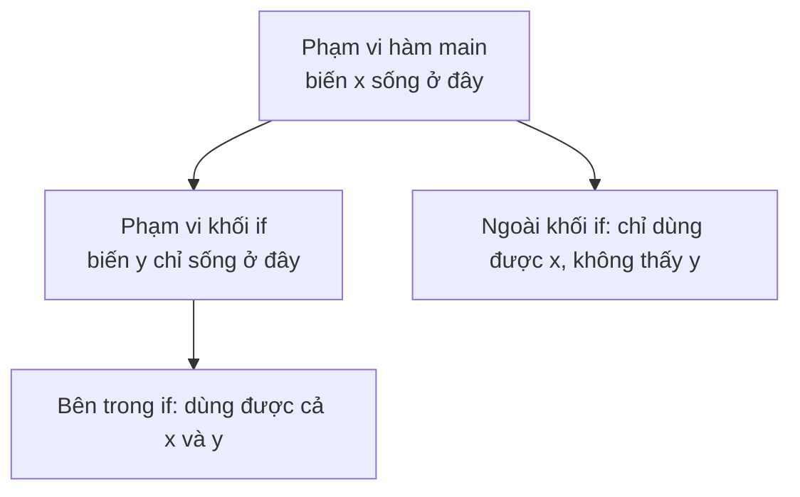

# Biến và phạm vi

Biến là một cái tên đại diện cho ô nhớ chứa dữ liệu, giống chiếc hộp có dán nhãn để bạn cất và lấy giá trị ra dùng. Hiểu cách khai báo biến và phạm vi sống của nó giúp bạn quản lý dữ liệu gọn gàng và tránh lỗi truy cập sai chỗ. Bài này giới thiệu cách khai báo, quy tắc đặt tên, ba loại biến, phạm vi (scope), từ khóa var và hằng số final; phần chi tiết nằm bên dưới.

[](pathname:///img/java/bien-va-pham-vi.webp)

---

:::note[Ghi nhớ nhanh]

- ⭐ **Biến** — cái tên đại diện cho ô nhớ; gán bằng `=` (nghĩa "gán", không phải "bằng nhau").
- **Ba loại biến** — cục bộ (`local`), instance, và static (`static`).
- **Scope (phạm vi)** — biến chỉ sống trong cặp `{ }` chứa nó.
- **`var`** — cho Java tự suy luận kiểu của biến cục bộ (phải gán giá trị ngay).
- **`final`** — tạo hằng số không thể thay đổi.

:::

---

## Mục lục

- [Vì sao cần biến và phạm vi?](#vì-sao-cần-biến-và-phạm-vi)
- [Biến là gì?](#biến-là-gì)
- [Khai báo và gán giá trị](#khai-báo-và-gán-giá-trị)
- [Quy tắc đặt tên biến](#quy-tắc-đặt-tên-biến)
- [Ba loại biến trong Java](#ba-loại-biến-trong-java)
- [Phạm vi (scope) của biến](#phạm-vi-scope-của-biến)
- [Từ khóa var — suy luận kiểu](#từ-khóa-var--suy-luận-kiểu)
- [Hằng số với final](#hằng-số-với-final)
- [Lỗi thường gặp](#lỗi-thường-gặp)
- [Tóm tắt](#tóm-tắt)
- [Câu hỏi phỏng vấn](#câu-hỏi-phỏng-vấn)

---

## Vì sao cần biến và phạm vi?

**Vấn đề:** Nếu không có biến, mọi giá trị phải ghi cứng (hardcode) vào từng dòng code. Tệ hơn, nếu tất cả biến đều toàn cục (accessible everywhere), chương trình lớn lên sẽ xảy ra xung đột tên, vô tình ghi đè dữ liệu của nhau và rất khó debug.

```java
// Không dùng biến → lặp lại giá trị, khó thay đổi
System.out.println("Xin chào " + "An" + ", tuổi: " + 25);
System.out.println("Điểm của " + "An" + " là: " + 90);
// Muốn đổi tên phải sửa ở nhiều chỗ!

// Nếu mọi biến đều toàn cục:
// method1 khai báo int x = 10;
// method2 vô tình đặt trùng int x = 99; → ghi đè, bug khó tìm
```

**Giải pháp:** Biến cho phép đặt tên cho giá trị, dùng lại nhiều lần và dễ thay đổi. Phạm vi (scope) giới hạn biến trong khối `{ }` khai báo — biến tự được giải phóng khi ra khỏi scope, tránh xung đột tên và tiết kiệm bộ nhớ.

```java
// Dùng biến → chỉ cần đổi một chỗ
String ten = "An";
int tuoi = 25;
int diem = 90;
System.out.println("Xin chào " + ten + ", tuổi: " + tuoi);
System.out.println("Điểm của " + ten + " là: " + diem);

// Phạm vi giúp tách biệt → không xung đột
void method1() { int x = 10; } // x này không ảnh hưởng đến method2
void method2() { int x = 99; } // x riêng, an toàn
```

:::tip[Dùng thực tế]
- Lưu tên người dùng vào biến `tenNguoiDung` rồi dùng xuyên suốt màn hình thay vì gõ cứng nhiều chỗ.
- Biến đếm vòng lặp (`i`, `count`) chỉ cần sống trong khối vòng lặp, tự giải phóng sau đó.
- Biến tạm trong khối `if` (ví dụ `double discount`) chỉ hữu dụng trong điều kiện đó, không làm "rác" ở chỗ khác.
- Dùng `final` cho các hằng số như thuế suất, giới hạn kí tự — đặt tên rõ ràng thay vì để số "ma thuật" 0.1 lẫn vào code.
:::

---

## Biến là gì?

**Biến** (variable — một cái tên đại diện cho một ô nhớ chứa dữ liệu) giống như một chiếc hộp có dán nhãn. Nhãn là tên biến, bên trong hộp là giá trị. Bạn có thể lấy giá trị ra dùng hoặc thay giá trị mới vào.

Ví dụ: biến `tuoi` chứa số `25`. Khi bạn sinh nhật, bạn thay giá trị thành `26`.

---

## Khai báo và gán giá trị

**Khai báo** (declaration — tạo ra biến với một kiểu và tên) gồm hai phần: kiểu dữ liệu và tên biến. **Gán** (assignment — đặt giá trị vào biến) dùng dấu `=`.

```java
public class ViDuKhaiBao {
    public static void main(String[] args) {
        // Cách 1: khai báo rồi gán sau
        int diem;          // khai báo biến diem kiểu int
        diem = 90;         // gán giá trị 90

        // Cách 2: khai báo và gán cùng lúc (phổ biến)
        int tuoi = 25;
        String ten = "An";

        // Thay đổi giá trị biến
        tuoi = 26;         // gán giá trị mới

        System.out.println(ten + " - tuoi: " + tuoi + ", diem: " + diem);
    }
}
```

Dấu `=` trong lập trình KHÔNG có nghĩa "bằng nhau" như toán học, mà nghĩa là "gán giá trị bên phải vào biến bên trái".

---

## Quy tắc đặt tên biến

- Bắt đầu bằng chữ cái, dấu `_` hoặc `$` (không bắt đầu bằng số).
- Không chứa khoảng trắng, không trùng với từ khóa (`int`, `class`...).
- Phân biệt hoa/thường: `Tuoi` khác `tuoi`.
- Quy ước: tên biến viết kiểu **camelCase** — chữ đầu thường, các từ sau viết hoa chữ cái đầu, ví dụ `hoTenDayDu`.

```java
// Đúng
int soLuong = 10;
double giaTienSanPham = 99.5;

// Sai cú pháp
// int 2so = 5;        // không được bắt đầu bằng số
// int so luong = 5;   // không được có khoảng trắng
```

---

## Ba loại biến trong Java

```java
public class ViDuLoaiBien {
    // 1) Biến static (biến lớp): chung cho cả class, có từ khóa static
    static String tenTruong = "Dai hoc Bach Khoa";

    // 2) Biến instance (biến đối tượng): mỗi đối tượng có bản riêng
    int diemSinhVien;

    public static void main(String[] args) {
        // 3) Biến cục bộ (local): khai báo trong hàm, chỉ sống trong hàm
        int bienCucBo = 100;
        System.out.println(tenTruong + " - " + bienCucBo);
    }
}
```

- **Biến cục bộ** (local variable): khai báo bên trong một hàm hoặc khối, chỉ tồn tại trong đó. Phải gán giá trị trước khi dùng.
- **Biến instance** (instance variable): khai báo trong class nhưng ngoài hàm; mỗi đối tượng tạo ra có một bản sao riêng.
- **Biến static** (static variable / biến lớp): có từ khóa `static`; dùng chung cho mọi đối tượng của class.

(Biến instance và static sẽ rõ hơn khi bạn học OOP.)

---

## Phạm vi (scope) của biến

**Scope** (phạm vi — vùng code mà biến có thể được sử dụng) thường nằm trong cặp `{ }` nơi biến được khai báo. Ra khỏi cặp ngoặc đó, biến "biến mất".

```java
public class ViDuScope {
    public static void main(String[] args) {
        int x = 10;            // x sống trong toàn bộ hàm main

        if (x > 5) {
            int y = 20;        // y chỉ sống TRONG khối if này
            System.out.println(x + y); // dùng được cả x và y
        }
        // Ở đây không dùng được y nữa, vì đã ra khỏi khối if
        System.out.println(x); // x vẫn dùng được
        // System.out.println(y); // LỖI: y ngoài phạm vi
    }
}
```

Nguyên tắc: biến chỉ "sống" trong khối `{ }` chứa nó. Đây giúp tránh nhầm lẫn giữa các biến cùng tên ở những nơi khác nhau.

Sơ đồ phạm vi sống của biến theo khối lệnh:



---

## Từ khóa var — suy luận kiểu

Từ Java 10 trở đi, bạn có thể dùng `var` để Java **tự suy luận kiểu** (type inference — máy tự đoán kiểu dựa trên giá trị gán). Chỉ dùng được cho **biến cục bộ** và phải gán giá trị ngay.

```java
public class ViDuVar {
    public static void main(String[] args) {
        var soLuong = 10;        // Java hiểu đây là int
        var giaTien = 99.5;      // Java hiểu đây là double
        var ten = "Java";        // Java hiểu đây là String

        // var KHÔNG có nghĩa là kiểu thay đổi được;
        // soLuong vẫn mãi là int.
        soLuong = 20;            // OK, vẫn là int
        // soLuong = "hai muoi"; // LỖI: không gán String cho int được

        System.out.println(ten + ": " + soLuong);
    }
}
```

Lưu ý: `var` không làm Java thành ngôn ngữ "lỏng kiểu". Kiểu được xác định cố định ngay lúc khai báo, chỉ là bạn không phải gõ tên kiểu ra.

---

## Hằng số với final

**Hằng số** (constant — giá trị không thay đổi sau khi gán) được tạo bằng từ khóa `final`. Theo quy ước, tên hằng viết HOA toàn bộ.

```java
public class ViDuHangSo {
    public static void main(String[] args) {
        final double THUE_VAT = 0.1;  // 10%, không đổi được
        // THUE_VAT = 0.2;            // LỖI: không gán lại final

        double giaGoc = 100;
        double giaSauThue = giaGoc + giaGoc * THUE_VAT;
        System.out.println("Gia sau thue: " + giaSauThue);
    }
}
```

---

## Lỗi thường gặp

- **Dùng biến cục bộ chưa gán giá trị** → lỗi "might not have been initialized".
- **Dùng biến ngoài phạm vi** của nó → lỗi "cannot find symbol".
- **Khai báo trùng tên biến** trong cùng một khối.
- **Gán lại biến `final`** → lỗi vì hằng số không đổi được.
- **Dùng `var` mà không gán giá trị ngay**: `var x;` sai, phải `var x = 5;`.

---

## Tóm tắt

- **Biến** là cái tên đại diện cho ô nhớ chứa giá trị; gán bằng dấu `=`.
- Có 3 loại: **cục bộ**, **instance**, **static**.
- **Scope** (phạm vi) của biến giới hạn trong cặp `{ }` chứa nó.
- `var` cho phép Java **tự suy luận kiểu** của biến cục bộ.
- `final` tạo **hằng số** không thể thay đổi.

---

## Câu hỏi phỏng vấn

Những câu thường gặp về chủ đề này. Tự trả lời trước, rồi bấm **Xem đáp án** để đối chiếu.

**1. Ba loại biến trong Java (cục bộ, instance, static) khác nhau thế nào?**

<details className="qa">
<summary>Xem đáp án</summary>

| Loại biến | Khai báo ở đâu | Số bản sao | Giá trị mặc định | Thời điểm sống |
|---|---|---|---|---|
| Cục bộ (local) | Trong hàm/khối lệnh | Riêng mỗi lần hàm chạy | Không có, phải tự gán | Từ lúc khai báo tới hết khối `{ }` |
| Instance | Trong class, ngoài hàm, không có `static` | Mỗi object (đối tượng) một bản riêng | Có (`0`, `null`, `false`...) | Từ lúc tạo object tới lúc object bị dọn rác (garbage collected) |
| Static | Trong class, có từ khóa `static` | Một bản **duy nhất** dùng chung cho cả class | Có | Từ lúc class được nạp (loaded) tới khi chương trình kết thúc |

- Biến cục bộ nằm trên **stack**, biến instance/static nằm trên **heap** (là một phần của object hoặc class).
- Sửa biến static ở một object sẽ ảnh hưởng tới tất cả object khác, vì chúng cùng dùng chung một ô nhớ.

</details>

**2. Vì sao biến cục bộ bắt buộc phải gán giá trị trước khi dùng, còn biến instance và biến static thì Java tự gán giá trị mặc định?**

<details className="qa">
<summary>Xem đáp án</summary>

- **Biến cục bộ** nằm trên stack, compiler không có bước "khởi tạo mặc định" cho stack — nếu cho phép dùng biến chưa gán, giá trị đọc được sẽ là rác bộ nhớ còn sót lại, dẫn tới lỗi khó lường. Vì vậy Java bắt compiler kiểm tra **definite assignment** (phải chắc chắn đã gán trước khi dùng) và báo lỗi biên dịch nếu chưa.
- **Biến instance/static** nằm trên heap. Khi JVM cấp phát vùng nhớ cho object hoặc nạp class, nó luôn dọn vùng nhớ đó về giá trị mặc định trước (`0` cho số, `false` cho `boolean`, `null` cho kiểu tham chiếu) — đây là hành vi được đảm bảo bởi JVM, nên không bắt buộc lập trình viên phải tự gán.
- Đây cũng là lý do lỗi "variable might not have been initialized" chỉ xảy ra với biến cục bộ, không xảy ra với field của class.

</details>

**3. Từ khóa `var` (Java 10+) hoạt động thế nào? Dùng `var` có làm Java trở thành ngôn ngữ kiểu động (dynamically typed) không?**

<details className="qa">
<summary>Xem đáp án</summary>

- `var` là **type inference** (suy luận kiểu tại thời điểm biên dịch): compiler nhìn vào giá trị khởi tạo để tự xác định kiểu, rồi "khắc cứng" kiểu đó vào biến — giống hệt như bạn tự gõ kiểu ra.
- Java **vẫn là ngôn ngữ kiểu tĩnh (statically typed)**: kiểu được quyết định lúc biên dịch, không đổi được sau đó, và compiler vẫn bắt lỗi gán sai kiểu.

```java
var soLuong = 10;      // compiler suy ra kiểu int
soLuong = 20;          // OK
// soLuong = "abc";    // Lỗi biên dịch: incompatible types
```

- Hạn chế: chỉ dùng được cho **biến cục bộ** có gán giá trị ngay (không dùng cho field, tham số hàm, kiểu trả về, hay `var x;` không gán).
- Dùng `var` hợp lý khi kiểu đã rõ ràng từ vế phải (ví dụ `var list = new ArrayList<String>();`); nên tránh khi làm giảm khả năng đọc code (ví dụ `var result = xuLy();` mà không rõ `xuLy` trả về gì).

</details>

**4. Khai báo `final List<String> ds = new ArrayList<>();` rồi gọi `ds.add("A")` có hợp lệ không? Vì sao?**

<details className="qa">
<summary>Xem đáp án</summary>

**Hợp lệ.** `final` trên một biến kiểu tham chiếu chỉ khóa **tham chiếu** (reference — địa chỉ mà biến đang trỏ tới), không khóa **nội dung bên trong object** mà nó trỏ tới.

```java
final List<String> ds = new ArrayList<>();
ds.add("A");       // OK — sửa nội dung object, không đổi tham chiếu
// ds = new ArrayList<>(); // LỖI — không được gán lại tham chiếu khác
```

- Muốn danh sách thực sự không đổi được, phải bọc bằng `List.copyOf(...)` hoặc `Collections.unmodifiableList(...)`, gọi `.add()` trên đó sẽ ném `UnsupportedOperationException`.
- Đây là điểm hay bị hỏi để phân biệt "final reference" và "immutable object" — hai khái niệm khác nhau.

</details>

**5. Đoạn code dưới đây in ra gì? Nếu bỏ comment dòng cuối thì lỗi gì xảy ra?**

```java
public class Test {
    public static void main(String[] args) {
        int x = 5;
        if (x > 0) {
            int y = 10;
            System.out.println(x + y);
        }
        // System.out.println(y);
    }
}
```

<details className="qa">
<summary>Xem đáp án</summary>

- Chương trình in ra `15` (`x + y` = `5 + 10`).
- Nếu bỏ comment `System.out.println(y);`, chương trình **không biên dịch được** — lỗi `cannot find symbol` vì `y` chỉ tồn tại trong **scope** của khối `if`, đã "biến mất" khi ra khỏi cặp `{ }` đó.
- Đây là ví dụ điển hình của nguyên tắc: biến chỉ sống trong khối lệnh khai báo ra nó.

</details>

**6. Cho đoạn code sau, `Counter.count` in ra giá trị bao nhiêu? Giải thích.**

```java
public class Counter {
    static int count = 0;
    Counter() {
        count++;
    }
}

public class Main {
    public static void main(String[] args) {
        new Counter();
        new Counter();
        new Counter();
        System.out.println(Counter.count);
    }
}
```

<details className="qa">
<summary>Xem đáp án</summary>

Kết quả in ra là **`3`**.

- `count` là biến **static** — chỉ có **một bản duy nhất** thuộc về class `Counter`, không phải thuộc về từng object.
- Mỗi lần `new Counter()` chạy, constructor tăng `count` lên 1, và vì cả ba object cùng chia sẻ một ô nhớ `count`, giá trị cộng dồn qua cả ba lần khởi tạo.
- Đây chính là kỹ thuật thường dùng để đếm số lượng object đã được tạo ra từ một class.

</details>

**7. "Effectively final" là gì? Vì sao lambda expression hoặc anonymous inner class chỉ được truy cập biến cục bộ effectively final (hoặc `final`) từ scope bao ngoài?**

<details className="qa">
<summary>Xem đáp án</summary>

- **Effectively final** (hiệu quả như final): một biến cục bộ tuy không khai báo `final` nhưng **không hề bị gán lại giá trị** sau khi khởi tạo — Java coi nó tương đương biến `final`.

```java
int soLuong = 10; // không có final, nhưng không đổi -> effectively final
Runnable r = () -> System.out.println(soLuong); // OK
```

- Lý do kỹ thuật: lambda/anonymous class không thực sự "dùng chung" biến cục bộ của method bao ngoài — chúng **copy giá trị** tại thời điểm tạo ra (vì biến cục bộ nằm trên stack, có thể bị hủy khi method kết thúc trong khi lambda vẫn còn sống, ví dụ khi trả về hoặc chạy ở thread khác). Nếu cho phép sửa biến gốc sau đó, giá trị bên trong lambda và bên ngoài sẽ lệch nhau mà lập trình viên không hay biết — vì vậy Java bắt buộc biến phải bất biến trong toàn bộ scope chứa lambda.

</details>

**8. Bạn cần đếm số lượng object đã tạo ra từ một class (ví dụ số `User` đã đăng ký). Bạn dùng biến instance hay biến static? Vì sao?**

<details className="qa">
<summary>Xem đáp án</summary>

Dùng **biến static**, vì đây là thông tin thuộc về **cả class** (tổng số lượng), không phải thông tin riêng của từng object.

```java
public class User {
    static int soLuongDaTao = 0;
    String ten;

    User(String ten) {
        this.ten = ten;
        soLuongDaTao++;
    }
}
```

- Nếu dùng biến instance, mỗi `User` sẽ có một bộ đếm riêng, luôn bằng `1` hoặc không phản ánh đúng tổng số — sai mục đích.
- Lưu ý thực tế: nếu chương trình đa luồng (multi-thread), tăng biến static kiểu `count++` không an toàn (không phải thao tác nguyên tử — atomic), cần dùng `AtomicInteger` hoặc đồng bộ hóa (`synchronized`) để tránh đếm sai.

</details>

**9. Khi truyền một biến kiểu nguyên thủy (`int`) và một biến kiểu tham chiếu (object) vào method, thay đổi bên trong method có ảnh hưởng tới biến gốc bên ngoài không? Java truyền tham số theo kiểu gì?**

<details className="qa">
<summary>Xem đáp án</summary>

Java **luôn truyền tham số theo giá trị (pass-by-value)** — kể cả với object.

```java
static void doiSo(int x) { x = 100; }
static void doiTen(StringBuilder sb) { sb.append(" - da doi"); }

int a = 5;
doiSo(a);
System.out.println(a); // vẫn là 5 — giá trị int được copy, đổi bản copy không ảnh hưởng bản gốc

StringBuilder sb = new StringBuilder("Ten");
doiTen(sb);
System.out.println(sb); // "Ten - da doi" — vì cái được copy là THAM CHIẾU (địa chỉ),
                          // cả bản copy và bản gốc cùng trỏ tới MỘT object trên heap
```

- Với kiểu nguyên thủy: giá trị được copy, method sửa bản copy, không ảnh hưởng biến gốc.
- Với kiểu tham chiếu: **tham chiếu** (địa chỉ) được copy, không phải object. Sửa **nội dung** object qua tham chiếu đó sẽ thấy thay đổi ở ngoài; nhưng nếu gán tham chiếu tham số sang object khác (`sb = new StringBuilder("Khac");`) thì biến gốc bên ngoài **không** đổi theo, vì chỉ bản copy tham chiếu trong method bị đổi hướng.

</details>
