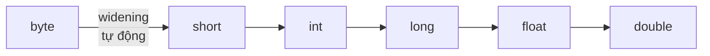

# Ép kiểu (Type Casting)

Ép kiểu là việc chuyển một giá trị từ kiểu dữ liệu này sang kiểu khác, cần thiết khi bạn muốn dùng một giá trị ở dạng khác (ví dụ lấy phần nguyên của một số thực). Nắm vững ép kiểu giúp bạn tránh mất mát dữ liệu và lỗi tràn số ngoài ý muốn. Bài này giới thiệu ép kiểu mở rộng (tự động) và thu hẹp (thủ công), cũng như cách chuyển đổi giữa số và chuỗi; phần chi tiết nằm bên dưới.

---

:::note[Ghi nhớ nhanh]

- ⭐ **Hai hướng ép kiểu** — mở rộng (nhỏ→lớn) tự động, an toàn; thu hẹp (lớn→nhỏ) phải ghi `(kiểu)` và có thể mất dữ liệu.
- **Thu hẹp** — chỉ **cắt** phần thập phân (không làm tròn); vượt phạm vi gây **tràn số**.
- **Số ↔ chuỗi** — số→chuỗi dùng `String.valueOf`; chuỗi→số dùng `Integer.parseInt`, `Double.parseDouble`.
- **Chia số nguyên** — chia hai `int` ra `int`; ép `(double)` một toán hạng để có số thực.

:::

---

## Mục lục

- [Vì sao Java phân biệt các kiểu ép kiểu?](#vì-sao-java-phân-biệt-các-kiểu-ép-kiểu)
- [Ép kiểu là gì?](#ép-kiểu-là-gì)
- [Ép kiểu ngầm định (widening)](#ép-kiểu-ngầm-định-widening)
- [Ép kiểu tường minh (narrowing)](#ép-kiểu-tường-minh-narrowing)
- [Mất mát dữ liệu khi ép kiểu thu hẹp](#mất-mát-dữ-liệu-khi-ép-kiểu-thu-hẹp)
- [Chuyển đổi giữa số và chuỗi](#chuyển-đổi-giữa-số-và-chuỗi)
- [Ép kiểu trong phép tính](#ép-kiểu-trong-phép-tính)
- [Lỗi thường gặp](#lỗi-thường-gặp)
- [Tóm tắt](#tóm-tắt)

---

## Vì sao Java phân biệt các kiểu ép kiểu?

**Vấn đề:** Chuyển giá trị giữa các kiểu có thể **mất dữ liệu** hoặc cho kết quả sai mà bạn không hề hay biết.

```java
double gia = 199.99;
int giaInt = (int) gia;   // mất phần thập phân -> 199

long soRatLon = 3_000_000_000L;
int soInt = (int) soRatLon; // tràn số -> giá trị âm bất ngờ

Object obj = "xin chao";
Integer so = (Integer) obj; // sai kiểu -> ClassCastException lúc chạy
```

Nếu mọi chuyển đổi đều diễn ra ngầm, bạn sẽ rất khó phát hiện chỗ dữ liệu bị hỏng.

**Giải pháp:** Java tách rõ từng loại để kiểm soát rủi ro thay vì để ngầm.

```java
// 1) WIDENING (nhỏ -> lớn): TỰ ĐỘNG vì luôn an toàn
int a = 100;
long b = a;        // int -> long, không mất dữ liệu

// 2) NARROWING (lớn -> nhỏ): BẮT BUỘC cast tường minh để xác nhận chấp nhận rủi ro
double d = 9.7;
int c = (int) d;   // bạn tự ghi (int) -> ý thức được dữ liệu có thể mất

// 3) Ép kiểu object: kiểm tra instanceof trước để tránh ClassCastException
Object obj = "xin chao";
if (obj instanceof String) {
    String s = (String) obj; // an toàn
}

// 4) Autoboxing: primitive <-> wrapper tự động
Integer boxed = 5;   // int -> Integer
int unboxed = boxed; // Integer -> int
```

:::tip[Dùng thực tế]

- **Lấy phần nguyên:** ép `double → int` khi cần số nguyên (vd tính số sản phẩm từ kết quả phép chia).
- **Đọc dữ liệu nhập:** `Integer.parseInt(input)` để parse `String → int` từ form hay file cấu hình.
- **Xử lý kiểu chung:** kiểm tra `instanceof` trước khi cast object lấy từ danh sách `Object` hay JSON.
- **Hiểu lỗi tràn số:** biết vì sao narrowing cần cast giúp bạn lường trước mất mát dữ liệu khi gán số lớn vào `byte`/`short`/`int`.

:::

---

## Ép kiểu là gì?

**Ép kiểu** (type casting — chuyển một giá trị từ kiểu dữ liệu này sang kiểu khác) cần thiết khi bạn muốn dùng một giá trị ở dạng khác. Ví dụ: bạn có một số thực `9.7` nhưng cần lấy phần nguyên `9`.

Có hai hướng ép kiểu giữa các số:

- **Mở rộng** (widening — từ kiểu nhỏ sang kiểu lớn hơn): an toàn, tự động.
- **Thu hẹp** (narrowing — từ kiểu lớn sang kiểu nhỏ hơn): có thể mất dữ liệu, phải làm thủ công.

Sơ đồ thứ tự mở rộng kiểu (widening) — đi theo chiều mũi tên là tự động, đi ngược lại là thu hẹp phải ép tường minh:



---

## Ép kiểu ngầm định (widening)

**Ép kiểu ngầm định** (implicit casting — Java tự động làm, không cần bạn viết gì thêm) xảy ra khi chuyển từ kiểu nhỏ sang kiểu lớn hơn. Vì kiểu lớn chứa được mọi giá trị của kiểu nhỏ nên không mất dữ liệu.

Thứ tự mở rộng: `byte → short → int → long → float → double`

```java
public class ViDuMoRong {
    public static void main(String[] args) {
        int soNguyen = 100;

        // int -> long: tự động, an toàn
        long soLon = soNguyen;     // không cần viết gì thêm

        // int -> double: tự động
        double soThuc = soNguyen;  // 100 trở thành 100.0

        System.out.println("long: " + soLon);    // 100
        System.out.println("double: " + soThuc); // 100.0
    }
}
```

---

## Ép kiểu tường minh (narrowing)

**Ép kiểu tường minh** (explicit casting — bạn phải tự ghi rõ kiểu đích trong ngoặc) cần khi chuyển từ kiểu lớn sang kiểu nhỏ. Cú pháp: đặt `(kiểuĐích)` trước giá trị.

```java
public class ViDuThuHep {
    public static void main(String[] args) {
        double soThuc = 9.78;

        // double -> int: phải ép tường minh bằng (int)
        int soNguyen = (int) soThuc; // phần thập phân bị cắt bỏ

        System.out.println("Goc: " + soThuc);       // 9.78
        System.out.println("Sau ep: " + soNguyen);  // 9 (mất phần .78)
    }
}
```

Java buộc bạn ghi rõ `(int)` để bạn **ý thức được** rằng dữ liệu có thể bị mất.

---

## Mất mát dữ liệu khi ép kiểu thu hẹp

Khi ép từ kiểu lớn sang kiểu nhỏ không chứa nổi giá trị, kết quả có thể sai lệch:

```java
public class ViDuMatDuLieu {
    public static void main(String[] args) {
        // 1) Cắt phần thập phân
        double gia = 199.99;
        int giaLamTron = (int) gia;  // 199, KHÔNG làm tròn, chỉ cắt
        System.out.println(giaLamTron);

        // 2) Tràn số (overflow) khi giá trị vượt phạm vi
        int soLon = 130;
        byte soNho = (byte) soLon;   // byte chỉ tới 127 -> bị "tràn"
        System.out.println(soNho);   // ra giá trị âm bất ngờ: -126
    }
}
```

Bài học: ép kiểu thu hẹp chỉ **cắt** chứ không **làm tròn**, và nếu vượt phạm vi sẽ bị **tràn số** (overflow — giá trị vượt giới hạn và quay vòng).

---

## Chuyển đổi giữa số và chuỗi

Đây là nhu cầu rất phổ biến, nhưng KHÔNG dùng cú pháp `(kiểu)` mà dùng các phương thức hỗ trợ.

```java
public class ViDuSoVaChuoi {
    public static void main(String[] args) {
        // --- Số sang chuỗi (String) ---
        int tuoi = 25;
        String tuoiChuoi = String.valueOf(tuoi); // "25"
        String cach2 = "" + tuoi;                 // ghép với chuỗi rỗng

        // --- Chuỗi sang số ---
        String soChuoi = "100";
        int so = Integer.parseInt(soChuoi);       // 100 dạng int
        double soThuc = Double.parseDouble("3.14"); // 3.14 dạng double

        System.out.println(tuoiChuoi + " | " + so + " | " + soThuc);
    }
}
```

Ghi nhớ:

- Số → chuỗi: `String.valueOf(...)` hoặc ghép `"" + so`.
- Chuỗi → số nguyên: `Integer.parseInt(...)`.
- Chuỗi → số thực: `Double.parseDouble(...)`.

---

## Ép kiểu trong phép tính

Khi chia hai số nguyên, Java cho kết quả nguyên (cắt phần thập phân). Muốn kết quả thực, phải ép một toán hạng sang `double`.

```java
public class ViDuPhepTinh {
    public static void main(String[] args) {
        int a = 7, b = 2;

        // Chia hai int -> kết quả int (cắt phần dư)
        System.out.println(a / b);          // 3 (KHÔNG phải 3.5)

        // Ép một bên sang double để có kết quả đúng
        System.out.println((double) a / b); // 3.5
    }
}
```

---

## Lỗi thường gặp

- **Tưởng `(int)` làm tròn**: thực ra nó chỉ **cắt** phần thập phân.
- **Chia hai số nguyên rồi mong số thực**: `7/2` ra `3`, phải ép `(double)`.
- **`Integer.parseInt("abc")`** → lỗi `NumberFormatException` vì chuỗi không phải số.
- **Tràn số** khi ép giá trị quá lớn vào kiểu nhỏ (`byte`, `short`).
- **Dùng `(String) so`** để chuyển số sang chuỗi → sai, phải dùng `String.valueOf(...)`.

---

## Tóm tắt

- **Mở rộng** (nhỏ → lớn) tự động, an toàn; **thu hẹp** (lớn → nhỏ) phải ghi `(kiểu)` và có thể mất dữ liệu.
- Ép kiểu thu hẹp **cắt** phần thập phân, không làm tròn; vượt phạm vi gây **tràn số**.
- Số → chuỗi: `String.valueOf`; chuỗi → số: `Integer.parseInt`, `Double.parseDouble`.
- Chia hai `int` ra kết quả `int`; ép `(double)` để được số thực.
