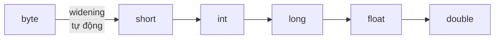

# Ép kiểu (Type Casting)

Ép kiểu là việc chuyển một giá trị từ kiểu dữ liệu này sang kiểu khác, cần thiết khi bạn muốn dùng một giá trị ở dạng khác (ví dụ lấy phần nguyên của một số thực). Nắm vững ép kiểu giúp bạn tránh mất mát dữ liệu và lỗi tràn số ngoài ý muốn. Bài này giới thiệu ép kiểu mở rộng (tự động) và thu hẹp (thủ công), cũng như cách chuyển đổi giữa số và chuỗi; phần chi tiết nằm bên dưới.

[](pathname:///img/java/ep-kieu.webp)

---

:::note[Ghi nhớ nhanh]

- ⭐ **Hai hướng ép kiểu** — mở rộng (nhỏ→lớn) tự động, an toàn; thu hẹp (lớn→nhỏ) phải ghi `(kiểu)` và có thể mất dữ liệu.
- **Thu hẹp** — chỉ **cắt** phần thập phân (không làm tròn); vượt phạm vi gây **tràn số**.
- **Số ↔ chuỗi** — số→chuỗi dùng `String.valueOf`; chuỗi→số dùng `Integer.parseInt`, `Double.parseDouble`.
- **Chia số nguyên** — chia hai `int` ra `int`; ép `(double)` một toán hạng để có số thực.

:::

---

## Mục lục

- [Vì sao Java phân biệt các kiểu ép kiểu?](#vì-sao-java-phân-biệt-các-kiểu-ép-kiểu)
- [Ép kiểu là gì?](#ép-kiểu-là-gì)
- [Ép kiểu ngầm định (widening)](#ép-kiểu-ngầm-định-widening)
- [Ép kiểu tường minh (narrowing)](#ép-kiểu-tường-minh-narrowing)
- [Mất mát dữ liệu khi ép kiểu thu hẹp](#mất-mát-dữ-liệu-khi-ép-kiểu-thu-hẹp)
- [Chuyển đổi giữa số và chuỗi](#chuyển-đổi-giữa-số-và-chuỗi)
- [Ép kiểu trong phép tính](#ép-kiểu-trong-phép-tính)
- [Lỗi thường gặp](#lỗi-thường-gặp)
- [Tóm tắt](#tóm-tắt)
- [Câu hỏi phỏng vấn](#câu-hỏi-phỏng-vấn)

---

## Vì sao Java phân biệt các kiểu ép kiểu?

**Vấn đề:** Chuyển giá trị giữa các kiểu có thể **mất dữ liệu** hoặc cho kết quả sai mà bạn không hề hay biết.

```java
double gia = 199.99;
int giaInt = (int) gia;   // mất phần thập phân -> 199

long soRatLon = 3_000_000_000L;
int soInt = (int) soRatLon; // tràn số -> giá trị âm bất ngờ

Object obj = "xin chao";
Integer so = (Integer) obj; // sai kiểu -> ClassCastException lúc chạy
```

Nếu mọi chuyển đổi đều diễn ra ngầm, bạn sẽ rất khó phát hiện chỗ dữ liệu bị hỏng.

**Giải pháp:** Java tách rõ từng loại để kiểm soát rủi ro thay vì để ngầm.

```java
// 1) WIDENING (nhỏ -> lớn): TỰ ĐỘNG vì luôn an toàn
int a = 100;
long b = a;        // int -> long, không mất dữ liệu

// 2) NARROWING (lớn -> nhỏ): BẮT BUỘC cast tường minh để xác nhận chấp nhận rủi ro
double d = 9.7;
int c = (int) d;   // bạn tự ghi (int) -> ý thức được dữ liệu có thể mất

// 3) Ép kiểu object: kiểm tra instanceof trước để tránh ClassCastException
Object obj = "xin chao";
if (obj instanceof String) {
    String s = (String) obj; // an toàn
}

// 4) Autoboxing: primitive <-> wrapper tự động
Integer boxed = 5;   // int -> Integer
int unboxed = boxed; // Integer -> int
```

:::tip[Dùng thực tế]

- **Lấy phần nguyên:** ép `double → int` khi cần số nguyên (vd tính số sản phẩm từ kết quả phép chia).
- **Đọc dữ liệu nhập:** `Integer.parseInt(input)` để parse `String → int` từ form hay file cấu hình.
- **Xử lý kiểu chung:** kiểm tra `instanceof` trước khi cast object lấy từ danh sách `Object` hay JSON.
- **Hiểu lỗi tràn số:** biết vì sao narrowing cần cast giúp bạn lường trước mất mát dữ liệu khi gán số lớn vào `byte`/`short`/`int`.

:::

---

## Ép kiểu là gì?

**Ép kiểu** (type casting — chuyển một giá trị từ kiểu dữ liệu này sang kiểu khác) cần thiết khi bạn muốn dùng một giá trị ở dạng khác. Ví dụ: bạn có một số thực `9.7` nhưng cần lấy phần nguyên `9`.

Có hai hướng ép kiểu giữa các số:

- **Mở rộng** (widening — từ kiểu nhỏ sang kiểu lớn hơn): an toàn, tự động.
- **Thu hẹp** (narrowing — từ kiểu lớn sang kiểu nhỏ hơn): có thể mất dữ liệu, phải làm thủ công.

Sơ đồ thứ tự mở rộng kiểu (widening) — đi theo chiều mũi tên là tự động, đi ngược lại là thu hẹp phải ép tường minh:


```mermaid
flowchart LR
    A["byte"] -->|"widening<br/>tự động"| B["short"]
    B --> C["int"]
    C --> D["long"]
    D --> E["float"]
    E --> F["double"]
```

---

## Ép kiểu ngầm định (widening)

**Ép kiểu ngầm định** (implicit casting — Java tự động làm, không cần bạn viết gì thêm) xảy ra khi chuyển từ kiểu nhỏ sang kiểu lớn hơn. Vì kiểu lớn chứa được mọi giá trị của kiểu nhỏ nên không mất dữ liệu.

Thứ tự mở rộng: `byte → short → int → long → float → double`

```java
public class ViDuMoRong {
    public static void main(String[] args) {
        int soNguyen = 100;

        // int -> long: tự động, an toàn
        long soLon = soNguyen;     // không cần viết gì thêm

        // int -> double: tự động
        double soThuc = soNguyen;  // 100 trở thành 100.0

        System.out.println("long: " + soLon);    // 100
        System.out.println("double: " + soThuc); // 100.0
    }
}
```

---

## Ép kiểu tường minh (narrowing)

**Ép kiểu tường minh** (explicit casting — bạn phải tự ghi rõ kiểu đích trong ngoặc) cần khi chuyển từ kiểu lớn sang kiểu nhỏ. Cú pháp: đặt `(kiểuĐích)` trước giá trị.

```java
public class ViDuThuHep {
    public static void main(String[] args) {
        double soThuc = 9.78;

        // double -> int: phải ép tường minh bằng (int)
        int soNguyen = (int) soThuc; // phần thập phân bị cắt bỏ

        System.out.println("Goc: " + soThuc);       // 9.78
        System.out.println("Sau ep: " + soNguyen);  // 9 (mất phần .78)
    }
}
```

Java buộc bạn ghi rõ `(int)` để bạn **ý thức được** rằng dữ liệu có thể bị mất.

---

## Mất mát dữ liệu khi ép kiểu thu hẹp

Khi ép từ kiểu lớn sang kiểu nhỏ không chứa nổi giá trị, kết quả có thể sai lệch:

```java
public class ViDuMatDuLieu {
    public static void main(String[] args) {
        // 1) Cắt phần thập phân
        double gia = 199.99;
        int giaLamTron = (int) gia;  // 199, KHÔNG làm tròn, chỉ cắt
        System.out.println(giaLamTron);

        // 2) Tràn số (overflow) khi giá trị vượt phạm vi
        int soLon = 130;
        byte soNho = (byte) soLon;   // byte chỉ tới 127 -> bị "tràn"
        System.out.println(soNho);   // ra giá trị âm bất ngờ: -126
    }
}
```

Bài học: ép kiểu thu hẹp chỉ **cắt** chứ không **làm tròn**, và nếu vượt phạm vi sẽ bị **tràn số** (overflow — giá trị vượt giới hạn và quay vòng).

---

## Chuyển đổi giữa số và chuỗi

Đây là nhu cầu rất phổ biến, nhưng KHÔNG dùng cú pháp `(kiểu)` mà dùng các phương thức hỗ trợ.

```java
public class ViDuSoVaChuoi {
    public static void main(String[] args) {
        // --- Số sang chuỗi (String) ---
        int tuoi = 25;
        String tuoiChuoi = String.valueOf(tuoi); // "25"
        String cach2 = "" + tuoi;                 // ghép với chuỗi rỗng

        // --- Chuỗi sang số ---
        String soChuoi = "100";
        int so = Integer.parseInt(soChuoi);       // 100 dạng int
        double soThuc = Double.parseDouble("3.14"); // 3.14 dạng double

        System.out.println(tuoiChuoi + " | " + so + " | " + soThuc);
    }
}
```

Ghi nhớ:

- Số → chuỗi: `String.valueOf(...)` hoặc ghép `"" + so`.
- Chuỗi → số nguyên: `Integer.parseInt(...)`.
- Chuỗi → số thực: `Double.parseDouble(...)`.

---

## Ép kiểu trong phép tính

Khi chia hai số nguyên, Java cho kết quả nguyên (cắt phần thập phân). Muốn kết quả thực, phải ép một toán hạng sang `double`.

```java
public class ViDuPhepTinh {
    public static void main(String[] args) {
        int a = 7, b = 2;

        // Chia hai int -> kết quả int (cắt phần dư)
        System.out.println(a / b);          // 3 (KHÔNG phải 3.5)

        // Ép một bên sang double để có kết quả đúng
        System.out.println((double) a / b); // 3.5
    }
}
```

---

## Lỗi thường gặp

- **Tưởng `(int)` làm tròn**: thực ra nó chỉ **cắt** phần thập phân.
- **Chia hai số nguyên rồi mong số thực**: `7/2` ra `3`, phải ép `(double)`.
- **`Integer.parseInt("abc")`** → lỗi `NumberFormatException` vì chuỗi không phải số.
- **Tràn số** khi ép giá trị quá lớn vào kiểu nhỏ (`byte`, `short`).
- **Dùng `(String) so`** để chuyển số sang chuỗi → sai, phải dùng `String.valueOf(...)`.

---

## Tóm tắt

- **Mở rộng** (nhỏ → lớn) tự động, an toàn; **thu hẹp** (lớn → nhỏ) phải ghi `(kiểu)` và có thể mất dữ liệu.
- Ép kiểu thu hẹp **cắt** phần thập phân, không làm tròn; vượt phạm vi gây **tràn số**.
- Số → chuỗi: `String.valueOf`; chuỗi → số: `Integer.parseInt`, `Double.parseDouble`.
- Chia hai `int` ra kết quả `int`; ép `(double)` để được số thực.

---

## Câu hỏi phỏng vấn

Những câu thường gặp về chủ đề này. Tự trả lời trước, rồi bấm **Xem đáp án** để đối chiếu.

**1. Phân biệt widening (ép kiểu mở rộng) và narrowing (ép kiểu thu hẹp). Vì sao Java cho widening chạy tự động còn narrowing bắt buộc phải viết `(kiểu)`?**

<details className="qa">
<summary>Xem đáp án</summary>

- **Widening**: chuyển từ kiểu có phạm vi giá trị nhỏ sang kiểu có phạm vi lớn hơn (ví dụ `int → long → double`). Kiểu đích luôn chứa được mọi giá trị của kiểu nguồn nên **không thể mất dữ liệu** — Java cho phép tự động, không cần cast.
- **Narrowing**: chuyển từ kiểu phạm vi lớn sang kiểu phạm vi nhỏ hơn (ví dụ `double → int`, `int → byte`). Kiểu đích có thể **không chứa nổi** giá trị nguồn, dẫn tới mất phần thập phân hoặc tràn số (overflow). Java bắt buộc viết `(kiểuĐích)` để lập trình viên **chủ động xác nhận** mình chấp nhận rủi ro mất dữ liệu, thay vì để lỗi âm thầm xảy ra.

</details>

**2. Thứ tự mở rộng kiểu số trong Java là gì? Ép `char` sang `int` có phải là widening không?**

<details className="qa">
<summary>Xem đáp án</summary>

Thứ tự widening giữa các kiểu số: `byte → short → int → long → float → double`.

- `char` không nằm hẳn trong chuỗi trên nhưng vẫn widening được sang `int` (và các kiểu lớn hơn), vì `char` được lưu trữ nội bộ như một số nguyên không dấu 16-bit (giá trị Unicode của ký tự).

```java
char c = 'A';
int ma = c;             // widening tự động: ma = 65 (mã ASCII/Unicode của 'A')
System.out.println(ma); // 65
```

- Chiều ngược lại (`int → char`) là narrowing, phải ép tường minh: `char c2 = (char) 66; // 'B'`.

</details>

**3. So sánh ép kiểu giữa các kiểu số (numeric casting) và ép kiểu giữa các đối tượng (object casting, ví dụ `(String) obj`). Vì sao object casting có thể ném ra `ClassCastException` lúc runtime?**

<details className="qa">
<summary>Xem đáp án</summary>

| | Numeric casting | Object casting |
|---|---|---|
| Chuyển đổi gì | Biểu diễn nhị phân của giá trị số | Chỉ đổi **kiểu nhìn nhận** (view) của compiler với cùng một object, không tạo object mới |
| Rủi ro | Mất phần thập phân, tràn số (âm thầm, không ném exception) | Ném `ClassCastException` (`ép kiểu sai lớp`) ngay lúc chạy nếu object thực sự không phải kiểu đó |
| Cách phòng tránh | Kiểm tra phạm vi giá trị trước khi ép | Kiểm tra `instanceof` trước khi ép |

```java
Object obj = "xin chao";
Integer so = (Integer) obj; // biên dịch OK, nhưng ném ClassCastException lúc chạy
                              // vì obj thực chất là String, không phải Integer

if (obj instanceof String) {
    String s = (String) obj; // an toàn, vì đã kiểm tra trước
}
```

Object casting không chuyển đổi dữ liệu — object trên heap giữ nguyên kiểu thật của nó, cast chỉ cho compiler biết "hãy coi biến này như kiểu X"; JVM kiểm tra thật ở runtime và ném lỗi nếu sai.

</details>

**4. Output của đoạn code sau là gì?**

```java
public class Test {
    public static void main(String[] args) {
        int a = 130;
        byte b = (byte) a;
        System.out.println(b);
    }
}
```

<details className="qa">
<summary>Xem đáp án</summary>

Kết quả in ra là **`-126`**.

- `byte` trong Java chỉ lưu được từ `-128` đến `127` (8-bit, có dấu).
- `130` vượt phạm vi này, nên khi ép kiểu thu hẹp, JVM chỉ giữ lại 8-bit thấp nhất của giá trị nhị phân rồi diễn giải lại theo `byte` có dấu, gây ra hiện tượng **tràn số (overflow)** — kết quả "quay vòng" thành một số âm bất ngờ thay vì báo lỗi.
- Đây là lý do ép kiểu thu hẹp giữa các kiểu số **không bao giờ ném exception**, chỉ âm thầm cho kết quả sai — khác hẳn với object casting.

</details>

**5. Output của đoạn code sau là gì? Giải thích vì sao có sự khác nhau.**

```java
public class Test {
    public static void main(String[] args) {
        System.out.println(5 / 2);
        System.out.println(5.0 / 2);
        System.out.println((double) 5 / 2);
        System.out.println(5 / 2.0);
    }
}
```

<details className="qa">
<summary>Xem đáp án</summary>

Kết quả lần lượt: `2`, `2.5`, `2.5`, `2.5`.

- `5 / 2`: cả hai toán hạng là `int` → Java thực hiện **phép chia nguyên**, cắt bỏ phần thập phân → `2`.
- `5.0 / 2`, `(double) 5 / 2`, `5 / 2.0`: chỉ cần **một trong hai toán hạng** là `double`, Java tự động widening toán hạng còn lại sang `double` trước khi tính, nên phép chia trở thành chia số thực → `2.5`.
- Quy tắc chung: kiểu kết quả của phép toán hai ngôi phụ thuộc vào **kiểu "lớn" hơn** giữa hai toán hạng.

</details>

**6. `Integer.parseInt("12.5")` có chạy được không? Nếu không, lỗi gì xảy ra và cách xử lý an toàn?**

<details className="qa">
<summary>Xem đáp án</summary>

**Không chạy được** — `Integer.parseInt` chỉ nhận chuỗi biểu diễn số nguyên hợp lệ (không có dấu chấm thập phân). Với `"12.5"`, nó ném ra `NumberFormatException` (`java.lang.NumberFormatException: For input string: "12.5"`).

Cách xử lý an toàn khi input không đáng tin (ví dụ từ người dùng nhập):

```java
String input = "12.5";
try {
    int so = Integer.parseInt(input);
    System.out.println(so);
} catch (NumberFormatException e) {
    System.out.println("Chuỗi không phải số nguyên hợp lệ: " + input);
}
```

Nếu input thực sự là số thực, dùng `Double.parseDouble(input)` rồi tự quyết định có ép sang `int` hay không.

</details>

**7. Autoboxing/unboxing là gì? Đoạn code sau tiềm ẩn lỗi gì?**

```java
Integer so = null;
int x = so;
```

<details className="qa">
<summary>Xem đáp án</summary>

- **Autoboxing**: Java tự động chuyển kiểu nguyên thủy (`int`) thành kiểu wrapper tương ứng (`Integer`) khi cần, ví dụ `Integer i = 5;` (thực chất là `Integer.valueOf(5)`).
- **Unboxing**: chiều ngược lại, tự động lấy giá trị nguyên thủy ra từ wrapper, ví dụ `int i2 = i;` (thực chất là `i.intValue()`).

Đoạn code trên ném ra **`NullPointerException`** lúc chạy: `so` đang là `null`, nhưng gán cho biến `int` (kiểu nguyên thủy không thể là `null`) buộc Java phải tự động gọi `so.intValue()` để unbox — gọi method trên một tham chiếu `null` gây lỗi ngay lập tức.

- Bài học thực tế: cẩn thận khi dùng kiểu wrapper (`Integer`, `Long`...) lấy từ Map, JSON, hoặc kết quả có thể `null` (ví dụ trường tùy chọn trong database) rồi gán trực tiếp vào biến nguyên thủy.

</details>

**8. Vì sao `(int) 9.99` cho ra `9` thay vì `10`? Muốn làm tròn đúng nghĩa thì dùng gì?**

<details className="qa">
<summary>Xem đáp án</summary>

Ép kiểu narrowing từ số thực sang số nguyên trong Java chỉ đơn giản là **cắt bỏ (truncate)** phần thập phân, không quan tâm phần đó gần `0` hay gần `1` — nên `(int) 9.99` luôn ra `9`, và `(int) -9.99` ra `-9` (cắt về phía `0`, không phải làm tròn xuống).

Muốn làm tròn đúng nghĩa toán học, dùng `Math.round(...)`:

```java
System.out.println((int) 9.99);      // 9 (cắt bỏ phần thập phân)
System.out.println(Math.round(9.99)); // 10 (làm tròn tới số nguyên gần nhất)
```

Lưu ý: `Math.round(double)` trả về `long`, còn `Math.round(float)` trả về `int` — cần ép kiểu thêm nếu muốn lấy `int` từ tham số `double`.

</details>

**9. Với hai phương thức nạp chồng (overload) `void in(int x)` và `void in(long x)`, gọi `in((byte) 5)` Java chọn phiên bản nào? Giải thích cơ chế widening trong việc chọn overload.**

<details className="qa">
<summary>Xem đáp án</summary>

Java chọn **`in(int x)`**.

- Khi gọi một phương thức nạp chồng, Java tìm phiên bản khớp bằng cách **widening kiểu tham số truyền vào theo đúng thứ tự nhỏ nhất có thể** (`byte → short → int → long → float → double`), rồi chọn phiên bản đầu tiên khớp được — không tự ý "nhảy cóc" qua kiểu lớn hơn mức cần thiết nếu có phiên bản khớp gần hơn.
- Ở đây `byte` widening lên `int` là đủ để khớp `in(int x)`, nên Java dùng ngay phiên bản đó, không cần widening tiếp lên `long`.
- Nếu chỉ có `in(long x)` (không có bản `int`), Java mới widening tiếp từ `byte → ... → long` để gọi nó.
- Đây cũng là lý do cần cẩn thận khi thiết kế API có nhiều overload theo kiểu số — thứ tự widening có thể khiến lời gọi rơi vào phiên bản không như mong đợi.

</details>
