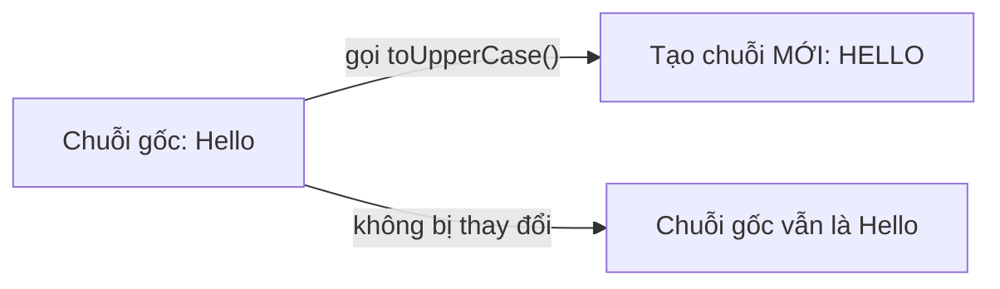

# Chuỗi (String) và các phương thức

String là kiểu dùng để lưu văn bản, tức một dãy các ký tự như một từ hay một câu. Đây là kiểu được dùng cực kỳ thường xuyên nên Java cung cấp rất nhiều phương thức tiện ích để xử lý nó. Bài này giới thiệu cách tạo chuỗi, tính bất biến, các phương thức phổ biến, cách so sánh đúng và StringBuilder; phần chi tiết nằm bên dưới.

---

:::note[Ghi nhớ nhanh]

- ⭐ **`String` bất biến (immutable)** — mỗi lần "sửa" tạo chuỗi mới, phải **gán lại** mới giữ được kết quả.
- ⭐ **So sánh nội dung** — dùng `.equals()`, KHÔNG dùng `==` (vì `==` so sánh địa chỉ).
- **Nhiều phương thức hữu ích** — `length`, `charAt`, `substring`, `indexOf`, `toUpperCase`, `trim`, `split`, `replace`.
- **Vị trí ký tự** — đếm từ `0` (ký tự đầu ở vị trí 0).
- **`StringBuilder`** — dùng khi cần ghép/sửa chuỗi nhiều lần cho nhanh.

:::

---

## Mục lục

- [Vì sao String immutable (và có StringBuilder)?](#vì-sao-string-immutable-và-có-stringbuilder)
- [String là gì?](#string-là-gì)
- [Tạo chuỗi](#tạo-chuỗi)
- [Tính bất biến (immutable)](#tính-bất-biến-immutable)
- [Các phương thức phổ biến](#các-phương-thức-phổ-biến)
- [So sánh chuỗi: equals vs ==](#so-sánh-chuỗi-equals-vs-)
- [Nối chuỗi](#nối-chuỗi)
- [StringBuilder — chỉnh sửa chuỗi hiệu quả](#stringbuilder--chỉnh-sửa-chuỗi-hiệu-quả)
- [Lỗi thường gặp](#lỗi-thường-gặp)
- [Tóm tắt](#tóm-tắt)

---

## Vì sao String immutable (và có StringBuilder)?

**Vấn đề:** Chuỗi được dùng KHẮP NƠI — làm key của Map, làm tham số, lưu cấu hình. Nếu chuỗi **thay đổi được** (mutable), khi nhiều chỗ cùng chia sẻ một tham chiếu, một chỗ sửa sẽ làm hỏng tất cả các chỗ khác. Đa luồng cũng không an toàn, và không thể cache để tái dùng.

```java
// Giả sử String thay đổi được (KHÔNG đúng với Java thật)
String key = "user";
mapCauHinh.put(key, "...");

key.setValue("admin"); // nếu sửa được tại chỗ...
// ...thì key đã nằm trong Map cũng đổi theo -> tra cứu sai, hỏng dữ liệu

// Nối chuỗi trong vòng lặp mà mỗi lần tạo chuỗi mới -> rất tốn
String s = "";
for (int i = 0; i < 100000; i++) {
    s = s + i; // tạo một chuỗi mới mỗi vòng -> chậm, nhiều rác
}
```

**Giải pháp:** Java làm String **bất biến** (immutable): an toàn khi chia sẻ và đa luồng, dùng làm key Map yên tâm, và được **cache trong String Pool** để tiết kiệm bộ nhớ. Khi cần nối/sửa nhiều lần thì dùng **StringBuilder** (thay đổi được, hiệu quả).

```java
// String bất biến: chia sẻ thoải mái, không sợ bị sửa
String key = "user";
mapCauHinh.put(key, "...");
key.toUpperCase(); // tạo chuỗi MỚI, "user" trong Map không đổi

// Hai literal giống nhau dùng chung một ô trong String Pool
String a = "Java";
String b = "Java";
System.out.println(a == b); // true (cùng đối tượng được cache)

// Nối nhiều lần -> dùng StringBuilder (sửa tại chỗ, nhanh)
StringBuilder sb = new StringBuilder();
for (int i = 0; i < 100000; i++) {
    sb.append(i);
}
String s = sb.toString();
```

:::tip[Dùng thực tế]
- Dùng `String` làm **key của Map** mà không lo bị một chỗ khác sửa làm hỏng tra cứu.
- **Chia sẻ chuỗi giữa nhiều luồng** an toàn, không cần khóa (lock).
- Cần **nối/sửa chuỗi trong vòng lặp** thì dùng `StringBuilder` cho nhanh.
- Khai báo bằng **literal** `"..."` để tận dụng String Pool, tiết kiệm bộ nhớ.
:::

---

## String là gì?

**String** (chuỗi — một dãy các ký tự liên tiếp, như một từ hay một câu) là kiểu dùng để lưu văn bản. Ví dụ `"Xin chao"` là một chuỗi gồm 8 ký tự.

String là **kiểu tham chiếu** (reference type — lưu địa chỉ trỏ tới dữ liệu, không phải kiểu nguyên thủy), nhưng nó được dùng cực kỳ thường xuyên nên Java hỗ trợ rất nhiều tiện ích cho nó.

---

## Tạo chuỗi

```java
public class ViDuTaoChuoi {
    public static void main(String[] args) {
        // Cách phổ biến: dùng nháy kép
        String loiChao = "Xin chao Java";

        // Cách dùng từ khóa new (ít dùng hơn)
        String ten = new String("Nguyen Van A");

        System.out.println(loiChao);
        System.out.println(ten);
    }
}
```

Chuỗi luôn dùng **nháy kép** `"..."`, khác với `char` dùng nháy đơn `'A'` cho một ký tự.

---

## Tính bất biến (immutable)

String trong Java là **bất biến** (immutable — không thể thay đổi sau khi tạo). Khi bạn "sửa" một chuỗi, Java thực ra tạo ra một chuỗi **mới**, chuỗi cũ giữ nguyên.

```java
public class ViDuBatBien {
    public static void main(String[] args) {
        String s = "Hello";
        s.toUpperCase(); // tạo chuỗi mới "HELLO" nhưng KHÔNG gán lại

        System.out.println(s); // vẫn là "Hello", không đổi!

        // Muốn giữ kết quả, phải gán lại:
        s = s.toUpperCase();
        System.out.println(s); // bây giờ là "HELLO"
    }
}
```

Đây là điểm rất hay khiến người mới bối rối: gọi phương thức trên chuỗi KHÔNG làm thay đổi chuỗi gốc, mà trả về chuỗi mới. Bạn phải **gán lại** nếu muốn dùng kết quả.

Sơ đồ minh hoạ tính bất biến — thao tác trên chuỗi tạo ra chuỗi mới, chuỗi gốc giữ nguyên:



---

## Các phương thức phổ biến

**Phương thức** (method — hàm gắn với một đối tượng, gọi bằng dấu chấm) của String rất hữu ích:

```java
public class ViDuPhuongThuc {
    public static void main(String[] args) {
        String s = "  Lap Trinh Java  ";

        // length(): độ dài chuỗi (số ký tự)
        System.out.println(s.length());          // 17 (tính cả khoảng trắng)

        // trim(): bỏ khoảng trắng đầu và cuối
        String goc = s.trim();                    // "Lap Trinh Java"
        System.out.println("[" + goc + "]");

        // charAt(i): lấy ký tự ở vị trí i (đếm từ 0)
        System.out.println(goc.charAt(0));        // 'L'

        // substring(start, end): cắt chuỗi con [start, end)
        System.out.println(goc.substring(0, 3));  // "Lap"

        // indexOf("..."): vị trí xuất hiện đầu tiên, -1 nếu không có
        System.out.println(goc.indexOf("Java"));  // 10

        // toUpperCase / toLowerCase: viết hoa / viết thường
        System.out.println(goc.toUpperCase());    // "LAP TRINH JAVA"
        System.out.println(goc.toLowerCase());    // "lap trinh java"

        // replace(a, b): thay mọi "a" bằng "b"
        System.out.println(goc.replace("Java", "Python")); // "Lap Trinh Python"

        // split(" "): tách chuỗi thành mảng theo dấu phân cách
        String[] tu = goc.split(" ");             // ["Lap", "Trinh", "Java"]
        System.out.println("So tu: " + tu.length); // 3

        // contains: kiểm tra có chứa chuỗi con không
        System.out.println(goc.contains("Trinh")); // true
    }
}
```

Lưu ý: `charAt` và `substring` đếm vị trí từ **0**. Ký tự đầu tiên ở vị trí `0`, không phải `1`.

---

## So sánh chuỗi: equals vs ==

Đây là lỗi kinh điển của người mới. Để so sánh **nội dung** hai chuỗi, dùng `equals(...)`, KHÔNG dùng `==`.

```java
public class ViDuSoSanh {
    public static void main(String[] args) {
        String a = new String("Java");
        String b = new String("Java");

        // == so sánh ĐỊA CHỈ (hai đối tượng có cùng chỗ trong bộ nhớ không)
        System.out.println(a == b);          // false (hai đối tượng khác nhau)

        // equals so sánh NỘI DUNG (chữ có giống nhau không)
        System.out.println(a.equals(b));     // true

        // equalsIgnoreCase: so sánh bỏ qua hoa/thường
        System.out.println("JAVA".equalsIgnoreCase("java")); // true
    }
}
```

Quy tắc vàng: **luôn dùng `.equals()` để so sánh nội dung chuỗi**, dùng `==` chỉ khi muốn kiểm tra có phải cùng một đối tượng.

---

## Nối chuỗi

Có nhiều cách ghép chuỗi lại với nhau:

```java
public class ViDuNoiChuoi {
    public static void main(String[] args) {
        String ho = "Nguyen";
        String ten = "An";

        // Cách 1: dùng dấu +
        String hoTen = ho + " " + ten;           // "Nguyen An"

        // Cách 2: dùng concat
        String hoTen2 = ho.concat(" ").concat(ten);

        // Ghép số vào chuỗi: số tự động chuyển thành chuỗi
        int tuoi = 25;
        System.out.println(hoTen + " - " + tuoi); // "Nguyen An - 25"
    }
}
```

---

## StringBuilder — chỉnh sửa chuỗi hiệu quả

Vì String bất biến, ghép chuỗi nhiều lần (nhất là trong vòng lặp) sẽ tạo ra rất nhiều chuỗi rác, gây chậm. **StringBuilder** (bộ dựng chuỗi — đối tượng cho phép sửa chuỗi tại chỗ) giải quyết việc này.

```java
public class ViDuStringBuilder {
    public static void main(String[] args) {
        // Tạo một StringBuilder rỗng
        StringBuilder sb = new StringBuilder();

        // append: nối thêm vào cuối (sửa trực tiếp, không tạo chuỗi mới)
        for (int i = 1; i <= 5; i++) {
            sb.append(i).append(" ");
        }

        // insert: chèn vào vị trí bất kỳ
        sb.insert(0, "So: ");

        // toString: chuyển về String thường để dùng/in
        String ketQua = sb.toString();
        System.out.println(ketQua); // "So: 1 2 3 4 5 "
    }
}
```

Khi nào dùng StringBuilder? Khi bạn cần ghép/sửa chuỗi nhiều lần, ví dụ trong vòng lặp. Với vài phép nối đơn giản thì dùng `+` là đủ.

---

## Lỗi thường gặp

- **Dùng `==` để so sánh nội dung chuỗi** → kết quả sai, phải dùng `.equals()`.
- **Quên gán lại kết quả**: `s.toUpperCase();` không đổi `s`, phải `s = s.toUpperCase();`.
- **`charAt` vượt độ dài** → lỗi `StringIndexOutOfBoundsException`.
- **Nhầm vị trí đếm từ 1**: thực ra ký tự đầu ở vị trí `0`.
- **Ghép chuỗi liên tục trong vòng lặp lớn với `+`** → chậm, nên dùng `StringBuilder`.

---

## Tóm tắt

- **String** lưu văn bản, dùng nháy kép, là **bất biến** (mỗi lần "sửa" tạo chuỗi mới).
- Nhiều phương thức hữu ích: `length`, `charAt`, `substring`, `indexOf`, `toUpperCase`, `trim`, `split`, `replace`.
- So sánh nội dung dùng `.equals()`, KHÔNG dùng `==`.
- **StringBuilder** dùng khi cần ghép/sửa chuỗi nhiều lần để chạy nhanh hơn.
