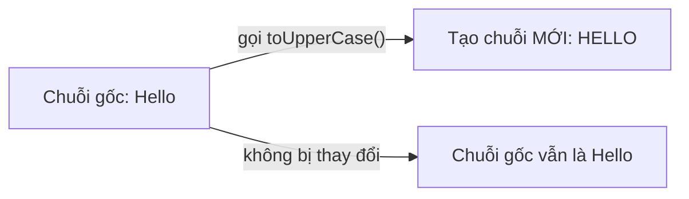

# Chuỗi (String) và các phương thức

String là kiểu dùng để lưu văn bản, tức một dãy các ký tự như một từ hay một câu. Đây là kiểu được dùng cực kỳ thường xuyên nên Java cung cấp rất nhiều phương thức tiện ích để xử lý nó. Bài này giới thiệu cách tạo chuỗi, tính bất biến, các phương thức phổ biến, cách so sánh đúng và StringBuilder; phần chi tiết nằm bên dưới.

[](pathname:///img/java/chuoi-va-phuong-thuc.webp)

---

:::note[Ghi nhớ nhanh]

- ⭐ **`String` bất biến (immutable)** — mỗi lần "sửa" tạo chuỗi mới, phải **gán lại** mới giữ được kết quả.
- ⭐ **So sánh nội dung** — dùng `.equals()`, KHÔNG dùng `==` (vì `==` so sánh địa chỉ).
- **Nhiều phương thức hữu ích** — `length`, `charAt`, `substring`, `indexOf`, `toUpperCase`, `trim`, `split`, `replace`.
- **Vị trí ký tự** — đếm từ `0` (ký tự đầu ở vị trí 0).
- **`StringBuilder`** — dùng khi cần ghép/sửa chuỗi nhiều lần cho nhanh.

:::

---

## Mục lục

- [Vì sao String immutable (và có StringBuilder)?](#vì-sao-string-immutable-và-có-stringbuilder)
- [String là gì?](#string-là-gì)
- [Tạo chuỗi](#tạo-chuỗi)
- [Tính bất biến (immutable)](#tính-bất-biến-immutable)
- [Các phương thức phổ biến](#các-phương-thức-phổ-biến)
- [So sánh chuỗi: equals vs ==](#so-sánh-chuỗi-equals-vs-)
- [Nối chuỗi](#nối-chuỗi)
- [StringBuilder — chỉnh sửa chuỗi hiệu quả](#stringbuilder--chỉnh-sửa-chuỗi-hiệu-quả)
- [Lỗi thường gặp](#lỗi-thường-gặp)
- [Tóm tắt](#tóm-tắt)
- [Câu hỏi phỏng vấn](#câu-hỏi-phỏng-vấn)

---

## Vì sao String immutable (và có StringBuilder)?

**Vấn đề:** Chuỗi được dùng KHẮP NƠI — làm key của Map, làm tham số, lưu cấu hình. Nếu chuỗi **thay đổi được** (mutable), khi nhiều chỗ cùng chia sẻ một tham chiếu, một chỗ sửa sẽ làm hỏng tất cả các chỗ khác. Đa luồng cũng không an toàn, và không thể cache để tái dùng.

```java
// Giả sử String thay đổi được (KHÔNG đúng với Java thật)
String key = "user";
mapCauHinh.put(key, "...");

key.setValue("admin"); // nếu sửa được tại chỗ...
// ...thì key đã nằm trong Map cũng đổi theo -> tra cứu sai, hỏng dữ liệu

// Nối chuỗi trong vòng lặp mà mỗi lần tạo chuỗi mới -> rất tốn
String s = "";
for (int i = 0; i < 100000; i++) {
    s = s + i; // tạo một chuỗi mới mỗi vòng -> chậm, nhiều rác
}
```

**Giải pháp:** Java làm String **bất biến** (immutable): an toàn khi chia sẻ và đa luồng, dùng làm key Map yên tâm, và được **cache trong String Pool** để tiết kiệm bộ nhớ. Khi cần nối/sửa nhiều lần thì dùng **StringBuilder** (thay đổi được, hiệu quả).

```java
// String bất biến: chia sẻ thoải mái, không sợ bị sửa
String key = "user";
mapCauHinh.put(key, "...");
key.toUpperCase(); // tạo chuỗi MỚI, "user" trong Map không đổi

// Hai literal giống nhau dùng chung một ô trong String Pool
String a = "Java";
String b = "Java";
System.out.println(a == b); // true (cùng đối tượng được cache)

// Nối nhiều lần -> dùng StringBuilder (sửa tại chỗ, nhanh)
StringBuilder sb = new StringBuilder();
for (int i = 0; i < 100000; i++) {
    sb.append(i);
}
String s = sb.toString();
```

:::tip[Dùng thực tế]

- Dùng `String` làm **key của Map** mà không lo bị một chỗ khác sửa làm hỏng tra cứu.
- **Chia sẻ chuỗi giữa nhiều luồng** an toàn, không cần khóa (lock).
- Cần **nối/sửa chuỗi trong vòng lặp** thì dùng `StringBuilder` cho nhanh.
- Khai báo bằng **literal** `"..."` để tận dụng String Pool, tiết kiệm bộ nhớ.
:::

---

## String là gì?

**String** (chuỗi — một dãy các ký tự liên tiếp, như một từ hay một câu) là kiểu dùng để lưu văn bản. Ví dụ `"Xin chao"` là một chuỗi gồm 8 ký tự.

String là **kiểu tham chiếu** (reference type — lưu địa chỉ trỏ tới dữ liệu, không phải kiểu nguyên thủy), nhưng nó được dùng cực kỳ thường xuyên nên Java hỗ trợ rất nhiều tiện ích cho nó.

---

## Tạo chuỗi

```java
public class ViDuTaoChuoi {
    public static void main(String[] args) {
        // Cách phổ biến: dùng nháy kép
        String loiChao = "Xin chao Java";

        // Cách dùng từ khóa new (ít dùng hơn)
        String ten = new String("Nguyen Van A");

        System.out.println(loiChao);
        System.out.println(ten);
    }
}
```

Chuỗi luôn dùng **nháy kép** `"..."`, khác với `char` dùng nháy đơn `'A'` cho một ký tự.

---

## Tính bất biến (immutable)

String trong Java là **bất biến** (immutable — không thể thay đổi sau khi tạo). Khi bạn "sửa" một chuỗi, Java thực ra tạo ra một chuỗi **mới**, chuỗi cũ giữ nguyên.

```java
public class ViDuBatBien {
    public static void main(String[] args) {
        String s = "Hello";
        s.toUpperCase(); // tạo chuỗi mới "HELLO" nhưng KHÔNG gán lại

        System.out.println(s); // vẫn là "Hello", không đổi!

        // Muốn giữ kết quả, phải gán lại:
        s = s.toUpperCase();
        System.out.println(s); // bây giờ là "HELLO"
    }
}
```

Đây là điểm rất hay khiến người mới bối rối: gọi phương thức trên chuỗi KHÔNG làm thay đổi chuỗi gốc, mà trả về chuỗi mới. Bạn phải **gán lại** nếu muốn dùng kết quả.

Sơ đồ minh hoạ tính bất biến — thao tác trên chuỗi tạo ra chuỗi mới, chuỗi gốc giữ nguyên:


```mermaid
flowchart LR
    S["Chuỗi gốc: Hello"] -->|"gọi toUpperCase()"| N["Tạo chuỗi MỚI: HELLO"]
    S -->|"không bị thay đổi"| K["Chuỗi gốc vẫn là Hello"]
```

---

## Các phương thức phổ biến

**Phương thức** (method — hàm gắn với một đối tượng, gọi bằng dấu chấm) của String rất hữu ích:

```java
public class ViDuPhuongThuc {
    public static void main(String[] args) {
        String s = "  Lap Trinh Java  ";

        // length(): độ dài chuỗi (số ký tự)
        System.out.println(s.length());          // 17 (tính cả khoảng trắng)

        // trim(): bỏ khoảng trắng đầu và cuối
        String goc = s.trim();                    // "Lap Trinh Java"
        System.out.println("[" + goc + "]");

        // charAt(i): lấy ký tự ở vị trí i (đếm từ 0)
        System.out.println(goc.charAt(0));        // 'L'

        // substring(start, end): cắt chuỗi con [start, end)
        System.out.println(goc.substring(0, 3));  // "Lap"

        // indexOf("..."): vị trí xuất hiện đầu tiên, -1 nếu không có
        System.out.println(goc.indexOf("Java"));  // 10

        // toUpperCase / toLowerCase: viết hoa / viết thường
        System.out.println(goc.toUpperCase());    // "LAP TRINH JAVA"
        System.out.println(goc.toLowerCase());    // "lap trinh java"

        // replace(a, b): thay mọi "a" bằng "b"
        System.out.println(goc.replace("Java", "Python")); // "Lap Trinh Python"

        // split(" "): tách chuỗi thành mảng theo dấu phân cách
        String[] tu = goc.split(" ");             // ["Lap", "Trinh", "Java"]
        System.out.println("So tu: " + tu.length); // 3

        // contains: kiểm tra có chứa chuỗi con không
        System.out.println(goc.contains("Trinh")); // true
    }
}
```

Lưu ý: `charAt` và `substring` đếm vị trí từ **0**. Ký tự đầu tiên ở vị trí `0`, không phải `1`.

---

## So sánh chuỗi: equals vs ==

Đây là lỗi kinh điển của người mới. Để so sánh **nội dung** hai chuỗi, dùng `equals(...)`, KHÔNG dùng `==`.

```java
public class ViDuSoSanh {
    public static void main(String[] args) {
        String a = new String("Java");
        String b = new String("Java");

        // == so sánh ĐỊA CHỈ (hai đối tượng có cùng chỗ trong bộ nhớ không)
        System.out.println(a == b);          // false (hai đối tượng khác nhau)

        // equals so sánh NỘI DUNG (chữ có giống nhau không)
        System.out.println(a.equals(b));     // true

        // equalsIgnoreCase: so sánh bỏ qua hoa/thường
        System.out.println("JAVA".equalsIgnoreCase("java")); // true
    }
}
```

Quy tắc vàng: **luôn dùng `.equals()` để so sánh nội dung chuỗi**, dùng `==` chỉ khi muốn kiểm tra có phải cùng một đối tượng.

---

## Nối chuỗi

Có nhiều cách ghép chuỗi lại với nhau:

```java
public class ViDuNoiChuoi {
    public static void main(String[] args) {
        String ho = "Nguyen";
        String ten = "An";

        // Cách 1: dùng dấu +
        String hoTen = ho + " " + ten;           // "Nguyen An"

        // Cách 2: dùng concat
        String hoTen2 = ho.concat(" ").concat(ten);

        // Ghép số vào chuỗi: số tự động chuyển thành chuỗi
        int tuoi = 25;
        System.out.println(hoTen + " - " + tuoi); // "Nguyen An - 25"
    }
}
```

---

## StringBuilder — chỉnh sửa chuỗi hiệu quả

Vì String bất biến, ghép chuỗi nhiều lần (nhất là trong vòng lặp) sẽ tạo ra rất nhiều chuỗi rác, gây chậm. **StringBuilder** (bộ dựng chuỗi — đối tượng cho phép sửa chuỗi tại chỗ) giải quyết việc này.

```java
public class ViDuStringBuilder {
    public static void main(String[] args) {
        // Tạo một StringBuilder rỗng
        StringBuilder sb = new StringBuilder();

        // append: nối thêm vào cuối (sửa trực tiếp, không tạo chuỗi mới)
        for (int i = 1; i <= 5; i++) {
            sb.append(i).append(" ");
        }

        // insert: chèn vào vị trí bất kỳ
        sb.insert(0, "So: ");

        // toString: chuyển về String thường để dùng/in
        String ketQua = sb.toString();
        System.out.println(ketQua); // "So: 1 2 3 4 5 "
    }
}
```

Khi nào dùng StringBuilder? Khi bạn cần ghép/sửa chuỗi nhiều lần, ví dụ trong vòng lặp. Với vài phép nối đơn giản thì dùng `+` là đủ.

---

## Lỗi thường gặp

- **Dùng `==` để so sánh nội dung chuỗi** → kết quả sai, phải dùng `.equals()`.
- **Quên gán lại kết quả**: `s.toUpperCase();` không đổi `s`, phải `s = s.toUpperCase();`.
- **`charAt` vượt độ dài** → lỗi `StringIndexOutOfBoundsException`.
- **Nhầm vị trí đếm từ 1**: thực ra ký tự đầu ở vị trí `0`.
- **Ghép chuỗi liên tục trong vòng lặp lớn với `+`** → chậm, nên dùng `StringBuilder`.

---

## Tóm tắt

- **String** lưu văn bản, dùng nháy kép, là **bất biến** (mỗi lần "sửa" tạo chuỗi mới).
- Nhiều phương thức hữu ích: `length`, `charAt`, `substring`, `indexOf`, `toUpperCase`, `trim`, `split`, `replace`.
- So sánh nội dung dùng `.equals()`, KHÔNG dùng `==`.
- **StringBuilder** dùng khi cần ghép/sửa chuỗi nhiều lần để chạy nhanh hơn.

---

## Câu hỏi phỏng vấn

Những câu thường gặp về chủ đề này. Tự trả lời trước, rồi bấm **Xem đáp án** để đối chiếu.

**1. Vì sao `String` trong Java được thiết kế là bất biến (immutable)? Nêu ít nhất hai lợi ích cụ thể.**

<details className="qa">
<summary>Xem đáp án</summary>

- **An toàn khi chia sẻ (đa luồng)**: nhiều đối tượng/luồng có thể cùng giữ tham chiếu tới một chuỗi mà không lo bị nơi khác sửa đổi ngầm — không cần khóa (`lock`) khi đọc.
- **Dùng làm key của `HashMap`/`HashSet` an toàn**: nếu chuỗi có thể đổi nội dung sau khi đã dùng làm key, `hashCode()` của nó sẽ thay đổi, khiến việc tra cứu trong bảng băm (hash table) bị sai — vì phần tử bị "lạc" ở bucket cũ.
- **Cache được trong String Pool**: vì nội dung không đổi, Java có thể an toàn cho nhiều biến literal giống nhau dùng chung một object, tiết kiệm bộ nhớ.
- **Bảo mật**: các thông tin nhạy cảm truyền qua `String` (ví dụ tên file, URL, tham số kết nối) không thể bị đổi sau khi đã được kiểm tra (validate), tránh một dạng lỗ hổng gọi là time-of-check-to-time-of-use.

</details>

**2. String Pool là gì? Tạo chuỗi bằng literal `"Java"` khác gì so với `new String("Java")`?**

<details className="qa">
<summary>Xem đáp án</summary>

**String Pool** (còn gọi String Constant Pool) là một vùng nhớ đặc biệt trong heap, nơi Java lưu trữ và **tái sử dụng** các chuỗi literal — hai chuỗi literal giống hệt nội dung sẽ dùng chung một object duy nhất trong pool.

```java
String a = "Java";        // lấy (hoặc thêm mới) từ String Pool
String b = "Java";        // trùng nội dung -> dùng lại CHÍNH object trong pool, không tạo mới
String c = new String("Java"); // từ khóa new -> LUÔN tạo object MỚI trên heap, ngoài pool

System.out.println(a == b); // true — cùng một object trong pool
System.out.println(a == c); // false — c là object riêng, dù nội dung giống nhau
```

- Dùng literal giúp tiết kiệm bộ nhớ nhờ tái sử dụng; dùng `new String(...)` gần như không cần thiết trong code thông thường vì luôn tạo rác thêm.

</details>

**3. Output của đoạn code sau là gì? Vì sao?**

```java
public class Test {
    public static void main(String[] args) {
        String a = "Java";
        String b = "Java";
        String c = new String("Java");

        System.out.println(a == b);
        System.out.println(a == c);
        System.out.println(a.equals(c));
    }
}
```

<details className="qa">
<summary>Xem đáp án</summary>

Kết quả lần lượt: **`true`**, **`false`**, **`true`**.

- `a == b` → `true`: cả hai là literal `"Java"`, cùng trỏ tới **một object duy nhất** trong String Pool.
- `a == c` → `false`: `c` được tạo bằng `new String(...)`, ép Java tạo một object **mới** trên heap, khác object trong pool — dù nội dung ký tự giống hệt nhau, `==` so sánh **địa chỉ** nên vẫn là `false`.
- `a.equals(c)` → `true`: `equals()` của `String` so sánh **từng ký tự nội dung**, không quan tâm địa chỉ, nên trả về `true`.
- Ghi nhớ: **luôn dùng `.equals()`** để so sánh nội dung chuỗi; chỉ dùng `==` khi cố ý kiểm tra hai biến có cùng trỏ tới một object hay không.

</details>

**4. So sánh `String`, `StringBuilder` và `StringBuffer`.**

<details className="qa">
<summary>Xem đáp án</summary>

|                                | `String`                     | `StringBuilder`                                                     | `StringBuffer`                                         |
| ------------------------------ | ---------------------------- | ------------------------------------------------------------------- | ------------------------------------------------------ |
| Tính chất                      | Bất biến (immutable)         | Thay đổi được (mutable)                                             | Thay đổi được (mutable)                                |
| Thread-safe (an toàn đa luồng) | Có (do bất biến)             | Không                                                               | Có (các phương thức được đồng bộ hóa — `synchronized`) |
| Hiệu năng                      | Chậm khi nối chuỗi nhiều lần | Nhanh nhất (đơn luồng)                                              | Chậm hơn `StringBuilder` do chi phí đồng bộ hóa        |
| Khi nào dùng                   | Chuỗi cố định, ít thay đổi   | Ghép/sửa chuỗi nhiều lần trong một luồng (đa số trường hợp thực tế) | Ghép/sửa chuỗi được chia sẻ giữa nhiều luồng cùng lúc  |

Trong thực tế, `StringBuilder` được dùng phổ biến hơn hẳn `StringBuffer` vì phần lớn thao tác ghép chuỗi diễn ra trong một luồng duy nhất (ví dụ bên trong một method), không cần trả chi phí đồng bộ hóa không cần thiết.

</details>

**5. Đoạn code sau in ra gì? Vì sao nhiều người mới hay nhầm lẫn ở đây?**

```java
public class Test {
    public static void main(String[] args) {
        String s = "hello";
        s.toUpperCase();
        System.out.println(s);
    }
}
```

<details className="qa">
<summary>Xem đáp án</summary>

In ra **`hello`** (chữ thường, không đổi).

- Vì `String` bất biến, `s.toUpperCase()` **tạo ra một chuỗi mới** `"HELLO"` và trả về, nhưng không hề sửa `s` tại chỗ.
- Do kết quả trả về không được gán lại (`s = s.toUpperCase();`), chuỗi mới bị "rơi" mất, còn `s` vẫn giữ nguyên giá trị cũ.
- Đây là lỗi kinh điển nhất của người mới học String: quên rằng mọi phương thức "biến đổi" trên `String` đều trả về object mới, không sửa đối tượng gốc.

</details>

**6. Vì sao nối chuỗi bằng `+` trong vòng lặp lớn lại chậm? `StringBuilder` giải quyết vấn đề này như thế nào?**

<details className="qa">
<summary>Xem đáp án</summary>

```java
String s = "";
for (int i = 0; i < 10000; i++) {
    s = s + i; // mỗi vòng lặp tạo ra MỘT chuỗi mới hoàn toàn
}
```

- Vì `String` bất biến, mỗi lần `s + i` chạy, Java phải cấp phát một object `String` mới, **copy toàn bộ nội dung cũ** của `s` cộng thêm phần mới vào, rồi bỏ object cũ làm rác cho garbage collector dọn. Với vòng lặp `n` lần, tổng chi phí copy tăng theo cấp **O(n²)**.
- `StringBuilder` dùng một **mảng ký tự nội bộ (`char[]`) có thể thay đổi được**, và tự động cấp phát dư ra (capacity) để `append()` phần lớn các lần chỉ cần ghi thêm vào mảng có sẵn, không phải copy lại toàn bộ nội dung cũ mỗi lần — đưa độ phức tạp về gần **O(n)**.

```java
StringBuilder sb = new StringBuilder();
for (int i = 0; i < 10000; i++) {
    sb.append(i); // sửa tại chỗ, không tạo object String mới mỗi vòng
}
String ketQua = sb.toString();
```

- Mẹo thêm: nếu biết trước số lượng ký tự cần ghép sẽ lớn, có thể khởi tạo `new StringBuilder(kichThuocDuKien)` để giảm số lần `StringBuilder` phải tự cấp phát lại mảng nội bộ khi đầy.

</details>

**7. Phương thức `intern()` của `String` làm gì? Khi nào nên cân nhắc dùng nó?**

<details className="qa">
<summary>Xem đáp án</summary>

`intern()` trả về **bản trong String Pool** có cùng nội dung với chuỗi hiện tại — nếu pool đã có chuỗi giống hệt, trả về tham chiếu tới bản đó; nếu chưa có, thêm chuỗi hiện tại vào pool rồi trả về chính nó.

```java
String a = new String("Java").intern();
String b = "Java";
System.out.println(a == b); // true — nhờ intern(), a trỏ vào cùng object trong pool với b
```

- Cân nhắc dùng khi chương trình xử lý **rất nhiều chuỗi trùng lặp nội dung** được tạo động (ví dụ đọc hàng triệu dòng log, mỗi dòng parse ra vài chuỗi lặp lại nhiều lần) — gọi `intern()` giúp gom chúng lại dùng chung object, giảm bộ nhớ.
- Không nên lạm dụng: nếu chuỗi phần lớn là duy nhất (không lặp), `intern()` chỉ tốn thêm chi phí tra cứu pool mà không tiết kiệm được gì.

</details>

**8. `String` có phù hợp làm key cho `HashMap` không? Vì sao?**

<details className="qa">
<summary>Xem đáp án</summary>

**Rất phù hợp**, và là lựa chọn phổ biến nhất cho key trong thực tế, nhờ hai đặc điểm:

- **Bất biến (immutable)**: một khi đã dùng làm key, nội dung (và do đó `hashCode()`) không thể bị thay đổi ngầm từ bên ngoài — tránh được lỗi "key bị đổi sau khi đưa vào Map khiến tra cứu sai bucket", vốn là rủi ro lớn nếu dùng một object mutable làm key.
- **`equals()` và `hashCode()` đã được cài đặt đúng đắn (well-defined)**: hai chuỗi có nội dung giống nhau luôn cho `hashCode()` giống nhau và `equals()` trả về `true` — đúng hợp đồng (contract) mà `HashMap` yêu cầu ở key.
- Thêm lợi thế hiệu năng: `String` **cache lại giá trị `hashCode()`** đã tính (tính một lần, lưu lại trong field nội bộ), nên các lần tra cứu Map sau không phải tính lại từ đầu.

</details>

**9. Đoạn code sau in ra `true`/`false` như thế nào ở mỗi dòng? Giải thích khái niệm compile-time constant liên quan tới String Pool.**

```java
public class Test {
    public static void main(String[] args) {
        String s1 = "ab";
        String s2 = "a" + "b";

        String x = "a";
        String s3 = x + "b";

        System.out.println(s1 == s2);
        System.out.println(s1 == s3);
    }
}
```

<details className="qa">
<summary>Xem đáp án</summary>

Kết quả: `s1 == s2` là **`true`**, `s1 == s3` là **`false`**.

- `"a" + "b"` khi cả hai vế đều là **literal cố định** (compile-time constant) được compiler **tính sẵn ngay lúc biên dịch** thành `"ab"`, rồi đưa thẳng vào String Pool — nên `s2` trỏ tới **cùng object** với `s1` trong pool.
- `x + "b"` thì `x` là một **biến**, giá trị của nó (dù không đổi lúc chạy) vẫn được compiler coi là chỉ biết ở **runtime**, nên phép nối chuỗi này được thực hiện thật lúc chương trình chạy (thường qua `StringBuilder` ẩn), tạo ra một object **mới trên heap**, không nằm trong pool — vì vậy `s1 == s3` là `false` dù nội dung hai chuỗi giống hệt nhau.
- Đây là lý do nhiều câu hỏi phỏng vấn dùng ví dụ này để kiểm tra hiểu biết sâu về String Pool, chứ không chỉ dừng ở "literal thì bằng nhau, `new String` thì không".

</details>

**10. `substring()` trong các bản Java cũ (trước Java 7u6) từng gây rò rỉ bộ nhớ (memory leak) như thế nào? Java hiện tại (7u6 trở lên) đã khắc phục ra sao?**

<details className="qa">
<summary>Xem đáp án</summary>

- **Trước Java 7u6**: `String` lưu dữ liệu trong một mảng `char[]` dùng chung, cùng với hai chỉ số `offset` (điểm bắt đầu) và `count` (độ dài). Khi gọi `substring()`, chuỗi con **không copy mảng ký tự mới** mà chỉ tạo object `String` mới trỏ vào **cùng mảng gốc**, chỉ đổi `offset`/`count`. Hệ quả: nếu bạn cắt ra một chuỗi con rất ngắn từ một chuỗi gốc rất dài (ví dụ đọc một file text khổng lồ rồi chỉ giữ lại vài ký tự), toàn bộ mảng ký tự khổng lồ của chuỗi gốc **vẫn bị giữ trong bộ nhớ** chỉ vì chuỗi con nhỏ xíu còn tham chiếu tới nó — gây rò rỉ bộ nhớ âm thầm, khó phát hiện.
- **Từ Java 7u6 trở đi (và Java 8+)**: `substring()` được đổi cách cài đặt — luôn **copy** ra một mảng ký tự mới, độc lập với chuỗi gốc. Chuỗi con giờ chỉ chiếm đúng bộ nhớ tương ứng với độ dài của nó, không còn giữ cả mảng gốc.
- Đánh đổi: cách mới tốn thêm chi phí copy mỗi lần gọi `substring()`, nhưng đổi lại tránh được lớp lỗi rò rỉ bộ nhớ khó chẩn đoán — được đánh giá là đánh đổi hợp lý hơn cho đa số ứng dụng.

</details>

**11. Text block (Java 15+) là gì? Cho ví dụ cú pháp và nêu lợi ích so với nối chuỗi nhiều dòng bằng `+`.**

<details className="qa">
<summary>Xem đáp án</summary>

**Text block** là cú pháp viết chuỗi nhiều dòng gọn gàng, được chính thức đưa vào từ **Java 15**, dùng ba dấu nháy kép `"""` để mở và đóng.

```java
// Trước đây: nối chuỗi nhiều dòng bằng +, khó đọc
String html1 = "<html>\n" +
               "  <body>\n" +
               "    <p>Xin chao</p>\n" +
               "  </body>\n" +
               "</html>\n";

// Từ Java 15: text block, giữ nguyên định dạng, dễ đọc hơn hẳn
String html2 = """
        <html>
          <body>
            <p>Xin chao</p>
          </body>
        </html>
        """;
```

Lợi ích:

- Không cần escape dấu nháy kép bên trong (`\"`) hay nối `+` giữa các dòng, giảm lỗi cú pháp.
- Java tự xử lý thụt lề (indentation) hợp lý dựa trên dòng đóng `"""`, giữ code nguồn dễ đọc mà không làm lệch định dạng chuỗi kết quả.
- Rất hữu ích khi viết chuỗi JSON, SQL, HTML mẫu ngay trong code Java mà không mất công escape.
- Kết quả trả về vẫn là một `String` bình thường (vẫn bất biến, vẫn dùng được mọi phương thức của `String`) — chỉ là cú pháp viết gọn hơn.

</details>
