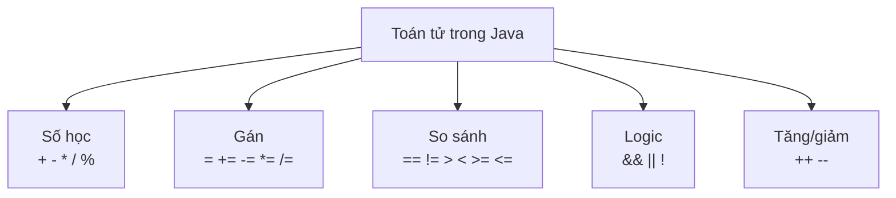

# Toán tử và phép toán

Toán tử là các ký hiệu thực hiện phép tính hoặc thao tác trên dữ liệu, ví dụ như cộng, trừ, so sánh hay kết hợp điều kiện. Đây là công cụ cơ bản để máy tính toán và ra quyết định trong chương trình. Bài này giới thiệu các nhóm toán tử số học, gán, so sánh, logic, tăng/giảm cùng thứ tự ưu tiên và lớp Math; phần chi tiết nằm bên dưới.

---

## Mục lục

- [Vì sao cần toán tử?](#vì-sao-cần-toán-tử)
- [Toán tử là gì?](#toán-tử-là-gì)
- [Toán tử số học](#toán-tử-số-học)
- [Toán tử gán](#toán-tử-gán)
- [Toán tử so sánh](#toán-tử-so-sánh)
- [Toán tử logic](#toán-tử-logic)
- [Toán tử tăng/giảm](#toán-tử-tănggiảm)
- [Thứ tự ưu tiên toán tử](#thứ-tự-ưu-tiên-toán-tử)
- [Lớp Math](#lớp-math)
- [Lỗi thường gặp](#lỗi-thường-gặp)
- [Tóm tắt](#tóm-tắt)

---

## Vì sao cần toán tử?

**Vấn đề:** Nếu không có toán tử, mọi phép tính đều phải gọi hàm dài dòng — code trở nên khó đọc và khó bảo trì.

```java
// Không có toán tử: phải gọi hàm cho từng phép tính
int tong = Integer.sum(a, b);
boolean lonHon = Integer.compare(a, b) > 0;
boolean hopLe = BooleanUtils.and(tuoiHopLe, coBangLai); // không tự nhiên chút nào
```

**Giải pháp:** Toán tử (`+`, `-`, `*`, `/`, `%`, `==`, `!=`, `&&`, `||`, ...) cho phép viết biểu thức tính toán, so sánh và logic ngắn gọn, tự nhiên — đúng như cách diễn đạt toán học thông thường. Chúng là nền tảng để xây dựng mọi biểu thức và điều kiện trong chương trình.

```java
// Có toán tử: ngắn gọn, dễ đọc
int tong = a + b;
boolean lonHon = a > b;
boolean hopLe = tuoiHopLe && coBangLai;

// Kết hợp nhiều toán tử trong một biểu thức điều kiện
if (tuoi >= 18 && diemThi >= 5.0) {
    System.out.println("Đủ điều kiện tham gia");
}
```

:::tip[Dùng thực tế]
- Tính tiền hóa đơn, phí giảm giá, thuế — dùng toán tử số học `+`, `-`, `*`, `/`, `%`.
- Kiểm tra điều kiện hợp lệ của form nhập liệu — dùng toán tử so sánh `==`, `!=`, `>=`, `<=`.
- Kết hợp nhiều điều kiện truy cập (ví dụ: đã đăng nhập VÀ có quyền admin) — dùng toán tử logic `&&`, `||`, `!`.
- Đếm vòng lặp, cập nhật điểm số trong game — dùng toán tử tăng/giảm `++`, `--` và gán rút gọn `+=`, `-=`.
:::

---

## Toán tử là gì?

**Toán tử** (operator — ký hiệu thực hiện một phép tính hoặc thao tác trên dữ liệu) ví dụ như `+`, `-`, `>`, `&&`. **Toán hạng** (operand — giá trị mà toán tử tác động lên) là các số/biến hai bên toán tử. Ví dụ trong `3 + 5`, dấu `+` là toán tử, `3` và `5` là toán hạng.

Sơ đồ các nhóm toán tử chính trong Java:



---

## Toán tử số học

Dùng cho các phép tính số:

```java
public class ViDuSoHoc {
    public static void main(String[] args) {
        int a = 10, b = 3;

        System.out.println(a + b); // 13  cộng
        System.out.println(a - b); // 7   trừ
        System.out.println(a * b); // 30  nhân
        System.out.println(a / b); // 3   chia (lấy phần nguyên với int!)
        System.out.println(a % b); // 1   chia lấy DƯ (modulo)

        // Chia số thực cho kết quả đúng
        double c = 10.0 / 3;       // 3.333...
        System.out.println(c);
    }
}
```

Toán tử `%` (**modulo** — phép chia lấy phần dư) rất hữu ích, ví dụ kiểm tra số chẵn/lẻ: `n % 2 == 0` nghĩa là `n` chẵn.

---

## Toán tử gán

Ngoài `=`, Java có các toán tử gán rút gọn kết hợp với phép tính:

```java
public class ViDuGan {
    public static void main(String[] args) {
        int x = 10;

        x += 5;  // tương đương x = x + 5  -> 15
        x -= 3;  // x = x - 3              -> 12
        x *= 2;  // x = x * 2              -> 24
        x /= 4;  // x = x / 4              -> 6
        x %= 4;  // x = x % 4              -> 2

        System.out.println(x); // 2
    }
}
```

Các dạng rút gọn này giúp code ngắn gọn hơn nhưng ý nghĩa hoàn toàn giống bản đầy đủ.

---

## Toán tử so sánh

Cho kết quả là `boolean` (`true` hoặc `false`):

```java
public class ViDuSoSanh {
    public static void main(String[] args) {
        int a = 5, b = 8;

        System.out.println(a == b); // false  bằng nhau?
        System.out.println(a != b); // true   khác nhau?
        System.out.println(a > b);  // false  lớn hơn?
        System.out.println(a < b);  // true   nhỏ hơn?
        System.out.println(a >= 5); // true   lớn hơn hoặc bằng?
        System.out.println(b <= 8); // true   nhỏ hơn hoặc bằng?
    }
}
```

Chú ý: `==` (so sánh bằng) khác hẳn `=` (gán). Đây là nhầm lẫn rất phổ biến.

---

## Toán tử logic

Kết hợp nhiều điều kiện `boolean`:

```java
public class ViDuLogic {
    public static void main(String[] args) {
        int tuoi = 20;
        boolean coBằngLai = true;

        // && (VÀ): đúng khi CẢ HAI vế đều đúng
        System.out.println(tuoi >= 18 && coBằngLai); // true

        // || (HOẶC): đúng khi ÍT NHẤT một vế đúng
        System.out.println(tuoi < 18 || coBằngLai);  // true

        // ! (PHỦ ĐỊNH): đảo ngược true <-> false
        System.out.println(!coBằngLai);              // false
    }
}
```

Java dùng **đoản mạch** (short-circuit — dừng đánh giá ngay khi biết kết quả): với `&&`, nếu vế đầu sai thì không xét vế sau; với `||`, nếu vế đầu đúng thì bỏ qua vế sau.

---

## Toán tử tăng/giảm

`++` tăng 1, `--` giảm 1. Có hai vị trí đặt khác nhau:

```java
public class ViDuTangGiam {
    public static void main(String[] args) {
        int x = 5;

        // Hậu tố x++: DÙNG giá trị cũ trước, rồi mới tăng
        System.out.println(x++); // in 5, sau đó x thành 6

        int y = 5;
        // Tiền tố ++y: TĂNG trước, rồi mới dùng
        System.out.println(++y); // tăng y thành 6 rồi in 6

        System.out.println("x = " + x + ", y = " + y); // x = 6, y = 6
    }
}
```

Mẹo nhớ: `x++` (dấu sau) dùng giá trị **cũ** rồi mới tăng; `++x` (dấu trước) tăng **trước** rồi mới dùng.

---

## Thứ tự ưu tiên toán tử

Giống toán học, một số toán tử được tính trước. Thứ tự (cao xuống thấp):

1. `()` — ngoặc tròn (luôn ưu tiên cao nhất).
2. `++`, `--`, `!` — tăng/giảm, phủ định.
3. `*`, `/`, `%` — nhân, chia, lấy dư.
4. `+`, `-` — cộng, trừ.
5. `<`, `>`, `<=`, `>=` — so sánh.
6. `==`, `!=` — bằng, khác.
7. `&&` — và.
8. `||` — hoặc.
9. `=`, `+=`, `-=`... — gán (thấp nhất).

```java
public class ViDuUuTien {
    public static void main(String[] args) {
        int ketQua = 2 + 3 * 4;       // nhân trước: 2 + 12 = 14
        System.out.println(ketQua);   // 14

        int dungNgoac = (2 + 3) * 4;  // ngoặc trước: 5 * 4 = 20
        System.out.println(dungNgoac); // 20
    }
}
```

Lời khuyên: khi không chắc, cứ dùng dấu ngoặc `()` cho rõ ràng và tránh sai sót.

---

## Lớp Math

**Lớp Math** (lớp tiện ích chứa các hàm toán học dựng sẵn) cung cấp nhiều phép tính nâng cao:

```java
public class ViDuMath {
    public static void main(String[] args) {
        System.out.println(Math.max(5, 9));   // 9  số lớn hơn
        System.out.println(Math.min(5, 9));   // 5  số nhỏ hơn
        System.out.println(Math.abs(-7));     // 7  giá trị tuyệt đối
        System.out.println(Math.pow(2, 3));   // 8.0  lũy thừa 2^3
        System.out.println(Math.sqrt(16));    // 4.0  căn bậc hai
        System.out.println(Math.round(3.6));  // 4  làm tròn
        System.out.println(Math.PI);          // 3.141592653589793

        // random(): số ngẫu nhiên thực trong [0.0, 1.0)
        double nn = Math.random();
        System.out.println("Ngau nhien: " + nn);
    }
}
```

---

## Lỗi thường gặp

- **Nhầm `=` với `==`**: `=` là gán, `==` là so sánh.
- **Chia hai số nguyên rồi mong số thực**: `10 / 3` ra `3`, không phải `3.33`.
- **Quên dấu ngoặc** khiến thứ tự tính sai ý muốn.
- **Nhầm `x++` và `++x`** khi dùng kết quả ngay trong cùng câu lệnh.
- **Dùng `&&`/`||` với số** thay vì `boolean` → Java báo lỗi kiểu.

---

## Tóm tắt

- Toán tử **số học** (`+ - * / %`), **gán** (`= += ...`), **so sánh** (`== != > <`), **logic** (`&& || !`).
- `%` lấy phần dư; chia hai `int` cho kết quả `int`.
- `x++` dùng giá trị cũ rồi tăng; `++x` tăng trước rồi dùng.
- Toán tử có **thứ tự ưu tiên**; dùng `()` để kiểm soát rõ ràng.
- Lớp **Math** cung cấp `max`, `min`, `abs`, `pow`, `sqrt`, `random`...
