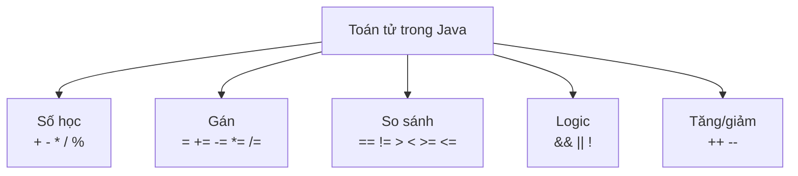

# Toán tử và phép toán

Toán tử là các ký hiệu thực hiện phép tính hoặc thao tác trên dữ liệu, ví dụ như cộng, trừ, so sánh hay kết hợp điều kiện. Đây là công cụ cơ bản để máy tính toán và ra quyết định trong chương trình. Bài này giới thiệu các nhóm toán tử số học, gán, so sánh, logic, tăng/giảm cùng thứ tự ưu tiên và lớp Math; phần chi tiết nằm bên dưới.

[](pathname:///img/java/toan-tu.webp)

---

:::note[Ghi nhớ nhanh]

- ⭐ **Các nhóm toán tử** — số học `+ - * / %`, gán `= += ...`, so sánh `== != > <`, logic `&& || !`, tăng/giảm `++ --`.
- **`%` (modulo)** — lấy phần dư; chia hai `int` cho kết quả `int`.
- **`x++` và `++x`** — `x++` dùng giá trị cũ rồi tăng; `++x` tăng trước rồi dùng.
- **Thứ tự ưu tiên** — toán tử được tính theo thứ tự; dùng `()` để kiểm soát rõ ràng.
- **Lớp `Math`** — cung cấp `max`, `min`, `abs`, `pow`, `sqrt`, `random`...

:::

---

## Mục lục

- [Vì sao cần toán tử?](#vì-sao-cần-toán-tử)
- [Toán tử là gì?](#toán-tử-là-gì)
- [Toán tử số học](#toán-tử-số-học)
- [Toán tử gán](#toán-tử-gán)
- [Toán tử so sánh](#toán-tử-so-sánh)
- [Toán tử logic](#toán-tử-logic)
- [Toán tử tăng/giảm](#toán-tử-tănggiảm)
- [Thứ tự ưu tiên toán tử](#thứ-tự-ưu-tiên-toán-tử)
- [Lớp Math](#lớp-math)
- [Lỗi thường gặp](#lỗi-thường-gặp)
- [Tóm tắt](#tóm-tắt)
- [Câu hỏi phỏng vấn](#câu-hỏi-phỏng-vấn)

---

## Vì sao cần toán tử?

**Vấn đề:** Nếu không có toán tử, mọi phép tính đều phải gọi hàm dài dòng — code trở nên khó đọc và khó bảo trì.

```java
// Không có toán tử: phải gọi hàm cho từng phép tính
int tong = Integer.sum(a, b);
boolean lonHon = Integer.compare(a, b) > 0;
boolean hopLe = BooleanUtils.and(tuoiHopLe, coBangLai); // không tự nhiên chút nào
```

**Giải pháp:** Toán tử (`+`, `-`, `*`, `/`, `%`, `==`, `!=`, `&&`, `||`, ...) cho phép viết biểu thức tính toán, so sánh và logic ngắn gọn, tự nhiên — đúng như cách diễn đạt toán học thông thường. Chúng là nền tảng để xây dựng mọi biểu thức và điều kiện trong chương trình.

```java
// Có toán tử: ngắn gọn, dễ đọc
int tong = a + b;
boolean lonHon = a > b;
boolean hopLe = tuoiHopLe && coBangLai;

// Kết hợp nhiều toán tử trong một biểu thức điều kiện
if (tuoi >= 18 && diemThi >= 5.0) {
    System.out.println("Đủ điều kiện tham gia");
}
```

:::tip[Dùng thực tế]
- Tính tiền hóa đơn, phí giảm giá, thuế — dùng toán tử số học `+`, `-`, `*`, `/`, `%`.
- Kiểm tra điều kiện hợp lệ của form nhập liệu — dùng toán tử so sánh `==`, `!=`, `>=`, `<=`.
- Kết hợp nhiều điều kiện truy cập (ví dụ: đã đăng nhập VÀ có quyền admin) — dùng toán tử logic `&&`, `||`, `!`.
- Đếm vòng lặp, cập nhật điểm số trong game — dùng toán tử tăng/giảm `++`, `--` và gán rút gọn `+=`, `-=`.
:::

---

## Toán tử là gì?

**Toán tử** (operator — ký hiệu thực hiện một phép tính hoặc thao tác trên dữ liệu) ví dụ như `+`, `-`, `>`, `&&`. **Toán hạng** (operand — giá trị mà toán tử tác động lên) là các số/biến hai bên toán tử. Ví dụ trong `3 + 5`, dấu `+` là toán tử, `3` và `5` là toán hạng.

Sơ đồ các nhóm toán tử chính trong Java:


```mermaid
flowchart TD
    O["Toán tử trong Java"] --> A["Số học<br/>+ - * / %"]
    O --> G["Gán<br/>= += -= *= /="]
    O --> S["So sánh<br/>== != > < >= <="]
    O --> L["Logic<br/>&& || !"]
    O --> T["Tăng/giảm<br/>++ --"]
```

---

## Toán tử số học

Dùng cho các phép tính số:

```java
public class ViDuSoHoc {
    public static void main(String[] args) {
        int a = 10, b = 3;

        System.out.println(a + b); // 13  cộng
        System.out.println(a - b); // 7   trừ
        System.out.println(a * b); // 30  nhân
        System.out.println(a / b); // 3   chia (lấy phần nguyên với int!)
        System.out.println(a % b); // 1   chia lấy DƯ (modulo)

        // Chia số thực cho kết quả đúng
        double c = 10.0 / 3;       // 3.333...
        System.out.println(c);
    }
}
```

Toán tử `%` (**modulo** — phép chia lấy phần dư) rất hữu ích, ví dụ kiểm tra số chẵn/lẻ: `n % 2 == 0` nghĩa là `n` chẵn.

---

## Toán tử gán

Ngoài `=`, Java có các toán tử gán rút gọn kết hợp với phép tính:

```java
public class ViDuGan {
    public static void main(String[] args) {
        int x = 10;

        x += 5;  // tương đương x = x + 5  -> 15
        x -= 3;  // x = x - 3              -> 12
        x *= 2;  // x = x * 2              -> 24
        x /= 4;  // x = x / 4              -> 6
        x %= 4;  // x = x % 4              -> 2

        System.out.println(x); // 2
    }
}
```

Các dạng rút gọn này giúp code ngắn gọn hơn nhưng ý nghĩa hoàn toàn giống bản đầy đủ.

---

## Toán tử so sánh

Cho kết quả là `boolean` (`true` hoặc `false`):

```java
public class ViDuSoSanh {
    public static void main(String[] args) {
        int a = 5, b = 8;

        System.out.println(a == b); // false  bằng nhau?
        System.out.println(a != b); // true   khác nhau?
        System.out.println(a > b);  // false  lớn hơn?
        System.out.println(a < b);  // true   nhỏ hơn?
        System.out.println(a >= 5); // true   lớn hơn hoặc bằng?
        System.out.println(b <= 8); // true   nhỏ hơn hoặc bằng?
    }
}
```

Chú ý: `==` (so sánh bằng) khác hẳn `=` (gán). Đây là nhầm lẫn rất phổ biến.

---

## Toán tử logic

Kết hợp nhiều điều kiện `boolean`:

```java
public class ViDuLogic {
    public static void main(String[] args) {
        int tuoi = 20;
        boolean coBằngLai = true;

        // && (VÀ): đúng khi CẢ HAI vế đều đúng
        System.out.println(tuoi >= 18 && coBằngLai); // true

        // || (HOẶC): đúng khi ÍT NHẤT một vế đúng
        System.out.println(tuoi < 18 || coBằngLai);  // true

        // ! (PHỦ ĐỊNH): đảo ngược true <-> false
        System.out.println(!coBằngLai);              // false
    }
}
```

Java dùng **đoản mạch** (short-circuit — dừng đánh giá ngay khi biết kết quả): với `&&`, nếu vế đầu sai thì không xét vế sau; với `||`, nếu vế đầu đúng thì bỏ qua vế sau.

---

## Toán tử tăng/giảm

`++` tăng 1, `--` giảm 1. Có hai vị trí đặt khác nhau:

```java
public class ViDuTangGiam {
    public static void main(String[] args) {
        int x = 5;

        // Hậu tố x++: DÙNG giá trị cũ trước, rồi mới tăng
        System.out.println(x++); // in 5, sau đó x thành 6

        int y = 5;
        // Tiền tố ++y: TĂNG trước, rồi mới dùng
        System.out.println(++y); // tăng y thành 6 rồi in 6

        System.out.println("x = " + x + ", y = " + y); // x = 6, y = 6
    }
}
```

Mẹo nhớ: `x++` (dấu sau) dùng giá trị **cũ** rồi mới tăng; `++x` (dấu trước) tăng **trước** rồi mới dùng.

---

## Thứ tự ưu tiên toán tử

Giống toán học, một số toán tử được tính trước. Thứ tự (cao xuống thấp):

1. `()` — ngoặc tròn (luôn ưu tiên cao nhất).
2. `++`, `--`, `!` — tăng/giảm, phủ định.
3. `*`, `/`, `%` — nhân, chia, lấy dư.
4. `+`, `-` — cộng, trừ.
5. `<`, `>`, `<=`, `>=` — so sánh.
6. `==`, `!=` — bằng, khác.
7. `&&` — và.
8. `||` — hoặc.
9. `=`, `+=`, `-=`... — gán (thấp nhất).

```java
public class ViDuUuTien {
    public static void main(String[] args) {
        int ketQua = 2 + 3 * 4;       // nhân trước: 2 + 12 = 14
        System.out.println(ketQua);   // 14

        int dungNgoac = (2 + 3) * 4;  // ngoặc trước: 5 * 4 = 20
        System.out.println(dungNgoac); // 20
    }
}
```

Lời khuyên: khi không chắc, cứ dùng dấu ngoặc `()` cho rõ ràng và tránh sai sót.

---

## Lớp Math

**Lớp Math** (lớp tiện ích chứa các hàm toán học dựng sẵn) cung cấp nhiều phép tính nâng cao:

```java
public class ViDuMath {
    public static void main(String[] args) {
        System.out.println(Math.max(5, 9));   // 9  số lớn hơn
        System.out.println(Math.min(5, 9));   // 5  số nhỏ hơn
        System.out.println(Math.abs(-7));     // 7  giá trị tuyệt đối
        System.out.println(Math.pow(2, 3));   // 8.0  lũy thừa 2^3
        System.out.println(Math.sqrt(16));    // 4.0  căn bậc hai
        System.out.println(Math.round(3.6));  // 4  làm tròn
        System.out.println(Math.PI);          // 3.141592653589793

        // random(): số ngẫu nhiên thực trong [0.0, 1.0)
        double nn = Math.random();
        System.out.println("Ngau nhien: " + nn);
    }
}
```

---

## Lỗi thường gặp

- **Nhầm `=` với `==`**: `=` là gán, `==` là so sánh.
- **Chia hai số nguyên rồi mong số thực**: `10 / 3` ra `3`, không phải `3.33`.
- **Quên dấu ngoặc** khiến thứ tự tính sai ý muốn.
- **Nhầm `x++` và `++x`** khi dùng kết quả ngay trong cùng câu lệnh.
- **Dùng `&&`/`||` với số** thay vì `boolean` → Java báo lỗi kiểu.

---

## Tóm tắt

- Toán tử **số học** (`+ - * / %`), **gán** (`= += ...`), **so sánh** (`== != > <`), **logic** (`&& || !`).
- `%` lấy phần dư; chia hai `int` cho kết quả `int`.
- `x++` dùng giá trị cũ rồi tăng; `++x` tăng trước rồi dùng.
- Toán tử có **thứ tự ưu tiên**; dùng `()` để kiểm soát rõ ràng.
- Lớp **Math** cung cấp `max`, `min`, `abs`, `pow`, `sqrt`, `random`...

---

## Câu hỏi phỏng vấn

Những câu thường gặp về chủ đề này. Tự trả lời trước, rồi bấm **Xem đáp án** để đối chiếu.

**1. Phân biệt "toán tử" (operator) và "toán hạng" (operand). Cho một ví dụ minh họa.**

<details className="qa">
<summary>Xem đáp án</summary>

- **Toán tử**: ký hiệu thực hiện một phép tính hoặc thao tác, ví dụ `+`, `-`, `>`, `&&`.
- **Toán hạng**: giá trị hoặc biến mà toán tử tác động lên.

Ví dụ trong biểu thức `a + b * c`:
- `+` và `*` là toán tử.
- `a`, `b`, `c` là toán hạng.

Một số toán tử chỉ cần 1 toán hạng (toán tử một ngôi, ví dụ `!x`, `-x`, `x++`), số khác cần 2 toán hạng (toán tử hai ngôi, ví dụ `a + b`).

</details>

**2. `=` và `==` khác nhau thế nào? Vì sao nhầm lẫn hai toán tử này lại nguy hiểm?**

<details className="qa">
<summary>Xem đáp án</summary>

- `=` là **toán tử gán** — gán giá trị bên phải cho biến bên trái.
- `==` là **toán tử so sánh bằng** — trả về `boolean` (`true`/`false`) khi so sánh hai giá trị.

```java
int a = 5;      // gán 5 cho a
boolean b = (a == 5); // so sánh: true
```

Nguy hiểm vì với biến `boolean`, viết nhầm `if (dangDangNhap = true)` (gán) thay vì `if (dangDangNhap == true)` (so sánh) làm biến bị **ghi đè giá trị** và điều kiện luôn đúng — Java may mắn báo lỗi biên dịch trong trường hợp này vì kiểu không khớp (`int` gán cho `boolean`), nhưng nếu cả hai vế đều là `boolean` thì code vẫn biên dịch được và gây bug âm thầm rất khó phát hiện.

</details>

**3. Toán tử `%` (modulo) hoạt động thế nào? Với số âm, kết quả mang dấu của số nào?**

<details className="qa">
<summary>Xem đáp án</summary>

`%` trả về **phần dư** của phép chia nguyên. Trong Java, dấu của kết quả `%` luôn theo dấu của **số bị chia** (toán hạng bên trái), không theo số chia:

```java
System.out.println(7 % 3);   // 1
System.out.println(-7 % 3);  // -1 (theo dấu của -7)
System.out.println(7 % -3);  // 1  (theo dấu của 7)
```

Ứng dụng phổ biến: kiểm tra chẵn/lẻ (`n % 2 == 0`), lấy phần tử theo vòng (circular index: `i % array.length`).

</details>

**4. Toán tử đoản mạch (`&&`, `||`) khác gì với `&`, `|` khi dùng cho `boolean`? Cho một tình huống thực tế nơi đoản mạch giúp tránh lỗi.**

<details className="qa">
<summary>Xem đáp án</summary>

- `&&`, `||` là **đoản mạch** (short-circuit): dừng đánh giá ngay khi biết chắc kết quả — với `&&`, vế đầu sai thì không xét vế sau; với `||`, vế đầu đúng thì bỏ qua vế sau.
- `&`, `|` (khi dùng với `boolean`) luôn đánh giá **cả hai vế**, dù kết quả vế đầu đã đủ để quyết định.

Tình huống thực tế: tránh `NullPointerException` khi kiểm tra null trước rồi mới gọi method:

```java
String ten = null;
if (ten != null && ten.length() > 0) {
    // an toàn: vì ten != null sai nên && dừng lại, không gọi ten.length()
}
```

Nếu dùng `&` thay `&&`, Java vẫn sẽ đánh giá `ten.length()` dù `ten` là `null`, gây `NullPointerException` ngay lập tức.

</details>

**5. Output của đoạn code sau là gì? Giải thích từng bước.**

```java
int x = 5;
int y = x++ + ++x;
System.out.println(x + " " + y);
```

<details className="qa">
<summary>Xem đáp án</summary>

**Output: `x = 7, y = 12`**

Diễn giải từng bước:
1. `x++` (hậu tố): lấy giá trị **cũ** của `x` là `5` để tính, sau đó `x` tăng lên `6`.
2. `++x` (tiền tố): tăng `x` từ `6` lên `7` **trước**, rồi lấy giá trị mới `7` để tính.
3. `y = 5 + 7 = 12`.
4. Cuối cùng `x` bằng `7` (đã tăng hai lần: `5 → 6 → 7`).

Đây là lỗi rất dễ mắc khi trộn `x++`/`++x` nhiều lần trong cùng một biểu thức — nên tránh viết code kiểu này trong thực tế vì khó đọc.

</details>

**6. Output của đoạn code sau là gì?**

```java
int ketQua = 10 - 2 * 3 + 4 / 2;
System.out.println(ketQua);
```

<details className="qa">
<summary>Xem đáp án</summary>

**Output: `6`**

Theo thứ tự ưu tiên, `*` và `/` được tính trước `+` và `-`, sau đó Java tính từ trái sang phải giữa các toán tử cùng cấp:

1. `2 * 3 = 6`
2. `4 / 2 = 2`
3. `10 - 6 + 2` → tính từ trái sang phải: `10 - 6 = 4`, rồi `4 + 2 = 6`.

Trong thực tế phỏng vấn, câu này thường được hỏi tiếp: nếu đổi thành `10 - (2 * 3 + 4) / 2` thì kết quả khác hẳn — minh chứng vì sao nên dùng `()` khi biểu thức phức tạp.

</details>

**7. Vì sao `0.1 + 0.2 == 0.3` trả về `false` trong Java? Nên so sánh hai số `double` thế nào cho đúng?**

<details className="qa">
<summary>Xem đáp án</summary>

Vì `double` lưu số thực dưới dạng **dấu phẩy động nhị phân** (binary floating-point) theo chuẩn IEEE 754, và nhiều số thập phân (như `0.1`, `0.2`) **không biểu diễn chính xác tuyệt đối** ở hệ nhị phân — giống như `1/3` không viết hết được ở hệ thập phân. Kết quả thực tế của `0.1 + 0.2` là `0.30000000000000004`, khác với giá trị literal `0.3`.

Cách so sánh đúng: dùng một **sai số cho phép** (epsilon):

```java
double a = 0.1 + 0.2;
double b = 0.3;
boolean ganBang = Math.abs(a - b) < 1e-9; // true
```

Nếu cần độ chính xác tuyệt đối (ví dụ tính tiền), nên dùng `BigDecimal` thay vì `double`/`float`.

</details>

**8. Số nguyên `int` bị tràn (overflow) khi tính toán thì điều gì xảy ra? Cho ví dụ và cách phòng tránh.**

<details className="qa">
<summary>Xem đáp án</summary>

`int` trong Java chiếm 32 bit, có giới hạn từ `Integer.MIN_VALUE` (`-2147483648`) đến `Integer.MAX_VALUE` (`2147483647`). Khi phép tính vượt giới hạn này, Java **không báo lỗi** mà **quay vòng** (wrap around) sang phía đối diện:

```java
int max = Integer.MAX_VALUE;
System.out.println(max + 1); // -2147483648 (tràn xuống MIN_VALUE)
```

Cách phòng tránh:
- Dùng `long` nếu giá trị có thể lớn hơn phạm vi `int`.
- Dùng `Math.addExact`, `Math.multiplyExact`... (ném `ArithmeticException` khi tràn) để phát hiện sớm thay vì để lỗi âm thầm.
- Với số cực lớn, cân nhắc `BigInteger`.

</details>

**9. Tình huống: bạn viết điều kiện kiểm tra đơn hàng hợp lệ là `soLuong > 0 && soLuong <= tonKho && giaTien >= 0`. Vì sao nên đặt các điều kiện rẻ/dễ sai trước, và thứ tự này có ảnh hưởng gì tới hiệu năng và độ an toàn?**

<details className="qa">
<summary>Xem đáp án</summary>

Nhờ cơ chế **đoản mạch** của `&&`, Java đánh giá từ trái sang phải và dừng ngay khi gặp điều kiện sai — nên:

- **Hiệu năng**: nên đặt điều kiện **rẻ và dễ sai nhất** lên trước (ví dụ kiểm tra `soLuong > 0` trước khi làm phép tính hay gọi hàm tốn kém), để tránh tính toán không cần thiết ở các vế sau.
- **An toàn**: nếu một điều kiện phía sau phụ thuộc vào điều kiện phía trước để không bị lỗi (ví dụ kiểm tra `obj != null` trước khi gọi method trên `obj`), thứ tự **bắt buộc** phải đúng — đảo ngược thứ tự có thể gây `NullPointerException` hoặc lỗi runtime khác.

Ví dụ thực tế:

```java
if (gioHang != null && !gioHang.isEmpty() && gioHang.get(0).getGiaTien() >= 0) {
    // an toàn: kiểm tra null trước, rồi mới truy cập phần tử
}
```

</details>

