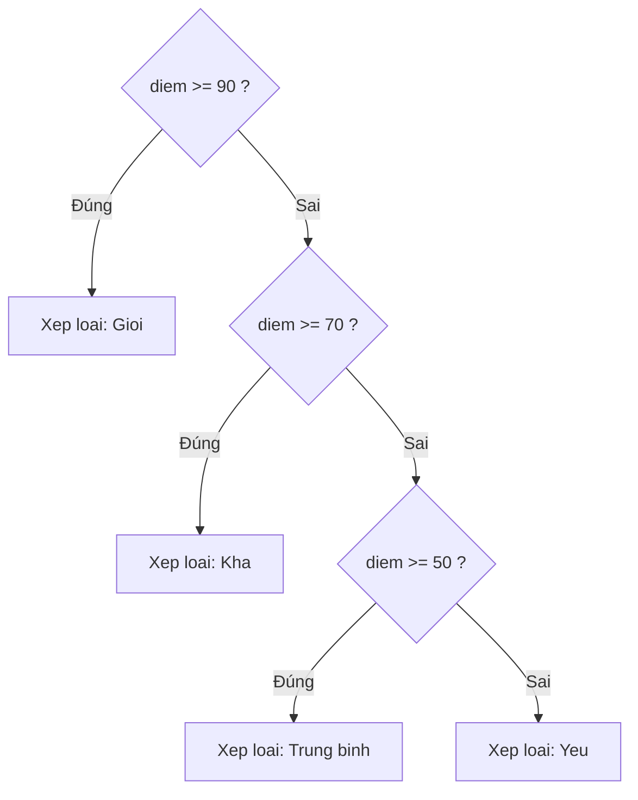

# Câu điều kiện

Câu điều kiện cho phép chương trình chọn hành động khác nhau tùy tình huống, giống như đời thực "nếu trời mưa thì mang ô". Đây là cách giúp code "ra quyết định" thay vì chỉ chạy tuần tự. Bài này giới thiệu if, if-else, else if, toán tử ba ngôi và câu lệnh switch (cả kiểu cũ lẫn kiểu mới); phần chi tiết nằm bên dưới.

---

## Mục lục

- [Vì sao cần câu điều kiện?](#vì-sao-cần-câu-điều-kiện)
- [Câu điều kiện là gì?](#câu-điều-kiện-là-gì)
- [Câu lệnh if](#câu-lệnh-if)
- [if - else](#if---else)
- [else if — nhiều nhánh](#else-if--nhiều-nhánh)
- [Toán tử ba ngôi](#toán-tử-ba-ngôi)
- [Câu lệnh switch (kiểu cũ)](#câu-lệnh-switch-kiểu-cũ)
- [switch expression (kiểu mới)](#switch-expression-kiểu-mới)
- [Lỗi thường gặp](#lỗi-thường-gặp)
- [Tóm tắt](#tóm-tắt)

---

## Vì sao cần câu điều kiện?

**Vấn đề:** Chương trình đơn giản chỉ chạy tuần tự từ trên xuống — không thể tự "chọn" hành động phù hợp với từng tình huống. Ví dụ, nếu không có câu điều kiện, ta buộc phải viết code riêng cho từng trường hợp:

```java
// Không có câu điều kiện — code cứng, không linh hoạt
public class KhongCoIf {
    public static void main(String[] args) {
        int tuoi = 20;
        // Muốn in "Được vào" khi tuổi >= 18, nhưng không biết rẽ nhánh
        System.out.println("Được vào");   // in bất kể tuổi bao nhiêu!
        System.out.println("Không được vào"); // in cả hai — vô nghĩa
    }
}
```

**Giải pháp:** Câu điều kiện cho phép chương trình **rẽ nhánh** dựa trên dữ liệu thực tế — chỉ chạy đúng khối lệnh phù hợp với tình huống tại thời điểm đó:

```java
public class CoIf {
    public static void main(String[] args) {
        int tuoi = 20;

        if (tuoi >= 18) {
            System.out.println("Được vào"); // chỉ chạy khi tuoi >= 18
        } else {
            System.out.println("Không được vào"); // chỉ chạy khi tuoi < 18
        }
    }
}
```

:::tip[Dùng thực tế]
- Kiểm tra đăng nhập: đúng mật khẩu thì vào trang chủ, sai thì báo lỗi.
- Xếp loại học sinh: điểm >= 90 là Giỏi, >= 70 là Khá, còn lại là Trung bình.
- Kiểm tra quyền truy cập: người dùng có vai trò admin mới thấy trang quản trị.
- Xử lý đơn hàng: nếu còn hàng thì xác nhận, nếu hết hàng thì thông báo chờ.
:::

---

## Câu điều kiện là gì?

**Câu điều kiện** (conditional statement — câu lệnh cho phép chương trình chọn hành động khác nhau tùy tình huống) giúp code "ra quyết định". Giống đời thực: "NẾU trời mưa THÌ mang ô, NGƯỢC LẠI thì không".

Điều kiện luôn cho ra giá trị `boolean` (`true` hoặc `false`).

---

## Câu lệnh if

`if` chạy khối lệnh chỉ khi điều kiện đúng:

```java
public class ViDuIf {
    public static void main(String[] args) {
        int tuoi = 20;

        // NẾU tuoi >= 18 thì in dòng dưới
        if (tuoi >= 18) {
            System.out.println("Ban da du tuoi");
        }

        System.out.println("Ket thuc kiem tra");
    }
}
```

Nếu điều kiện sai, khối trong `{ }` bị bỏ qua, chương trình chạy tiếp sau đó.

---

## if - else

`else` (ngược lại) chạy khi điều kiện `if` sai:

```java
public class ViDuIfElse {
    public static void main(String[] args) {
        int diem = 4;

        if (diem >= 5) {
            System.out.println("Dau");
        } else {
            System.out.println("Truot"); // chạy nhánh này vì 4 < 5
        }
    }
}
```

Chỉ một trong hai nhánh được chạy, không bao giờ cả hai.

---

## else if — nhiều nhánh

Khi có nhiều trường hợp, dùng `else if` để xét lần lượt:

```java
public class ViDuElseIf {
    public static void main(String[] args) {
        int diem = 75;
        String xepLoai;

        if (diem >= 90) {
            xepLoai = "Gioi";
        } else if (diem >= 70) {       // 70 <= diem < 90
            xepLoai = "Kha";
        } else if (diem >= 50) {       // 50 <= diem < 70
            xepLoai = "Trung binh";
        } else {                       // còn lại
            xepLoai = "Yeu";
        }

        System.out.println("Xep loai: " + xepLoai); // "Kha"
    }
}
```

Java xét từ trên xuống, gặp điều kiện đúng **đầu tiên** thì chạy nhánh đó rồi bỏ qua phần còn lại.

Sơ đồ luồng rẽ nhánh của ví dụ xếp loại điểm:



---

## Toán tử ba ngôi

**Toán tử ba ngôi** (ternary operator — cách viết gọn của if-else cho việc gán giá trị) có cú pháp: `điều_kiện ? giá_trị_nếu_đúng : giá_trị_nếu_sai`.

```java
public class ViDuBaNgoi {
    public static void main(String[] args) {
        int tuoi = 20;

        // Cách dài bằng if-else
        String ketQua;
        if (tuoi >= 18) {
            ketQua = "Nguoi lon";
        } else {
            ketQua = "Tre em";
        }

        // Cách ngắn bằng toán tử ba ngôi (tương đương)
        String ketQua2 = (tuoi >= 18) ? "Nguoi lon" : "Tre em";

        System.out.println(ketQua2); // "Nguoi lon"
    }
}
```

Dùng toán tử ba ngôi khi chỉ cần chọn một trong hai giá trị đơn giản; tránh dùng cho logic phức tạp vì khó đọc.

---

## Câu lệnh switch (kiểu cũ)

`switch` (rẽ nhánh theo giá trị) tiện khi so sánh một biến với nhiều giá trị cố định:

```java
public class ViDuSwitchCu {
    public static void main(String[] args) {
        int thu = 3;
        String tenThu;

        switch (thu) {
            case 2:
                tenThu = "Thu Hai";
                break;          // break: thoát khỏi switch
            case 3:
                tenThu = "Thu Ba";
                break;
            case 4:
                tenThu = "Thu Tu";
                break;
            default:            // default: khi không khớp case nào
                tenThu = "Khong xac dinh";
        }

        System.out.println(tenThu); // "Thu Ba"
    }
}
```

Quan trọng: phải có `break` sau mỗi `case`, nếu quên thì code sẽ chạy "rơi" xuống các case tiếp theo (gọi là **fall-through**), thường gây lỗi ngoài ý muốn.

---

## switch expression (kiểu mới)

Từ Java 14, **switch expression** (biểu thức switch — kiểu switch mới gọn hơn, trả về giá trị) dùng mũi tên `->` và không cần `break`:

```java
public class ViDuSwitchMoi {
    public static void main(String[] args) {
        int thu = 3;

        // switch mới: dùng -> , tự động không bị fall-through
        String tenThu = switch (thu) {
            case 2 -> "Thu Hai";
            case 3 -> "Thu Ba";
            case 4 -> "Thu Tu";
            case 7 -> "Chu Nhat";
            default -> "Khong xac dinh";
        };

        System.out.println(tenThu); // "Thu Ba"

        // Có thể gộp nhiều giá trị vào một nhánh
        boolean cuoiTuan = switch (thu) {
            case 1, 7 -> true;       // Thứ Bảy(1) hoặc CN(7)
            default -> false;
        };
        System.out.println("Cuoi tuan? " + cuoiTuan);
    }
}
```

So sánh nhanh:

- switch cũ: dùng `:` và bắt buộc `break`, dễ quên gây fall-through.
- switch mới: dùng `->`, an toàn hơn, có thể trả về giá trị trực tiếp.

---

## Lỗi thường gặp

- **Quên `break` trong switch cũ** → code chạy rơi xuống case sau.
- **Dùng `=` thay `==`** trong điều kiện so sánh.
- **So sánh chuỗi bằng `==`** trong `if` → phải dùng `.equals()`.
- **Quên `{ }`** khi if có nhiều câu lệnh → chỉ câu đầu thuộc về `if`.
- **Điều kiện không phải boolean**: Java yêu cầu điều kiện trong `if` phải là `boolean`.

---

## Tóm tắt

- `if` chạy khi điều kiện đúng; `else` chạy khi sai; `else if` xử lý nhiều nhánh.
- **Toán tử ba ngôi** `đk ? a : b` là cách viết gọn của if-else cho việc gán.
- `switch` so sánh một biến với nhiều giá trị cố định.
- switch **cũ** cần `break`; switch **mới** dùng `->`, an toàn hơn và trả về giá trị.
