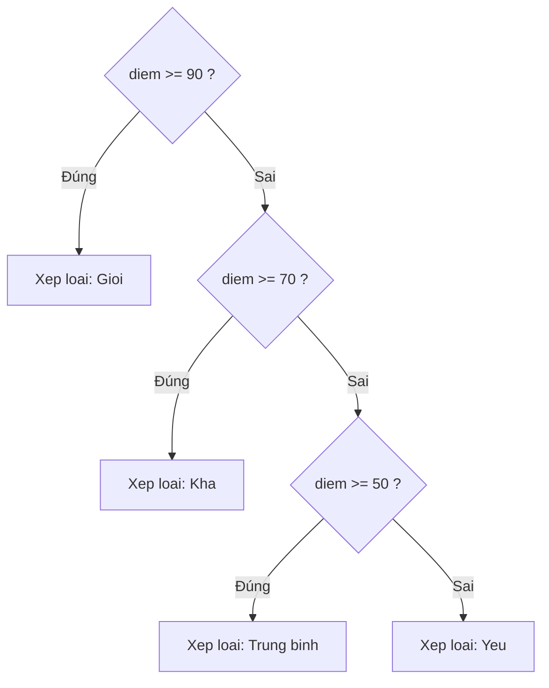

# Câu điều kiện

Câu điều kiện cho phép chương trình chọn hành động khác nhau tùy tình huống, giống như đời thực "nếu trời mưa thì mang ô". Đây là cách giúp code "ra quyết định" thay vì chỉ chạy tuần tự. Bài này giới thiệu if, if-else, else if, toán tử ba ngôi và câu lệnh switch (cả kiểu cũ lẫn kiểu mới); phần chi tiết nằm bên dưới.

[](pathname:///img/java/cau-dieu-kien.webp)

---

:::note[Ghi nhớ nhanh]

- ⭐ **`if` / `else` / `else if`** — `if` chạy khi đúng, `else` khi sai, `else if` xử lý nhiều nhánh (chạy nhánh đúng đầu tiên).
- **Toán tử ba ngôi** — `đk ? a : b` là cách viết gọn của if-else cho việc gán giá trị.
- **`switch`** — tiện khi so sánh một biến với nhiều giá trị cố định.
- **switch cũ vs mới** — switch cũ cần `break` (tránh fall-through); switch mới dùng `->`, an toàn hơn và trả về giá trị.

:::

---

## Mục lục

- [Vì sao cần câu điều kiện?](#vì-sao-cần-câu-điều-kiện)
- [Câu điều kiện là gì?](#câu-điều-kiện-là-gì)
- [Câu lệnh if](#câu-lệnh-if)
- [if - else](#if---else)
- [else if — nhiều nhánh](#else-if--nhiều-nhánh)
- [Toán tử ba ngôi](#toán-tử-ba-ngôi)
- [Câu lệnh switch (kiểu cũ)](#câu-lệnh-switch-kiểu-cũ)
- [switch expression (kiểu mới)](#switch-expression-kiểu-mới)
- [Lỗi thường gặp](#lỗi-thường-gặp)
- [Tóm tắt](#tóm-tắt)
- [Câu hỏi phỏng vấn](#câu-hỏi-phỏng-vấn)

---

## Vì sao cần câu điều kiện?

**Vấn đề:** Chương trình đơn giản chỉ chạy tuần tự từ trên xuống — không thể tự "chọn" hành động phù hợp với từng tình huống. Ví dụ, nếu không có câu điều kiện, ta buộc phải viết code riêng cho từng trường hợp:

```java
// Không có câu điều kiện — code cứng, không linh hoạt
public class KhongCoIf {
    public static void main(String[] args) {
        int tuoi = 20;
        // Muốn in "Được vào" khi tuổi >= 18, nhưng không biết rẽ nhánh
        System.out.println("Được vào");   // in bất kể tuổi bao nhiêu!
        System.out.println("Không được vào"); // in cả hai — vô nghĩa
    }
}
```

**Giải pháp:** Câu điều kiện cho phép chương trình **rẽ nhánh** dựa trên dữ liệu thực tế — chỉ chạy đúng khối lệnh phù hợp với tình huống tại thời điểm đó:

```java
public class CoIf {
    public static void main(String[] args) {
        int tuoi = 20;

        if (tuoi >= 18) {
            System.out.println("Được vào"); // chỉ chạy khi tuoi >= 18
        } else {
            System.out.println("Không được vào"); // chỉ chạy khi tuoi < 18
        }
    }
}
```

:::tip[Dùng thực tế]
- Kiểm tra đăng nhập: đúng mật khẩu thì vào trang chủ, sai thì báo lỗi.
- Xếp loại học sinh: điểm >= 90 là Giỏi, >= 70 là Khá, còn lại là Trung bình.
- Kiểm tra quyền truy cập: người dùng có vai trò admin mới thấy trang quản trị.
- Xử lý đơn hàng: nếu còn hàng thì xác nhận, nếu hết hàng thì thông báo chờ.
:::

---

## Câu điều kiện là gì?

**Câu điều kiện** (conditional statement — câu lệnh cho phép chương trình chọn hành động khác nhau tùy tình huống) giúp code "ra quyết định". Giống đời thực: "NẾU trời mưa THÌ mang ô, NGƯỢC LẠI thì không".

Điều kiện luôn cho ra giá trị `boolean` (`true` hoặc `false`).

---

## Câu lệnh if

`if` chạy khối lệnh chỉ khi điều kiện đúng:

```java
public class ViDuIf {
    public static void main(String[] args) {
        int tuoi = 20;

        // NẾU tuoi >= 18 thì in dòng dưới
        if (tuoi >= 18) {
            System.out.println("Ban da du tuoi");
        }

        System.out.println("Ket thuc kiem tra");
    }
}
```

Nếu điều kiện sai, khối trong `{ }` bị bỏ qua, chương trình chạy tiếp sau đó.

---

## if - else

`else` (ngược lại) chạy khi điều kiện `if` sai:

```java
public class ViDuIfElse {
    public static void main(String[] args) {
        int diem = 4;

        if (diem >= 5) {
            System.out.println("Dau");
        } else {
            System.out.println("Truot"); // chạy nhánh này vì 4 < 5
        }
    }
}
```

Chỉ một trong hai nhánh được chạy, không bao giờ cả hai.

---

## else if — nhiều nhánh

Khi có nhiều trường hợp, dùng `else if` để xét lần lượt:

```java
public class ViDuElseIf {
    public static void main(String[] args) {
        int diem = 75;
        String xepLoai;

        if (diem >= 90) {
            xepLoai = "Gioi";
        } else if (diem >= 70) {       // 70 <= diem < 90
            xepLoai = "Kha";
        } else if (diem >= 50) {       // 50 <= diem < 70
            xepLoai = "Trung binh";
        } else {                       // còn lại
            xepLoai = "Yeu";
        }

        System.out.println("Xep loai: " + xepLoai); // "Kha"
    }
}
```

Java xét từ trên xuống, gặp điều kiện đúng **đầu tiên** thì chạy nhánh đó rồi bỏ qua phần còn lại.

Sơ đồ luồng rẽ nhánh của ví dụ xếp loại điểm:


```mermaid
flowchart TD
    A{"diem >= 90 ?"} -->|"Đúng"| G["Xep loai: Gioi"]
    A -->|"Sai"| B{"diem >= 70 ?"}
    B -->|"Đúng"| K["Xep loai: Kha"]
    B -->|"Sai"| C{"diem >= 50 ?"}
    C -->|"Đúng"| TB["Xep loai: Trung binh"]
    C -->|"Sai"| Y["Xep loai: Yeu"]
```

---

## Toán tử ba ngôi

**Toán tử ba ngôi** (ternary operator — cách viết gọn của if-else cho việc gán giá trị) có cú pháp: `điều_kiện ? giá_trị_nếu_đúng : giá_trị_nếu_sai`.

```java
public class ViDuBaNgoi {
    public static void main(String[] args) {
        int tuoi = 20;

        // Cách dài bằng if-else
        String ketQua;
        if (tuoi >= 18) {
            ketQua = "Nguoi lon";
        } else {
            ketQua = "Tre em";
        }

        // Cách ngắn bằng toán tử ba ngôi (tương đương)
        String ketQua2 = (tuoi >= 18) ? "Nguoi lon" : "Tre em";

        System.out.println(ketQua2); // "Nguoi lon"
    }
}
```

Dùng toán tử ba ngôi khi chỉ cần chọn một trong hai giá trị đơn giản; tránh dùng cho logic phức tạp vì khó đọc.

---

## Câu lệnh switch (kiểu cũ)

`switch` (rẽ nhánh theo giá trị) tiện khi so sánh một biến với nhiều giá trị cố định:

```java
public class ViDuSwitchCu {
    public static void main(String[] args) {
        int thu = 3;
        String tenThu;

        switch (thu) {
            case 2:
                tenThu = "Thu Hai";
                break;          // break: thoát khỏi switch
            case 3:
                tenThu = "Thu Ba";
                break;
            case 4:
                tenThu = "Thu Tu";
                break;
            default:            // default: khi không khớp case nào
                tenThu = "Khong xac dinh";
        }

        System.out.println(tenThu); // "Thu Ba"
    }
}
```

Quan trọng: phải có `break` sau mỗi `case`, nếu quên thì code sẽ chạy "rơi" xuống các case tiếp theo (gọi là **fall-through**), thường gây lỗi ngoài ý muốn.

---

## switch expression (kiểu mới)

Từ Java 14, **switch expression** (biểu thức switch — kiểu switch mới gọn hơn, trả về giá trị) dùng mũi tên `->` và không cần `break`:

```java
public class ViDuSwitchMoi {
    public static void main(String[] args) {
        int thu = 3;

        // switch mới: dùng -> , tự động không bị fall-through
        String tenThu = switch (thu) {
            case 2 -> "Thu Hai";
            case 3 -> "Thu Ba";
            case 4 -> "Thu Tu";
            case 7 -> "Chu Nhat";
            default -> "Khong xac dinh";
        };

        System.out.println(tenThu); // "Thu Ba"

        // Có thể gộp nhiều giá trị vào một nhánh
        boolean cuoiTuan = switch (thu) {
            case 1, 7 -> true;       // Thứ Bảy(1) hoặc CN(7)
            default -> false;
        };
        System.out.println("Cuoi tuan? " + cuoiTuan);
    }
}
```

So sánh nhanh:

- switch cũ: dùng `:` và bắt buộc `break`, dễ quên gây fall-through.
- switch mới: dùng `->`, an toàn hơn, có thể trả về giá trị trực tiếp.

---

## Lỗi thường gặp

- **Quên `break` trong switch cũ** → code chạy rơi xuống case sau.
- **Dùng `=` thay `==`** trong điều kiện so sánh.
- **So sánh chuỗi bằng `==`** trong `if` → phải dùng `.equals()`.
- **Quên `{ }`** khi if có nhiều câu lệnh → chỉ câu đầu thuộc về `if`.
- **Điều kiện không phải boolean**: Java yêu cầu điều kiện trong `if` phải là `boolean`.

---

## Tóm tắt

- `if` chạy khi điều kiện đúng; `else` chạy khi sai; `else if` xử lý nhiều nhánh.
- **Toán tử ba ngôi** `đk ? a : b` là cách viết gọn của if-else cho việc gán.
- `switch` so sánh một biến với nhiều giá trị cố định.
- switch **cũ** cần `break`; switch **mới** dùng `->`, an toàn hơn và trả về giá trị.

---

## Câu hỏi phỏng vấn

Những câu thường gặp về chủ đề này. Tự trả lời trước, rồi bấm **Xem đáp án** để đối chiếu.

**1. Câu điều kiện (conditional statement) là gì? Biểu thức bên trong `if (...)` bắt buộc phải trả về kiểu dữ liệu nào?**

<details className="qa">
<summary>Xem đáp án</summary>

**Câu điều kiện** là câu lệnh cho phép chương trình rẽ nhánh — chạy khối lệnh khác nhau tùy vào một điều kiện đúng hay sai, thay vì luôn chạy tuần tự từ trên xuống.

Biểu thức trong `if (...)` bắt buộc phải là kiểu **`boolean`** (`true` hoặc `false`). Khác với C/C++ (cho phép số nguyên khác `0` được coi là đúng), Java **không tự động** coi số khác `0` là `true` — viết `if (x)` với `x` là `int` sẽ báo lỗi biên dịch, phải viết rõ `if (x != 0)`.

</details>

**2. Toán tử ba ngôi (`?:`) nên dùng khi nào và nên tránh khi nào?**

<details className="qa">
<summary>Xem đáp án</summary>

Nên dùng khi:
- Chỉ cần **chọn một trong hai giá trị đơn giản** để gán hoặc trả về, ví dụ `String loai = (tuoi >= 18) ? "Nguoi lon" : "Tre em";`.
- Biểu thức ngắn, đọc một lần là hiểu ngay.

Nên tránh khi:
- Logic phức tạp, có nhiều điều kiện lồng nhau (`a ? (b ? x : y) : z`) — rất khó đọc.
- Cần thực hiện **nhiều câu lệnh** (side effect) chứ không chỉ trả về một giá trị — lúc này `if-else` rõ ràng hơn.

Quy tắc chung: ba ngôi phục vụ việc **gán giá trị**, còn `if-else` phục vụ việc **rẽ nhánh hành động**.

</details>

**3. Fall-through trong `switch` (kiểu cũ) là gì? Vì sao nó xảy ra và cách tránh?**

<details className="qa">
<summary>Xem đáp án</summary>

**Fall-through** (rơi xuyên case) là hiện tượng khi một `case` khớp nhưng không có `break`, chương trình **tiếp tục chạy** cả các `case` phía dưới nó, bất kể chúng có khớp giá trị hay không — cho tới khi gặp `break` hoặc hết `switch`.

```java
int thu = 2;
switch (thu) {
    case 2:
        System.out.println("Thu Hai");
        // thiếu break!
    case 3:
        System.out.println("Thu Ba"); // vẫn chạy dù thu != 3
        break;
}
// In ra CẢ HAI dòng "Thu Hai" và "Thu Ba"
```

Cách tránh: luôn thêm `break` (hoặc `return`) cuối mỗi `case`, hoặc chuyển hẳn sang dùng **switch expression** (`->`) vì kiểu mới không bị fall-through.

</details>

**4. So sánh chi tiết `switch` statement (kiểu cũ, dùng `:`) và `switch` expression (kiểu mới, dùng `->`, Java 14+).**

<details className="qa">
<summary>Xem đáp án</summary>

| Tiêu chí | switch statement (cũ) | switch expression (mới, Java 14+) |
|---|---|---|
| Cú pháp nhánh | `case x:` | `case x ->` |
| Cần `break` | Có, bắt buộc để tránh fall-through | Không cần, mỗi nhánh tự dừng |
| Fall-through | Có thể xảy ra nếu quên `break` | Không xảy ra |
| Trả về giá trị trực tiếp | Không (phải gán biến trong từng case) | Có (`switch` là một biểu thức) |
| Nhiều giá trị trong 1 nhánh | Viết nhiều `case` liên tiếp | Gộp bằng dấu phẩy: `case 1, 7 ->` |
| Thân nhánh nhiều lệnh | Bình thường trong khối `{ }` | Dùng `{ ... yield giá_trị; }` |

Cả hai vẫn cùng tồn tại trong Java hiện đại; switch expression được khuyến khích dùng khi cần **gán/trả về giá trị** vì an toàn và ngắn gọn hơn.

</details>

**5. Output của đoạn code sau là gì?**

```java
int diem = 68;
String xepLoai;

if (diem >= 90) {
    xepLoai = "Gioi";
} else if (diem >= 70) {
    xepLoai = "Kha";
} else if (diem >= 50) {
    xepLoai = "Trung binh";
} else {
    xepLoai = "Yeu";
}

System.out.println(xepLoai);
```

<details className="qa">
<summary>Xem đáp án</summary>

**Output: `Trung binh`**

Java xét điều kiện từ trên xuống, dừng ở điều kiện đúng **đầu tiên**:
- `68 >= 90` → sai, bỏ qua.
- `68 >= 70` → sai, bỏ qua.
- `68 >= 50` → **đúng** → gán `xepLoai = "Trung binh"` rồi thoát khỏi toàn bộ chuỗi `if/else if/else`, không xét tiếp `else`.

</details>

**6. Đoạn code sau in ra gì? Chỉ ra lỗi (nếu có).**

```java
int thu = 5;
switch (thu) {
    case 2:
        System.out.println("Thu Hai");
        break;
    case 5:
        System.out.println("Thu Sau");
    case 6:
        System.out.println("Thu Bay");
        break;
    default:
        System.out.println("Khong xac dinh");
}
```

<details className="qa">
<summary>Xem đáp án</summary>

**Output:**
```
Thu Sau
Thu Bay
```

Lỗi: `case 5` khớp và in `"Thu Sau"`, nhưng **thiếu `break`** nên chương trình **rơi tiếp** (fall-through) xuống `case 6`, in luôn `"Thu Bay"`, rồi mới gặp `break` và dừng lại. Đây chính là bug fall-through kinh điển — nếu ý định ban đầu chỉ muốn in một dòng cho `thu == 5`, cần thêm `break;` ngay sau dòng `System.out.println("Thu Sau");`.

</details>

**7. Vì sao so sánh hai chuỗi bằng `==` trong `if` thường gây lỗi logic? Nên dùng gì thay thế?**

<details className="qa">
<summary>Xem đáp án</summary>

`String` là kiểu tham chiếu (object), nên `==` so sánh **địa chỉ trong bộ nhớ**, không so sánh **nội dung** ký tự. Hai chuỗi có cùng nội dung nhưng được tạo ra ở hai vị trí bộ nhớ khác nhau (ví dụ một chuỗi tạo bằng `new String(...)`) sẽ cho `==` trả về `false` dù "nhìn giống hệt nhau":

```java
String a = new String("abc");
String b = "abc";
System.out.println(a == b);        // false — khác địa chỉ
System.out.println(a.equals(b));   // true  — so sánh nội dung
```

Luôn dùng `.equals()` (hoặc `.equalsIgnoreCase()`) để so sánh **nội dung** chuỗi trong điều kiện `if`.

*Lưu ý:* hai literal string như `"abc" == "abc"` thường ra `true` nhờ cơ chế **string pool** (Java tái sử dụng chuỗi hằng giống nhau), nhưng đây là chi tiết cài đặt không nên dựa vào — vẫn luôn dùng `.equals()` cho an toàn.

</details>

**8. Từ Java 21, `switch` có thể xử lý `case null` trực tiếp. Khác biệt với switch truyền thống khi biến là `null` là gì?**

<details className="qa">
<summary>Xem đáp án</summary>

Với `switch` truyền thống (cả kiểu cũ lẫn switch expression trước khi có tính năng này), nếu biến đem `switch` là **kiểu tham chiếu** (`String`, enum, wrapper class...) và giá trị đang là `null`, chương trình sẽ ném **`NullPointerException`** ngay khi vào `switch`, vì Java phải "mở hộp"/gọi `equals`/`hashCode` trên giá trị null.

Từ **Java 21** (phần của pattern matching for switch, JEP 441), có thể khai báo riêng `case null` để xử lý tường minh, tránh phải kiểm tra `null` bằng `if` riêng bên ngoài:

```java
String ten = null;
String ketQua = switch (ten) {
    case null -> "Khong co ten";
    case "Admin" -> "Quan tri vien";
    default -> "Nguoi dung thuong";
};
System.out.println(ketQua); // "Khong co ten"
```

</details>

**9. Tình huống thiết kế: một method có tới 6 tầng `if-else if` lồng nhau để xử lý xếp loại/phân luồng nghiệp vụ, code trở nên khó đọc và khó bảo trì. Bạn refactor thế nào?**

<details className="qa">
<summary>Xem đáp án</summary>

Vài hướng refactor phổ biến, thường kết hợp nhiều cách:

- **Early return** (trả về sớm): với mỗi điều kiện, `return` ngay thay vì lồng thêm một tầng `else` — giảm độ sâu lồng nhau đáng kể.
- **Chuyển sang `switch` expression** nếu các nhánh so sánh cùng một biến với các giá trị rời rạc — vừa gọn vừa tránh fall-through.
- **Trích xuất phương thức riêng** cho từng nhánh logic phức tạp, giữ hàm chính ngắn và dễ đọc (tên hàm thay cho comment).
- **Bảng tra cứu (lookup table/`Map`)**: khi mỗi nhánh chỉ ánh xạ điều kiện sang một hành động/giá trị cố định, dùng `Map<Điều_kiện, Hành_động>` thay vì chuỗi if-else dài.
- **Strategy pattern**: khi mỗi nhánh là cả một khối xử lý phức tạp khác nhau về hành vi (không chỉ trả về giá trị đơn giản), tách mỗi nhánh thành một class/implementation riêng.

Nguyên tắc chung: giữ độ sâu lồng nhau không quá 3-4 cấp, ưu tiên đọc từ trên xuống dễ hiểu hơn là tối ưu số dòng code.

</details>

**10. Pattern matching cho switch (Java 21) khác gì so với switch truyền thống? Cho ví dụ minh họa lợi ích của nó.**

<details className="qa">
<summary>Xem đáp án</summary>

**Pattern matching for switch** (JEP 441, chính thức từ Java 21) cho phép mỗi `case` không chỉ so khớp **giá trị cố định** mà còn so khớp theo **kiểu dữ liệu** (type pattern) và trích xuất biến ngay tại chỗ, kèm điều kiện lọc thêm (**guarded pattern** dùng `when`):

```java
Object obj = 42;

String ketQua = switch (obj) {
    case Integer i when i > 100 -> "So nguyen lon: " + i;
    case Integer i -> "So nguyen: " + i;
    case String s -> "Chuoi: " + s;
    case null -> "Gia tri null";
    default -> "Kieu khac";
};
System.out.println(ketQua); // "So nguyen: 42"
```

Lợi ích: thay thế được chuỗi `if (obj instanceof Integer) { Integer i = (Integer) obj; ... }` dài dòng và dễ quên ép kiểu, giúp code xử lý theo kiểu dữ liệu (đặc biệt hữu ích với `sealed` class/interface) ngắn gọn, an toàn kiểu và dễ đọc hơn hẳn.

</details>

