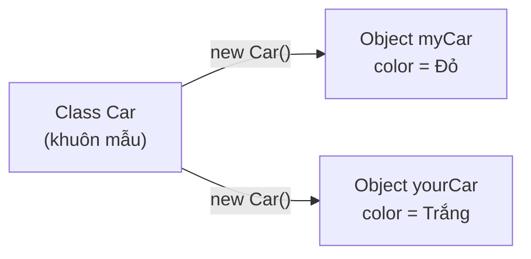

# Lớp và Đối tượng (Class & Object)

Lớp (class) và đối tượng (object) là hai khái niệm nền tảng nhất của lập trình hướng đối tượng trong Java. Lớp giống như bản thiết kế mô tả một sự vật có dữ liệu gì và làm được gì, còn đối tượng là thực thể cụ thể được tạo ra từ bản thiết kế đó. Hiểu rõ hai khái niệm này là bước đầu tiên bắt buộc trước khi học sâu hơn về OOP. Bài này giới thiệu class, object, từ khóa `new`, constructor và `this`.

[](pathname:///img/java/lop-va-doi-tuong.webp)

---

:::note[Ghi nhớ nhanh]

- ⭐ **`class` là khuôn mẫu, `object` là thực thể** — từ một class dùng `new` tạo ra nhiều object độc lập, mỗi object giữ dữ liệu riêng.
- ⭐ **`constructor` gán dữ liệu ban đầu** — hàm chạy tự động khi tạo object, tên trùng tên class và không có kiểu trả về.
- **Tạo object bằng `new`** — `Car c = new Car();`; quên `new` hoặc dùng khi object còn `null` sẽ gây lỗi biên dịch / `NullPointerException`.
- **`this` trỏ tới object hiện tại** — dùng để phân biệt thuộc tính với tham số khi trùng tên.

:::

---

## Mục lục

- [Vì sao cần class & object?](#vì-sao-cần-class--object)
- [OOP là gì?](#oop-là-gì)
- [Lớp (Class) — Khuôn mẫu](#lớp-class--khuôn-mẫu)
- [Đối tượng (Object) — Thực thể cụ thể](#đối-tượng-object--thực-thể-cụ-thể)
- [Tạo đối tượng bằng từ khóa new](#tạo-đối-tượng-bằng-từ-khóa-new)
- [Constructor — Hàm khởi tạo](#constructor--hàm-khởi-tạo)
- [Từ khóa this](#từ-khóa-this)
- [Lỗi thường gặp](#lỗi-thường-gặp)
- [Tóm tắt](#tóm-tắt)
- [Câu hỏi phỏng vấn](#câu-hỏi-phỏng-vấn)

---

## Vì sao cần class & object?

**Vấn đề:** Giả sử cần lưu thông tin 100 user, mỗi user có tên, email, tuổi. Nếu dùng các biến rời rạc thì code nhanh chóng hỗn loạn, dữ liệu không gắn được với hành vi liên quan, và không có "khuôn" để tái lập.

```java
// Mỗi user lại đẻ ra thêm 3 biến rời rạc...
String ten1 = "An";   String email1 = "an@mail.com";   int tuoi1 = 20;
String ten2 = "Bình"; String email2 = "binh@mail.com"; int tuoi2 = 22;
String ten3 = "Cường";String email3 = "cuong@mail.com";int tuoi3 = 19;
// ... lặp tới user thứ 100 thì không thể quản nổi
```

**Giải pháp:** Định nghĩa MỘT **class** làm khuôn mẫu (gồm thuộc tính + phương thức), rồi tạo bao nhiêu **object** cũng được từ khuôn đó bằng `new`. Mỗi object giữ dữ liệu riêng và gắn sẵn hành vi liên quan.

```java
// Class User: khuôn mẫu định nghĩa thuộc tính + hành vi
public class User {
    String ten;
    String email;
    int tuoi;

    void chao() {
        System.out.println("Xin chào, tôi là " + ten);
    }
}

// Tạo bao nhiêu object cũng được, mỗi object có dữ liệu riêng
User u1 = new User(); u1.ten = "An";    u1.email = "an@mail.com";   u1.tuoi = 20;
User u2 = new User(); u2.ten = "Bình";  u2.email = "binh@mail.com"; u2.tuoi = 22;
u1.chao(); // Xin chào, tôi là An
```

:::tip[Dùng thực tế]
- **Tạo nhiều thực thể từ một khuôn:** một class `User` sinh ra hàng trăm user mà không cần viết lại cấu trúc.
- **Mỗi object giữ state riêng:** sửa `u1` không ảnh hưởng `u2`.
- **Gắn method với dữ liệu:** hành vi (`chao()`) đi kèm ngay dữ liệu nó cần.
- **Mô hình hoá thực thể nghiệp vụ:** sản phẩm, đơn hàng, tài khoản... mỗi loại là một class.
:::

---

## OOP là gì?

**OOP** (Object-Oriented Programming — lập trình hướng đối tượng) là một cách viết chương trình bằng cách mô phỏng lại **các sự vật trong thế giới thực** thành các "đối tượng" trong code. Thay vì viết ra hàng loạt lệnh rời rạc, ta gom dữ liệu và hành vi liên quan lại với nhau thành từng "khối" gọn gàng.

Ví dụ đời thường: hãy nghĩ về một chiếc **xe hơi**. Một chiếc xe có:

- **Dữ liệu** (đặc điểm): màu sắc, hãng xe, tốc độ hiện tại.
- **Hành vi** (việc nó làm được): tăng tốc, phanh, bấm còi.

OOP cho phép ta gom cả đặc điểm lẫn hành vi của "xe hơi" vào chung một chỗ trong code.

---

## Lớp (Class) — Khuôn mẫu

**Class** (lớp — bản thiết kế/khuôn mẫu để tạo ra đối tượng) giống như **bản vẽ thiết kế** của một ngôi nhà. Bản vẽ KHÔNG phải là ngôi nhà thật, nó chỉ mô tả ngôi nhà sẽ trông như thế nào. Từ MỘT bản vẽ, ta có thể xây ra NHIỀU ngôi nhà giống nhau.

Tương tự, một class mô tả: một đối tượng sẽ có những dữ liệu gì và làm được những việc gì.

```java
// Định nghĩa một lớp tên là Car (Xe hơi)
public class Car {
    // Các thuộc tính (dữ liệu mà mỗi chiếc xe sẽ có)
    String color;   // màu sắc
    String brand;   // hãng xe
    int speed;      // tốc độ hiện tại

    // Một phương thức (hành vi mà xe làm được)
    void honk() {
        System.out.println("Bíp bíp!");
    }
}
```

:::tip Quy ước đặt tên
Tên class trong Java được viết theo kiểu **PascalCase**: chữ cái đầu mỗi từ viết hoa, ví dụ `Car`, `BankAccount`, `StudentRecord`.
:::

---

## Đối tượng (Object) — Thực thể cụ thể

**Object** (đối tượng — một thực thể cụ thể được tạo ra từ class) chính là "ngôi nhà thật" được xây từ bản vẽ. Từ một class `Car`, ta có thể tạo ra rất nhiều object: chiếc xe đỏ của bạn, chiếc xe trắng của hàng xóm... Mỗi object có dữ liệu riêng của nó.

| Khái niệm | Ví dụ thực tế | Trong code |
|-----------|---------------|------------|
| Class (khuôn mẫu) | Bản vẽ thiết kế xe | `class Car { ... }` |
| Object (thực thể) | Chiếc xe đỏ cụ thể | `Car myCar = new Car();` |

Một object còn được gọi là một **instance** (thể hiện — một bản cụ thể của class).

Sơ đồ minh hoạ: từ MỘT class (khuôn mẫu), dùng `new` để tạo ra NHIỀU object độc lập:



---

## Tạo đối tượng bằng từ khóa new

Để tạo một object từ class, ta dùng từ khóa **`new`** (tạo mới — yêu cầu Java cấp phát bộ nhớ và tạo ra một đối tượng mới).

```java
public class Main {
    public static void main(String[] args) {
        // Tạo một đối tượng Car mới và đặt tên biến là myCar
        Car myCar = new Car();

        // Gán dữ liệu cho từng thuộc tính của object này
        myCar.color = "Đỏ";
        myCar.brand = "Toyota";
        myCar.speed = 0;

        // Truy cập thuộc tính bằng dấu chấm (.)
        System.out.println("Màu xe: " + myCar.color);   // In ra: Màu xe: Đỏ

        // Gọi phương thức của object
        myCar.honk();   // In ra: Bíp bíp!

        // Tạo thêm một đối tượng khác — hoàn toàn độc lập với myCar
        Car yourCar = new Car();
        yourCar.color = "Trắng";
        System.out.println("Màu xe của bạn: " + yourCar.color); // Trắng
    }
}
```

Lưu ý: `myCar` và `yourCar` là hai object riêng biệt. Đổi màu của `myCar` không ảnh hưởng gì tới `yourCar`.

---

## Constructor — Hàm khởi tạo

**Constructor** (hàm khởi tạo — một hàm đặc biệt chạy tự động ngay khi object được tạo) giúp ta gán dữ liệu ban đầu cho object NGAY lúc tạo, thay vì phải gán từng dòng như trên.

Đặc điểm của constructor:

- Tên của nó **trùng y hệt** tên class.
- KHÔNG có kiểu trả về (không có `void`, không có `int`...).

```java
public class Car {
    String color;
    String brand;
    int speed;

    // Constructor: nhận màu và hãng để gán ngay khi tạo object
    public Car(String color, String brand) {
        this.color = color;   // gán tham số color vào thuộc tính color
        this.brand = brand;
        this.speed = 0;       // tốc độ ban đầu luôn là 0
    }
}
```

Khi đã có constructor, việc tạo object gọn hơn nhiều:

```java
// Truyền dữ liệu thẳng vào lúc tạo object
Car myCar = new Car("Đỏ", "Toyota");
System.out.println(myCar.brand); // Toyota
```

:::info Constructor mặc định
Nếu bạn KHÔNG viết constructor nào, Java tự cấp cho class một **constructor mặc định** (default constructor) rỗng, không tham số. Nhưng khi bạn đã tự viết một constructor có tham số, Java sẽ KHÔNG còn tự cấp cái rỗng nữa.
:::

---

## Từ khóa this

**`this`** (từ khóa tham chiếu tới chính object đang được thao tác) dùng để phân biệt giữa **thuộc tính của object** và **tham số của hàm** khi chúng trùng tên.

```java
public class Car {
    String color;

    public Car(String color) {
        // this.color -> thuộc tính của object
        // color      -> tham số truyền vào
        this.color = color; // gán tham số vào thuộc tính
    }
}
```

Nếu KHÔNG dùng `this`, dòng `color = color;` sẽ tự gán tham số cho chính nó, và thuộc tính của object vẫn rỗng — một lỗi rất hay gặp ở người mới.

---

## Lỗi thường gặp

1. **Quên từ khóa `new`**: `Car myCar = Car();` sẽ báo lỗi biên dịch. Phải là `Car myCar = new Car();`.
2. **`NullPointerException`**: Khai báo `Car myCar;` nhưng chưa `new` mà đã dùng `myCar.color` sẽ gây lỗi vì object chưa tồn tại (đang là `null` — rỗng).
3. **Constructor có kiểu trả về**: viết `public void Car(...)` thì đây KHÔNG phải constructor mà chỉ là một phương thức bình thường. Constructor không có kiểu trả về.
4. **Quên `this`**: khi tham số trùng tên thuộc tính, thiếu `this` khiến thuộc tính không được gán đúng.

---

## Tóm tắt

- **Class** là khuôn mẫu/bản thiết kế; **object** là thực thể cụ thể tạo ra từ class.
- Dùng từ khóa **`new`** để tạo object: `Car c = new Car();`.
- **Constructor** là hàm chạy tự động khi tạo object, dùng để gán dữ liệu ban đầu; tên trùng tên class và không có kiểu trả về.
- **`this`** trỏ tới chính object hiện tại, dùng để phân biệt thuộc tính với tham số.
- Mỗi object có dữ liệu riêng, độc lập với các object khác cùng class.

---

## Câu hỏi phỏng vấn

Những câu thường gặp về chủ đề này. Tự trả lời trước, rồi bấm **Xem đáp án** để đối chiếu.

**1. Phân biệt `class` và `object`. Cho ví dụ để làm rõ mối quan hệ giữa chúng.**

<details className="qa">
<summary>Xem đáp án</summary>

- **`class`** là bản thiết kế/khuôn mẫu, chỉ mô tả một loại thực thể sẽ có dữ liệu gì và làm được gì. `class` không chiếm bộ nhớ cho dữ liệu thực tế.
- **`object`** (hay **instance**) là thực thể cụ thể được tạo ra từ class bằng từ khóa `new`, có dữ liệu riêng và tồn tại thật trong bộ nhớ (heap).

```java
class Car { String color; }     // khuôn mẫu, chưa có xe nào cả
Car c1 = new Car();             // object cụ thể thứ nhất
Car c2 = new Car();             // object cụ thể thứ hai, độc lập với c1
```

Một class có thể tạo ra vô số object, mỗi object giữ một bản sao dữ liệu riêng.

</details>

**2. Khi gọi `new Car()`, JVM thực hiện những bước nào theo thứ tự?**

<details className="qa">
<summary>Xem đáp án</summary>

1. **Cấp phát bộ nhớ** trên heap đủ chỗ cho các field của object.
2. **Gán giá trị mặc định** cho từng field (`0` cho số, `false` cho `boolean`, `null` cho tham chiếu).
3. **Chạy constructor** (bắt đầu từ constructor của lớp cha thông qua `super(...)` ngầm định, rồi tới thân constructor hiện tại) để gán dữ liệu ban đầu.
4. Trả về **tham chiếu (reference)** tới vùng nhớ vừa tạo, gán cho biến ở vế trái (`Car myCar = ...`).

Biến `myCar` không chứa object thật, mà chỉ chứa **địa chỉ tham chiếu** tới object nằm trên heap.

</details>

**3. Khi nào Java tự động cấp một constructor mặc định (default constructor)? Điều gì xảy ra nếu bạn tự viết một constructor có tham số?**

<details className="qa">
<summary>Xem đáp án</summary>

Java chỉ tự cấp **default constructor** (rỗng, không tham số, thân trống) khi class **hoàn toàn không khai báo constructor nào**.

Ngay khi bạn tự viết **bất kỳ** constructor nào (dù có tham số hay không), Java sẽ **không** còn tự cấp constructor mặc định nữa.

```java
public class Car {
    public Car(String color) { this.color = color; }
    String color;
}

// Car c = new Car(); // LỖI: không còn constructor không tham số
Car c = new Car("Đỏ"); // phải truyền đúng tham số
```

</details>

**4. Overload constructor (nạp chồng constructor) là gì? Viết ví dụ một class `Car` có 2 constructor overload nhau.**

<details className="qa">
<summary>Xem đáp án</summary>

**Overload constructor** là khai báo nhiều constructor cùng tên class nhưng khác nhau về **số lượng hoặc kiểu tham số**, giúp tạo object theo nhiều cách khác nhau.

```java
public class Car {
    String color;
    String brand;

    public Car(String brand) {
        this(brand, "Trắng"); // gọi constructor kia, tránh lặp code
    }

    public Car(String brand, String color) {
        this.brand = brand;
        this.color = color;
    }
}

Car c1 = new Car("Toyota");           // dùng màu mặc định
Car c2 = new Car("Honda", "Đỏ");      // chỉ định cả màu
```

</details>

**5. `this(...)` (gọi constructor khác trong cùng class) khác gì với `this.field` (truy cập thuộc tính)? Có quy tắc nào bắt buộc khi dùng `this(...)`?**

<details className="qa">
<summary>Xem đáp án</summary>

- **`this.field`**: tham chiếu tới thuộc tính của object hiện tại, dùng để phân biệt với tham số cùng tên.
- **`this(...)`**: gọi một constructor **khác** trong cùng class (constructor chaining), giúp tái sử dụng logic khởi tạo thay vì lặp lại.

Quy tắc bắt buộc: `this(...)` (cũng như `super(...)`) nếu có thì phải là **câu lệnh đầu tiên** trong thân constructor, và một constructor chỉ được gọi `this(...)` **hoặc** `super(...)`, không được cả hai.

```java
public Car(String brand) {
    this(brand, "Trắng"); // phải là dòng đầu tiên
    // System.out.println(...); // OK sau dòng this(...)
}
```

</details>

**6. Đoạn code sau in ra gì? Giải thích vì sao thay đổi qua `b` lại ảnh hưởng tới `a`.**

```java
Car a = new Car();
a.color = "Đỏ";
Car b = a;
b.color = "Trắng";
System.out.println(a.color);
```

<details className="qa">
<summary>Xem đáp án</summary>

In ra `Trắng`.

`a` và `b` không phải hai object khác nhau — cả hai biến chỉ là hai **tham chiếu (reference)** cùng trỏ tới **một** object duy nhất trên heap (`Car b = a;` chỉ copy địa chỉ tham chiếu, không tạo object mới). Vì vậy sửa `color` qua `b` cũng chính là sửa dữ liệu của object mà `a` đang trỏ tới.

Muốn có hai object độc lập, phải dùng `new` riêng: `Car b = new Car();`.

</details>

**7. So sánh `==` và `.equals()` khi dùng với object. Vì sao `new String("abc") == new String("abc")` cho kết quả `false`?**

<details className="qa">
<summary>Xem đáp án</summary>

- **`==`** so sánh **tham chiếu** — hai biến có trỏ tới cùng một object trên heap hay không.
- **`.equals()`** so sánh **nội dung logic** — hành vi cụ thể do class override quyết định (mặc định trong `Object` cũng chỉ so sánh `==`).

```java
String s1 = new String("abc");
String s2 = new String("abc");
System.out.println(s1 == s2);       // false: hai object khác nhau trên heap
System.out.println(s1.equals(s2));  // true: String đã override equals() để so nội dung
```

Với các class tự viết mà chưa override `equals()`, gọi `.equals()` cho kết quả y hệt `==` vì đang dùng cài đặt mặc định kế thừa từ `Object`.

</details>

**8. Vì sao nên override `toString()` cho các class tự viết? Điều gì xảy ra nếu không override?**

<details className="qa">
<summary>Xem đáp án</summary>

Nếu không override, `System.out.println(myCar)` sẽ gọi `toString()` mặc định của `Object`, in ra một chuỗi vô nghĩa dạng `Car@1b6d3586` (tên class + mã băm dạng hex) — không giúp ích khi debug hay log.

```java
public class Car {
    String color;
    String brand;

    @Override
    public String toString() {
        return "Car{brand=" + brand + ", color=" + color + "}";
    }
}

Car c = new Car(); c.brand = "Toyota"; c.color = "Đỏ";
System.out.println(c); // Car{brand=Toyota, color=Đỏ}
```

Override `toString()` giúp log, debug, và test dễ đọc hơn rất nhiều — gần như là quy ước bắt buộc cho mọi class có dữ liệu (Java 16+ có thể dùng `record` để tự động sinh `toString()` hợp lý).

</details>

**9. Khi nào nên overload nhiều constructor, khi nào nên chuyển sang dùng Builder pattern?**

<details className="qa">
<summary>Xem đáp án</summary>

**Overload constructor phù hợp khi:**

- Class có ít tham số (khoảng 2–4) và không có nhiều tổ hợp tham số tùy chọn.

**Nên chuyển sang Builder khi:**

- Class có **nhiều tham số**, đặc biệt nhiều tham số **tùy chọn** — overload constructor lúc này sinh ra "telescoping constructor" (hàng loạt constructor chồng chéo, dễ gọi nhầm thứ tự tham số cùng kiểu).
- Muốn code gọi rõ ràng, đọc như văn xuôi:

```java
Car car = Car.builder()
    .brand("Toyota")
    .color("Đỏ")
    .seats(4)
    .build();
```

Builder thường được cài đặt là một **static nested class** đi kèm class chính, và rất hợp với các object bất biến (immutable) nhiều trường tùy chọn.

</details>

**10. `NullPointerException` liên quan tới object thường xảy ra trong tình huống nào? Cho một ví dụ và cách phòng tránh.**

<details className="qa">
<summary>Xem đáp án</summary>

Xảy ra khi gọi phương thức hoặc truy cập field trên một biến tham chiếu đang là `null` (chưa từng `new`, hoặc bị gán `null` có chủ đích).

```java
Car myCar; // chỉ khai báo, chưa new — giá trị mặc định là null
System.out.println(myCar.color); // NullPointerException
```

Cách phòng tránh phổ biến:

- Luôn khởi tạo (`new`) trước khi dùng, hoặc kiểm tra `!= null` trước khi truy cập.
- Dùng `Optional<Car>` cho giá trị có thể vắng mặt thay vì trả `null` từ phương thức.
- Từ Java 14+, thông báo lỗi NPE đã chi tiết hơn (Helpful NullPointerExceptions) — chỉ rõ chính xác biến/field nào là `null`, giúp debug nhanh hơn nhiều so với trước đây.

</details>
