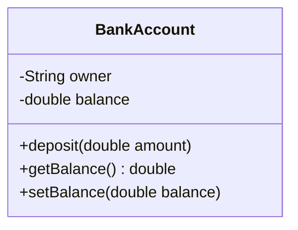

# Thuộc tính và Phương thức

Mỗi lớp trong Java được tạo nên từ hai thành phần chính: thuộc tính (dữ liệu mà đối tượng lưu giữ) và phương thức (hành vi mà đối tượng thực hiện). Nắm vững cách khai báo thuộc tính, viết phương thức, truyền tham số và trả về kết quả sẽ giúp bạn xây dựng được các lớp hữu ích, an toàn. Bài này giới thiệu thuộc tính, phương thức, tham số, giá trị trả về và cặp getter/setter.

[](pathname:///img/java/thuoc-tinh-va-phuong-thuc.webp)

---

:::note[Ghi nhớ nhanh]

- ⭐ **Class gồm `fields` (dữ liệu) và `methods` (hành vi)** — thuộc tính mô tả object "có gì", phương thức mô tả object "làm được gì".
- ⭐ **Getter/Setter + `private` = đóng gói** — che giấu thuộc tính bằng `private`, đọc/ghi qua `getX`/`setX` có kiểm tra hợp lệ.
- **`void` vs kiểu trả về** — `void` là không trả về gì; ngược lại phải khai báo kiểu trả về và dùng `return`.
- **Tham số vs đối số** — tham số là biến trong khai báo phương thức; đối số là giá trị thực tế khi gọi.

:::

---

## Mục lục

- [Tổng quan: dữ liệu và hành vi](#tổng-quan-dữ-liệu-và-hành-vi)
- [Vì sao gom thuộc tính & phương thức vào class?](#vì-sao-gom-thuộc-tính--phương-thức-vào-class)
- [Thuộc tính (Fields)](#thuộc-tính-fields)
- [Phương thức (Methods)](#phương-thức-methods)
- [Tham số (Parameters)](#tham-số-parameters)
- [Giá trị trả về (Return value)](#giá-trị-trả-về-return-value)
- [Getter và Setter](#getter-và-setter)
- [Lỗi thường gặp](#lỗi-thường-gặp)
- [Tóm tắt](#tóm-tắt)
- [Câu hỏi phỏng vấn](#câu-hỏi-phỏng-vấn)

---

## Tổng quan: dữ liệu và hành vi

Một class trong Java gồm hai thành phần chính:

- **Fields** (thuộc tính — dữ liệu mà object lưu giữ): mô tả object "là gì", "có gì".
- **Methods** (phương thức — hành vi mà object thực hiện): mô tả object "làm được gì".

Ví dụ đời thường với một **tài khoản ngân hàng**:

- Thuộc tính: số dư, tên chủ tài khoản.
- Phương thức: gửi tiền, rút tiền, xem số dư.

Sơ đồ cấu trúc lớp `BankAccount`: phần trên là thuộc tính (dữ liệu), phần dưới là phương thức (hành vi):



---

## Vì sao gom thuộc tính & phương thức vào class?

**Vấn đề:** Nếu trạng thái (dữ liệu) để một nơi, còn các hàm xử lý trạng thái đó để nơi khác, hai bên dễ lệch nhau, ai cũng sửa được dữ liệu, và khó biết hành vi nào thực sự thuộc về thực thể nào.

```java
// Dữ liệu trôi nổi, ai cũng đụng vào được
double balance = 1000000;

// Logic nằm rời rạc, dễ quên kiểm tra, dễ làm số dư sai
void deposit(double amount) {
    balance = balance + amount; // không gắn với "tài khoản" nào cả
}
```

**Giải pháp:** Class gom **thuộc tính** (field — trạng thái) và **phương thức** (method — hành vi tác động lên chính trạng thái đó) vào một chỗ. Dữ liệu và logic liên quan đi cùng nhau; method dùng `this` thao tác trực tiếp trên state của object, làm tăng tính **gắn kết** (cohesion).

```java
public class BankAccount {
    private double balance; // trạng thái thuộc về chính object này

    // Hành vi đi liền dữ liệu, validate ngay trên field
    public void deposit(double amount) {
        if (amount <= 0) return;     // logic gần dữ liệu, khó làm sai
        this.balance += amount;       // this = chính object đang gọi
    }
}
```

:::tip[Dùng thực tế]

- **`BankAccount`** có `balance` + `deposit()/withdraw()`: tiền và cách thay đổi tiền nằm cùng chỗ.
- **Validate trên chính field**: setter kiểm tra số âm ngay tại nơi giữ dữ liệu.
- **Giữ logic gần dữ liệu**: sửa cách tính số dư chỉ cần sửa trong một class.
- **Mô hình hoá hành vi thực thể**: object "tự biết" làm gì với trạng thái của mình.

:::

---

## Thuộc tính (Fields)

Thuộc tính là các biến được khai báo bên trong class (ngoài các phương thức). Mỗi object sẽ có một bản sao riêng của các thuộc tính này.

```java
public class BankAccount {
    // Các thuộc tính của tài khoản
    String owner;     // tên chủ tài khoản
    double balance;   // số dư (double = số thực, lưu được phần thập phân)
}
```

Nếu không gán giá trị, thuộc tính có **giá trị mặc định**: số (`int`, `double`) là `0`, boolean là `false`, còn đối tượng/`String` là `null` (rỗng).

---

## Phương thức (Methods)

**Method** (phương thức — một khối code có tên, thực hiện một việc cụ thể) cho phép object "làm" điều gì đó. Cấu trúc một phương thức:

```
<kiểu trả về> <tên phương thức>(<danh sách tham số>) {
    // phần thân: các lệnh cần thực hiện
}
```

```java
public class BankAccount {
    String owner;
    double balance;

    // Phương thức không trả về gì (void), chỉ thực hiện hành động
    void showBalance() {
        System.out.println("Số dư của " + owner + ": " + balance);
    }
}
```

Từ khóa **`void`** (rỗng — phương thức không trả về giá trị nào) cho biết phương thức này chỉ làm việc chứ không "đưa lại" kết quả gì.

---

## Tham số (Parameters)

**Parameter** (tham số — dữ liệu được truyền VÀO phương thức để nó dùng) giúp phương thức làm việc linh hoạt với dữ liệu khác nhau mỗi lần gọi.

```java
public class BankAccount {
    double balance;

    // amount là tham số: số tiền muốn gửi
    void deposit(double amount) {
        balance = balance + amount; // cộng tiền gửi vào số dư
        System.out.println("Đã gửi: " + amount);
    }
}
```

Khi gọi, ta truyền **argument** (đối số — giá trị thực tế đưa vào cho tham số):

```java
BankAccount acc = new BankAccount();
acc.deposit(500000); // 500000 là argument cho tham số amount
```

Một phương thức có thể có nhiều tham số, ngăn cách bởi dấu phẩy:

```java
void transfer(String toName, double amount) {
    // ... chuyển amount tới tài khoản toName
}
```

---

## Giá trị trả về (Return value)

Khi phương thức cần "đưa lại" một kết quả, ta khai báo **kiểu trả về** (thay cho `void`) và dùng từ khóa **`return`** (trả về — gửi kết quả ra ngoài và kết thúc phương thức).

```java
public class BankAccount {
    double balance;

    // Phương thức trả về một số double: số dư hiện tại
    double getBalance() {
        return balance; // trả giá trị balance ra ngoài
    }

    // Trả về true/false: kiểm tra đủ tiền để rút không
    boolean canWithdraw(double amount) {
        return balance >= amount; // biểu thức so sánh cho ra true hoặc false
    }
}
```

Cách dùng giá trị trả về:

```java
double current = acc.getBalance(); // lưu kết quả vào biến
if (acc.canWithdraw(100000)) {
    System.out.println("Đủ tiền để rút");
}
```

---

## Getter và Setter

Thông thường, ta không cho code bên ngoài truy cập thẳng vào thuộc tính, mà che giấu chúng rồi cung cấp hai loại phương thức:

- **Getter** (phương thức "lấy" — trả về giá trị của một thuộc tính). Tên thường là `getX`.
- **Setter** (phương thức "đặt" — gán/thay đổi giá trị một thuộc tính). Tên thường là `setX`.

Lợi ích: ta có thể KIỂM TRA dữ liệu trước khi cho phép thay đổi, tránh dữ liệu sai.

```java
public class BankAccount {
    private double balance; // private = chỉ truy cập được bên trong class này

    // Getter: cho phép đọc số dư
    public double getBalance() {
        return balance;
    }

    // Setter: cho phép gán số dư, kèm kiểm tra hợp lệ
    public void setBalance(double balance) {
        if (balance < 0) {
            System.out.println("Số dư không được âm!");
            return; // không gán nếu dữ liệu sai
        }
        this.balance = balance;
    }
}
```

```java
BankAccount acc = new BankAccount();
acc.setBalance(1000000);              // gán hợp lệ
System.out.println(acc.getBalance()); // đọc ra: 1000000.0
acc.setBalance(-50);                  // bị từ chối, in cảnh báo
```

:::tip
Việc che giấu thuộc tính bằng `private` rồi dùng getter/setter chính là biểu hiện của **encapsulation** (đóng gói — che giấu dữ liệu bên trong, chỉ cho truy cập qua phương thức). Ta sẽ học kỹ về phạm vi truy cập ở bài tiếp theo.
:::

---

## Lỗi thường gặp

1. **Quên `return`**: phương thức khai báo trả về `int` nhưng không có `return` sẽ báo lỗi biên dịch "missing return statement".
2. **Sai kiểu trả về**: khai báo trả về `int` nhưng `return "abc";` (chuỗi) sẽ báo lỗi.
3. **Số lượng/kiểu argument sai**: gọi `deposit()` mà thiếu tham số, hoặc truyền chuỗi cho tham số `double`, đều gây lỗi biên dịch.
4. **Truy cập thẳng `private`**: dùng `acc.balance` từ bên ngoài khi `balance` là `private` sẽ báo lỗi — phải dùng getter/setter.

---

## Tóm tắt

- **Fields** (thuộc tính) lưu dữ liệu; **methods** (phương thức) thực hiện hành vi.
- **`void`** nghĩa là phương thức không trả về gì; ngược lại khai báo kiểu trả về và dùng **`return`**.
- **Tham số** là dữ liệu truyền vào phương thức; **đối số** là giá trị thực tế khi gọi.
- **Getter/Setter** là cặp phương thức để đọc/ghi thuộc tính một cách an toàn, có kiểm tra.
- Che giấu thuộc tính bằng `private` rồi truy cập qua getter/setter là kỹ thuật đóng gói.

---

## Câu hỏi phỏng vấn

Những câu thường gặp về chủ đề này. Tự trả lời trước, rồi bấm **Xem đáp án** để đối chiếu.

**1. Phân biệt field (thuộc tính) và method (phương thức) trong một class.**

<details className="qa">
<summary>Xem đáp án</summary>

- **Field**: biến khai báo trực tiếp bên trong class (ngoài các method), lưu **dữ liệu/trạng thái** của object. Mỗi object có bản sao riêng (trừ field `static`).
- **Method**: khối code có tên, mô tả **hành vi** object thực hiện được, có thể nhận tham số và trả về giá trị.

```java
public class BankAccount {
    private double balance; // field: dữ liệu
    public void deposit(double amount) { balance += amount; } // method: hành vi
}
```

Nói ngắn gọn: field trả lời "object có gì", method trả lời "object làm được gì".

</details>

**2. `void` nghĩa là gì? Nếu một phương thức khai báo trả về `int` nhưng thiếu `return` ở một nhánh code thì có lỗi gì?**

<details className="qa">
<summary>Xem đáp án</summary>

`void` nghĩa là phương thức **không trả về giá trị nào**, chỉ thực hiện hành động.

Nếu khai báo kiểu trả về khác `void` (ví dụ `int`), trình biên dịch **bắt buộc** mọi đường đi trong thân phương thức phải có `return` giá trị đúng kiểu, nếu không sẽ báo lỗi biên dịch `missing return statement`.

```java
int kiemTra(int x) {
    if (x > 0) {
        return 1;
    }
    // LỖI: nhánh else không có return -> "missing return statement"
}
```

</details>

**3. Phân biệt "tham số" (parameter) và "đối số" (argument). Cho ví dụ trong cùng một đoạn code để chỉ rõ đâu là cái nào.**

<details className="qa">
<summary>Xem đáp án</summary>

- **Tham số (parameter)**: biến được khai báo trong **định nghĩa** phương thức, chỉ là placeholder chưa có giá trị cụ thể.
- **Đối số (argument)**: giá trị **thực tế** được truyền vào khi **gọi** phương thức.

```java
void deposit(double amount) { // amount: tham số
    balance += amount;
}

acc.deposit(500000); // 500000: đối số (argument) truyền cho amount
```

</details>

**4. Overload method (nạp chồng phương thức) là gì? Đoạn code sau có hợp lệ không, vì sao?**

```java
void log(String msg) { }
void log(String msg, int level) { }
int log(String msg) { return 0; }
```

<details className="qa">
<summary>Xem đáp án</summary>

**Overload** là khai báo nhiều method **cùng tên** trong một class nhưng khác nhau về **danh sách tham số** (số lượng hoặc kiểu), cho phép gọi tên method đó theo nhiều cách.

Đoạn code trên **không hợp lệ**: hai method đầu hợp lệ (khác số lượng tham số), nhưng method thứ ba trùng hoàn toàn chữ ký (`signature`) với method đầu tiên — chỉ khác kiểu trả về (`int` thay vì `void`). Java xác định overload dựa trên **tên + danh sách tham số**, **không** tính kiểu trả về, nên đây là lỗi biên dịch "method đã được định nghĩa".

</details>

**5. Java truyền tham số theo giá trị (pass-by-value) hay theo tham chiếu (pass-by-reference)? Giải thích qua ví dụ với kiểu nguyên thủy (`int`).**

<details className="qa">
<summary>Xem đáp án</summary>

Java luôn truyền tham số theo **giá trị (pass-by-value)**, kể cả với object — thứ được copy là **giá trị của tham chiếu**, không phải bản thân object.

```java
void tang(int x) {
    x = x + 1; // chỉ đổi bản sao cục bộ
}

int a = 5;
tang(a);
System.out.println(a); // vẫn là 5, không đổi
```

Với kiểu nguyên thủy, thay đổi tham số bên trong method **không** ảnh hưởng biến gốc, vì `x` chỉ là bản sao độc lập của `a`.

</details>

**6. Với tham số kiểu object (ví dụ một `List`), thay đổi *nội dung* bên trong method có ảnh hưởng ra ngoài không? Vì sao khác với ví dụ `int` ở câu trên?**

<details className="qa">
<summary>Xem đáp án</summary>

**Có ảnh hưởng**, nếu method sửa **nội dung** của object mà tham chiếu đang trỏ tới (chứ không gán lại cả tham chiếu).

```java
void themItem(List<String> list) {
    list.add("mới"); // sửa nội dung object mà tham chiếu đang trỏ tới
}

List<String> ds = new ArrayList<>(List.of("a"));
themItem(ds);
System.out.println(ds); // [a, mới] -> đã đổi
```

Lý do: giá trị được copy là **địa chỉ tham chiếu**, nhưng cả bản gốc lẫn bản sao tham chiếu đều trỏ tới **cùng một object** trên heap, nên sửa nội dung qua bản sao vẫn thấy được từ bên ngoài. Ngược lại, nếu method gán lại `list = new ArrayList<>();` thì chỉ đổi bản sao tham chiếu cục bộ, biến `ds` bên ngoài không đổi.

</details>

**7. Getter trả về trực tiếp một field kiểu `List` có nguy cơ gì cho tính đóng gói? Cách khắc phục là gì?**

<details className="qa">
<summary>Xem đáp án</summary>

Nếu getter trả về **trực tiếp** tham chiếu tới field bên trong (ví dụ `List`, `Map`, mảng), code bên ngoài có thể sửa thẳng nội dung đó mà không qua bất kỳ kiểm tra nào — phá vỡ tính đóng gói dù field đã để `private`.

```java
public class Order {
    private List<String> items = new ArrayList<>();
    public List<String> getItems() { return items; } // rò rỉ tham chiếu nội bộ!
}

order.getItems().clear(); // xóa sạch dữ liệu nội bộ, "qua mặt" mọi validate
```

Khắc phục bằng **defensive copy** (bản sao phòng vệ) hoặc trả về view chỉ đọc:

```java
public List<String> getItems() {
    return List.copyOf(items); // hoặc Collections.unmodifiableList(items)
}
```

</details>

**8. Vì sao nên validate dữ liệu trong setter thay vì tin tưởng dữ liệu đầu vào? Cho ví dụ với `setBalance`.**

<details className="qa">
<summary>Xem đáp án</summary>

Setter là "cửa vào" duy nhất để thay đổi field `private` từ bên ngoài. Nếu không validate, object có thể rơi vào trạng thái **không hợp lệ** (ví dụ số dư âm) mà không ai ngăn được, dẫn tới bug khó truy ở tầng xa hơn.

```java
public void setBalance(double balance) {
    if (balance < 0) {
        throw new IllegalArgumentException("Số dư không được âm");
    }
    this.balance = balance;
}
```

Validate ngay tại setter giúp lỗi bị chặn **sớm nhất có thể**, ngay tại nơi phát sinh, thay vì để nó lan ra và gây hậu quả khó lần ở chỗ khác. Trong dự án lớn, việc này thường được chuẩn hóa bằng Bean Validation (`jakarta.validation`, annotation như `@Min`, `@NotNull`) thay vì viết tay từng if.

</details>
