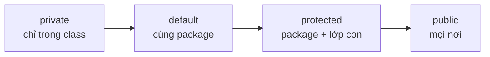

# Phạm vi truy cập (Access Specifiers)

Phạm vi truy cập quyết định "ai" được phép nhìn thấy và dùng một thuộc tính hay phương thức trong Java. Đây là công cụ chính để thực hiện tính đóng gói, giúp bạn che giấu chi tiết bên trong và chỉ mở ra những gì cần thiết, từ đó code an toàn và dễ bảo trì hơn. Bài này giới thiệu bốn mức truy cập `public`, `private`, `protected`, `default` cùng cách chọn mức phù hợp.

[](pathname:///img/java/access-specifiers.webp)

---

:::note[Ghi nhớ nhanh]

- ⭐ **4 mức từ kín tới mở: `private` → `default` → `protected` → `public`** — quyết định "ai" được truy cập thuộc tính/phương thức.
- ⭐ **Là công cụ chính để đóng gói (encapsulation)** — ẩn cái cần ẩn, lộ cái cần lộ để giữ bất biến của object.
- **`private` chỉ trong class, `public` mọi nơi** — `protected` là cùng package + lớp con; `default` (không viết gì) chỉ trong cùng package.
- **Nguyên tắc vàng: chọn mức kín nhất có thể** — ưu tiên `private` cho thuộc tính, chỉ mở rộng khi thật cần.

:::

---

## Mục lục

- [Vì sao có access modifier (public/private...)?](#vì-sao-có-access-modifier-publicprivate)
- [Access Specifier là gì?](#access-specifier-là-gì)
- [public — Công khai](#public--công-khai)
- [private — Riêng tư](#private--riêng-tư)
- [protected — Bảo vệ](#protected--bảo-vệ)
- [default — Mặc định (package-private)](#default--mặc-định-package-private)
- [Bảng so sánh phạm vi](#bảng-so-sánh-phạm-vi)
- [Khi nào dùng cái nào?](#khi-nào-dùng-cái-nào)
- [Lỗi thường gặp](#lỗi-thường-gặp)
- [Tóm tắt](#tóm-tắt)
- [Câu hỏi phỏng vấn](#câu-hỏi-phỏng-vấn)

---

## Vì sao có access modifier (public/private...)?

**Vấn đề:** Nếu mọi thành phần (thuộc tính/phương thức) đều truy cập được từ bên ngoài, người dùng class có thể sửa trực tiếp trạng thái sai quy tắc, và code khác phụ thuộc vào chi tiết nội bộ khiến sau này khó thay đổi cài đặt mà không làm vỡ chỗ khác.

```java
public class BankAccount {
    public double balance; // ai cũng sửa được
}

BankAccount acc = new BankAccount();
acc.balance = -1000; // số dư âm vô lý nhưng vẫn được phép -> dữ liệu sai
```

**Giải pháp:** Access modifier kiểm soát phạm vi truy cập: `private` (chỉ trong class — ẩn chi tiết), `protected` (class + lớp con + package), default (chỉ package), `public` (mọi nơi — API công khai). Ẩn cái cần ẩn, lộ cái cần lộ — vừa đóng gói dữ liệu, vừa được tự do thay đổi nội bộ về sau.

```java
public class BankAccount {
    private double balance; // ẩn, không sửa trực tiếp được

    public void deposit(double amount) { // API public có kiểm soát
        if (amount <= 0) throw new IllegalArgumentException("Số tiền phải > 0");
        balance += amount;
    }

    public double getBalance() {
        return balance;
    }
}
```

:::tip[Dùng thực tế]
- Thuộc tính để `private`, mở qua getter/setter để **kiểm soát** giá trị đầu vào (chặn số dư âm).
- Ẩn các phương thức "phụ trợ" nội bộ bằng `private`, không cho bên ngoài gọi nhầm.
- Chỉ lộ ra `public` những phương thức là **API ổn định** (`deposit`, `getBalance`).
- Giữ **bất biến** của object (vd số dư luôn ≥ 0) bằng cách không cho sửa trực tiếp trạng thái.
:::

---

## Access Specifier là gì?

**Access specifier** (từ khóa quy định phạm vi truy cập — quyết định ai được phép nhìn thấy và dùng một thuộc tính/phương thức) giống như các **mức độ riêng tư** trong một ngôi nhà:

- Sân trước: ai cũng vào được.
- Phòng khách: chỉ người trong nhà và họ hàng.
- Phòng ngủ: chỉ chủ nhân.

Trong Java có 4 mức: `public`, `protected`, `default`, `private`. Chúng giúp ta che giấu chi tiết bên trong và chỉ "mở cửa" những gì cần thiết — đây chính là tinh thần của **encapsulation** (đóng gói).

Để hiểu các mức này, cần biết hai khái niệm:

- **Package** (gói — một thư mục nhóm nhiều class liên quan, sẽ học ở bài sau).
- **Subclass** (lớp con — class kế thừa từ một class khác).

---

## public — Công khai

**`public`** (công khai — bất kỳ nơi nào cũng truy cập được). Đây là mức mở nhất.

```java
public class Car {
    public String brand; // ai cũng đọc/ghi được

    public void honk() {  // ai cũng gọi được
        System.out.println("Bíp bíp!");
    }
}
```

```java
Car c = new Car();
c.brand = "Honda"; // OK ở bất kỳ đâu vì là public
c.honk();          // OK
```

---

## private — Riêng tư

**`private`** (riêng tư — CHỈ truy cập được bên trong chính class đó). Đây là mức kín nhất và là lựa chọn được khuyên dùng cho hầu hết các thuộc tính.

```java
public class BankAccount {
    private double balance; // chỉ class BankAccount mới đụng tới được

    public double getBalance() {
        return balance; // truy cập private từ BÊN TRONG class -> OK
    }
}
```

```java
BankAccount acc = new BankAccount();
// acc.balance = 100; // LỖI biên dịch: balance là private
System.out.println(acc.getBalance()); // phải dùng phương thức public
```

---

## protected — Bảo vệ

**`protected`** (bảo vệ — truy cập được trong cùng package VÀ trong các lớp con kế thừa, kể cả lớp con ở package khác). Mức này chủ yếu dành cho kế thừa.

```java
public class Animal {
    protected String name; // lớp con dùng lại được
}

// Lớp con kế thừa Animal
public class Dog extends Animal {
    public void introduce() {
        // truy cập name (protected) từ lớp con -> OK
        System.out.println("Tôi tên " + name);
    }
}
```

---

## default — Mặc định (package-private)

Nếu KHÔNG viết từ khóa nào, mặc định là **default** (còn gọi là **package-private** — chỉ truy cập được trong CÙNG package, không có lớp con ở package khác nào dùng được).

```java
class Helper {        // không có public -> class này là default
    int value = 10;   // không có từ khóa -> thuộc tính default
}
```

Các class trong cùng thư mục/package có thể dùng `Helper` và `value`, nhưng class ở package khác thì không.

---

## Bảng so sánh phạm vi

Dấu ✅ = truy cập được, ❌ = không truy cập được.

| Vị trí truy cập | `private` | `default` | `protected` | `public` |
|-----------------|:---------:|:---------:|:-----------:|:--------:|
| Trong cùng class | ✅ | ✅ | ✅ | ✅ |
| Cùng package | ❌ | ✅ | ✅ | ✅ |
| Lớp con (package khác) | ❌ | ❌ | ✅ | ✅ |
| Mọi nơi khác | ❌ | ❌ | ❌ | ✅ |

Thứ tự từ kín nhất tới mở nhất: `private` → `default` → `protected` → `public`.

Sơ đồ minh hoạ mức độ mở rộng dần của phạm vi truy cập (trái là kín nhất, phải là mở nhất):



---

## Khi nào dùng cái nào?

- **`private`**: dùng cho HẦU HẾT thuộc tính. Che giấu dữ liệu, chỉ mở qua getter/setter. Đây là mặc định nên theo để code an toàn.
- **`public`**: dùng cho các phương thức là "giao diện" để bên ngoài gọi (như `deposit`, `getBalance`), và cho class mà bạn muốn người khác dùng.
- **`protected`**: dùng khi bạn thiết kế class để cho người khác kế thừa và lớp con cần truy cập thành viên đó.
- **`default`**: dùng cho các class/phương thức "nội bộ" của một package, không muốn lộ ra ngoài.

:::tip Nguyên tắc vàng
Hãy luôn chọn mức **kín nhất có thể**. Bắt đầu với `private`, chỉ mở rộng (lên `public`) khi thực sự cần. Điều này giúp giảm rủi ro code khác vô tình phá hỏng dữ liệu của bạn.
:::

---

## Lỗi thường gặp

1. **Để mọi thuộc tính là `public`**: dữ liệu dễ bị code khác sửa bừa, mất kiểm soát. Hãy ưu tiên `private`.
2. **Nhầm `protected` chỉ là cho lớp con**: thực ra `protected` cũng cho phép truy cập trong cùng package.
3. **Quên rằng "không viết gì" là `default`, không phải `public`**: nhiều người mới tưởng bỏ trống là công khai.
4. **Cố truy cập thành viên `private` từ ngoài**: gây lỗi biên dịch; phải dùng phương thức public trung gian.

---

## Tóm tắt

- 4 mức truy cập (từ kín tới mở): `private` → `default` → `protected` → `public`.
- **`private`**: chỉ trong class đó. **`public`**: mọi nơi.
- **`protected`**: cùng package và các lớp con. **`default`** (không viết gì): chỉ cùng package.
- Nguyên tắc: chọn mức **kín nhất có thể**, ưu tiên `private` cho thuộc tính.
- Phạm vi truy cập là công cụ chính để thực hiện **đóng gói (encapsulation)**.

---

## Câu hỏi phỏng vấn

Những câu thường gặp về chủ đề này. Tự trả lời trước, rồi bấm **Xem đáp án** để đối chiếu.

**1. Liệt kê 4 mức access specifier trong Java theo thứ tự từ kín nhất tới mở nhất.**

<details className="qa">
<summary>Xem đáp án</summary>

Từ kín nhất tới mở nhất: `private` → `default` (không viết gì) → `protected` → `public`.

| Mức | Phạm vi truy cập |
|---|---|
| `private` | Chỉ trong chính class đó |
| `default` | Cùng package |
| `protected` | Cùng package + lớp con (kể cả khác package) |
| `public` | Mọi nơi |

</details>

**2. `protected` và `default` khác nhau ở điểm nào? Nhiều người mới hay hiểu nhầm điều gì về `protected`?**

<details className="qa">
<summary>Xem đáp án</summary>

- **`default`**: chỉ truy cập được trong **cùng package**, không có ngoại lệ cho lớp con ở package khác.
- **`protected`**: truy cập được trong **cùng package**, cộng thêm cả **lớp con kế thừa dù ở package khác**.

Hiểu nhầm phổ biến: nhiều người tưởng `protected` chỉ dành riêng cho lớp con, nhưng thực ra nó **rộng hơn** `default` vì vẫn cho phép mọi class cùng package truy cập, không chỉ lớp con.

</details>

**3. Đoạn code sau lỗi ở dòng nào? Giải thích vì sao.**

```java
public class BankAccount {
    private double balance;
}

BankAccount acc = new BankAccount();
acc.balance = 500000;
```

<details className="qa">
<summary>Xem đáp án</summary>

Lỗi biên dịch ở dòng `acc.balance = 500000;`.

`balance` là `private`, chỉ truy cập được từ **bên trong chính class `BankAccount`**. Đoạn code gọi từ bên ngoài (ví dụ trong `main` của class khác) nên trình biên dịch báo lỗi `balance has private access in BankAccount`. Phải cung cấp một phương thức `public` (setter, hoặc `deposit(...)` có validate) để thao tác gián tiếp.

</details>

**4. Vì sao top-level class (class khai báo trực tiếp trong file, không lồng) chỉ có thể là `public` hoặc `default`, không thể là `private` hay `protected`?**

<details className="qa">
<summary>Xem đáp án</summary>

`private` và `protected` có ý nghĩa gắn với **quan hệ chứa/kế thừa** (bên trong một class khác, hoặc giữa lớp cha - lớp con). Một top-level class không nằm bên trong class nào cả, nên khái niệm "chỉ class chứa nó mới thấy" hay "chỉ lớp con mới thấy" không áp dụng được ở cấp này.

```java
public class Car { }   // OK
class Helper { }       // OK: default (package-private)
// private class X { } // LỖI: không hợp lệ cho top-level class
```

Lưu ý: quy tắc này chỉ áp dụng cho top-level class. Với **nested class** (lớp lồng nhau), cả 4 mức đều hợp lệ vì lúc đó nó nằm "bên trong" một class khác.

</details>

**5. Vì sao khi override một method, lớp con không được phép thu hẹp phạm vi truy cập so với method gốc ở lớp cha?**

<details className="qa">
<summary>Xem đáp án</summary>

Vì điều đó sẽ vi phạm nguyên tắc **Liskov Substitution** (mọi nơi dùng được lớp cha phải dùng được lớp con thay thế). Nếu code đang gọi method `public` qua tham chiếu kiểu lớp cha, mà lớp con lại override thành `private`/`protected`, lời gọi đó sẽ "biến mất" một cách vô lý ở runtime.

```java
class Animal {
    public void sound() { }
}

class Dog extends Animal {
    // protected void sound() { } // LỖI: thu hẹp từ public xuống protected
    public void sound() { } // OK: giữ nguyên hoặc mở rộng
}
```

Quy tắc: lớp con override chỉ được **giữ nguyên hoặc mở rộng** access modifier, không được thu hẹp.

</details>

**6. Nếu muốn viết một class helper chỉ dùng nội bộ trong package, không cho package khác thấy, nên khai báo thế nào?**

<details className="qa">
<summary>Xem đáp án</summary>

Không thêm từ khóa access modifier nào cho class (dùng mức **default/package-private**), và các thành viên bên trong cũng có thể để `default` nếu chỉ dùng trong cùng package.

```java
// Không có "public" -> chỉ package hiện tại thấy được class này
class ValidationHelper {
    static boolean isValidEmail(String email) {
        return email != null && email.contains("@");
    }
}
```

Cách này giấu chi tiết cài đặt nội bộ, chỉ để lộ ra ngoài đúng những gì thật sự là API công khai (thường đặt trong package `internal` hoặc `impl` theo quy ước một số dự án).

</details>

**7. Access modifier liên hệ thế nào với nguyên lý đóng gói (encapsulation)? Nêu một ví dụ cụ thể về lợi ích khi thay đổi cài đặt bên trong mà không ảnh hưởng code gọi.**

<details className="qa">
<summary>Xem đáp án</summary>

Access modifier là **công cụ kỹ thuật** để thực hiện encapsulation: field/method `private` bị giấu kín, chỉ để lộ ra API `public` ổn định. Nhờ vậy, thay đổi chi tiết cài đặt bên trong không làm "vỡ" code đang dùng class đó, miễn là chữ ký `public` giữ nguyên.

```java
public class BankAccount {
    private double balance; // trước lưu double

    public double getBalance() { return balance; }
}

// Sau này đổi sang lưu bằng BigDecimal nội bộ để tránh sai số thập phân,
// chỉ cần sửa bên trong getBalance(), code gọi acc.getBalance() không đổi gì.
```

Đây là lý do luôn nên ưu tiên `private` cho field và chỉ công khai hành vi (method) cần thiết.

</details>

**8. Tình huống thiết kế: bạn viết một thư viện (library) để nhóm khác dùng. Field nào nên `private`, method nào nên `public`, khi nào cần `protected`?**

<details className="qa">
<summary>Xem đáp án</summary>

Nguyên tắc chung: **bắt đầu kín nhất, chỉ mở khi thật cần**.

- **`private`**: tất cả field lưu trạng thái nội bộ, và các method phụ trợ (helper) chỉ phục vụ logic bên trong class.
- **`public`**: chỉ những method là **hợp đồng ổn định** với người dùng thư viện (API bạn cam kết không đổi tùy tiện) — đổi API `public` sẽ làm vỡ code của mọi người đang dùng thư viện.
- **`protected`**: dùng khi thiết kế class **cho phép kế thừa có chủ đích** — ví dụ một `AbstractRepository` để lộ vài method hoặc field cho lớp con tùy biến, nhưng vẫn giấu khỏi người dùng thông thường của thư viện.
- **`default`**: dùng cho class/method chỉ là chi tiết triển khai nội bộ của package, không thuộc API công khai.

Việc phân loại đúng ngay từ đầu giúp thư viện dễ tiến hóa về sau mà không phá vỡ tương thích ngược.

</details>
