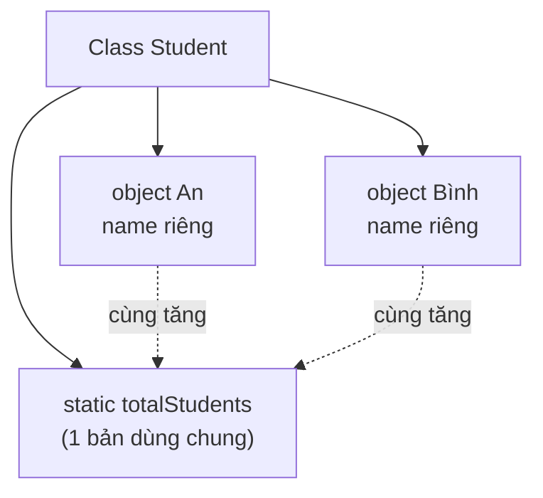

# Từ khóa static

Từ khóa `static` đánh dấu một thành viên thuộc về chính lớp chứ không thuộc về từng đối tượng riêng lẻ, nghĩa là nó được chia sẻ chung cho mọi đối tượng. Đây là khái niệm quan trọng nhưng hay gây nhầm lẫn cho người mới, ví dụ điển hình là dùng biến static làm bộ đếm số đối tượng đã tạo. Bài này giới thiệu biến static, phương thức static và khối static.

[](pathname:///img/java/static-keyword.webp)

---

:::note[Ghi nhớ nhanh]

- ⭐ **`static` thuộc về class, không thuộc object** — chỉ có một bản dùng chung cho mọi object, tồn tại ngay cả khi chưa tạo object nào.
- **Truy cập qua tên class** — `Counter.count`, `MathUtil.square(5)`; gọi được mà không cần `new`.
- **Phương thức static không dùng trực tiếp thành viên instance** — đây cũng là lý do `main` phải là `static`.
- **Khối `static { }` chạy một lần khi class được nạp** — dùng để khởi tạo dữ liệu static; ví dụ điển hình là bộ đếm số object đã tạo.

:::

---

## Mục lục

- [Vì sao có từ khóa static?](#vì-sao-có-từ-khóa-static)
- [static là gì?](#static-là-gì)
- [Thành viên instance vs static](#thành-viên-instance-vs-static)
- [Biến static](#biến-static)
- [Phương thức static](#phương-thức-static)
- [Khối static (static block)](#khối-static-static-block)
- [Ví dụ thực tế: bộ đếm object](#ví-dụ-thực-tế-bộ-đếm-object)
- [Lỗi thường gặp](#lỗi-thường-gặp)
- [Tóm tắt](#tóm-tắt)
- [Câu hỏi phỏng vấn](#câu-hỏi-phỏng-vấn)

---

## Vì sao có từ khóa static?

**Vấn đề:** Một số dữ liệu và hành vi thuộc về **khái niệm chung** chứ không thuộc riêng từng object: hằng số như số PI, một bộ đếm dùng chung, hay các hàm tiện ích như tìm số lớn nhất. Nếu gắn chúng vào instance thì phải tạo object một cách vô nghĩa chỉ để gọi, và mỗi object lại giữ một bản sao thừa thãi của cùng một giá trị.

```java
public class MathHelper {
    double pi = 3.14159; // mỗi object một bản sao PI giống hệt nhau (thừa)

    int max(int a, int b) { // muốn gọi phải tạo object dù hàm không cần dữ liệu object
        return a > b ? a : b;
    }
}

// Phải tạo object vô nghĩa chỉ để dùng hàm tiện ích
MathHelper helper = new MathHelper();
int m = helper.max(3, 7);
```

**Giải pháp:** Dùng `static` để gắn thành viên với **chính class** — chỉ có một bản dùng chung, gọi qua tên class mà không cần `new`. Áp dụng cho biến static (chia sẻ giữa mọi instance), method static (hàm tiện ích/factory), hằng `static final` và khối static.

```java
public class MathHelper {
    static final double PI = 3.14159; // hằng dùng chung, một bản duy nhất

    static int max(int a, int b) { // hàm tiện ích, không cần object
        return a > b ? a : b;
    }
}

// Gọi thẳng qua tên class, không tạo object thừa
int m = MathHelper.max(3, 7);
double area = MathHelper.PI * 2 * 2;
```

:::tip[Dùng thực tế]
- **Hằng số dùng chung**: khai báo `static final` như `Math.PI`, `Integer.MAX_VALUE`.
- **Hàm tiện ích**: gọi thẳng `Math.max(a, b)`, `Integer.parseInt("42")` mà không cần new.
- **Đếm số instance**: dùng một static counter tăng dần mỗi khi tạo object mới.
- **Factory method**: method static trả về object, ví dụ `LocalDate.now()`, `List.of(...)`.
:::

---

## static là gì?

**`static`** (tĩnh — thành viên thuộc về CHÍNH class, không thuộc về từng object riêng lẻ) là một từ khóa quan trọng nhưng hay gây nhầm lẫn cho người mới.

Hãy hình dung một **trường học**:

- Mỗi **học sinh** có tên riêng, điểm riêng → đây là dữ liệu **instance** (của từng object).
- **Tên trường** thì chung cho TẤT CẢ học sinh → đây là dữ liệu **static** (của cả class).

Thành viên `static` được **chia sẻ chung** cho mọi object và tồn tại ngay cả khi chưa tạo object nào.

---

## Thành viên instance vs static

- **Instance member** (thành viên thể hiện — thuộc về từng object): mỗi object có một bản sao riêng. Truy cập qua tên biến object: `myCar.color`.
- **Static member** (thành viên tĩnh — thuộc về class): chỉ có MỘT bản dùng chung. Truy cập qua tên class: `Car.totalCars`.

| | Instance (không static) | Static |
|---|---|---|
| Thuộc về | Từng object | Cả class |
| Số bản sao | Mỗi object một bản | Chỉ một bản chung |
| Truy cập qua | `object.thanhVien` | `Class.thanhVien` |
| Cần tạo object trước? | Có | Không |

Sơ đồ minh hoạ: biến `static` chỉ có MỘT bản dùng chung, còn mỗi object giữ dữ liệu instance riêng:



---

## Biến static

Biến static được khai báo với từ khóa `static`. Tất cả object cùng class chia sẻ chung một giá trị.

```java
public class Counter {
    static int count = 0; // biến static, dùng chung cho mọi object
    int id;               // biến instance, riêng từng object
}
```

```java
Counter a = new Counter();
Counter b = new Counter();

Counter.count = 5;            // truy cập qua tên class
System.out.println(a.count);  // 5 (vì dùng chung)
System.out.println(b.count);  // 5 (cùng một biến với a)
```

Đổi `count` ở bất kỳ object nào cũng ảnh hưởng tới tất cả, vì chỉ có MỘT biến `count`.

---

## Phương thức static

**Phương thức static** thuộc về class, gọi được mà KHÔNG cần tạo object. Thường dùng cho các hàm tiện ích (utility) không phụ thuộc dữ liệu của một object cụ thể.

```java
public class MathUtil {
    // Phương thức static: tính bình phương của một số
    static int square(int n) {
        return n * n;
    }
}
```

```java
// Gọi qua tên class, không cần new MathUtil()
int result = MathUtil.square(5); // 25
```

:::warning Quy tắc quan trọng
Phương thức static **KHÔNG truy cập được** trực tiếp các thuộc tính/phương thức instance, vì lúc đó có thể chưa có object nào tồn tại. Nó chỉ dùng được các thành viên static khác. Đây cũng là lý do `main` là `static`: JVM gọi nó mà chưa cần tạo object.
:::

---

## Khối static (static block)

**Static block** (khối tĩnh — đoạn code chạy MỘT LẦN khi class được nạp vào bộ nhớ) dùng để khởi tạo các giá trị static phức tạp.

```java
public class Config {
    static String appName;

    // Khối static: chạy một lần khi class được nạp, trước mọi việc khác
    static {
        appName = "MyApp";
        System.out.println("Đang nạp cấu hình...");
    }
}
```

Khối static chạy trước cả `main`, và chỉ chạy đúng một lần dù bạn tạo bao nhiêu object.

---

## Ví dụ thực tế: bộ đếm object

Đây là ví dụ kinh điển cho biến static — đếm xem đã tạo bao nhiêu object.

```java
public class Student {
    static int totalStudents = 0; // dùng chung: tổng số học sinh đã tạo
    String name;                  // riêng từng object

    public Student(String name) {
        this.name = name;
        totalStudents++; // mỗi lần tạo object mới thì tăng bộ đếm chung
    }
}
```

```java
public class Main {
    public static void main(String[] args) {
        new Student("An");
        new Student("Bình");
        new Student("Chi");

        // Truy cập biến static qua tên class
        System.out.println("Tổng số học sinh: " + Student.totalStudents); // 3
    }
}
```

Mỗi object có `name` riêng, nhưng `totalStudents` được tăng chung, nên đếm chính xác số object đã tạo.

---

## Lỗi thường gặp

1. **Truy cập thành viên instance trong phương thức static**: ví dụ trong `main` (static) dùng thẳng `name` (instance) sẽ báo lỗi "non-static variable cannot be referenced from a static context". Phải tạo object rồi truy cập `object.name`.
2. **Tưởng mỗi object có biến static riêng**: thực ra chỉ có một bản chung; sửa ở object này thì object khác cũng thấy.
3. **Lạm dụng static**: biến static giống "biến toàn cục", dùng nhiều sẽ khó kiểm soát và khó kiểm thử. Chỉ dùng khi dữ liệu thực sự cần chia sẻ chung.
4. **Truy cập static qua object**: `a.count` vẫn chạy nhưng gây hiểu lầm; nên viết `Counter.count` cho rõ ràng.

---

## Tóm tắt

- **`static`** = thuộc về class, dùng chung cho mọi object; **instance** = riêng từng object.
- **Biến static**: chỉ một bản chung, truy cập qua `Class.bien`.
- **Phương thức static**: gọi không cần object, KHÔNG dùng được thành viên instance trực tiếp.
- **Khối static**: chạy một lần khi class được nạp, để khởi tạo dữ liệu static.
- Ví dụ điển hình: dùng biến static làm **bộ đếm** số object đã tạo.
- Hạn chế lạm dụng static để tránh code khó bảo trì.

---

## Câu hỏi phỏng vấn

Những câu thường gặp về chủ đề này. Tự trả lời trước, rồi bấm **Xem đáp án** để đối chiếu.

**1. `static` nghĩa là gì? Phân biệt thành viên `static` và thành viên instance.**

<details className="qa">
<summary>Xem đáp án</summary>

`static` đánh dấu một thành viên **thuộc về chính class**, chỉ có **một bản duy nhất** dùng chung cho mọi object, và tồn tại ngay cả khi chưa tạo object nào.

| | Instance | Static |
|---|---|---|
| Thuộc về | Từng object | Cả class |
| Số bản sao | Mỗi object một bản | Một bản chung |
| Truy cập | `object.thanhVien` | `Class.thanhVien` |
| Cần `new` trước? | Có | Không |

</details>

**2. Vì sao phương thức `static` không thể truy cập trực tiếp thành viên instance? Đây cũng là lý do cho quy tắc gì của phương thức `main`?**

<details className="qa">
<summary>Xem đáp án</summary>

Phương thức `static` có thể được gọi **trước khi có bất kỳ object nào tồn tại** (qua tên class). Nếu nó truy cập trực tiếp một field instance, Java sẽ không biết lấy dữ liệu từ object nào — vì vậy trình biên dịch cấm hẳn, báo lỗi "non-static variable cannot be referenced from a static context".

```java
static void inTen() {
    // System.out.println(name); // LỖI: name là instance field
}
```

Đây cũng chính là lý do `public static void main(String[] args)` phải là `static`: JVM gọi `main` để khởi động chương trình khi **chưa hề có object nào** được tạo ra.

</details>

**3. Đoạn code sau in ra gì? Giải thích.**

```java
class Counter {
    static int count = 0;
    Counter() { count++; }
}

Counter a = new Counter();
Counter b = new Counter();
Counter c = new Counter();
System.out.println(a.count + " " + b.count + " " + c.count);
```

<details className="qa">
<summary>Xem đáp án</summary>

In ra `3 3 3`.

`count` là biến `static` nên chỉ có **một bản duy nhất** dùng chung cho cả class `Counter`, không phải mỗi object một bản riêng. Mỗi lần constructor chạy, `count++` tăng đúng biến chung đó. Sau 3 lần `new`, `count` = 3, và dù truy cập qua `a.count`, `b.count` hay `c.count` (dùng object gọi chỉ để tiện, thực chất Java tự hiểu là `Counter.count`) đều trả về cùng một giá trị.

</details>

**4. Khối `static { }` chạy khi nào? Thứ tự chạy so với constructor như thế nào khi tạo nhiều object?**

<details className="qa">
<summary>Xem đáp án</summary>

Khối `static { }` chạy **đúng một lần**, ngay khi class được JVM **nạp (load)** vào bộ nhớ lần đầu tiên — trước cả `main` và trước constructor của bất kỳ object nào.

```java
class Config {
    static { System.out.println("Nạp Config"); } // chạy 1 lần duy nhất
    Config() { System.out.println("Tạo object"); } // chạy mỗi lần new
}

new Config();
new Config();
// In ra:
// Nạp Config
// Tạo object
// Tạo object
```

Dù bạn tạo bao nhiêu object, static block cũng không chạy lại lần thứ hai.

</details>

**5. Method `static` có thể bị override (ghi đè) bởi lớp con không? Giải thích khái niệm "method hiding" (ẩn phương thức) qua ví dụ.**

<details className="qa">
<summary>Xem đáp án</summary>

**Không.** Method `static` **không tham gia cơ chế đa hình runtime (override)** — nó chỉ có thể bị **hide (ẩn)**, và việc gọi method nào được quyết định lúc **biên dịch** dựa theo **kiểu khai báo** của biến, không phải kiểu thực sự của object.

```java
class Animal {
    static void hello() { System.out.println("Animal"); }
}
class Dog extends Animal {
    static void hello() { System.out.println("Dog"); } // hide, không phải override
}

Animal a = new Dog();
a.hello(); // in "Animal" — quyết định theo kiểu KHAI BÁO (Animal), không phải Dog
```

Nếu là method instance thông thường (không static), kết quả sẽ là `"Dog"` nhờ đa hình runtime. Đây là câu hỏi phỏng vấn kinh điển để kiểm tra hiểu biết về sự khác nhau giữa override và hide.

</details>

**6. Việc dùng biến `static` để lưu trạng thái dùng chung có rủi ro gì trong ứng dụng đa luồng (multi-threaded)?**

<details className="qa">
<summary>Xem đáp án</summary>

Biến `static` được **chia sẻ giữa mọi thread** trong cùng một JVM. Nếu nhiều thread cùng đọc/ghi mà không đồng bộ hóa, sẽ xảy ra **race condition** (tranh chấp dữ liệu) — ví dụ bộ đếm bị tăng sai do hai thread cùng đọc giá trị cũ trước khi ghi lại.

```java
static int count = 0;
void increment() { count++; } // KHÔNG an toàn khi nhiều thread gọi đồng thời
```

Cách khắc phục phổ biến: dùng `synchronized`, hoặc các lớp nguyên tử trong `java.util.concurrent.atomic` như `AtomicInteger`, hoặc tránh hẳn trạng thái `static` mutable dùng chung — đặc biệt quan trọng trong môi trường web server xử lý nhiều request song song.

</details>

**7. `static import` và `static nested class` khác nhau thế nào? Cho ví dụ ngắn cho mỗi loại.**

<details className="qa">
<summary>Xem đáp án</summary>

- **`static import`**: cho phép gọi thẳng tên method/field `static` của class khác mà không cần viết tên class phía trước.

```java
import static java.lang.Math.max;
int m = max(3, 7); // thay vì Math.max(3, 7)
```

- **`static nested class`**: một class được khai báo `static` bên trong class khác, không cần object của lớp bao ngoài để tạo (xem chi tiết ở bài "Lớp lồng nhau").

```java
class Outer {
    static class Helper { }
}
Outer.Helper h = new Outer.Helper();
```

Hai khái niệm này độc lập nhau: một cái liên quan tới cú pháp gọi method/field, một cái liên quan tới cách khai báo class lồng.

</details>

**8. Singleton pattern (đảm bảo một class chỉ có đúng một instance) thường dùng `static` như thế nào? Viết ví dụ đơn giản, thread-safe.**

<details className="qa">
<summary>Xem đáp án</summary>

Singleton dùng một field `static` để giữ **instance duy nhất**, và một method `static` để cấp phát/truy cập instance đó, đảm bảo không tạo thêm bản thứ hai.

```java
public class AppConfig {
    private static final AppConfig INSTANCE = new AppConfig(); // khởi tạo ngay khi nạp class

    private AppConfig() { } // constructor private: chặn "new" từ bên ngoài

    public static AppConfig getInstance() {
        return INSTANCE;
    }
}

AppConfig cfg = AppConfig.getInstance(); // luôn nhận cùng một object
```

Cách khởi tạo `static final` ngay tại chỗ khai báo (như trên) tận dụng cơ chế nạp class của JVM để đảm bảo **thread-safe** mà không cần `synchronized` thủ công — JVM đảm bảo static initializer chỉ chạy đúng một lần, an toàn giữa các thread.

</details>
