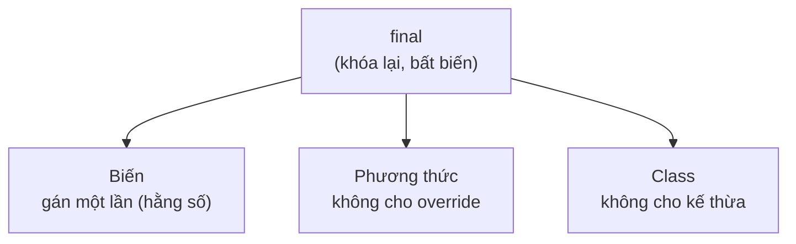

# Từ khóa final

Từ khóa `final` dùng để "khóa" một thứ lại, ngăn không cho thay đổi sau khi đã thiết lập. Nó giúp code an toàn hơn bằng cách tạo ra hằng số bất biến, ngăn phương thức bị ghi đè hay ngăn một lớp bị kế thừa. Bài này giới thiệu cách dùng `final` với biến, phương thức, lớp và tham số.

---

:::note[Ghi nhớ nhanh]

- ⭐ **`final` = khóa lại, không cho thay đổi** — áp dụng cho biến, phương thức và class.
- ⭐ **Với object, `final` chỉ khóa tham chiếu** — không gán lại được object khác nhưng dữ liệu bên trong object vẫn đổi được.
- **Biến `final` là hằng số, gán đúng một lần** — quy ước tên `UPPER_SNAKE_CASE`; kết hợp `static final` cho hằng dùng chung.
- **Phương thức `final` không bị override, class `final` không bị kế thừa** — ví dụ `String` là class `final`.

:::

---

## Mục lục

- [Vì sao có từ khóa final?](#vì-sao-có-từ-khóa-final)
- [final là gì?](#final-là-gì)
- [Biến final (hằng số)](#biến-final-hằng-số)
- [Quy ước đặt tên hằng](#quy-ước-đặt-tên-hằng)
- [Hằng số static final](#hằng-số-static-final)
- [Phương thức final](#phương-thức-final)
- [Lớp final](#lớp-final)
- [final với tham số](#final-với-tham-số)
- [Lỗi thường gặp](#lỗi-thường-gặp)
- [Tóm tắt](#tóm-tắt)

---

## Vì sao có từ khóa final?

**Vấn đề:** Có những thứ trong code **không nên thay đổi**, nhưng Java mặc định cho phép
gán lại biến, override phương thức và kế thừa class. Không có cách "khóa", ta dễ vô tình
làm sai hành vi quan trọng.

```java
class Account {
    double interestRate = 0.05; // lẽ ra là hằng số cố định
    void transfer() { /* logic chuyển tiền nhạy cảm */ }
}

class HackedAccount extends Account {
    // Lớp con override làm vỡ logic bảo mật
    void transfer() { /* bỏ qua kiểm tra, rút sạch tiền */ }
}

// Ở đâu đó trong code: hằng số bị gán lại nhầm
Account acc = new Account();
acc.interestRate = 99.0; // tai họa: không ai chặn được
```

**Giải pháp:** `final` đánh dấu một thứ là **BẤT BIẾN / KHÔNG ĐƯỢC THAY**: biến `final`
chỉ gán một lần (hằng số), phương thức `final` không cho override, class `final` không cho
kế thừa (ví dụ `String`). Nhờ đó code an toàn hơn, ý đồ rõ ràng hơn, hỗ trợ thiết kế
immutable và cho phép JVM tối ưu.

```java
class Account {
    final double INTEREST_RATE = 0.05;      // hằng số: gán một lần
    public final void transfer() { /* ... */ } // không lớp con nào override được
}

final class Money { /* ... */ } // không class nào kế thừa được

// acc.INTEREST_RATE = 99.0; // LỖI biên dịch: chặn ngay từ đầu
```

:::tip[Dùng thực tế]

- **Hằng số cấu hình**: `public static final int MAX_USERS = 1000;` dùng chung, không đổi.
- **Class immutable**: đánh dấu các field `final` để object không thay đổi sau khi tạo (an toàn khi chia sẻ giữa nhiều luồng).
- **Khóa method nhạy cảm**: để `final` cho phương thức xác thực/giao dịch, tránh lớp con override làm sai hành vi.
- **Biến cho lambda / inner class**: biến địa phương dùng trong lambda phải là `final` (hoặc "effectively final").

:::

---

## final là gì?

**`final`** (cuối cùng — đánh dấu một thứ KHÔNG được thay đổi sau khi đã thiết lập) dùng
để "khóa" lại một giá trị, một phương thức, hoặc cả một class.

Hãy hình dung `final` như **mực không xóa được**: một khi đã viết ra thì không sửa được nữa.
Điều này giúp code an toàn hơn vì ngăn người khác (hoặc chính bạn) vô tình thay đổi những
thứ vốn phải cố định.

`final` áp dụng được cho ba thứ: **biến**, **phương thức**, và **class**.

Sơ đồ minh hoạ ba đối tượng mà `final` có thể "khóa" lại:



---

## Biến final (hằng số)

Một biến `final` chỉ được gán giá trị **đúng một lần**. Sau đó mọi nỗ lực thay đổi đều bị
báo lỗi biên dịch. Biến như vậy gọi là **hằng số** (constant — giá trị cố định không đổi).

```java
public class Circle {
    final double PI = 3.14159; // hằng số: không bao giờ đổi

    double area(double radius) {
        // PI = 3.14; // LỖI: không thể gán lại biến final
        return PI * radius * radius;
    }
}
```

Ví dụ đời thường: số ngày trong tuần luôn là 7, tốc độ ánh sáng là cố định — những giá trị
này nên là `final`.

---

## Quy ước đặt tên hằng

Theo quy ước Java, tên hằng số (biến `final`, nhất là `static final`) được viết **VIẾT HOA
TOÀN BỘ**, các từ ngăn cách bằng dấu gạch dưới `_` (kiểu **UPPER_SNAKE_CASE**).

```java
final int MAX_SPEED = 120;          // đúng quy ước
final String DEFAULT_NAME = "Khách"; // đúng quy ước
final double TAX_RATE = 0.1;         // đúng quy ước

// final int maxSpeed = 120;  // chạy được nhưng SAI quy ước đặt tên hằng
```

Quy ước này giúp người đọc nhận ra ngay đâu là hằng số chỉ bằng cách nhìn tên.

---

## Hằng số static final

Hằng số dùng chung cho cả chương trình thường kết hợp `static` và `final`:

- **`static`**: chỉ có một bản, dùng chung, không cần tạo object.
- **`final`**: không thể thay đổi.

```java
public class AppConstants {
    // Hằng số toàn cục: dùng chung và bất biến
    public static final int MAX_USERS = 1000;
    public static final String VERSION = "1.0.0";
}
```

```java
// Truy cập trực tiếp qua tên class, không cần tạo object
System.out.println(AppConstants.MAX_USERS); // 1000
```

Đây là cách chuẩn để định nghĩa các hằng số cấu hình trong một ứng dụng.

---

## Phương thức final

**Phương thức `final`** không thể bị **override** (ghi đè — lớp con viết lại phương thức
cùng tên để thay đổi hành vi). Dùng khi bạn muốn đảm bảo một hành vi không bị lớp con thay đổi.

```java
public class Account {
    // Lớp con KHÔNG được viết lại phương thức này
    public final void showId() {
        System.out.println("ID tài khoản cố định");
    }
}

public class SavingAccount extends Account {
    // public void showId() { } // LỖI: không thể override phương thức final
}
```

---

## Lớp final

**Class `final`** không thể bị **kế thừa** — không lớp nào được `extends` từ nó. Dùng khi
bạn muốn class hoàn chỉnh, không cho ai mở rộng (thường vì lý do an toàn).

```java
public final class Constants {
    // Không class nào được extends Constants
}

// public class MyConstants extends Constants { } // LỖI biên dịch
```

Một ví dụ nổi tiếng: class `String` trong Java là `final`, nên không ai thay đổi được
hành vi cốt lõi của nó.

---

## final với tham số

`final` cũng dùng cho **tham số** để đảm bảo tham số đó không bị gán lại trong thân hàm.

```java
public void greet(final String name) {
    // name = "khác"; // LỖI: tham số final không gán lại được
    System.out.println("Xin chào " + name);
}
```

:::info Lưu ý quan trọng về object final
Với biến `final` trỏ tới một object, `final` chỉ ngăn **gán lại object khác**, chứ KHÔNG
ngăn thay đổi dữ liệu BÊN TRONG object đó. Ví dụ: `final int[] arr = {1, 2};` thì không
gán `arr = mảng khác` được, nhưng `arr[0] = 99;` vẫn hợp lệ.
:::

---

## Lỗi thường gặp

1. **Gán lại biến final**: gây lỗi biên dịch "cannot assign a value to final variable".
2. **Quên khởi tạo biến final**: biến `final` phải được gán giá trị (lúc khai báo hoặc
   trong constructor); nếu không sẽ báo lỗi.
3. **Đặt tên hằng sai quy ước**: viết thường như biến bình thường khiến code khó đọc; hãy
   dùng `UPPER_SNAKE_CASE`.
4. **Tưởng object final là bất biến hoàn toàn**: thực ra chỉ tham chiếu là cố định, dữ liệu
   bên trong object vẫn đổi được.

---

## Tóm tắt

- **`final`** khóa một thứ lại, không cho thay đổi.
- **Biến final** = hằng số, gán đúng một lần; quy ước tên là `UPPER_SNAKE_CASE`.
- **`static final`** dùng cho hằng số dùng chung toàn ứng dụng.
- **Phương thức final** không bị lớp con ghi đè; **class final** không bị kế thừa.
- Với biến `final` trỏ tới object, chỉ tham chiếu là cố định — nội dung object vẫn đổi được.
