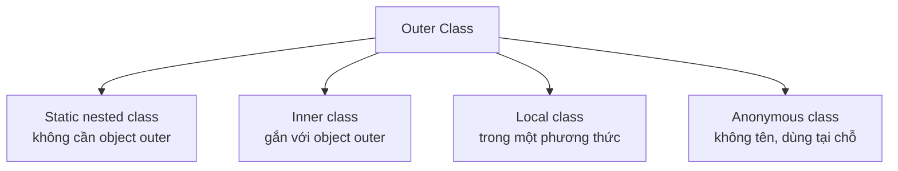

# Lớp lồng nhau (Nested Classes)

Lớp lồng nhau là một lớp được định nghĩa bên trong một lớp khác, giúp gom các lớp liên quan chặt chẽ lại gần nhau và tăng tính đóng gói. Java có bốn loại lớp lồng nhau, mỗi loại phù hợp với một tình huống khác nhau. Bài này giới thiệu static nested class, inner class, local class và anonymous class cùng cách chọn loại phù hợp.

---

## Mục lục

- [Nested Class là gì?](#nested-class-là-gì)
- [Vì sao có nested class?](#vì-sao-có-nested-class)
- [Phân loại lớp lồng nhau](#phân-loại-lớp-lồng-nhau)
- [Static nested class](#static-nested-class)
- [Inner class (non-static)](#inner-class-non-static)
- [Local class](#local-class)
- [Anonymous class](#anonymous-class)
- [Khi nào dùng loại nào?](#khi-nào-dùng-loại-nào)
- [Lỗi thường gặp](#lỗi-thường-gặp)
- [Tóm tắt](#tóm-tắt)

---

## Nested Class là gì?

**Nested class** (lớp lồng nhau — một class được định nghĩa BÊN TRONG một class khác) cho
phép ta nhóm các class liên quan chặt chẽ lại với nhau.

Hãy hình dung một **chiếc laptop**: nó chứa bên trong các bộ phận như "bàn phím", "màn hình".
Những bộ phận này chỉ có ý nghĩa khi gắn với laptop. Tương tự, lớp lồng nhau là class chỉ
phục vụ cho class bao ngoài (gọi là **outer class** — lớp bao ngoài).

Lợi ích: gom code liên quan lại gần nhau, tăng tính đóng gói, và giấu được class phụ trợ
khỏi phần còn lại của chương trình.

---

## Vì sao có nested class?

**Vấn đề:** Một số class sinh ra chỉ để phục vụ NỘI BỘ cho đúng một class khác — ví dụ
`Node` của một danh sách liên kết, hay một listener dùng đúng một lần. Tách chúng thành
file/class top-level riêng làm rối namespace và phá vỡ tính đóng gói (lộ ra class lẽ ra
chỉ-dùng-nội-bộ).

```java
// Class chỉ-dùng-nội-bộ bị tách ra top-level: rối namespace, lộ chi tiết
class Node {                 // ai cũng thấy, dù chỉ MyList mới cần
    int value;
    Node next;
}

public class MyList {
    private Node head;       // Node là chi tiết cài đặt, lẽ ra nên giấu
}
```

**Giải pháp:** Đặt class ngay BÊN TRONG class cần dùng nó. Tùy nhu cầu mà chọn: static
nested (gắn với lớp ngoài), inner class (truy cập được state của object ngoài), local &
anonymous class (tạo nhanh tại chỗ cho callback/listener trước thời lambda). Cách này gom
logic liên quan và tăng tính đóng gói.

```java
public class MyList {
    // Node giấu kín bên trong MyList: không làm rối namespace
    private static class Node {
        int value;
        Node next;
    }

    private Node head;
}
```

:::tip[Dùng thực tế]
- `Node` nội bộ của cấu trúc dữ liệu (LinkedList, Tree) — giấu kín, chỉ lớp ngoài dùng.
- `Builder` thường là **static nested class** đi kèm class nó dựng nên.
- **Anonymous class** cho event listener hoặc `Comparator` cài đặt ngay tại chỗ.
- Gói một class helper chỉ dùng trong duy nhất một class, không lộ ra ngoài.
:::

---

## Phân loại lớp lồng nhau

Java có 4 loại lớp lồng nhau:

| Loại | Vị trí khai báo | Có `static`? |
|------|-----------------|--------------|
| Static nested class | Bên trong class, có `static` | Có |
| Inner class | Bên trong class, không `static` | Không |
| Local class | Bên trong một phương thức | Không |
| Anonymous class | Tạo trực tiếp không đặt tên | Không |

Sơ đồ minh hoạ bốn loại lớp lồng nhau bên trong một lớp bao ngoài (outer class):



---

## Static nested class

**Static nested class** (lớp lồng tĩnh — lớp lồng có từ khóa `static`, KHÔNG cần object của
lớp bao ngoài để tạo) hoạt động gần như một class độc lập, chỉ là được đặt bên trong cho gọn.

```java
public class Computer {
    static int VERSION = 1;

    // Lớp lồng tĩnh: tạo được mà không cần object Computer
    static class Keyboard {
        void type() {
            System.out.println("Đang gõ phím...");
        }
    }
}
```

```java
// Tạo trực tiếp qua tên lớp bao ngoài, không cần new Computer()
Computer.Keyboard kb = new Computer.Keyboard();
kb.type(); // Đang gõ phím...
```

Static nested class chỉ truy cập được thành viên **static** của lớp bao ngoài.

---

## Inner class (non-static)

**Inner class** (lớp nội — lớp lồng KHÔNG có `static`, gắn liền với một object của lớp bao
ngoài). Muốn tạo inner class, BẮT BUỘC phải có một object của outer class trước.

```java
public class Computer {
    private String model = "Dell XPS";

    // Inner class: truy cập được cả thành viên private của Computer
    class Screen {
        void show() {
            // truy cập trực tiếp thuộc tính của object bao ngoài
            System.out.println("Màn hình của: " + model);
        }
    }
}
```

```java
Computer pc = new Computer();           // phải có object outer trước
Computer.Screen s = pc.new Screen();    // cú pháp đặc biệt: pc.new
s.show();                               // Màn hình của: Dell XPS
```

Khác biệt chính: inner class **dùng được dữ liệu instance** của object bao ngoài, còn
static nested class thì không.

---

## Local class

**Local class** (lớp cục bộ — lớp được định nghĩa BÊN TRONG một phương thức) chỉ tồn tại
và dùng được trong phạm vi phương thức đó. Hiếm gặp, dùng khi cần một class tạm thời cho
một tác vụ nhỏ.

```java
public class Greeter {
    public void greet(String userName) {
        // Local class: chỉ tồn tại trong phương thức greet
        class Message {
            void print() {
                System.out.println("Xin chào " + userName);
            }
        }

        Message m = new Message();
        m.print();
    }
}
```

---

## Anonymous class

**Anonymous class** (lớp vô danh — một class KHÔNG có tên, được tạo và dùng ngay tại chỗ)
thường dùng để cài đặt nhanh một **interface** (giao diện) hoặc kế thừa nhanh một class mà
không cần viết một class riêng đầy đủ.

```java
// Một interface đơn giản
interface Greeting {
    void sayHello();
}

public class Main {
    public static void main(String[] args) {
        // Tạo một object từ class vô danh cài đặt Greeting ngay tại chỗ
        Greeting g = new Greeting() {
            @Override
            public void sayHello() {
                System.out.println("Xin chào từ lớp vô danh!");
            }
        };
        g.sayHello();
    }
}
```

Anonymous class rất hay gặp khi xử lý sự kiện (event) hoặc truyền hành vi vào một phương thức.
Trong Java hiện đại, nhiều trường hợp anonymous class được thay bằng **lambda** cho ngắn gọn.

---

## Khi nào dùng loại nào?

- **Static nested class**: khi class lồng KHÔNG cần dữ liệu instance của outer, chỉ muốn
  nhóm cho gọn. Đây là loại nên ưu tiên.
- **Inner class**: khi class lồng CẦN truy cập dữ liệu instance của outer.
- **Local class**: khi cần một class chỉ dùng trong một phương thức duy nhất (hiếm).
- **Anonymous class**: khi cần cài đặt nhanh một interface/lớp cha tại chỗ, dùng đúng một lần.

---

## Lỗi thường gặp

1. **Tạo inner class sai cú pháp**: phải dùng `outerObject.new InnerClass()`, không thể
   `new InnerClass()` trực tiếp từ ngoài.
2. **Static nested class truy cập thành viên instance**: không được phép, chỉ truy cập
   thành viên static của outer.
3. **Quên `@Override` trong anonymous class**: không gây lỗi nhưng nên có để code rõ ràng
   và để trình biên dịch kiểm tra giúp.
4. **Lạm dụng lớp lồng nhau**: lồng quá nhiều cấp khiến code rối; chỉ dùng khi thực sự
   giúp gom nhóm hợp lý.

---

## Tóm tắt

- **Nested class** là class đặt bên trong class khác, giúp gom nhóm và tăng đóng gói.
- **Static nested class**: độc lập, không cần object outer; chỉ dùng thành viên static.
- **Inner class**: gắn với object outer, dùng được dữ liệu instance; tạo bằng `outer.new`.
- **Local class**: định nghĩa trong một phương thức, chỉ dùng tại đó.
- **Anonymous class**: class không tên, cài đặt nhanh interface/lớp cha ngay tại chỗ.
- Ưu tiên static nested class khi không cần dữ liệu instance của outer.
