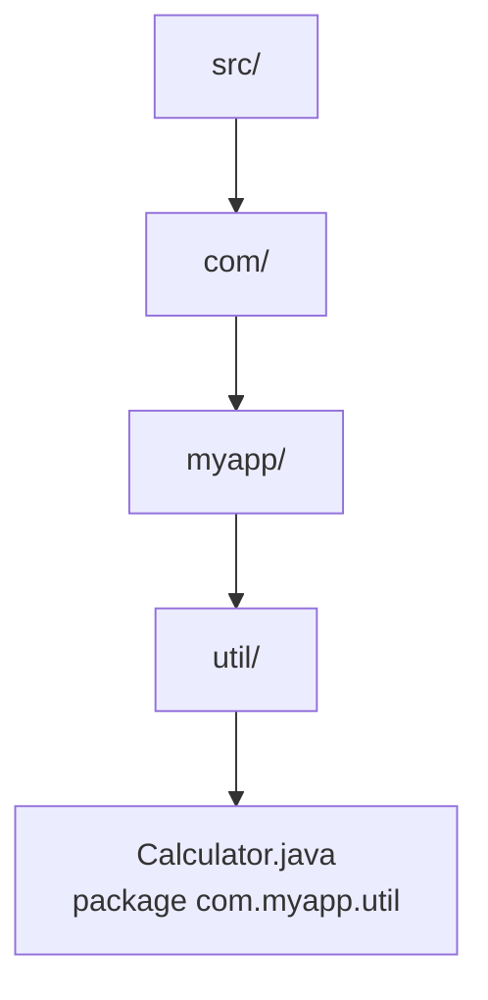

# Gói (Packages)

Package (gói) là cách tổ chức các lớp liên quan vào chung một "ngăn", giống như dùng thư mục để sắp xếp tài liệu trên máy tính. Nó giúp code gọn gàng dễ tìm, tránh trùng tên lớp và hỗ trợ kiểm soát truy cập khi dự án lớn dần với hàng trăm lớp. Bài này giới thiệu cách khai báo `package`, dùng `import`, quy ước đặt tên và các package có sẵn của Java.

[](pathname:///img/java/packages.webp)

---

:::note[Ghi nhớ nhanh]

- ⭐ **Package nhóm các class liên quan như thư mục** — tạo namespace phân cấp, tránh trùng tên class.
- **Khai báo `package ...;` ở dòng đầu tiên của file** — phải khớp với cấu trúc thư mục (`com.myapp.util` → `com/myapp/util/`).
- **Dùng `import` cho class ở package khác** — cùng package thì không cần; `java.lang` được import tự động.
- **Quy ước tên: chữ thường, theo tên miền ngược** — ví dụ `com.company.project`.

:::

---

## Mục lục

- [Vì sao cần package?](#vì-sao-cần-package)
- [Package là gì?](#package-là-gì)
- [Tại sao cần package?](#tại-sao-cần-package)
- [Khai báo package](#khai-báo-package)
- [Cấu trúc thư mục tương ứng](#cấu-trúc-thư-mục-tương-ứng)
- [import — Sử dụng class ở package khác](#import--sử-dụng-class-ở-package-khác)
- [Quy ước đặt tên package](#quy-ước-đặt-tên-package)
- [Package có sẵn của Java](#package-có-sẵn-của-java)
- [Lỗi thường gặp](#lỗi-thường-gặp)
- [Tóm tắt](#tóm-tắt)
- [Câu hỏi phỏng vấn](#câu-hỏi-phỏng-vấn)

---

## Vì sao cần package?

**Vấn đề:** Dự án lớn có hàng trăm class. Để chung một chỗ thì rối, và hai thư viện/đội có thể đặt **trùng tên** class gây xung đột; cũng khó kiểm soát class nào được lộ ra ngoài.

```java
// Cả hai đội đều có class tên Order, để chung một chỗ → đụng nhau!
public class Order { /* đơn hàng của đội bán hàng */ }
public class Order { /* đơn đặt món của đội nhà hàng */ } // LỖI: trùng tên
```

**Giải pháp:** **Package** nhóm class theo chức năng/miền thành **namespace phân cấp**. Tên đầy đủ là package + class nên không còn đụng tên; code tổ chức rõ ràng; kết hợp access modifier (package-private) để kiểm soát truy cập, và `import` để dùng class ở package khác.

```java
// Hai class Order khác nhau nhờ ở hai package khác nhau
package com.company.sales.order;
public class Order { /* đơn hàng */ }

package com.company.restaurant.order;
public class Order { /* đơn đặt món */ } // OK: tên đầy đủ khác nhau
```

:::tip[Dùng thực tế]

- **Chia code theo lớp**: tách `controller`, `service`, `repository` thành các package riêng.
- **Đặt tên theo domain ngược**: `com.company.app.order` để không trùng với tổ chức khác.
- **Tránh trùng tên thư viện**: class `Order` của bạn không đụng `Order` của thư viện ngoài.
- **Package-private**: để thành phần nội bộ (helper) chỉ dùng được trong cùng package.

:::

---

## Package là gì?

**Package** (gói — một nhóm các class liên quan được tổ chức chung với nhau) giống như các **thư mục** trên máy tính dùng để sắp xếp tài liệu.

Hãy hình dung một **tủ hồ sơ**: bạn không vứt mọi giấy tờ vào chung một ngăn, mà chia thành các ngăn "Hóa đơn", "Hợp đồng", "Ảnh". Package làm điều tương tự với các class: nhóm những class cùng chức năng vào chung một "ngăn".

---

## Tại sao cần package?

- **Tổ chức code gọn gàng**: dễ tìm, dễ quản lý khi dự án lớn dần với hàng trăm class.
- **Tránh trùng tên**: hai class cùng tên `Account` có thể tồn tại nếu ở hai package khác nhau.
- **Kiểm soát truy cập**: nhớ lại mức `default` (package-private) ở bài access specifiers — chỉ class cùng package mới truy cập được.

---

## Khai báo package

Câu lệnh **`package`** (khai báo class này thuộc gói nào) phải là **dòng code đầu tiên** trong file (trước cả `import` và định nghĩa class).

```java
// Dòng đầu tiên: khai báo class Calculator thuộc package com.myapp.util
package com.myapp.util;

public class Calculator {
    public int add(int a, int b) {
        return a + b; // cộng hai số
    }
}
```

Một file `.java` chỉ có **một** câu lệnh `package`, và nếu không khai báo thì class sẽ nằm trong **default package** (gói mặc định — không khuyến khích dùng cho dự án thật).

---

## Cấu trúc thư mục tương ứng

Tên package phải **khớp với cấu trúc thư mục** chứa file. Mỗi dấu chấm `.` tương ứng một cấp thư mục con.

Ví dụ, package `com.myapp.util` tương ứng đường dẫn thư mục:

```
src/
└── com/
    └── myapp/
        └── util/
            └── Calculator.java   // package com.myapp.util;
```

Quy tắc: `com.myapp.util` → thư mục `com/myapp/util/`. Nếu đặt sai chỗ, trình biên dịch sẽ báo lỗi.

Sơ đồ minh hoạ cách tên package ánh xạ sang cấu trúc thư mục (mỗi dấu chấm là một cấp thư mục):



---

## import — Sử dụng class ở package khác

Khi muốn dùng một class nằm ở package KHÁC, ta dùng câu lệnh **`import`** (nhập — báo cho Java biết tìm class đó ở đâu). Câu lệnh `import` đặt SAU `package` và TRƯỚC định nghĩa class.

```java
package com.myapp.main;

// Nhập class Calculator từ package com.myapp.util
import com.myapp.util.Calculator;

public class Main {
    public static void main(String[] args) {
        Calculator calc = new Calculator(); // dùng được nhờ đã import
        System.out.println(calc.add(2, 3)); // 5
    }
}
```

Một vài cách import:

```java
import com.myapp.util.Calculator;  // import đúng một class (khuyên dùng)
import com.myapp.util.*;            // import TẤT CẢ class trong package util
```

:::tip
Class trong **cùng một package** thì KHÔNG cần `import` — chúng dùng được lẫn nhau ngay. Chỉ cần import khi class ở package khác (ngoại trừ `java.lang` được import tự động).
:::

---

## Quy ước đặt tên package

Theo quy ước Java, tên package viết **toàn bộ chữ thường** và thường dựa trên **tên miền ngược** của công ty/tổ chức:

```
com.<tên_công_ty>.<tên_dự_án>.<chức_năng>
```

Ví dụ:

```java
package com.google.maps.utils;   // Google
package com.newera.shop.payment;  // dự án shop của New Era
package org.apache.commons.lang;  // tổ chức Apache
```

Vì sao dùng tên miền ngược? Vì tên miền là duy nhất trên thế giới, nên package sẽ không bao giờ trùng với package của tổ chức khác.

:::warning
KHÔNG viết hoa tên package và không dùng từ khóa Java (như `int`, `class`) làm tên cấp package. Tên gói toàn chữ thường để phân biệt với tên class (PascalCase).
:::

---

## Package có sẵn của Java

Java cung cấp sẵn rất nhiều package hữu ích, ví dụ:

- **`java.lang`**: các class cốt lõi (`String`, `System`, `Math`). Được import TỰ ĐỘNG, không cần khai báo.
- **`java.util`**: tiện ích như danh sách, ngày giờ (`ArrayList`, `Scanner`, `Date`).
- **`java.io`**: nhập/xuất dữ liệu, đọc ghi file.

```java
import java.util.Scanner; // nhập class Scanner để đọc dữ liệu từ bàn phím

public class Demo {
    public static void main(String[] args) {
        Scanner sc = new Scanner(System.in);
        System.out.print("Nhập tên: ");
        String name = sc.nextLine();
        System.out.println("Xin chào " + name);
    }
}
```

---

## Lỗi thường gặp

1. **`package` không phải dòng đầu**: đặt câu lệnh `package` sau `import` hoặc sau comment code khác sẽ gây lỗi biên dịch.
2. **Tên package không khớp thư mục**: khai báo `package com.myapp;` nhưng file lại nằm sai thư mục → lỗi.
3. **Quên import**: dùng class ở package khác mà chưa `import` sẽ báo "cannot find symbol".
4. **Viết hoa tên package**: sai quy ước, gây khó đọc và không nhất quán.
5. **Import thừa class không dùng**: không gây lỗi nhưng làm code rối; nên import đúng thứ cần.

---

## Tóm tắt

- **Package** là cách nhóm các class liên quan, giống như thư mục sắp xếp tài liệu.
- Khai báo bằng `package ...;` ở **dòng đầu tiên** của file, khớp với cấu trúc thư mục.
- Dùng **`import`** để sử dụng class ở package khác; cùng package thì không cần import.
- Quy ước tên: **chữ thường**, theo **tên miền ngược** như `com.company.project`.
- `java.lang` được import tự động; các package như `java.util`, `java.io` rất hay dùng.
- Package còn hỗ trợ kiểm soát truy cập qua mức `default` (package-private).

---

## Câu hỏi phỏng vấn

Những câu thường gặp về chủ đề này. Tự trả lời trước, rồi bấm **Xem đáp án** để đối chiếu.

**1. Package là gì và giải quyết vấn đề gì trong một dự án lớn?**

<details className="qa">
<summary>Xem đáp án</summary>

**Package** là cơ chế nhóm các class liên quan vào chung một "ngăn", giống thư mục sắp xếp tài liệu. Nó giải quyết ba vấn đề:

- **Tổ chức code**: dự án hàng trăm class vẫn dễ tìm, dễ quản lý.
- **Tránh trùng tên (namespace)**: hai class cùng tên `Order` vẫn tồn tại song song nếu ở hai package khác nhau, vì tên đầy đủ (package + tên class) là duy nhất.
- **Kiểm soát truy cập**: kết hợp với mức `default` (package-private) để giới hạn thành phần chỉ dùng được trong cùng package.

</details>

**2. Câu lệnh `package` phải đặt ở đâu trong file? Thứ tự với `import` như thế nào?**

<details className="qa">
<summary>Xem đáp án</summary>

`package` bắt buộc là **dòng code đầu tiên** của file (chỉ được đứng sau comment, nếu có). Sau đó mới tới các câu lệnh `import`, rồi mới tới định nghĩa class.

```java
package com.myapp.util;   // 1. package - bắt buộc đầu tiên

import java.util.List;    // 2. import - sau package

public class Calculator { // 3. định nghĩa class
}
```

Một file `.java` chỉ được có **đúng một** câu lệnh `package`. Đặt sai vị trí (ví dụ sau `import`) gây lỗi biên dịch.

</details>

**3. Phân biệt `import com.myapp.util.Calculator;` và `import com.myapp.util.*;`. Nên dùng cách nào?**

<details className="qa">
<summary>Xem đáp án</summary>

| | Import đơn lẻ | Import wildcard `*` |
|---|---|---|
| Cú pháp | `import com.myapp.util.Calculator;` | `import com.myapp.util.*;` |
| Phạm vi | Đúng một class | Mọi class `public` trong package đó |
| Rõ ràng | Biết ngay class nào được dùng | Không biết class nào thực sự cần |
| Xung đột tên | Ít rủi ro | Dễ đụng độ nếu 2 package có class trùng tên |

**Nên ưu tiên import đơn lẻ**: IDE hiện đại tự động thêm/xóa dòng import nên không tốn công gõ tay, đồng thời code rõ ràng và tránh xung đột tên khi nhiều package cùng có class trùng tên (lúc đó `*` không đủ, phải chỉ định tên đầy đủ — fully qualified name).

</details>

**4. Vì sao dùng `String` hay `System.out.println` mà không cần viết `import` cho chúng?**

<details className="qa">
<summary>Xem đáp án</summary>

Vì `String` và `System` nằm trong package **`java.lang`**, package DUY NHẤT được Java **tự động import** vào mọi file `.java`, không cần khai báo `import` tường minh.

```java
public class Demo {
    public static void main(String[] args) {
        String s = "Hello"; // String thuộc java.lang, không cần import
        System.out.println(s); // System cũng thuộc java.lang
    }
}
```

Các package khác như `java.util`, `java.io`, `java.time` đều phải `import` tường minh khi dùng.

</details>

**5. Đọc code: khai báo `package com.myapp.util;` nhưng file `Calculator.java` lại đặt ở thư mục `src/com/app/util/`. Chuyện gì xảy ra khi biên dịch?**

<details className="qa">
<summary>Xem đáp án</summary>

Trình biên dịch (`javac`) sẽ báo lỗi vì **tên package phải khớp chính xác với đường dẫn thư mục** chứa file, tính từ thư mục gốc (source root). Package `com.myapp.util` bắt buộc file phải nằm ở `.../com/myapp/util/Calculator.java`.

```
Lỗi ví dụ: package com.myapp.util is not consistent with class file location
```

Cách sửa: di chuyển file vào đúng thư mục `com/myapp/util/`, hoặc sửa lại khai báo `package` cho khớp thư mục hiện có.

</details>

**6. Hai class cùng tên `Order` ở hai package `com.sales.order` và `com.restaurant.order` — làm sao dùng CẢ HAI trong cùng một file mà không xung đột?**

<details className="qa">
<summary>Xem đáp án</summary>

Chỉ `import` được **một trong hai** theo tên ngắn `Order`, vì `import` đưa tên ngắn vào cùng một namespace của file. Với class còn lại, phải dùng **fully qualified name** (tên đầy đủ gồm cả package) ngay tại nơi sử dụng, không `import` nó nữa:

```java
import com.sales.order.Order; // dùng tên ngắn Order cho class này

public class Invoice {
    Order salesOrder = new Order(); // tên ngắn, nhờ import
    com.restaurant.order.Order restaurantOrder = new com.restaurant.order.Order(); // tên đầy đủ
}
```

</details>

**7. Mức truy cập `default` (package-private, không viết access modifier) liên quan gì đến package? Cho ví dụ tình huống nên dùng.**

<details className="qa">
<summary>Xem đáp án</summary>

`default` nghĩa là thành phần (class, field, method) chỉ truy cập được từ các class **cùng package**, class ở package khác — kể cả lớp con — đều không thấy được. Đây là cách package hỗ trợ đóng gói (encapsulation) ở cấp module nhỏ.

```java
// package com.myapp.service;
class InternalCache {      // default -> chỉ package com.myapp.service dùng được
    int get(String key) { ... }
}
```

Dùng khi muốn có các class/helper hỗ trợ nội bộ cho một nhóm chức năng (vd tầng `service`), nhưng không muốn lộ ra cho tầng `controller` hay package khác gọi trực tiếp.

</details>

**8. Từ Java 9, JPMS (Java Platform Module System, khai báo qua `module-info.java`) ra đời. Module khác gì với package? Chúng liên hệ với nhau thế nào?**

<details className="qa">
<summary>Xem đáp án</summary>

**Package** là đơn vị tổ chức class ở mức mã nguồn (namespace, thư mục). **Module** (từ Java 9) là một lớp gói **lớn hơn**, đóng gói NHIỀU package lại và khai báo tường minh:

- Package nào được **export** ra ngoài cho module khác dùng (`exports com.myapp.api`).
- Module nào mình **cần** (`requires`).

```java
// module-info.java
module com.myapp {
    requires java.sql;
    exports com.myapp.api;   // chỉ package này lộ ra ngoài module
    // com.myapp.internal không export -> module khác không dùng được dù class là public
}
```

Điểm khác biệt cốt lõi: trước Java 9, `public` là public với **cả JVM**; có module, một class `public` trong package không `export` vẫn bị **chặn truy cập từ module khác** — đây là "đóng gói mạnh" (strong encapsulation) mà package đơn thuần không làm được.

</details>

**9. Khi tổ chức package cho một ứng dụng, nên chia theo TẦNG kỹ thuật (`controller`, `service`, `repository`) hay theo TÍNH NĂNG (feature/domain, ví dụ `order`, `user`)? Nêu tiêu chí chọn.**

<details className="qa">
<summary>Xem đáp án</summary>

**Chia theo tầng kỹ thuật** (`com.app.controller`, `com.app.service`, `com.app.repository`):

- Ưu điểm: quen thuộc, dễ áp dụng cho dự án nhỏ.
- Nhược điểm: khi sửa một tính năng phải nhảy qua nhiều package; package-private mất tác dụng bảo vệ vì các lớp của cùng một feature lại nằm ở các package khác nhau (buộc phải để `public`).

**Chia theo tính năng/domain** (`com.app.order.OrderController`, `com.app.order.OrderService`, `com.app.user.UserController`...):

- Ưu điểm: các class liên quan tới một nghiệp vụ nằm gần nhau; có thể dùng `default` (package-private) để giấu chi tiết cài đặt của feature đó, chỉ export ra ngoài những gì cần thiết — tận dụng đúng tinh thần package-private.
- Phù hợp khi dự án lớn dần, nhiều team làm việc song song trên các domain khác nhau.

**Tiêu chí chọn**: dự án nhỏ, ít thay đổi cấu trúc — chia theo tầng cũng ổn; dự án lớn, nhiều domain nghiệp vụ độc lập, muốn tận dụng package-private để đóng gói — nên chia theo tính năng.

</details>
