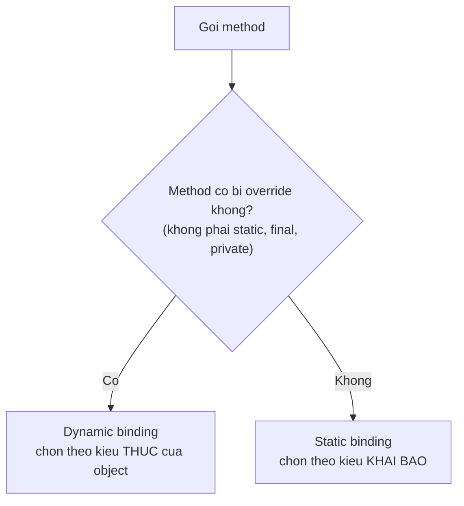

# Static vs Dynamic Binding

Binding là việc Java quyết định một lời gọi phương thức sẽ chạy phần code nào. Việc này có thể xảy ra lúc biên dịch (static binding) hoặc lúc chạy dựa trên đối tượng thực (dynamic binding) — và chính dynamic binding là nền tảng của tính đa hình trong OOP. Bài này giới thiệu sự khác nhau giữa hai loại binding, mối liên hệ với overloading và overriding, cùng các trường hợp đặc biệt với `static`, `final`, `private`.

[](pathname:///img/java/static-vs-dynamic-binding.webp)

---

:::note[Ghi nhớ nhanh]

- ⭐ **Static binding quyết định lúc biên dịch theo kiểu KHAI BÁO** — áp dụng cho overloading, `static`, `final`, `private`.
- ⭐ **Dynamic binding quyết định lúc chạy theo kiểu THỰC của đối tượng** — áp dụng cho overriding, là nền tảng của đa hình.
- **Method `static` KHÔNG đa hình** — gọi qua biến kiểu cha luôn chạy phiên bản của lớp khai báo ("che khuất"/hiding, không phải override).
- **Câu thần chú** — "Kiểu khai báo quyết định gọi được method nào; kiểu thực quyết định chạy phần thân nào."

:::

---

## Mục lục

- [Vì sao phân biệt static & dynamic binding?](#vì-sao-phân-biệt-static--dynamic-binding)
- [Binding là gì?](#binding-là-gì)
- [Static binding — liên kết tĩnh](#static-binding--liên-kết-tĩnh)
- [Dynamic binding — liên kết động](#dynamic-binding--liên-kết-động)
- [Liên kết động và đa hình](#liên-kết-động-và-đa-hình)
- [Method nào được gọi?](#method-nào-được-gọi)
- [Trường hợp đặc biệt: static, final, private](#trường-hợp-đặc-biệt-static-final-private)
- [Lỗi thường gặp](#lỗi-thường-gặp)
- [Tóm tắt](#tóm-tắt)
- [Câu hỏi phỏng vấn](#câu-hỏi-phỏng-vấn)

---

## Vì sao phân biệt static & dynamic binding?

**Vấn đề:** khi bạn gọi một phương thức, Java phải **quyết định** chạy phiên bản nào. Nếu không hiểu cơ chế này, bạn sẽ ngạc nhiên vì kết quả: một biến kiểu cha trỏ tới đối tượng con thì gọi method của ai? Đây là nguồn gốc của các bug đa hình rất khó hiểu.

```java
public class DongVat {
    void keu() { System.out.println("Dong vat keu"); }
    static void loai() { System.out.println("Loai: DongVat"); }
}

public class Cho extends DongVat {
    @Override
    void keu() { System.out.println("Gau gau"); }
    static void loai() { System.out.println("Loai: Cho"); }
}

public class Main {
    public static void main(String[] args) {
        DongVat dv = new Cho();

        dv.keu();  // ??? Chạy của DongVat hay Cho?
        DongVat.loai(); // ??? Vì sao static lại khác?
    }
}
```

**Giải pháp:** Java dùng **hai cơ chế** để quyết định. Hiểu rõ là dự đoán đúng hành vi.

```java
public class Main {
    public static void main(String[] args) {
        DongVat dv = new Cho();

        // DYNAMIC BINDING (lúc chạy): method override chọn theo
        // kiểu THỰC của đối tượng -> Cho -> "Gau gau"
        // => đây chính là cơ chế làm ĐA HÌNH hoạt động
        dv.keu(); // Gau gau

        // STATIC BINDING (lúc biên dịch): method static chọn theo
        // kiểu KHAI BÁO (DongVat), KHÔNG đa hình
        dv.loai(); // Loai: DongVat
    }
}
```

Tóm gọn: **static binding** (lúc biên dịch) dùng cho method `static`/`final`/`private` và overloading — chọn theo kiểu **khai báo**. **Dynamic binding** (lúc chạy) dùng cho method override — chọn theo kiểu **thực** của đối tượng.

:::tip[Dùng thực tế]

- **Đa hình gọi đúng override của lớp con**: biến kiểu cha trỏ object con, `keu()` tự chạy phiên bản của con nhờ dynamic binding.
- **Hiểu overload resolve theo kiểu khai báo**: `cong(int, int)` và `cong(double, double)` được Java chọn ngay lúc biên dịch dựa trên kiểu tham số.
- **Vì sao static method không đa hình**: gọi qua biến kiểu cha luôn chạy method static của lớp khai báo, không phải của object thực.
- **Dự đoán hành vi qua biến kiểu cha**: nhìn vào việc method có bị override hay không để biết kết quả là của cha hay của con.

:::

---

## Binding là gì?

**Binding** (liên kết — việc quyết định lời gọi phương thức sẽ chạy phần code nào) là quá trình Java xác định "khi gọi `doiTuong.method()`, thực sự chạy phần thân nào".

Có hai thời điểm quyết định:

- **Static binding** (liên kết tĩnh — quyết định lúc **biên dịch**, trước khi chạy).
- **Dynamic binding** (liên kết động — quyết định lúc **chạy**, dựa trên đối tượng thực).

Ví dụ đời thường: gọi điện cho "trưởng phòng". Nếu danh bạ ghi cứng số (lúc lưu), đó là tĩnh. Nếu "trưởng phòng" là vai trò mà người đảm nhận thay đổi theo thời điểm, đó là động.

---

## Static binding — liên kết tĩnh

**Static binding** xảy ra khi Java biết chắc chắn phương thức nào sẽ chạy ngay lúc biên dịch. Áp dụng cho các phương thức `static`, `final`, `private`, và cả **overloading** (nạp chồng).

```java
public class MayTinh {
    // Hai phương thức overload -> chọn lúc biên dịch (static binding)
    int cong(int a, int b) {
        return a + b;
    }

    double cong(double a, double b) {
        return a + b;
    }
}

public class Main {
    public static void main(String[] args) {
        MayTinh mt = new MayTinh();

        // Java biết NGAY lúc biên dịch sẽ gọi phiên bản (int, int)
        mt.cong(2, 3);

        // Và phiên bản (double, double) ở đây
        mt.cong(2.5, 3.5);
    }
}
```

Vì kiểu của tham số đã rõ ràng lúc viết code, Java chọn được phiên bản đúng mà không cần đợi tới lúc chạy.

---

## Dynamic binding — liên kết động

**Dynamic binding** xảy ra với các phương thức bị **overriding** (ghi đè). Java chỉ biết phương thức nào chạy khi chương trình thực sự chạy, dựa vào **kiểu thực** của đối tượng.

```java
public class DongVat {
    void keu() {
        System.out.println("Dong vat keu");
    }
}

public class Cho extends DongVat {
    @Override
    void keu() {
        System.out.println("Gau gau");
    }
}

public class Meo extends DongVat {
    @Override
    void keu() {
        System.out.println("Meo meo");
    }
}
```

```java
public class Main {
    public static void main(String[] args) {
        // Biến kiểu DongVat, nhưng đối tượng thực là Cho hoặc Meo
        DongVat dv;

        dv = new Cho();
        dv.keu(); // Lúc CHẠY mới biết là Cho -> "Gau gau"

        dv = new Meo();
        dv.keu(); // Lúc CHẠY mới biết là Meo -> "Meo meo"
    }
}
```

Dù biến `dv` có kiểu khai báo là `DongVat`, Java nhìn vào **đối tượng thực** (Cho hay Meo) để quyết định phương thức nào chạy.

---

## Liên kết động và đa hình

**Đa hình** (polymorphism — một lời gọi cho ra nhiều hành vi khác nhau tùy đối tượng) chính là nhờ dynamic binding. Đây là điều khiến OOP linh hoạt.

```java
public class Main {
    public static void main(String[] args) {
        // Một mảng chứa nhiều loại động vật khác nhau
        DongVat[] sở_thu = {
            new Cho(),
            new Meo(),
            new Cho()
        };

        // Cùng một lời gọi keu(), nhưng mỗi đối tượng kêu khác nhau
        for (DongVat dv : sở_thu) {
            dv.keu(); // dynamic binding quyết định phiên bản đúng
        }
        // Gau gau
        // Meo meo
        // Gau gau
    }
}
```

Nhờ đa hình, bạn viết code xử lý chung cho `DongVat` mà vẫn chạy đúng hành vi của từng loài cụ thể.

---

## Method nào được gọi?

Quy tắc tổng quát để biết phương thức nào chạy:

- **Overloading (cùng lớp, khác tham số)** → quyết định lúc **biên dịch** dựa vào **kiểu tham số** bạn truyền (static binding).
- **Overriding (cha-con, cùng tham số)** → quyết định lúc **chạy** dựa vào **kiểu thực của đối tượng** (dynamic binding).

```java
public class Main {
    public static void main(String[] args) {
        DongVat dv = new Cho();

        // Kiểu KHAI BÁO là DongVat, nhưng kiểu THỰC là Cho
        // -> dynamic binding chọn keu() của Cho
        dv.keu(); // Gau gau
    }
}
```

Câu thần chú: **"Kiểu khai báo quyết định gọi được method nào; kiểu thực quyết định chạy phần thân nào."**

Sơ đồ minh hoạ cách Java quyết định dùng loại binding nào cho một lời gọi:



---

## Trường hợp đặc biệt: static, final, private

Các phương thức sau **không** dùng dynamic binding (vì không thể bị ghi đè theo cách thông thường):

```java
public class Cha {
    static void chao() { System.out.println("Cha chao"); }
    final void diem() { System.out.println("Cha diem"); }
    private void rieng() { System.out.println("Cha rieng"); }
}

public class Con extends Cha {
    // static: đây là "che khuất" (hiding), không phải override
    static void chao() { System.out.println("Con chao"); }
    // final và private không thể ghi đè
}

public class Main {
    public static void main(String[] args) {
        Cha c = new Con();
        // Với static, Java dùng KIỂU KHAI BÁO (Cha) -> static binding
        // Cha.chao() được gọi, không phải Con.chao()
        Cha.chao(); // Cha chao
    }
}
```

Phương thức `static` dùng kiểu khai báo (static binding), khác hẳn phương thức instance bị ghi đè.

---

## Lỗi thường gặp

- **Tưởng static method cũng đa hình**: phương thức `static` dùng static binding theo kiểu khai báo, không theo đối tượng thực.
- **Nhầm kiểu khai báo với kiểu thực**: lời gọi method instance bị ghi đè luôn dùng kiểu THỰC của đối tượng.
- **Quên `@Override`**: nếu không thực sự ghi đè, bạn vô tình tạo phương thức mới và mất tính đa hình.
- **Lẫn lộn overloading và overriding**: overloading là static binding, overriding là dynamic binding.
- **Cố ghi đè `final`/`private`**: không được, các phương thức này luôn static binding.

---

## Tóm tắt

- **Binding** là việc quyết định lời gọi phương thức chạy phần code nào.
- **Static binding** quyết định lúc **biên dịch**: áp dụng cho overloading, `static`, `final`, `private`.
- **Dynamic binding** quyết định lúc **chạy** theo kiểu thực của đối tượng: áp dụng cho overriding.
- Dynamic binding là nền tảng của **đa hình** (polymorphism).
- Nhớ: "Kiểu khai báo quyết định gọi được gì; kiểu thực quyết định chạy phần thân nào."

---

## Câu hỏi phỏng vấn

Những câu thường gặp về chủ đề này. Tự trả lời trước, rồi bấm **Xem đáp án** để đối chiếu.

**1. Định nghĩa ngắn gọn: binding là gì, và static binding khác dynamic binding ở điểm mấu chốt nào?**

<details className="qa">
<summary>Xem đáp án</summary>

**Binding** là việc Java quyết định lời gọi phương thức sẽ chạy phần thân code nào. **Static binding** quyết định lúc **biên dịch**, dựa trên **kiểu khai báo** của biến (áp dụng cho overloading, `static`, `final`, `private`). **Dynamic binding** quyết định lúc **chạy**, dựa trên **kiểu thực** của đối tượng (áp dụng cho method bị override) — đây chính là cơ chế làm nên tính đa hình.

</details>

**2. Vì sao phương thức `static` dùng static binding? Gọi `dv.loai()` (với `dv` là biến kiểu cha trỏ tới object con) có phải là polymorphism không?**

<details className="qa">
<summary>Xem đáp án</summary>

Method `static` gắn liền với **lớp**, không gắn với từng object cụ thể — nó không có khái niệm "đối tượng thực đang gọi", nên không có cơ sở để chọn theo kiểu thực lúc chạy. Java xử lý nó hoàn toàn dựa trên **kiểu khai báo** biết được ngay lúc biên dịch.

**Không phải polymorphism.** Nếu lớp con khai báo lại một `static` method cùng tên, đó gọi là **method hiding** (che khuất), không phải overriding — gọi qua biến kiểu cha (`dv.loai()`) luôn chạy phiên bản `static` của **lớp khai báo của biến** (`DongVat`), bất kể object thực tế là gì.

</details>

**3. Field (thuộc tính) có tham gia dynamic binding giống method bị override không? Đọc code sau và cho biết kết quả.**

```java
class DongVat { String loai = "Dong vat"; }
class Cho extends DongVat { String loai = "Cho"; }

DongVat dv = new Cho();
System.out.println(dv.loai);
```

<details className="qa">
<summary>Xem đáp án</summary>

In ra **"Dong vat"**. Đây là điểm rất hay bị nhầm: **field không bao giờ tham gia dynamic binding**, kể cả khi bị "che" (field hiding) bởi field cùng tên ở lớp con. Truy cập field luôn dựa trên **kiểu khai báo** của biến, không phải kiểu thực của object — khác hẳn với method bị override (dùng dynamic binding). Chỉ có method instance bị override mới hưởng cơ chế đa hình; field thì không.

</details>

**4. Vì sao phương thức `private` không tham gia dynamic binding?**

<details className="qa">
<summary>Xem đáp án</summary>

Phương thức `private` **chỉ nhìn thấy được bên trong chính lớp khai báo nó** — lớp con hoàn toàn không biết tới sự tồn tại của nó (không kế thừa được), nên không thể "override" theo đúng nghĩa. Nếu lớp con khai báo một method trùng tên, trùng tham số, đó chỉ là một method **hoàn toàn mới và độc lập**, không liên quan gì tới method `private` của lớp cha — vì vậy không có gì để "chọn lúc chạy" cả, mọi lời gọi bên trong lớp cha tới method `private` của chính nó luôn cố định (static binding).

</details>

**5. Bên trong JVM, dynamic binding cho method override được cài đặt bằng cơ chế nào?**

<details className="qa">
<summary>Xem đáp án</summary>

JVM dùng cơ chế **virtual method table** (thường gọi là **vtable**) — mỗi lớp có một bảng ánh xạ từ "chữ ký phương thức" sang "địa chỉ cài đặt thực tế" của lớp đó. Khi gọi một method có thể bị override, JVM không tra cứu theo kiểu khai báo mà lấy vtable **của kiểu thực (runtime class)** của object, rồi tra trong bảng đó để tìm đúng cài đặt cần chạy — đây gọi là **invokevirtual** trong bytecode. Method `static`/`private`/`final` dùng lệnh bytecode khác (`invokestatic`, `invokespecial`) — được giải quyết thẳng lúc biên dịch, không cần tra vtable lúc chạy, nên nhanh hơn.

</details>

**6. Constructor tham gia loại binding nào — static hay dynamic? Giải thích.**

<details className="qa">
<summary>Xem đáp án</summary>

**Static binding.** Khi viết `new Cho()`, trình biên dịch biết **chính xác** constructor nào sẽ chạy ngay tại thời điểm biên dịch, dựa vào **kiểu được chỉ định tường minh sau từ khóa `new`** — không có khái niệm "kiểu thực khác với kiểu khai báo" ở đây như với biến tham chiếu, vì bản thân câu lệnh `new` chính là nơi xác định kiểu cụ thể sẽ được tạo.

</details>

**7. Từ khóa `final` trên một method ảnh hưởng thế nào tới binding, và vì sao điều đó có thể giúp JVM tối ưu hiệu năng?**

<details className="qa">
<summary>Xem đáp án</summary>

Method `final` **không thể bị override**, nên Java biết chắc chắn ngay lúc biên dịch — không có lớp con nào có thể thay đổi cài đặt của nó — vì vậy nó dùng **static binding** giống `private`/`static`.

Về hiệu năng: vì JVM (cụ thể là JIT compiler) biết chắc method `final` chỉ có **đúng một** cài đặt khả dĩ, nó có thể **inline** (chèn thẳng phần thân method vào nơi gọi) một cách an toàn mà không cần lo về khả năng bị ghi đè khác đi lúc chạy — giúp tránh chi phí tra vtable và mở ra thêm cơ hội tối ưu hóa. Với method thông thường có thể bị override, JIT vẫn có kỹ thuật tối ưu riêng (như "monomorphic inline caching"), nhưng `final` cho một đảm bảo chắc chắn hơn ngay từ đầu.

</details>

**8. Đọc code sau — biến `pt` kiểu `PhuongTien` gọi `dung` (biến `static`) qua instance. Kết quả in ra là gì, và vì sao cách viết này dễ gây hiểu nhầm?**

```java
class PhuongTien {
    static int soBanh = 4;
}
class XeMay extends PhuongTien {
    static int soBanh = 2;
}

PhuongTien pt = new XeMay();
System.out.println(pt.soBanh);
```

<details className="qa">
<summary>Xem đáp án</summary>

In ra **`4`**. Field `static` cũng dùng **static binding theo kiểu khai báo** (`PhuongTien`), y hệt method `static` — hoàn toàn không liên quan tới object thực (`XeMay`) đang được `pt` trỏ tới.

Cách viết `pt.soBanh` (truy cập field/method `static` qua một **biến instance**) rất dễ gây hiểu lầm rằng nó "đa hình" giống method override, trong khi thực chất Java chỉ đang nhìn vào **kiểu khai báo** để tra cứu — nhiều IDE và linter (như trình cảnh báo của IntelliJ) cố ý **cảnh báo** kiểu truy cập này và gợi ý viết lại thành `PhuongTien.soBanh` cho rõ ràng.

</details>

**9. Tình huống: bạn đang refactor một codebase cũ có nhiều chỗ gọi method `static` qua biến instance (ví dụ `obj.utilMethod()` dù `utilMethod` là `static`), gây hiểu nhầm là polymorphism. Bạn sẽ làm gì để code rõ ràng và an toàn hơn?**

<details className="qa">
<summary>Xem đáp án</summary>

1. Dùng IDE (IntelliJ/Eclipse đều có sẵn inspection cho việc này) để tìm tất cả chỗ gọi method `static` qua instance, rồi **đổi thành gọi qua tên lớp** (`TenLop.method()`) — không thay đổi hành vi chạy, chỉ làm rõ ràng ý định.
2. Rà lại xem có chỗ nào **cố tình dựa vào** hành vi "gọi qua instance nhưng chạy theo kiểu khai báo" hay không (rất hiếm khi là chủ đích) — nếu có, nên viết comment giải thích rõ, tránh gây bẫy cho người đọc sau.
3. Nếu ý định thực sự là muốn hành vi **đa hình** (khác nhau theo từng lớp con), method đó **không nên là `static`** — cần chuyển thành method instance thông thường (bỏ `static`, dùng `@Override`) để tận dụng đúng dynamic binding.
4. Thêm bật cảnh báo linter cho quy tắc "static method access via instance reference" để ngăn lỗi tương tự tái diễn trong tương lai.

</details>

**10. Nêu "câu thần chú" tóm tắt toàn bộ chủ đề static vs dynamic binding và giải thích ý nghĩa từng vế.**

<details className="qa">
<summary>Xem đáp án</summary>

> **"Kiểu khai báo quyết định gọi được method nào; kiểu thực quyết định chạy phần thân nào."**

- **Vế đầu** (kiểu khai báo quyết định gọi được gì): trình biên dịch chỉ cho phép gọi những method/field **tồn tại trong kiểu khai báo** của biến — dù object thực tế có thêm method riêng, bạn không gọi được nếu biến khai báo kiểu cha không có method đó (trừ khi ép kiểu xuống lớp con).
- **Vế sau** (kiểu thực quyết định chạy phần thân nào): với các method **bị override**, một khi đã gọi được (thỏa vế đầu), JVM sẽ chạy đúng phần thân của **kiểu thực** của object tại thời điểm chạy — đây chính là dynamic binding, nền tảng của đa hình.

</details>
