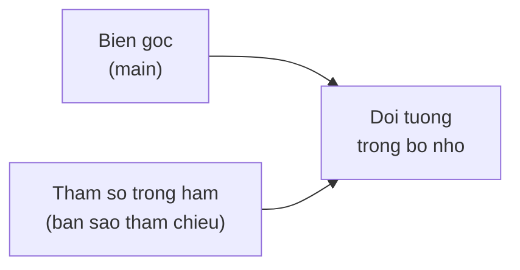

# Pass by Value / Pass by Reference

Cách Java truyền tham số vào hàm là một trong những chủ đề gây nhầm lẫn nhất với người mới học, vì câu trả lời dứt khoát là Java luôn truyền theo giá trị (pass by value), không bao giờ truyền theo tham chiếu. Hiểu đúng điều này giúp bạn tránh các lỗi khó chịu khi tưởng hàm sẽ thay đổi được biến gốc. Bài này giới thiệu cách hoạt động với kiểu nguyên thủy, với đối tượng và trường hợp đặc biệt của `String`.

---

## Mục lục

- [Vì sao cần hiểu pass-by-value?](#vì-sao-cần-hiểu-pass-by-value)
- [Vấn đề gây nhầm lẫn nhất](#vấn-đề-gây-nhầm-lẫn-nhất)
- [Pass by value là gì?](#pass-by-value-là-gì)
- [Với kiểu nguyên thủy](#với-kiểu-nguyên-thủy)
- [Với đối tượng: truyền giá trị của tham chiếu](#với-đối-tượng-truyền-giá-trị-của-tham-chiếu)
- [Ví dụ rõ ràng: thay đổi thuộc tính](#ví-dụ-rõ-ràng-thay-đổi-thuộc-tính)
- [Ví dụ rõ ràng: gán lại tham chiếu](#ví-dụ-rõ-ràng-gán-lại-tham-chiếu)
- [Trường hợp String](#trường-hợp-string)
- [Lỗi thường gặp](#lỗi-thường-gặp)
- [Tóm tắt](#tóm-tắt)

---

## Vì sao cần hiểu pass-by-value?

**Vấn đề:** Đây là nguồn gây hiểu nhầm kinh điển. Lập trình viên thường tưởng gán lại tham số trong hàm sẽ đổi biến bên ngoài (nhưng KHÔNG), hoặc tưởng đối tượng được "copy" khi truyền vào nên sửa thoải mái (nhưng sửa thuộc tính lại ảnh hưởng cả bên ngoài). Cả hai dẫn tới bug khó hiểu.

```java
public class Main {
    static void swap(int a, int b) {
        int tmp = a; a = b; b = tmp; // tưởng đổi được x, y bên ngoài
    }

    static void doiTen(NguoiDung u) {
        u = new NguoiDung("Mới"); // tưởng đổi được biến gốc -> KHÔNG
    }

    public static void main(String[] args) {
        int x = 1, y = 2;
        swap(x, y);
        System.out.println(x + " " + y); // Vẫn "1 2" — swap vô hiệu!
    }
}
```

**Giải pháp:** Nắm rõ một quy tắc duy nhất — Java **luôn** pass-by-value:

```java
public class Main {
    // Primitive: truyền BẢN SAO giá trị -> đổi trong hàm không ảnh hưởng ngoài
    static void tang(int n) { n++; }

    // Object: truyền BẢN SAO của THAM CHIẾU (địa chỉ)
    static void ganLai(NguoiDung u) { u = new NguoiDung("Mới"); } // không đổi biến ngoài
    static void suaField(NguoiDung u) { u.ten = "Mới"; }          // ĐỔI chính object đó

    public static void main(String[] args) {
        int x = 5;
        tang(x);
        System.out.println(x); // 5 — bản sao đổi, gốc giữ nguyên

        NguoiDung u = new NguoiDung("Cũ");
        ganLai(u);
        System.out.println(u.ten); // "Cũ" — gán lại tham số vô hại với biến gốc
        suaField(u);
        System.out.println(u.ten); // "Mới" — sửa field thì đổi thật
    }
}
```

:::tip[Dùng thực tế]
- **Swap primitive không hiệu lực:** hoán đổi hai `int` trong hàm chỉ tác động bản sao — phải `return` giá trị mới hoặc dùng mảng/đối tượng bọc.
- **Sửa field lại đổi bên ngoài:** truyền một `User` vào hàm rồi đặt `user.active = false` sẽ thay đổi chính đối tượng gốc, không cần `return`.
- **Gán lại tham số vô hại:** đặt `param = new ...()` bên trong hàm chỉ đổi bản sao tham chiếu, biến gốc vẫn trỏ đối tượng cũ.
- **Tránh side-effect ngoài ý muốn:** biết rõ "sửa field = ảnh hưởng gốc" giúp bạn cân nhắc sao chép phòng thủ (defensive copy) trước khi sửa đối tượng dùng chung.
:::

---

## Vấn đề gây nhầm lẫn nhất

Đây là một trong những chủ đề gây tranh cãi và nhầm lẫn nhất với người học Java. Câu trả lời dứt khoát:

> **Java LUÔN LUÔN truyền theo giá trị (pass by value). KHÔNG bao giờ truyền theo tham chiếu (pass by reference).**

Sự nhầm lẫn xuất hiện vì với đối tượng, "giá trị" được truyền là **giá trị của tham chiếu** (một bản sao địa chỉ), khiến nhiều người tưởng là pass by reference. Bài này sẽ làm rõ.

---

## Pass by value là gì?

**Pass by value** (truyền theo giá trị — khi gọi hàm, Java tạo một **bản sao** của giá trị đối số rồi đưa vào hàm) nghĩa là hàm nhận được bản sao, không phải biến gốc.

Vì là bản sao, mọi thay đổi với **chính tham số** bên trong hàm không ảnh hưởng tới biến gốc bên ngoài.

```java
public class Main {
    static void thuDoi(int x) {
        x = 100; // chỉ đổi BẢN SAO bên trong hàm
    }

    public static void main(String[] args) {
        int a = 5;
        thuDoi(a);
        System.out.println(a); // Vẫn là 5, KHÔNG bị đổi
    }
}
```

---

## Với kiểu nguyên thủy

**Kiểu nguyên thủy** (primitive type — kiểu dữ liệu cơ bản như `int`, `double`, `boolean`) lưu trực tiếp giá trị. Khi truyền vào hàm, Java sao chép giá trị đó.

```java
public class Main {
    static void tang(int so) {
        so = so + 1; // đổi bản sao
        System.out.println("Trong ham: " + so); // 11
    }

    public static void main(String[] args) {
        int diem = 10;
        tang(diem);
        System.out.println("Ngoai ham: " + diem); // 10 (không đổi)
    }
}
```

Rõ ràng: biến gốc `diem` không bị ảnh hưởng vì hàm chỉ thao tác trên bản sao.

---

## Với đối tượng: truyền giá trị của tham chiếu

Với đối tượng, biến không chứa chính đối tượng mà chứa **tham chiếu** (reference — địa chỉ trỏ tới đối tượng trong bộ nhớ). Khi truyền vào hàm, Java sao chép **giá trị của tham chiếu** đó.

Kết quả: tham số trong hàm và biến gốc là **hai tham chiếu khác nhau**, nhưng cùng trỏ tới **một đối tượng**. Giống như hai tờ giấy ghi cùng một địa chỉ nhà — bạn vào nhà sửa đồ thì cả hai tờ giấy vẫn trỏ tới căn nhà đã bị sửa.

Sơ đồ minh hoạ: biến gốc và tham số là hai tham chiếu (bản sao địa chỉ) khác nhau nhưng cùng trỏ về một đối tượng trong bộ nhớ:



---

## Ví dụ rõ ràng: thay đổi thuộc tính

Vì cả hai tham chiếu trỏ cùng đối tượng, **thay đổi thuộc tính** bên trong hàm sẽ ảnh hưởng đối tượng gốc.

```java
public class Hop {
    int giaTri;
}

public class Main {
    static void doiGiaTri(Hop h) {
        // h là bản sao tham chiếu, nhưng trỏ CÙNG đối tượng với biến gốc
        h.giaTri = 999; // sửa chính đối tượng -> thấy được bên ngoài
    }

    public static void main(String[] args) {
        Hop hop = new Hop();
        hop.giaTri = 1;

        doiGiaTri(hop);
        System.out.println(hop.giaTri); // 999 (đã bị đổi!)
    }
}
```

Đây là chỗ khiến người ta tưởng "pass by reference". Thực ra vẫn là pass by value — chỉ là giá trị được sao chép là **địa chỉ**, nên cả hai cùng chỉ vào một nhà.

---

## Ví dụ rõ ràng: gán lại tham chiếu

Đây là phép thử quyết định. Nếu trong hàm bạn **gán lại tham chiếu** (cho tham số trỏ tới đối tượng mới), biến gốc bên ngoài **không bị ảnh hưởng**. Điều này chứng minh Java là pass by value.

```java
public class Hop {
    int giaTri;
}

public class Main {
    static void ganLai(Hop h) {
        // Gán cho h một đối tượng MỚI -> chỉ đổi bản sao tham chiếu
        h = new Hop();
        h.giaTri = 999; // sửa đối tượng mới, không liên quan đối tượng gốc
    }

    public static void main(String[] args) {
        Hop hop = new Hop();
        hop.giaTri = 1;

        ganLai(hop);
        System.out.println(hop.giaTri); // 1 (KHÔNG đổi!)
    }
}
```

Nếu Java là pass by reference, kết quả sẽ là `999`. Nhưng vì là pass by value (sao chép tham chiếu), việc gán lại chỉ đổi bản sao bên trong hàm. Biến gốc vẫn trỏ đối tượng cũ.

So sánh hai ví dụ:

- **Sửa thuộc tính** (`h.giaTri = 999`) → ảnh hưởng đối tượng gốc, vì cùng trỏ một nhà.
- **Gán lại tham chiếu** (`h = new Hop()`) → KHÔNG ảnh hưởng, vì chỉ đổi tờ giấy ghi địa chỉ trong tay hàm.

---

## Trường hợp String

`String` (chuỗi ký tự) là **bất biến** (immutable — không thay đổi được sau khi tạo). Điều này càng dễ gây nhầm.

```java
public class Main {
    static void doiChuoi(String s) {
        s = s + " them"; // tạo CHUỖI MỚI, gán cho bản sao tham chiếu
    }

    public static void main(String[] args) {
        String ten = "Java";
        doiChuoi(ten);
        System.out.println(ten); // "Java" (không đổi)
    }
}
```

Vì String bất biến, `s + " them"` không sửa chuỗi cũ mà tạo chuỗi mới. Và vì pass by value, gán chuỗi mới cho `s` chỉ đổi bản sao tham chiếu, không ảnh hưởng `ten`.

---

## Lỗi thường gặp

- **Tưởng Java là pass by reference**: Java luôn pass by value; với đối tượng, giá trị được truyền là bản sao của tham chiếu.
- **Mong gán lại tham chiếu trong hàm đổi được biến gốc**: không được, đó chỉ là bản sao.
- **Tưởng String đổi được trong hàm**: String bất biến, mọi "thay đổi" tạo chuỗi mới.
- **Nhầm "sửa thuộc tính" với "gán lại"**: sửa thuộc tính ảnh hưởng đối tượng gốc; gán lại thì không.
- **Muốn hàm trả về kết quả mới mà quên `return`**: nếu cần đổi giá trị nguyên thủy hay tham chiếu của biến gốc, hãy `return` giá trị mới thay vì kỳ vọng hàm tự đổi.

---

## Tóm tắt

- Java **luôn** truyền theo **giá trị** (pass by value), không bao giờ pass by reference.
- Với **kiểu nguyên thủy**: sao chép giá trị, hàm không đổi được biến gốc.
- Với **đối tượng**: sao chép **giá trị của tham chiếu** — hàm và biến gốc cùng trỏ một đối tượng.
- **Sửa thuộc tính** trong hàm → ảnh hưởng đối tượng gốc.
- **Gán lại tham chiếu** trong hàm → KHÔNG ảnh hưởng biến gốc (đây là bằng chứng pass by value).
- `String` bất biến nên mọi "thay đổi" đều tạo chuỗi mới.
