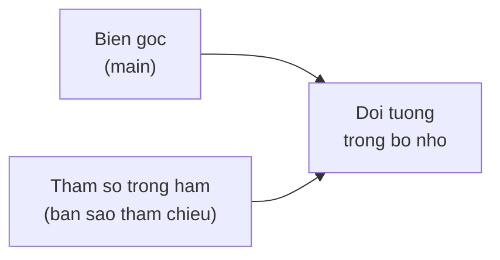

# Pass by Value / Pass by Reference

Cách Java truyền tham số vào hàm là một trong những chủ đề gây nhầm lẫn nhất với người mới học, vì câu trả lời dứt khoát là Java luôn truyền theo giá trị (pass by value), không bao giờ truyền theo tham chiếu. Hiểu đúng điều này giúp bạn tránh các lỗi khó chịu khi tưởng hàm sẽ thay đổi được biến gốc. Bài này giới thiệu cách hoạt động với kiểu nguyên thủy, với đối tượng và trường hợp đặc biệt của `String`.

[](pathname:///img/java/pass-by-value-reference.webp)

---

:::note[Ghi nhớ nhanh]

- ⭐ **Java LUÔN truyền theo giá trị (pass by value)** — không bao giờ pass by reference.
- **Kiểu nguyên thủy** — sao chép giá trị, đổi trong hàm không ảnh hưởng biến gốc.
- ⭐ **Đối tượng: sao chép *giá trị của tham chiếu*** — sửa field (`u.ten = ...`) đổi cả object gốc, nhưng gán lại tham chiếu (`u = new ...`) thì KHÔNG đổi biến gốc.
- **Gán lại tham chiếu vô hại với biến gốc chính là bằng chứng pass by value.**
- **`String` bất biến** — mọi "thay đổi" đều tạo chuỗi mới; cần đổi biến gốc thì phải `return`.

:::

---

## Mục lục

- [Vì sao cần hiểu pass-by-value?](#vì-sao-cần-hiểu-pass-by-value)
- [Vấn đề gây nhầm lẫn nhất](#vấn-đề-gây-nhầm-lẫn-nhất)
- [Pass by value là gì?](#pass-by-value-là-gì)
- [Với kiểu nguyên thủy](#với-kiểu-nguyên-thủy)
- [Với đối tượng: truyền giá trị của tham chiếu](#với-đối-tượng-truyền-giá-trị-của-tham-chiếu)
- [Ví dụ rõ ràng: thay đổi thuộc tính](#ví-dụ-rõ-ràng-thay-đổi-thuộc-tính)
- [Ví dụ rõ ràng: gán lại tham chiếu](#ví-dụ-rõ-ràng-gán-lại-tham-chiếu)
- [Trường hợp String](#trường-hợp-string)
- [Lỗi thường gặp](#lỗi-thường-gặp)
- [Tóm tắt](#tóm-tắt)
- [Câu hỏi phỏng vấn](#câu-hỏi-phỏng-vấn)

---

## Vì sao cần hiểu pass-by-value?

**Vấn đề:** Đây là nguồn gây hiểu nhầm kinh điển. Lập trình viên thường tưởng gán lại tham số trong hàm sẽ đổi biến bên ngoài (nhưng KHÔNG), hoặc tưởng đối tượng được "copy" khi truyền vào nên sửa thoải mái (nhưng sửa thuộc tính lại ảnh hưởng cả bên ngoài). Cả hai dẫn tới bug khó hiểu.

```java
public class Main {
    static void swap(int a, int b) {
        int tmp = a; a = b; b = tmp; // tưởng đổi được x, y bên ngoài
    }

    static void doiTen(NguoiDung u) {
        u = new NguoiDung("Mới"); // tưởng đổi được biến gốc -> KHÔNG
    }

    public static void main(String[] args) {
        int x = 1, y = 2;
        swap(x, y);
        System.out.println(x + " " + y); // Vẫn "1 2" — swap vô hiệu!
    }
}
```

**Giải pháp:** Nắm rõ một quy tắc duy nhất — Java **luôn** pass-by-value:

```java
public class Main {
    // Primitive: truyền BẢN SAO giá trị -> đổi trong hàm không ảnh hưởng ngoài
    static void tang(int n) { n++; }

    // Object: truyền BẢN SAO của THAM CHIẾU (địa chỉ)
    static void ganLai(NguoiDung u) { u = new NguoiDung("Mới"); } // không đổi biến ngoài
    static void suaField(NguoiDung u) { u.ten = "Mới"; }          // ĐỔI chính object đó

    public static void main(String[] args) {
        int x = 5;
        tang(x);
        System.out.println(x); // 5 — bản sao đổi, gốc giữ nguyên

        NguoiDung u = new NguoiDung("Cũ");
        ganLai(u);
        System.out.println(u.ten); // "Cũ" — gán lại tham số vô hại với biến gốc
        suaField(u);
        System.out.println(u.ten); // "Mới" — sửa field thì đổi thật
    }
}
```

:::tip[Dùng thực tế]
- **Swap primitive không hiệu lực:** hoán đổi hai `int` trong hàm chỉ tác động bản sao — phải `return` giá trị mới hoặc dùng mảng/đối tượng bọc.
- **Sửa field lại đổi bên ngoài:** truyền một `User` vào hàm rồi đặt `user.active = false` sẽ thay đổi chính đối tượng gốc, không cần `return`.
- **Gán lại tham số vô hại:** đặt `param = new ...()` bên trong hàm chỉ đổi bản sao tham chiếu, biến gốc vẫn trỏ đối tượng cũ.
- **Tránh side-effect ngoài ý muốn:** biết rõ "sửa field = ảnh hưởng gốc" giúp bạn cân nhắc sao chép phòng thủ (defensive copy) trước khi sửa đối tượng dùng chung.
:::

---

## Vấn đề gây nhầm lẫn nhất

Đây là một trong những chủ đề gây tranh cãi và nhầm lẫn nhất với người học Java. Câu trả lời dứt khoát:

> **Java LUÔN LUÔN truyền theo giá trị (pass by value). KHÔNG bao giờ truyền theo tham chiếu (pass by reference).**

Sự nhầm lẫn xuất hiện vì với đối tượng, "giá trị" được truyền là **giá trị của tham chiếu** (một bản sao địa chỉ), khiến nhiều người tưởng là pass by reference. Bài này sẽ làm rõ.

---

## Pass by value là gì?

**Pass by value** (truyền theo giá trị — khi gọi hàm, Java tạo một **bản sao** của giá trị đối số rồi đưa vào hàm) nghĩa là hàm nhận được bản sao, không phải biến gốc.

Vì là bản sao, mọi thay đổi với **chính tham số** bên trong hàm không ảnh hưởng tới biến gốc bên ngoài.

```java
public class Main {
    static void thuDoi(int x) {
        x = 100; // chỉ đổi BẢN SAO bên trong hàm
    }

    public static void main(String[] args) {
        int a = 5;
        thuDoi(a);
        System.out.println(a); // Vẫn là 5, KHÔNG bị đổi
    }
}
```

---

## Với kiểu nguyên thủy

**Kiểu nguyên thủy** (primitive type — kiểu dữ liệu cơ bản như `int`, `double`, `boolean`) lưu trực tiếp giá trị. Khi truyền vào hàm, Java sao chép giá trị đó.

```java
public class Main {
    static void tang(int so) {
        so = so + 1; // đổi bản sao
        System.out.println("Trong ham: " + so); // 11
    }

    public static void main(String[] args) {
        int diem = 10;
        tang(diem);
        System.out.println("Ngoai ham: " + diem); // 10 (không đổi)
    }
}
```

Rõ ràng: biến gốc `diem` không bị ảnh hưởng vì hàm chỉ thao tác trên bản sao.

---

## Với đối tượng: truyền giá trị của tham chiếu

Với đối tượng, biến không chứa chính đối tượng mà chứa **tham chiếu** (reference — địa chỉ trỏ tới đối tượng trong bộ nhớ). Khi truyền vào hàm, Java sao chép **giá trị của tham chiếu** đó.

Kết quả: tham số trong hàm và biến gốc là **hai tham chiếu khác nhau**, nhưng cùng trỏ tới **một đối tượng**. Giống như hai tờ giấy ghi cùng một địa chỉ nhà — bạn vào nhà sửa đồ thì cả hai tờ giấy vẫn trỏ tới căn nhà đã bị sửa.

Sơ đồ minh hoạ: biến gốc và tham số là hai tham chiếu (bản sao địa chỉ) khác nhau nhưng cùng trỏ về một đối tượng trong bộ nhớ:


```mermaid
flowchart LR
    A["Bien goc<br/>(main)"] --> C["Doi tuong<br/>trong bo nho"]
    B["Tham so trong ham<br/>(ban sao tham chieu)"] --> C
```

---

## Ví dụ rõ ràng: thay đổi thuộc tính

Vì cả hai tham chiếu trỏ cùng đối tượng, **thay đổi thuộc tính** bên trong hàm sẽ ảnh hưởng đối tượng gốc.

```java
public class Hop {
    int giaTri;
}

public class Main {
    static void doiGiaTri(Hop h) {
        // h là bản sao tham chiếu, nhưng trỏ CÙNG đối tượng với biến gốc
        h.giaTri = 999; // sửa chính đối tượng -> thấy được bên ngoài
    }

    public static void main(String[] args) {
        Hop hop = new Hop();
        hop.giaTri = 1;

        doiGiaTri(hop);
        System.out.println(hop.giaTri); // 999 (đã bị đổi!)
    }
}
```

Đây là chỗ khiến người ta tưởng "pass by reference". Thực ra vẫn là pass by value — chỉ là giá trị được sao chép là **địa chỉ**, nên cả hai cùng chỉ vào một nhà.

---

## Ví dụ rõ ràng: gán lại tham chiếu

Đây là phép thử quyết định. Nếu trong hàm bạn **gán lại tham chiếu** (cho tham số trỏ tới đối tượng mới), biến gốc bên ngoài **không bị ảnh hưởng**. Điều này chứng minh Java là pass by value.

```java
public class Hop {
    int giaTri;
}

public class Main {
    static void ganLai(Hop h) {
        // Gán cho h một đối tượng MỚI -> chỉ đổi bản sao tham chiếu
        h = new Hop();
        h.giaTri = 999; // sửa đối tượng mới, không liên quan đối tượng gốc
    }

    public static void main(String[] args) {
        Hop hop = new Hop();
        hop.giaTri = 1;

        ganLai(hop);
        System.out.println(hop.giaTri); // 1 (KHÔNG đổi!)
    }
}
```

Nếu Java là pass by reference, kết quả sẽ là `999`. Nhưng vì là pass by value (sao chép tham chiếu), việc gán lại chỉ đổi bản sao bên trong hàm. Biến gốc vẫn trỏ đối tượng cũ.

So sánh hai ví dụ:

- **Sửa thuộc tính** (`h.giaTri = 999`) → ảnh hưởng đối tượng gốc, vì cùng trỏ một nhà.
- **Gán lại tham chiếu** (`h = new Hop()`) → KHÔNG ảnh hưởng, vì chỉ đổi tờ giấy ghi địa chỉ trong tay hàm.

---

## Trường hợp String

`String` (chuỗi ký tự) là **bất biến** (immutable — không thay đổi được sau khi tạo). Điều này càng dễ gây nhầm.

```java
public class Main {
    static void doiChuoi(String s) {
        s = s + " them"; // tạo CHUỖI MỚI, gán cho bản sao tham chiếu
    }

    public static void main(String[] args) {
        String ten = "Java";
        doiChuoi(ten);
        System.out.println(ten); // "Java" (không đổi)
    }
}
```

Vì String bất biến, `s + " them"` không sửa chuỗi cũ mà tạo chuỗi mới. Và vì pass by value, gán chuỗi mới cho `s` chỉ đổi bản sao tham chiếu, không ảnh hưởng `ten`.

---

## Lỗi thường gặp

- **Tưởng Java là pass by reference**: Java luôn pass by value; với đối tượng, giá trị được truyền là bản sao của tham chiếu.
- **Mong gán lại tham chiếu trong hàm đổi được biến gốc**: không được, đó chỉ là bản sao.
- **Tưởng String đổi được trong hàm**: String bất biến, mọi "thay đổi" tạo chuỗi mới.
- **Nhầm "sửa thuộc tính" với "gán lại"**: sửa thuộc tính ảnh hưởng đối tượng gốc; gán lại thì không.
- **Muốn hàm trả về kết quả mới mà quên `return`**: nếu cần đổi giá trị nguyên thủy hay tham chiếu của biến gốc, hãy `return` giá trị mới thay vì kỳ vọng hàm tự đổi.

---

## Tóm tắt

- Java **luôn** truyền theo **giá trị** (pass by value), không bao giờ pass by reference.
- Với **kiểu nguyên thủy**: sao chép giá trị, hàm không đổi được biến gốc.
- Với **đối tượng**: sao chép **giá trị của tham chiếu** — hàm và biến gốc cùng trỏ một đối tượng.
- **Sửa thuộc tính** trong hàm → ảnh hưởng đối tượng gốc.
- **Gán lại tham chiếu** trong hàm → KHÔNG ảnh hưởng biến gốc (đây là bằng chứng pass by value).
- `String` bất biến nên mọi "thay đổi" đều tạo chuỗi mới.

---

## Câu hỏi phỏng vấn

Những câu thường gặp về chủ đề này. Tự trả lời trước, rồi bấm **Xem đáp án** để đối chiếu.

**1. Java là pass by value hay pass by reference? "Giá trị của tham chiếu" (value of the reference) được truyền có nghĩa là gì?**

<details className="qa">
<summary>Xem đáp án</summary>

Java **luôn luôn** là **pass by value**, không có ngoại lệ. Với kiểu nguyên thủy, giá trị được sao chép trực tiếp. Với đối tượng, biến không chứa chính đối tượng mà chứa **tham chiếu** (địa chỉ trỏ tới object trên heap) — khi truyền vào hàm, Java sao chép **giá trị của địa chỉ đó** (một bản sao tham chiếu), chứ không truyền thẳng biến gốc. Tham số trong hàm và biến gốc là **hai biến tham chiếu độc lập**, chỉ tình cờ cùng trỏ tới một object — đây là lý do sửa field qua tham số vẫn ảnh hưởng object gốc, nhưng gán lại tham số thì không.

</details>

**2. Đọc code sau — vì sao hàm `swap` không hoán đổi được `x` và `y`? Viết một cách khác để thực sự hoán đổi được giá trị hai biến ngoài `main`.**

```java
static void swap(int a, int b) {
    int tmp = a; a = b; b = tmp;
}
int x = 1, y = 2;
swap(x, y);
```

<details className="qa">
<summary>Xem đáp án</summary>

`swap` chỉ nhận được **bản sao giá trị** của `x` và `y` qua `a`, `b` — hoán đổi `a`/`b` bên trong chỉ ảnh hưởng bản sao, không đụng gì tới `x`, `y` bên ngoài. Vì Java không có pass by reference, không thể viết một hàm `swap(int a, int b)` hoạt động trực tiếp trên hai biến `int` độc lập.

Cách thực sự hoán đổi được, ví dụ trả về kết quả qua một mảng hoặc một object bọc:

```java
static int[] swap(int a, int b) {
    return new int[]{b, a}; // trả về MỚI, người gọi tự gán lại
}
int[] ketQua = swap(x, y);
x = ketQua[0];
y = ketQua[1];
```

</details>

**3. Vì sao nhiều lập trình viên mới nhầm Java là "pass by reference" khi truyền đối tượng? "Bằng chứng" quyết định để khẳng định Java vẫn là pass by value là gì?**

<details className="qa">
<summary>Xem đáp án</summary>

Nhầm lẫn xảy ra vì khi sửa **field** của object qua tham số (`u.ten = "moi"`), thay đổi đó **thấy được** ở biến gốc bên ngoài — trông giống hệt hành vi pass by reference của các ngôn ngữ khác.

**Bằng chứng quyết định**: thử **gán lại chính tham số** đó cho một object mới ngay trong hàm (`u = new NguoiDung(...)`). Nếu là pass by reference thật, biến gốc bên ngoài phải đổi theo. Nhưng thực tế biến gốc **không hề đổi** — vì tham số chỉ là **bản sao tham chiếu**, gán lại bản sao đó không ảnh hưởng gì tới biến gốc đang giữ tham chiếu khác. Đây chính là phép thử phân biệt dứt khoát hai khái niệm.

</details>

**4. Tính bất biến (immutable) của `String` ảnh hưởng thế nào tới việc truyền tham số? So sánh với truyền một `StringBuilder` (mutable) vào hàm.**

<details className="qa">
<summary>Xem đáp án</summary>

```java
static void noiThemString(String s) { s = s + " them"; }       // KHÔNG ảnh hưởng biến gốc
static void noiThemBuilder(StringBuilder sb) { sb.append(" them"); } // CÓ ảnh hưởng biến gốc

String ten = "Java";
noiThemString(ten);
System.out.println(ten); // "Java" — không đổi

StringBuilder sb = new StringBuilder("Java");
noiThemBuilder(sb);
System.out.println(sb); // "Java them" — đã đổi!
```

Với `String`, phép `+` **luôn tạo chuỗi mới**, rồi gán chuỗi mới đó cho **bản sao tham chiếu** `s` — không đụng gì tới `ten` gốc. Với `StringBuilder` (mutable), gọi `append()` **sửa trực tiếp nội dung bên trong** object mà cả `sb` (tham số) và biến gốc cùng trỏ tới — nên thay đổi thấy được ở ngoài. Bài học: khả năng "hàm có sửa được nội dung nhìn thấy từ ngoài hay không" phụ thuộc vào **object đó có mutable hay không**, chứ không phải do Java đổi cơ chế truyền tham số.

</details>

**5. Đọc code sau — dòng nào ảnh hưởng tới `list` gốc, dòng nào không?**

```java
static void themPhanTu(List<String> ds) { ds.add("moi"); }
static void ganLaiList(List<String> ds) { ds = new ArrayList<>(); ds.add("khac"); }

List<String> list = new ArrayList<>(List.of("a", "b"));
themPhanTu(list);
System.out.println(list); // ?
ganLaiList(list);
System.out.println(list); // ?
```

<details className="qa">
<summary>Xem đáp án</summary>

```
[a, b, moi]
[a, b, moi]
```

- `themPhanTu(list)`: `ds.add("moi")` gọi phương thức **sửa nội dung** của chính object `ArrayList` mà cả `ds` và `list` cùng trỏ tới → **có** ảnh hưởng, list gốc có thêm phần tử.
- `ganLaiList(list)`: `ds = new ArrayList<>()` chỉ **gán lại bản sao tham chiếu** `ds` để trỏ sang một list hoàn toàn mới — `list` gốc vẫn trỏ tới list cũ, không hề đổi. Thao tác `add("khac")` sau đó chỉ tác động lên list mới bị bỏ rơi, không ai nhìn thấy từ bên ngoài hàm.

</details>

**6. Wrapper class như `Integer`, `Long` có bất biến không? Truyền một `Integer` vào hàm rồi cố "tăng" giá trị bên trong hàm có ảnh hưởng biến gốc không?**

<details className="qa">
<summary>Xem đáp án</summary>

**Có, wrapper class bất biến** — một khi tạo ra, giá trị bên trong `Integer`/`Long`/`Double`... không thể thay đổi.

```java
static void tang(Integer n) {
    n = n + 1; // tạo một Integer MỚI (do unboxing rồi autoboxing lại), gán cho bản sao tham chiếu
}
Integer x = 5;
tang(x);
System.out.println(x); // 5 — không đổi
```

Phép `n + 1` unbox `n` thành `int`, cộng thêm 1, rồi autobox kết quả thành một object `Integer` **mới**, gán cho tham số `n` — hoàn toàn không có "setter" nào để sửa giá trị bên trong object `Integer` gốc. Kết hợp với việc gán lại tham số vô hại (câu 3), biến `x` gốc không bao giờ đổi.

</details>

**7. Java không có tham số kiểu `out`/`ref` như C#. Nếu cần một hàm "trả về nhiều giá trị" (ví dụ vừa lấy thương vừa lấy số dư của phép chia), bạn giải quyết thế nào trong Java?**

<details className="qa">
<summary>Xem đáp án</summary>

Cách thành ngữ (idiomatic) nhất trong Java hiện đại: gói nhiều giá trị vào **một `record`** rồi trả về:

```java
record KetQuaChia(int thuong, int du) {}

static KetQuaChia chia(int a, int b) {
    return new KetQuaChia(a / b, a % b);
}

KetQuaChia kq = chia(17, 5);
System.out.println(kq.thuong() + " " + kq.du()); // 3 2
```

Các cách khác ít khuyến khích hơn: trả về mảng (`int[]{thuong, du}` — mất tên ý nghĩa, dễ nhầm chỉ số), hoặc dùng một object mảng một phần tử làm "con trỏ giả" để mô phỏng tham số `out` (`int[] ketQua = new int[1]; hamGanVao(ketQua);`) — cách này hoạt động vì mảng là object nên sửa phần tử bên trong ảnh hưởng ra ngoài, nhưng thường bị coi là code khó đọc, chỉ nên dùng `record`/class DTO là chuẩn mực.

</details>

**8. So với các ngôn ngữ có pass by reference thật sự (ví dụ tham số `ref`/`out` trong C#, hay tham chiếu `&` trong C++), Java khác biệt cơ bản ở điểm nào?**

<details className="qa">
<summary>Xem đáp án</summary>

Trong C#/C++, khi truyền bằng tham chiếu thật (`ref`/`&`), tham số bên trong hàm và biến bên ngoài là **CÙNG MỘT Ô NHỚ** — gán lại giá trị cho tham số (kể cả với kiểu nguyên thủy) sẽ **ảnh hưởng trực tiếp** biến gốc, y hệt viết vào chính biến đó.

```csharp
// C#: ref cho phép gán lại và biến gốc đổi theo
void TangC#(ref int x) { x = x + 1; }
int a = 5;
TangC#(ref a);
// a bây giờ là 6 — pass by reference THẬT
```

Java **không có** khái niệm này ở bất kỳ đâu — luôn tạo bản sao (giá trị nguyên thủy hoặc giá trị tham chiếu) trước khi đưa vào hàm, nên gán lại tham số **không bao giờ** ảnh hưởng biến gốc, dù là kiểu nguyên thủy hay đối tượng.

</details>

**9. Truyền một `List` vào constructor rồi lưu trực tiếp tham chiếu đó làm field (`this.danhSach = ds;`) có an toàn không? Vì sao cần "defensive copy"?**

<details className="qa">
<summary>Xem đáp án</summary>

**Không hoàn toàn an toàn.** Vì Java truyền theo giá trị của tham chiếu, `this.danhSach` sau khi gán sẽ **cùng trỏ** tới list gốc mà người gọi constructor đang giữ. Nếu người gọi tiếp tục sửa list đó **từ bên ngoài** sau khi tạo object, field `danhSach` bên trong object cũng bị thay đổi theo — dù object đó có thể được thiết kế để **bất biến**.

```java
class GioHang {
    private final List<String> danhSach;
    GioHang(List<String> ds) {
        this.danhSach = new ArrayList<>(ds); // defensive copy: bản sao độc lập
    }
}
```

**Defensive copy** (sao chép phòng thủ) là tạo một **bản sao mới** ngay tại constructor (hoặc getter) thay vì giữ nguyên tham chiếu được truyền vào — đảm bảo object không bị "sửa lén" từ bên ngoài thông qua tham chiếu dùng chung, giữ đúng tính bất biến/toàn vẹn dữ liệu mà object dự định cung cấp.

</details>

**10. Đọc code sau — mảng (array) trong Java có phải là object không? Dòng nào ảnh hưởng mảng gốc, dòng nào không?**

```java
static void suaPhanTu(int[] arr) { arr[0] = 999; }
static void ganLaiMang(int[] arr) { arr = new int[]{1, 2, 3}; }

int[] mang = {10, 20, 30};
suaPhanTu(mang);
System.out.println(mang[0]); // ?
ganLaiMang(mang);
System.out.println(mang[0]); // ?
```

<details className="qa">
<summary>Xem đáp án</summary>

```
999
999
```

**Mảng trong Java là object** (nằm trên heap, biến mảng chỉ là tham chiếu tới nó) — tuân theo đúng quy tắc pass by value dành cho đối tượng:

- `suaPhanTu(mang)`: `arr[0] = 999` sửa **phần tử bên trong** mảng mà cả `arr` và `mang` cùng trỏ tới → **ảnh hưởng** mảng gốc, giống hệt việc sửa field của một object.
- `ganLaiMang(mang)`: `arr = new int[]{...}` chỉ gán lại **bản sao tham chiếu** `arr` để trỏ sang mảng hoàn toàn mới → **không ảnh hưởng** `mang` gốc, `mang` vẫn trỏ mảng cũ đã bị sửa phần tử `[0]` thành `999` ở bước trước.

</details>
