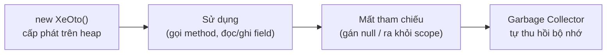

# Vòng đời đối tượng (Object Lifecycle)

Vòng đời đối tượng mô tả toàn bộ quá trình một đối tượng tồn tại trong Java, từ lúc được tạo ra cho đến khi bị xóa khỏi bộ nhớ. Hiểu vòng đời này giúp bạn nắm được cách Java quản lý bộ nhớ tự động và tránh các lỗi phổ biến như `NullPointerException` hay nhầm lẫn giữa tham chiếu và đối tượng. Bài này giới thiệu bốn giai đoạn: tạo, sử dụng, mất tham chiếu và thu gom rác (Garbage Collection).

---

## Mục lục

- [Vì sao cần hiểu vòng đời object & GC?](#vì-sao-cần-hiểu-vòng-đời-object--gc)
- [Vòng đời đối tượng là gì?](#vòng-đời-đối-tượng-là-gì)
- [Bước 1: Tạo đối tượng với new](#bước-1-tạo-đối-tượng-với-new)
- [Bước 2: Sử dụng đối tượng](#bước-2-sử-dụng-đối-tượng)
- [Bước 3: Không còn tham chiếu](#bước-3-không-còn-tham-chiếu)
- [Bước 4: Garbage Collection — thu gom rác](#bước-4-garbage-collection--thu-gom-rác)
- [finalize — phương thức lỗi thời](#finalize--phương-thức-lỗi-thời)
- [Lỗi thường gặp](#lỗi-thường-gặp)
- [Tóm tắt](#tóm-tắt)

---

## Vì sao cần hiểu vòng đời object & GC?

**Vấn đề:** Trong ngôn ngữ cấp thấp (C/C++), bạn phải tự cấp phát **và tự giải phóng** bộ nhớ bằng tay. Quên giải phóng → **rò rỉ bộ nhớ** (memory leak); giải phóng hai lần hoặc dùng sau khi đã giải phóng → crash. Rất dễ sai.

```c
// C: phải tự free, cực kỳ dễ sai
char* buffer = malloc(1024);
// ... dùng buffer ...
// Quên free(buffer);  -> rò rỉ bộ nhớ (memory leak)

free(buffer);
free(buffer);          // free hai lần -> crash
buffer[0] = 'x';       // dùng sau khi free -> crash
```

**Giải pháp:** Java quản lý vòng đời đối tượng **tự động**. `new` cấp phát đối tượng trên **heap** (vùng nhớ chứa đối tượng), còn **Garbage Collector** (bộ thu gom rác) tự thu hồi những đối tượng **không còn tham chiếu** nào trỏ tới — bạn không cần `free` thủ công. Hiểu vòng đời (tạo → dùng → mất tham chiếu → bị GC) giúp bạn tránh leak (giữ tham chiếu thừa, listener không gỡ) và viết code thân thiện với bộ nhớ.

```java
public class Main {
    public static void main(String[] args) {
        // new: cấp phát trên heap, KHÔNG cần free thủ công
        XeOto xe = new XeOto("do");

        // Khi không còn tham chiếu, đối tượng đủ điều kiện bị GC thu hồi
        xe = null;   // không còn ai trỏ tới chiếc xe cũ -> GC sẽ tự dọn
    }
}
```

:::tip[Dùng thực tế]

- **Không phải free thủ công:** tạo đối tượng bằng `new` rồi dùng, không cần giải phóng bằng tay như C/C++.
- **Tránh leak do giữ reference thừa:** đối tượng nhét vào `static` hoặc collection (List, Map) sẽ không bao giờ bị GC — nhớ xóa khi không dùng nữa.
- **Hiểu khi nào object đủ điều kiện bị GC:** khi không còn tham chiếu nào trỏ tới (ví dụ gán `null` hoặc biến ra khỏi scope).
- **Dùng try-with-resources cho tài nguyên ngoài heap:** file, kết nối mạng, DB... GC không lo phần này, phải đóng chủ động.

:::

---

## Vòng đời đối tượng là gì?

**Vòng đời đối tượng** (object lifecycle — toàn bộ quá trình một đối tượng tồn tại, từ lúc sinh ra đến lúc bị xóa khỏi bộ nhớ) mô tả những gì xảy ra với một **đối tượng** (object — một thực thể được tạo ra từ class) trong suốt thời gian nó "sống".

Hãy tưởng tượng như một món đồ chơi: bạn mua nó về (tạo), chơi với nó (sử dụng), rồi vứt vào sọt rác khi không cần nữa (không còn tham chiếu), và cuối cùng xe rác mang đi (thu gom rác).

Vòng đời gồm 4 giai đoạn chính:

1. **Tạo** đối tượng bằng từ khóa `new`.
2. **Sử dụng** đối tượng (gọi phương thức, đọc/ghi thuộc tính).
3. **Không còn tham chiếu** trỏ tới đối tượng.
4. **Garbage Collection** (bộ thu gom rác) tự động giải phóng bộ nhớ.



---

## Bước 1: Tạo đối tượng với new

Khi bạn dùng từ khóa `new`, Java sẽ cấp phát **bộ nhớ** (memory — vùng lưu trữ dữ liệu) cho đối tượng và chạy **constructor** (hàm khởi tạo — hàm đặc biệt chạy khi tạo đối tượng).

```java
public class XeOto {
    String mau;

    // Constructor: chạy ngay khi tạo đối tượng
    XeOto(String mau) {
        this.mau = mau;
        System.out.println("Mot chiec xe " + mau + " vua duoc tao");
    }
}

public class Main {
    public static void main(String[] args) {
        // new tạo đối tượng mới trong bộ nhớ
        // biến xe1 là THAM CHIẾU (reference) trỏ tới đối tượng đó
        XeOto xe1 = new XeOto("do");
    }
}
```

Biến `xe1` không chứa chính đối tượng, mà chứa **tham chiếu** (reference — địa chỉ trỏ tới đối tượng trong bộ nhớ). Giống như tờ giấy ghi địa chỉ nhà, chứ không phải ngôi nhà.

---

## Bước 2: Sử dụng đối tượng

Khi đã có tham chiếu, bạn dùng dấu chấm `.` để truy cập thuộc tính và phương thức.

```java
public class Main {
    public static void main(String[] args) {
        XeOto xe1 = new XeOto("do");

        // Đọc thuộc tính
        System.out.println("Mau xe: " + xe1.mau);

        // Ghi (thay đổi) thuộc tính
        xe1.mau = "xanh";
        System.out.println("Mau xe moi: " + xe1.mau);
    }
}
```

Một đối tượng có thể được nhiều biến cùng trỏ tới:

```java
XeOto xe1 = new XeOto("do");
XeOto xe2 = xe1; // xe2 trỏ tới CÙNG đối tượng với xe1

xe2.mau = "vang";
System.out.println(xe1.mau); // In ra "vang" vì cùng một đối tượng!
```

---

## Bước 3: Không còn tham chiếu

Khi không còn biến nào trỏ tới đối tượng nữa, đối tượng đó trở thành **rác** (garbage — dữ liệu không còn ai dùng tới).

```java
public class Main {
    public static void main(String[] args) {
        XeOto xe1 = new XeOto("do");

        // Gán null: xe1 không còn trỏ tới đối tượng nào nữa
        xe1 = null;
        // Lúc này chiếc xe "do" không còn ai trỏ tới -> trở thành rác

        // Cách khác: gán cho đối tượng mới
        XeOto xe2 = new XeOto("xanh");
        xe2 = new XeOto("vang");
        // Chiếc xe "xanh" bị bỏ rơi -> trở thành rác
    }
}
```

`null` là **giá trị rỗng** (không trỏ tới đối tượng nào). Khi gán `null`, bạn cắt đứt sợi dây nối giữa biến và đối tượng.

---

## Bước 4: Garbage Collection — thu gom rác

**Garbage Collection** (viết tắt GC — bộ thu gom rác tự động giải phóng bộ nhớ của các đối tượng không còn dùng) là một tính năng nổi bật của Java. Trong nhiều ngôn ngữ khác (như C++), lập trình viên phải tự tay giải phóng bộ nhớ; Java làm việc đó tự động.

```java
public class Main {
    public static void main(String[] args) {
        for (int i = 0; i < 1000; i++) {
            // Mỗi vòng lặp tạo một đối tượng mới
            // Đối tượng cũ của vòng trước trở thành rác
            XeOto xe = new XeOto("xe-" + i);
        }
        // GC sẽ tự động dọn dẹp các đối tượng rác này
        // Bạn KHÔNG cần và KHÔNG nên tự gọi GC thủ công
    }
}
```

Bạn **không cần** quan tâm khi nào GC chạy — Java tự quyết định. Có một lệnh gợi ý GC chạy là `System.gc()`, nhưng đây chỉ là **gợi ý** (Java có thể bỏ qua), và trong thực tế gần như không bao giờ nên gọi nó.

---

## finalize — phương thức lỗi thời

Ngày xưa Java có phương thức `finalize()` được gọi ngay trước khi đối tượng bị thu gom, dùng để "dọn dẹp" tài nguyên.

```java
public class TaiNguyen {
    // CẢNH BÁO: finalize đã LỖI THỜI (deprecated), KHÔNG nên dùng
    @Override
    protected void finalize() {
        System.out.println("Doi tuong sap bi don dep");
    }
}
```

`finalize()` đã bị **deprecated** (lỗi thời — không khuyến khích dùng, có thể bị loại bỏ trong tương lai) vì nhiều lý do: không đảm bảo chạy đúng lúc, làm chậm chương trình, và dễ gây lỗi.

**Thay thế hiện đại**: dùng khối `try-with-resources` (cú pháp tự động đóng tài nguyên) với các lớp triển khai `AutoCloseable`:

```java
public class Main {
    public static void main(String[] args) {
        // Tài nguyên được tự động đóng khi ra khỏi khối try
        try (var scanner = new java.util.Scanner(System.in)) {
            // dùng scanner ở đây
        } // scanner.close() tự động được gọi
    }
}
```

---

## Lỗi thường gặp

- **Nhầm tham chiếu với đối tượng**: gán `xe2 = xe1` không tạo bản sao mới — cả hai cùng trỏ một đối tượng, sửa cái này ảnh hưởng cái kia.
- **Tưởng cần tự giải phóng bộ nhớ**: Java có GC, bạn không cần `delete` hay `free` như C++.
- **Lạm dụng `System.gc()`**: gọi thủ công thường làm chậm chương trình và không đáng tin cậy.
- **Dùng `finalize()`**: đây là phương thức lỗi thời, hãy dùng `try-with-resources` thay thế.
- **Truy cập đối tượng đã gán `null`**: gây lỗi `NullPointerException` (lỗi truy cập đối tượng rỗng).

---

## Tóm tắt

- Vòng đời đối tượng gồm 4 giai đoạn: **tạo → sử dụng → mất tham chiếu → thu gom rác**.
- Từ khóa `new` cấp phát bộ nhớ và chạy constructor.
- Biến chứa **tham chiếu** (địa chỉ), không phải chính đối tượng.
- Khi không còn tham chiếu, đối tượng thành **rác**.
- **Garbage Collection** tự động giải phóng bộ nhớ — bạn không cần làm thủ công.
- `finalize()` đã **lỗi thời**; dùng `try-with-resources` để dọn dẹp tài nguyên.
