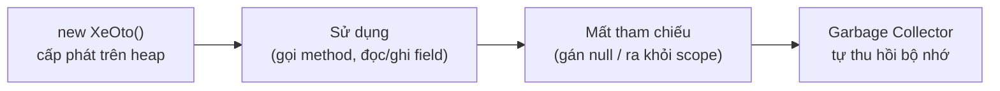

# Vòng đời đối tượng (Object Lifecycle)

Vòng đời đối tượng mô tả toàn bộ quá trình một đối tượng tồn tại trong Java, từ lúc được tạo ra cho đến khi bị xóa khỏi bộ nhớ. Hiểu vòng đời này giúp bạn nắm được cách Java quản lý bộ nhớ tự động và tránh các lỗi phổ biến như `NullPointerException` hay nhầm lẫn giữa tham chiếu và đối tượng. Bài này giới thiệu bốn giai đoạn: tạo, sử dụng, mất tham chiếu và thu gom rác (Garbage Collection).

[](pathname:///img/java/vong-doi-doi-tuong.webp)

---

:::note[Ghi nhớ nhanh]

- ⭐ **Vòng đời gồm 4 giai đoạn** — tạo → sử dụng → mất tham chiếu → thu gom rác (GC).
- **`new` cấp phát trên heap và chạy constructor** — biến chỉ chứa *tham chiếu* (địa chỉ), không phải chính đối tượng.
- ⭐ **Garbage Collection tự thu hồi object không còn tham chiếu** — không cần `free`/`delete` thủ công như C/C++.
- **`finalize()` đã lỗi thời (deprecated)** — dùng `try-with-resources` cho tài nguyên ngoài heap (file, kết nối).
- **Coi chừng leak do giữ reference thừa** — object nằm trong `static` hay collection sẽ không bao giờ bị GC.

:::

---

## Mục lục

- [Vì sao cần hiểu vòng đời object & GC?](#vì-sao-cần-hiểu-vòng-đời-object--gc)
- [Vòng đời đối tượng là gì?](#vòng-đời-đối-tượng-là-gì)
- [Bước 1: Tạo đối tượng với new](#bước-1-tạo-đối-tượng-với-new)
- [Bước 2: Sử dụng đối tượng](#bước-2-sử-dụng-đối-tượng)
- [Bước 3: Không còn tham chiếu](#bước-3-không-còn-tham-chiếu)
- [Bước 4: Garbage Collection — thu gom rác](#bước-4-garbage-collection--thu-gom-rác)
- [finalize — phương thức lỗi thời](#finalize--phương-thức-lỗi-thời)
- [Lỗi thường gặp](#lỗi-thường-gặp)
- [Tóm tắt](#tóm-tắt)
- [Câu hỏi phỏng vấn](#câu-hỏi-phỏng-vấn)

---

## Vì sao cần hiểu vòng đời object & GC?

**Vấn đề:** Trong ngôn ngữ cấp thấp (C/C++), bạn phải tự cấp phát **và tự giải phóng** bộ nhớ bằng tay. Quên giải phóng → **rò rỉ bộ nhớ** (memory leak); giải phóng hai lần hoặc dùng sau khi đã giải phóng → crash. Rất dễ sai.

```c
// C: phải tự free, cực kỳ dễ sai
char* buffer = malloc(1024);
// ... dùng buffer ...
// Quên free(buffer);  -> rò rỉ bộ nhớ (memory leak)

free(buffer);
free(buffer);          // free hai lần -> crash
buffer[0] = 'x';       // dùng sau khi free -> crash
```

**Giải pháp:** Java quản lý vòng đời đối tượng **tự động**. `new` cấp phát đối tượng trên **heap** (vùng nhớ chứa đối tượng), còn **Garbage Collector** (bộ thu gom rác) tự thu hồi những đối tượng **không còn tham chiếu** nào trỏ tới — bạn không cần `free` thủ công. Hiểu vòng đời (tạo → dùng → mất tham chiếu → bị GC) giúp bạn tránh leak (giữ tham chiếu thừa, listener không gỡ) và viết code thân thiện với bộ nhớ.

```java
public class Main {
    public static void main(String[] args) {
        // new: cấp phát trên heap, KHÔNG cần free thủ công
        XeOto xe = new XeOto("do");

        // Khi không còn tham chiếu, đối tượng đủ điều kiện bị GC thu hồi
        xe = null;   // không còn ai trỏ tới chiếc xe cũ -> GC sẽ tự dọn
    }
}
```

:::tip[Dùng thực tế]

- **Không phải free thủ công:** tạo đối tượng bằng `new` rồi dùng, không cần giải phóng bằng tay như C/C++.
- **Tránh leak do giữ reference thừa:** đối tượng nhét vào `static` hoặc collection (List, Map) sẽ không bao giờ bị GC — nhớ xóa khi không dùng nữa.
- **Hiểu khi nào object đủ điều kiện bị GC:** khi không còn tham chiếu nào trỏ tới (ví dụ gán `null` hoặc biến ra khỏi scope).
- **Dùng try-with-resources cho tài nguyên ngoài heap:** file, kết nối mạng, DB... GC không lo phần này, phải đóng chủ động.

:::

---

## Vòng đời đối tượng là gì?

**Vòng đời đối tượng** (object lifecycle — toàn bộ quá trình một đối tượng tồn tại, từ lúc sinh ra đến lúc bị xóa khỏi bộ nhớ) mô tả những gì xảy ra với một **đối tượng** (object — một thực thể được tạo ra từ class) trong suốt thời gian nó "sống".

Hãy tưởng tượng như một món đồ chơi: bạn mua nó về (tạo), chơi với nó (sử dụng), rồi vứt vào sọt rác khi không cần nữa (không còn tham chiếu), và cuối cùng xe rác mang đi (thu gom rác).

Vòng đời gồm 4 giai đoạn chính:

1. **Tạo** đối tượng bằng từ khóa `new`.
2. **Sử dụng** đối tượng (gọi phương thức, đọc/ghi thuộc tính).
3. **Không còn tham chiếu** trỏ tới đối tượng.
4. **Garbage Collection** (bộ thu gom rác) tự động giải phóng bộ nhớ.


```mermaid
flowchart LR
    A["new XeOto()<br/>cấp phát trên heap"] --> B["Sử dụng<br/>(gọi method, đọc/ghi field)"]
    B --> C["Mất tham chiếu<br/>(gán null / ra khỏi scope)"]
    C --> D["Garbage Collector<br/>tự thu hồi bộ nhớ"]
```

---

## Bước 1: Tạo đối tượng với new

Khi bạn dùng từ khóa `new`, Java sẽ cấp phát **bộ nhớ** (memory — vùng lưu trữ dữ liệu) cho đối tượng và chạy **constructor** (hàm khởi tạo — hàm đặc biệt chạy khi tạo đối tượng).

```java
public class XeOto {
    String mau;

    // Constructor: chạy ngay khi tạo đối tượng
    XeOto(String mau) {
        this.mau = mau;
        System.out.println("Mot chiec xe " + mau + " vua duoc tao");
    }
}

public class Main {
    public static void main(String[] args) {
        // new tạo đối tượng mới trong bộ nhớ
        // biến xe1 là THAM CHIẾU (reference) trỏ tới đối tượng đó
        XeOto xe1 = new XeOto("do");
    }
}
```

Biến `xe1` không chứa chính đối tượng, mà chứa **tham chiếu** (reference — địa chỉ trỏ tới đối tượng trong bộ nhớ). Giống như tờ giấy ghi địa chỉ nhà, chứ không phải ngôi nhà.

---

## Bước 2: Sử dụng đối tượng

Khi đã có tham chiếu, bạn dùng dấu chấm `.` để truy cập thuộc tính và phương thức.

```java
public class Main {
    public static void main(String[] args) {
        XeOto xe1 = new XeOto("do");

        // Đọc thuộc tính
        System.out.println("Mau xe: " + xe1.mau);

        // Ghi (thay đổi) thuộc tính
        xe1.mau = "xanh";
        System.out.println("Mau xe moi: " + xe1.mau);
    }
}
```

Một đối tượng có thể được nhiều biến cùng trỏ tới:

```java
XeOto xe1 = new XeOto("do");
XeOto xe2 = xe1; // xe2 trỏ tới CÙNG đối tượng với xe1

xe2.mau = "vang";
System.out.println(xe1.mau); // In ra "vang" vì cùng một đối tượng!
```

---

## Bước 3: Không còn tham chiếu

Khi không còn biến nào trỏ tới đối tượng nữa, đối tượng đó trở thành **rác** (garbage — dữ liệu không còn ai dùng tới).

```java
public class Main {
    public static void main(String[] args) {
        XeOto xe1 = new XeOto("do");

        // Gán null: xe1 không còn trỏ tới đối tượng nào nữa
        xe1 = null;
        // Lúc này chiếc xe "do" không còn ai trỏ tới -> trở thành rác

        // Cách khác: gán cho đối tượng mới
        XeOto xe2 = new XeOto("xanh");
        xe2 = new XeOto("vang");
        // Chiếc xe "xanh" bị bỏ rơi -> trở thành rác
    }
}
```

`null` là **giá trị rỗng** (không trỏ tới đối tượng nào). Khi gán `null`, bạn cắt đứt sợi dây nối giữa biến và đối tượng.

---

## Bước 4: Garbage Collection — thu gom rác

**Garbage Collection** (viết tắt GC — bộ thu gom rác tự động giải phóng bộ nhớ của các đối tượng không còn dùng) là một tính năng nổi bật của Java. Trong nhiều ngôn ngữ khác (như C++), lập trình viên phải tự tay giải phóng bộ nhớ; Java làm việc đó tự động.

```java
public class Main {
    public static void main(String[] args) {
        for (int i = 0; i < 1000; i++) {
            // Mỗi vòng lặp tạo một đối tượng mới
            // Đối tượng cũ của vòng trước trở thành rác
            XeOto xe = new XeOto("xe-" + i);
        }
        // GC sẽ tự động dọn dẹp các đối tượng rác này
        // Bạn KHÔNG cần và KHÔNG nên tự gọi GC thủ công
    }
}
```

Bạn **không cần** quan tâm khi nào GC chạy — Java tự quyết định. Có một lệnh gợi ý GC chạy là `System.gc()`, nhưng đây chỉ là **gợi ý** (Java có thể bỏ qua), và trong thực tế gần như không bao giờ nên gọi nó.

---

## finalize — phương thức lỗi thời

Ngày xưa Java có phương thức `finalize()` được gọi ngay trước khi đối tượng bị thu gom, dùng để "dọn dẹp" tài nguyên.

```java
public class TaiNguyen {
    // CẢNH BÁO: finalize đã LỖI THỜI (deprecated), KHÔNG nên dùng
    @Override
    protected void finalize() {
        System.out.println("Doi tuong sap bi don dep");
    }
}
```

`finalize()` đã bị **deprecated** (lỗi thời — không khuyến khích dùng, có thể bị loại bỏ trong tương lai) vì nhiều lý do: không đảm bảo chạy đúng lúc, làm chậm chương trình, và dễ gây lỗi.

**Thay thế hiện đại**: dùng khối `try-with-resources` (cú pháp tự động đóng tài nguyên) với các lớp triển khai `AutoCloseable`:

```java
public class Main {
    public static void main(String[] args) {
        // Tài nguyên được tự động đóng khi ra khỏi khối try
        try (var scanner = new java.util.Scanner(System.in)) {
            // dùng scanner ở đây
        } // scanner.close() tự động được gọi
    }
}
```

---

## Lỗi thường gặp

- **Nhầm tham chiếu với đối tượng**: gán `xe2 = xe1` không tạo bản sao mới — cả hai cùng trỏ một đối tượng, sửa cái này ảnh hưởng cái kia.
- **Tưởng cần tự giải phóng bộ nhớ**: Java có GC, bạn không cần `delete` hay `free` như C++.
- **Lạm dụng `System.gc()`**: gọi thủ công thường làm chậm chương trình và không đáng tin cậy.
- **Dùng `finalize()`**: đây là phương thức lỗi thời, hãy dùng `try-with-resources` thay thế.
- **Truy cập đối tượng đã gán `null`**: gây lỗi `NullPointerException` (lỗi truy cập đối tượng rỗng).

---

## Tóm tắt

- Vòng đời đối tượng gồm 4 giai đoạn: **tạo → sử dụng → mất tham chiếu → thu gom rác**.
- Từ khóa `new` cấp phát bộ nhớ và chạy constructor.
- Biến chứa **tham chiếu** (địa chỉ), không phải chính đối tượng.
- Khi không còn tham chiếu, đối tượng thành **rác**.
- **Garbage Collection** tự động giải phóng bộ nhớ — bạn không cần làm thủ công.
- `finalize()` đã **lỗi thời**; dùng `try-with-resources` để dọn dẹp tài nguyên.

---

## Câu hỏi phỏng vấn

Những câu thường gặp về chủ đề này. Tự trả lời trước, rồi bấm **Xem đáp án** để đối chiếu.

**1. Phân biệt "đối tượng" (object) và "tham chiếu" (reference) trong Java.**

<details className="qa">
<summary>Xem đáp án</summary>

- **Đối tượng** (object) là vùng dữ liệu thực sự nằm trên **heap**, được tạo ra bởi `new`.
- **Tham chiếu** (reference) là biến chứa **địa chỉ** trỏ tới đối tượng đó, không phải chính đối tượng.
- Nhiều biến tham chiếu có thể cùng trỏ tới một đối tượng; sửa qua biến này sẽ thấy thay đổi ở biến kia vì cả hai cùng trỏ chung một chỗ.
- Ví dụ: `XeOto xe1 = new XeOto("do"); XeOto xe2 = xe1;` — `xe1` và `xe2` là hai tham chiếu khác nhau nhưng cùng trỏ một object.

</details>

**2. Một đối tượng được xem là "đủ điều kiện" (eligible) để Garbage Collector thu hồi khi nào?**

<details className="qa">
<summary>Xem đáp án</summary>

Khi **không còn tham chiếu mạnh (strong reference) nào** từ một "root" (biến local đang chạy, biến `static`, thread đang sống...) trỏ tới nó. Các trường hợp phổ biến:

- Gán `null` cho biến duy nhất đang trỏ tới object.
- Biến local ra khỏi phạm vi (scope) khi phương thức kết thúc.
- Gán lại biến để trỏ sang object khác, bỏ rơi object cũ.
- Object chỉ được tham chiếu bởi các object khác cũng đang là rác (cả một "đảo" object cô lập cũng bị thu gom).

Lưu ý: object nằm trong biến `static` hoặc collection còn sống thì **không bao giờ** đủ điều kiện GC cho tới khi bị xóa khỏi đó — đây là nguyên nhân phổ biến của memory leak.

</details>

**3. Heap và Stack khác nhau thế nào trong việc lưu trữ dữ liệu Java?**

<details className="qa">
<summary>Xem đáp án</summary>

| Tiêu chí | Stack | Heap |
|---|---|---|
| Lưu gì | Biến cục bộ, tham chiếu, khung gọi hàm | Các đối tượng thực sự (`new`) |
| Vòng đời | Tự động dọn khi hàm return | Do Garbage Collector quản lý |
| Tốc độ | Rất nhanh | Chậm hơn stack |
| Chia sẻ giữa thread | Mỗi thread một stack riêng | Dùng chung giữa các thread |

Khi một phương thức kết thúc, các biến cục bộ (kể cả tham chiếu) trên stack bị dọn, nhưng object trên heap chỉ mất đi khi không còn ai tham chiếu tới.

</details>

**4. Vì sao Java không cho lập trình viên tự `free`/`delete` bộ nhớ như C/C++? Đánh đổi là gì?**

<details className="qa">
<summary>Xem đáp án</summary>

- Tự quản lý bộ nhớ dễ gây **memory leak** (quên free), **double free**, hoặc **dangling pointer** (dùng sau khi free) — những lỗi rất khó debug và có thể gây crash hoặc lỗ hổng bảo mật.
- Java giao việc này cho **Garbage Collector**, tự động phát hiện và thu hồi object không còn tham chiếu, giúp code an toàn hơn và giảm gánh nặng cho lập trình viên.
- Đánh đổi: mất quyền kiểm soát chính xác thời điểm giải phóng, và GC tốn thêm CPU/có thể gây độ trễ (pause) không dự đoán trước — đây là lý do các hệ thống hiệu năng cực cao đôi khi phải tinh chỉnh GC hoặc chọn GC phù hợp (G1, ZGC...).

</details>

**5. `finalize()` là gì và vì sao bị deprecated? Thay thế bằng gì?**

<details className="qa">
<summary>Xem đáp án</summary>

`finalize()` là phương thức được JVM gọi (không đảm bảo) ngay trước khi GC thu hồi object, từng dùng để "dọn dẹp" tài nguyên.

Bị deprecated (từ Java 9, dự kiến loại bỏ) vì:

- **Không đảm bảo chạy**, và nếu chạy thì không biết chạy lúc nào — tài nguyên có thể bị giữ rất lâu.
- Làm **chậm** quá trình GC vì object có `finalize()` phải qua thêm một bước xử lý đặc biệt.
- Dễ gây lỗi nếu `finalize()` "hồi sinh" object (gán lại tham chiếu) hoặc ném exception.

Thay thế: implement `AutoCloseable` và dùng khối `try-with-resources`, hoặc dùng `java.lang.ref.Cleaner` cho các trường hợp cần dọn dẹp gắn với vòng đời GC.

</details>

**6. Đọc code sau — biến `xe1` có bị lỗi khi gọi `xe1.an()` ở dòng cuối không? Giải thích.**

```java
XeOto xe1 = new XeOto("do");
XeOto xe2 = xe1;
xe1 = null;
xe2.an();
```

<details className="qa">
<summary>Xem đáp án</summary>

**Không lỗi.** `xe1 = null` chỉ cắt đứt tham chiếu của **biến `xe1`**, không xóa đối tượng. Đối tượng `XeOto("do")` vẫn còn tồn tại trên heap vì `xe2` vẫn đang trỏ tới nó — object chỉ đủ điều kiện GC khi **không còn bất kỳ tham chiếu nào** trỏ tới, chứ không phải khi một biến cụ thể bị gán `null`. Vì vậy `xe2.an()` chạy bình thường.

</details>

**7. `System.gc()` có đảm bảo Garbage Collector chạy ngay lập tức không? Có nên gọi trong code production không?**

<details className="qa">
<summary>Xem đáp án</summary>

- `System.gc()` chỉ là một **gợi ý** (hint) cho JVM rằng "bây giờ là thời điểm tốt để chạy GC", nhưng JVM **có quyền bỏ qua** hoàn toàn.
- Không nên gọi trong code production vì: không đáng tin cậy, có thể gây một đợt "stop-the-world" tốn kém không cần thiết, làm giảm hiệu năng ứng dụng một cách khó dự đoán.
- JVM hiện đại tự quyết định thời điểm chạy GC dựa trên áp lực bộ nhớ tốt hơn nhiều so với gọi thủ công.

</details>

**8. Mô tả ngắn gọn cơ chế Generational Garbage Collection (Young Generation / Old Generation) mà JVM hiện đại dùng.**

<details className="qa">
<summary>Xem đáp án</summary>

- JVM chia heap thành **Young Generation** (nơi object mới sinh ra, gồm Eden + hai vùng Survivor) và **Old Generation** (nơi chứa object sống lâu).
- Giả định: phần lớn object "chết trẻ" (weak generational hypothesis), nên GC quét Young Generation thường xuyên bằng **Minor GC** — nhanh vì vùng nhỏ.
- Object sống sót qua nhiều lần Minor GC sẽ được **promote** (thăng cấp) sang Old Generation.
- Old Generation ít bị quét hơn, dùng **Major/Full GC** — chậm hơn nhưng ít xảy ra.
- Các GC hiện đại như **G1**, **ZGC**, **Shenandoah** tối ưu thêm để giảm thời gian "stop-the-world".

</details>

**9. Nêu một tình huống memory leak thực tế trong Java dù đã có GC, và cách khắc phục.**

<details className="qa">
<summary>Xem đáp án</summary>

Memory leak trong Java xảy ra khi object vẫn còn tham chiếu (nên GC không thu hồi được) nhưng thực tế không còn cần dùng nữa. Ví dụ phổ biến:

- **`static` collection tích lũy dần**: thêm phần tử vào `List`/`Map` khai báo `static` mà không bao giờ xóa → object bên trong không bao giờ bị GC.
- **Listener/callback không gỡ đăng ký**: đăng ký listener vào một object sống lâu (như UI framework) mà quên `removeListener` khi không cần nữa.
- **`ThreadLocal` không `remove()`** trong môi trường thread pool (thread được tái sử dụng nên giá trị cũ vẫn còn).

Khắc phục: chủ động xóa khỏi collection/gỡ listener khi không dùng nữa, dùng `WeakReference`/`WeakHashMap` khi tham chiếu chỉ nên "giữ nếu còn ai khác cần", và luôn `remove()` `ThreadLocal` sau khi dùng xong (ví dụ trong `finally`).

</details>

**10. Bạn được giao debug một ứng dụng Java bị `OutOfMemoryError` tăng dần theo thời gian chạy. Bạn sẽ tiếp cận theo quy trình nào?**

<details className="qa">
<summary>Xem đáp án</summary>

1. **Xác nhận là leak thật** chứ không phải chỉ cần tăng heap (`-Xmx`) — theo dõi biểu đồ heap usage theo thời gian, nếu tăng dần không giảm sau GC thì đúng là leak.
2. **Chụp heap dump** (`jmap -dump` hoặc bật `-XX:+HeapDumpOnOutOfMemoryError`) tại thời điểm bộ nhớ cao.
3. Dùng công cụ phân tích (**Eclipse MAT**, VisualVM) để tìm **object nào chiếm nhiều bộ nhớ nhất** và xem "đường đi tới GC root" (ai đang giữ tham chiếu tới nó).
4. Tập trung vào các nghi phạm quen thuộc: `static` collection phình to, cache không giới hạn kích thước, listener/`ThreadLocal` không gỡ.
5. Sửa bằng cách xóa tham chiếu đúng lúc, hoặc dùng cache có giới hạn (LRU) / `WeakReference`.
6. Chạy lại với công cụ profiling (JFR, async-profiler) để xác nhận vấn đề đã hết trước khi deploy.

</details>
