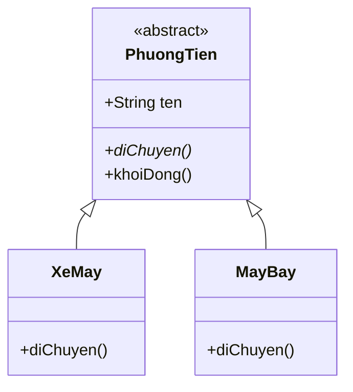

# Trừu tượng (Abstraction)

Trừu tượng là cách bạn tập trung mô tả "làm gì" mà giấu đi chi tiết "làm như thế nào". Trong Java, ta thể hiện nó bằng lớp trừu tượng (abstract class) và phương thức trừu tượng (abstract method) để đặt ra khuôn mẫu chung bắt buộc các lớp con phải tuân theo. Bài này giúp bạn hiểu vì sao cần trừu tượng và cách dùng nó để viết code linh hoạt; phần chi tiết nằm bên dưới.

[](pathname:///img/java/truu-tuong.webp)

---

:::note[Ghi nhớ nhanh]

- ⭐ **Trừu tượng phơi bày "làm gì", giấu "làm thế nào"** — người dùng lập trình theo abstraction, không phụ thuộc cài đặt cụ thể.
- **`abstract class` không thể `new` trực tiếp** — chỉ làm khuôn mẫu cho lớp con kế thừa.
- ⭐ **`abstract method` chỉ có tên, không có thân** (kết thúc bằng `;`) — lớp con *bắt buộc* cài đặt.
- **Abstract class trộn được cả method thường lẫn abstract** — method thường có thể gọi abstract method bên trong.
- **Khác interface** — abstract class có thuộc tính và constructor.

:::

---

## Mục lục

- [Vì sao có tính trừu tượng (abstraction)?](#vì-sao-có-tính-trừu-tượng-abstraction)
- [Trừu tượng là gì?](#trừu-tượng-là-gì)
- [Abstract class — lớp trừu tượng](#abstract-class--lớp-trừu-tượng)
- [Abstract method — phương thức trừu tượng](#abstract-method--phương-thức-trừu-tượng)
- [Vì sao cần trừu tượng?](#vì-sao-cần-trừu-tượng)
- [Khác gì với class thường?](#khác-gì-với-class-thường)
- [Kết hợp method thường và abstract](#kết-hợp-method-thường-và-abstract)
- [Lỗi thường gặp](#lỗi-thường-gặp)
- [Tóm tắt](#tóm-tắt)
- [Câu hỏi phỏng vấn](#câu-hỏi-phỏng-vấn)

---

## Vì sao có tính trừu tượng (abstraction)?

**Vấn đề:** Người DÙNG một thành phần không cần (và không nên) biết chi tiết CÀI ĐẶT bên trong. Khi code phụ thuộc thẳng vào lớp cụ thể, chỉ cần đổi cài đặt là vỡ hàng loạt. Ngoài ra ta còn muốn ép các lớp con tuân theo một KHUÔN chung.

```java
// Code dính chặt vào từng lớp cụ thể — thêm hình mới là phải sửa chỗ này
class HinhTron {
    double r;
    double dienTichTron() { return 3.14 * r * r; }
}

class HinhChuNhat {
    double rong, cao;
    double dienTichChuNhat() { return rong * cao; }
}

class Main {
    public static void main(String[] args) {
        HinhTron tron = new HinhTron();
        tron.r = 2;
        // Mỗi loại một tên hàm khác nhau → khó gom chung, dễ vỡ khi đổi
        System.out.println(tron.dienTichTron());
    }
}
```

**Giải pháp:** TRỪU TƯỢNG — chỉ phơi bày "LÀM GÌ" (what) và giấu "LÀM THẾ NÀO" (how). Dùng `abstract class` làm khuôn: chứa code dùng chung và `abstract method` bắt buộc lớp con cài đặt, đồng thời không cho `new` trực tiếp. Người dùng chỉ lập trình theo abstraction, không phụ thuộc cài đặt cụ thể nên dễ thay đổi/mở rộng.

```java
// Khuôn chung: mọi hình đều có dienTich(), nhưng "làm thế nào" thì giấu đi
abstract class Hinh {
    abstract double dienTich(); // what: bắt buộc lớp con cài đặt
}

class HinhTron extends Hinh {
    double r;
    @Override
    double dienTich() { return 3.14 * r * r; } // how: giấu trong lớp con
}

class HinhChuNhat extends Hinh {
    double rong, cao;
    @Override
    double dienTich() { return rong * cao; }
}

class Main {
    public static void main(String[] args) {
        // Lập trình theo abstraction Hinh, không quan tâm hình cụ thể nào
        Hinh[] danhSach = { new HinhTron(), new HinhChuNhat() };
        for (Hinh h : danhSach) {
            System.out.println(h.dienTich());
        }
    }
}
```

:::tip[Dùng thực tế]
- **Hình học**: `abstract class Shape` với `area()` trừu tượng — mỗi hình tự tính diện tích theo cách riêng.
- **Khuôn xử lý chung (template method)**: lớp cha giữ luồng chung, để lớp con điền vào các bước trừu tượng.
- **Ẩn chi tiết sau API**: lộ ra giao diện trừu tượng, giấu cài đặt thật nên đổi bên trong không ảnh hưởng người dùng.
- **Lập trình theo abstraction**: khai báo biến/tham số bằng kiểu trừu tượng thay vì lớp cụ thể để dễ thay thế và mở rộng.
:::

---

## Trừu tượng là gì?

**Trừu tượng** (abstraction — chỉ tập trung vào "làm gì" mà giấu đi "làm như thế nào") là việc mô tả khái niệm chung mà chưa cần nói rõ chi tiết.

Ví dụ đời thường: "Phương tiện di chuyển" là một khái niệm trừu tượng. Bạn biết nó có thể "di chuyển", nhưng xe máy di chuyển khác ô tô, khác máy bay. Khái niệm "Phương tiện" tự nó không thể tồn tại cụ thể — bạn không thể mua "một chiếc phương tiện" chung chung, mà phải là một loại cụ thể.

Trong Java, ta thể hiện trừu tượng bằng **abstract class** (lớp trừu tượng) và **abstract method** (phương thức trừu tượng).

---

## Abstract class — lớp trừu tượng

**Abstract class** (lớp trừu tượng — lớp không thể tạo đối tượng trực tiếp, dùng làm khuôn mẫu) được khai báo với từ khóa `abstract`.

```java
// abstract: đây là lớp trừu tượng
public abstract class PhuongTien {
    String ten;

    void moTa() {
        System.out.println("Day la phuong tien: " + ten);
    }
}
```

Điểm đặc biệt: bạn **không thể** tạo đối tượng từ lớp trừu tượng.

```java
public class Main {
    public static void main(String[] args) {
        // LỖI: không thể tạo đối tượng từ lớp abstract
        // PhuongTien pt = new PhuongTien(); // SAI!

        // ĐÚNG: tạo từ lớp con cụ thể (sẽ khai báo bên dưới)
        PhuongTien xe = new XeMay();
    }
}
```

---

## Abstract method — phương thức trừu tượng

**Abstract method** (phương thức trừu tượng — phương thức chỉ có tên, không có phần thân) khai báo "việc cần làm" mà chưa nói "làm thế nào". Lớp con bắt buộc phải viết phần thân.

```java
public abstract class PhuongTien {
    String ten;

    // Phương thức trừu tượng: KHÔNG có thân, kết thúc bằng dấu ;
    abstract void diChuyen();

    // Phương thức thường: CÓ thân
    void khoiDong() {
        System.out.println(ten + " khoi dong");
    }
}

public class XeMay extends PhuongTien {
    XeMay() {
        this.ten = "Xe may";
    }

    // BẮT BUỘC viết thân cho phương thức trừu tượng
    @Override
    void diChuyen() {
        System.out.println("Xe may chay tren 2 banh");
    }
}

public class MayBay extends PhuongTien {
    MayBay() {
        this.ten = "May bay";
    }

    @Override
    void diChuyen() {
        System.out.println("May bay bay tren troi");
    }
}
```

Mỗi lớp con triển khai `diChuyen()` theo cách riêng. Đây chính là sức mạnh của trừu tượng.

Sơ đồ dưới minh hoạ lớp trừu tượng `PhuongTien` làm khuôn (dấu `*` đánh dấu phương thức trừu tượng), các lớp con cài đặt riêng (mũi tên trỏ về lớp cha):



---

## Vì sao cần trừu tượng?

Trừu tượng giúp:

1. **Đặt ra "hợp đồng"**: lớp cha quy định lớp con PHẢI có phương thức nào.
2. **Tránh tạo đối tượng vô nghĩa**: bạn không nên tạo "một phương tiện chung chung".
3. **Viết code linh hoạt**: dùng kiểu lớp cha để xử lý nhiều loại lớp con.

```java
public class Main {
    public static void main(String[] args) {
        // Dùng kiểu lớp cha PhuongTien để chứa nhiều loại
        PhuongTien[] danhSach = {
            new XeMay(),
            new MayBay()
        };

        // Mỗi đối tượng tự gọi diChuyen() của riêng nó
        for (PhuongTien pt : danhSach) {
            pt.diChuyen();
        }
        // Kết quả:
        // Xe may chay tren 2 banh
        // May bay bay tren troi
    }
}
```

---

## Khác gì với class thường?

| Đặc điểm | Class thường | Abstract class |
|----------|-------------|----------------|
| Tạo đối tượng bằng `new` | Được | KHÔNG được |
| Có abstract method | Không | Có thể có |
| Có method thường | Có | Có |
| Có thuộc tính | Có | Có |
| Có constructor | Có | Có (gọi qua `super`) |
| Mục đích | Tạo đối tượng cụ thể | Làm khuôn mẫu cho lớp con |

Tóm lại: class thường để **dùng trực tiếp**; abstract class để **làm nền tảng** cho các lớp con kế thừa.

---

## Kết hợp method thường và abstract

Một abstract class có thể trộn cả hai loại phương thức:

```java
public abstract class NhanVien {
    String ten;
    double luongCoBan;

    // Phương thức trừu tượng: mỗi loại nhân viên tính thưởng khác nhau
    abstract double tinhThuong();

    // Phương thức thường: dùng chung cho mọi nhân viên
    double tinhTongLuong() {
        return luongCoBan + tinhThuong(); // gọi method abstract bên trong
    }
}

public class NhanVienBanHang extends NhanVien {
    double doanhSo;

    @Override
    double tinhThuong() {
        return doanhSo * 0.1; // thưởng 10% doanh số
    }
}
```

Phương thức thường `tinhTongLuong()` có thể gọi phương thức trừu tượng `tinhThuong()` — đến lúc chạy, Java sẽ dùng phần thân của lớp con cụ thể.

---

## Lỗi thường gặp

- **Tạo đối tượng từ abstract class**: `new PhuongTien()` gây lỗi biên dịch.
- **Quên viết thân cho abstract method ở lớp con**: lớp con sẽ bị lỗi, trừ khi nó cũng là abstract.
- **Viết thân cho abstract method**: abstract method chỉ có tên và dấu `;`, không có `{ }`.
- **Nhầm abstract class với interface**: abstract class có thể có thuộc tính và constructor; interface thì khác (học ở bài Interfaces).
- **Quên từ khóa `abstract`** trên lớp khi nó chứa abstract method → lỗi.

---

## Tóm tắt

- **Trừu tượng** tập trung vào "làm gì", giấu đi "làm thế nào".
- **Abstract class** không thể tạo đối tượng trực tiếp, chỉ làm khuôn mẫu.
- **Abstract method** chỉ có tên, không có thân; lớp con **bắt buộc** viết phần thân.
- Trừu tượng giúp đặt "hợp đồng" và viết code linh hoạt với nhiều loại lớp con.
- Abstract class có thể trộn cả phương thức thường lẫn phương thức trừu tượng.

---

## Câu hỏi phỏng vấn

Những câu thường gặp về chủ đề này. Tự trả lời trước, rồi bấm **Xem đáp án** để đối chiếu.

**1. Vì sao `abstract class` không thể tạo đối tượng trực tiếp bằng `new`? Điều gì xảy ra nếu cố làm vậy?**

<details className="qa">
<summary>Xem đáp án</summary>

Vì abstract class có thể chứa **abstract method** — phương thức chỉ có tên, không có phần thân. Nếu cho phép `new` một abstract class, chương trình sẽ gọi được một phương thức không có cài đặt nào để chạy, điều này vô nghĩa và không an toàn.

Nếu cố viết `new PhuongTien()` với `PhuongTien` là abstract class, Java báo **lỗi biên dịch**: "`PhuongTien` is abstract; cannot be instantiated". Bạn chỉ có thể `new` một lớp con **cụ thể** (concrete class) đã cài đặt đầy đủ mọi abstract method.

</details>

**2. Một `abstract class` có bắt buộc mọi phương thức đều phải là `abstract` không?**

<details className="qa">
<summary>Xem đáp án</summary>

**Không.** Một abstract class có thể trộn cả phương thức thường (có thân, dùng chung cho mọi lớp con) và abstract method (chưa có thân, bắt buộc lớp con cài đặt). Thậm chí một abstract class có thể **không có** abstract method nào — chỉ đơn giản là đánh dấu "không cho tạo trực tiếp", nhưng cách dùng phổ biến nhất vẫn là kết hợp cả hai loại, ví dụ method thường gọi abstract method bên trong (nền tảng của Template Method pattern).

</details>

**3. `abstract class` có được phép có constructor không? Nếu không thể `new` được thì constructor để làm gì?**

<details className="qa">
<summary>Xem đáp án</summary>

**Có**, abstract class được phép (và thường nên) có constructor. Constructor này không dùng để `new` trực tiếp abstract class, mà được **lớp con gọi qua `super(...)`** khi lớp con khởi tạo — dùng để thiết lập các thuộc tính chung khai báo ở lớp cha (ví dụ `ten` trong `PhuongTien`). Đây là điểm khác biệt lớn với interface — interface không có constructor vì không lưu trạng thái field thường.

</details>

**4. So sánh `default method` của interface (Java 8+) với method thường của abstract class — chúng có thay thế được nhau hoàn toàn không?**

<details className="qa">
<summary>Xem đáp án</summary>

Cả hai đều cho phép cung cấp cài đặt sẵn để lớp con dùng lại mà không bắt buộc override. Tuy nhiên khác biệt quan trọng:

- **Method thường trong abstract class** có thể truy cập **field/thuộc tính** của lớp (`this.ten`), và abstract class có constructor để khởi tạo field đó.
- **`default method` trong interface** không có field thường để dựa vào (interface chỉ có hằng số `public static final`), nên thường chỉ gọi qua các abstract method khác của chính interface đó, không lưu trạng thái riêng.

Vì vậy không thay thế hoàn toàn nhau: cần **chia sẻ dữ liệu và code** giữa các lớp có quan hệ "is-a" → abstract class; chỉ cần chia sẻ **hành vi không phụ thuộc field riêng** → default method của interface đủ dùng.

</details>

**5. Template Method là một design pattern gắn liền với abstract class. Mô tả ý tưởng và cho ví dụ ngắn.**

<details className="qa">
<summary>Xem đáp án</summary>

**Template Method** (phương thức khuôn mẫu): lớp cha (abstract class) định nghĩa **khung/luồng xử lý chung** trong một method thường, còn các **bước chi tiết** được để trống dưới dạng abstract method cho lớp con tự điền vào.

```java
abstract class QuyTrinhPhaCafe {
    // Template method: luồng cố định, không cho lớp con đổi thứ tự
    final void phaCafe() {
        dunNuoc();
        phaTheoKieuRieng(); // bước riêng do lớp con quyết định
        rotVaoLy();
    }
    void dunNuoc() { System.out.println("Dun nuoc soi"); }
    abstract void phaTheoKieuRieng();
    void rotVaoLy() { System.out.println("Rot ra ly"); }
}
```

Lớp con (`CaPhePhin`, `CaPheMay`...) chỉ cần cài đặt `phaTheoKieuRieng()`, còn luồng tổng thể không đổi — tránh lặp code và đảm bảo mọi lớp con tuân theo đúng quy trình.

</details>

**6. Đọc code sau — dòng nào gây lỗi biên dịch và vì sao?**

```java
abstract class Hinh {
    abstract double dienTich();
}

class TamGiac extends Hinh {
    double day, cao;
}
```

<details className="qa">
<summary>Xem đáp án</summary>

**Lỗi ở khai báo `class TamGiac extends Hinh`**: `TamGiac` kế thừa `Hinh` nhưng **không cài đặt** `dienTich()`, trong khi bản thân `TamGiac` lại không được khai báo là `abstract`. Java bắt buộc: một lớp **cụ thể** (không phải abstract) kế thừa abstract class phải cài đặt **đầy đủ** mọi abstract method còn sót lại.

Cách sửa: hoặc thêm phần thân cho `dienTich()` trong `TamGiac`, hoặc khai báo `abstract class TamGiac extends Hinh` để đẩy trách nhiệm cài đặt xuống lớp con tiếp theo.

</details>

**7. Từ Java 8 trở đi, interface đã có `default method` và `static method`, ranh giới với abstract class bị mờ đi nhiều. Vậy khi nào bạn vẫn chọn abstract class thay vì interface?**

<details className="qa">
<summary>Xem đáp án</summary>

Chọn **abstract class** khi:

- Các lớp con có **quan hệ họ hàng rõ ràng** (is-a) và cần **chia sẻ trạng thái** (field) chung, không chỉ hành vi.
- Cần **constructor** để khởi tạo dữ liệu chung bắt buộc.
- Muốn kiểm soát chặt hơn về access modifier (`protected`, `private` cho method nội bộ) — điều interface không hỗ trợ đầy đủ.

Chọn **interface** khi:

- Muốn mô tả một **khả năng** (capability) mà nhiều lớp không họ hàng đều có thể có (`Comparable`, `Runnable`).
- Cần **đa kế thừa hành vi** — một lớp implement nhiều interface, nhưng chỉ extends được một lớp cha.

Quy tắc kinh điển: "is-a và cần state chung" → abstract class; "can-do và không quan tâm state" → interface.

</details>

**8. `abstract method` có thể khai báo là `private`, `static`, hoặc `final` không? Giải thích.**

<details className="qa">
<summary>Xem đáp án</summary>

**Không được**, cả ba đều mâu thuẫn với bản chất của abstract method:

- `private`: abstract method cần lớp con **override** được, mà `private` thì lớp con không nhìn thấy để override.
- `static`: method `static` gắn với lớp, không tham gia cơ chế **dynamic binding/override** — không có ý nghĩa để trừu tượng hóa.
- `final`: `final` nghĩa là **không được override**, trong khi mục đích của abstract method chính là bắt buộc lớp con phải override.

Kết hợp bất kỳ từ khóa nào ở trên với `abstract` đều gây **lỗi biên dịch**.

</details>

**9. Trừu tượng (abstraction) và đóng gói (encapsulation) là hai khái niệm hay bị nhầm lẫn. Phân biệt chúng.**

<details className="qa">
<summary>Xem đáp án</summary>

- **Trừu tượng (abstraction)**: tập trung vào **thiết kế ở mức khái niệm** — phơi bày "làm được gì" (what), giấu "làm thế nào" (how). Công cụ: `abstract class`, `interface`.
- **Đóng gói (encapsulation)**: tập trung vào **bảo vệ dữ liệu ở mức cài đặt** — giấu chi tiết lưu trữ bên trong đối tượng, chỉ cho truy cập qua getter/setter được kiểm soát. Công cụ: `private` + getter/setter.

Nói ngắn gọn: trừu tượng là "che giấu độ phức tạp trong thiết kế API", còn đóng gói là "che giấu dữ liệu trong cài đặt". Hai khái niệm bổ trợ nhau: một `interface` (trừu tượng tốt) vẫn có thể được cài đặt bởi một lớp có field `private` (đóng gói tốt).

</details>
