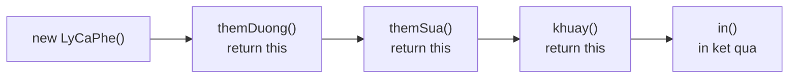

# Method Chaining (gọi chuỗi phương thức)

Method chaining là kỹ thuật gọi nhiều phương thức nối tiếp nhau trên cùng một dòng, ví dụ `doiTuong.a().b().c()`. Bí quyết là mỗi phương thức trả về `this` (chính đối tượng hiện tại) để có thể gọi tiếp, giúp code ngắn gọn và dễ đọc. Bài này giới thiệu cách trả về `this`, ví dụ với `StringBuilder` và Builder Pattern; phần chi tiết nằm bên dưới.

---

## Mục lục

- [Vì sao có method chaining?](#vì-sao-có-method-chaining)
- [Method Chaining là gì?](#method-chaining-là-gì)
- [Trả về this để gọi liên tiếp](#trả-về-this-để-gọi-liên-tiếp)
- [So sánh cách viết thông thường và chaining](#so-sánh-cách-viết-thông-thường-và-chaining)
- [Ví dụ với StringBuilder](#ví-dụ-với-stringbuilder)
- [Builder Pattern cơ bản](#builder-pattern-cơ-bản)
- [Lỗi thường gặp](#lỗi-thường-gặp)
- [Tóm tắt](#tóm-tắt)

---

## Vì sao có method chaining?

**Vấn đề:** Cấu hình một đối tượng qua nhiều bước bằng các câu lệnh set rời rạc rất dài dòng, lặp đi lặp lại tên biến và khó đọc. Còn dồn hết vào constructor nhiều tham số thì khó nhớ thứ tự, dễ truyền nhầm.

```java
// Lặp tên biến "ly" ở mọi dòng, dài dòng
LyCaPhe ly = new LyCaPhe();
ly.themDuong();
ly.themSua();
ly.khuay();

// Constructor nhiều tham số: khó nhớ thứ tự, dễ nhầm
LyCaPhe ly2 = new LyCaPhe(true, true, true); // tham số nào là gì?
```

**Giải pháp:** Dùng **method chaining** (fluent interface — giao diện trôi chảy): mỗi phương thức trả về `this` (hoặc một Builder) để gọi nối tiếp ngay trên dòng. Đây là nền tảng của Builder Pattern và các fluent API. Code gọn, đọc như một câu văn và an toàn hơn constructor nhiều tham số.

```java
// Gọn gàng, đọc như một câu: thêm đường rồi thêm sữa rồi khuấy
LyCaPhe ly = new LyCaPhe()
    .themDuong()
    .themSua()
    .khuay();
```

:::tip[Dùng thực tế]

- **Builder Pattern**: dựng đối tượng phức tạp từng bước rõ ràng, kết thúc bằng `build()`.
- **Fluent API thư viện chuẩn**: `StringBuilder.append()`, `Stream` (`filter().map().collect()`), query builder.
- **Cấu hình nhiều bước**: thiết lập một đối tượng qua nhiều thuộc tính trên cùng một chuỗi gọi.
- **Code dễ đọc**: thể hiện rõ một chuỗi thao tác liên tục thay vì nhiều câu lệnh rời rạc.

:::

---

## Method Chaining là gì?

**Method Chaining** (gọi chuỗi phương thức — gọi nhiều phương thức nối tiếp nhau trên cùng một dòng) là kỹ thuật cho phép viết `doiTuong.a().b().c()` thay vì gọi từng phương thức riêng lẻ.

Ví dụ đời thường: khi pha cà phê bạn làm chuỗi việc liên tiếp — "lấy ly → cho cà phê → thêm đường → khuấy". Method chaining cho phép diễn đạt chuỗi hành động đó gọn gàng trên một dòng.

---

## Trả về this để gọi liên tiếp

Bí quyết của method chaining là: mỗi phương thức **trả về chính đối tượng hiện tại** bằng từ khóa `this` (con trỏ tới đối tượng đang gọi). Nhờ vậy ta có thể tiếp tục gọi phương thức khác ngay sau đó.

```java
public class LyCaPhe {
    String noiDung = "Ca phe";

    // Mỗi phương thức trả về this (chính đối tượng này)
    LyCaPhe themDuong() {
        noiDung += " + duong";
        return this; // Trả về chính nó để gọi tiếp
    }

    LyCaPhe themSua() {
        noiDung += " + sua";
        return this;
    }

    LyCaPhe khuay() {
        noiDung += " (da khuay)";
        return this;
    }

    void in() {
        System.out.println(noiDung);
    }
}
```

Sử dụng method chaining:

```java
public class Main {
    public static void main(String[] args) {
        LyCaPhe ly = new LyCaPhe();

        // Gọi chuỗi phương thức liên tiếp trên một dòng
        ly.themDuong().themSua().khuay().in();
        // Kết quả: Ca phe + duong + sua (da khuay)
    }
}
```

Điểm mấu chốt: kiểu trả về của phương thức phải là chính lớp đó (`LyCaPhe`), và câu lệnh cuối là `return this;`.

Sơ đồ luồng gọi chuỗi: mỗi phương thức trả về `this` nên có thể gọi tiếp phương thức kế tiếp trên cùng đối tượng:



---

## So sánh cách viết thông thường và chaining

Không dùng chaining (dài dòng, lặp tên biến):

```java
LyCaPhe ly = new LyCaPhe();
ly.themDuong();
ly.themSua();
ly.khuay();
ly.in();
```

Dùng chaining (gọn gàng, dễ đọc):

```java
LyCaPhe ly = new LyCaPhe();
ly.themDuong().themSua().khuay().in();
```

Cả hai cho kết quả giống nhau, nhưng chaining ngắn gọn và thể hiện rõ "một chuỗi thao tác liên tục".

---

## Ví dụ với StringBuilder

`StringBuilder` (lớp dựng chuỗi — dùng để nối chuỗi hiệu quả) là ví dụ kinh điển về method chaining trong thư viện chuẩn của Java. Phương thức `append()` (nối thêm) trả về chính `StringBuilder`.

```java
public class Main {
    public static void main(String[] args) {
        // append() trả về chính StringBuilder nên gọi chuỗi được
        String ketQua = new StringBuilder()
            .append("Xin")
            .append(" chao")
            .append(" Java")
            .append("!")
            .toString(); // chuyển thành String

        System.out.println(ketQua); // Xin chao Java!
    }
}
```

So với việc nối chuỗi bằng `+` nhiều lần, `StringBuilder` nhanh hơn khi xử lý nhiều phần, và method chaining khiến code rất dễ đọc.

---

## Builder Pattern cơ bản

**Builder Pattern** (mẫu thiết kế "thợ xây" — cách tạo đối tượng phức tạp từng bước rõ ràng) là ứng dụng phổ biến của method chaining. Thay vì truyền cả đống tham số vào constructor, ta "xây" đối tượng từng phần.

```java
public class Pizza {
    String de;
    String phomai;
    boolean coNam;

    // Builder: lớp con bên trong giúp xây Pizza từng bước
    static class Builder {
        private Pizza pizza = new Pizza();

        Builder de(String de) {
            pizza.de = de;
            return this; // trả về Builder để gọi tiếp
        }

        Builder phomai(String phomai) {
            pizza.phomai = phomai;
            return this;
        }

        Builder themNam() {
            pizza.coNam = true;
            return this;
        }

        // build(): kết thúc chuỗi, trả về Pizza hoàn chỉnh
        Pizza build() {
            return pizza;
        }
    }
}
```

Sử dụng builder với method chaining:

```java
public class Main {
    public static void main(String[] args) {
        // Xây pizza từng bước, dễ đọc như đọc đơn đặt hàng
        Pizza pizza = new Pizza.Builder()
            .de("day mong")
            .phomai("mozzarella")
            .themNam()
            .build();

        System.out.println("De: " + pizza.de);
        System.out.println("Pho mai: " + pizza.phomai);
        System.out.println("Co nam: " + pizza.coNam);
    }
}
```

Cách viết này rõ ràng hơn nhiều so với `new Pizza("day mong", "mozzarella", true)` — bạn biết ngay tham số nào là gì.

---

## Lỗi thường gặp

- **Quên `return this;`**: nếu phương thức trả về `void`, bạn không thể gọi chuỗi tiếp.
- **Sai kiểu trả về**: phương thức phải trả về kiểu của chính lớp (hoặc Builder) để chaining hoạt động.
- **Quên gọi `build()`** trong builder pattern → bạn nhận về Builder chứ không phải đối tượng hoàn chỉnh.
- **Chuỗi quá dài khó đọc**: nên xuống dòng mỗi phương thức để dễ nhìn.
- **Nhầm `StringBuilder` với `String`**: `String` không thay đổi được (immutable), còn `StringBuilder` thay đổi nội dung bên trong.

---

## Tóm tắt

- **Method Chaining** gọi nhiều phương thức nối tiếp trên một dòng.
- Bí quyết: mỗi phương thức **trả về `this`** (chính đối tượng hiện tại).
- Giúp code ngắn gọn, dễ đọc, thể hiện rõ chuỗi thao tác.
- `StringBuilder.append()` là ví dụ chaining trong thư viện chuẩn.
- **Builder Pattern** dùng chaining để tạo đối tượng phức tạp từng bước, kết thúc bằng `build()`.
