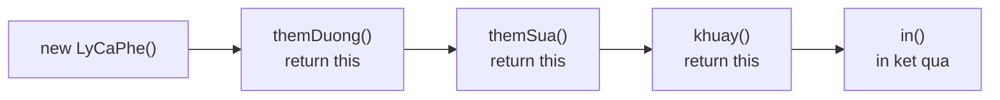

# Method Chaining (gọi chuỗi phương thức)

Method chaining là kỹ thuật gọi nhiều phương thức nối tiếp nhau trên cùng một dòng, ví dụ `doiTuong.a().b().c()`. Bí quyết là mỗi phương thức trả về `this` (chính đối tượng hiện tại) để có thể gọi tiếp, giúp code ngắn gọn và dễ đọc. Bài này giới thiệu cách trả về `this`, ví dụ với `StringBuilder` và Builder Pattern; phần chi tiết nằm bên dưới.

[](pathname:///img/java/method-chaining.webp)

---

:::note[Ghi nhớ nhanh]

- ⭐ **Bí quyết: mỗi phương thức `return this`** — trả về chính đối tượng hiện tại để gọi nối tiếp trên một dòng.
- **Kiểu trả về phải là chính lớp đó (hoặc Builder)** — nếu trả về `void` thì không chaining được.
- **`StringBuilder.append()` là ví dụ chaining trong thư viện chuẩn** — nhanh hơn nối chuỗi bằng `+` nhiều lần.
- **Builder Pattern dùng chaining để dựng đối tượng phức tạp từng bước** — kết thúc bằng `build()`, rõ hơn constructor nhiều tham số.

:::

---

## Mục lục

- [Vì sao có method chaining?](#vì-sao-có-method-chaining)
- [Method Chaining là gì?](#method-chaining-là-gì)
- [Trả về this để gọi liên tiếp](#trả-về-this-để-gọi-liên-tiếp)
- [So sánh cách viết thông thường và chaining](#so-sánh-cách-viết-thông-thường-và-chaining)
- [Ví dụ với StringBuilder](#ví-dụ-với-stringbuilder)
- [Builder Pattern cơ bản](#builder-pattern-cơ-bản)
- [Lỗi thường gặp](#lỗi-thường-gặp)
- [Tóm tắt](#tóm-tắt)
- [Câu hỏi phỏng vấn](#câu-hỏi-phỏng-vấn)

---

## Vì sao có method chaining?

**Vấn đề:** Cấu hình một đối tượng qua nhiều bước bằng các câu lệnh set rời rạc rất dài dòng, lặp đi lặp lại tên biến và khó đọc. Còn dồn hết vào constructor nhiều tham số thì khó nhớ thứ tự, dễ truyền nhầm.

```java
// Lặp tên biến "ly" ở mọi dòng, dài dòng
LyCaPhe ly = new LyCaPhe();
ly.themDuong();
ly.themSua();
ly.khuay();

// Constructor nhiều tham số: khó nhớ thứ tự, dễ nhầm
LyCaPhe ly2 = new LyCaPhe(true, true, true); // tham số nào là gì?
```

**Giải pháp:** Dùng **method chaining** (fluent interface — giao diện trôi chảy): mỗi phương thức trả về `this` (hoặc một Builder) để gọi nối tiếp ngay trên dòng. Đây là nền tảng của Builder Pattern và các fluent API. Code gọn, đọc như một câu văn và an toàn hơn constructor nhiều tham số.

```java
// Gọn gàng, đọc như một câu: thêm đường rồi thêm sữa rồi khuấy
LyCaPhe ly = new LyCaPhe()
    .themDuong()
    .themSua()
    .khuay();
```

:::tip[Dùng thực tế]

- **Builder Pattern**: dựng đối tượng phức tạp từng bước rõ ràng, kết thúc bằng `build()`.
- **Fluent API thư viện chuẩn**: `StringBuilder.append()`, `Stream` (`filter().map().collect()`), query builder.
- **Cấu hình nhiều bước**: thiết lập một đối tượng qua nhiều thuộc tính trên cùng một chuỗi gọi.
- **Code dễ đọc**: thể hiện rõ một chuỗi thao tác liên tục thay vì nhiều câu lệnh rời rạc.

:::

---

## Method Chaining là gì?

**Method Chaining** (gọi chuỗi phương thức — gọi nhiều phương thức nối tiếp nhau trên cùng một dòng) là kỹ thuật cho phép viết `doiTuong.a().b().c()` thay vì gọi từng phương thức riêng lẻ.

Ví dụ đời thường: khi pha cà phê bạn làm chuỗi việc liên tiếp — "lấy ly → cho cà phê → thêm đường → khuấy". Method chaining cho phép diễn đạt chuỗi hành động đó gọn gàng trên một dòng.

---

## Trả về this để gọi liên tiếp

Bí quyết của method chaining là: mỗi phương thức **trả về chính đối tượng hiện tại** bằng từ khóa `this` (con trỏ tới đối tượng đang gọi). Nhờ vậy ta có thể tiếp tục gọi phương thức khác ngay sau đó.

```java
public class LyCaPhe {
    String noiDung = "Ca phe";

    // Mỗi phương thức trả về this (chính đối tượng này)
    LyCaPhe themDuong() {
        noiDung += " + duong";
        return this; // Trả về chính nó để gọi tiếp
    }

    LyCaPhe themSua() {
        noiDung += " + sua";
        return this;
    }

    LyCaPhe khuay() {
        noiDung += " (da khuay)";
        return this;
    }

    void in() {
        System.out.println(noiDung);
    }
}
```

Sử dụng method chaining:

```java
public class Main {
    public static void main(String[] args) {
        LyCaPhe ly = new LyCaPhe();

        // Gọi chuỗi phương thức liên tiếp trên một dòng
        ly.themDuong().themSua().khuay().in();
        // Kết quả: Ca phe + duong + sua (da khuay)
    }
}
```

Điểm mấu chốt: kiểu trả về của phương thức phải là chính lớp đó (`LyCaPhe`), và câu lệnh cuối là `return this;`.

Sơ đồ luồng gọi chuỗi: mỗi phương thức trả về `this` nên có thể gọi tiếp phương thức kế tiếp trên cùng đối tượng:


```mermaid
flowchart LR
    A["new LyCaPhe()"] --> B["themDuong()<br/>return this"]
    B --> C["themSua()<br/>return this"]
    C --> D["khuay()<br/>return this"]
    D --> E["in()<br/>in ket qua"]
```

---

## So sánh cách viết thông thường và chaining

Không dùng chaining (dài dòng, lặp tên biến):

```java
LyCaPhe ly = new LyCaPhe();
ly.themDuong();
ly.themSua();
ly.khuay();
ly.in();
```

Dùng chaining (gọn gàng, dễ đọc):

```java
LyCaPhe ly = new LyCaPhe();
ly.themDuong().themSua().khuay().in();
```

Cả hai cho kết quả giống nhau, nhưng chaining ngắn gọn và thể hiện rõ "một chuỗi thao tác liên tục".

---

## Ví dụ với StringBuilder

`StringBuilder` (lớp dựng chuỗi — dùng để nối chuỗi hiệu quả) là ví dụ kinh điển về method chaining trong thư viện chuẩn của Java. Phương thức `append()` (nối thêm) trả về chính `StringBuilder`.

```java
public class Main {
    public static void main(String[] args) {
        // append() trả về chính StringBuilder nên gọi chuỗi được
        String ketQua = new StringBuilder()
            .append("Xin")
            .append(" chao")
            .append(" Java")
            .append("!")
            .toString(); // chuyển thành String

        System.out.println(ketQua); // Xin chao Java!
    }
}
```

So với việc nối chuỗi bằng `+` nhiều lần, `StringBuilder` nhanh hơn khi xử lý nhiều phần, và method chaining khiến code rất dễ đọc.

---

## Builder Pattern cơ bản

**Builder Pattern** (mẫu thiết kế "thợ xây" — cách tạo đối tượng phức tạp từng bước rõ ràng) là ứng dụng phổ biến của method chaining. Thay vì truyền cả đống tham số vào constructor, ta "xây" đối tượng từng phần.

```java
public class Pizza {
    String de;
    String phomai;
    boolean coNam;

    // Builder: lớp con bên trong giúp xây Pizza từng bước
    static class Builder {
        private Pizza pizza = new Pizza();

        Builder de(String de) {
            pizza.de = de;
            return this; // trả về Builder để gọi tiếp
        }

        Builder phomai(String phomai) {
            pizza.phomai = phomai;
            return this;
        }

        Builder themNam() {
            pizza.coNam = true;
            return this;
        }

        // build(): kết thúc chuỗi, trả về Pizza hoàn chỉnh
        Pizza build() {
            return pizza;
        }
    }
}
```

Sử dụng builder với method chaining:

```java
public class Main {
    public static void main(String[] args) {
        // Xây pizza từng bước, dễ đọc như đọc đơn đặt hàng
        Pizza pizza = new Pizza.Builder()
            .de("day mong")
            .phomai("mozzarella")
            .themNam()
            .build();

        System.out.println("De: " + pizza.de);
        System.out.println("Pho mai: " + pizza.phomai);
        System.out.println("Co nam: " + pizza.coNam);
    }
}
```

Cách viết này rõ ràng hơn nhiều so với `new Pizza("day mong", "mozzarella", true)` — bạn biết ngay tham số nào là gì.

---

## Lỗi thường gặp

- **Quên `return this;`**: nếu phương thức trả về `void`, bạn không thể gọi chuỗi tiếp.
- **Sai kiểu trả về**: phương thức phải trả về kiểu của chính lớp (hoặc Builder) để chaining hoạt động.
- **Quên gọi `build()`** trong builder pattern → bạn nhận về Builder chứ không phải đối tượng hoàn chỉnh.
- **Chuỗi quá dài khó đọc**: nên xuống dòng mỗi phương thức để dễ nhìn.
- **Nhầm `StringBuilder` với `String`**: `String` không thay đổi được (immutable), còn `StringBuilder` thay đổi nội dung bên trong.

---

## Tóm tắt

- **Method Chaining** gọi nhiều phương thức nối tiếp trên một dòng.
- Bí quyết: mỗi phương thức **trả về `this`** (chính đối tượng hiện tại).
- Giúp code ngắn gọn, dễ đọc, thể hiện rõ chuỗi thao tác.
- `StringBuilder.append()` là ví dụ chaining trong thư viện chuẩn.
- **Builder Pattern** dùng chaining để tạo đối tượng phức tạp từng bước, kết thúc bằng `build()`.

---

## Câu hỏi phỏng vấn

Những câu thường gặp về chủ đề này. Tự trả lời trước, rồi bấm **Xem đáp án** để đối chiếu.

**1. Bí quyết kỹ thuật khiến method chaining hoạt động được là gì?**

<details className="qa">
<summary>Xem đáp án</summary>

Mỗi phương thức trong chuỗi phải **trả về chính đối tượng hiện tại** bằng `return this;` (hoặc trả về một Builder). Vì kết quả trả về vẫn là cùng một đối tượng (hoặc builder) có đầy đủ các phương thức đó, ta có thể gọi tiếp phương thức khác ngay trên giá trị trả về, tạo thành chuỗi `obj.a().b().c()`.

</details>

**2. Vì sao một phương thức khai báo kiểu trả về `void` thì không thể tham gia method chaining?**

<details className="qa">
<summary>Xem đáp án</summary>

Vì `void` nghĩa là phương thức **không trả về giá trị nào**. Sau khi gọi một method `void`, biểu thức đó không còn "đối tượng" nào để gọi tiếp phương thức khác — trình biên dịch sẽ báo lỗi nếu bạn cố viết `obj.methodVoid().methodKhac()`. Muốn chaining, kiểu trả về phải là chính lớp đó (hoặc Builder/interface tương ứng).

</details>

**3. Method chaining và Builder Pattern có phải là một khái niệm không?**

<details className="qa">
<summary>Xem đáp án</summary>

**Không hoàn toàn.** Method chaining là một **kỹ thuật** (mỗi method `return this`), còn Builder Pattern là một **design pattern** ứng dụng kỹ thuật đó để giải quyết bài toán cụ thể: dựng một đối tượng phức tạp từng bước, thường qua một lớp `Builder` riêng, kết thúc bằng `build()`.

Nói cách khác: mọi Builder Pattern đều dùng method chaining, nhưng không phải mọi method chaining đều là Builder Pattern — ví dụ `StringBuilder.append()` chaining trên chính đối tượng, không có bước `build()` tách biệt.

</details>

**4. Vì sao `StringBuilder` nhanh hơn nối chuỗi bằng toán tử `+` nhiều lần trong vòng lặp?**

<details className="qa">
<summary>Xem đáp án</summary>

`String` trong Java là **bất biến** (immutable). Mỗi lần dùng `+` để nối, Java phải tạo ra một **chuỗi mới** hoàn toàn (sao chép lại toàn bộ nội dung cũ cộng thêm phần mới), gây lãng phí bộ nhớ và CPU nếu lặp nhiều lần.

`StringBuilder` dùng một **mảng ký tự nội bộ có thể thay đổi** (mutable buffer). Phương thức `append()` chỉ ghi thêm vào buffer đó (mở rộng khi cần), không tạo bản sao toàn bộ mỗi lần — vì vậy hiệu quả hơn nhiều khi nối chuỗi lặp lại, ví dụ trong vòng lặp `for`.

</details>

**5. Đọc code sau — vì sao dòng cuối gây lỗi biên dịch?**

```java
public class LyCaPhe {
    String noiDung = "";
    void themDuong() { noiDung += "duong"; }
    LyCaPhe themSua() { noiDung += " sua"; return this; }
}

LyCaPhe ly = new LyCaPhe();
ly.themDuong().themSua();
```

<details className="qa">
<summary>Xem đáp án</summary>

`themDuong()` khai báo kiểu trả về là `void` (không có `return this;`), nên `ly.themDuong()` không trả về giá trị nào để gọi tiếp `.themSua()` — trình biên dịch báo lỗi vì `void` không có phương thức `themSua()`. Cách sửa: đổi kiểu trả về của `themDuong()` thành `LyCaPhe` và thêm `return this;`.

</details>

**6. "Fluent API" là gì? Nêu một ví dụ trong thư viện chuẩn Java hiện đại (ngoài `StringBuilder`).**

<details className="qa">
<summary>Xem đáp án</summary>

**Fluent API** (giao diện trôi chảy) là cách thiết kế API sao cho lời gọi đọc tự nhiên như một câu văn, thường dựa trên method chaining.

Ví dụ điển hình: **Stream API** (Java 8+):

```java
List<String> ketQua = danhSach.stream()
    .filter(s -> s.length() > 3)
    .map(String::toUpperCase)
    .collect(Collectors.toList());
```

Mỗi bước (`filter`, `map`) trả về một `Stream` mới để gọi tiếp bước sau, đọc rất giống mô tả tuần tự "lọc rồi biến đổi rồi thu thập".

</details>

**7. Method chaining có nhược điểm gì khi debug hoặc đọc code?**

<details className="qa">
<summary>Xem đáp án</summary>

- **Khó đặt breakpoint/debug từng bước**: nhiều lời gọi nằm trên cùng một biểu thức, khó dừng lại kiểm tra giá trị trung gian sau mỗi bước như khi tách thành từng dòng riêng.
- **Stack trace khó đọc**: nếu một bước giữa chuỗi ném exception, thông báo lỗi có thể chỉ trỏ tới đúng một dòng dài chứa nhiều lời gọi, khó biết bước nào gây lỗi.
- **Chuỗi quá dài gây khó đọc**: nếu nhồi quá nhiều bước trên một dòng thay vì xuống dòng hợp lý, code trở nên rối mắt.

Giải pháp thực hành: xuống dòng mỗi phương thức trong chuỗi, và với logic phức tạp nên tách thành các bước rõ ràng hơn là chaining quá dài.

</details>

**8. Tình huống: bạn thiết kế `HttpRequestBuilder` dùng method chaining để cấu hình URL, header, body rồi gọi `build()`. Builder này nên mutable (tự sửa state bên trong) hay immutable (mỗi bước trả về bản sao mới)? Đánh đổi là gì?**

<details className="qa">
<summary>Xem đáp án</summary>

Cả hai cách đều được dùng thực tế, tùy đánh đổi:

- **Builder mutable** (mỗi method sửa field nội bộ rồi `return this;`): đơn giản, tiết kiệm bộ nhớ, là cách phổ biến nhất (giống ví dụ `Pizza.Builder` trong bài). Rủi ro: nếu builder được **tái sử dụng** hoặc chia sẻ giữa nhiều luồng (thread), việc sửa state chung có thể gây tranh chấp dữ liệu (race condition) hoặc lỗi khó lường nếu gọi `build()` nhiều lần với ý định độc lập.
- **Builder immutable** (mỗi method trả về **bản builder mới** với state đã cập nhật, không sửa builder gốc): an toàn hơn khi chia sẻ giữa nhiều thread hoặc muốn tái sử dụng một builder gốc làm "khuôn" rồi tạo nhiều biến thể khác nhau từ nó, nhưng tốn thêm bộ nhớ vì tạo nhiều đối tượng trung gian.

Với `HttpRequestBuilder` dùng trong một luồng, xây một request rồi bỏ đi — mutable đơn giản và đủ dùng. Nếu builder được giữ lại làm template dùng chung nhiều nơi, nên cân nhắc immutable để tránh side-effect ngoài ý muốn.

</details>
