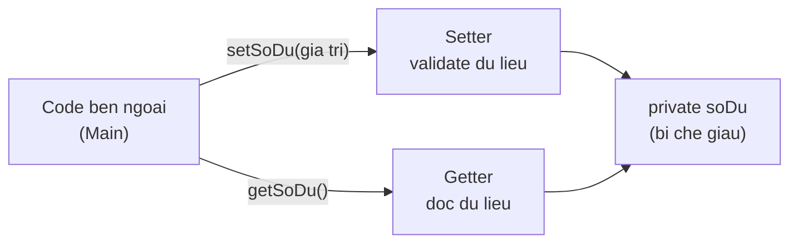

# Đóng gói (Encapsulation)

Đóng gói là nguyên tắc che giấu dữ liệu bên trong đối tượng và chỉ cho phép truy cập qua các phương thức được kiểm soát. Nhờ giấu thuộc tính bằng `private` và cho đọc/ghi qua getter/setter, bạn bảo vệ được dữ liệu khỏi bị sửa tùy tiện và dễ thay đổi cách lưu trữ sau này. Bài này hướng dẫn dùng `private`, getter/setter và validation; phần chi tiết nằm bên dưới.

---

## Mục lục

- [Vì sao có đóng gói (encapsulation)?](#vì-sao-có-đóng-gói-encapsulation)
- [Đóng gói là gì?](#đóng-gói-là-gì)
- [private — che giấu dữ liệu](#private--che-giấu-dữ-liệu)
- [Getter và Setter](#getter-và-setter)
- [Lợi ích bảo vệ dữ liệu](#lợi-ích-bảo-vệ-dữ-liệu)
- [Validation trong setter](#validation-trong-setter)
- [Quy ước đặt tên getter/setter](#quy-ước-đặt-tên-gettersetter)
- [Lỗi thường gặp](#lỗi-thường-gặp)
- [Tóm tắt](#tóm-tắt)

---

## Vì sao có đóng gói (encapsulation)?

**Vấn đề:** nếu để thuộc tính `public` cho sửa trực tiếp, bất kỳ ai cũng có thể đặt giá trị phi logic, phá vỡ tính nhất quán (bất biến) của đối tượng. Hơn nữa, code bên ngoài phụ thuộc thẳng vào cấu trúc field — đổi field là vỡ.

```java
public class TaiKhoan {
    public double soDu;      // ai cũng sửa được
    public int tuoiChuTK;
    public String email;
}

public class Main {
    public static void main(String[] args) {
        TaiKhoan tk = new TaiKhoan();
        tk.soDu = -500000;   // số dư ÂM — phi logic!
        tk.tuoiChuTK = -3;   // tuổi ÂM — phi logic!
        tk.email = "";       // email RỖNG — phi logic!
        // Đối tượng rơi vào trạng thái sai mà không gì ngăn được
    }
}
```

**Giải pháp:** đóng gói — để field `private`, chỉ cho truy cập qua getter/setter (hoặc phương thức nghiệp vụ) để **kiểm soát** và **validate** mọi thay đổi. Ẩn chi tiết cài đặt giúp bạn tự do refactor bên trong mà không vỡ API bên ngoài, đồng thời bảo vệ trạng thái luôn nhất quán.

```java
public class TaiKhoan {
    private double soDu;
    private int tuoiChuTK;
    private String email;

    public double getSoDu() { return soDu; }

    // Setter validate: chặn giá trị phi logic ngay tại cửa ngõ
    public void setSoDu(double soDu) {
        if (soDu < 0) {
            throw new IllegalArgumentException("So du khong duoc am");
        }
        this.soDu = soDu;
    }

    public void setTuoiChuTK(int tuoi) {
        if (tuoi < 0) {
            throw new IllegalArgumentException("Tuoi khong duoc am");
        }
        this.tuoiChuTK = tuoi;
    }

    public void setEmail(String email) {
        if (email == null || email.isEmpty()) {
            throw new IllegalArgumentException("Email khong duoc rong");
        }
        this.email = email;
    }
}
```

:::tip[Dùng thực tế]
- **Setter validate**: chặn giá trị sai như giá < 0, tuổi âm, email rỗng — dữ liệu luôn hợp lệ.
- **Tính toán qua getter**: suy ra giá trị (như độ F từ độ C) thay vì lưu dư thừa và dễ lệch.
- **Ẩn cấu trúc nội bộ**: bên ngoài không biết bạn lưu dữ liệu thế nào, chỉ gọi getter/setter.
- **Đổi cài đặt mà giữ API**: refactor cách lưu trữ bên trong nhưng getter/setter không đổi → không ai bị vỡ.
:::

---

## Đóng gói là gì?

**Đóng gói** (encapsulation — che giấu dữ liệu bên trong đối tượng và chỉ cho truy cập qua phương thức được kiểm soát) là một trong những nguyên tắc cốt lõi của OOP.

Ví dụ đời thường: chiếc máy ATM. Bạn không được tự ý thò tay vào trong rút tiền — bạn phải dùng đúng quy trình (nhập thẻ, nhập mã PIN, chọn số tiền). Bên trong máy "che giấu" tiền và logic, chỉ cho bạn tương tác qua các nút bấm được kiểm soát.

Đóng gói trong Java làm tương tự: giấu thuộc tính bằng `private`, cho phép truy cập qua **getter** (hàm đọc) và **setter** (hàm ghi).

---

## private — che giấu dữ liệu

**private** (từ khóa giới hạn truy cập — chỉ cho phép dùng bên trong chính lớp đó) khiến thuộc tính không thể truy cập trực tiếp từ bên ngoài.

```java
public class TaiKhoan {
    // private: chỉ bên trong lớp TaiKhoan mới truy cập trực tiếp
    private double soDu;
    private String chuTaiKhoan;
}
```

Thử truy cập từ bên ngoài sẽ bị chặn:

```java
public class Main {
    public static void main(String[] args) {
        TaiKhoan tk = new TaiKhoan();

        // LỖI: không thể truy cập trực tiếp thuộc tính private
        // tk.soDu = 1000000; // SAI!
        // System.out.println(tk.soDu); // SAI!
    }
}
```

Việc này ngăn người khác sửa dữ liệu một cách tùy tiện, ví dụ gán số dư âm.

---

## Getter và Setter

Để cho phép truy cập có kiểm soát, ta cung cấp:

- **Getter** (hàm lấy giá trị — đọc dữ liệu): thường tên `getTenThuocTinh()`.
- **Setter** (hàm đặt giá trị — ghi dữ liệu): thường tên `setTenThuocTinh(giaTri)`.

```java
public class TaiKhoan {
    private double soDu;
    private String chuTaiKhoan;

    // Getter: cho phép ĐỌC số dư
    public double getSoDu() {
        return soDu;
    }

    // Setter: cho phép GHI số dư
    public void setSoDu(double soDu) {
        this.soDu = soDu;
    }

    public String getChuTaiKhoan() {
        return chuTaiKhoan;
    }

    public void setChuTaiKhoan(String chuTaiKhoan) {
        this.chuTaiKhoan = chuTaiKhoan;
    }
}
```

Sử dụng qua getter/setter:

```java
public class Main {
    public static void main(String[] args) {
        TaiKhoan tk = new TaiKhoan();
        tk.setChuTaiKhoan("Nguyen Van A"); // ghi qua setter
        tk.setSoDu(500000);                // ghi qua setter

        System.out.println(tk.getChuTaiKhoan()); // đọc qua getter
        System.out.println(tk.getSoDu());        // đọc qua getter
    }
}
```

Sơ đồ minh hoạ truy cập có kiểm soát: code bên ngoài không đụng thẳng field `private`, mọi thao tác đọc/ghi phải đi qua getter/setter:



---

## Lợi ích bảo vệ dữ liệu

Tại sao phải rườm rà như vậy thay vì để `public`? Vì đóng gói mang lại:

1. **Kiểm soát**: bạn quyết định cho ai đọc, ai ghi (có thể chỉ làm getter mà không có setter → thuộc tính chỉ đọc).
2. **Bảo vệ dữ liệu**: chặn các giá trị không hợp lệ qua setter.
3. **Dễ thay đổi sau này**: nếu đổi cách lưu trữ bên trong, bên ngoài không bị ảnh hưởng vì họ chỉ dùng getter/setter.

```java
public class NhietDo {
    private double celsius; // chỉ lưu độ C bên trong

    public double getCelsius() { return celsius; }
    public void setCelsius(double c) { this.celsius = c; }

    // Getter "tính toán": độ F suy ra từ độ C, không cần lưu riêng
    public double getFahrenheit() {
        return celsius * 9 / 5 + 32;
    }
}
```

Bên ngoài chỉ thấy `getFahrenheit()`, không cần biết bên trong chỉ lưu độ C.

---

## Validation trong setter

**Validation** (kiểm tra hợp lệ — đảm bảo dữ liệu đầu vào đúng quy tắc) là lợi ích lớn nhất của setter. Bạn chặn giá trị sai ngay tại cửa ngõ.

```java
public class TaiKhoan {
    private double soDu;

    public double getSoDu() {
        return soDu;
    }

    // Setter có kiểm tra: không cho số dư âm
    public void setSoDu(double soDu) {
        if (soDu < 0) {
            // Báo lỗi rõ ràng thay vì lưu dữ liệu sai
            throw new IllegalArgumentException("So du khong duoc am");
        }
        this.soDu = soDu;
    }

    // Phương thức nghiệp vụ: rút tiền có kiểm tra
    public void rutTien(double soTien) {
        if (soTien <= 0) {
            throw new IllegalArgumentException("So tien rut phai duong");
        }
        if (soTien > soDu) {
            throw new IllegalArgumentException("So du khong du");
        }
        soDu -= soTien;
    }
}
```

Nhờ validation, dữ liệu bên trong luôn ở trạng thái hợp lệ — không bao giờ có số dư âm.

```java
public class Main {
    public static void main(String[] args) {
        TaiKhoan tk = new TaiKhoan();
        tk.setSoDu(100000);  // OK

        // tk.setSoDu(-50000); // Ném lỗi: So du khong duoc am
    }
}
```

---

## Quy ước đặt tên getter/setter

Java có quy ước (convention) chuẩn cho getter/setter, gọi là **JavaBeans**:

- Getter: `get` + tên thuộc tính viết hoa chữ đầu. Ví dụ `soDu` → `getSoDu()`.
- Setter: `set` + tên thuộc tính viết hoa chữ đầu. Ví dụ `soDu` → `setSoDu(...)`.
- Với kiểu `boolean`: getter thường dùng `is`. Ví dụ `kichHoat` → `isKichHoat()`.

```java
public class NguoiDung {
    private boolean kichHoat;

    // boolean dùng "is" thay vì "get"
    public boolean isKichHoat() {
        return kichHoat;
    }

    public void setKichHoat(boolean kichHoat) {
        this.kichHoat = kichHoat;
    }
}
```

Tuân theo quy ước này giúp nhiều thư viện và công cụ Java tự động nhận diện getter/setter.

---

## Lỗi thường gặp

- **Để thuộc tính `public`**: phá vỡ đóng gói, ai cũng sửa được tùy tiện.
- **Setter không validate**: cho phép lưu dữ liệu sai (như số dư âm).
- **Nhầm tên getter/setter** so với quy ước → công cụ tự động không nhận ra.
- **Quên `this.`** trong setter khi tên tham số trùng tên thuộc tính → gán nhầm biến với chính nó.
- **Lạm dụng getter/setter cho mọi thứ**: đôi khi nên cung cấp phương thức nghiệp vụ (như `rutTien`) thay vì để bên ngoài tự thao tác.

---

## Tóm tắt

- **Đóng gói** che giấu dữ liệu và chỉ cho truy cập qua phương thức kiểm soát.
- Dùng `private` để giấu thuộc tính khỏi bên ngoài.
- **Getter** để đọc, **setter** để ghi dữ liệu.
- Lợi ích: kiểm soát truy cập, **bảo vệ dữ liệu**, dễ thay đổi sau này.
- **Validation** trong setter chặn dữ liệu không hợp lệ ngay từ đầu.
- Tuân theo quy ước đặt tên JavaBeans (`get`/`set`/`is`).
