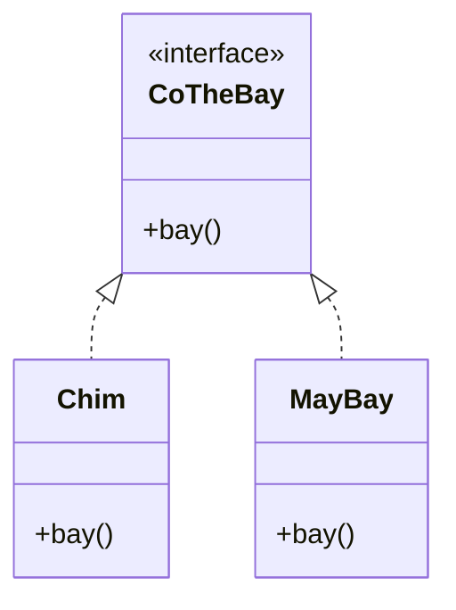
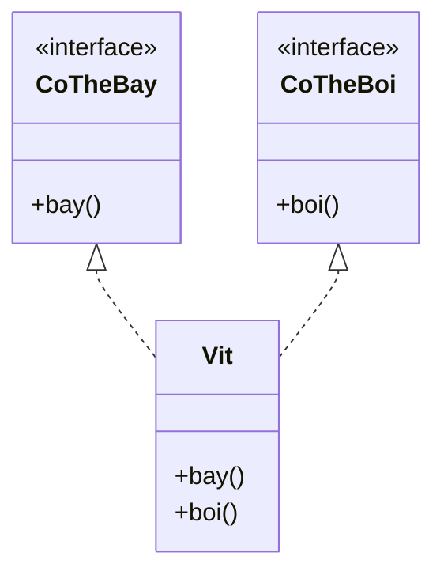

# Interfaces

Interface là một "hợp đồng" liệt kê các phương thức mà một lớp cam kết sẽ có, mô tả "lớp làm được những gì" mà không nói "làm thế nào". Một lớp dùng `implements` để triển khai interface và có thể triển khai nhiều interface cùng lúc, đạt được đa kế thừa hành vi. Bài này giới thiệu `implements`, default method, static method và sự khác nhau giữa interface với abstract class; phần chi tiết nằm bên dưới.

[](pathname:///img/java/interfaces.webp)

---

:::note[Ghi nhớ nhanh]

- ⭐ **Interface là "hợp đồng" liệt kê method lớp phải có** — mô tả "làm được gì", không nói "làm thế nào"; dùng `implements`.
- ⭐ **Một lớp có thể `implements` nhiều interface** — đạt đa kế thừa *hành vi* (điều kế thừa lớp không làm được).
- **`default method` có sẵn thân, `static method` gọi qua tên interface** (từ Java 8) — thêm tính năng mà không phá lớp cũ.
- **Khác abstract class** — interface không có thuộc tính thường (chỉ hằng `public static final`) và không có constructor.
- **Lập trình theo interface = dễ thay cài đặt, dễ mock khi test** — nền tảng của Dependency Injection.

:::

---

## Mục lục

- [Vì sao có interface?](#vì-sao-có-interface)
- [Interface là gì?](#interface-là-gì)
- [implements — triển khai interface](#implements--triển-khai-interface)
- [Interface như một hợp đồng](#interface-như-một-hợp-đồng)
- [Default method — phương thức mặc định](#default-method--phương-thức-mặc-định)
- [Static method trong interface](#static-method-trong-interface)
- [Đa kế thừa hành vi](#đa-kế-thừa-hành-vi)
- [Interface khác abstract class thế nào?](#interface-khác-abstract-class-thế-nào)
- [Lỗi thường gặp](#lỗi-thường-gặp)
- [Tóm tắt](#tóm-tắt)
- [Câu hỏi phỏng vấn](#câu-hỏi-phỏng-vấn)

---

## Vì sao có interface?

**Vấn đề:** Java **không** cho một lớp kế thừa nhiều lớp (đa kế thừa class) để tránh nhập nhằng khi hai lớp cha có cùng phương thức. Nhưng nhiều lớp **không liên quan** lại cần **cùng một khả năng** (so sánh được, vẽ được, chạy được). Nếu code nghiệp vụ phụ thuộc trực tiếp vào lớp cụ thể, việc đổi cài đặt hay viết test sẽ rất khó (coupling chặt).

```java
// MySqlRepository và MongoRepository không họ hàng, nhưng đều cần "lưu được"
public class MySqlRepository {
    public void luu(String data) { System.out.println("Luu vao MySQL"); }
}

public class DichVuDonHang {
    // Phụ thuộc CỨNG vào lớp cụ thể → muốn đổi sang Mongo phải sửa code
    private MySqlRepository repo = new MySqlRepository();

    public void xuLy(String data) { repo.luu(data); }
}
```

**Giải pháp:** **Interface** định nghĩa một **hợp đồng** (contract) — "làm được gì" mà không nói "làm thế nào". Một lớp có thể `implements` nhiều interface (đa kế thừa **hành vi**), và code nghiệp vụ lập trình theo abstraction nên dễ thay cài đặt, dễ mock khi test (nền tảng của Dependency Injection).

```java
// Hợp đồng "lưu được", không quan tâm lưu ở đâu
public interface Repository {
    void luu(String data);
}

public class MySqlRepository implements Repository {
    @Override
    public void luu(String data) { System.out.println("Luu vao MySQL"); }
}

public class MongoRepository implements Repository {
    @Override
    public void luu(String data) { System.out.println("Luu vao Mongo"); }
}

public class DichVuDonHang {
    // Phụ thuộc vào abstraction → truyền cài đặt nào cũng được
    private final Repository repo;

    public DichVuDonHang(Repository repo) { this.repo = repo; }

    public void xuLy(String data) { repo.luu(data); }
}
```

:::tip[Dùng thực tế]

- **`Comparable` / `Runnable`**: lớp bất kỳ `implements Comparable` là sắp xếp được; `implements Runnable` là chạy được trên thread — dùng chung cơ chế sẵn có của Java.
- **Đổi cài đặt repository**: chuyển từ MySQL sang Mongo chỉ cần truyền cài đặt khác, không sửa code nghiệp vụ.
- **Mock service khi test**: tạo cài đặt giả của interface để test nhanh, không cần database hay mạng thật.
- **Plugin / Strategy**: định nghĩa hành vi qua interface rồi cắm thuật toán/plugin khác nhau vào lúc chạy.

:::

---

## Interface là gì?

**Interface** (giao diện / hợp đồng — bản danh sách các phương thức mà một lớp cam kết sẽ có) định nghĩa "lớp phải làm được những gì" mà không nói "làm thế nào".

Ví dụ đời thường: ổ cắm điện. Bất kỳ thiết bị nào có phích cắm đúng chuẩn đều cắm vào được — quạt, đèn, sạc điện thoại. Ổ cắm là một "interface": nó quy định hình dạng phích, còn thiết bị bên trong làm gì là việc của thiết bị.

```java
// Khai báo interface với từ khóa interface
public interface CoTheBay {
    // Phương thức trong interface mặc định không có thân
    void bay();
}
```

---

## implements — triển khai interface

Một lớp dùng từ khóa `implements` (triển khai) để cam kết thực hiện interface. Lớp đó **bắt buộc** phải viết thân cho mọi phương thức của interface.

```java
public interface CoTheBay {
    void bay();
}

// Chim "ký hợp đồng" CoTheBay
public class Chim implements CoTheBay {
    @Override
    public void bay() {
        System.out.println("Chim bay bang canh");
    }
}

// MayBay cũng "ký hợp đồng" CoTheBay, nhưng làm khác
public class MayBay implements CoTheBay {
    @Override
    public void bay() {
        System.out.println("May bay bay bang dong co");
    }
}
```

Sử dụng:

```java
public class Main {
    public static void main(String[] args) {
        // Dùng kiểu interface để chứa mọi thứ "biết bay"
        CoTheBay[] danhSach = { new Chim(), new MayBay() };

        for (CoTheBay vat : danhSach) {
            vat.bay();
        }
        // Chim bay bang canh
        // May bay bay bang dong co
    }
}
```

Sơ đồ minh hoạ interface `CoTheBay` được nhiều lớp không họ hàng cùng triển khai (mũi tên nét đứt thể hiện quan hệ `implements`):



---

## Interface như một hợp đồng

Hãy nghĩ interface là một **hợp đồng** (contract): "Nếu bạn implements tôi, bạn cam kết có đủ các phương thức tôi liệt kê." Java sẽ kiểm tra và báo lỗi nếu lớp thiếu phương thức.

```java
public interface ThietBiDien {
    void bat();
    void tat();
}

// Lớp này PHẢI có cả bat() và tat(), nếu thiếu sẽ lỗi
public class Quat implements ThietBiDien {
    @Override
    public void bat() { System.out.println("Quat chay"); }

    @Override
    public void tat() { System.out.println("Quat dung"); }
}
```

---

## Default method — phương thức mặc định

Từ Java 8, interface có thể chứa **default method** (phương thức mặc định — phương thức có sẵn phần thân trong interface). Lớp triển khai không bắt buộc viết lại.

```java
public interface ThietBiDien {
    void bat();
    void tat();

    // default: có sẵn thân, lớp con dùng luôn nếu muốn
    default void khoiDongLai() {
        tat();
        bat();
        System.out.println("Da khoi dong lai");
    }
}

public class Quat implements ThietBiDien {
    @Override
    public void bat() { System.out.println("Quat chay"); }

    @Override
    public void tat() { System.out.println("Quat dung"); }
    // Không cần viết khoiDongLai(), dùng default có sẵn
}
```

Default method giúp thêm tính năng mới vào interface mà không làm hỏng các lớp đã triển khai từ trước.

---

## Static method trong interface

Interface cũng có thể chứa **static method** (phương thức tĩnh — gọi qua tên interface, không cần đối tượng).

```java
public interface MayTinh {
    int tinh(int a, int b);

    // static method: tiện ích chung, gọi qua tên interface
    static MayTinh tao() {
        return (a, b) -> a + b; // trả về một phép cộng
    }
}

public class Main {
    public static void main(String[] args) {
        // Gọi static method qua tên interface
        MayTinh cong = MayTinh.tao();
        System.out.println(cong.tinh(3, 4)); // 7
    }
}
```

---

## Đa kế thừa hành vi

Khác với kế thừa lớp (chỉ một lớp cha), một lớp có thể implements **nhiều interface** cùng lúc. Đây gọi là **đa kế thừa hành vi** (multiple inheritance of behavior).

```java
public interface CoTheBay {
    void bay();
}

public interface CoTheBoi {
    void boi();
}

// Vịt vừa biết bay vừa biết bơi
public class Vit implements CoTheBay, CoTheBoi {
    @Override
    public void bay() { System.out.println("Vit bay"); }

    @Override
    public void boi() { System.out.println("Vit boi"); }
}
```

Nhờ vậy, một đối tượng có thể đóng nhiều "vai trò" khác nhau. Sơ đồ dưới minh hoạ `Vit` triển khai cùng lúc hai interface — điều mà kế thừa lớp không làm được:



---

## Interface khác abstract class thế nào?

| Đặc điểm | Interface | Abstract class |
|----------|-----------|----------------|
| Từ khóa dùng | `implements` | `extends` |
| Số lượng được kế thừa/triển khai | Nhiều interface | Chỉ một lớp cha |
| Thuộc tính (biến thường) | Không (chỉ hằng số) | Có |
| Constructor | Không | Có |
| Phương thức có thân | default / static | Có method thường |
| Mục đích | Định nghĩa hành vi (làm được gì) | Khuôn mẫu chung kèm dữ liệu |

Quy tắc chọn nhanh:

- Cần mô tả **"có thể làm gì"** và muốn nhiều lớp không liên quan cùng dùng → **interface**.
- Cần chia sẻ **dữ liệu và code chung** giữa các lớp có quan hệ "is-a" → **abstract class**.

---

## Lỗi thường gặp

- **Quên viết thân cho phương thức của interface** trong lớp triển khai → lỗi biên dịch.
- **Quên `public`** trên phương thức triển khai: phương thức interface mặc định là `public`.
- **Tưởng interface có thuộc tính thường**: biến trong interface luôn là hằng số `public static final`.
- **Nhầm `extends` với `implements`**: lớp `implements` interface, `extends` lớp khác.
- **Tạo đối tượng từ interface bằng `new`**: không được, interface không phải lớp cụ thể.

---

## Tóm tắt

- **Interface** là "hợp đồng" liệt kê các phương thức lớp phải có.
- Dùng `implements` để triển khai; lớp bắt buộc viết thân cho các phương thức.
- **Default method** có sẵn thân; **static method** gọi qua tên interface.
- Một lớp có thể implements **nhiều interface** → đa kế thừa hành vi.
- Interface khác abstract class: không có thuộc tính thường/constructor, nhưng cho phép triển khai nhiều cùng lúc.

---

## Câu hỏi phỏng vấn

Những câu thường gặp về chủ đề này. Tự trả lời trước, rồi bấm **Xem đáp án** để đối chiếu.

**1. Điểm khác biệt cốt lõi giữa interface và class thường là gì?**

<details className="qa">
<summary>Xem đáp án</summary>

Class thường mô tả **cả dữ liệu lẫn cài đặt cụ thể** — bạn `new` được để tạo đối tượng thật sự chạy được ngay. Interface chỉ mô tả một **hợp đồng (contract)**: liệt kê "phải làm được gì" mà (thường) không nói "làm thế nào" — không `new` trực tiếp được, phải có một lớp `implements` nó và cung cấp phần cài đặt. Nói cách khác, interface tách biệt hoàn toàn phần **khai báo hành vi** khỏi phần **cài đặt**, giúp code phụ thuộc vào abstraction thay vì cài đặt cụ thể.

</details>

**2. Vì sao một lớp Java `implements` được nhiều interface cùng lúc, nhưng chỉ `extends` được một lớp cha?**

<details className="qa">
<summary>Xem đáp án</summary>

Kế thừa nhiều lớp cha (đa kế thừa **implementation**) dễ gây nhập nhằng khi hai lớp cha có field hoặc method cùng tên với cài đặt khác nhau — Java tránh vấn đề này bằng kế thừa đơn cho class.

Interface truyền thống (trước Java 8) chỉ khai báo method **không có thân**, nên nhiều interface trùng tên method cũng không gây nhập nhằng gì — lớp implement chỉ cần viết **một** phần thân cho method đó là thỏa mãn tất cả interface cùng lúc. Từ Java 8 có `default method` (có thân), Java xử lý xung đột bằng cách **bắt buộc lớp phải override tường minh** nếu hai interface có `default method` trùng chữ ký (xem câu 4).

</details>

**3. `default method` (Java 8+) ra đời để giải quyết vấn đề gì trong thực tế?**

<details className="qa">
<summary>Xem đáp án</summary>

Trước Java 8, thêm một method mới vào interface sẽ làm **hỏng (không biên dịch được)** mọi lớp đã `implements` interface đó trước kia, vì chúng chưa cài đặt method mới. Đây là vấn đề lớn với các interface cốt lõi như `Collection`, `Iterable` được hàng triệu lớp implement trong hệ sinh thái Java.

`default method` cho phép thêm method **có sẵn phần thân** vào interface — các lớp cũ **không bắt buộc** override, tự động dùng cài đặt mặc định, vẫn biên dịch bình thường. Đây chính là cách Oracle thêm `stream()`, `forEach()` vào `Collection`/`Iterable` ở Java 8 mà không phá vỡ code cũ.

</details>

**4. Một lớp `implements` hai interface, cả hai đều có `default method` trùng tên và trùng tham số. Điều gì xảy ra?**

<details className="qa">
<summary>Xem đáp án</summary>

**Lỗi biên dịch** nếu lớp không tự xử lý. Java không tự động chọn cài đặt của interface nào (tránh nhập nhằng — đây chính là "diamond problem" phiên bản default method), nên **bắt buộc** lớp implement phải **override tường minh** phương thức đó:

```java
interface A { default void hello() { System.out.println("A"); } }
interface B { default void hello() { System.out.println("B"); } }

class C implements A, B {
    @Override
    public void hello() {
        A.super.hello(); // có thể gọi tường minh cài đặt của một interface cụ thể
    }
}
```

Cú pháp `TenInterface.super.method()` cho phép gọi rõ ràng cài đặt mặc định của interface nào bạn muốn.

</details>

**5. `static method` trong interface dùng để làm gì? Cho ví dụ trong thư viện chuẩn Java.**

<details className="qa">
<summary>Xem đáp án</summary>

`static method` trong interface cung cấp các **phương thức tiện ích liên quan trực tiếp** tới interface đó, gọi qua tên interface, không cần tạo đối tượng nào cả — thường dùng làm **factory method** (phương thức tạo đối tượng).

Ví dụ trong thư viện chuẩn: `List.of(1, 2, 3)`, `Comparator.comparing(NguoiDung::getTen)`, `Stream.of(...)` — đây đều là static method khai báo ngay trong interface (`List`, `Comparator`, `Stream`), giúp gom logic tạo/tiện ích liên quan về đúng chỗ interface đó thay vì để rải rác ở một lớp utility khác.

</details>

**6. Java 9 bổ sung `private method` cho interface. Mục đích của nó là gì?**

<details className="qa">
<summary>Xem đáp án</summary>

`private method` trong interface (Java 9+) dùng để **tái sử dụng code chung giữa các `default method`** trong cùng interface đó, mà **không lộ ra ngoài** cho lớp implement:

```java
interface Bao {
    default void tomTat() {
        String tt = chuanBiTomTat(); // gọi private method dùng chung
        System.out.println(tt);
    }
    default void inChiTiet() {
        System.out.println(chuanBiTomTat() + " - chi tiet");
    }
    private String chuanBiTomTat() { // chỉ dùng nội bộ interface, tránh lặp code
        return "Tom tat noi dung";
    }
}
```

Trước Java 9, nếu muốn tái dùng logic chung giữa các default method, bạn buộc phải để nó là một default method khác (vô tình lộ ra `public`) — `private method` giải quyết đúng vấn đề đó.

</details>

**7. "Functional interface" là gì? Liên hệ với lambda expression như thế nào?**

<details className="qa">
<summary>Xem đáp án</summary>

**Functional interface** (giao diện hàm) là interface chỉ có **đúng một** abstract method (có thể có thêm default/static method). Java cho phép dùng **lambda expression** hoặc **method reference** để tạo cài đặt của functional interface một cách ngắn gọn, không cần viết hẳn một lớp implement.

Ví dụ: `Runnable` (chỉ có `run()`), `Comparator<T>` (chỉ có `compare()`):

```java
Runnable r = () -> System.out.println("Chay!"); // lambda thay cho implements Runnable
Comparator<String> cmp = (a, b) -> a.length() - b.length();
```

Annotation `@FunctionalInterface` không bắt buộc nhưng nên dùng — compiler sẽ báo lỗi nếu ai đó vô tình thêm abstract method thứ hai, phá vỡ tính "functional" của interface.

</details>

**8. Đọc code sau — biến `MAX` trong interface có thể bị lớp implement gán lại giá trị khác không? Vì sao?**

```java
interface CauHinh {
    int MAX = 100;
}

class ApDung implements CauHinh {
    void thayDoi() {
        MAX = 200; // dòng này thế nào?
    }
}
```

<details className="qa">
<summary>Xem đáp án</summary>

**Lỗi biên dịch.** Mọi biến khai báo trong interface đều **ngầm định** là `public static final` — tức là **hằng số**, dù bạn không viết tường minh các từ khóa đó. Vì `final`, giá trị chỉ được gán một lần lúc khai báo và **không thể gán lại** ở bất kỳ đâu, kể cả trong lớp implement. Dòng `MAX = 200;` sẽ báo lỗi "cannot assign a value to final variable MAX".

</details>

**9. Vì sao "lập trình theo interface" (programming to an interface) giúp việc viết unit test và mock dễ dàng hơn?**

<details className="qa">
<summary>Xem đáp án</summary>

Khi code nghiệp vụ phụ thuộc vào **interface** (`Repository`) thay vì lớp cụ thể (`MySqlRepository`), bạn có thể truyền vào một **cài đặt giả (mock/stub)** của interface đó khi test, mà không cần dựng database hay gọi mạng thật:

```java
class RepositoryGia implements Repository {
    public void luu(String data) { /* không làm gì, chỉ để test */ }
}

DichVuDonHang dv = new DichVuDonHang(new RepositoryGia());
```

Đây chính là nền tảng của **Dependency Injection**: constructor hoặc setter nhận vào kiểu interface, còn việc "cài đặt cụ thể nào được truyền vào" được quyết định từ bên ngoài (có thể là framework như Spring, hoặc thủ công trong test). Nếu code phụ thuộc thẳng vào lớp cụ thể, test buộc phải dùng đúng cài đặt thật đó, khó cô lập và chạy chậm hơn.

</details>

**10. So sánh nhanh: interface có thể có trạng thái (state) thực sự không? Vì sao điều này quan trọng khi migrate một class thành interface?**

<details className="qa">
<summary>Xem đáp án</summary>

**Không.** Interface chỉ có hằng số `public static final` (không đổi được), không có field thường để lưu trạng thái riêng cho mỗi đối tượng. Đây là khác biệt quan trọng so với abstract class (có thể có field thường + constructor).

Hệ quả khi thiết kế: nếu bạn định chuyển một `abstract class` đang lưu trạng thái chung (ví dụ bộ đếm, cache) thành `interface`, bạn **sẽ mất khả năng lưu state đó** — buộc phải đẩy trạng thái xuống từng lớp implement tự quản lý, hoặc giữ nguyên là abstract class nếu bắt buộc cần chia sẻ state.

</details>

**11. Tình huống: bạn thiết kế hệ thống thanh toán hỗ trợ nhiều cổng (Momo, VNPay, Stripe), có thể thêm cổng mới trong tương lai mà không sửa code xử lý đơn hàng. Bạn dùng interface thế nào? Đây có phải là Strategy pattern không?**

<details className="qa">
<summary>Xem đáp án</summary>

Định nghĩa một interface hợp đồng chung, ví dụ:

```java
interface CongThanhToan {
    KetQua thanhToan(DonHang don);
}

class MomoGateway implements CongThanhToan { /* cài đặt riêng cho Momo */ }
class VnPayGateway implements CongThanhToan { /* cài đặt riêng cho VNPay */ }
```

Lớp xử lý đơn hàng chỉ phụ thuộc vào `CongThanhToan` (interface), nhận cài đặt cụ thể qua constructor (Dependency Injection):

```java
class XuLyDonHang {
    private final CongThanhToan cong;
    XuLyDonHang(CongThanhToan cong) { this.cong = cong; }
    void xuLy(DonHang don) { cong.thanhToan(don); }
}
```

**Đúng, đây chính là Strategy pattern** (mẫu chiến lược): mỗi cài đặt interface là một "chiến lược" thanh toán khác nhau, có thể **hoán đổi lúc chạy** mà không đụng vào `XuLyDonHang`. Thêm cổng thanh toán mới (ví dụ Stripe) chỉ cần viết thêm một lớp `implements CongThanhToan`, không sửa code xử lý đơn hàng đã có — đúng nguyên lý Open/Closed (mở để mở rộng, đóng để sửa đổi).

</details>
