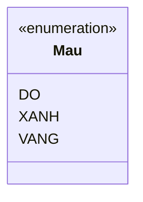

# Enums

Enum (kiểu liệt kê) dùng khi một biến chỉ được nhận một trong vài giá trị cố định, như các ngày trong tuần hay trạng thái đơn hàng. So với dùng chuỗi hay số, enum an toàn hơn vì Java kiểm tra ngay lúc biên dịch, tránh gõ nhầm và làm code rõ nghĩa. Bài này giới thiệu cách khai báo enum, dùng trong `switch`, thêm thuộc tính/phương thức và các phương thức tiện ích sẵn có; phần chi tiết nằm bên dưới.

[](pathname:///img/java/enums.webp)

---

:::note[Ghi nhớ nhanh]

- ⭐ **`enum` là tập hằng giá trị cố định, type-safe** — compiler kiểm tra lúc biên dịch, không gõ nhầm hay truyền giá trị vô nghĩa được.
- **An toàn hơn dùng `int`/`String` rời rạc** — code rõ nghĩa, IDE tự gợi ý.
- **Kết hợp tốt với `switch`** — trong `case` không cần ghi tên enum đầy đủ.
- **Enum có thể mang thuộc tính, phương thức và constructor** — constructor luôn ngầm `private`.
- **Có sẵn `values()`, `valueOf()`, `name()`, `ordinal()`** — nên so sánh bằng `==` và tránh lệ thuộc `ordinal()`.

:::

---

## Mục lục

- [Enum là gì?](#enum-là-gì)
- [Vì sao có enum?](#vì-sao-có-enum)
- [Định nghĩa enum cơ bản](#định-nghĩa-enum-cơ-bản)
- [Vì sao dùng enum thay vì chuỗi/số?](#vì-sao-dùng-enum-thay-vì-chuỗisố)
- [Dùng enum trong switch](#dùng-enum-trong-switch)
- [Enum có thuộc tính và phương thức](#enum-có-thuộc-tính-và-phương-thức)
- [Các phương thức tiện ích của enum](#các-phương-thức-tiện-ích-của-enum)
- [Lỗi thường gặp](#lỗi-thường-gặp)
- [Tóm tắt](#tóm-tắt)
- [Câu hỏi phỏng vấn](#câu-hỏi-phỏng-vấn)

---

## Enum là gì?

**Enum** (viết tắt của enumeration — kiểu liệt kê: một tập hợp cố định các giá trị có tên) dùng khi một biến chỉ được nhận một trong vài giá trị xác định trước.

Ví dụ đời thường: các ngày trong tuần (Thứ Hai đến Chủ Nhật), các hướng (Đông, Tây, Nam, Bắc), trạng thái đơn hàng (Đang xử lý, Đã giao, Đã hủy). Những thứ này có một danh sách giá trị cố định, không thể là giá trị bất kỳ.

---

## Vì sao có enum?

**Vấn đề:** Khi cần biểu diễn một tập giá trị cố định (ví dụ trạng thái đơn hàng: NEW/PAID/SHIPPED), nhiều người dùng hằng số `int` hoặc `String` ("magic value"). Cách này không kiểu-an-toàn: truyền nhầm số hoặc chuỗi sai vẫn biên dịch được, không có gợi ý trong IDE, dễ gõ sai, và `switch` có thể sót giá trị mà không báo lỗi.

```java
// Dùng int/String rời rạc: trình biên dịch không bảo vệ được
int NEW = 0, PAID = 1, SHIPPED = 2;

void capNhat(int trangThai) { /* ... */ }

capNhat(99);            // Vô nghĩa nhưng vẫn biên dịch được
String tt = "SHIPED";  // Gõ sai "SHIPED", không ai phát hiện
```

**Giải pháp:** Dùng **enum** — một kiểu riêng với tập hằng giá trị cố định, **type-safe** (trình biên dịch chỉ cho nhận đúng enum). Enum còn có thể thêm thuộc tính/phương thức/constructor, dùng trong `switch` an toàn, và hỗ trợ `EnumMap`/`EnumSet` rất hiệu quả.

```java
public enum TrangThai { NEW, PAID, SHIPPED }

void capNhat(TrangThai trangThai) { /* ... */ }

capNhat(TrangThai.PAID);   // OK, chỉ nhận giá trị hợp lệ
// capNhat(99);            // LỖI biên dịch ngay
// TrangThai.SHIPED;       // LỖI biên dịch ngay, không gõ sai được
```

:::tip[Dùng thực tế]
- Trạng thái đơn hàng: `NEW`, `PAID`, `SHIPPED`, `CANCELLED`.
- Ngày trong tuần / tháng: `MONDAY`...`SUNDAY` (`java.time.DayOfWeek`).
- Cấu hình loại có hành vi riêng: mỗi hằng số mang thuộc tính/phương thức khác nhau (ví dụ mức ưu tiên kèm hệ số xử lý).
- Thay cho hằng số `int`/`String` rời rạc để có kiểu-an-toàn và code rõ nghĩa.
:::

---

## Định nghĩa enum cơ bản

Dùng từ khóa `enum` để khai báo. Các giá trị (gọi là **hằng số enum**) thường viết HOA.

```java
// Khai báo một enum tên Mau với 3 giá trị cố định
public enum Mau {
    DO,
    XANH,
    VANG
}
```

Sử dụng:

```java
public class Main {
    public static void main(String[] args) {
        // Biến kiểu Mau chỉ nhận được DO, XANH, hoặc VANG
        Mau mauYeuThich = Mau.DO;

        System.out.println("Mau: " + mauYeuThich); // DO

        // So sánh enum
        if (mauYeuThich == Mau.DO) {
            System.out.println("Ban thich mau do!");
        }
    }
}
```

Sơ đồ minh hoạ enum `Mau` là một kiểu riêng với tập hằng giá trị cố định:



---

## Vì sao dùng enum thay vì chuỗi/số?

Trước khi có enum, người ta thường dùng chuỗi hoặc số để biểu diễn trạng thái — nhưng cách này dễ sai.

```java
// CÁCH CŨ (DỄ LỖI): dùng chuỗi
String trangThai = "DANG_XU_LY";
// Có thể gõ nhầm "DANG_XULY" mà Java không phát hiện được

// CÁCH CŨ (DỄ LỖI): dùng số
int trangThaiSo = 1; // 1 là gì? Phải nhớ quy ước, dễ nhầm
```

Với enum, Java kiểm tra ngay lúc biên dịch:

```java
public enum TrangThaiDonHang {
    DANG_XU_LY, DA_GIAO, DA_HUY
}

public class Main {
    public static void main(String[] args) {
        TrangThaiDonHang tt = TrangThaiDonHang.DANG_XU_LY; // OK
        // TrangThaiDonHang sai = TrangThaiDonHang.DANG_XULY; // LỖI ngay, không gõ nhầm được
    }
}
```

Ưu điểm: an toàn (không gõ nhầm), tự gợi ý trong IDE, code rõ nghĩa.

---

## Dùng enum trong switch

Enum kết hợp rất tốt với `switch` (cấu trúc rẽ nhánh nhiều trường hợp). Trong case không cần ghi tên enum đầy đủ.

```java
public enum TrangThaiDonHang {
    DANG_XU_LY, DA_GIAO, DA_HUY
}

public class Main {
    static void xuLy(TrangThaiDonHang tt) {
        switch (tt) {
            case DANG_XU_LY: // không cần ghi TrangThaiDonHang.DANG_XU_LY
                System.out.println("Don hang dang duoc xu ly");
                break;
            case DA_GIAO:
                System.out.println("Don hang da giao thanh cong");
                break;
            case DA_HUY:
                System.out.println("Don hang da bi huy");
                break;
        }
    }

    public static void main(String[] args) {
        xuLy(TrangThaiDonHang.DA_GIAO); // Don hang da giao thanh cong
    }
}
```

Lợi ích: nếu thêm giá trị enum mới, nhiều IDE sẽ nhắc bạn xử lý case còn thiếu.

---

## Enum có thuộc tính và phương thức

Enum trong Java mạnh hơn nhiều ngôn ngữ khác: mỗi hằng số enum có thể mang **thuộc tính** và enum có thể có **phương thức**.

```java
public enum HanhTinh {
    // Mỗi hằng số kèm dữ liệu: khối lượng và bán kính
    TRAI_DAT(5.976e24, 6.37814e6),
    SAO_HOA(6.421e23, 3.3972e6);

    // Thuộc tính của mỗi hằng số (nên để private final)
    private final double khoiLuong;
    private final double banKinh;

    // Constructor của enum (luôn private ngầm định)
    HanhTinh(double khoiLuong, double banKinh) {
        this.khoiLuong = khoiLuong;
        this.banKinh = banKinh;
    }

    // Phương thức tính trọng lực bề mặt
    double trongLucBeMat() {
        double G = 6.67300e-11; // hằng số hấp dẫn
        return G * khoiLuong / (banKinh * banKinh);
    }
}

public class Main {
    public static void main(String[] args) {
        for (HanhTinh ht : HanhTinh.values()) {
            System.out.println(ht + " trong luc: " + ht.trongLucBeMat());
        }
    }
}
```

Khi khai báo hằng số có dữ liệu, bạn truyền giá trị vào constructor của enum.

---

## Các phương thức tiện ích của enum

Mọi enum tự động có sẵn các phương thức hữu ích:

```java
public enum Mau { DO, XANH, VANG }

public class Main {
    public static void main(String[] args) {
        // values(): trả về mảng tất cả hằng số
        for (Mau m : Mau.values()) {
            System.out.println(m);
        }

        // valueOf(): chuyển chuỗi thành enum
        Mau m = Mau.valueOf("XANH");
        System.out.println(m); // XANH

        // name(): tên hằng số dưới dạng chuỗi
        System.out.println(Mau.DO.name()); // "DO"

        // ordinal(): vị trí (bắt đầu từ 0)
        System.out.println(Mau.VANG.ordinal()); // 2
    }
}
```

Lưu ý: `valueOf("KHONG_TON_TAI")` sẽ ném lỗi nếu tên không khớp hằng số nào.

---

## Lỗi thường gặp

- **Ghi tên enum đầy đủ trong case của switch**: chỉ cần `case DO:`, không phải `case Mau.DO:`.
- **Gọi `valueOf` với chuỗi sai**: ném `IllegalArgumentException` nếu không khớp.
- **Lạm dụng `ordinal()`**: thứ tự có thể thay đổi nếu sắp xếp lại enum; nên dùng thuộc tính riêng thay vì dựa vào vị trí.
- **Quên dấu `;`** sau danh sách hằng số khi enum có thêm thuộc tính/phương thức.
- **So sánh enum bằng `equals` thay vì `==`**: cả hai đều đúng, nhưng `==` an toàn hơn (không lỗi null) và là cách khuyến nghị.

---

## Tóm tắt

- **Enum** là kiểu liệt kê: một tập hợp cố định các giá trị có tên.
- Dùng `enum` để khai báo; hằng số thường viết HOA.
- An toàn hơn dùng chuỗi/số: Java kiểm tra lúc biên dịch, không gõ nhầm được.
- Kết hợp tốt với `switch` (case không cần tên enum đầy đủ).
- Enum có thể mang **thuộc tính** và **phương thức**.
- Có sẵn `values()`, `valueOf()`, `name()`, `ordinal()`.

---

## Câu hỏi phỏng vấn

Những câu thường gặp về chủ đề này. Tự trả lời trước, rồi bấm **Xem đáp án** để đối chiếu.

**1. Enum "type-safe" (kiểu-an-toàn) nghĩa là gì? So với dùng hằng số `int`, lợi ích cụ thể là gì?**

<details className="qa">
<summary>Xem đáp án</summary>

"Type-safe" nghĩa là **trình biên dịch kiểm tra và chặn ngay** các giá trị không hợp lệ, thay vì để lỗi trôi tới lúc chạy. Với `enum`, một biến khai báo kiểu `TrangThai` chỉ có thể nhận đúng các hằng số đã định nghĩa trong `TrangThai` — truyền nhầm một enum khác hay một số nguyên bất kỳ sẽ báo **lỗi biên dịch** ngay lập tức.

Ngược lại, dùng hằng số `int` (`NEW = 0`), biến tham số chỉ là `int` thông thường — truyền `99` hay bất kỳ số nào khác vẫn biên dịch được bình thường, lỗi logic chỉ phát hiện được lúc chạy (hoặc không phát hiện được).

</details>

**2. `EnumMap` và `EnumSet` là gì? Vì sao chúng hiệu quả hơn `HashMap`/`HashSet` thông thường khi key là enum?**

<details className="qa">
<summary>Xem đáp án</summary>

`EnumMap<K, V>` và `EnumSet<E>` là các cài đặt `Map`/`Set` chuyên biệt dành riêng cho key/phần tử kiểu `enum`. Bên trong, chúng dùng **mảng** được đánh chỉ số trực tiếp bằng `ordinal()` của từng hằng số, thay vì phải tính `hashCode()` và dò bucket như `HashMap`/`HashSet` thông thường.

Lợi ích: **nhanh hơn** (truy cập gần như O(1) thực sự qua chỉ số mảng), **tiết kiệm bộ nhớ hơn** (không cần cấu trúc bucket/entry phức tạp), và khi duyệt (`for`), phần tử luôn theo **đúng thứ tự khai báo** của enum — rất tiện cho các bài toán như đếm số lượng theo từng trạng thái.

</details>

**3. `enum` có thể `implements` interface không? Vì sao `enum` không thể `extends` một class khác?**

<details className="qa">
<summary>Xem đáp án</summary>

**Có thể `implements` interface** — enum trong Java thường được dùng kèm interface để bắt buộc mỗi hằng số có một hành vi chung:

```java
interface CoMauSac { String maHex(); }

enum Mau implements CoMauSac {
    DO { public String maHex() { return "#FF0000"; } },
    XANH { public String maHex() { return "#00FF00"; } };
}
```

**Không thể `extends`** class khác vì mỗi `enum` trong Java **ngầm định đã kế thừa** lớp `java.lang.Enum` (để có sẵn `values()`, `ordinal()`, `name()`...). Vì Java chỉ cho kế thừa đơn (single inheritance), enum đã "dùng hết" suất kế thừa lớp cho `Enum`, nên không thể `extends` thêm lớp nào khác — nhưng vẫn `implements` được nhiều interface như class thường.

</details>

**4. Mỗi hằng số enum có thể có phần thân override riêng (constant-specific method body). Nêu ví dụ và giải thích khác gì override thông thường giữa các lớp.**

<details className="qa">
<summary>Xem đáp án</summary>

```java
public enum PhepTinh {
    CONG { public int apDung(int a, int b) { return a + b; } },
    TRU  { public int apDung(int a, int b) { return a - b; } };

    public abstract int apDung(int a, int b); // mỗi hằng số phải cài đặt riêng
}
```

Về bản chất, mỗi hằng số enum có phần thân riêng (`{ ... }`) thực sự tạo ra một **lớp con vô danh (anonymous subclass)** của chính enum đó, override phương thức `abstract` khai báo trong enum — cơ chế giống hệt override giữa lớp cha/lớp con thông thường, chỉ khác là "lớp con" ở đây chính là từng hằng số riêng lẻ, không phải một class riêng biệt mà bạn đặt tên.

</details>

**5. So sánh `switch` statement truyền thống với `switch` expression (Java 14+) khi dùng với enum.**

<details className="qa">
<summary>Xem đáp án</summary>

```java
// switch statement cũ: cần break, dễ quên "fall-through"
switch (tt) {
    case DANG_XU_LY:
        System.out.println("Dang xu ly");
        break;
    case DA_GIAO:
        System.out.println("Da giao");
        break;
    default:
        System.out.println("Khac");
}

// switch expression mới (Java 14+): cú pháp mũi tên, TRẢ VỀ giá trị, không cần break
String ketQua = switch (tt) {
    case DANG_XU_LY -> "Dang xu ly";
    case DA_GIAO -> "Da giao";
    default -> "Khac";
};
```

`switch` expression: cú pháp `->` gọn hơn, **không có fall-through** (không cần `break`, không lo lọt case), có thể **trả về giá trị trực tiếp**, và nếu switch trên enum liệt kê **đủ mọi hằng số** thì có thể bỏ `default` — compiler sẽ báo lỗi nếu về sau bạn thêm hằng số enum mới mà quên xử lý case đó, giúp phát hiện thiếu sót sớm.

</details>

**6. Vì sao không nên dựa vào `ordinal()` để lưu enum vào database hoặc so sánh mức độ ưu tiên? Rủi ro cụ thể là gì?**

<details className="qa">
<summary>Xem đáp án</summary>

`ordinal()` trả về **vị trí khai báo** (bắt đầu từ 0) của hằng số trong enum — giá trị này **phụ thuộc thứ tự viết code**, không phải một định danh cố định gắn liền với ý nghĩa nghiệp vụ.

Rủi ro: nếu sau này bạn **thêm, xóa, hoặc sắp xếp lại** thứ tự các hằng số, `ordinal()` của mọi hằng số phía sau sẽ **thay đổi theo** — dữ liệu cũ đã lưu `ordinal()` trong database sẽ bị đọc sai sang một trạng thái hoàn toàn khác. Cách an toàn hơn: lưu `name()` (chuỗi tên) vào database, hoặc gán một thuộc tính riêng cố định (như mã số nghiệp vụ) cho mỗi hằng số thay vì dựa vào vị trí.

</details>

**7. Vì sao Joshua Bloch (tác giả "Effective Java") khuyến nghị dùng `enum` với một hằng số duy nhất để cài đặt Singleton pattern?**

<details className="qa">
<summary>Xem đáp án</summary>

```java
public enum CauHinhDuyNhat {
    INSTANCE;
    void doSomething() { /* ... */ }
}
// Dùng: CauHinhDuyNhat.INSTANCE.doSomething();
```

Vì JVM **tự đảm bảo** mỗi hằng số enum chỉ được khởi tạo **đúng một lần**, an toàn tuyệt đối với đa luồng (thread-safe) mà không cần tự viết `synchronized` hay double-checked locking như cách cài Singleton truyền thống bằng class thường. Enum còn miễn nhiễm với các lỗ hổng phổ biến của Singleton kiểu cũ: không thể bị tạo thêm instance qua **reflection** (Java chặn riêng với enum) và tự động hỗ trợ **serialization** đúng đắn (không bị nhân bản instance khi deserialize).

</details>

**8. `TrangThai.valueOf("KHONG_TON_TAI")` sẽ ném ra exception gì? Làm sao xử lý an toàn khi tên có thể không hợp lệ (ví dụ đến từ input người dùng)?**

<details className="qa">
<summary>Xem đáp án</summary>

Ném ra **`IllegalArgumentException`** nếu chuỗi truyền vào không khớp chính xác (phân biệt hoa/thường) với bất kỳ tên hằng số nào.

Cách xử lý an toàn khi giá trị đến từ nguồn không tin cậy (input người dùng, request API):

```java
try {
    TrangThai tt = TrangThai.valueOf(input.toUpperCase());
} catch (IllegalArgumentException e) {
    // xử lý giá trị không hợp lệ, ví dụ trả lỗi 400 cho client
}
```

Hoặc viết một phương thức tra cứu tùy chỉnh trả về `Optional<TrangThai>` thay vì để `valueOf` ném exception thẳng ra ngoài tầng nghiệp vụ.

</details>

**9. Tình huống: `TrangThaiDonHang` (NEW, PAID, SHIPPED, CANCELLED) cần đảm bảo chỉ được chuyển trạng thái theo đúng luồng hợp lệ (ví dụ không thể từ `SHIPPED` quay lại `NEW`). Bạn thiết kế enum này thế nào để enforce quy tắc đó?**

<details className="qa">
<summary>Xem đáp án</summary>

Gắn logic kiểm tra chuyển trạng thái (state machine) ngay bên trong enum, thay vì để rải rác ở tầng service:

```java
public enum TrangThaiDonHang {
    NEW, PAID, SHIPPED, CANCELLED;

    public boolean coTheChuyenSang(TrangThaiDonHang tiep) {
        return switch (this) {
            case NEW -> tiep == PAID || tiep == CANCELLED;
            case PAID -> tiep == SHIPPED || tiep == CANCELLED;
            case SHIPPED -> false;   // đã giao, không chuyển đi đâu nữa
            case CANCELLED -> false; // đã hủy, kết thúc luồng
        };
    }
}

// Dùng ở tầng nghiệp vụ:
if (!donHang.getTrangThai().coTheChuyenSang(moi)) {
    throw new IllegalStateException("Chuyen trang thai khong hop le");
}
```

Cách này gom **toàn bộ quy tắc chuyển trạng thái hợp lệ vào một nơi duy nhất** (trong chính enum), tránh mỗi service tự viết `if/else` rải rác dễ sót trường hợp, và dễ mở rộng khi thêm trạng thái mới.

</details>
