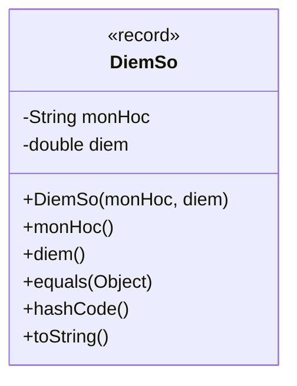

# Record

Record (có từ Java 16) là cách viết ngắn gọn cho những lớp chỉ dùng để chứa dữ liệu bất biến. Chỉ cần một dòng khai báo, Java tự sinh ra constructor, accessor, `equals`, `hashCode` và `toString`, giúp bạn khỏi viết hàng chục dòng lặp đi lặp lại. Bài này giới thiệu cú pháp record, tính bất biến, compact constructor và khi nào nên dùng; phần chi tiết nằm bên dưới.

[](pathname:///img/java/record.webp)

---

:::note[Ghi nhớ nhanh]

- ⭐ **`record` (Java 16+) tạo lớp chứa dữ liệu bất biến chỉ trong một dòng** — thay cho hàng chục dòng lặp lại.
- ⭐ **Java tự sinh constructor, accessor, `equals`, `hashCode`, `toString`** — accessor dùng tên thành phần (`diem()`), không có tiền tố `get`.
- **Bất biến (immutable)** — thành phần ngầm `final`, không có setter; muốn đổi phải tạo record mới.
- **`compact constructor` để validate** — chỉ ghi phần kiểm tra, không cần liệt kê tham số hay gán field.
- **Không kế thừa lớp khác** (nhưng `implements` interface được) — dùng cho DTO, value object, key của `Map`.

:::

---

## Mục lục

- [Vì sao có record?](#vì-sao-có-record)
- [Record là gì?](#record-là-gì)
- [Cú pháp khai báo record](#cú-pháp-khai-báo-record)
- [Record tự sinh những gì?](#record-tự-sinh-những-gì)
- [Tính bất biến của record](#tính-bất-biến-của-record)
- [So sánh record với class thường](#so-sánh-record-với-class-thường)
- [Thêm validation và phương thức cho record](#thêm-validation-và-phương-thức-cho-record)
- [Khi nào nên dùng record?](#khi-nào-nên-dùng-record)
- [Lỗi thường gặp](#lỗi-thường-gặp)
- [Tóm tắt](#tóm-tắt)
- [Câu hỏi phỏng vấn](#câu-hỏi-phỏng-vấn)

---

## Vì sao có record?

**Vấn đề:** Một lớp chỉ để **chứa dữ liệu** (DTO, value object) trong Java cũ phải viết RẤT NHIỀU code lặp đi lặp lại: field `private`, constructor, getter cho mọi field, rồi `equals()`, `hashCode()`, `toString()`. Mỗi lần thêm một field là phải nhớ cập nhật tất cả những chỗ đó — dễ sai, dễ quên.

```java
// Chỉ để chứa 2 giá trị mà phải viết cả đống code
public class Diem {
    private final int x;
    private final int y;

    public Diem(int x, int y) {
        this.x = x;
        this.y = y;
    }

    public int x() { return x; }
    public int y() { return y; }

    @Override
    public boolean equals(Object o) {
        if (this == o) return true;
        if (!(o instanceof Diem)) return false;
        Diem d = (Diem) o;
        return x == d.x && y == d.y;
    }

    @Override
    public int hashCode() {
        return java.util.Objects.hash(x, y);
    }

    @Override
    public String toString() {
        return "Diem[x=" + x + ", y=" + y + "]";
    }
}
```

**Giải pháp:** **Record** (Java 16) gói tất cả vào một dòng. Java tự sinh constructor, accessor, `equals`, `hashCode`, `toString`; dữ liệu **bất biến** theo mặc định. Gọn, an toàn, đúng ý nghĩa "dữ liệu thuần".

```java
// Một dòng — đủ mọi thứ ở trên, lại còn bất biến
public record Diem(int x, int y) {}
```

:::tip[Dùng thực tế]
- **DTO request/response API**: gói dữ liệu gửi/nhận giữa client và server.
- **Value object**: tọa độ, tiền tệ, khoảng thời gian — so sánh theo giá trị.
- **Key cho `Map` / phần tử `Set`**: đã có sẵn `equals`/`hashCode` đúng đắn.
- **Dữ liệu bất biến truyền giữa các tầng**: không lo bị sửa lén ở nơi khác.
:::

---

## Record là gì?

**Record** (kiểu lớp chứa dữ liệu bất biến, có từ Java 16) là cách viết ngắn gọn cho những lớp chỉ dùng để **chứa dữ liệu** (data carrier). Thay vì viết hàng chục dòng cho một lớp đơn giản, record gói gọn trong một dòng.

Ví dụ đời thường: một tấm danh thiếp ghi tên và số điện thoại. Nó chỉ chứa thông tin, không có hành vi phức tạp. Record sinh ra cho đúng những trường hợp như vậy.

---

## Cú pháp khai báo record

Dùng từ khóa `record`, liệt kê các trường dữ liệu trong dấu ngoặc (gọi là **components** — thành phần).

```java
// Một dòng duy nhất! Tự động có constructor, getter, equals, toString...
public record DiemSo(String monHoc, double diem) {
}
```

So với class thường tương đương:

```java
// Class thường: phải viết RẤT NHIỀU code
public class DiemSoCu {
    private final String monHoc;
    private final double diem;

    public DiemSoCu(String monHoc, double diem) {
        this.monHoc = monHoc;
        this.diem = diem;
    }

    public String monHoc() { return monHoc; }
    public double diem() { return diem; }

    // ... còn phải tự viết equals(), hashCode(), toString() nữa
}
```

Record làm tất cả những việc đó tự động.

---

## Record tự sinh những gì?

Khi khai báo một record, Java **tự động sinh** ra:

1. **Constructor** nhận đủ các thành phần (gọi là canonical constructor).
2. **Phương thức truy cập** (accessor) cho mỗi thành phần — tên trùng tên thành phần (ví dụ `monHoc()`, không phải `getMonHoc()`).
3. **equals()** — so sánh hai record dựa trên giá trị các thành phần.
4. **hashCode()** — mã băm phù hợp với equals.
5. **toString()** — chuỗi mô tả dễ đọc.

Sơ đồ minh hoạ những thành phần Java tự sinh cho một record chỉ từ một dòng khai báo:



```java
public record DiemSo(String monHoc, double diem) {}

public class Main {
    public static void main(String[] args) {
        DiemSo d1 = new DiemSo("Toan", 9.5);

        // Accessor: dùng tên thành phần (KHÔNG có "get")
        System.out.println(d1.monHoc()); // Toan
        System.out.println(d1.diem());   // 9.5

        // toString() tự sinh, rất gọn
        System.out.println(d1); // DiemSo[monHoc=Toan, diem=9.5]

        // equals() so sánh theo GIÁ TRỊ
        DiemSo d2 = new DiemSo("Toan", 9.5);
        System.out.println(d1.equals(d2)); // true (cùng giá trị)
    }
}
```

---

## Tính bất biến của record

Record là **bất biến** (immutable — không thể thay đổi sau khi tạo). Các thành phần ngầm là `final`, không có setter.

```java
public record DiemSo(String monHoc, double diem) {}

public class Main {
    public static void main(String[] args) {
        DiemSo d = new DiemSo("Toan", 9.5);

        // LỖI: không thể thay đổi thành phần của record
        // d.diem = 10; // SAI! record bất biến

        // Muốn "thay đổi" -> tạo record MỚI
        DiemSo dMoi = new DiemSo(d.monHoc(), 10.0);
        System.out.println(dMoi); // DiemSo[monHoc=Toan, diem=10.0]
    }
}
```

Tính bất biến giúp code an toàn hơn: một khi tạo ra, dữ liệu không bị sửa lén ở nơi khác.

---

## So sánh record với class thường

| Đặc điểm | Record | Class thường |
|----------|--------|--------------|
| Số dòng code | Rất ít | Nhiều |
| Tính bất biến | Mặc định bất biến | Phải tự làm |
| equals/hashCode/toString | Tự sinh | Phải tự viết |
| Setter | Không có | Có thể có |
| Kế thừa lớp khác | Không (record không extends) | Có thể |
| Mục đích chính | Chứa dữ liệu | Đa năng (dữ liệu + hành vi) |

Record không thay thế class thường — nó chỉ tối ưu cho trường hợp "lớp chứa dữ liệu bất biến".

---

## Thêm validation và phương thức cho record

Record không chỉ trống rỗng — bạn có thể thêm kiểm tra hợp lệ và phương thức.

```java
public record DiemSo(String monHoc, double diem) {

    // Compact constructor: kiểm tra hợp lệ khi tạo
    public DiemSo {
        if (diem < 0 || diem > 10) {
            throw new IllegalArgumentException("Diem phai tu 0 den 10");
        }
        // Không cần gán this.diem = diem; record tự làm
    }

    // Thêm phương thức tùy ý
    public boolean dau() {
        return diem >= 5.0;
    }
}

public class Main {
    public static void main(String[] args) {
        DiemSo d = new DiemSo("Toan", 9.5);
        System.out.println("Dau? " + d.dau()); // Dau? true

        // DiemSo sai = new DiemSo("Toan", 15); // Ném lỗi: Diem phai tu 0 den 10
    }
}
```

**Compact constructor** (constructor rút gọn) chỉ ghi phần kiểm tra, không cần liệt kê tham số hay gán giá trị.

---

## Khi nào nên dùng record?

Dùng record khi:

- Lớp chỉ để **chứa dữ liệu** (như đối tượng truyền dữ liệu giữa các tầng — DTO).
- Bạn muốn dữ liệu **bất biến**.
- Bạn cần `equals`/`hashCode` so sánh theo giá trị.

Không nên dùng record khi:

- Lớp cần thay đổi trạng thái sau khi tạo.
- Lớp cần kế thừa từ lớp khác.
- Lớp chủ yếu chứa hành vi phức tạp thay vì dữ liệu.

---

## Lỗi thường gặp

- **Gọi accessor với "get"**: record dùng `diem()` chứ không phải `getDiem()`.
- **Cố thay đổi giá trị record**: record bất biến, không có setter.
- **Tưởng record extends được lớp khác**: record không thể kế thừa lớp (nhưng có thể implements interface).
- **Quên record cần Java 16+**: trên Java cũ hơn sẽ không biên dịch được.
- **Gán lại `this.diem` trong compact constructor**: không cần và dễ gây nhầm.

---

## Tóm tắt

- **Record** (Java 16+) là cách ngắn gọn để tạo lớp chứa dữ liệu **bất biến**.
- Tự sinh constructor, accessor, `equals`, `hashCode`, `toString`.
- Accessor dùng tên thành phần (`diem()`), không có tiền tố `get`.
- Bất biến: muốn đổi giá trị phải tạo record mới.
- Có thể thêm **compact constructor** để validate và thêm phương thức tùy ý.
- Dùng cho DTO và dữ liệu bất biến; không dùng khi cần thay đổi trạng thái hay kế thừa lớp.

---

## Câu hỏi phỏng vấn

Những câu thường gặp về chủ đề này. Tự trả lời trước, rồi bấm **Xem đáp án** để đối chiếu.

**1. `record` (Java 16+) khác biệt cốt lõi gì so với class thường?**

<details className="qa">
<summary>Xem đáp án</summary>

Về cú pháp, `record` là **viết tắt** — Java tự sinh constructor, accessor, `equals()`, `hashCode()`, `toString()` chỉ từ một dòng khai báo thành phần (components). Về ngữ nghĩa, `record` thể hiện rõ ràng ý định "đây là lớp chứa **dữ liệu bất biến** (immutable data carrier)": mọi thành phần ngầm `final`, không có setter, so sánh bằng `equals` dựa theo **giá trị** chứ không theo địa chỉ tham chiếu như class thường mặc định. Class thường phải tự viết tất cả những điều này thủ công nếu muốn có hành vi tương tự.

</details>

**2. Vì sao `record` không thể `extends` một class khác, nhưng vẫn `implements` interface được?**

<details className="qa">
<summary>Xem đáp án</summary>

Mọi `record` đều **ngầm định kế thừa** lớp `java.lang.Record` (tương tự cách mọi `enum` ngầm kế thừa `java.lang.Enum`), để có sẵn cơ chế `equals`/`hashCode`/`toString` dựa trên component. Vì Java chỉ hỗ trợ **kế thừa đơn**, suất `extends` đó đã dành cho `Record`, nên record không thể `extends` thêm class nào khác.

Tuy nhiên `implements` interface hoàn toàn không bị ảnh hưởng — record vẫn có thể triển khai một hay nhiều interface như class thường, ví dụ `record DiemSo(...) implements Comparable<DiemSo>` để bổ sung khả năng so sánh.

</details>

**3. Compact constructor khác gì canonical constructor thông thường của record? Khi nào cần dùng?**

<details className="qa">
<summary>Xem đáp án</summary>

- **Canonical constructor** là constructor đầy đủ, nhận đúng danh sách tham số theo components và tự gán field — Java sinh sẵn nếu bạn không viết, hoặc bạn có thể viết lại đầy đủ (`public DiemSo(String monHoc, double diem) { this.monHoc = monHoc; this.diem = diem; }`).
- **Compact constructor** là dạng **rút gọn** của canonical constructor: không cần liệt kê lại tham số, không cần dòng gán `this.x = x` — chỉ viết phần **kiểm tra/biến đổi giá trị** trước khi Java tự gán field ngầm ở cuối.

```java
public record DiemSo(String monHoc, double diem) {
    public DiemSo { // compact constructor: không có (...)
        if (diem < 0 || diem > 10) throw new IllegalArgumentException("Diem phai tu 0 den 10");
    }
}
```

Nên dùng compact constructor khi cần **validate** dữ liệu đầu vào hoặc **chuẩn hóa** giá trị (ví dụ `trim()` một chuỗi) mà không muốn viết lại toàn bộ constructor đầy đủ.

</details>

**4. `equals()` tự sinh của record so sánh dựa trên gì? Nếu một component là kiểu mảng (`int[]`), việc so sánh có đúng như mong đợi không?**

<details className="qa">
<summary>Xem đáp án</summary>

`equals()` tự sinh so sánh **từng component** bằng `equals()` tương ứng của kiểu dữ liệu đó (dùng `Objects.equals` cho kiểu tham chiếu, so sánh trực tiếp cho kiểu nguyên thủy).

**Vấn đề với mảng**: kiểu mảng (`int[]`, `String[]`...) trong Java **không override `equals()`** — `equals()` mặc định của mảng chỉ so sánh **địa chỉ tham chiếu**, không so sánh nội dung phần tử bên trong. Vì vậy nếu một record có component là mảng, hai record chứa hai mảng khác địa chỉ nhưng cùng nội dung sẽ bị coi là **không bằng nhau** — đây là cái bẫy phổ biến. Giải pháp: dùng `List` (như `List<Integer>`) thay cho mảng khi cần so sánh theo giá trị, vì `List.equals()` đã so sánh nội dung đúng.

</details>

**5. Record có thể có field `static` không? Có thể thêm field instance khác ngoài các components đã khai báo không?**

<details className="qa">
<summary>Xem đáp án</summary>

- **Field `static`**: được phép, vì `static` gắn với **lớp**, không phải với từng instance dữ liệu — không mâu thuẫn với tính bất biến của record.
- **Field instance khác ngoài components**: **không được phép**. Toàn bộ trạng thái instance của record phải được thể hiện đầy đủ qua danh sách components khai báo trong `record TenRecord(...)`, đây là ràng buộc cố ý để đảm bảo `equals`/`hashCode`/`toString` tự sinh luôn phản ánh **đúng và đủ** toàn bộ dữ liệu — record không cho phép "giấu" thêm state ngầm mà các phương thức tự sinh không biết tới.

</details>

**6. Java 21 đưa "record pattern" vào `switch` để destructuring record. Nêu ví dụ và lợi ích.**

<details className="qa">
<summary>Xem đáp án</summary>

```java
record Diem(int x, int y) {}

static String moTa(Object obj) {
    return switch (obj) {
        case Diem(int x, int y) when x == y -> "Diem tren duong cheo (" + x + ", " + y + ")";
        case Diem(int x, int y) -> "Diem thuong: x=" + x + ", y=" + y;
        default -> "Khong phai Diem";
    };
}
```

**Record pattern** (Java 21) cho phép **"bóc tách" (destructure)** trực tiếp các component của record ngay trong nhánh `case`, kết hợp được với mệnh đề `when` để thêm điều kiện lọc. Lợi ích: tránh phải viết `instanceof` rồi gọi thủ công từng accessor (`d.x()`, `d.y()`) như trước, code ngắn gọn và trực quan hơn hẳn khi xử lý dữ liệu dạng cây (nested record).

</details>

**7. Record có cho phép override phương thức accessor để thêm logic không? Cho ví dụ.**

<details className="qa">
<summary>Xem đáp án</summary>

**Có.** Bạn có thể viết lại (override) accessor của một component để thêm xử lý, miễn là giữ đúng tên và kiểu trả về:

```java
public record NguoiDung(String ten) {
    // Override accessor mặc định để chuẩn hóa dữ liệu khi đọc ra
    public String ten() {
        return ten.trim();
    }
}
```

Lưu ý: override accessor **không** thay đổi giá trị field gốc được lưu bên trong (vẫn nguyên như lúc truyền vào constructor) — nó chỉ ảnh hưởng tới **những gì trả về khi gọi accessor**. Muốn chuẩn hóa cả giá trị lưu trữ, nên xử lý ngay trong **compact constructor** thay vì trong accessor.

</details>

**8. Nêu hai tình huống KHÔNG nên dùng record, và giải thích vì sao.**

<details className="qa">
<summary>Xem đáp án</summary>

- **JPA/Hibernate entity**: các entity ORM truyền thống cần **constructor không tham số**, cho phép **thay đổi trạng thái** sau khi tạo (Hibernate tự set field qua reflection/proxy để lazy-loading), và đôi khi cần **kế thừa** (`extends` entity cha) — cả ba điều này đều mâu thuẫn với bản chất bất biến, không kế thừa của record. Có thể dùng record cho **DTO/projection** đọc dữ liệu, nhưng không nên dùng làm entity chính.
- **Đối tượng cần thay đổi trạng thái liên tục** (ví dụ một bộ đếm, một session đang được cập nhật nhiều field theo thời gian): record buộc phải tạo object mới mỗi lần "đổi" dữ liệu, không phù hợp với những đối tượng có vòng đời dài và trạng thái thay đổi thường xuyên — dùng class thường với field mutable sẽ hợp lý và hiệu quả hơn.

</details>

**9. So với việc dùng Lombok `@Value`/`@Data` để giảm code lặp cho lớp dữ liệu, vì sao nhiều dự án hiện nay ưu tiên chuyển sang `record` (Java 16+)?**

<details className="qa">
<summary>Xem đáp án</summary>

- **`record` là tính năng built-in của ngôn ngữ**, không cần thêm dependency ngoài, không cần annotation processor sinh code lúc build, và **IDE hỗ trợ native** ngay từ đầu (không cần cài plugin Lombok riêng).
- Record thể hiện **rõ ràng ý định bất biến** ngay trong cú pháp ngôn ngữ (`record`), dễ nhận diện hơn annotation `@Value` chỉ là một lớp chú thích được xử lý ngầm.
- Về mặt công cụ: một số công cụ phân tích tĩnh, debugger, hoặc thư viện serialization đôi khi xử lý code sinh bởi annotation processor (Lombok) kém tường minh hơn record — vì record là cấu trúc **chính thức trong JVM/bytecode**, được các công cụ hỗ trợ đầy đủ và ổn định hơn về lâu dài.

Lombok vẫn hữu ích khi cần các tính năng record chưa hỗ trợ (như `@Builder`, hoặc mutable data class có getter/setter/`@Data`), nhưng riêng cho lớp dữ liệu bất biến, `record` thường là lựa chọn hiện đại và tiêu chuẩn hơn.

</details>
