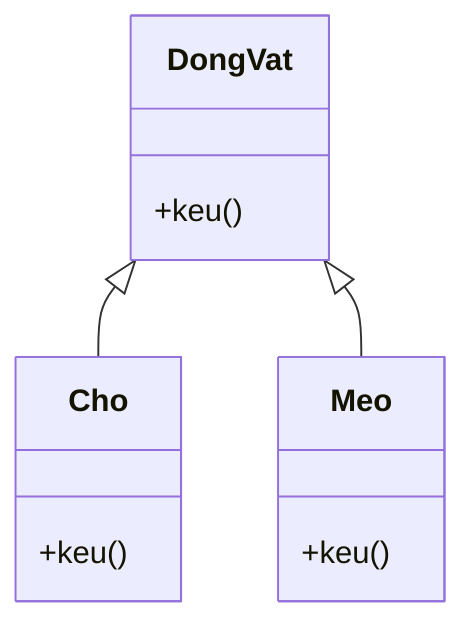

# Nạp chồng và Ghi đè (Overloading / Overriding)

Overloading (nạp chồng) và overriding (ghi đè) là hai khái niệm nghe rất giống nhau nhưng hoàn toàn khác biệt. Nạp chồng là nhiều phương thức cùng tên nhưng khác tham số trong cùng một lớp; còn ghi đè là lớp con viết lại phương thức của lớp cha để thay đổi hành vi. Bài này giúp bạn phân biệt rõ hai khái niệm, hiểu quy tắc của từng loại và vai trò của `@Override`; phần chi tiết nằm bên dưới.

[](pathname:///img/java/overloading-overriding.webp)

---

:::note[Ghi nhớ nhanh]

- ⭐ **Overloading (nạp chồng): cùng tên, khác tham số, trong cùng một lớp** — Java chọn phiên bản lúc biên dịch (static binding).
- ⭐ **Overriding (ghi đè): lớp con viết lại method lớp cha, cùng chữ ký** — chọn lúc chạy (dynamic binding), là nền tảng của đa hình.
- **Overload phân biệt bằng danh sách tham số, KHÔNG bằng kiểu trả về** — chỉ đổi kiểu trả về sẽ gây lỗi trùng method.
- **Luôn dùng `@Override` khi ghi đè** — compiler bắt lỗi ngay nếu gõ nhầm tên hay sai tham số.
- **Override không được thu hẹp phạm vi truy cập** — và không áp dụng cho `final`/`static`/`private`.

:::

---

## Mục lục

- [Vì sao có overloading & overriding?](#vì-sao-có-overloading--overriding)
- [Hai khái niệm dễ nhầm](#hai-khái-niệm-dễ-nhầm)
- [Overloading — nạp chồng](#overloading--nạp-chồng)
- [Quy tắc của overloading](#quy-tắc-của-overloading)
- [Overriding — ghi đè](#overriding--ghi-đè)
- [Annotation @Override](#annotation-override)
- [Quy tắc của overriding](#quy-tắc-của-overriding)
- [Bảng so sánh nhanh](#bảng-so-sánh-nhanh)
- [Lỗi thường gặp](#lỗi-thường-gặp)
- [Tóm tắt](#tóm-tắt)
- [Câu hỏi phỏng vấn](#câu-hỏi-phỏng-vấn)

---

## Vì sao có overloading & overriding?

**Vấn đề:**

```java
// (1) Cùng một thao tác "in ra màn hình" nhưng phải đặt tên khác nhau cho từng kiểu
void inInt(int a) { System.out.println(a); }
void inDouble(double a) { System.out.println(a); }
void inString(String a) { System.out.println(a); }
// Người dùng phải nhớ tên nào cho kiểu nào -> rườm rà, dễ nhầm

// (2) Lớp con cần hành vi khác lớp cha nhưng method kế thừa lại cứng nhắc
class DongVat {
    void keu() { System.out.println("Dong vat keu..."); }
}
class Cho extends DongVat { }
// Cho chỉ biết "Dong vat keu...", không thể sủa "Gau gau!" theo cách riêng
```

**Giải pháp:**

```java
// OVERLOADING: cùng tên, khác danh sách tham số -> compiler chọn lúc biên dịch (static binding)
class MayIn {
    void in(int a) { System.out.println(a); }
    void in(double a) { System.out.println(a); }
    void in(String a) { System.out.println(a); }
}
// API nhất quán: chỉ cần nhớ một tên "in", truyền gì cũng được

// OVERRIDING: lớp con định nghĩa lại method cùng chữ ký -> chọn lúc chạy (dynamic binding)
class Cho extends DongVat {
    @Override
    void keu() { System.out.println("Gau gau!"); } // nền tảng của ĐA HÌNH
}
```

:::tip[Dùng thực tế]

- **Nhiều constructor / `println` overload**: một tên gọi quen thuộc nhận đủ kiểu tham số.
- **`toString()`, `equals()` override**: lớp của bạn định nghĩa lại cách hiển thị, cách so sánh.
- **Đa hình xử lý danh sách đối tượng**: lặp qua `List<DongVat>` và gọi `keu()`, mỗi con vật tự kêu theo kiểu của nó.
- **`@Override` bắt lỗi sai chữ ký**: gõ nhầm tên hay sai tham số là compiler báo ngay.

:::

---

## Hai khái niệm dễ nhầm

Hai từ này nghe rất giống nhau nhưng hoàn toàn khác:

- **Overloading** (nạp chồng — nhiều phương thức **cùng tên** nhưng **khác tham số** trong cùng một lớp).
- **Overriding** (ghi đè — lớp con **viết lại** phương thức đã có ở lớp cha).

Mẹo nhớ: "load" (nạp) → thêm nhiều phiên bản cùng tên; "ride" (cưỡi đè) → lớp con đè lên phương thức của lớp cha.

---

## Overloading — nạp chồng

**Overloading** cho phép có nhiều phương thức cùng tên, miễn là danh sách tham số khác nhau (khác số lượng hoặc khác kiểu). Java tự chọn phiên bản đúng dựa vào tham số bạn truyền.

```java
public class MayTinh {
    // Phiên bản 1: cộng hai số nguyên
    int cong(int a, int b) {
        return a + b;
    }

    // Phiên bản 2: cộng ba số nguyên (KHÁC số lượng tham số)
    int cong(int a, int b, int c) {
        return a + b + c;
    }

    // Phiên bản 3: cộng hai số thực (KHÁC kiểu tham số)
    double cong(double a, double b) {
        return a + b;
    }
}
```

Java tự chọn đúng phiên bản:

```java
public class Main {
    public static void main(String[] args) {
        MayTinh mt = new MayTinh();

        System.out.println(mt.cong(2, 3));        // gọi phiên bản 1 -> 5
        System.out.println(mt.cong(2, 3, 4));     // gọi phiên bản 2 -> 9
        System.out.println(mt.cong(2.5, 3.5));    // gọi phiên bản 3 -> 6.0
    }
}
```

Ví dụ quen thuộc: `System.out.println()` có rất nhiều phiên bản overload (in số, in chuỗi, in boolean...).

---

## Quy tắc của overloading

Để được coi là overloading, các phương thức cùng tên phải **khác nhau ở danh sách tham số**:

- Khác **số lượng** tham số, HOẶC
- Khác **kiểu** tham số, HOẶC
- Khác **thứ tự** kiểu tham số.

```java
public class ViDu {
    void in(int a, String b) { } // hợp lệ
    void in(String a, int b) { } // hợp lệ: khác THỨ TỰ kiểu

    // KHÔNG hợp lệ: chỉ khác kiểu TRẢ VỀ không tính là overload
    // int in(int a, String b) { return 0; } // LỖI: trùng tham số với phương thức trên
}
```

Lưu ý quan trọng: **kiểu trả về và tên tham số KHÔNG** dùng để phân biệt overload — chỉ danh sách kiểu tham số mới tính.

---

## Overriding — ghi đè

**Overriding** xảy ra khi lớp con viết lại một phương thức đã có ở lớp cha, với **cùng tên và cùng danh sách tham số**. Mục đích: thay đổi hành vi cho phù hợp với lớp con.

```java
public class DongVat {
    void keu() {
        System.out.println("Dong vat keu...");
    }
}

public class Cho extends DongVat {
    // GHI ĐÈ phương thức keu() của lớp cha
    @Override
    void keu() {
        System.out.println("Gau gau!");
    }
}

public class Meo extends DongVat {
    @Override
    void keu() {
        System.out.println("Meo meo!");
    }
}
```

Khi chạy, Java dùng phiên bản của lớp con (đây là **đa hình** — polymorphism):

```java
public class Main {
    public static void main(String[] args) {
        DongVat dv1 = new Cho();
        DongVat dv2 = new Meo();

        dv1.keu(); // Gau gau!  (dùng phiên bản của Cho)
        dv2.keu(); // Meo meo!  (dùng phiên bản của Meo)
    }
}
```

Sơ đồ minh hoạ overriding: mỗi lớp con viết lại `keu()` của lớp cha để có hành vi riêng (mũi tên trỏ về lớp cha):



---

## Annotation @Override

`@Override` (chú thích báo cho Java biết đây là phương thức ghi đè) không bắt buộc, nhưng **rất nên dùng**. Nó giúp Java kiểm tra: nếu bạn ghi đè sai (gõ nhầm tên, sai tham số), Java sẽ báo lỗi ngay.

```java
public class Cho extends DongVat {
    // Có @Override: nếu gõ nhầm "kue" Java sẽ báo lỗi vì lớp cha không có "kue"
    @Override
    void keu() {
        System.out.println("Gau gau!");
    }
}
```

Không có `@Override`, lỗi gõ nhầm sẽ tạo ra một phương thức MỚI thay vì ghi đè, và bạn rất khó phát hiện.

---

## Quy tắc của overriding

Phương thức ghi đè phải tuân thủ:

- **Cùng tên** và **cùng danh sách tham số** với phương thức lớp cha.
- Kiểu trả về giống nhau (hoặc là lớp con của kiểu trả về gốc — gọi là covariant return).
- **Không được thu hẹp** phạm vi truy cập (ví dụ lớp cha `public` thì lớp con không được để `private`).
- Chỉ ghi đè được phương thức không phải `private`, `static`, hay `final`.

```java
public class DongVat {
    public void keu() { System.out.println("..."); }
}

public class Cho extends DongVat {
    // ĐÚNG: cùng tên, cùng tham số, giữ public
    @Override
    public void keu() { System.out.println("Gau"); }

    // SAI: không được hạ xuống private
    // @Override private void keu() { } // LỖI
}
```

---

## Bảng so sánh nhanh

| Tiêu chí | Overloading (nạp chồng) | Overriding (ghi đè) |
|----------|------------------------|---------------------|
| Vị trí | Cùng một lớp | Lớp con vs lớp cha |
| Tên phương thức | Giống nhau | Giống nhau |
| Tham số | Phải KHÁC | Phải GIỐNG |
| Kiểu trả về | Có thể khác | Giống (hoặc covariant) |
| Liên kết | Lúc biên dịch (static) | Lúc chạy (dynamic) |
| Mục đích | Nhiều cách gọi cùng tên | Thay đổi hành vi cho lớp con |

---

## Lỗi thường gặp

- **Tưởng đổi kiểu trả về là overload**: chỉ đổi kiểu trả về (cùng tham số) gây lỗi trùng phương thức.
- **Quên `@Override`**: gõ nhầm tên tạo phương thức mới thay vì ghi đè, khó phát hiện.
- **Thu hẹp phạm vi truy cập khi override**: lớp cha `public` mà lớp con để `private` → lỗi.
- **Cố ghi đè phương thức `final`**: không được phép.
- **Nhầm overload với override**: overload trong cùng lớp (khác tham số), override giữa cha-con (cùng tham số).

---

## Tóm tắt

- **Overloading** (nạp chồng): nhiều phương thức cùng tên, khác tham số, trong cùng lớp. Java chọn lúc biên dịch.
- **Overriding** (ghi đè): lớp con viết lại phương thức lớp cha, cùng tên cùng tham số. Java chọn lúc chạy (đa hình).
- Luôn dùng `@Override` khi ghi đè để Java kiểm tra giúp.
- Overload phân biệt bằng danh sách tham số (không phải kiểu trả về).
- Override không được thu hẹp phạm vi truy cập và không áp dụng cho `final`/`static`/`private`.

---

## Câu hỏi phỏng vấn

Những câu thường gặp về chủ đề này. Tự trả lời trước, rồi bấm **Xem đáp án** để đối chiếu.

**1. Tóm tắt sự khác nhau cốt lõi giữa overloading và overriding chỉ trong một câu.**

<details className="qa">
<summary>Xem đáp án</summary>

**Overloading** là nhiều phương thức **cùng tên, khác tham số** trong **cùng một lớp**, được Java chọn phiên bản lúc **biên dịch** (static binding); **overriding** là lớp con **viết lại** một phương thức **cùng tên, cùng tham số** đã có ở lớp cha, được Java chọn phiên bản lúc **chạy** dựa trên kiểu thực của đối tượng (dynamic binding) — đây là nền tảng của đa hình.

</details>

**2. Khi có nhiều overload phù hợp với một lời gọi (do autoboxing/varargs), Java ưu tiên chọn phiên bản nào trước?**

<details className="qa">
<summary>Xem đáp án</summary>

Java thử theo thứ tự ưu tiên, dừng ngay khi tìm được phiên bản khớp ở giai đoạn nào:

1. **Khớp chính xác kiểu** (exact match), không cần chuyển đổi gì.
2. **Widening primitive conversion** (mở rộng kiểu nguyên thủy, ví dụ `int` → `long` → `double`).
3. **Autoboxing/unboxing** (ví dụ `int` → `Integer`).
4. **Varargs** (`...`) — chỉ dùng khi không còn cách nào khác khớp được.

```java
void in(long x) { System.out.println("long"); }
void in(Integer x) { System.out.println("Integer"); }
void in(int... x) { System.out.println("varargs"); }

in(5); // in ra "long" — widening (int -> long) được ưu tiên hơn autoboxing và varargs
```

</details>

**3. Đọc code sau — lời gọi `xuLy(null)` có biên dịch được không? Vì sao?**

```java
void xuLy(String s) { System.out.println("String"); }
void xuLy(Object o) { System.out.println("Object"); }

xuLy(null);
```

<details className="qa">
<summary>Xem đáp án</summary>

**Biên dịch được và in ra "String".** Khi có nhiều overload đều có thể nhận `null`, Java chọn phiên bản có tham số **cụ thể/hẹp nhất (most specific type)** — vì `String` là lớp con của `Object`, overload nhận `String` được coi là "khớp chặt hơn". Nếu hai overload không có quan hệ cha-con rõ ràng (ví dụ `xuLy(String s)` và `xuLy(Integer i)` cùng tồn tại), gọi `xuLy(null)` sẽ gây **lỗi biên dịch "ambiguous method call"** vì Java không biết chọn cái nào.

</details>

**4. "Covariant return type" (kiểu trả về hiệp biến) trong overriding là gì? Cho ví dụ.**

<details className="qa">
<summary>Xem đáp án</summary>

Khi override, phương thức của lớp con được phép trả về một kiểu là **lớp con** của kiểu trả về gốc ở lớp cha, thay vì phải giữ nguyên y hệt:

```java
class DongVat {
    DongVat sinhSan() { return new DongVat(); }
}
class Cho extends DongVat {
    @Override
    Cho sinhSan() { return new Cho(); } // Cho là lớp con của DongVat -> hợp lệ
}
```

Điều này cho phép người gọi `Cho c = new Cho(); c.sinhSan()` nhận thẳng về kiểu `Cho` cụ thể hơn mà không cần ép kiểu, dù về bản chất vẫn đang override đúng phương thức của lớp cha.

</details>

**5. Một phương thức `private` ở lớp cha có bị "override" bởi lớp con nếu khai báo cùng tên, cùng tham số ở lớp con không?**

<details className="qa">
<summary>Xem đáp án</summary>

**Không.** Phương thức `private` không tham gia cơ chế override vì lớp con **không nhìn thấy** (không kế thừa được) thành viên `private` của lớp cha. Nếu lớp con khai báo một phương thức trùng tên, trùng tham số, đó chỉ là một phương thức **hoàn toàn mới, độc lập**, tình cờ trùng tên — không liên quan gì tới phương thức `private` của lớp cha, và không có `@Override` nào áp dụng được ở đây (nếu cố thêm `@Override` sẽ báo lỗi biên dịch vì không thực sự override được gì).

</details>

**6. `@Override` không bắt buộc nhưng nên dùng. Ngoài bắt lỗi gõ nhầm tên/tham số, nó còn hữu ích khi nào với `default method` của interface?**

<details className="qa">
<summary>Xem đáp án</summary>

`@Override` dùng được cho cả trường hợp lớp **override một `default method`** của interface (không chỉ override method của abstract/class cha):

```java
interface CoTheBay { default void bay() { System.out.println("Bay mac dinh"); } }
class Chim implements CoTheBay {
    @Override // hợp lệ: override default method của interface
    public void bay() { System.out.println("Chim vo canh de bay"); }
}
```

Lợi ích tương tự: nếu interface đổi tên `default method` hoặc đổi tham số, compiler sẽ báo lỗi ngay ở lớp implement thay vì âm thầm tạo ra một phương thức mới không liên quan.

</details>

**7. Vì sao hai overload sau gây lỗi biên dịch "erasure of method ... is the same" dù trông có vẻ khác kiểu tham số?**

```java
void xuLy(List<String> danhSach) { }
void xuLy(List<Integer> danhSach) { }
```

<details className="qa">
<summary>Xem đáp án</summary>

Vì cơ chế **type erasure** (xóa kiểu generic) của Java: generic chỉ tồn tại lúc **biên dịch** để kiểm tra kiểu, còn ở mức **bytecode chạy thực tế**, cả `List<String>` lẫn `List<Integer>` đều bị "xóa" thành cùng một kiểu thô `List`. Vì vậy hai overload này, sau khi erasure, có **chữ ký (signature) giống hệt nhau** ở tầng bytecode — Java không cho phép định nghĩa hai phương thức trùng chữ ký, nên báo lỗi biên dịch ngay, dù về mặt cú pháp nguồn chúng trông khác kiểu tham số.

</details>

**8. Constructor có thể overload được không? Có thể override được không? Giải thích.**

<details className="qa">
<summary>Xem đáp án</summary>

- **Overload: có.** Một lớp có thể có nhiều constructor cùng tên lớp nhưng khác danh sách tham số — đây chính là overloading áp dụng cho constructor, rất phổ biến.
- **Override: không.** Constructor **không được kế thừa** xuống lớp con (mỗi lớp phải tự định nghĩa constructor riêng của mình, dù có thể gọi lại `super(...)` của lớp cha), nên khái niệm "ghi đè" không áp dụng được — constructor của lớp con không phải là "phiên bản viết lại" của constructor lớp cha, mà là một constructor hoàn toàn độc lập, chỉ có nghĩa vụ gọi `super(...)` để khởi tạo phần dữ liệu thừa hưởng.

</details>

**9. Đọc code sau — tại sao gọi `new Con()` lại in ra `0` thay vì `10`? Đây là một cạm bẫy kinh điển liên quan tới overriding.**

```java
class Cha {
    Cha() {
        khoiTao(); // gọi method có thể bị override, ngay trong constructor lớp cha
    }
    void khoiTao() { System.out.println("Cha khoi tao"); }
}
class Con extends Cha {
    int gia = 10;
    @Override
    void khoiTao() { System.out.println("Gia = " + gia); }
}
new Con();
```

<details className="qa">
<summary>Xem đáp án</summary>

Vì thứ tự khởi tạo: khi `new Con()` chạy, **constructor của `Cha` chạy trước** (do `super()` ngầm định luôn ở dòng đầu của constructor `Con`). Bên trong constructor `Cha`, lời gọi `khoiTao()` dùng **dynamic binding** — chọn theo kiểu **thực** của đối tượng (`Con`), nên chạy phiên bản override ở `Con`. Nhưng tại thời điểm đó, **field `gia` của `Con` chưa được khởi tạo** (phần instance field của `Con` chạy sau constructor của `Cha`), nên `gia` vẫn đang ở giá trị mặc định `0`.

Đây là lý do kinh điển vì sao **không nên gọi phương thức có thể bị override ngay trong constructor** — đối tượng lớp con lúc đó chưa hoàn tất khởi tạo, dễ đọc phải dữ liệu chưa sẵn sàng.

</details>

**10. Khi override `equals()`, quy tắc nào bạn phải tuân theo với `hashCode()`? Vi phạm quy tắc này gây hậu quả gì?**

<details className="qa">
<summary>Xem đáp án</summary>

Quy tắc bắt buộc: **nếu hai đối tượng `equals()` trả về `true`, chúng phải có `hashCode()` giống nhau.** (Chiều ngược lại không bắt buộc — hai object có thể cùng `hashCode()` nhưng `equals()` khác nhau, gọi là "hash collision").

Vi phạm quy tắc này (override `equals()` nhưng quên override `hashCode()` tương ứng) gây lỗi khó phát hiện khi dùng các cấu trúc dựa trên hash như `HashMap`, `HashSet`: hai object "bằng nhau" theo `equals()` nhưng có `hashCode()` khác nhau sẽ bị coi là **khác phần tử**, nằm ở hai bucket khác nhau — dẫn tới `set.contains(x)` trả về `false` dù rõ ràng có một phần tử `equals` với `x` đã tồn tại trong set.

</details>

**11. Tình huống: bạn thiết kế một hàm `log(...)` cần in được nhiều kiểu dữ liệu (String, int, đối tượng tùy ý). Bạn cân nhắc viết nhiều overload `log(String)`, `log(int)`, `log(Object)`... hay dùng một phương thức generic `<T> log(T value)`? Đánh đổi là gì?**

<details className="qa">
<summary>Xem đáp án</summary>

- **Nhiều overload**: phù hợp khi mỗi kiểu dữ liệu cần **xử lý logic khác nhau thật sự** (ví dụ format số khác format chuỗi). Rủi ro: dễ **ambiguous** khi truyền `null` hoặc kiểu không khớp chính xác overload nào (xem câu 3), và số lượng overload tăng theo số kiểu cần hỗ trợ, khó bảo trì nếu logic cốt lõi giống nhau.
- **Một phương thức generic `<T> log(T value)`**: phù hợp khi logic xử lý **giống nhau** cho mọi kiểu (ví dụ chỉ gọi `String.valueOf(value)` rồi in ra) — tránh trùng lặp code, không lo ambiguous vì chỉ có một phương thức duy nhất.

Quy tắc chọn: nếu hành vi thực sự khác nhau theo từng kiểu cụ thể (cần đặc thù hóa), dùng overload; nếu chỉ là một luồng xử lý chung áp dụng cho "kiểu bất kỳ", generic method gọn và an toàn hơn. Trong ví dụ `log`, thực tế `System.out.println()` chọn overload vì mỗi kiểu (`int`, `boolean`, `Object`...) có cách format hiển thị mặc định khác nhau đáng để tách riêng.

</details>
