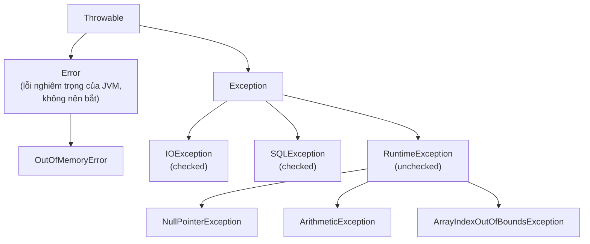

# 1. Xử lý ngoại lệ (Exception Handling)

Ngoại lệ (exception) là những sự kiện bất thường xảy ra khi chương trình đang chạy, như chia cho 0 hay mở file không tồn tại. Nếu không xử lý, chương trình sẽ dừng đột ngột; vì vậy Java cung cấp cơ chế `try-catch-finally` để bắt và xử lý lỗi một cách an toàn. Bài này giới thiệu `try/catch/finally`, `throw`/`throws`, checked vs unchecked, tự tạo ngoại lệ và `try-with-resources`; phần chi tiết nằm bên dưới.

[](pathname:///img/java/xu-ly-ngoai-le.webp)

---

:::note[Ghi nhớ nhanh]

- ⭐ **`try/catch/finally`** — tách luồng lỗi khỏi luồng chính, lỗi tự "nổi" lên đúng tầng xử lý và không thể bị "quên" như mã trả về.
- **`throw` vs `throws`** — `throw` ném ngoại lệ, `throws` khai báo phương thức có thể ném ngoại lệ đó.
- ⭐ **Checked vs Unchecked** — checked bị ép xử lý lúc biên dịch, unchecked (`RuntimeException`) thì không.
- **`try-with-resources`** — tự đóng tài nguyên (file, connection) kể cả khi có lỗi, tránh rò rỉ.
- **Custom Exception** — tạo lớp con của `Exception` để phân loại lỗi nghiệp vụ rõ ràng.

:::

---

## Mục lục

- [Vì sao có xử lý ngoại lệ?](#vì-sao-có-xử-lý-ngoại-lệ)
- [Ngoại lệ (Exception) là gì?](#ngoại-lệ-exception-là-gì)
- [Khối try / catch / finally](#khối-try--catch--finally)
- [Ném ngoại lệ với throw](#ném-ngoại-lệ-với-throw)
- [Khai báo ngoại lệ với throws](#khai-báo-ngoại-lệ-với-throws)
- [Checked vs Unchecked Exception](#checked-vs-unchecked-exception)
- [Tự tạo ngoại lệ (Custom Exception)](#tự-tạo-ngoại-lệ-custom-exception)
- [try-with-resources](#try-with-resources)
- [Lỗi thường gặp](#lỗi-thường-gặp)
- [Tóm tắt](#tóm-tắt)
- [Câu hỏi phỏng vấn](#câu-hỏi-phỏng-vấn)

---

## Vì sao có xử lý ngoại lệ?

**Vấn đề:** Nếu báo lỗi bằng **mã trả về**, code logic bị trộn lẫn với code kiểm lỗi ở mọi tầng. Lập trình viên rất dễ **quên kiểm tra** mã lỗi, khiến lỗi lan âm thầm làm sai dữ liệu hoặc sập app. Ngoài ra tài nguyên (file, connection) thường không được đóng khi có lỗi.

```java
// Báo lỗi bằng mã trả về: -1 nghĩa là lỗi
int docFile(String duongDan) {
    if (!fileTonTai(duongDan)) {
        return -1; // Lỗi: file không tồn tại
    }
    // ...đọc file...
    return 0; // Thành công
}

void xuLy() {
    int ma = docFile("data.txt");
    // QUÊN kiểm tra ma == -1 → lỗi lan âm thầm, dữ liệu sai
    int kt = ghiLog();   // tiếp tục dù bước trên đã lỗi
    int kt2 = guiEmail(); // mỗi lời gọi lại phải tự kiểm mã → code rối
}
```

**Giải pháp:** Java dùng cơ chế **exception**. `throw` ném lỗi ra, `try/catch/finally` tách luồng lỗi khỏi luồng chính; lỗi tự "nổi" lên đúng tầng biết cách xử lý. Java phân biệt **checked exception** (ép xử lý ngay lúc biên dịch) với **unchecked**, cho phép tạo **custom exception** để phân loại lỗi, và `try-with-resources` tự đóng tài nguyên.

```java
// Luồng chính sạch sẽ, luồng lỗi gom về một chỗ
void xuLy() {
    try {
        docFile("data.txt"); // nếu lỗi sẽ ném exception
        ghiLog();
        guiEmail();
    } catch (IOException e) {
        // Lỗi tự nổi lên đây, không thể bị quên
        System.out.println("Có lỗi: " + e.getMessage());
    }
}

// try-with-resources: tài nguyên tự đóng dù có lỗi hay không
void doc(String duongDan) throws IOException {
    try (BufferedReader br = new BufferedReader(new FileReader(duongDan))) {
        System.out.println(br.readLine());
    } // br được đóng tự động
}
```

:::tip[Dùng thực tế]

- **Bọc đọc file / gọi DB:** đặt thao tác dễ lỗi trong `try`, bắt `IOException` hay `SQLException` để báo lại rõ ràng thay vì để app sập.
- **Ném lỗi nghiệp vụ riêng:** tạo `TaiKhoanKhongDuTienException` rồi `throw` khi số dư không đủ, giúp tầng trên phân biệt loại lỗi.
- **Đóng connection an toàn:** dùng `try-with-resources` cho `Connection`, `Statement` để chắc chắn tài nguyên được giải phóng kể cả khi có lỗi.
- **Gom xử lý lỗi tập trung:** để lỗi "nổi" lên một lớp xử lý chung (ví dụ middleware/controller) thay vì kiểm mã lỗi rải rác khắp nơi.

:::

---

## Ngoại lệ (Exception) là gì?

**Ngoại lệ (Exception — sự kiện bất thường)** là một tình huống xảy ra trong khi chương trình đang chạy mà làm gián đoạn luồng thực thi bình thường. Hãy tưởng tượng bạn đang lái xe theo một lộ trình đã định, nhưng đột nhiên gặp một cây cầu bị sập — bạn buộc phải dừng lại và tìm cách xử lý. Ngoại lệ trong lập trình cũng giống như vậy.

Một số ví dụ đời thường về ngoại lệ:

- Bạn chia một số cho 0 (toán học không cho phép).
- Bạn cố mở một file không tồn tại.
- Bạn truy cập phần tử thứ 10 của một mảng chỉ có 5 phần tử.

Nếu không xử lý, ngoại lệ sẽ khiến chương trình **dừng đột ngột (crash)** và in ra một thông báo lỗi khó hiểu.

```java
public class ViDuNgoaiLe {
    public static void main(String[] args) {
        int a = 10;
        int b = 0;
        // Phép chia cho 0 sẽ ném ra ngoại lệ ArithmeticException
        int ketQua = a / b; // Chương trình dừng tại đây
        System.out.println("Kết quả: " + ketQua); // Dòng này không bao giờ chạy
    }
}
```

Khi chạy, Java sẽ in ra: `Exception in thread "main" java.lang.ArithmeticException: / by zero`.

---

## Khối try / catch / finally

Để xử lý ngoại lệ một cách an toàn, Java cung cấp ba từ khóa:

- **`try`** (thử): đặt đoạn code có thể gây lỗi vào đây.
- **`catch`** (bắt): bắt và xử lý lỗi nếu xảy ra.
- **`finally`** (cuối cùng): code trong này **luôn luôn** chạy, dù có lỗi hay không.

```java
public class ViDuTryCatch {
    public static void main(String[] args) {
        try {
            // Khối "thử" - chứa code có thể gây lỗi
            int a = 10;
            int b = 0;
            int ketQua = a / b; // Sẽ ném ngoại lệ tại đây
            System.out.println("Kết quả: " + ketQua);
        } catch (ArithmeticException e) {
            // Khối "bắt" - chạy khi có lỗi ArithmeticException
            System.out.println("Không thể chia cho 0!");
            System.out.println("Chi tiết lỗi: " + e.getMessage());
        } finally {
            // Khối "cuối cùng" - LUÔN chạy dù có lỗi hay không
            System.out.println("Đã hoàn tất xử lý phép tính.");
        }

        System.out.println("Chương trình tiếp tục chạy bình thường.");
    }
}
```

Bạn có thể bắt nhiều loại ngoại lệ khác nhau bằng nhiều khối `catch`:

```java
try {
    int[] mang = {1, 2, 3};
    System.out.println(mang[5]); // Lỗi truy cập ngoài mảng
} catch (ArithmeticException e) {
    System.out.println("Lỗi tính toán");
} catch (ArrayIndexOutOfBoundsException e) {
    // Bắt riêng lỗi truy cập mảng ngoài phạm vi
    System.out.println("Truy cập phần tử không tồn tại trong mảng");
}
```

---

## Ném ngoại lệ với throw

Từ khóa **`throw`** (ném) dùng để **chủ động** tạo ra một ngoại lệ. Bạn dùng nó khi muốn báo hiệu rằng có điều gì đó sai trong logic của mình.

```java
public class ViDuThrow {
    // Kiểm tra tuổi, nếu không hợp lệ thì ném ngoại lệ
    static void kiemTraTuoi(int tuoi) {
        if (tuoi < 0) {
            // Chủ động ném ngoại lệ với thông báo rõ ràng
            throw new IllegalArgumentException("Tuổi không thể là số âm: " + tuoi);
        }
        System.out.println("Tuổi hợp lệ: " + tuoi);
    }

    public static void main(String[] args) {
        kiemTraTuoi(25); // Hợp lệ
        kiemTraTuoi(-5); // Ném ngoại lệ
    }
}
```

---

## Khai báo ngoại lệ với throws

Từ khóa **`throws`** (khai báo có thể ném) được đặt ở chữ ký phương thức (method signature) để báo cho người gọi biết rằng phương thức này **có thể** ném ra ngoại lệ. Người gọi buộc phải xử lý nó.

```java
import java.io.IOException;

public class ViDuThrows {
    // Khai báo rằng phương thức này có thể ném IOException
    static void docFile(String tenFile) throws IOException {
        if (tenFile == null) {
            throw new IOException("Tên file không hợp lệ");
        }
        System.out.println("Đang đọc file: " + tenFile);
    }

    public static void main(String[] args) {
        try {
            docFile(null);
        } catch (IOException e) {
            // Bắt buộc phải xử lý vì docFile khai báo throws IOException
            System.out.println("Lỗi khi đọc file: " + e.getMessage());
        }
    }
}
```

Phân biệt nhanh: `throw` thực sự **ném** một ngoại lệ ngay lập tức; còn `throws` chỉ **khai báo** rằng phương thức có khả năng ném.

---

## Checked vs Unchecked Exception

Java chia ngoại lệ thành hai nhóm chính. Tất cả đều bắt nguồn từ lớp gốc `Throwable` — nhìn cây phân cấp dưới đây là thấy ngay nhóm nào checked, nhóm nào unchecked:



### Checked Exception (ngoại lệ được kiểm tra lúc biên dịch)

- Trình biên dịch (compiler) **bắt buộc** bạn phải xử lý (dùng try-catch hoặc khai báo throws).
- Thường liên quan đến tài nguyên bên ngoài: file, mạng, database.
- Ví dụ: `IOException`, `SQLException`.

### Unchecked Exception (ngoại lệ không bắt buộc kiểm tra)

- Trình biên dịch **không** bắt buộc xử lý.
- Thường do lỗi lập trình: chia cho 0, truy cập null, vượt mảng.
- Kế thừa từ `RuntimeException`.
- Ví dụ: `NullPointerException`, `ArithmeticException`, `ArrayIndexOutOfBoundsException`.

```java
// Checked: BẮT BUỘC khai báo throws hoặc dùng try-catch
static void viDuChecked() throws java.io.IOException {
    throw new java.io.IOException("Lỗi đọc/ghi");
}

// Unchecked: KHÔNG bắt buộc xử lý (nhưng nên tránh để xảy ra)
static void viDuUnchecked() {
    String text = null;
    System.out.println(text.length()); // NullPointerException
}
```

---

## Tự tạo ngoại lệ (Custom Exception)

Đôi khi các ngoại lệ có sẵn không mô tả đúng vấn đề của bạn. Bạn có thể tạo ngoại lệ riêng bằng cách kế thừa `Exception` (checked) hoặc `RuntimeException` (unchecked).

```java
// Tự tạo ngoại lệ cho nghiệp vụ rút tiền ngân hàng
class SoDuKhongDuException extends Exception {
    public SoDuKhongDuException(String thongBao) {
        super(thongBao); // Gọi constructor của lớp cha để lưu thông báo
    }
}

class TaiKhoan {
    private double soDu = 100_000;

    // Phương thức rút tiền có thể ném ngoại lệ tùy chỉnh
    void rutTien(double soTien) throws SoDuKhongDuException {
        if (soTien > soDu) {
            throw new SoDuKhongDuException(
                "Số dư không đủ. Số dư hiện tại: " + soDu);
        }
        soDu -= soTien;
        System.out.println("Rút thành công. Số dư còn lại: " + soDu);
    }
}
```

---

## try-with-resources

**`try-with-resources`** là cú pháp đặc biệt giúp **tự động đóng** các tài nguyên (resource) như file, kết nối database sau khi dùng xong, kể cả khi có lỗi xảy ra. Tài nguyên phải triển khai interface `AutoCloseable`.

```java
import java.io.BufferedReader;
import java.io.FileReader;
import java.io.IOException;

public class ViDuTryWithResources {
    public static void main(String[] args) {
        // Tài nguyên khai báo trong dấu ngoặc sẽ tự động được đóng
        try (BufferedReader reader = new BufferedReader(new FileReader("data.txt"))) {
            String dong = reader.readLine();
            System.out.println("Dòng đầu tiên: " + dong);
        } catch (IOException e) {
            System.out.println("Lỗi đọc file: " + e.getMessage());
        }
        // Không cần gọi reader.close() — Java tự đóng giúp bạn!
    }
}
```

So với cách cũ phải gọi `finally { reader.close(); }` thủ công, cách này gọn và an toàn hơn nhiều vì bạn không bao giờ quên đóng tài nguyên.

---

## Lỗi thường gặp

- **Bắt ngoại lệ rồi để trống (nuốt lỗi)**: viết `catch (Exception e) {}` mà không làm gì cả. Lỗi bị che giấu, cực kỳ khó debug. Luôn ghi log hoặc xử lý.
- **Bắt `Exception` quá chung chung**: nên bắt loại cụ thể (như `IOException`) để xử lý đúng cách.
- **Quên rằng `finally` luôn chạy**: nếu đặt `return` trong `finally`, nó có thể ghi đè giá trị trả về của `try`.
- **Dùng ngoại lệ cho luồng điều khiển thông thường**: ngoại lệ chỉ dành cho tình huống bất thường, không phải để thay thế `if-else`.
- **Quên đóng tài nguyên**: dùng `try-with-resources` thay vì đóng thủ công để tránh rò rỉ tài nguyên (resource leak).

---

## Tóm tắt

- **Ngoại lệ (Exception)** là sự kiện bất thường làm gián đoạn chương trình.
- **`try-catch-finally`**: thử code nguy hiểm, bắt lỗi, và chạy code dọn dẹp cuối cùng.
- **`throw`** chủ động ném ngoại lệ; **`throws`** khai báo phương thức có thể ném.
- **Checked exception** bắt buộc xử lý lúc biên dịch; **unchecked exception** thì không.
- Bạn có thể **tự tạo ngoại lệ** bằng cách kế thừa `Exception` hoặc `RuntimeException`.
- **`try-with-resources`** tự động đóng tài nguyên, giúp code an toàn và gọn gàng hơn.

---

## Câu hỏi phỏng vấn

Những câu thường gặp về chủ đề này. Tự trả lời trước, rồi bấm **Xem đáp án** để đối chiếu.

**1. Vì sao Java dùng cơ chế ngoại lệ (exception) thay vì báo lỗi bằng mã trả về (return code) như C truyền thống?**

<details className="qa">
<summary>Xem đáp án</summary>

- **Tách bạch luồng lỗi khỏi luồng logic chính**: code xử lý nghiệp vụ không bị trộn lẫn với hàng loạt `if (ma == -1)` kiểm tra lỗi ở mọi tầng gọi.
- **Không thể "quên" xử lý một cách âm thầm**: mã trả về có thể bị bỏ qua mà chương trình vẫn biên dịch và chạy (dù sai); ngoại lệ nếu không được bắt sẽ tự "nổi" (propagate) lên tầng trên, và nếu không ai xử lý thì chương trình dừng hẳn kèm thông báo rõ ràng — không có chuyện lỗi trôi qua trong im lặng.
- **Mang theo thông tin phong phú**: message mô tả lỗi, stack trace (dấu vết ngăn xếp gọi hàm) cho biết lỗi xảy ra ở đâu, và nguyên nhân gốc (`cause`) khi lỗi được bọc qua nhiều tầng.
- **Checked exception ép kiểm tra lúc biên dịch**: với các lỗi quan trọng (I/O, DB), compiler bắt buộc phải xử lý hoặc khai báo `throws`, giảm khả năng quên.

</details>

**2. Phân biệt checked exception và unchecked exception. Cho ví dụ mỗi loại.**

<details className="qa">
<summary>Xem đáp án</summary>

| | Checked Exception | Unchecked Exception |
|---|---|---|
| Kiểm tra lúc biên dịch | Bắt buộc (`try-catch` hoặc `throws`) | Không bắt buộc |
| Kế thừa từ | `Exception` (trừ nhánh `RuntimeException`) | `RuntimeException` |
| Nguyên nhân điển hình | Sự cố bên ngoài, khó lường trước (file không tồn tại, mất kết nối mạng) | Lỗi lập trình (bug) |
| Ví dụ | `IOException`, `SQLException` | `NullPointerException`, `ArithmeticException`, `ArrayIndexOutOfBoundsException`, `IllegalArgumentException` |

- Checked exception dùng cho những tình huống **người gọi nên và có thể xử lý** (ví dụ: thử kết nối lại khi mất mạng).
- Unchecked exception thường báo hiệu **lỗi logic của lập trình viên** — về nguyên tắc nên sửa code chứ không phải `catch` để che đi.

</details>

**3. Phân biệt `throw` và `throws`.**

<details className="qa">
<summary>Xem đáp án</summary>

| | `throw` | `throws` |
|---|---|---|
| Vị trí | Trong thân phương thức | Trên chữ ký (signature) phương thức |
| Tác dụng | **Ném thật** một đối tượng ngoại lệ ngay lập tức | **Khai báo** rằng phương thức có khả năng ném ra ngoại lệ đó |
| Số lượng | Chỉ ném một đối tượng mỗi lần | Có thể khai báo nhiều loại, cách nhau bằng dấu phẩy |

```java
// throws: khai báo trên chữ ký
static void doc(String path) throws java.io.IOException {
    if (path == null) {
        // throw: ném thật một đối tượng cụ thể
        throw new java.io.IOException("Đường dẫn null");
    }
}
```

</details>

**4. `Error` khác `Exception` như thế nào trong cây `Throwable`? Có nên viết `catch (Error e)` không?**

<details className="qa">
<summary>Xem đáp án</summary>

Cả hai đều kế thừa từ `Throwable`, nhưng mang ý nghĩa khác nhau:

- **`Exception`**: sự cố ở tầng ứng dụng, thường **có thể phục hồi** được (đọc lại file, thử lại kết nối...). Đây là loại nên `catch` và xử lý.
- **`Error`**: sự cố **nghiêm trọng ở tầng JVM/hệ thống**, ví dụ `OutOfMemoryError` (hết bộ nhớ) hay `StackOverflowError` (tràn ngăn xếp do đệ quy vô hạn). Những lỗi này thường **không thể phục hồi** một cách đáng tin cậy bằng code ứng dụng.
- **Không nên** viết `catch (Error e)` (hay tệ hơn là `catch (Throwable e)`) để "nuốt" và cố chạy tiếp — chương trình đang ở trạng thái không ổn định, cố gắng tiếp tục có thể gây hậu quả khó lường hơn là để nó dừng lại.

</details>

**5. Đoạn code sau in ra gì?**

```java
public class Test {
    static int demo() {
        try {
            return 1;
        } finally {
            return 2;
        }
    }

    public static void main(String[] args) {
        System.out.println(demo());
    }
}
```

<details className="qa">
<summary>Xem đáp án</summary>

In ra **`2`**.

- Khối `try` chuẩn bị trả về `1`, nhưng trước khi giá trị đó thực sự được trả về, `finally` luôn được thực thi.
- Vì `finally` ở đây có một `return 2;` riêng, nó **ghi đè** hoàn toàn giá trị trả về của `try` — giá trị `1` bị bỏ qua.
- Đây là lý do vì sao đặt `return` (hoặc `throw`) bên trong `finally` bị coi là **anti-pattern** nguy hiểm: nó có thể âm thầm nuốt mất kết quả hoặc ngoại lệ từ khối `try`/`catch`.

</details>

**6. Nếu cả thân khối `try-with-resources` và phương thức `close()` của resource đều ném ngoại lệ, ngoại lệ nào được ném ra cho người gọi? Ngoại lệ còn lại đi đâu?**

<details className="qa">
<summary>Xem đáp án</summary>

Ngoại lệ từ **thân khối `try`** được ném ra cho người gọi; ngoại lệ từ `close()` bị **"nén" (suppressed)** vào ngoại lệ chính, có thể lấy lại bằng `getSuppressed()`.

```java
class TaiNguyenLoi implements AutoCloseable {
    @Override
    public void close() {
        throw new IllegalStateException("Lỗi khi đóng");
    }
}

public class Test {
    public static void main(String[] args) {
        try (TaiNguyenLoi r = new TaiNguyenLoi()) {
            throw new RuntimeException("Lỗi trong thân try");
        } catch (RuntimeException e) {
            System.out.println("Bắt được: " + e.getMessage()); // "Lỗi trong thân try"
            for (Throwable s : e.getSuppressed()) {
                System.out.println("Bị nén: " + s.getMessage()); // "Lỗi khi đóng"
            }
        }
    }
}
```

- Java ưu tiên giữ lại ngoại lệ **gốc** (có ý nghĩa nghiệp vụ hơn, thường xảy ra trước) làm ngoại lệ chính, tránh việc lỗi đóng tài nguyên che mất lỗi thật sự gây ra vấn đề.

</details>

**7. Vì sao viết `catch (Exception e) {}` (bắt rồi để trống) bị coi là một anti-pattern nghiêm trọng?**

<details className="qa">
<summary>Xem đáp án</summary>

- **Nuốt lỗi hoàn toàn**: chương trình tiếp tục chạy như không có gì xảy ra, trong khi trạng thái nội bộ có thể đã sai lệch.
- **Cực kỳ khó debug**: khi hệ thống có hành vi bất thường về sau, không có bất kỳ dấu vết (log, stack trace) nào chỉ ra nguyên nhân gốc.
- **Che giấu lỗi nghiêm trọng lẫn lỗi nhỏ như nhau**: `catch (Exception e)` bắt luôn cả những lỗi không liên quan tới ý định ban đầu.
- **Cách làm đúng tối thiểu**: luôn ghi log (`logger.error("...", e)`), và cân nhắc rethrow dưới dạng ngoại lệ phù hợp hơn nếu tầng hiện tại không đủ khả năng xử lý.

</details>

**8. Khi tự tạo custom exception, nên kế thừa `Exception` (checked) hay `RuntimeException` (unchecked)? Dựa vào tiêu chí nào để quyết định?**

<details className="qa">
<summary>Xem đáp án</summary>

Không có quy tắc tuyệt đối, nhưng tiêu chí thường dùng:

- Kế thừa **`Exception`** (checked) khi lỗi là tình huống **người gọi có khả năng và nên xử lý ngay tại chỗ gọi**, ví dụ `TaiKhoanKhongTonTaiException` khi tra cứu — người gọi có thể bắt và hiển thị thông báo phù hợp.
- Kế thừa **`RuntimeException`** (unchecked) khi lỗi phản ánh **vi phạm hợp đồng/logic lập trình** mà việc bắt buộc `try-catch` ở mọi nơi gọi chỉ gây phiền toái, ví dụ lỗi validate tham số đầu vào không hợp lệ.
- Nhiều framework hiện đại (Spring, JPA) có xu hướng **ưu tiên unchecked exception** ngay cả cho lỗi nghiệp vụ, vì checked exception buộc mọi tầng gọi phải khai báo `throws` hoặc bắt, gây "ô nhiễm" chữ ký phương thức qua nhiều lớp kiến trúc (đặc biệt khó khi dùng cùng Stream API, vì lambda không khai báo được `throws` cho checked exception).

</details>

**9. Java 7 cho phép bắt nhiều loại ngoại lệ trong cùng một khối `catch` bằng cú pháp nào? Có ràng buộc gì?**

<details className="qa">
<summary>Xem đáp án</summary>

**Multi-catch**, dùng dấu `|` để liệt kê nhiều loại trong một khối `catch`:

```java
try {
    xuLy();
} catch (java.io.IOException | java.sql.SQLException e) {
    // Xử lý chung cho cả hai loại
    System.out.println("Lỗi: " + e.getMessage());
}
```

- Các loại liệt kê phải **không có quan hệ cha-con** với nhau (ví dụ không được viết `IOException | FileNotFoundException` vì `FileNotFoundException` đã là con của `IOException`).
- Biến `e` trong khối multi-catch được compiler suy ra kiểu là **giao (LUB — least upper bound)** của các loại, và biến này **effectively final** (không được gán lại).
- Lợi ích: tránh lặp code xử lý giống hệt nhau ở nhiều khối `catch` riêng lẻ.

</details>

**10. Tình huống: bạn xây một API rút tiền ngân hàng. Có nên dùng exception để báo "số dư không đủ", hay nên trả về một kiểu kết quả (ví dụ `Result`/`Optional`) thay vì ném lỗi? Phân tích trade-off.**

<details className="qa">
<summary>Xem đáp án</summary>

Cả hai cách đều hợp lý tùy ngữ cảnh, quan trọng là **exception nên dành cho tình huống thực sự bất thường**, không phải để thay thế luồng điều khiển (`if-else`) thông thường:

- **Dùng exception** (`SoDuKhongDuException`) khi "số dư không đủ" là **hiếm gặp** và cần dừng luồng xử lý ngay, buộc mọi tầng gọi phải chú ý xử lý (đặc biệt hợp với checked exception ở đây).
- **Dùng kiểu kết quả** (`Result`, hoặc đơn giản là trả về một đối tượng có cờ `thanhCong`) khi tình huống "số dư không đủ" là **một nhánh nghiệp vụ bình thường**, xảy ra thường xuyên (ví dụ trong flow kiểm tra hạn mức trước khi cho phép giao dịch) — dùng exception cho luồng điều khiển thông thường sẽ **tốn hiệu năng** hơn (do JVM phải tạo stack trace) và làm code khó đọc theo kiểu "nhảy" bất ngờ.
- Nguyên tắc chung: **exception cho lỗi (điều không nên xảy ra)**, **kiểu kết quả/giá trị cho các nhánh nghiệp vụ dự kiến trước**.

</details>

**11. Trong kiến trúc nhiều tầng (Controller → Service → Repository), khi tầng Repository ném `SQLException` (checked), tầng Service nên xử lý thế nào để không làm "rò rỉ" chi tiết công nghệ (JDBC) lên tầng trên?**

<details className="qa">
<summary>Xem đáp án</summary>

Nên **bọc (wrap)** ngoại lệ tầng thấp thành một ngoại lệ nghiệp vụ ở tầng cao hơn, vẫn giữ nguyên nhân gốc để không mất thông tin debug:

```java
class DuLieuException extends RuntimeException {
    public DuLieuException(String thongBao, Throwable nguyenNhan) {
        super(thongBao, nguyenNhan); // giữ lại cause gốc
    }
}

class NguoiDungService {
    NguoiDung timNguoiDung(int id) {
        try {
            return repository.timTheoId(id); // ném SQLException (checked)
        } catch (java.sql.SQLException e) {
            // Bọc lại thành ngoại lệ tầng nghiệp vụ, không lộ SQLException ra Controller
            throw new DuLieuException("Không thể tìm người dùng " + id, e);
        }
    }
}
```

- **Lợi ích**: tầng Controller/API không cần biết Repository đang dùng JDBC hay JPA hay công nghệ gì khác — nó chỉ cần biết "có lỗi dữ liệu".
- Truyền `e` vào constructor `super(message, cause)` để giữ **nguyên nhân gốc (cause)** — khi debug vẫn xem được đầy đủ stack trace ban đầu qua `getCause()`, thay vì mất dấu vết.
- Cách này cũng giúp gom nhiều loại lỗi công nghệ khác nhau (SQL, kết nối, timeout...) về một loại exception nghiệp vụ thống nhất mà tầng trên dễ xử lý.

</details>
