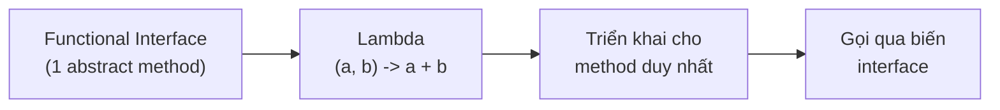

# 2. Biểu thức Lambda (Lambda Expressions)

Biểu thức Lambda (có từ Java 8) là cách viết ngắn gọn cho một hàm ẩn danh, tức một đoạn code có thể truyền đi như tham số. Nó giúp thay thế các anonymous class dài dòng, làm code gọn gàng hơn nhiều khi cần truyền hành vi vào phương thức. Bài này giới thiệu cú pháp lambda, functional interface, các ví dụ với `Runnable`, `Comparator` và cách capture biến; phần chi tiết nằm bên dưới.

[](pathname:///img/java/lambda-expressions.webp)

---

:::note[Ghi nhớ nhanh]

- ⭐ **Lambda (Java 8)** — cú pháp ngắn gọn triển khai một functional interface, coi hàm như dữ liệu truyền đi được.
- **Functional interface** — interface chỉ có đúng một phương thức trừu tượng (vd `Runnable`, `Comparator`).
- **Thay anonymous class** — gọn hơn nhiều: `(s1, s2) -> s1.length() - s2.length()`.
- **Capture biến** — lambda bắt được biến ngoài nhưng biến phải là `final` hoặc effectively final.
- ⭐ **Nền tảng Stream** — kết hợp với `map`/`filter` và method reference cho lập trình hàm.

:::

---

## Mục lục

- [Vì sao có lambda expression?](#vì-sao-có-lambda-expression)
- [Biểu thức Lambda là gì?](#biểu-thức-lambda-là-gì)
- [Cú pháp Lambda](#cú-pháp-lambda)
- [Functional Interface (giao diện hàm)](#functional-interface-giao-diện-hàm)
- [Lambda thay thế Anonymous Class](#lambda-thay-thế-anonymous-class)
- [Ví dụ với Runnable](#ví-dụ-với-runnable)
- [Ví dụ với Comparator](#ví-dụ-với-comparator)
- [Capture biến (bắt biến từ bên ngoài)](#capture-biến-bắt-biến-từ-bên-ngoài)
- [Lỗi thường gặp](#lỗi-thường-gặp)
- [Tóm tắt](#tóm-tắt)
- [Câu hỏi phỏng vấn](#câu-hỏi-phỏng-vấn)

---

## Vì sao có lambda expression?

**Vấn đề:** Trước Java 8, để **truyền hành vi** (ví dụ cách so sánh, việc cần chạy) vào một phương thức, bạn phải tạo **anonymous class** dài dòng — cả chục dòng chỉ cho một hành vi đơn giản, làm che lấp ý chính.

```java
// Chỉ muốn so sánh theo độ dài, nhưng phải viết cả khối anonymous class
Collections.sort(ten, new Comparator<String>() {
    @Override
    public int compare(String s1, String s2) {
        return s1.length() - s2.length();
    }
});
```

**Giải pháp:** **Lambda** (Java 8) là biểu thức ngắn gọn triển khai một functional interface (interface chỉ có một phương thức trừu tượng). Nó coi **hàm như dữ liệu** truyền đi được, kết hợp tốt với method reference và là nền tảng cho Stream / lập trình hàm.

```java
// Cùng hành vi, gọn trong một dòng
Collections.sort(ten, (s1, s2) -> s1.length() - s2.length());
```

:::tip[Dùng thực tế]

- **Comparator** gọn để sắp xếp danh sách: `list.sort((a, b) -> a - b)`.
- **Runnable** cho tác vụ chạy trong thread: `new Thread(() -> doWork()).start()`.
- **Callback / xử lý sự kiện**: truyền hành vi chạy khi có sự kiện (vd nút bấm).
- **map / filter trong Stream**: `list.stream().filter(x -> x > 0).map(x -> x * 2)`.

:::

---

## Biểu thức Lambda là gì?

**Biểu thức Lambda (Lambda Expression)** là một cách viết ngắn gọn để biểu diễn một hàm (function) ẩn danh — tức là một đoạn code có thể được truyền đi như một tham số. Nó được giới thiệu từ **Java 8**.

Hãy tưởng tượng bạn muốn nhờ ai đó làm một việc nhỏ. Thay vì viết cả một bản hợp đồng dài (như cách cũ), bạn chỉ cần ghi một mẩu giấy nhắn: "Hãy in ra dòng chữ Xin chào". Lambda chính là mẩu giấy nhắn ngắn gọn đó.

Trước Java 8, để truyền một hành vi (behavior) vào một phương thức, bạn phải viết rất nhiều code rườm rà. Lambda giúp việc này gọn hơn rất nhiều.

---

## Cú pháp Lambda

Cú pháp cơ bản gồm ba phần: **tham số**, **mũi tên `->`**, và **phần thân**.

```text
(thamSo1, thamSo2) -> { phầnThân }
```

Ví dụ cụ thể:

```java
public class ViDuCuPhap {
    public static void main(String[] args) {
        // Lambda không có tham số
        Runnable r = () -> System.out.println("Xin chào");

        // Lambda có một tham số (không cần ngoặc đơn nếu chỉ 1 tham số)
        // x -> x * x nghĩa là: nhận x, trả về x bình phương

        // Lambda có nhiều tham số và thân nhiều dòng
        java.util.function.BinaryOperator<Integer> cong = (a, b) -> {
            int tong = a + b; // Tính tổng hai số
            return tong;      // Trả về kết quả
        };

        r.run(); // In ra: Xin chào
        System.out.println(cong.apply(3, 5)); // In ra: 8
    }
}
```

Quy tắc rút gọn:

- Nếu chỉ có **một tham số**, có thể bỏ dấu ngoặc đơn: `x -> x * 2`.
- Nếu thân chỉ có **một dòng**, có thể bỏ dấu `{}` và `return`: `(a, b) -> a + b`.

---

## Functional Interface (giao diện hàm)

Lambda chỉ hoạt động với **Functional Interface (giao diện hàm)** — là một interface chỉ có **đúng một** phương thức trừu tượng (abstract method). Lambda chính là phần triển khai cho phương thức duy nhất đó.

```java
// Đánh dấu @FunctionalInterface để compiler kiểm tra giúp
@FunctionalInterface
interface PhepTinh {
    // Chỉ có DUY NHẤT một phương thức trừu tượng
    int tinh(int a, int b);
}

public class ViDuFunctionalInterface {
    public static void main(String[] args) {
        // Lambda triển khai phương thức tinh()
        PhepTinh cong = (a, b) -> a + b;
        PhepTinh nhan = (a, b) -> a * b;

        System.out.println(cong.tinh(4, 6)); // 10
        System.out.println(nhan.tinh(4, 6)); // 24
    }
}
```

Java cung cấp sẵn nhiều functional interface trong package `java.util.function` như `Function`, `Predicate`, `Consumer`, `Supplier`.

Sơ đồ dưới đây minh hoạ lambda chính là phần triển khai cho phương thức trừu tượng duy nhất của một functional interface:



---

## Lambda thay thế Anonymous Class

**Anonymous Class (lớp ẩn danh)** là lớp không có tên, được tạo ngay tại chỗ. Trước Java 8, đây là cách phổ biến để truyền hành vi. Lambda giúp viết gọn hơn nhiều.

```java
public class ViDuSoSanh {
    public static void main(String[] args) {
        // CÁCH CŨ: dùng anonymous class - dài dòng
        Runnable cu = new Runnable() {
            @Override
            public void run() {
                System.out.println("Chạy bằng anonymous class");
            }
        };

        // CÁCH MỚI: dùng lambda - ngắn gọn
        Runnable moi = () -> System.out.println("Chạy bằng lambda");

        cu.run();
        moi.run();
    }
}
```

Cả hai làm cùng một việc, nhưng lambda chỉ cần một dòng thay vì sáu dòng.

---

## Ví dụ với Runnable

`Runnable` là một functional interface thường dùng để định nghĩa một tác vụ chạy trong luồng (thread).

```java
public class ViDuRunnable {
    public static void main(String[] args) {
        // Định nghĩa tác vụ bằng lambda
        Runnable tacVu = () -> {
            System.out.println("Đang chạy trong một luồng riêng");
        };

        // Tạo và khởi chạy luồng mới với tác vụ trên
        Thread luong = new Thread(tacVu);
        luong.start();

        System.out.println("Luồng chính vẫn tiếp tục chạy");
    }
}
```

---

## Ví dụ với Comparator

`Comparator` là functional interface dùng để so sánh, thường dùng khi sắp xếp danh sách.

```java
import java.util.ArrayList;
import java.util.Collections;
import java.util.List;

public class ViDuComparator {
    public static void main(String[] args) {
        List<String> ten = new ArrayList<>(List.of("Cường", "An", "Bình"));

        // Sắp xếp theo độ dài chuỗi bằng lambda
        // (s1, s2) -> so sánh độ dài của s1 và s2
        Collections.sort(ten, (s1, s2) -> s1.length() - s2.length());
        System.out.println("Sắp theo độ dài: " + ten);

        // Sắp xếp theo bảng chữ cái
        Collections.sort(ten, (s1, s2) -> s1.compareTo(s2));
        System.out.println("Sắp theo chữ cái: " + ten);
    }
}
```

---

## Capture biến (bắt biến từ bên ngoài)

Lambda có thể **capture (bắt)** — tức là sử dụng — các biến từ phạm vi bên ngoài. Tuy nhiên, biến đó phải là **final** hoặc **effectively final** (thực tế không thay đổi sau khi gán).

```java
public class ViDuCapture {
    public static void main(String[] args) {
        String loiChao = "Xin chào"; // Biến này thực tế không bị thay đổi
        int soLan = 3;

        // Lambda "bắt" biến loiChao và soLan từ bên ngoài
        Runnable inLoiChao = () -> {
            for (int i = 0; i < soLan; i++) {
                System.out.println(loiChao + " lần " + (i + 1));
            }
        };

        inLoiChao.run();

        // LƯU Ý: nếu gán lại loiChao = "Tạm biệt"; ở đây
        // thì compiler sẽ báo lỗi vì lambda đã bắt biến này
    }
}
```

Lý do của quy tắc này: lambda có thể chạy ở thời điểm khác (ví dụ trong luồng khác), nên Java yêu cầu biến được bắt phải có giá trị ổn định để tránh kết quả khó lường.

---

## Lỗi thường gặp

- **Dùng lambda với interface có nhiều phương thức trừu tượng**: lambda chỉ dùng được với functional interface (đúng một phương thức trừu tượng).
- **Thay đổi biến đã capture**: gán lại giá trị cho biến mà lambda đã bắt sẽ gây lỗi biên dịch.
- **Quên `return` trong thân nhiều dòng**: khi dùng dấu `{}`, nếu cần trả về giá trị thì phải viết `return` rõ ràng.
- **Viết quá phức tạp trong lambda**: nếu logic dài, hãy tách ra thành phương thức riêng để dễ đọc.
- **Nhầm `->` với toán tử khác**: dấu mũi tên `->` là đặc trưng của lambda, không phải phép toán.

---

## Tóm tắt

- **Biểu thức Lambda** là cách viết ngắn gọn cho một hàm ẩn danh, có từ Java 8.
- Cú pháp: `(tham số) -> { thân hàm }`, có thể rút gọn khi đơn giản.
- Lambda chỉ hoạt động với **Functional Interface** (interface có đúng một phương thức trừu tượng).
- Lambda thay thế **anonymous class** giúp code gọn hơn nhiều.
- Thường dùng với `Runnable`, `Comparator` và các interface trong `java.util.function`.
- Lambda có thể **capture** biến bên ngoài nhưng biến đó phải **effectively final**.

---

## Câu hỏi phỏng vấn

Những câu thường gặp về chủ đề này. Tự trả lời trước, rồi bấm **Xem đáp án** để đối chiếu.

**1. Biểu thức Lambda là gì? Cú pháp cơ bản gồm những phần nào?**

<details className="qa">
<summary>Xem đáp án</summary>

**Lambda expression** là cách viết ngắn gọn cho một hàm ẩn danh (không tên), được giới thiệu từ **Java 8**, dùng để truyền hành vi (behavior) đi như một tham số.

Cú pháp gồm ba phần: `(tham số) -> { thân hàm }`.

```java
(a, b) -> a + b;                 // Rút gọn: 1 dòng, tự return
x -> x * x;                      // Rút gọn: 1 tham số, bỏ ngoặc đơn
() -> System.out.println("Hi");  // Không tham số
(a, b) -> {                      // Thân nhiều dòng, cần return rõ ràng
    int tong = a + b;
    return tong;
};
```

</details>

**2. Functional interface là gì? Vì sao lambda chỉ hoạt động được với nó?**

<details className="qa">
<summary>Xem đáp án</summary>

**Functional interface** (giao diện hàm) là một interface chỉ có **đúng một** phương thức trừu tượng (`abstract method`) — dù có thể có thêm các `default`/`static method`.

- Lambda thực chất là **phần triển khai (implementation)** cho đúng phương thức trừu tượng duy nhất đó, nên compiler cần biết chính xác "khuôn" (kiểu tham số, kiểu trả về) để suy luận — điều này chỉ rõ ràng khi interface có duy nhất một phương thức trừu tượng.
- Annotation `@FunctionalInterface` không bắt buộc nhưng nên dùng: nó khiến compiler báo lỗi ngay nếu ai đó vô tình thêm phương thức trừu tượng thứ hai, phá vỡ khả năng dùng lambda.
- Ví dụ có sẵn: `Runnable`, `Comparator`, `Callable`, và các interface trong `java.util.function`.

</details>

**3. So sánh lambda và anonymous class (lớp ẩn danh). Nêu ít nhất hai khác biệt quan trọng ngoài việc lambda ngắn hơn.**

<details className="qa">
<summary>Xem đáp án</summary>

| | Lambda | Anonymous class |
|---|---|---|
| `this` bên trong | Trỏ tới **đối tượng bao ngoài (enclosing instance)** | Trỏ tới **chính đối tượng anonymous class** đó |
| Tạo instance mới | Có thể được JVM tối ưu, không nhất thiết tạo object mới mỗi lần gọi | Luôn tạo một `.class` file riêng và một object mới mỗi lần khởi tạo |
| Phạm vi áp dụng | Chỉ dùng được với **functional interface** (1 phương thức trừu tượng) | Dùng được với bất kỳ interface hoặc lớp trừu tượng nào, kể cả nhiều phương thức |
| Khai báo biến mới | Không tạo scope lồng mới cho tên biến (biến trùng tên với lớp ngoài sẽ báo lỗi) | Tạo một scope class riêng |

- Khác biệt về `this` là điểm hay bị hỏi nhất: trong anonymous class, `this.ten` (nếu có field `ten`) sẽ ưu tiên field của chính anonymous class; còn trong lambda, `this` "xuyên qua" và trỏ về đối tượng chứa lambda đó.

</details>

**4. "Effectively final" nghĩa là gì? Vì sao lambda chỉ capture (bắt) được biến effectively final?**

<details className="qa">
<summary>Xem đáp án</summary>

**Effectively final** là một biến **không có từ khóa `final`** nhưng **thực tế không bao giờ bị gán lại giá trị** sau khi khởi tạo — về mặt ngữ nghĩa, nó tương đương với `final`.

```java
int soLan = 3; // không có từ khóa final
Runnable r = () -> System.out.println(soLan); // OK vì soLan effectively final

// soLan = 5; // Nếu bỏ comment dòng này -> lỗi biên dịch!
// Vì lúc đó soLan không còn effectively final nữa
```

- Lý do ràng buộc này: lambda có thể được **chạy ở một thời điểm khác**, thậm chí trên **luồng khác** với nơi nó được tạo ra. Nếu cho phép capture biến có thể thay đổi, giá trị lambda "nhìn thấy" sẽ không xác định (tùy thời điểm chạy) — Java loại bỏ hẳn rủi ro này bằng cách bắt buộc giá trị phải cố định tại thời điểm capture.
- Lambda thực chất **copy giá trị** của biến tại thời điểm capture, chứ không giữ tham chiếu tới chính biến cục bộ đó (khác với capture field của object, có thể thay đổi được qua getter/setter).

</details>

**5. Method reference là gì? Liệt kê các loại phổ biến kèm ví dụ.**

<details className="qa">
<summary>Xem đáp án</summary>

**Method reference** (`::`) là cú pháp rút gọn hơn nữa cho lambda khi thân lambda chỉ đơn giản là **gọi lại một phương thức có sẵn**.

| Loại | Ví dụ lambda | Method reference |
|---|---|---|
| Static method | `x -> Integer.parseInt(x)` | `Integer::parseInt` |
| Instance method của một đối tượng cụ thể | `x -> System.out.println(x)` | `System.out::println` |
| Instance method của tham số đầu tiên (unbound) | `s -> s.toUpperCase()` | `String::toUpperCase` |
| Constructor reference | `() -> new ArrayList<>()` | `ArrayList::new` |

```java
List<String> ten = List.of("cuong", "an", "binh");
ten.stream().map(String::toUpperCase).forEach(System.out::println);
```

</details>

**6. Kể tên và nêu công dụng bốn functional interface cơ bản nhất trong package `java.util.function`.**

<details className="qa">
<summary>Xem đáp án</summary>

| Interface | Phương thức trừu tượng | Ý nghĩa |
|---|---|---|
| `Function<T, R>` | `R apply(T t)` | Nhận một giá trị kiểu `T`, trả về giá trị kiểu `R` (biến đổi/ánh xạ) |
| `Predicate<T>` | `boolean test(T t)` | Nhận một giá trị, trả về `true`/`false` (kiểm tra điều kiện) |
| `Consumer<T>` | `void accept(T t)` | Nhận một giá trị, không trả về gì (thực hiện hành động) |
| `Supplier<T>` | `T get()` | Không nhận gì, trả về một giá trị (cung cấp/tạo giá trị) |

```java
Function<Integer, Integer> nhanDoi = x -> x * 2;
Predicate<Integer> laSoDuong = x -> x > 0;
Consumer<String> inRa = System.out::println;
Supplier<String> taoChuoi = () -> "Xin chào";
```

Đây chính là các interface nền tảng cho `map` (`Function`), `filter` (`Predicate`), `forEach` (`Consumer`) trong Stream API.

</details>

**7. Đoạn code sau có biên dịch được không? Vì sao?**

```java
public class Test {
    public static void main(String[] args) {
        Runnable[] tacVu = new Runnable[3];
        for (int i = 0; i < 3; i++) {
            int gia = i; // biến effectively final RIÊNG cho mỗi vòng lặp
            tacVu[i] = () -> System.out.println("Giá trị: " + gia);
        }
        for (Runnable r : tacVu) {
            r.run();
        }
    }
}
```

<details className="qa">
<summary>Xem đáp án</summary>

**Biên dịch được** và in ra `Giá trị: 0`, `Giá trị: 1`, `Giá trị: 2`.

- Mấu chốt là dòng `int gia = i;` bên trong thân vòng lặp: mỗi lần lặp, một biến `gia` **mới** được khai báo và gán giá trị một lần duy nhất, nên nó là effectively final trong phạm vi (scope) của lần lặp đó — dù `i` (biến điều khiển vòng lặp) liên tục thay đổi.
- Nếu bỏ dòng `int gia = i;` và lambda cố capture trực tiếp biến `i` của vòng lặp `for` kiểu C (biến bị thay đổi mỗi vòng), code sẽ **báo lỗi biên dịch** vì `i` không phải effectively final.
- Đây là lý do lambda trong vòng lặp `for-each` (`for (String s : list)`) luôn an toàn để capture biến lặp — mỗi vòng, biến đó được coi như một biến effectively final riêng biệt.

</details>

**8. Trong đoạn code sau, `this.ten` bên trong lambda và bên trong anonymous class lần lượt tham chiếu tới đối tượng nào?**

```java
class ViDu {
    String ten = "Ngoài";

    Runnable dungLambda() {
        return () -> System.out.println(this.ten);
    }

    Runnable dungAnonymous() {
        return new Runnable() {
            String ten = "Trong";
            @Override
            public void run() {
                System.out.println(this.ten);
            }
        };
    }
}
```

<details className="qa">
<summary>Xem đáp án</summary>

- `dungLambda().run()` in ra **`"Ngoài"`**: lambda **không tạo scope `this` riêng**, nên `this` bên trong lambda chính là `this` của đối tượng `ViDu` bao ngoài.
- `dungAnonymous().run()` in ra **`"Trong"`**: anonymous class **tạo ra một lớp con thật sự** của `Runnable`, nên nó có `this` của riêng nó, và field `ten` tự khai báo (`"Trong"`) che khuất (shadow) field `ten` của lớp ngoài.
- Đây là khác biệt ngữ nghĩa quan trọng thường bị bỏ qua khi chỉ nghĩ lambda là "anonymous class viết gọn hơn".

</details>

**9. Khi nào KHÔNG nên viết logic phức tạp trực tiếp bên trong một biểu thức lambda?**

<details className="qa">
<summary>Xem đáp án</summary>

Nên tách lambda phức tạp ra thành một **phương thức riêng có tên rõ ràng** (rồi dùng method reference) khi:

- Thân lambda có **nhiều bước logic, rẽ nhánh, hoặc lồng nhiều lambda khác** — khó đọc khi nằm giữa một chuỗi Stream dài.
- Logic đó **cần được test độc lập** (unit test) — một method riêng dễ viết test hơn một lambda ẩn danh nằm giữa code.
- Logic đó **được tái sử dụng ở nhiều nơi** — tách ra tránh lặp code.
- Ví dụ cải thiện:

```java
// Khó đọc: logic phức tạp nhồi hết vào lambda
list.stream().filter(x -> x.getTuoi() > 18 && x.getDiem() >= 5 && !x.daNghiHoc()).toList();

// Rõ ràng hơn: tách thành method có tên
list.stream().filter(HocSinh::duDieuKienTotNghiep).toList();
```

</details>

**10. Lambda có tự động cache/tái sử dụng instance khi không capture biến ngoài nào không? Điều này ảnh hưởng thế nào tới hiệu năng khi tạo lambda trong vòng lặp lớn?**

<details className="qa">
<summary>Xem đáp án</summary>

- Với lambda **không capture** biến nào từ môi trường xung quanh (stateless), JVM **có thể** (nhưng không đảm bảo theo đặc tả) tái sử dụng cùng một instance đã tạo, vì hành vi của nó không phụ thuộc ngữ cảnh — tương tự như một hằng số.
- Với lambda **có capture** biến ngoài, mỗi lần biểu thức lambda được thực thi (ví dụ mỗi vòng lặp) sẽ tạo ra **một instance mới** giữ giá trị capture riêng — không thể tái sử dụng vì mỗi instance mang dữ liệu khác nhau.
- Về thực tế: chi phí tạo lambda **rất nhỏ** so với anonymous class cũ (JVM dùng cơ chế `invokedynamic` để sinh lambda hiệu quả hơn là tạo hẳn một `.class` file), nên trong tuyệt đại đa số trường hợp không cần lo lắng về hiệu năng khi dùng lambda trong vòng lặp — chỉ cần tránh capture những đối tượng nặng một cách không cần thiết.

</details>
