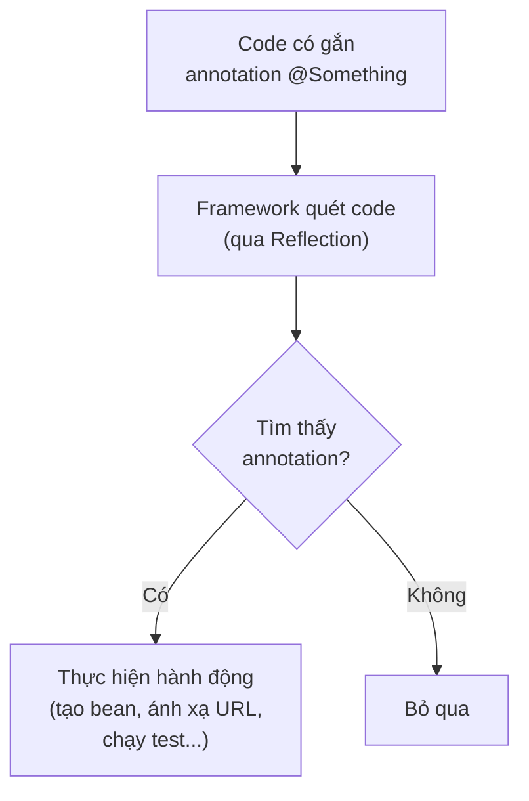

# 3. Chú thích (Annotations)

Annotation (chú thích) là một dạng "nhãn dán" metadata mà bạn gắn vào lớp, phương thức hay biến. Bản thân nó không thay đổi cách code chạy, nhưng cung cấp thông tin cho trình biên dịch, công cụ hoặc framework xử lý. Bài này giới thiệu các annotation có sẵn như `@Override`, cách tự tạo annotation, `Retention`, `@Target` và cách các framework như Spring, JUnit dùng annotation; phần chi tiết nằm bên dưới.

[](pathname:///img/java/annotations.webp)

---

:::note[Ghi nhớ nhanh]

- ⭐ **Annotation `@Something`** — nhãn metadata gắn thẳng lên lớp/phương thức/biến, thay cho file XML rời rạc.
- **Annotation có sẵn** — `@Override`, `@Deprecated`, `@SuppressWarnings`.
- **`@Retention`** — quy định vòng đời annotation: `SOURCE` / `CLASS` / `RUNTIME`.
- **`@Target`** — quy định vị trí áp dụng (class, method, field...).
- ⭐ **Framework dùng annotation** — Spring, JUnit, JPA đọc annotation (thường qua Reflection) để sinh hành vi.

:::

---

## Mục lục

- [Vì sao có annotation?](#vì-sao-có-annotation)
- [Annotation là gì?](#annotation-là-gì)
- [Các annotation có sẵn thường gặp](#các-annotation-có-sẵn-thường-gặp)
- [Tự tạo annotation tùy chỉnh](#tự-tạo-annotation-tùy-chỉnh)
- [Retention (vòng đời của annotation)](#retention-vòng-đời-của-annotation)
- [Target (vị trí áp dụng)](#target-vị-trí-áp-dụng)
- [Annotation trong các framework](#annotation-trong-các-framework)
- [Lỗi thường gặp](#lỗi-thường-gặp)
- [Tóm tắt](#tóm-tắt)
- [Câu hỏi phỏng vấn](#câu-hỏi-phỏng-vấn)

---

## Vì sao có annotation?

**Vấn đề:** Code thường cần gắn kèm **thông tin bổ sung (metadata)** — chẳng hạn ánh xạ một lớp tới bảng trong cơ sở dữ liệu (ORM), đánh dấu một phương thức là test, hay khai báo một bean để framework quản lý. Trước đây thông tin này nằm trong **file XML rời rạc**, tách xa code nên dễ lệch khi sửa, hoặc dựa vào **quy ước đặt tên mong manh** (đặt sai tên là hỏng).

```java
// Trước đây: cấu hình ánh xạ ORM nằm trong file XML rời rạc (User.hbm.xml)
// <class name="User" table="users">
//     <id name="id" column="user_id"/>
//     <property name="ten" column="name"/>
// </class>

// Code Java (User.java) lại nằm chỗ khác, không thấy được mapping
public class User {
    private Long id;
    private String ten;
}
// => Sửa tên cột phải sửa cả hai nơi, dễ quên, dễ lệch
```

**Giải pháp:** **Annotation `@Something`** cho phép gắn metadata **trực tiếp** lên lớp, phương thức hoặc biến. Compiler, công cụ hoặc framework đọc annotation (qua Reflection lúc chạy, hoặc lúc biên dịch) để kiểm tra hoặc sinh hành vi tương ứng. Nhờ vậy bớt được file XML, code khai báo gọn và metadata luôn nằm cạnh code.

```java
import jakarta.persistence.Column;
import jakarta.persistence.Entity;
import jakarta.persistence.Id;

// Bây giờ: metadata mapping gắn thẳng lên code, không cần file XML
@Entity
class User {
    @Id
    private Long id;

    @Column(name = "name") // Ánh xạ trường ten tới cột name
    private String ten;
}
// => Tất cả ở một chỗ, sửa là thấy ngay
```

:::tip[Dùng thực tế]
- **`@Override`**: compiler kiểm tra phương thức có thực sự ghi đè lớp cha không.
- **`@Entity` / `@Column` (JPA)**: thay file XML mapping, ánh xạ lớp và trường tới bảng/cột.
- **`@Test` (JUnit)**: đánh dấu phương thức là test case để framework tự chạy.
- **`@Autowired` / `@RestController` (Spring)**: khai báo tiêm phụ thuộc và lớp xử lý request web.
:::

---

## Annotation là gì?

**Annotation (chú thích)** là một dạng "nhãn dán" (metadata — siêu dữ liệu) mà bạn gắn vào code: lớp, phương thức, biến... Bản thân annotation **không trực tiếp thay đổi** cách code chạy, nhưng nó cung cấp thông tin cho trình biên dịch (compiler), công cụ phát triển, hoặc framework xử lý ở thời điểm chạy.

Hãy tưởng tượng bạn dán giấy nhớ (sticky note) lên các tài liệu: "Quan trọng", "Cần kiểm tra lại", "Đã lỗi thời". Tờ giấy không thay đổi nội dung tài liệu, nhưng giúp người đọc biết phải làm gì. Annotation chính là những tờ giấy nhớ như vậy cho code.

Annotation luôn bắt đầu bằng ký hiệu **`@`**.

```java
public class ViDuAnnotation {
    @Override // Nhãn báo: phương thức này ghi đè phương thức của lớp cha
    public String toString() {
        return "Đây là một đối tượng ví dụ";
    }
}
```

---

## Các annotation có sẵn thường gặp

Java cung cấp sẵn nhiều annotation hữu ích:

### @Override

Báo rằng phương thức đang **ghi đè (override)** một phương thức của lớp cha. Nếu bạn viết sai tên hoặc tham số, compiler sẽ báo lỗi ngay.

```java
class DongVat {
    void keu() {
        System.out.println("Một âm thanh nào đó");
    }
}

class Cho extends DongVat {
    @Override // Nếu gõ sai tên (vd: keuu) compiler sẽ báo lỗi
    void keu() {
        System.out.println("Gâu gâu");
    }
}
```

### @Deprecated

Đánh dấu một thành phần đã **lỗi thời (deprecated)**, không nên dùng nữa vì có thể bị xóa trong tương lai.

```java
class ApiCu {
    @Deprecated // Cảnh báo: phương thức này đã lỗi thời
    void phuongThucCu() {
        System.out.println("Đừng dùng nữa, hãy dùng phuongThucMoi()");
    }

    void phuongThucMoi() {
        System.out.println("Hãy dùng phương thức này");
    }
}
```

### @FunctionalInterface

Đánh dấu một interface là **functional interface** (chỉ có đúng một phương thức trừu tượng). Compiler sẽ báo lỗi nếu bạn vô tình thêm phương thức trừu tượng thứ hai.

```java
@FunctionalInterface
interface XuLy {
    void thucHien(); // Chỉ được phép có một phương thức trừu tượng
}
```

### @SuppressWarnings

Yêu cầu compiler **bỏ qua (suppress)** một số cảnh báo nhất định.

```java
@SuppressWarnings("unchecked") // Bỏ qua cảnh báo về kiểu không an toàn
void viDu() {
    // ... code có thể gây cảnh báo unchecked
}
```

---

## Tự tạo annotation tùy chỉnh

Bạn có thể tự định nghĩa annotation bằng từ khóa **`@interface`**. Annotation có thể chứa các phần tử (giống tham số).

```java
import java.lang.annotation.Retention;
import java.lang.annotation.RetentionPolicy;

// Định nghĩa annotation tùy chỉnh tên ThongTinTacGia
@Retention(RetentionPolicy.RUNTIME) // Giữ annotation đến lúc chạy
@interface ThongTinTacGia {
    String ten();           // Phần tử bắt buộc
    String ngay() default "Chưa rõ"; // Phần tử có giá trị mặc định
}

// Sử dụng annotation vừa tạo
@ThongTinTacGia(ten = "Thuận", ngay = "2026-06-04")
class DuAn {
    // ...
}
```

---

## Retention (vòng đời của annotation)

**Retention (vòng đời lưu giữ)** quyết định annotation tồn tại đến giai đoạn nào. Có ba lựa chọn qua `RetentionPolicy`:

- **`SOURCE`**: chỉ tồn tại trong mã nguồn, bị bỏ đi khi biên dịch. Ví dụ: `@Override`.
- **`CLASS`** (mặc định): tồn tại trong file `.class` nhưng không có lúc chạy.
- **`RUNTIME`**: tồn tại đến lúc chạy, có thể đọc bằng **Reflection (cơ chế phản chiếu)**. Đây là loại framework hay dùng.

```java
import java.lang.annotation.Retention;
import java.lang.annotation.RetentionPolicy;

@Retention(RetentionPolicy.RUNTIME) // Đọc được lúc chương trình chạy
@interface CanKiemTra {
    String moTa();
}
```

---

## Target (vị trí áp dụng)

**`@Target`** xác định annotation được phép gắn ở đâu: lớp, phương thức, biến...

```java
import java.lang.annotation.ElementType;
import java.lang.annotation.Target;

// Annotation này chỉ được phép gắn lên phương thức
@Target(ElementType.METHOD)
@interface ChiDanhChoMethod {
}
```

Một số giá trị `ElementType` thường gặp: `TYPE` (lớp/interface), `METHOD` (phương thức), `FIELD` (biến thành viên), `PARAMETER` (tham số).

---

## Annotation trong các framework

Đây là nơi annotation phát huy sức mạnh thực sự. Các framework lớn như **Spring**, **JUnit**, **JPA** dùng annotation để cấu hình mọi thứ mà không cần file XML rườm rà.

```java
// Ví dụ minh họa cách Spring dùng annotation (chỉ để hình dung)
// @RestController       -> đánh dấu lớp xử lý request web
// @GetMapping("/users") -> ánh xạ URL /users tới phương thức
// @Autowired            -> tự động tiêm phụ thuộc

// Ví dụ minh họa JUnit dùng annotation cho test
// @Test       -> đánh dấu một phương thức là test case
// @BeforeEach -> chạy trước mỗi test

// Cách framework hoạt động (đơn giản hóa):
// 1. Framework quét code, tìm các annotation (qua Reflection)
// 2. Dựa vào annotation, framework thực hiện hành động tương ứng
//    (tạo đối tượng, ánh xạ URL, chạy test...)
```

Nhờ annotation, bạn chỉ cần "dán nhãn" mong muốn của mình, còn framework lo phần xử lý phức tạp phía sau.

Sơ đồ dưới đây minh hoạ luồng framework xử lý annotation lúc chạy:


```mermaid
flowchart TD
    A["Code có gắn<br/>annotation @Something"] --> B["Framework quét code<br/>(qua Reflection)"]
    B --> C{"Tìm thấy<br/>annotation?"}
    C -->|"Có"| D["Thực hiện hành động<br/>(tạo bean, ánh xạ URL,<br/>chạy test...)"]
    C -->|"Không"| E["Bỏ qua"]
```

---

## Lỗi thường gặp

- **Quên `@Override` khi ghi đè**: code vẫn chạy nhưng dễ mắc lỗi gõ sai tên mà không phát hiện.
- **Dùng annotation `RUNTIME` nhưng quên cần Reflection để đọc**: annotation chỉ là metadata, phải có code đọc nó mới có tác dụng.
- **Đặt sai vị trí annotation**: gắn annotation lên chỗ không được `@Target` cho phép sẽ gây lỗi biên dịch.
- **Nhầm annotation tự thay đổi hành vi**: annotation tự bản thân không làm gì, phải có công cụ/framework xử lý.
- **Phần tử bắt buộc không có giá trị mặc định mà quên truyền**: sẽ gây lỗi khi dùng annotation.

---

## Tóm tắt

- **Annotation** là "nhãn dán" metadata gắn vào code, bắt đầu bằng `@`.
- Annotation **không tự thay đổi** hành vi, mà cung cấp thông tin cho compiler/framework.
- Annotation có sẵn thường gặp: `@Override`, `@Deprecated`, `@FunctionalInterface`, `@SuppressWarnings`.
- Bạn có thể **tự tạo** annotation bằng `@interface`.
- **Retention** quyết định vòng đời (`SOURCE`, `CLASS`, `RUNTIME`); **`@Target`** quyết định vị trí áp dụng.
- Các framework như **Spring, JUnit, JPA** dùng annotation rất nhiều để cấu hình gọn gàng.

---

## Câu hỏi phỏng vấn

Những câu thường gặp về chủ đề này. Tự trả lời trước, rồi bấm **Xem đáp án** để đối chiếu.

**1. Annotation là gì? Bản thân annotation có tự thay đổi hành vi chương trình không?**

<details className="qa">
<summary>Xem đáp án</summary>

**Annotation** (chú thích) là một dạng "nhãn dán" metadata (siêu dữ liệu) gắn vào lớp, phương thức, biến, tham số..., luôn bắt đầu bằng ký hiệu `@`.

- **Không**, bản thân annotation **không tự thay đổi** cách code chạy. Nó chỉ cung cấp thông tin để compiler, công cụ, hoặc framework **đọc và xử lý** (thường qua Reflection lúc chạy).
- Ví dụ: `@Entity` trên một class tự nó không làm gì cả — phải có Hibernate/JPA quét annotation này và tạo ra hành vi ánh xạ tới bảng dữ liệu tương ứng.

</details>

**2. Nêu công dụng của bốn annotation có sẵn thường gặp: `@Override`, `@Deprecated`, `@FunctionalInterface`, `@SuppressWarnings`.**

<details className="qa">
<summary>Xem đáp án</summary>

| Annotation | Công dụng |
|---|---|
| `@Override` | Báo compiler kiểm tra phương thức có thực sự ghi đè phương thức lớp cha/interface không; gõ sai tên/tham số sẽ báo lỗi ngay thay vì âm thầm tạo ra một phương thức mới. |
| `@Deprecated` | Đánh dấu thành phần đã lỗi thời, cảnh báo không nên dùng vì có thể bị xóa trong tương lai. |
| `@FunctionalInterface` | Đánh dấu interface chỉ có đúng một phương thức trừu tượng; compiler báo lỗi nếu ai đó vô tình thêm phương thức trừu tượng thứ hai, phá vỡ khả năng dùng lambda. |
| `@SuppressWarnings` | Yêu cầu compiler bỏ qua một số cảnh báo cụ thể (ví dụ `"unchecked"`), tránh làm nhiễu log build với cảnh báo đã biết và chấp nhận được. |

</details>

**3. `@Retention` là gì? Phân biệt ba giá trị của `RetentionPolicy`.**

<details className="qa">
<summary>Xem đáp án</summary>

`@Retention` (vòng đời lưu giữ) quy định annotation tồn tại đến giai đoạn nào trong vòng đời biên dịch/chạy:

| `RetentionPolicy` | Tồn tại đến khi nào | Ví dụ |
|---|---|---|
| `SOURCE` | Chỉ trong mã nguồn, bị bỏ khi biên dịch | `@Override`, `@SuppressWarnings` |
| `CLASS` (mặc định) | Trong file `.class` nhưng JVM không nạp lúc chạy | Ít dùng trực tiếp, chủ yếu cho công cụ phân tích bytecode |
| `RUNTIME` | Còn tồn tại lúc chương trình chạy, đọc được bằng Reflection | `@Entity`, `@Autowired`, `@Test` |

- Các framework như Spring, JUnit, JPA **luôn** dùng `RUNTIME` vì chúng cần quét annotation bằng Reflection khi ứng dụng khởi động hoặc chạy.

</details>

**4. `@Target` dùng để làm gì? Kể tên vài giá trị `ElementType` thường gặp.**

<details className="qa">
<summary>Xem đáp án</summary>

`@Target` xác định annotation được phép gắn ở **vị trí nào** trong code. Nếu gắn sai vị trí không được cho phép, compiler sẽ báo lỗi.

Một số `ElementType` thường gặp:

- `TYPE` — lớp, interface, enum.
- `METHOD` — phương thức.
- `FIELD` — biến thành viên (field).
- `PARAMETER` — tham số phương thức.
- `CONSTRUCTOR` — hàm dựng.

```java
@Target({ElementType.METHOD, ElementType.FIELD}) // cho phép cả hai vị trí
@interface KiemTra {
}
```

</details>

**5. Viết một annotation tùy chỉnh có phần tử bắt buộc và phần tử có giá trị mặc định. Cú pháp `@interface` khác gì so với `interface` thường?**

<details className="qa">
<summary>Xem đáp án</summary>

```java
import java.lang.annotation.ElementType;
import java.lang.annotation.Retention;
import java.lang.annotation.RetentionPolicy;
import java.lang.annotation.Target;

@Retention(RetentionPolicy.RUNTIME)
@Target(ElementType.TYPE)
@interface ThongTinApi {
    String phienBan();                 // Phần tử BẮT BUỘC — phải truyền khi dùng
    String moTa() default "Không có";  // Phần tử có giá trị MẶC ĐỊNH — có thể bỏ qua
}

@ThongTinApi(phienBan = "1.0") // moTa dùng giá trị mặc định "Không có"
class NguoiDungController {
}
```

- `@interface` định nghĩa một **loại annotation**, không phải interface thông thường — các "phương thức" khai báo bên trong thực chất là **các phần tử (element)**, giống như tham số có tên.
- Nếu phần tử không có `default`, người dùng annotation **bắt buộc** phải truyền giá trị, nếu không sẽ lỗi biên dịch.

</details>

**6. Phân biệt hai cách một annotation có thể được xử lý: annotation processing lúc biên dịch (compile-time) và đọc qua Reflection lúc chạy (runtime).**

<details className="qa">
<summary>Xem đáp án</summary>

| | Compile-time (Annotation Processing / APT) | Runtime (Reflection) |
|---|---|---|
| Thời điểm xử lý | Trong lúc biên dịch, trước khi sinh bytecode | Sau khi chương trình đã chạy |
| Yêu cầu Retention | `SOURCE` hoặc `CLASS` là đủ | Bắt buộc `RUNTIME` |
| Ví dụ công cụ | Lombok (sinh getter/setter), MapStruct (sinh code mapper), `javac`'s `@Override` check | Spring (`@Autowired`, `@Component`), JUnit (`@Test`), JPA/Hibernate (`@Entity`) |
| Ưu điểm | Sinh code thật lúc build, **không tốn chi phí Reflection lúc chạy** | Linh hoạt hơn, không cần bước build riêng, dễ áp dụng cho ứng dụng đã đóng gói |
| Nhược điểm | Cần công cụ xử lý annotation riêng, phức tạp khi tự viết | Chậm hơn một chút do chi phí Reflection, lỗi cấu hình chỉ phát hiện lúc chạy |

</details>

**7. Đoạn code sau có biên dịch được không? Vì sao?**

```java
@Target(ElementType.METHOD)
@interface ChiDanhChoMethod {
}

@ChiDanhChoMethod // Gắn lên một CLASS, không phải method
class ViDu {
}
```

<details className="qa">
<summary>Xem đáp án</summary>

**Không biên dịch được.** Annotation `ChiDanhChoMethod` khai báo `@Target(ElementType.METHOD)`, nghĩa là nó **chỉ được phép** gắn lên phương thức. Việc gắn nó lên khai báo `class ViDu` (một `TYPE`, không phải `METHOD`) vi phạm ràng buộc `@Target`, nên compiler báo lỗi ngay tại vị trí sử dụng sai — đây chính là lợi ích của `@Target`: bắt lỗi sử dụng sai sớm, ngay lúc biên dịch, thay vì để annotation bị dùng tùy tiện rồi gây lỗi khó hiểu lúc chạy.

</details>

**8. Mô tả (ở mức khái niệm) luồng hoạt động khi Spring quét và xử lý annotation như `@Component`/`@Autowired` lúc khởi động ứng dụng.**

<details className="qa">
<summary>Xem đáp án</summary>

1. **Quét package (component scan)**: Spring dò qua các package được cấu hình, tìm các class có annotation đánh dấu như `@Component`, `@Service`, `@Repository`, `@RestController`.
2. **Đọc annotation bằng Reflection**: với mỗi class tìm thấy, Spring dùng Reflection để đọc annotation gắn trên class, constructor, field, method (annotation này phải có `@Retention(RUNTIME)` mới đọc được lúc chạy).
3. **Tạo bean**: Spring gọi constructor (hoặc factory method) để tạo instance — đây là nơi diễn ra Dependency Injection: nếu constructor có tham số, Spring tìm bean phù hợp để tiêm vào (dựa trên annotation `@Autowired` hoặc tự động từ Java 4.3+ nếu chỉ có một constructor).
4. **Lưu vào IoC Container**: bean được lưu vào container để tái sử dụng và tiêm cho các bean khác cần đến.
5. **Ánh xạ hành vi khác**: với `@RestController`/`@GetMapping`, Spring còn đọc annotation để đăng ký ánh xạ URL tới đúng phương thức xử lý.

Annotation ở đây đóng vai trò "khai báo ý định", còn Spring Container là nơi thực sự đọc và biến ý định đó thành hành vi.

</details>

**9. `@Repeatable` (Java 8) giải quyết vấn đề gì? Cho ví dụ.**

<details className="qa">
<summary>Xem đáp án</summary>

Trước Java 8, mỗi phần tử code chỉ được gắn **một lần** cho mỗi loại annotation. `@Repeatable` cho phép gắn **nhiều annotation cùng loại** lên cùng một vị trí.

```java
import java.lang.annotation.Repeatable;

@Repeatable(LichLamViecs.class) // annotation "chứa" bắt buộc phải khai báo trước
@interface LichLamViec {
    String thu();
}

@interface LichLamViecs {
    LichLamViec[] value(); // annotation gom nhiều LichLamViec lại thành mảng
}

@LichLamViec(thu = "Thứ 2")
@LichLamViec(thu = "Thứ 4") // Gắn LẶP LẠI annotation cùng loại — chỉ hợp lệ nhờ @Repeatable
class NhanVien {
}
```

- Ứng dụng thực tế: định nghĩa nhiều ràng buộc validate trên cùng một field, hoặc khai báo nhiều lịch/nhiều vai trò cho cùng một phần tử mà không cần gộp thủ công vào một mảng khi khai báo.

</details>
