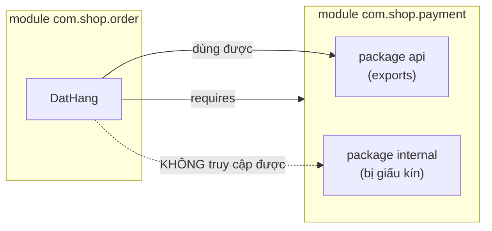

# 4. Hệ thống Module (Java Module System)

Hệ thống Module (có từ Java 9) là cách chia một chương trình lớn thành các khối độc lập, mỗi khối tự khai báo nó cần gì và cho phép ai dùng phần nào của mình. Nó giúp tổ chức code rõ ràng, che giấu chi tiết nội bộ và phát hiện thiếu thư viện ngay từ lúc khởi động. Bài này giới thiệu khái niệm chung; chi tiết về `module-info.java`, `requires`, `exports` nằm bên dưới.

[](pathname:///img/java/modules.webp)

---

:::note[Ghi nhớ nhanh]

- ⭐ **JPMS (Java 9)** — chia chương trình thành module qua `module-info.java`, khai báo `requires` (phụ thuộc) và `exports` (package lộ ra).
- ⭐ **Đóng gói mạnh** — package không `exports` sẽ bị ẩn, bên ngoài không import được.
- **Phát hiện thiếu thư viện sớm** — phụ thuộc được kiểm tra lúc khởi động thay vì sập giữa chừng lúc chạy.
- **`jlink`** — tạo runtime tối giản chỉ gồm các module cần thiết, hợp container/microservice.
- **Giải quyết "JAR hell"** — ranh giới module rõ ràng, hạn chế xung đột phiên bản và class trùng.

:::

---

## Mục lục

- [Vì sao có module system (JPMS)?](#vì-sao-có-module-system-jpms)
- [Module là gì?](#module-là-gì)
- [Vấn đề của classpath cũ](#vấn-đề-của-classpath-cũ)
- [File module-info.java](#file-module-infojava)
- [requires và exports](#requires-và-exports)
- [Ví dụ một dự án nhiều module](#ví-dụ-một-dự-án-nhiều-module)
- [Vì sao cần module?](#vì-sao-cần-module)
- [So sánh module với classpath cũ](#so-sánh-module-với-classpath-cũ)
- [Lỗi thường gặp](#lỗi-thường-gặp)
- [Tóm tắt](#tóm-tắt)
- [Câu hỏi phỏng vấn](#câu-hỏi-phỏng-vấn)

---

## Vì sao có module system (JPMS)?

**Vấn đề:** Classpath truyền thống là một không gian **phẳng**: mọi class `public` đều lộ ra ngoài, không thể giấu phần nội bộ của một thư viện. Trùng hoặc thiếu JAR chỉ bị phát hiện muộn lúc chạy ("JAR hell" / `ClassNotFoundException`), và JDK là một khối khổng lồ khó cắt nhỏ.

```java
// Thư viện muốn giấu lớp nội bộ này, nhưng classpath phẳng làm KHÔNG được:
package com.lib.internal;

public class XuLyNoiBo {          // public -> ai cũng gọi được
    public void hamNguyHiem() { } // lẽ ra chỉ dùng nội bộ
}

// Code bên ngoài vẫn import thoải mái, phá vỡ ranh giới nội bộ:
import com.lib.internal.XuLyNoiBo; // không có gì ngăn cản
```

**Giải pháp:** JPMS (Java 9, qua `module-info.java`) cho phép khai báo `requires` (phụ thuộc) và `exports` (package được lộ ra). Nhờ đó có **đóng gói mạnh** (ẩn được package nội bộ), phụ thuộc rõ ràng được kiểm tra sớm lúc khởi động, và có thể tạo runtime tối giản bằng `jlink`.

```java
module com.lib {
    // CHỈ công khai package api; com.lib.internal bị giấu kín
    exports com.lib.api;
    // KHÔNG exports com.lib.internal -> bên ngoài không import được
}
```

:::tip[Dùng thực tế]

- **Ẩn package nội bộ**: không `exports` `com.lib.internal` để chỉ lộ API công khai, người dùng thư viện không thể phụ thuộc vào chi tiết nội bộ.
- **Khai báo phụ thuộc tường minh**: dùng `requires java.sql;` để thiếu thư viện bị báo ngay lúc khởi động thay vì sập giữa chừng lúc chạy.
- **Đóng gói runtime nhỏ với jlink**: gói chỉ những module cần thiết thành bản runtime gọn, phù hợp container/microservice.
- **Tránh JAR hell**: ranh giới module rõ ràng giúp hạn chế xung đột phiên bản và class trùng tên trên classpath.

:::

---

## Module là gì?

**Module (mô-đun)** là một nhóm các package (gói) và tài nguyên được đóng gói lại với nhau, kèm theo một bản mô tả rõ ràng về việc nó **cần gì** từ bên ngoài và **cho phép** ai dùng phần nào của nó. Hệ thống Module được giới thiệu từ **Java 9** (còn gọi là Project Jigsaw).

Hãy tưởng tượng một tòa nhà văn phòng. Mỗi công ty (module) thuê một tầng riêng. Mỗi công ty:

- Khai báo cần dịch vụ gì từ bên ngoài (điện, nước, internet) — giống `requires`.
- Quyết định phòng nào mở cửa cho khách, phòng nào khóa kín — giống `exports`.

Module giúp tổ chức code lớn một cách rõ ràng, an toàn và dễ bảo trì.

---

## Vấn đề của classpath cũ

Trước Java 9, mọi thứ được nạp qua **classpath (đường dẫn lớp)** — một danh sách dài tất cả các file `.class` và thư viện `.jar`. Cách này có nhiều vấn đề:

- **Không có ranh giới rõ ràng**: mọi class public đều có thể bị bất kỳ ai truy cập, kể cả những class nội bộ đáng lẽ phải giấu đi.
- **JAR Hell (địa ngục JAR)**: nếu hai thư viện cần hai phiên bản khác nhau của cùng một thư viện, chương trình có thể lỗi khó lường.
- **Lỗi phát hiện muộn**: thiếu một thư viện chỉ được phát hiện khi chạy (runtime), chứ không phải lúc khởi động.
- **JDK quá to**: trước đây toàn bộ thư viện chuẩn là một khối khổng lồ, không thể chỉ lấy phần cần dùng.

---

## File module-info.java

Mỗi module được khai báo trong một file đặc biệt tên là **`module-info.java`**, đặt ở thư mục gốc của module. File này mô tả tên module và các phụ thuộc.

```java
// File: module-info.java
module com.mycompany.app {
    // Module này cần module java.sql để hoạt động
    requires java.sql;

    // Cho phép các module khác dùng package com.mycompany.app.api
    exports com.mycompany.app.api;
}
```

Cấu trúc thư mục điển hình:

```text
src/
└── com.mycompany.app/        <- thư mục module
    ├── module-info.java       <- file mô tả module
    └── com/mycompany/app/
        ├── api/
        │   └── DichVu.java
        └── internal/
            └── XuLyNoiBo.java
```

---

## requires và exports

Hai từ khóa quan trọng nhất:

### requires (cần)

Khai báo module **này phụ thuộc vào** module khác. Nếu module được khai báo không có mặt, chương trình sẽ báo lỗi ngay lúc khởi động.

```java
module com.shop.order {
    requires com.shop.payment; // Module order cần module payment
    requires java.logging;     // Cần module ghi log của Java
}
```

### exports (xuất ra)

Khai báo package nào **cho phép** module khác sử dụng. Những package **không** được `exports` sẽ bị giấu kín, dù class bên trong có là public.

```java
module com.shop.payment {
    // Cho phép module khác dùng package này
    exports com.shop.payment.api;

    // Package com.shop.payment.internal KHÔNG được exports
    // -> module khác không thể truy cập, dù class là public
}
```

Đây là điểm mạnh lớn: bạn kiểm soát chính xác phần nào của module được "công khai".

---

## Ví dụ một dự án nhiều module

Giả sử bạn xây một ứng dụng bán hàng gồm hai module: `payment` (thanh toán) và `order` (đặt hàng).

```java
// File: payment/module-info.java
module com.shop.payment {
    // Công khai package api cho module khác dùng
    exports com.shop.payment.api;
}
```

```java
// File: payment/com/shop/payment/api/ThanhToan.java
package com.shop.payment.api;

public class ThanhToan {
    public void xuLy(double soTien) {
        // Xử lý logic thanh toán
        System.out.println("Đã thanh toán: " + soTien + " VND");
    }
}
```

```java
// File: order/module-info.java
module com.shop.order {
    // Module order cần dùng module payment
    requires com.shop.payment;
}
```

```java
// File: order/com/shop/order/DatHang.java
package com.shop.order;

import com.shop.payment.api.ThanhToan; // Dùng được vì payment đã exports

public class DatHang {
    public void taoDonHang(double tien) {
        ThanhToan tt = new ThanhToan();
        tt.xuLy(tien); // Gọi sang module payment
        System.out.println("Đơn hàng đã được tạo");
    }
}
```

Sơ đồ dưới đây minh hoạ quan hệ `requires` và `exports` giữa hai module (package `internal` bị giấu kín):



---

## Vì sao cần module?

- **Đóng gói mạnh (strong encapsulation)**: chỉ những gì được `exports` mới truy cập được, bảo vệ chi tiết nội bộ.
- **Phụ thuộc rõ ràng (reliable configuration)**: mọi phụ thuộc khai báo công khai, thiếu là phát hiện ngay lúc khởi động, không phải chờ runtime.
- **Ứng dụng gọn nhẹ hơn**: có thể đóng gói chỉ những module cần thiết bằng công cụ `jlink`, tạo ra bản runtime nhỏ gọn.
- **Dễ bảo trì dự án lớn**: code được chia thành các khối độc lập, ranh giới rõ ràng.

---

## So sánh module với classpath cũ

| Tiêu chí | Classpath cũ | Module System |
| --- | --- | --- |
| Đóng gói | Mọi class public đều truy cập được | Chỉ package được `exports` |
| Phụ thuộc | Ngầm định, không khai báo | Khai báo rõ qua `requires` |
| Phát hiện thiếu thư viện | Lúc chạy (runtime) | Lúc khởi động |
| JAR Hell | Dễ gặp | Hạn chế nhiều |
| Kích thước runtime | Toàn bộ JDK | Có thể cắt nhỏ với `jlink` |

Lưu ý: với người mới học và các dự án nhỏ, bạn **không bắt buộc** phải dùng module — classpath vẫn hoạt động tốt. Module quan trọng hơn với các dự án lớn, thư viện, và khi cần bảo mật chặt chẽ.

---

## Lỗi thường gặp

- **Quên `exports` package**: module khác không thể dùng package đó dù class là public.
- **Quên `requires`**: cố dùng class từ module khác mà chưa khai báo `requires` sẽ gây lỗi biên dịch.
- **Đặt `module-info.java` sai vị trí**: file này phải nằm ở thư mục gốc của module.
- **Phụ thuộc vòng (circular dependency)**: module A `requires` B và B lại `requires` A — Java không cho phép.
- **Nghĩ rằng phải dùng module ngay từ đầu**: với dự án nhỏ, classpath đơn giản vẫn ổn; đừng phức tạp hóa không cần thiết.

---

## Tóm tắt

- **Module** là nhóm package được đóng gói kèm mô tả phụ thuộc rõ ràng, có từ **Java 9**.
- **Classpath cũ** thiếu ranh giới, dễ gặp JAR Hell và phát hiện lỗi muộn.
- File **`module-info.java`** khai báo tên module cùng `requires` và `exports`.
- **`requires`** khai báo phụ thuộc; **`exports`** quyết định package nào được công khai.
- Module mang lại **đóng gói mạnh**, **phụ thuộc rõ ràng**, và **runtime gọn nhẹ**.
- Với người mới và dự án nhỏ, module **không bắt buộc** — nó hữu ích nhất cho dự án lớn.

---

## Câu hỏi phỏng vấn

Những câu thường gặp về chủ đề này. Tự trả lời trước, rồi bấm **Xem đáp án** để đối chiếu.

**1. Hệ thống Module (JPMS) là gì? Ra đời từ phiên bản Java nào?**

<details className="qa">
<summary>Xem đáp án</summary>

**JPMS** (Java Platform Module System, còn gọi Project Jigsaw) là hệ thống module chính thức của Java, giới thiệu từ **Java 9**. Nó cho phép chia một chương trình thành các **module** — mỗi module là một nhóm package kèm bản mô tả rõ ràng về việc nó **cần gì** (`requires`) từ module khác và **cho phép** module nào khác dùng phần nào của nó (`exports`).

</details>

**2. Phân biệt `requires` và `exports` trong `module-info.java`.**

<details className="qa">
<summary>Xem đáp án</summary>

| | `requires` | `exports` |
|---|---|---|
| Ý nghĩa | Khai báo module **này phụ thuộc vào** module khác | Khai báo package nào của module này **được phép** module khác dùng |
| Kiểm tra khi nào | Lúc khởi động (nếu thiếu module cần, báo lỗi ngay) | Lúc biên dịch/chạy khi module khác cố `import` package không được `exports` |

```java
module com.shop.order {
    requires com.shop.payment;   // Cần dùng module payment
    exports com.shop.order.api;  // Cho phép module khác dùng package api của mình
}
```

</details>

**3. Vấn đề "JAR Hell" của classpath truyền thống là gì? JPMS giải quyết nó ra sao?**

<details className="qa">
<summary>Xem đáp án</summary>

**JAR Hell** (địa ngục JAR) là tình trạng lộn xộn khi dùng classpath truyền thống:

- Hai thư viện khác nhau cần **hai phiên bản khác nhau** của cùng một thư viện thứ ba, nhưng classpath chỉ là một danh sách phẳng, không phân biệt được, gây xung đột hoặc lấy nhầm phiên bản.
- Thiếu một class/JAR chỉ được phát hiện **lúc chạy** (`ClassNotFoundException`), không phải lúc biên dịch/khởi động.
- Mọi class `public` đều lộ ra ngoài, không có ranh giới rõ ràng giữa API công khai và chi tiết nội bộ.

JPMS giảm thiểu vấn đề này nhờ **ranh giới module rõ ràng**: mỗi module khai báo tường minh phụ thuộc (`requires`) và phần được công khai (`exports`), giúp phát hiện thiếu phụ thuộc ngay khi khởi động, và giới hạn được việc lộ package nội bộ.

</details>

**4. `module-info.java` là gì? Nó phải đặt ở đâu?**

<details className="qa">
<summary>Xem đáp án</summary>

`module-info.java` là file đặc biệt mô tả một module: tên module, các `requires` (phụ thuộc) và `exports` (package công khai). File này **bắt buộc phải đặt ở thư mục gốc** (root) của module — ngang hàng với thư mục package gốc, không được đặt lồng bên trong bất kỳ package nào.

```text
src/
└── com.mycompany.app/
    ├── module-info.java   <- đúng vị trí: thư mục gốc của module
    └── com/mycompany/app/...
```

Đặt sai vị trí (ví dụ bên trong một package) sẽ khiến trình biên dịch không nhận diện được module.

</details>

**5. Thế nào là "đóng gói mạnh" (strong encapsulation) trong module system? Nó khác gì so với việc chỉ khai báo class là `private`/`package-private`?**

<details className="qa">
<summary>Xem đáp án</summary>

**Đóng gói mạnh** nghĩa là: một package **không được `exports`** sẽ hoàn toàn bị ẩn khỏi các module khác, **dù mọi class bên trong nó là `public`**.

- Trước JPMS, phạm vi truy cập (`public`/`private`/`package-private`) chỉ kiểm soát được **trong một package** hoặc trong classpath phẳng — một class `public` trong bất kỳ JAR nào cũng import được từ bất cứ đâu.
- Với JPMS, ranh giới kiểm soát nâng lên **cấp package giữa các module**: dù class là `public`, nếu package chứa nó không nằm trong danh sách `exports`, module khác **không thể** `import` hay dùng Reflection thông thường để truy cập — đây là lớp bảo vệ bổ sung, độc lập với access modifier của từng class.

</details>

**6. Đoạn khai báo module sau có vấn đề gì?**

```java
// File: payment/module-info.java
module com.shop.payment {
    // Không khai báo exports gì cả
}
```

```java
// File: order/module-info.java
module com.shop.order {
    requires com.shop.payment;
}
```

```java
package com.shop.order;
import com.shop.payment.api.ThanhToan; // Lỗi biên dịch tại đây
```

<details className="qa">
<summary>Xem đáp án</summary>

Module `com.shop.payment` **không `exports`** bất kỳ package nào, kể cả `com.shop.payment.api`. Dù `com.shop.order` đã `requires com.shop.payment` (khai báo đúng phụ thuộc), nó vẫn **không thể `import`** class `ThanhToan` — vì package chứa class đó bị "giấu kín" hoàn toàn theo nguyên tắc đóng gói mạnh.

**Cách sửa**: thêm dòng `exports com.shop.payment.api;` vào `module-info.java` của `com.shop.payment`. Lưu ý: `requires` chỉ cho phép module dùng **module khác nói chung**, còn `exports` mới thực sự quyết định **package nào** trong module đó lộ ra ngoài.

</details>

**7. Công cụ `jlink` dùng để làm gì? Vì sao nó chỉ khả thi nhờ có module system?**

<details className="qa">
<summary>Xem đáp án</summary>

`jlink` là công cụ tạo ra một **runtime image tối giản** — một bản JRE tùy chỉnh chỉ chứa đúng những module (kể cả module chuẩn của JDK) mà ứng dụng thực sự cần, thay vì đóng gói toàn bộ JDK khổng lồ.

- Điều này chỉ khả thi vì từ Java 9, **chính JDK cũng được chia thành các module** (`java.base`, `java.sql`, `java.logging`...) thay vì là một khối nguyên khối như trước.
- Lợi ích thực tế: tạo image Docker cho microservice **nhỏ gọn hơn nhiều**, khởi động nhanh hơn, giảm bề mặt tấn công (attack surface) vì không mang theo các module không dùng tới.

</details>

**8. `requires transitive` khác `requires` thông thường như thế nào?**

<details className="qa">
<summary>Xem đáp án</summary>

`requires transitive` (bắc cầu) khai báo rằng: bất kỳ module nào `requires` module hiện tại thì **cũng tự động** có quyền dùng module được `requires transitive` đó, không cần tự khai báo lại.

```java
module com.shop.api {
    requires transitive com.shop.common; // bắc cầu
}

module com.shop.web {
    requires com.shop.api;
    // Tự động dùng được com.shop.common luôn, KHÔNG cần "requires com.shop.common;"
}
```

- Hữu ích khi API công khai của một module (ví dụ tham số phương thức, kiểu trả về) sử dụng trực tiếp các kiểu từ module phụ thuộc — nếu không dùng `transitive`, module dùng API đó sẽ phải tự khai báo thêm `requires` cho module phụ thuộc ẩn, gây phiền toái và dễ quên.

</details>

**9. Với một dự án nhỏ hoặc mới học Java, có nên áp dụng module system ngay từ đầu không? Vì sao?**

<details className="qa">
<summary>Xem đáp án</summary>

**Không bắt buộc**, và với đa số dự án nhỏ/vừa hiện nay, **classpath truyền thống vẫn hoạt động tốt** — thực tế nhiều framework lớn (Spring Boot mặc định) cũng chưa yêu cầu chạy dưới dạng module hóa đầy đủ.

- Module system mang lại giá trị rõ rệt nhất cho: **thư viện dùng chung** (cần ranh giới API rõ ràng để bên ngoài không phụ thuộc vào chi tiết nội bộ), **dự án rất lớn** (nhiều nhóm cùng phát triển, cần ranh giới cứng giữa các phần), và **ứng dụng cần runtime tối giản** (dùng `jlink`).
- Với dự án nhỏ, việc thêm `module-info.java` chỉ tạo thêm gánh nặng cấu hình (khai báo đủ mọi `requires` cho thư viện bên thứ ba, một số thư viện cũ chưa hỗ trợ tốt module) mà lợi ích thu được không tương xứng.
- Lời khuyên thực dụng: học để hiểu khái niệm và đọc được lỗi liên quan khi gặp (ví dụ khi dùng thư viện đã module hóa), nhưng không cần ép dự án cá nhân/nhỏ phải module hóa ngay.

</details>
