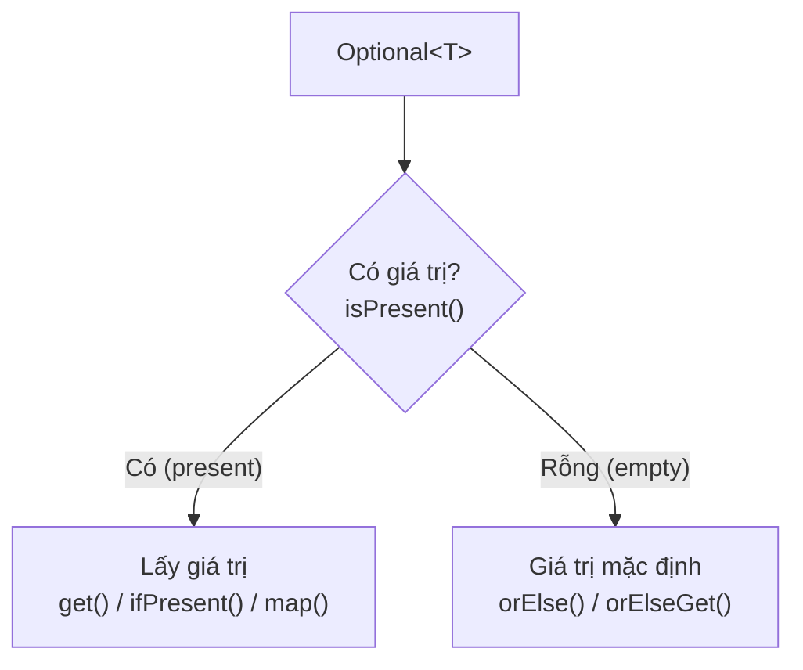

# 5. Optional

Optional là một "hộp đựng" có từ Java 8, dùng để biểu diễn một giá trị có thể có hoặc không có. Nó giúp bạn tránh lỗi NullPointerException một cách rõ ràng và an toàn, thay vì âm thầm trả về `null`. Bài này giới thiệu khái niệm tổng quan; cách tạo và dùng Optional nằm chi tiết bên dưới.

---

:::note[Ghi nhớ nhanh]

- ⭐ **`Optional<T>` (Java 8)** — kiểu bọc biểu thị tường minh "có thể có hoặc không có giá trị", giảm hẳn `NullPointerException`.
- **Tạo Optional** — `Optional.of` (chắc chắn có), `ofNullable` (có thể null), `empty` (rỗng).
- **Lấy giá trị an toàn** — `isPresent`, `orElse`, `ifPresent` thay cho null-check thủ công.
- **`map`** — biến đổi giá trị bên trong mà không cần tự mở hộp, tránh null-check lồng nhau.
- ⭐ **Tránh lạm dụng** — chủ yếu dùng cho kiểu trả về, không nên dùng làm tham số hay field.

:::

---

## Mục lục

- [Vì sao có Optional?](#vì-sao-có-optional)
- [Optional là gì?](#optional-là-gì)
- [Vấn đề NullPointerException](#vấn-đề-nullpointerexception)
- [Tạo Optional: of, ofNullable, empty](#tạo-optional-of-ofnullable-empty)
- [Kiểm tra và lấy giá trị](#kiểm-tra-và-lấy-giá-trị)
- [Biến đổi giá trị với map](#biến-đổi-giá-trị-với-map)
- [Cách dùng đúng và sai](#cách-dùng-đúng-và-sai)
- [Lỗi thường gặp](#lỗi-thường-gặp)
- [Tóm tắt](#tóm-tắt)

---

## Vì sao có Optional?

**Vấn đề:** `null` được mệnh danh là "lỗi tỷ đô". Một phương thức trả về `null` mà nơi gọi quên kiểm tra sẽ gây **NullPointerException** lúc chạy. Tệ hơn, khi chỉ nhìn vào chữ ký phương thức, ta **không biết** nó có thể trả về "không có giá trị" hay không, dẫn tới việc kiểm tra `null` lung tung khắp nơi hoặc bỏ sót.

```java
class KhoNguoiDung {
    // Chữ ký này KHÔNG cho biết có thể trả về null
    NguoiDung timTheoId(int id) {
        if (id == 1) {
            return new NguoiDung("An");
        }
        return null; // Trả về null âm thầm -> nguy hiểm
    }
}

class App {
    public static void main(String[] args) {
        KhoNguoiDung kho = new KhoNguoiDung();
        NguoiDung nd = kho.timTheoId(99); // nd = null
        // NPE tại đây vì người gọi quên kiểm tra null
        System.out.println(nd.getTen().toUpperCase());
    }
}
```

**Giải pháp:** `Optional<T>` (Java 8) là một kiểu **bọc** biểu thị **tường minh** "có thể có hoặc không có giá trị" ngay trong chữ ký. Người dùng **buộc** phải xử lý trường hợp rỗng một cách rõ ràng qua `isPresent`/`map`/`orElse`/`ifPresent`, nhờ đó giảm hẳn NPE.

```java
import java.util.Optional;

class KhoNguoiDung {
    // Chữ ký nói rõ: kết quả CÓ THỂ vắng
    Optional<NguoiDung> timTheoId(int id) {
        if (id == 1) {
            return Optional.of(new NguoiDung("An"));
        }
        return Optional.empty();
    }
}

class App {
    public static void main(String[] args) {
        KhoNguoiDung kho = new KhoNguoiDung();

        // Chuỗi map an toàn, không cần null-check lồng nhau
        String ten = kho.timTheoId(99)
            .map(NguoiDung::getTen)
            .map(String::toUpperCase)
            .orElse("KHÔNG TÌM THẤY"); // Giá trị mặc định khi rỗng

        System.out.println(ten);
    }
}
```

:::tip[Dùng thực tế]
- **Repository `findById`**: trả `Optional<NguoiDung>` để báo rõ "có thể không tìm thấy".
- **Chuỗi `map` an toàn**: lấy dữ liệu lồng nhau mà không cần kiểm tra `null` ở từng bước.
- **Giá trị mặc định**: dùng `orElse` cấp ngay phương án dự phòng khi kết quả rỗng.
- **API rõ nghĩa**: kiểu trả về `Optional` tự nói lên "giá trị có thể vắng", đỡ phải đọc tài liệu.
:::

---

## Optional là gì?

**Optional (giá trị có thể có hoặc không)** là một lớp "hộp đựng" (container) được giới thiệu từ **Java 8**, dùng để biểu diễn một giá trị **có thể tồn tại hoặc có thể trống**. Mục tiêu chính của nó là giúp bạn tránh lỗi **NullPointerException** một cách rõ ràng và an toàn.

Hãy tưởng tượng một chiếc hộp quà. Khi mở ra, có thể bên trong **có quà** (giá trị tồn tại), hoặc **rỗng** (không có giá trị). Thay vì đưa cho ai đó một thứ có thể là `null` (không biết có hay không), bạn đưa cho họ một chiếc hộp và họ buộc phải kiểm tra trước khi lấy quà ra.

---

## Vấn đề NullPointerException

**NullPointerException (NPE — lỗi truy cập tham chiếu null)** là một trong những lỗi phổ biến và đau đầu nhất trong Java. Nó xảy ra khi bạn cố dùng một biến đang là `null`.

```java
public class ViDuNPE {
    static String timTen(int id) {
        if (id == 1) {
            return "An";
        }
        return null; // Không tìm thấy -> trả về null (NGUY HIỂM)
    }

    public static void main(String[] args) {
        String ten = timTen(99); // ten = null
        // Lỗi NullPointerException tại đây vì ten là null
        System.out.println("Độ dài tên: " + ten.length());
    }
}
```

Vấn đề là khi nhìn vào chữ ký phương thức `String timTen(int id)`, ta **không biết** nó có thể trả về `null`. `Optional` làm cho khả năng "trống" này trở nên rõ ràng ngay từ kiểu trả về.

---

## Tạo Optional: of, ofNullable, empty

Có ba cách chính để tạo một `Optional`:

```java
import java.util.Optional;

public class ViDuTaoOptional {
    public static void main(String[] args) {
        // 1. Optional.of() - dùng khi CHẮC CHẮN giá trị không null
        Optional<String> coGiaTri = Optional.of("Xin chào");

        // 2. Optional.ofNullable() - dùng khi giá trị CÓ THỂ null
        String coTheNull = null;
        Optional<String> anToan = Optional.ofNullable(coTheNull); // rỗng

        // 3. Optional.empty() - tạo một Optional rỗng tường minh
        Optional<String> rong = Optional.empty();

        System.out.println(coGiaTri.isPresent()); // true
        System.out.println(anToan.isPresent());    // false
        System.out.println(rong.isPresent());      // false
    }
}
```

Lưu ý quan trọng: nếu truyền `null` vào `Optional.of(null)`, nó sẽ ném ngay `NullPointerException`. Khi không chắc chắn, hãy dùng `ofNullable`.

---

## Kiểm tra và lấy giá trị

Các phương thức thường dùng để làm việc với giá trị bên trong:

```java
import java.util.Optional;

public class ViDuLayGiaTri {
    public static void main(String[] args) {
        Optional<String> ten = Optional.of("Bình");
        Optional<String> rong = Optional.empty();

        // isPresent() - kiểm tra có giá trị không
        if (ten.isPresent()) {
            System.out.println("Có tên: " + ten.get()); // get() lấy giá trị
        }

        // ifPresent() - chỉ chạy code nếu CÓ giá trị (gọn hơn if)
        ten.ifPresent(t -> System.out.println("Chào " + t));

        // orElse() - trả về giá trị, nếu rỗng thì trả về giá trị mặc định
        String ketQua = rong.orElse("Không có tên");
        System.out.println(ketQua); // In ra: Không có tên

        // orElseGet() - giống orElse nhưng giá trị mặc định tính bằng lambda
        String ketQua2 = rong.orElseGet(() -> "Mặc định tính sau");
        System.out.println(ketQua2);
    }
}
```

So sánh nhanh:

- **`isPresent()`** trả về `true`/`false` — dùng để kiểm tra.
- **`ifPresent(...)`** chạy hành động nếu có giá trị — gọn hơn dùng `if`.
- **`orElse(...)`** cung cấp giá trị dự phòng khi rỗng.

Sơ đồ dưới đây minh hoạ luồng xử lý một `Optional` theo hai nhánh có giá trị và rỗng:



---

## Biến đổi giá trị với map

**`map`** cho phép biến đổi giá trị bên trong `Optional` mà **không cần** tự kiểm tra null. Nếu `Optional` rỗng, `map` chỉ đơn giản trả về một `Optional` rỗng.

```java
import java.util.Optional;

public class ViDuMap {
    public static void main(String[] args) {
        Optional<String> ten = Optional.of("nguyễn an");

        // map() biến đổi giá trị: viết hoa toàn bộ
        Optional<String> tenHoa = ten.map(t -> t.toUpperCase());
        System.out.println(tenHoa.orElse("trống")); // NGUYỄN AN

        // Có thể nối nhiều map liên tiếp một cách an toàn
        Optional<Integer> doDai = ten
            .map(t -> t.trim())   // Xóa khoảng trắng thừa
            .map(t -> t.length()); // Lấy độ dài
        System.out.println("Độ dài: " + doDai.orElse(0));

        // Nếu Optional rỗng, map không gây lỗi, chỉ trả về rỗng
        Optional<String> rong = Optional.empty();
        System.out.println(rong.map(t -> t.toUpperCase()).orElse("vẫn an toàn"));
    }
}
```

Cách viết lại phương thức `timTen` trước đó cho an toàn:

```java
import java.util.Optional;

class DanhBa {
    // Trả về Optional thay vì null -> người gọi BIẾT là có thể trống
    Optional<String> timTen(int id) {
        if (id == 1) {
            return Optional.of("An");
        }
        return Optional.empty(); // Rõ ràng: không tìm thấy
    }
}
```

---

## Cách dùng đúng và sai

### Nên (đúng)

- Dùng `Optional` làm **kiểu trả về** của phương thức khi kết quả có thể trống.
- Dùng `orElse`, `ifPresent`, `map` để xử lý gọn gàng, an toàn.

### Không nên (sai)

- **Gọi `get()` mà không kiểm tra**: nếu `Optional` rỗng, `get()` ném `NoSuchElementException` — chẳng khác gì NPE.
- **Dùng `Optional` cho biến thành viên (field) của lớp**: không khuyến khích, gây phức tạp và tốn bộ nhớ.
- **Dùng `Optional` làm tham số phương thức**: nên truyền giá trị bình thường, để người gọi quyết định.
- **`Optional.of(null)`**: sẽ ném lỗi ngay; dùng `ofNullable` khi giá trị có thể null.

```java
// SAI: gọi get() mà không kiểm tra
Optional<String> rong = Optional.empty();
// String x = rong.get(); // Ném NoSuchElementException!

// ĐÚNG: luôn có phương án dự phòng
String x = rong.orElse("giá trị mặc định");
```

---

## Lỗi thường gặp

- **Lạm dụng `get()`**: đây là nguồn lỗi phổ biến nhất; hãy ưu tiên `orElse`/`ifPresent`/`map`.
- **`Optional.of(null)`**: ném `NullPointerException`; dùng `ofNullable` thay thế.
- **Dùng `Optional` ở mọi nơi**: không phải biến nào cũng cần bọc trong `Optional`; chủ yếu dùng cho giá trị trả về.
- **Kiểm tra rồi vẫn null bên trong**: `Optional` chỉ bảo vệ "có hay không", không tự kiểm tra logic bên trong giá trị.
- **Quên rằng `orElse` luôn tính giá trị mặc định**: nếu giá trị mặc định tốn kém, dùng `orElseGet` với lambda để tính lười (lazy).

---

## Tóm tắt

- **Optional** là "hộp đựng" cho giá trị có thể có hoặc không, giúp tránh **NullPointerException**.
- Tạo bằng `Optional.of` (chắc chắn không null), `ofNullable` (có thể null), `empty` (rỗng).
- Lấy giá trị an toàn bằng `isPresent`, `ifPresent`, `orElse`, `orElseGet`.
- **`map`** biến đổi giá trị bên trong mà không cần tự kiểm tra null.
- Dùng `Optional` chủ yếu cho **kiểu trả về**, tránh dùng cho field hay tham số.
- **Tránh lạm dụng `get()`** vì nó có thể ném lỗi tương đương NPE.
