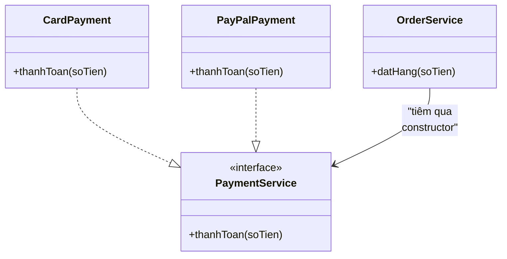

# 6. Dependency Injection (Tiêm phụ thuộc)

Dependency Injection (DI) là kỹ thuật cho một đối tượng nhận các thứ nó cần từ bên ngoài, thay vì tự tạo chúng bên trong. Nhờ vậy code dễ thay đổi, dễ kiểm thử và bớt gắn kết chặt với nhau. Bài này giới thiệu khái niệm tổng quan, Constructor Injection và IoC; chi tiết và ví dụ nằm bên dưới.

[](pathname:///img/java/dependency-injection.webp)

---

:::note[Ghi nhớ nhanh]

- ⭐ **Dependency Injection** — tiêm phụ thuộc từ ngoài vào (qua constructor/setter) thay vì tự `new` bên trong.
- **Phụ thuộc vào abstraction** — lớp dựa vào interface nên dễ đổi cài đặt, dễ tái sử dụng.
- ⭐ **IoC (Inversion of Control)** — bên ngoài quyết định cài đặt cụ thể, không phải bản thân lớp.
- **Dễ test** — có thể tiêm mock thay cho service thật khi kiểm thử.
- **Spring làm tự động** — container quản lý và tiêm các bean giúp bạn.

:::

---

## Mục lục

- [Vì sao có Dependency Injection?](#vì-sao-có-dependency-injection)
- [Dependency Injection là gì?](#dependency-injection-là-gì)
- [Vấn đề khi tự tạo phụ thuộc bên trong](#vấn-đề-khi-tự-tạo-phụ-thuộc-bên-trong)
- [Constructor Injection (tiêm qua hàm dựng)](#constructor-injection-tiêm-qua-hàm-dựng)
- [Inversion of Control (đảo ngược điều khiển)](#inversion-of-control-đảo-ngược-điều-khiển)
- [Lợi ích cho việc kiểm thử (testing)](#lợi-ích-cho-việc-kiểm-thử-testing)
- [Spring làm việc này tự động](#spring-làm-việc-này-tự-động)
- [Lỗi thường gặp](#lỗi-thường-gặp)
- [Tóm tắt](#tóm-tắt)
- [Câu hỏi phỏng vấn](#câu-hỏi-phỏng-vấn)

---

## Vì sao có Dependency Injection?

**Vấn đề:** nếu một lớp **tự tạo** các phụ thuộc của nó bằng `new` ngay bên trong, nó bị gắn **chặt** vào cài đặt cụ thể.

```java
// Lớp TỰ tạo phụ thuộc -> gắn chặt, khó thay, khó test
class OrderService {
    // Trói cứng vào EmailService cụ thể
    private EmailService emailService = new EmailService();

    void datHang() {
        // ...
        emailService.guiMail("Đã đặt hàng"); // Luôn gọi service THẬT
    }
}
```

- **Khó thay thế**: muốn đổi sang `SmsService` phải sửa lại code của `OrderService`.
- **Khó test**: không thể mock `EmailService`, mỗi lần test đều gọi service thật.
- **Khó tái sử dụng**: lớp bị dính cứng vào một cài đặt, không dùng lại linh hoạt được.

**Giải pháp:** **Dependency Injection** — phụ thuộc được **tiêm từ ngoài** vào (qua constructor/setter) thay vì tự tạo. Đây là **đảo ngược điều khiển (IoC)**: lớp phụ thuộc vào **abstraction** (interface) nên dễ đổi cài đặt và dễ mock khi test.

```java
interface Notifier {            // Phụ thuộc vào ABSTRACTION
    void gui(String noiDung);
}

class OrderService {
    private final Notifier notifier;

    // Tiêm từ ngoài vào -> không tự "new"
    public OrderService(Notifier notifier) {
        this.notifier = notifier;
    }

    void datHang() {
        // ...
        notifier.gui("Đã đặt hàng"); // Cài đặt nào cũng được, miễn hợp interface
    }
}
```

:::tip[Dùng thực tế]

- **Tiêm repository vào service** qua constructor để service không tự tạo tầng truy cập dữ liệu.
- **Mock phụ thuộc khi unit test**, kiểm thử logic mà không gọi DB hay dịch vụ ngoài thật.
- **Đổi cài đặt qua cấu hình** (ví dụ `EmailService` ↔ `SmsService`) mà không sửa code lớp dùng nó.
- **Để Spring quản lý bean** với `@Autowired`/constructor injection, tự dựng và "wiring" các phụ thuộc.

:::

---

## Dependency Injection là gì?

**Dependency Injection (DI — tiêm phụ thuộc)** là một kỹ thuật mà ở đó một đối tượng **nhận** các phụ thuộc (dependency — những thứ nó cần để hoạt động) **từ bên ngoài**, thay vì **tự tạo** chúng bên trong.

**Phụ thuộc (dependency)** là bất kỳ đối tượng nào mà một lớp cần dùng để làm việc. Ví dụ, một lớp `OrderService` (xử lý đơn hàng) cần một lớp `PaymentService` (xử lý thanh toán) để hoạt động — `PaymentService` là một phụ thuộc của `OrderService`.

Hãy tưởng tượng một đầu bếp. Đầu bếp cần nguyên liệu để nấu ăn:

- **Không có DI**: đầu bếp tự ra vườn trồng rau, tự nuôi gà — tự lo mọi nguyên liệu. Vất vả và cứng nhắc.
- **Có DI**: đầu bếp được người khác **giao sẵn** nguyên liệu tận tay. Đầu bếp chỉ tập trung nấu. Hôm nay giao gà, mai giao cá — linh hoạt.

DI chính là việc "giao nguyên liệu tận tay" cho đối tượng.

---

## Vấn đề khi tự tạo phụ thuộc bên trong

Xem ví dụ lớp `OrderService` tự tạo phụ thuộc bên trong:

```java
// CÁCH KHÔNG TỐT: tự tạo phụ thuộc bên trong
class PaymentService {
    void thanhToan(double soTien) {
        System.out.println("Thanh toán qua thẻ: " + soTien);
    }
}

class OrderService {
    // OrderService TỰ tạo PaymentService bên trong -> bị "dính chặt"
    private PaymentService paymentService = new PaymentService();

    void datHang(double soTien) {
        paymentService.thanhToan(soTien);
        System.out.println("Đã đặt hàng");
    }
}
```

Những vấn đề của cách này:

- **Khó thay đổi**: nếu muốn dùng `PayPalPaymentService` thay vì thẻ, bạn phải sửa trực tiếp code của `OrderService`.
- **Khó kiểm thử (test)**: khi viết test, bạn không thể thay `PaymentService` bằng một bản giả (mock) — nó luôn gọi thanh toán thật.
- **Gắn kết chặt (tight coupling)**: `OrderService` bị trói buộc cứng vào một lớp `PaymentService` cụ thể.

---

## Constructor Injection (tiêm qua hàm dựng)

Cách phổ biến và được khuyến nghị nhất là **Constructor Injection** — truyền phụ thuộc vào qua **hàm dựng (constructor)**.

Bước 1: tạo một interface để định nghĩa "khả năng" cần có, giúp linh hoạt thay thế.

```java
// Interface định nghĩa khả năng thanh toán
interface PaymentService {
    void thanhToan(double soTien);
}

// Triển khai 1: thanh toán bằng thẻ
class CardPayment implements PaymentService {
    @Override
    public void thanhToan(double soTien) {
        System.out.println("Thanh toán qua thẻ: " + soTien);
    }
}

// Triển khai 2: thanh toán bằng PayPal
class PayPalPayment implements PaymentService {
    @Override
    public void thanhToan(double soTien) {
        System.out.println("Thanh toán qua PayPal: " + soTien);
    }
}
```

Bước 2: `OrderService` **nhận** phụ thuộc qua constructor, không tự tạo.

```java
class OrderService {
    // Phụ thuộc được khai báo là final, nhận từ bên ngoài
    private final PaymentService paymentService;

    // Constructor Injection: phụ thuộc được "tiêm" vào đây
    public OrderService(PaymentService paymentService) {
        this.paymentService = paymentService;
    }

    void datHang(double soTien) {
        paymentService.thanhToan(soTien); // Dùng phụ thuộc đã được tiêm
        System.out.println("Đã đặt hàng");
    }
}
```

Bước 3: nơi sử dụng quyết định dùng triển khai nào.

```java
public class Main {
    public static void main(String[] args) {
        // Quyết định dùng thẻ -> tiêm CardPayment vào
        OrderService dichVu1 = new OrderService(new CardPayment());
        dichVu1.datHang(100_000);

        // Muốn đổi sang PayPal? Chỉ cần tiêm phụ thuộc khác!
        OrderService dichVu2 = new OrderService(new PayPalPayment());
        dichVu2.datHang(200_000);
    }
}
```

Sơ đồ dưới đây minh hoạ `OrderService` chỉ phụ thuộc vào interface `PaymentService`, còn các triển khai cụ thể được tiêm từ ngoài vào:



Lưu ý: ngoài Constructor Injection, còn có Setter Injection (tiêm qua phương thức set) và Field Injection (tiêm trực tiếp vào field), nhưng Constructor Injection được ưa chuộng nhất vì giúp phụ thuộc bắt buộc và bất biến (`final`).

---

## Inversion of Control (đảo ngược điều khiển)

**Inversion of Control (IoC — đảo ngược điều khiển)** là nguyên tắc đứng sau DI. Bình thường, một đối tượng **tự kiểm soát** việc tạo ra các phụ thuộc của mình. Với IoC, quyền kiểm soát đó được **đảo ngược** — chuyển ra bên ngoài.

So sánh:

- **Không có IoC**: "Tôi (OrderService) tự quyết định và tự tạo PaymentService."
- **Có IoC**: "Tôi chỉ khai báo tôi cần một PaymentService. Ai đó bên ngoài sẽ tạo và đưa cho tôi."

DI là cách phổ biến nhất để hiện thực hóa nguyên tắc IoC. Kết quả là code linh hoạt hơn, dễ thay đổi và dễ kiểm thử hơn.

---

## Lợi ích cho việc kiểm thử (testing)

DI làm cho việc viết test trở nên dễ dàng vì bạn có thể tiêm một phiên bản **giả (mock)** vào.

```java
// Tạo một PaymentService giả chỉ dùng cho test
class FakePayment implements PaymentService {
    boolean daGoi = false; // Ghi nhận xem có được gọi không

    @Override
    public void thanhToan(double soTien) {
        daGoi = true; // Không thanh toán thật, chỉ đánh dấu
    }
}

public class TestViDu {
    public static void main(String[] args) {
        FakePayment gia = new FakePayment();
        // Tiêm bản giả vào OrderService để kiểm thử
        OrderService dichVu = new OrderService(gia);

        dichVu.datHang(50_000);

        // Kiểm tra: thanh toán đã được gọi mà KHÔNG tốn tiền thật
        System.out.println("Đã gọi thanh toán? " + gia.daGoi); // true
    }
}
```

Nếu `OrderService` tự tạo `PaymentService` bên trong, bạn không thể làm việc này — mỗi lần test sẽ gọi thanh toán thật.

---

## Spring làm việc này tự động

Khi dự án lớn lên với hàng trăm lớp phụ thuộc lẫn nhau, việc tự tay tạo và tiêm mọi thứ trở nên mệt mỏi. Đây là lúc các framework như **Spring** giúp đỡ.

Spring có một **IoC Container (bộ chứa điều khiển đảo ngược)** — nó tự động tạo các đối tượng và tiêm phụ thuộc giúp bạn, chỉ dựa trên annotation.

```java
// Minh họa cách Spring làm việc (chỉ để hình dung khái niệm)

// @Service báo Spring: "Hãy quản lý và tạo đối tượng này giúp tôi"
// @Service
class CardPayment implements PaymentService {
    public void thanhToan(double soTien) {
        System.out.println("Thanh toán qua thẻ: " + soTien);
    }
}

// @Service
class OrderService {
    private final PaymentService paymentService;

    // Spring tự động tìm và TIÊM một PaymentService vào đây
    // mà bạn không cần gọi "new" thủ công
    public OrderService(PaymentService paymentService) {
        this.paymentService = paymentService;
    }

    void datHang(double soTien) {
        paymentService.thanhToan(soTien);
    }
}
```

Bạn chỉ cần khai báo (qua annotation) rằng lớp nào cần được quản lý và lớp nào cần phụ thuộc gì. Spring lo phần còn lại: tạo đối tượng, kết nối chúng với nhau, theo đúng nguyên tắc DI và IoC mà bạn vừa học.

---

## Lỗi thường gặp

- **Vẫn dùng `new` bên trong dù đã có DI**: làm vậy phá vỡ lợi ích của DI và gây gắn kết chặt trở lại.
- **Phụ thuộc vào lớp cụ thể thay vì interface**: nên phụ thuộc vào interface để dễ thay thế triển khai.
- **Tạo vòng phụ thuộc (A cần B, B cần A)**: gây rắc rối khi khởi tạo; cần thiết kế lại.
- **Nhồi quá nhiều phụ thuộc vào một lớp**: nếu constructor có quá nhiều tham số, lớp đó có thể đang làm quá nhiều việc.
- **Nghĩ DI chỉ dành cho Spring**: DI là một nguyên tắc thiết kế, bạn có thể áp dụng thủ công mà không cần framework.

---

## Tóm tắt

- **Dependency Injection (DI)** là việc đối tượng **nhận** phụ thuộc từ bên ngoài thay vì tự tạo.
- Tự tạo phụ thuộc bên trong gây **gắn kết chặt**, khó thay đổi và khó kiểm thử.
- **Constructor Injection** truyền phụ thuộc qua hàm dựng — cách được khuyến nghị nhất.
- **Inversion of Control (IoC)** là nguyên tắc đảo ngược quyền kiểm soát việc tạo phụ thuộc; DI là cách hiện thực nó.
- DI giúp việc **kiểm thử** dễ dàng nhờ tiêm được các bản giả (mock).
- Framework **Spring** tự động hóa DI thông qua **IoC Container** và annotation.

---

## Câu hỏi phỏng vấn

Những câu thường gặp về chủ đề này. Tự trả lời trước, rồi bấm **Xem đáp án** để đối chiếu.

**1. Dependency Injection là gì? Nó giải quyết vấn đề gì so với việc một lớp tự tạo phụ thuộc bằng `new`?**

<details className="qa">
<summary>Xem đáp án</summary>

**Dependency Injection (DI)** là kỹ thuật cho một đối tượng **nhận** các phụ thuộc (dependency) từ bên ngoài, thay vì **tự tạo** chúng bên trong bằng `new`.

Nếu tự tạo phụ thuộc bên trong, lớp bị **gắn kết chặt (tight coupling)** với một cài đặt cụ thể:

- **Khó thay đổi**: muốn đổi `EmailService` sang `SmsService` phải sửa code của lớp dùng nó.
- **Khó kiểm thử**: không thể thay phụ thuộc thật bằng bản giả (mock) khi viết test.
- **Khó tái sử dụng**: lớp bị dính chặt vào một cài đặt, không linh hoạt trong ngữ cảnh khác.

DI giải quyết bằng cách để phụ thuộc được **tiêm từ ngoài vào** (thường qua constructor), và lớp chỉ nên phụ thuộc vào **abstraction** (interface) thay vì lớp cụ thể.

</details>

**2. So sánh ba cách tiêm phụ thuộc: Constructor Injection, Setter Injection, Field Injection. Vì sao Constructor Injection được khuyến nghị nhất?**

<details className="qa">
<summary>Xem đáp án</summary>

| | Constructor Injection | Setter Injection | Field Injection |
|---|---|---|---|
| Cách tiêm | Qua tham số hàm dựng | Qua phương thức `setXxx()` | Trực tiếp vào field (thường qua Reflection, ví dụ `@Autowired` trên field) |
| Có thể dùng `final` | **Có** — phụ thuộc bất biến | Không | Không |
| Phụ thuộc bắt buộc | Rõ ràng (không tạo được object nếu thiếu tham số) | Có thể quên gọi setter, để object ở trạng thái thiếu phụ thuộc | Object trông "đủ" nhưng field có thể vẫn `null` khi test |
| Dễ viết unit test | Rất dễ — tự `new` với tham số mock, không cần framework | Cần gọi thêm setter | Khó nhất — cần Reflection hoặc chạy trong container để field được điền |

```java
class OrderService {
    private final PaymentService paymentService; // final -> bất biến, bắt buộc phải có

    public OrderService(PaymentService paymentService) { // Constructor Injection
        this.paymentService = paymentService;
    }
}
```

Constructor Injection được ưa chuộng nhất vì phụ thuộc trở thành **bắt buộc và bất biến** (`final`) — không thể tạo ra một `OrderService` "nửa vời" thiếu phụ thuộc, và không cần framework mới test được.

</details>

**3. Inversion of Control (IoC) là gì? Quan hệ giữa IoC và DI như thế nào?**

<details className="qa">
<summary>Xem đáp án</summary>

**Inversion of Control (đảo ngược điều khiển)** là nguyên tắc: thay vì một đối tượng **tự quyết định và tự tạo** các phụ thuộc của nó, quyền kiểm soát đó được **chuyển ra bên ngoài** — một thành phần khác (người viết code, hoặc một container) quyết định cài đặt cụ thể nào sẽ được cung cấp.

- **IoC** là **nguyên tắc/tư tưởng thiết kế** tổng quát (đảo ngược ai kiểm soát việc tạo phụ thuộc).
- **DI** là **cách phổ biến nhất để hiện thực hóa** nguyên tắc IoC trong thực tế — tiêm phụ thuộc qua constructor/setter chính là một dạng cụ thể của việc "đảo ngược quyền kiểm soát".
- Nói cách khác: mọi DI đều là một hình thức IoC, nhưng IoC còn có thể được hiện thực bằng những cách khác (ví dụ Service Locator, Template Method...).

</details>

**4. DI giúp ích gì cho việc viết unit test? Minh họa bằng ví dụ tiêm một bản giả (mock/fake).**

<details className="qa">
<summary>Xem đáp án</summary>

DI cho phép **tiêm một phiên bản giả** (mock hoặc fake) thay cho phụ thuộc thật khi test, giúp kiểm thử logic của lớp mà **không cần gọi service thật** (không tốn tiền, không cần mạng, không phụ thuộc trạng thái bên ngoài).

```java
class FakePayment implements PaymentService {
    boolean daGoi = false;

    @Override
    public void thanhToan(double soTien) {
        daGoi = true; // Chỉ đánh dấu, không thanh toán thật
    }
}

// Test: tiêm bản giả vào OrderService qua constructor
OrderService dichVu = new OrderService(new FakePayment());
dichVu.datHang(50_000);
```

Nếu `OrderService` **tự tạo** `PaymentService` bên trong (không có DI), việc thay thế này là **không thể** — mỗi lần chạy test sẽ luôn gọi phải service thật.

</details>

**5. Vấn đề phụ thuộc vòng (circular dependency) trong DI là gì? Ví dụ và cách Spring xử lý (hoặc không xử lý được) với Constructor Injection.**

<details className="qa">
<summary>Xem đáp án</summary>

**Phụ thuộc vòng** xảy ra khi module/bean A cần B để khởi tạo, đồng thời B lại cần A — không bên nào có thể được tạo xong trước.

```java
class ServiceA {
    ServiceA(ServiceB b) { } // A cần B để khởi tạo
}
class ServiceB {
    ServiceB(ServiceA a) { } // B cần A để khởi tạo -> KẸT, không ai tạo trước được
}
```

- Với **Constructor Injection**, Spring **không thể** giải quyết vòng lặp này — sẽ ném lỗi `BeanCurrentlyInCreationException` lúc khởi động ứng dụng.
- Với **Setter Injection** hoặc `@Lazy`, Spring có thể "chữa cháy" bằng cách tạo bean rỗng trước rồi tiêm phụ thuộc sau khi cả hai đã tồn tại — nhưng đây chỉ là giải pháp tình thế.
- **Cách xử lý đúng đắn**: coi phụ thuộc vòng là **dấu hiệu thiết kế sai** — nên tách logic dùng chung ra một lớp thứ ba mà cả A và B cùng phụ thuộc vào, thay vì để chúng phụ thuộc lẫn nhau.

</details>

**6. Mô tả ngắn gọn Spring IoC Container hoạt động thế nào khi dùng annotation `@Autowired` trên constructor.**

<details className="qa">
<summary>Xem đáp án</summary>

1. Spring quét các class được đánh dấu quản lý (`@Service`, `@Component`, `@Repository`...).
2. Với mỗi class, Spring xem xét constructor: nếu chỉ có **một constructor**, Spring tự động dùng nó để tiêm (từ Spring 4.3+, không bắt buộc phải có `@Autowired` trên constructor nếu class chỉ có một constructor).
3. Với mỗi tham số của constructor, Spring tìm trong container một **bean phù hợp về kiểu** (interface hoặc class) để truyền vào.
4. Nếu bean phụ thuộc đó **chưa tồn tại**, Spring sẽ **tạo nó trước** (đệ quy theo đồ thị phụ thuộc), rồi mới quay lại tạo bean hiện tại.
5. Bean hoàn chỉnh được lưu vào container để tái sử dụng cho các bean khác cần đến, tránh phải tạo lại nhiều lần (mặc định là singleton).

</details>

**7. Nếu constructor của một lớp có 8, 9 tham số phụ thuộc, đây có phải dấu hiệu tốt không? Vì sao?**

<details className="qa">
<summary>Xem đáp án</summary>

**Đây là dấu hiệu cảnh báo (code smell)**, thường vi phạm **nguyên tắc đơn nhiệm (Single Responsibility Principle)**.

- Một lớp cần quá nhiều phụ thuộc thường có nghĩa nó đang **làm quá nhiều việc** — nên được tách thành các lớp nhỏ hơn, mỗi lớp đảm nhiệm một trách nhiệm rõ ràng, rồi lớp gốc chỉ điều phối (orchestrate) các lớp con đó.
- Cách xử lý thực tế: nhóm các phụ thuộc liên quan lại thành một đối tượng cấu hình/facade riêng, hoặc tách lớp theo use-case cụ thể thay vì một "God class" ôm hết logic nghiệp vụ liên quan.
- Constructor Injection có một lợi ích phụ đáng giá ở đây: nó khiến vấn đề "quá nhiều phụ thuộc" **hiện rõ ngay khi đọc code** (constructor dài loằng ngoằng), trong khi Field Injection dễ che giấu vấn đề này vì các field cứ thế được thêm dần mà không "đau" ngay lập tức.

</details>

**8. DI có bắt buộc phải dùng framework như Spring không? Viết một ví dụ DI thủ công (không dùng framework).**

<details className="qa">
<summary>Xem đáp án</summary>

**Không bắt buộc.** DI là một **nguyên tắc thiết kế**, hoàn toàn có thể áp dụng thủ công bằng tay — Spring chỉ là công cụ **tự động hóa** việc tạo và nối các phụ thuộc khi số lượng bean lớn.

```java
interface Notifier {
    void gui(String noiDung);
}

class EmailNotifier implements Notifier {
    public void gui(String noiDung) { System.out.println("Email: " + noiDung); }
}

public class Main {
    public static void main(String[] args) {
        // "Wiring" thủ công: tự tạo và tự tiêm, không cần framework nào
        Notifier notifier = new EmailNotifier();
        OrderService dichVu = new OrderService(notifier);
        dichVu.datHang();
    }
}
```

Với dự án nhỏ, việc "wiring" thủ công như trên hoàn toàn hợp lý. Spring chỉ thực sự cần thiết khi số lượng bean và mối quan hệ giữa chúng lớn tới mức tự quản lý bằng tay trở nên cồng kềnh.

</details>

**9. So sánh Dependency Injection với mẫu thiết kế Service Locator. Vì sao DI thường được ưa chuộng hơn trong thiết kế hiện đại?**

<details className="qa">
<summary>Xem đáp án</summary>

**Service Locator** là một mẫu thiết kế khác cũng hiện thực IoC: thay vì tiêm phụ thuộc từ ngoài vào, lớp **tự chủ động hỏi** một "bộ định vị dịch vụ" trung tâm để lấy phụ thuộc nó cần.

```java
class OrderService {
    private final PaymentService paymentService =
        ServiceLocator.get(PaymentService.class); // TỰ đi hỏi, không được tiêm
}
```

| | Dependency Injection | Service Locator |
|---|---|---|
| Phụ thuộc có hiện rõ trong chữ ký không | Có — nhìn constructor là biết ngay cần gì | Không — phải đọc cả thân phương thức mới biết nó dùng dịch vụ gì |
| Dễ test | Rất dễ — tiêm mock trực tiếp | Khó hơn — phải cấu hình `ServiceLocator` toàn cục trước khi test |
| Gắn kết với hạ tầng | Thấp — lớp không biết gì về cách phụ thuộc được tạo | Cao — lớp phải biết và gọi trực tiếp `ServiceLocator` |

DI được ưa chuộng hơn vì nó giữ cho phụ thuộc của một lớp **minh bạch, hiện rõ trong chữ ký**, dễ kiểm thử hơn, và không làm lớp phụ thuộc ngược vào một "bộ định vị" toàn cục.

</details>

**10. Tình huống: bạn cần đổi từ `CardPayment` sang `PayPalPayment` cho một số khách hàng cụ thể (theo cấu hình), mà không sửa code của `OrderService`. DI giúp gì ở đây?**

<details className="qa">
<summary>Xem đáp án</summary>

Vì `OrderService` chỉ phụ thuộc vào **abstraction** `PaymentService` (không phụ thuộc lớp cụ thể), việc đổi cài đặt chỉ đơn giản là **tiêm một implementation khác** vào lúc khởi tạo — hoàn toàn không cần sửa `OrderService`:

```java
PaymentService phuongThuc = khachHang.dungPayPal()
    ? new PayPalPayment()
    : new CardPayment();

OrderService dichVu = new OrderService(phuongThuc); // Tiêm đúng cài đặt theo điều kiện
```

- Với Spring, việc này thường được làm gọn hơn bằng cách khai báo nhiều bean cùng implement một interface, dùng `@Qualifier` hoặc cấu hình `@Profile`/`@ConditionalOnProperty` để chọn bean phù hợp theo môi trường/cấu hình, mà code nghiệp vụ (`OrderService`) không hề thay đổi.
- Đây chính là giá trị cốt lõi của DI: **thay đổi hành vi bằng cách thay đổi thứ được tiêm vào**, không phải sửa logic bên trong lớp dùng nó.

</details>
