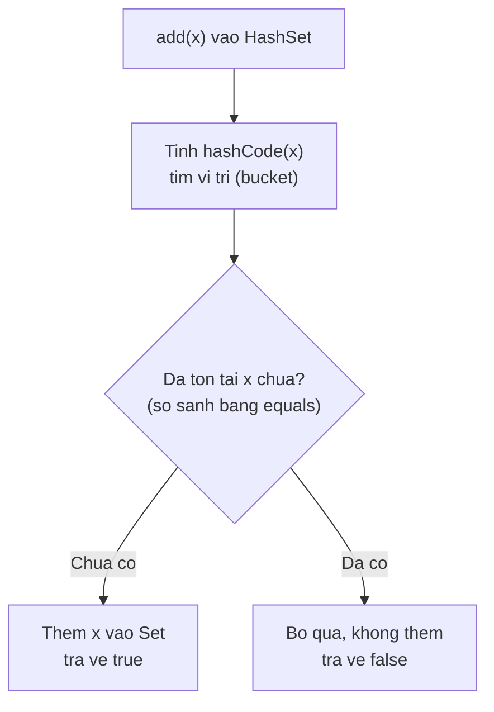
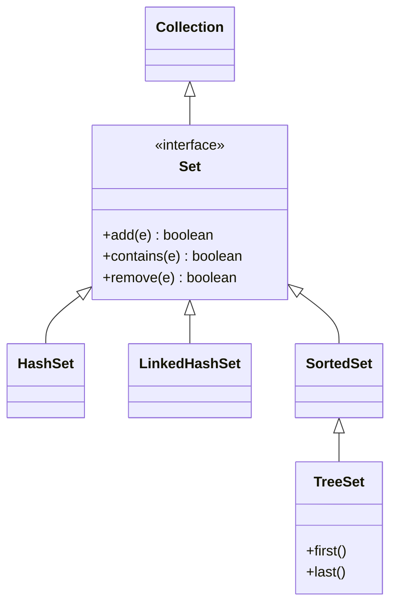

# Set

Set (tập hợp) là cấu trúc dữ liệu mà mỗi giá trị chỉ xuất hiện một lần, không cho phép trùng lặp. Nó rất hữu ích khi bạn muốn loại bỏ giá trị trùng hoặc kiểm tra nhanh một phần tử có tồn tại hay không. Bài này giới thiệu Set cùng ba loại HashSet, LinkedHashSet, TreeSet; chi tiết nằm bên dưới.

[](pathname:///img/java/set.webp)

---

:::note[Ghi nhớ nhanh]

- ⭐ **`Set` không cho phần tử trùng** — tự loại trùng và kiểm tra tồn tại rất nhanh.
- ⭐ **`HashSet`** — `add`/`contains` O(1), không quan tâm thứ tự.
- **`LinkedHashSet`** — giữ đúng thứ tự thêm vào.
- **`TreeSet`** — tự sắp xếp phần tử, hỗ trợ truy vấn dải (`first`, `last`...).
- **Phép toán tập hợp** — hợp, giao, hiệu giữa các Set.

:::

---

## Mục lục

- [Vì sao có Set?](#vì-sao-có-set)
- [Set là gì?](#set-là-gì)
- [Tạo và dùng Set](#tạo-và-dùng-set)
- [Set không cho phép trùng lặp](#set-không-cho-phép-trùng-lặp)
- [HashSet — nhanh nhưng không có thứ tự](#hashset--nhanh-nhưng-không-có-thứ-tự)
- [LinkedHashSet — giữ thứ tự thêm vào](#linkedhashset--giữ-thứ-tự-thêm-vào)
- [TreeSet — tự sắp xếp](#treeset--tự-sắp-xếp)
- [So sánh ba loại Set](#so-sánh-ba-loại-set)
- [Các thao tác trên tập hợp](#các-thao-tác-trên-tập-hợp)
- [Lỗi thường gặp](#lỗi-thường-gặp)
- [Tóm tắt](#tóm-tắt)
- [Câu hỏi phỏng vấn](#câu-hỏi-phỏng-vấn)

---

## Vì sao có Set?

**Vấn đề:** Bạn cần một tập hợp các phần tử **duy nhất** (không trùng) và phải kiểm tra "đã có chưa" thật nhanh. Nếu dùng `List`, bạn phải tự lọc trùng, và `contains` phải quét lần lượt — O(n), càng nhiều dữ liệu càng chậm.

```java
List<String> emails = new ArrayList<>();

// Phải tự kiểm tra trùng trước khi thêm
if (!emails.contains("an@gmail.com")) {   // quét O(n) toàn bộ list
    emails.add("an@gmail.com");
}

// Với hàng triệu phần tử, mỗi lần contains lại quét lại từ đầu → rất chậm
```

**Giải pháp:** Dùng `Set` — tự động **loại trùng**, không cần kiểm tra thủ công. Tùy nhu cầu mà chọn:

```java
// HashSet: add/contains O(1) — nhanh nhất, không quan tâm thứ tự
Set<String> emails = new HashSet<>();
emails.add("an@gmail.com");
emails.add("an@gmail.com");          // tự bỏ qua, không trùng
System.out.println(emails.contains("an@gmail.com")); // true, O(1)

// LinkedHashSet: giữ đúng thứ tự thêm vào
Set<String> theoThuTu = new LinkedHashSet<>();

// TreeSet: tự sắp xếp + hỗ trợ truy vấn dải (first, last, range...)
Set<Integer> daSapXep = new TreeSet<>();
```

:::tip[Dùng thực tế]

- **Loại phần tử trùng** khỏi một danh sách: đổ `List` vào `new HashSet<>(list)`.
- **Lưu tập tag/quyền duy nhất** của một user (mỗi quyền chỉ có một lần).
- **Kiểm tra tồn tại nhanh** với dữ liệu lớn: `set.contains(x)` O(1) thay vì quét list.
- **Cần dữ liệu đã sắp xếp**: dùng `TreeSet` để luôn duyệt theo thứ tự tăng dần.

:::

---

## Set là gì?

**Set** (tập hợp — nhóm các phần tử không trùng nhau) là một cấu trúc dữ liệu giống như khái niệm "tập hợp" trong toán học. Đặc điểm quan trọng nhất: **mỗi giá trị chỉ xuất hiện một lần**.

Hãy tưởng tượng một danh sách email đăng ký nhận tin. Dù một người bấm đăng ký 10 lần, bạn chỉ muốn lưu email của họ **một lần duy nhất**. Đó chính là lúc dùng Set.

So với **List** (danh sách — cho phép trùng và có thứ tự chỉ số), Set khác ở chỗ:

- Không cho phép phần tử trùng lặp.
- Không truy cập theo chỉ số (`get(0)` không tồn tại).

---

## Tạo và dùng Set

`Set` là một interface (giao diện), nên ta tạo nó qua các lớp cụ thể như `HashSet`:

```java
import java.util.HashSet;
import java.util.Set;

// Tạo một Set chứa chuỗi
Set<String> emails = new HashSet<>();

// Thêm phần tử bằng add()
emails.add("an@gmail.com");
emails.add("binh@gmail.com");

// Kiểm tra số lượng
System.out.println(emails.size()); // 2

// Kiểm tra có chứa giá trị không
System.out.println(emails.contains("an@gmail.com")); // true

// Xóa phần tử
emails.remove("binh@gmail.com");

// Duyệt qua toàn bộ Set
for (String email : emails) {
    System.out.println(email);
}
```

---

## Set không cho phép trùng lặp

Đây là tính chất cốt lõi của Set. Khi bạn thêm một giá trị đã tồn tại, Set sẽ **bỏ qua** mà không báo lỗi:

```java
Set<String> ten = new HashSet<>();

ten.add("An");
ten.add("Bình");
ten.add("An"); // bị bỏ qua vì "An" đã có

System.out.println(ten.size()); // in ra 2, không phải 3

// add() trả về true nếu thêm thành công, false nếu đã tồn tại
boolean ketQua = ten.add("An");
System.out.println(ketQua); // false
```

Ứng dụng thực tế: muốn loại bỏ các giá trị trùng trong một danh sách, chỉ cần đổ vào Set:

```java
import java.util.ArrayList;
import java.util.HashSet;

ArrayList<Integer> coTrung = new ArrayList<>();
coTrung.add(1);
coTrung.add(2);
coTrung.add(2);
coTrung.add(3);

// Đổ vào HashSet để loại trùng
HashSet<Integer> khongTrung = new HashSet<>(coTrung);
System.out.println(khongTrung.size()); // 3 (chỉ còn 1, 2, 3)
```

---

## HashSet — nhanh nhưng không có thứ tự

**HashSet** là loại Set phổ biến nhất. Nó dùng kỹ thuật **hash** (băm — biến giá trị thành một con số để định vị nhanh) nên thêm, xóa, tìm kiếm đều **rất nhanh**. Đổi lại, nó **không bảo đảm thứ tự** của các phần tử.

```java
import java.util.HashSet;

HashSet<String> mau = new HashSet<>();
mau.add("Đỏ");
mau.add("Xanh");
mau.add("Vàng");

// Thứ tự khi in ra có thể là: Vàng, Đỏ, Xanh — không đoán trước được
System.out.println(mau);
```

Dùng HashSet khi bạn chỉ quan tâm "phần tử có hay không" và **không quan tâm thứ tự**.

Cơ chế chống trùng dựa trên **hash**: khi `add(x)`, HashSet tính vị trí bằng `hashCode` rồi kiểm tra tồn tại bằng `equals`. Sơ đồ luồng:



---

## LinkedHashSet — giữ thứ tự thêm vào

**LinkedHashSet** vẫn không cho trùng lặp như HashSet, nhưng nó **ghi nhớ thứ tự bạn thêm phần tử vào**. Khi duyệt, các phần tử hiện ra đúng theo thứ tự đã thêm.

```java
import java.util.LinkedHashSet;

LinkedHashSet<String> mau = new LinkedHashSet<>();
mau.add("Đỏ");
mau.add("Xanh");
mau.add("Vàng");

// Luôn in ra đúng thứ tự: Đỏ, Xanh, Vàng
System.out.println(mau);
```

Dùng LinkedHashSet khi bạn muốn loại trùng **nhưng vẫn giữ thứ tự ban đầu**.

---

## TreeSet — tự sắp xếp

**TreeSet** không cho trùng lặp, và nó **tự động sắp xếp** các phần tử theo thứ tự tăng dần (số từ nhỏ đến lớn, chữ theo bảng chữ cái).

```java
import java.util.TreeSet;

TreeSet<Integer> so = new TreeSet<>();
so.add(5);
so.add(1);
so.add(3);
so.add(2);

// Luôn in ra theo thứ tự tăng dần: 1, 2, 3, 5
System.out.println(so);

// TreeSet có thêm các phương thức tiện lợi nhờ đã sắp xếp
System.out.println(so.first()); // 1 (nhỏ nhất)
System.out.println(so.last());  // 5 (lớn nhất)
```

Dùng TreeSet khi bạn cần các phần tử **luôn ở trạng thái đã sắp xếp**. Đổi lại, nó chậm hơn HashSet một chút.

---

## So sánh ba loại Set

| Đặc điểm | HashSet | LinkedHashSet | TreeSet |
|----------|---------|---------------|---------|
| Cho trùng lặp | Không | Không | Không |
| Thứ tự phần tử | Không xác định | Theo thứ tự thêm | Tăng dần (đã sắp xếp) |
| Tốc độ | Nhanh nhất | Hơi chậm hơn | Chậm nhất |
| Khi nào dùng | Chỉ cần kiểm tra tồn tại | Cần giữ thứ tự thêm | Cần dữ liệu sắp xếp |

Sơ đồ dưới đây tóm tắt cây phân cấp: `Set` là interface con của `Collection`, và ba lớp triển khai nằm bên dưới (mũi tên trỏ về interface cha):



---

## Các thao tác trên tập hợp

Set hỗ trợ các phép toán tập hợp giống trong toán học:

```java
import java.util.HashSet;
import java.util.Set;

Set<Integer> a = new HashSet<>();
a.add(1); a.add(2); a.add(3);

Set<Integer> b = new HashSet<>();
b.add(2); b.add(3); b.add(4);

// Phép hợp (union): gộp tất cả phần tử
Set<Integer> hop = new HashSet<>(a);
hop.addAll(b); // {1, 2, 3, 4}

// Phép giao (intersection): chỉ giữ phần tử chung
Set<Integer> giao = new HashSet<>(a);
giao.retainAll(b); // {2, 3}

// Phép hiệu (difference): bỏ đi phần tử có trong b
Set<Integer> hieu = new HashSet<>(a);
hieu.removeAll(b); // {1}
```

---

## Lỗi thường gặp

1. **Mong đợi thứ tự ở HashSet**: HashSet không có thứ tự. Nếu in ra và thấy thứ tự "lạ", đó là bình thường. Cần thứ tự thì dùng LinkedHashSet hoặc TreeSet.

2. **Cố truy cập theo chỉ số**: Set không có `get(0)`. Muốn duyệt thì dùng vòng lặp for-each.

3. **TreeSet với object tự định nghĩa**: TreeSet cần biết cách so sánh các phần tử. Nếu thêm object do bạn tự tạo mà chưa cài đặt `Comparable`, sẽ bị lỗi `ClassCastException`.

4. **Nghĩ rằng thêm trùng sẽ báo lỗi**: thực ra Set chỉ âm thầm bỏ qua, không ném lỗi. `add()` trả về `false` để báo không thêm được.

---

## Tóm tắt

- **Set** là tập hợp **không chứa phần tử trùng lặp** và không truy cập theo chỉ số.
- **HashSet**: nhanh nhất, **không có thứ tự** — dùng khi chỉ cần kiểm tra tồn tại.
- **LinkedHashSet**: giữ **thứ tự thêm vào** — dùng khi cần thứ tự ban đầu.
- **TreeSet**: **tự sắp xếp tăng dần** — dùng khi cần dữ liệu đã sắp xếp.
- Đổ một List vào Set là cách nhanh để **loại bỏ giá trị trùng**.
- Set hỗ trợ các phép `addAll` (hợp), `retainAll` (giao), `removeAll` (hiệu).

---

## Câu hỏi phỏng vấn

Những câu thường gặp về chủ đề này. Tự trả lời trước, rồi bấm **Xem đáp án** để đối chiếu.

**1. `Set` khác `List` cốt lõi ở điểm nào?**

<details className="qa">
<summary>Xem đáp án</summary>

- `Set` **không cho phần tử trùng lặp**; `List` cho phép trùng và giữ nguyên số lần xuất hiện.
- `Set` **không truy cập theo chỉ số** (không có `get(0)`); `List` truy cập được qua `get(i)`.
- `Set` không đảm bảo thứ tự trừ khi dùng `LinkedHashSet`/`TreeSet`; `List` luôn giữ đúng thứ tự đã thêm vào.
- Cả hai đều là interface con của `Collection`, đều có `add()`, `remove()`, `contains()`, `size()`.

</details>

**2. `HashSet`, `LinkedHashSet`, `TreeSet` khác nhau thế nào về thứ tự phần tử và tốc độ?**

<details className="qa">
<summary>Xem đáp án</summary>

| Loại | Thứ tự | Tốc độ `add`/`contains` | Cấu trúc bên trong |
|------|--------|--------------------------|---------------------|
| `HashSet` | Không xác định | O(1) trung bình | Bảng băm (hash table) |
| `LinkedHashSet` | Theo thứ tự thêm vào | O(1) trung bình (chậm hơn `HashSet` một chút) | Bảng băm + danh sách liên kết đôi để nhớ thứ tự |
| `TreeSet` | Tăng dần theo `Comparable`/`Comparator` | O(log n) | Cây đỏ-đen (red-black tree) |

- Chọn `HashSet` khi chỉ cần kiểm tra tồn tại nhanh, không quan tâm thứ tự.
- Chọn `LinkedHashSet` khi cần loại trùng nhưng vẫn giữ thứ tự người dùng thêm vào (ví dụ hiển thị lịch sử duyệt trang, không trùng URL).
- Chọn `TreeSet` khi cần dữ liệu luôn ở trạng thái sắp xếp, hoặc cần các truy vấn dải như `first()`, `last()`, `headSet()`, `tailSet()`.

</details>

**3. `HashSet` dựa vào đâu để biết hai phần tử là "trùng nhau"?**

<details className="qa">
<summary>Xem đáp án</summary>

`HashSet` dùng cặp phương thức **`hashCode()` và `equals()`** của phần tử:

1. Khi `add(x)`, `HashSet` gọi `x.hashCode()` để xác định **bucket** (ngăn chứa) trong bảng băm.
2. Nếu bucket đó đã có phần tử, `HashSet` gọi `equals()` để so sánh xem `x` có trùng với phần tử đã tồn tại không.
3. Chỉ khi cả hai điều kiện — cùng bucket (`hashCode` bằng nhau) và `equals()` trả về `true` — mới coi là trùng và bỏ qua.

Vì vậy nếu bạn thêm một object tự định nghĩa vào `HashSet` mà **chưa override `hashCode()` và `equals()`**, `HashSet` sẽ dùng bản mặc định của `Object` (so sánh theo địa chỉ bộ nhớ), khiến hai object có nội dung giống hệt nhau vẫn bị coi là khác nhau và không loại trùng được.

</details>

**4. Đoạn code sau in ra gì? Vì sao?**

```java
class DiemThi {
    int diem;
    DiemThi(int diem) { this.diem = diem; }
}

Set<DiemThi> set = new HashSet<>();
set.add(new DiemThi(9));
set.add(new DiemThi(9));
System.out.println(set.size());
```

<details className="qa">
<summary>Xem đáp án</summary>

In ra **`2`**, không phải `1` như nhiều người nghĩ.

- Lớp `DiemThi` **không override `hashCode()` và `equals()`**, nên `HashSet` dùng bản mặc định kế thừa từ `Object` — so sánh hai tham chiếu (reference) có trỏ tới cùng một object trong bộ nhớ hay không.
- Hai lời gọi `new DiemThi(9)` tạo ra **hai object khác nhau trên heap**, dù có cùng giá trị `diem`. Vì vậy `HashSet` coi chúng là hai phần tử khác nhau, không loại trùng.
- Muốn loại trùng theo giá trị `diem`, phải override `hashCode()` và `equals()` trong `DiemThi` (hoặc dùng `record`, tự động sinh cả hai theo mọi field).

</details>

**5. Vì sao cần override cả `hashCode()` lẫn `equals()` cùng lúc, chứ không chỉ một trong hai?**

<details className="qa">
<summary>Xem đáp án</summary>

Java có một **hợp đồng (contract)** bắt buộc giữa hai phương thức: nếu `a.equals(b)` trả về `true` thì `a.hashCode()` phải bằng `b.hashCode()`.

- Nếu chỉ override `equals()` mà giữ nguyên `hashCode()` mặc định (dựa trên địa chỉ bộ nhớ), hai object "bằng nhau" theo `equals()` vẫn rơi vào **bucket khác nhau** trong bảng băm — `HashSet` sẽ không bao giờ tìm thấy chúng là trùng, phá vỡ tính năng loại trùng.
- Nếu chỉ override `hashCode()` mà không override `equals()`, hai object có thể rơi cùng bucket nhưng `equals()` mặc định vẫn so theo địa chỉ, nên vẫn bị coi là khác nhau.
- Vì vậy phải luôn override **cả hai cùng lúc và nhất quán** (dựa trên cùng tập field). IDE hiện đại và `record` (Java 16+) tự sinh cặp này đúng chuẩn.

</details>

**6. `TreeSet` yêu cầu gì ở các phần tử để có thể sắp xếp? Điều gì xảy ra nếu thiếu?**

<details className="qa">
<summary>Xem đáp án</summary>

`TreeSet` cần biết cách **so sánh** hai phần tử để quyết định thứ tự, thông qua một trong hai cách:

- Phần tử tự định nghĩa (custom class) cài đặt interface `Comparable` và override `compareTo()`.
- Hoặc truyền một `Comparator` khi tạo `TreeSet`: `new TreeSet<>(comparator)`.

```java
class SinhVien implements Comparable<SinhVien> {
    String ten;
    int diem;
    // ...
    @Override
    public int compareTo(SinhVien khac) {
        return Integer.compare(this.diem, khac.diem);
    }
}
```

Nếu thêm một object **không cài đặt `Comparable`** vào `TreeSet` mà cũng không truyền `Comparator`, chương trình sẽ ném `ClassCastException` ngay tại thời điểm `add()`, vì `TreeSet` không biết đặt phần tử đó vào đâu trong cây.

</details>

**7. Nêu cách thực hiện phép hợp, giao, hiệu giữa hai `Set` bằng các phương thức có sẵn.**

<details className="qa">
<summary>Xem đáp án</summary>

```java
Set<Integer> a = new HashSet<>(Set.of(1, 2, 3));
Set<Integer> b = new HashSet<>(Set.of(2, 3, 4));

Set<Integer> hop = new HashSet<>(a);
hop.addAll(b);      // {1, 2, 3, 4} — hợp (union)

Set<Integer> giao = new HashSet<>(a);
giao.retainAll(b);  // {2, 3} — giao (intersection)

Set<Integer> hieu = new HashSet<>(a);
hieu.removeAll(b);  // {1} — hiệu (difference)
```

- Lưu ý: các phương thức này **thay đổi trực tiếp (mutate)** tập hợp gọi chúng, nên luôn tạo bản sao (`new HashSet<>(a)`) trước khi gọi nếu muốn giữ nguyên tập gốc.

</details>

**8. Làm thế nào để loại bỏ phần tử trùng khỏi một `List` mà vẫn giữ nguyên thứ tự ban đầu?**

<details className="qa">
<summary>Xem đáp án</summary>

Đổ thẳng `List` vào `HashSet` sẽ loại trùng nhưng **mất thứ tự ban đầu**. Muốn vừa loại trùng vừa giữ thứ tự, dùng `LinkedHashSet`:

```java
List<Integer> coTrung = List.of(3, 1, 2, 3, 1, 4);

// Sai cách nếu cần giữ thứ tự: HashSet không đảm bảo thứ tự
Set<Integer> mat_thu_tu = new HashSet<>(coTrung);

// Đúng cách: LinkedHashSet giữ nguyên thứ tự xuất hiện lần đầu
List<Integer> khongTrungGiuThuTu = new ArrayList<>(new LinkedHashSet<>(coTrung));
// Kết quả: [3, 1, 2, 4]
```

Từ Java 8 trở đi, cũng có thể dùng Stream API: `list.stream().distinct().toList()` (giữ thứ tự gặp lần đầu, do `distinct()` bảo toàn thứ tự nguồn).

</details>

**9. `Set.of(...)` (Java 9+) tạo ra Set có đặc điểm gì khác với `new HashSet<>()`?**

<details className="qa">
<summary>Xem đáp án</summary>

`Set.of(...)` tạo ra một **immutable Set (tập hợp bất biến)**, có từ Java 9:

- Không thể `add()`, `remove()`, hay `clear()` — mọi thao tác sửa đổi đều ném `UnsupportedOperationException` ngay khi gọi.
- Không chấp nhận phần tử `null` — thêm `null` sẽ ném `NullPointerException` ngay khi tạo.
- Không cho phép phần tử trùng lặp ngay trong lời gọi khởi tạo — `Set.of(1, 1)` ném `IllegalArgumentException` tại thời điểm tạo.

```java
Set<String> vaiTro = Set.of("ADMIN", "USER");
vaiTro.add("GUEST"); // LỖI: UnsupportedOperationException
```

Phù hợp khi muốn khai báo một tập hợp hằng số, không đổi trong suốt vòng đời chương trình — an toàn hơn `HashSet` thông thường vì tránh được sửa đổi ngoài ý muốn.

</details>

**10. Trong một hệ thống đa luồng, `HashSet` có an toàn không? Có lựa chọn nào thay thế?**

<details className="qa">
<summary>Xem đáp án</summary>

**Không**, `HashSet` (và cả `LinkedHashSet`, `TreeSet`) không thread-safe. Nhiều luồng cùng `add()`/`remove()` đồng thời có thể làm hỏng cấu trúc bảng băm nội bộ hoặc ném `ConcurrentModificationException` khi một luồng đang duyệt (`for-each`) trong lúc luồng khác sửa đổi.

Các lựa chọn thay thế:

- `Collections.synchronizedSet(new HashSet<>())` — bọc lại bằng khóa (lock) chung cho mọi thao tác, đơn giản nhưng giảm khả năng chạy song song.
- `ConcurrentHashMap.newKeySet()` (trong `java.util.concurrent`) — tạo một Set dựa trên `ConcurrentHashMap`, cho phép nhiều luồng đọc/ghi hiệu quả hơn nhờ khóa được chia nhỏ theo từng phần (segment) thay vì khóa toàn bộ.
- `CopyOnWriteArraySet` — phù hợp khi **đọc nhiều, ghi ít**, vì mỗi lần ghi tạo bản sao mảng mới, đọc không cần khóa.

</details>
