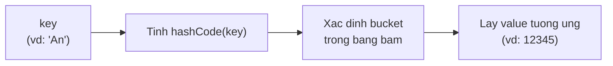
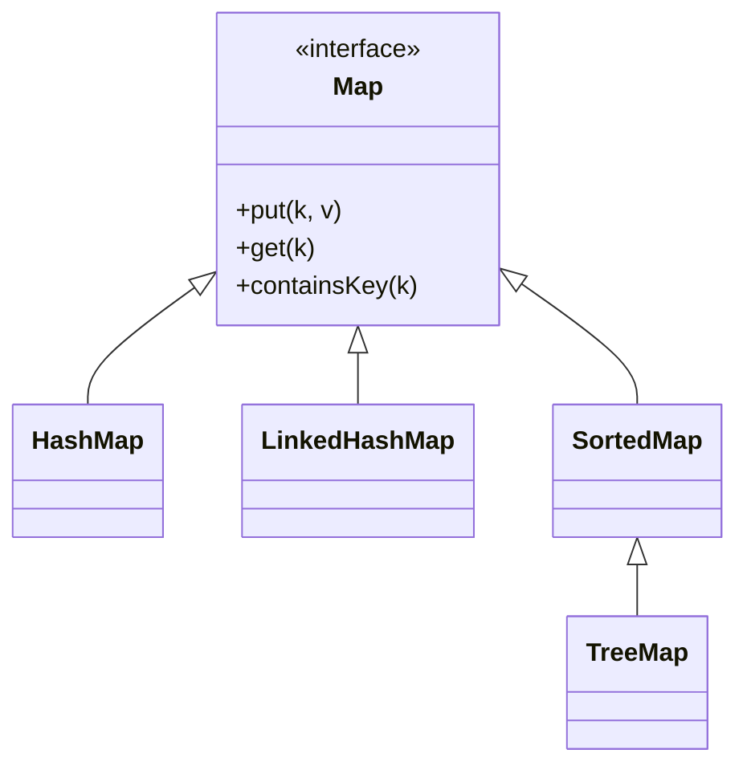

# Map

Map (ánh xạ) lưu dữ liệu dưới dạng các cặp khóa - giá trị (key-value), giống như một quyển từ điển hay danh bạ. Bạn tra cứu giá trị bằng khóa do mình tự chọn, mỗi khóa là duy nhất. Bài này giới thiệu Map cùng HashMap, LinkedHashMap, TreeMap và cách dùng phổ biến; chi tiết nằm bên dưới.

[](pathname:///img/java/map.webp)

---

:::note[Ghi nhớ nhanh]

- ⭐ **`Map` lưu cặp key-value** — tra `value` bằng `key` duy nhất, nhanh nhờ hash (O(1) với `HashMap`).
- **Phương thức chính** — `put`, `get`, `containsKey`, và `entrySet` để duyệt.
- ⭐ **Ba loại thường dùng** — `HashMap` (nhanh, không thứ tự), `LinkedHashMap` (giữ thứ tự thêm), `TreeMap` (sắp xếp theo key).
- **Ứng dụng phổ biến** — đếm số lần xuất hiện của phần tử.

:::

---

## Mục lục

- [Map là gì?](#map-là-gì)
- [Vì sao có Map?](#vì-sao-có-map)
- [Tạo Map và thêm cặp key-value](#tạo-map-và-thêm-cặp-key-value)
- [Lấy giá trị với get](#lấy-giá-trị-với-get)
- [Kiểm tra với containsKey và containsValue](#kiểm-tra-với-containskey-và-containsvalue)
- [Xóa và cập nhật](#xóa-và-cập-nhật)
- [Duyệt Map với entrySet](#duyệt-map-với-entryset)
- [HashMap, LinkedHashMap, TreeMap](#hashmap-linkedhashmap-treemap)
- [Ví dụ thực tế: đếm số lần xuất hiện](#ví-dụ-thực-tế-đếm-số-lần-xuất-hiện)
- [Lỗi thường gặp](#lỗi-thường-gặp)
- [Tóm tắt](#tóm-tắt)
- [Câu hỏi phỏng vấn](#câu-hỏi-phỏng-vấn)

---

## Map là gì?

**Map** (ánh xạ — bảng tra cứu gồm các cặp khóa-giá trị) lưu dữ liệu dưới dạng cặp **key-value** (khóa - giá trị). Mỗi **key** (khóa) là duy nhất và dùng để tra ra **value** (giá trị) tương ứng.

Hãy tưởng tượng một quyển từ điển: bạn tra "apple" (key) để biết nghĩa "quả táo" (value). Hoặc một danh bạ điện thoại: tra tên người (key) để lấy số điện thoại (value).

Khác với List (truy cập bằng chỉ số 0, 1, 2...) và Set (chỉ có giá trị), Map cho phép bạn tra cứu bằng **bất kỳ khóa nào bạn chọn**.

Sơ đồ dưới minh hoạ cách `get(key)` tra ra value nhờ **hash** (với HashMap) — cực nhanh, không phải duyệt tuần tự:



---

## Vì sao có Map?

**Vấn đề:** Ta thường cần tra ra giá trị theo **một khóa** (userId → User, từ → định nghĩa). Nếu lưu trong `List` rồi duyệt tìm thì mỗi lần tra là O(n) — chậm dần khi dữ liệu lớn — và phải tự quản lý cặp khóa-giá trị.

```java
// Tìm User theo id bằng List: phải duyệt toàn bộ, O(n)
List<User> users = layDanhSachUser();
User found = null;
for (User u : users) {
    if (u.getId() == 1001) { // duyệt từng phần tử
        found = u;
        break;
    }
}
// 1 triệu user => 1 triệu lần so sánh trong trường hợp xấu nhất
```

**Giải pháp:** `Map` lưu trực tiếp cặp **KEY → VALUE**, tra cứu theo khóa cực nhanh:

```java
// Tra User theo id bằng Map: O(1)
Map<Integer, User> usersById = new HashMap<>();
usersById.put(1001, new User(1001, "An"));

User found = usersById.get(1001); // tra thẳng theo khóa, không cần duyệt

// HashMap: tra cứu/thêm O(1) (cần hashCode/equals đúng)
// LinkedHashMap: giữ thứ tự chèn
// TreeMap: tự sắp xếp theo khóa
```

`Map` cho tra cứu nhanh và biểu diễn quan hệ ánh xạ một cách tự nhiên.

:::tip[Dùng thực tế]

- **Cache id → object**: lưu `Map<Integer, User>` để lấy lại đối tượng theo id mà không cần truy vấn lại.
- **Đếm tần suất (word → count)**: đếm số lần mỗi từ xuất hiện trong văn bản.
- **Cấu hình key → value**: lưu các tùy chọn dạng `Map<String, String>` (tên thuộc tính → giá trị).
- **TreeMap**: khi cần dữ liệu luôn được **sắp xếp theo khóa** (ví dụ bảng điểm theo tên, lịch theo ngày).

:::

---

## Tạo Map và thêm cặp key-value

`Map` là một interface, ta thường tạo qua lớp `HashMap`:

```java
import java.util.HashMap;
import java.util.Map;

// Map có key là String (tên), value là Integer (số điện thoại đơn giản hóa)
Map<String, Integer> danhBa = new HashMap<>();

// Thêm cặp key-value bằng put()
danhBa.put("An", 12345);
danhBa.put("Bình", 67890);
danhBa.put("Cường", 11111);

System.out.println(danhBa.size()); // 3
```

Phần `<String, Integer>` nghĩa là: khóa kiểu `String`, giá trị kiểu `Integer`.

Nếu `put` với một key **đã tồn tại**, giá trị cũ sẽ bị **ghi đè**:

```java
danhBa.put("An", 99999); // ghi đè số cũ của "An"
System.out.println(danhBa.get("An")); // 99999
```

---

## Lấy giá trị với get

Dùng `get(key)` để lấy giá trị tương ứng với một khóa:

```java
int soCuaAn = danhBa.get("An");
System.out.println(soCuaAn); // 99999

// Nếu key không tồn tại, get trả về null
System.out.println(danhBa.get("Dũng")); // null

// getOrDefault: trả về giá trị mặc định nếu key không có
int so = danhBa.getOrDefault("Dũng", 0);
System.out.println(so); // 0 (vì "Dũng" không tồn tại)
```

> Mẹo: `getOrDefault` rất hữu ích để tránh giá trị `null` gây lỗi.

---

## Kiểm tra với containsKey và containsValue

```java
// Kiểm tra có khóa này không
System.out.println(danhBa.containsKey("An"));   // true
System.out.println(danhBa.containsKey("Dũng")); // false

// Kiểm tra có giá trị này không
System.out.println(danhBa.containsValue(67890)); // true
```

`containsKey` rất nhanh, còn `containsValue` chậm hơn vì phải duyệt toàn bộ giá trị.

---

## Xóa và cập nhật

```java
// Xóa theo khóa
danhBa.remove("Cường");

// Cập nhật: thực chất là put lại với key cũ
danhBa.put("Bình", 88888);

// Kiểm tra Map có rỗng không
System.out.println(danhBa.isEmpty()); // false

// Xóa toàn bộ
// danhBa.clear();
```

---

## Duyệt Map với entrySet

Để duyệt qua tất cả các cặp key-value, dùng `entrySet()` (tập hợp các cặp). Mỗi cặp gọi là một **entry** (mục):

```java
import java.util.Map;

// Cách 1: duyệt qua các entry (lấy cả key và value) — KHUYÊN DÙNG
for (Map.Entry<String, Integer> entry : danhBa.entrySet()) {
    String ten = entry.getKey();    // lấy khóa
    int so = entry.getValue();      // lấy giá trị
    System.out.println(ten + " -> " + so);
}

// Cách 2: duyệt qua chỉ các khóa
for (String key : danhBa.keySet()) {
    System.out.println(key + " -> " + danhBa.get(key));
}

// Cách 3: duyệt qua chỉ các giá trị
for (int value : danhBa.values()) {
    System.out.println(value);
}
```

Cách 1 (entrySet) hiệu quả nhất vì lấy được cả key và value trong một lần duyệt.

---

## HashMap, LinkedHashMap, TreeMap

Giống như Set, Map cũng có ba biến thể tùy theo thứ tự:

```java
import java.util.HashMap;
import java.util.LinkedHashMap;
import java.util.TreeMap;
import java.util.Map;

// HashMap: nhanh nhất, KHÔNG bảo đảm thứ tự khóa
Map<String, Integer> a = new HashMap<>();

// LinkedHashMap: giữ đúng thứ tự bạn thêm vào
Map<String, Integer> b = new LinkedHashMap<>();

// TreeMap: tự sắp xếp khóa theo thứ tự tăng dần
Map<String, Integer> c = new TreeMap<>();
c.put("Cường", 1);
c.put("An", 2);
c.put("Bình", 3);
// Khi duyệt, khóa luôn theo thứ tự: An, Bình, Cường
System.out.println(c);
```

| Loại | Thứ tự khóa | Tốc độ | Khi nào dùng |
|------|-------------|--------|--------------|
| HashMap | Không xác định | Nhanh nhất | Tra cứu thông thường |
| LinkedHashMap | Theo thứ tự thêm | Hơi chậm hơn | Cần giữ thứ tự thêm |
| TreeMap | Tăng dần | Chậm nhất | Cần khóa được sắp xếp |

Cây phân cấp của `Map` (lưu ý: `Map` là nhánh **riêng**, KHÔNG thuộc `Collection`):



---

## Ví dụ thực tế: đếm số lần xuất hiện

Map cực kỳ hữu ích để đếm. Ví dụ đếm số lần mỗi từ xuất hiện trong câu:

```java
import java.util.HashMap;
import java.util.Map;

String cau = "mèo chó mèo cá mèo chó";
String[] tu = cau.split(" "); // tách câu thành mảng các từ

Map<String, Integer> demTu = new HashMap<>();

for (String t : tu) {
    // Nếu chưa có thì mặc định 0, rồi cộng thêm 1
    demTu.put(t, demTu.getOrDefault(t, 0) + 1);
}

System.out.println(demTu); // {mèo=3, chó=2, cá=1}
```

Đây là một trong những ứng dụng phổ biến nhất của Map mà bạn sẽ gặp rất nhiều.

---

## Lỗi thường gặp

1. **Quên kiểm tra null khi get**: `get(key)` trả về `null` nếu khóa không tồn tại. Nếu gán vào kiểu nguyên thủy như `int x = map.get("xyz")` mà khóa không có, sẽ bị lỗi `NullPointerException`. Hãy dùng `getOrDefault` hoặc kiểm tra `containsKey` trước.

2. **Mong đợi thứ tự ở HashMap**: HashMap không có thứ tự cố định. Cần thứ tự thì dùng LinkedHashMap hoặc TreeMap.

3. **Dùng key trùng**: nếu `put` hai lần cùng một khóa, giá trị sau ghi đè giá trị trước — không tạo hai mục.

4. **Nhầm keySet và values**: `keySet()` cho các khóa, `values()` cho các giá trị, `entrySet()` cho cả cặp. Đừng nhầm lẫn.

---

## Tóm tắt

- **Map** lưu dữ liệu dạng cặp **key-value**, mỗi khóa là duy nhất.
- `put(key, value)` thêm hoặc ghi đè; `get(key)` lấy giá trị; `getOrDefault` an toàn hơn.
- `containsKey`, `containsValue` để kiểm tra; `remove(key)` để xóa.
- Duyệt Map tốt nhất bằng `entrySet()` để lấy cả key và value.
- **HashMap** (nhanh, không thứ tự), **LinkedHashMap** (giữ thứ tự thêm), **TreeMap** (sắp xếp khóa).
- Map rất hữu ích cho bài toán **đếm số lần xuất hiện** và **tra cứu nhanh**.

---

## Câu hỏi phỏng vấn

Những câu thường gặp về chủ đề này. Tự trả lời trước, rồi bấm **Xem đáp án** để đối chiếu.

**1. `Map` khác `List` và `Set` cốt lõi ở điểm nào? Vì sao `Map` không kế thừa `Collection`?**

<details className="qa">
<summary>Xem đáp án</summary>

- `Map` lưu dữ liệu dạng **cặp key-value**, tra cứu bằng khóa; `List` và `Set` chỉ lưu **một giá trị** cho mỗi phần tử.
- `Map` là một **nhánh interface riêng** trong Java Collections Framework, không kế thừa `Collection`, vì đơn vị làm việc của nó là **cặp** (key, value) chứ không phải phần tử đơn lẻ — các phương thức như `add(e)` của `Collection` không có ý nghĩa với Map (phải là `put(k, v)`).
- Tuy vậy `Map` vẫn cung cấp `keySet()`, `values()`, `entrySet()` trả về các view dạng `Collection`, giúp tận dụng lại API duyệt/lọc quen thuộc.

</details>

**2. `HashMap` xác định vị trí lưu một cặp key-value bằng cách nào?**

<details className="qa">
<summary>Xem đáp án</summary>

1. Gọi `key.hashCode()` để tính ra một số nguyên, rồi qua một hàm băm nội bộ để xác định **bucket** (ngăn chứa) trong mảng bên trong `HashMap`.
2. Nếu bucket đó trống, đặt cặp key-value vào ngay.
3. Nếu bucket đã có phần tử khác (**collision** — đụng độ băm), `HashMap` so sánh key mới với các key đã có trong bucket bằng `equals()`; nếu trùng thì ghi đè value, nếu không trùng thì thêm vào (dùng danh sách liên kết, hoặc cây đỏ-đen nếu bucket quá đông từ Java 8).

Vì vậy, key dùng cho `HashMap` **bắt buộc phải override `hashCode()` và `equals()` nhất quán** nếu là object tự định nghĩa, nếu không việc tra cứu sẽ sai hoặc luôn miss.

</details>

**3. Đoạn code sau ném lỗi gì? Vì sao?**

```java
Map<String, Integer> map = new HashMap<>();
int soDT = map.get("Dũng");
```

<details className="qa">
<summary>Xem đáp án</summary>

Ném `NullPointerException` ngay tại dòng gán.

- `map.get("Dũng")` trả về `null` vì khóa `"Dũng"` không tồn tại trong Map.
- `int soDT = null;` yêu cầu Java **unbox** (chuyển từ `Integer` sang `int`) giá trị `null` — nhưng `null` không thể unbox thành kiểu nguyên thủy, gây `NullPointerException`.
- Cách phòng tránh: dùng `map.getOrDefault("Dũng", 0)`, hoặc kiểm tra `map.containsKey("Dũng")` trước, hoặc gán vào biến kiểu `Integer` (kiểu tham chiếu) rồi tự kiểm tra `null`.

</details>

**4. `HashMap`, `LinkedHashMap`, `TreeMap` khác nhau về thứ tự khóa và độ phức tạp như thế nào?**

<details className="qa">
<summary>Xem đáp án</summary>

| Loại | Thứ tự khóa | `get`/`put` | Cấu trúc bên trong |
|------|-------------|-------------|---------------------|
| `HashMap` | Không xác định | O(1) trung bình | Bảng băm |
| `LinkedHashMap` | Theo thứ tự thêm vào (hoặc thứ tự truy cập nếu cấu hình `accessOrder`) | O(1) trung bình | Bảng băm + danh sách liên kết đôi |
| `TreeMap` | Tăng dần theo khóa (`Comparable`/`Comparator`) | O(log n) | Cây đỏ-đen |

- `LinkedHashMap` với `accessOrder = true` còn được dùng để cài đặt **LRU cache** (Least Recently Used — loại bỏ mục ít dùng gần đây nhất) bằng cách override `removeEldestEntry()`.

</details>

**5. Nếu dùng một object tự định nghĩa làm key cho `HashMap` mà quên override `hashCode()`/`equals()`, chuyện gì xảy ra?**

<details className="qa">
<summary>Xem đáp án</summary>

```java
class UserId {
    int id;
    UserId(int id) { this.id = id; }
}

Map<UserId, String> map = new HashMap<>();
map.put(new UserId(1), "An");

System.out.println(map.get(new UserId(1))); // in ra null, KHÔNG phải "An"
```

- Vì `UserId` không override `hashCode()`/`equals()`, Java dùng bản mặc định của `Object` — so sánh theo **địa chỉ tham chiếu**.
- `new UserId(1)` ở dòng `get` là một object **hoàn toàn khác** với object đã dùng ở `put`, dù cùng giá trị `id`. `HashMap` tính `hashCode` khác nhau (hoặc bằng nhau nhưng `equals` trả `false`), nên không tìm thấy — trả về `null`.
- Bài học: key cho `HashMap`/`HashSet` phải là **immutable** và override đúng `hashCode()`/`equals()` (hoặc dùng kiểu có sẵn như `String`, `Integer`, hoặc `record`).

</details>

**6. Điều gì xảy ra nếu bạn thay đổi (mutate) một object đang được dùng làm key trong `HashMap` sau khi đã `put()`?**

<details className="qa">
<summary>Xem đáp án</summary>

Rất nguy hiểm — Map có thể **"mất" cặp key-value đó vĩnh viễn**, dù nó vẫn còn nằm trong bộ nhớ.

- `HashMap` xác định bucket dựa trên `hashCode()` của key **tại thời điểm `put()`**.
- Nếu sau đó bạn sửa field ảnh hưởng tới `hashCode()` của key (ví dụ đổi giá trị field dùng để tính hash), `hashCode()` mới sẽ khác, nhưng object vẫn nằm ở **bucket cũ**.
- Khi gọi `get(keyDaSua)`, `HashMap` tính `hashCode` mới và tìm ở bucket mới — không tìm thấy vì dữ liệu thực tế vẫn nằm ở bucket cũ.
- Đây là lý do quan trọng khiến quy tắc **key của Map/Set nên là immutable** (bất biến) trở thành best practice bắt buộc, không chỉ là khuyến nghị phong cách.

</details>

**7. Cách nào để duyệt một `Map` hiệu quả nhất khi cần cả key lẫn value? Vì sao?**

<details className="qa">
<summary>Xem đáp án</summary>

Dùng `entrySet()`:

```java
for (Map.Entry<String, Integer> entry : map.entrySet()) {
    System.out.println(entry.getKey() + " -> " + entry.getValue());
}
```

- `entrySet()` chỉ cần **duyệt bảng băm một lần**, mỗi entry đã sẵn cả key và value.
- Nếu dùng `keySet()` rồi gọi `map.get(key)` bên trong vòng lặp, mỗi lần `get()` lại là một lần tra cứu bảng băm **riêng biệt** — tốn thêm chi phí không cần thiết (dù vẫn O(1), nhưng gấp đôi số lần truy cập bảng băm so với dùng `entrySet()`).

```java
// Kém hiệu quả hơn: mỗi vòng lặp gọi thêm một lần get() riêng
for (String key : map.keySet()) {
    System.out.println(key + " -> " + map.get(key));
}
```

</details>

**8. `computeIfAbsent()` và `merge()` (Java 8+) giúp viết code đếm/gom nhóm gọn hơn thế nào so với `getOrDefault`?**

<details className="qa">
<summary>Xem đáp án</summary>

```java
Map<String, Integer> demTu = new HashMap<>();

// Cách cũ (Java 7 trở về trước)
demTu.put(t, demTu.getOrDefault(t, 0) + 1);

// Cách mới, gọn hơn, dùng merge (Java 8+)
demTu.merge(t, 1, Integer::sum);
```

- `merge(key, value, function)`: nếu key chưa có, đặt giá trị = `value`; nếu đã có, áp dụng `function` lên (giá trị cũ, `value`) để ra giá trị mới.
- `computeIfAbsent(key, function)` thường dùng để **gom nhóm (group by)** — tự tạo collection rỗng nếu key chưa có:

```java
Map<String, List<String>> theoNhom = new HashMap<>();
theoNhom.computeIfAbsent("A", k -> new ArrayList<>()).add("An");
theoNhom.computeIfAbsent("A", k -> new ArrayList<>()).add("Anh");
// {"A": ["An", "Anh"]} — chỉ tạo ArrayList mới ở lần gọi đầu tiên
```

</details>

**9. `TreeMap` yêu cầu gì ở khóa để có thể sắp xếp? Nếu key là kiểu tự định nghĩa mà không đáp ứng, chuyện gì xảy ra?**

<details className="qa">
<summary>Xem đáp án</summary>

Giống `TreeSet`, `TreeMap` cần biết cách so sánh các khóa, thông qua:

- Khóa cài đặt `Comparable` (override `compareTo()`), hoặc
- Truyền một `Comparator` khi khởi tạo: `new TreeMap<>(comparator)`.

Nếu khóa là object tự định nghĩa không thỏa một trong hai điều kiện trên, `TreeMap` sẽ ném `ClassCastException` ngay khi `put()` phần tử đầu tiên có khóa đó, vì nó không biết đặt khóa này vào đâu trong cây đỏ-đen.

</details>

**10. `HashMap` có cho phép key hoặc value là `null` không? So với `Hashtable` và `ConcurrentHashMap`?**

<details className="qa">
<summary>Xem đáp án</summary>

| Loại | Key `null`? | Value `null`? | Thread-safe? |
|------|-------------|----------------|--------------|
| `HashMap` | Cho phép (1 key `null` duy nhất) | Cho phép | Không |
| `Hashtable` (legacy, ít dùng) | Không cho phép | Không cho phép | Có (đồng bộ toàn bộ, chậm) |
| `ConcurrentHashMap` | Không cho phép | Không cho phép | Có (khóa chia nhỏ, hiệu năng tốt) |

- Lý do `ConcurrentHashMap` cấm `null`: trong môi trường đa luồng, `get(key)` trả về `null` sẽ **mơ hồ** — không phân biệt được "key không tồn tại" hay "key tồn tại nhưng value đang là `null`" khi có luồng khác đang thao tác đồng thời, dễ gây race condition khó phát hiện.

</details>

**11. Trong một ứng dụng đa luồng, tại sao không nên dùng `HashMap` trực tiếp? Nêu cách thay thế phù hợp.**

<details className="qa">
<summary>Xem đáp án</summary>

- Nhiều luồng cùng `put()` đồng thời vào `HashMap` **không đồng bộ** có thể gây hỏng cấu trúc bảng băm nội bộ (ví dụ vòng lặp vô hạn khi resize ở các phiên bản Java cũ), mất dữ liệu, hoặc `ConcurrentModificationException` khi một luồng duyệt trong lúc luồng khác sửa đổi.
- Giải pháp:
  - `Collections.synchronizedMap(new HashMap<>())` — đơn giản, khóa toàn bộ Map cho mỗi thao tác, nhưng giảm khả năng chạy song song.
  - `ConcurrentHashMap` — lựa chọn phổ biến nhất trong thực tế, chia khóa (lock) theo từng phần dữ liệu (segment/bucket) nên nhiều luồng có thể đọc/ghi các phần khác nhau **đồng thời** mà không chặn nhau, hiệu năng tốt hơn hẳn `synchronizedMap` trong tải cao.

</details>

**12. So sánh `equals()`/`hashCode()` mặc định của `record` (Java 16+) với việc tự viết bằng tay khi dùng làm key cho `Map`.**

<details className="qa">
<summary>Xem đáp án</summary>

```java
record ToaDo(int x, int y) {}

Map<ToaDo, String> oNho = new HashMap<>();
oNho.put(new ToaDo(1, 2), "Kho bau");

System.out.println(oNho.get(new ToaDo(1, 2))); // "Kho bau" — hoạt động đúng
```

- `record` (từ Java 16) **tự động sinh** `equals()`, `hashCode()`, và `toString()` dựa trên **toàn bộ các field khai báo trong phần header**, theo đúng hợp đồng contract giữa hai phương thức — không cần tự viết tay và không lo viết sai/thiếu field.
- So với việc tự override bằng tay: `record` giảm rủi ro lỗi con người (quên override một trong hai, hoặc tính hash dựa trên field khác với field dùng trong `equals`), rất phù hợp để làm key bất biến (immutable) cho `Map`/`Set` — vì `record` mặc định cũng là immutable (mọi field đều `final`).

</details>
