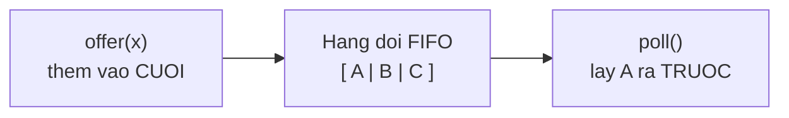
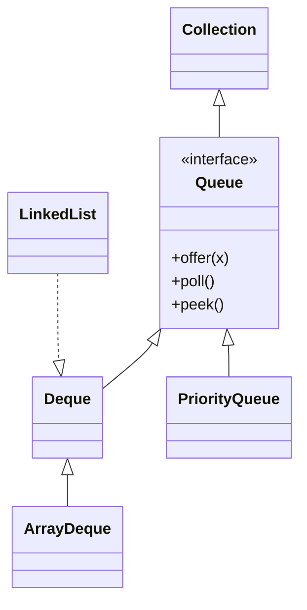

# Queue (Hàng đợi)

Queue (hàng đợi) là cấu trúc xử lý phần tử theo nguyên tắc vào trước ra trước (FIFO), giống như hàng người xếp hàng mua vé. Nó phù hợp cho các bài toán cần xử lý lần lượt theo đúng thứ tự đến. Bài này giới thiệu Queue, bộ phương thức offer/poll/peek và PriorityQueue; chi tiết nằm bên dưới.

---

:::note[Ghi nhớ nhanh]

- ⭐ **`Queue` là FIFO** — vào trước ra trước; thêm ở cuối, lấy ở đầu, đều hiệu quả.
- **`offer`/`poll`/`peek`** — thêm/lấy/xem phần tử đầu, trả về `null`/`false` thay vì ném lỗi.
- **Lớp triển khai** — `LinkedList` và `ArrayDeque`.
- ⭐ **`PriorityQueue`** — lấy phần tử theo độ ưu tiên thay vì thứ tự đến.

:::

---

## Mục lục

- [Vì sao có Queue?](#vì-sao-có-queue)
- [Queue là gì?](#queue-là-gì)
- [Nguyên tắc FIFO](#nguyên-tắc-fifo)
- [Tạo Queue và các phương thức cơ bản](#tạo-queue-và-các-phương-thức-cơ-bản)
- [offer, poll, peek](#offer-poll-peek)
- [Vì sao nên dùng offer/poll/peek?](#vì-sao-nên-dùng-offerpollpeek)
- [LinkedList làm Queue](#linkedlist-làm-queue)
- [PriorityQueue — hàng đợi ưu tiên](#priorityqueue--hàng-đợi-ưu-tiên)
- [Ví dụ thực tế](#ví-dụ-thực-tế)
- [Lỗi thường gặp](#lỗi-thường-gặp)
- [Tóm tắt](#tóm-tắt)

---

## Vì sao có Queue?

**Vấn đề:** Nhiều bài toán cần xử lý phần tử theo **đúng thứ tự đến** (ai đến trước phục vụ trước — FIFO): hàng đợi tác vụ, hàng in ấn, duyệt đồ thị BFS. Nếu dùng `ArrayList` rồi `remove(0)` để lấy phần tử đầu thì vừa chậm vừa khó hiểu ý đồ.

```java
import java.util.ArrayList;
import java.util.List;

List<String> tacVu = new ArrayList<>();
tacVu.add("Việc 1");
tacVu.add("Việc 2");
tacVu.add("Việc 3");

// Lấy việc đầu tiên ra xử lý
String dau = tacVu.remove(0); // O(n): phải dịch toàn bộ phần tử còn lại lên trước
// Lặp lại remove(0) nhiều lần → rất chậm, và nhìn vào không rõ đây là "hàng đợi FIFO"
```

**Giải pháp:** Dùng `Queue` (FIFO) với bộ `offer`/`poll`/`peek` — thêm vào cuối, lấy từ đầu, đều hiệu quả. `LinkedList`/`ArrayDeque` là lớp triển khai; `PriorityQueue` lấy theo độ ưu tiên thay vì thứ tự đến.

```java
import java.util.LinkedList;
import java.util.Queue;

Queue<String> hangDoi = new LinkedList<>();
hangDoi.offer("Việc 1"); // thêm vào cuối
hangDoi.offer("Việc 2");
hangDoi.offer("Việc 3");

// Lấy việc đầu hàng ra xử lý — hiệu quả, ý đồ FIFO rõ ràng
while (!hangDoi.isEmpty()) {
    System.out.println("Xử lý: " + hangDoi.poll());
}
```

:::tip[Dùng thực tế]
- **Hàng đợi công việc/job:** các tác vụ xếp hàng xử lý lần lượt theo thứ tự gửi.
- **Duyệt đồ thị BFS:** dùng Queue để duyệt theo từng lớp (level) từ gốc ra.
- **Producer-consumer giữa các thread:** dùng `BlockingQueue` để luồng tạo dữ liệu và luồng xử lý phối hợp an toàn.
- **Xử lý theo độ ưu tiên:** dùng `PriorityQueue` khi việc khẩn cần làm trước (ví dụ bệnh nhân nặng khám trước).
:::

---

## Queue là gì?

**Queue** (hàng đợi — dãy phần tử xử lý theo thứ tự vào trước ra trước) hoạt động giống y hệt hàng người xếp hàng mua vé. Ai đến trước thì được phục vụ trước, ai đến sau xếp ở cuối hàng và phải chờ.

Bạn thêm phần tử vào **cuối hàng** và lấy phần tử ra từ **đầu hàng**. Đây là cấu trúc rất tự nhiên cho các bài toán "xử lý lần lượt theo thứ tự đến".

---

## Nguyên tắc FIFO

Queue tuân theo nguyên tắc **FIFO** (First In, First Out — vào trước, ra trước). Phần tử nào được thêm vào sớm nhất sẽ được lấy ra sớm nhất.

```
Thêm vào:  A → B → C
                          ┌───┬───┬───┐
Hàng đợi:    (đầu)  A   B   C   (cuối)
                          └───┴───┴───┘
Lấy ra:    A trước, rồi B, rồi C
```

Hãy nhớ hình ảnh hàng người: người đầu tiên (A) rời đi trước.

Cùng nhìn sơ đồ luồng FIFO: thêm ở cuối bằng `offer`, lấy ở đầu bằng `poll`:



---

## Tạo Queue và các phương thức cơ bản

`Queue` là một interface. Lớp triển khai phổ biến nhất là `LinkedList`:

```java
import java.util.LinkedList;
import java.util.Queue;

// Tạo hàng đợi chứa chuỗi
Queue<String> hangDoi = new LinkedList<>();

// Thêm vào cuối hàng
hangDoi.offer("An");
hangDoi.offer("Bình");
hangDoi.offer("Cường");

System.out.println(hangDoi); // [An, Bình, Cường]

// Xem người đầu hàng nhưng KHÔNG lấy ra
System.out.println(hangDoi.peek()); // An

// Lấy người đầu hàng RA khỏi hàng
String nguoiDau = hangDoi.poll();
System.out.println(nguoiDau);  // An
System.out.println(hangDoi);   // [Bình, Cường]
```

Cây phân cấp: `Queue` là interface con của `Collection`; `Deque`, `PriorityQueue` là các nhánh, còn `LinkedList` triển khai `Deque`:



---

## offer, poll, peek

Ba phương thức quan trọng nhất của Queue:

| Phương thức | Ý nghĩa | Khi hàng đợi rỗng |
|-------------|---------|-------------------|
| `offer(x)` | Thêm `x` vào cuối hàng | Trả về `false` |
| `poll()` | Lấy và **xóa** phần tử đầu hàng | Trả về `null` |
| `peek()` | **Xem** phần tử đầu hàng (không xóa) | Trả về `null` |

```java
Queue<Integer> q = new LinkedList<>();

q.offer(10); // thêm 10
q.offer(20); // thêm 20

System.out.println(q.peek()); // 10 (xem, vẫn còn trong hàng)
System.out.println(q.poll()); // 10 (lấy ra, bị xóa)
System.out.println(q.poll()); // 20
System.out.println(q.poll()); // null (hàng đã rỗng)
```

---

## Vì sao nên dùng offer/poll/peek?

Queue còn có bộ phương thức khác là `add`, `remove`, `element`. Chúng làm điều tương tự nhưng **ném ra exception (ngoại lệ — lỗi) khi hàng đợi rỗng** thay vì trả về giá trị an toàn.

```java
Queue<Integer> q = new LinkedList<>();

// add/remove/element: ném lỗi khi rỗng
// q.remove();  // ném NoSuchElementException nếu rỗng

// offer/poll/peek: an toàn, trả về false hoặc null khi rỗng
q.poll(); // trả về null, không gây lỗi
```

> Lời khuyên cho người mới: hãy ưu tiên **offer, poll, peek** vì chúng an toàn hơn, không làm chương trình dừng đột ngột.

---

## LinkedList làm Queue

**LinkedList** (danh sách liên kết — các phần tử nối với nhau như mắt xích) là lớp thường dùng nhất để tạo Queue. Nó hỗ trợ thêm/xóa ở hai đầu rất hiệu quả.

```java
import java.util.LinkedList;
import java.util.Queue;

Queue<String> veXemPhim = new LinkedList<>();
veXemPhim.offer("Khách 1");
veXemPhim.offer("Khách 2");

// Phục vụ lần lượt theo thứ tự đến
while (!veXemPhim.isEmpty()) {
    System.out.println("Đang phục vụ: " + veXemPhim.poll());
}
```

---

## PriorityQueue — hàng đợi ưu tiên

**PriorityQueue** (hàng đợi ưu tiên) khác Queue thường: nó **không** theo thứ tự vào trước ra trước, mà lấy ra phần tử **nhỏ nhất (ưu tiên cao nhất) trước**, bất kể thêm vào lúc nào.

```java
import java.util.PriorityQueue;
import java.util.Queue;

Queue<Integer> pq = new PriorityQueue<>();

pq.offer(30);
pq.offer(10);
pq.offer(20);

// Luôn lấy ra số nhỏ nhất trước
System.out.println(pq.poll()); // 10
System.out.println(pq.poll()); // 20
System.out.println(pq.poll()); // 30
```

Ứng dụng: xử lý công việc theo mức độ khẩn cấp. Ví dụ trong bệnh viện, bệnh nhân nặng (ưu tiên cao) được khám trước dù đến sau.

---

## Ví dụ thực tế

Mô phỏng hàng đợi in tài liệu của máy in:

```java
import java.util.LinkedList;
import java.util.Queue;

Queue<String> hangIn = new LinkedList<>();

// Các tài liệu được gửi đến lần lượt
hangIn.offer("Báo cáo.pdf");
hangIn.offer("Hóa đơn.pdf");
hangIn.offer("Hợp đồng.pdf");

// Máy in xử lý theo đúng thứ tự gửi (FIFO)
System.out.println("Còn " + hangIn.size() + " tài liệu chờ in");

while (!hangIn.isEmpty()) {
    String taiLieu = hangIn.poll();
    System.out.println("Đang in: " + taiLieu);
}

System.out.println("Đã in xong tất cả!");
```

---

## Lỗi thường gặp

1. **Quên kiểm tra rỗng trước khi poll**: nếu dùng `remove()` (không phải `poll()`) trên hàng rỗng sẽ ném lỗi. Luôn kiểm tra `!queue.isEmpty()` hoặc dùng `poll()` an toàn.

2. **Mong PriorityQueue theo thứ tự FIFO**: PriorityQueue lấy ra phần tử nhỏ nhất, KHÔNG theo thứ tự thêm vào. In trực tiếp `System.out.println(pq)` có thể thấy thứ tự "lộn xộn" — đó là cấu trúc nội bộ, không phải thứ tự lấy ra.

3. **Nhầm peek và poll**: `peek()` chỉ xem, `poll()` xem **và** xóa. Dùng nhầm có thể khiến bạn xử lý cùng một phần tử nhiều lần hoặc bỏ sót.

4. **Quên import**: cần `import java.util.Queue;` và `import java.util.LinkedList;` (hoặc `PriorityQueue`).

---

## Tóm tắt

- **Queue** là hàng đợi theo nguyên tắc **FIFO** (vào trước, ra trước) — như hàng người xếp hàng.
- Ba phương thức chính: `offer` (thêm cuối), `poll` (lấy & xóa đầu), `peek` (xem đầu).
- Ưu tiên bộ `offer/poll/peek` vì an toàn (trả về `false`/`null` khi rỗng) thay vì `add/remove/element` (ném lỗi).
- **LinkedList** là lớp phổ biến để tạo Queue.
- **PriorityQueue** lấy ra phần tử **nhỏ nhất trước**, dùng cho bài toán ưu tiên.
- Queue phù hợp cho các bài toán **xử lý lần lượt theo thứ tự đến**.
