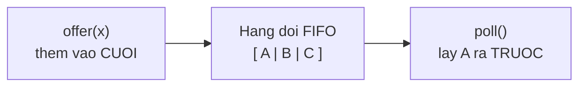
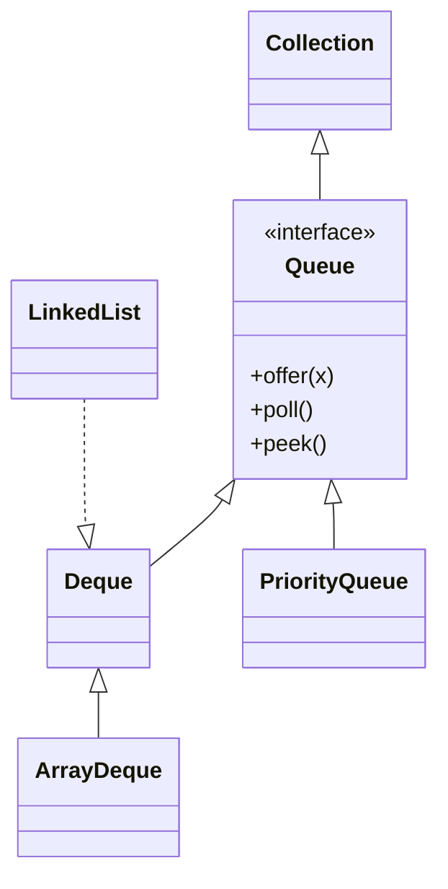

# Queue (Hàng đợi)

Queue (hàng đợi) là cấu trúc xử lý phần tử theo nguyên tắc vào trước ra trước (FIFO), giống như hàng người xếp hàng mua vé. Nó phù hợp cho các bài toán cần xử lý lần lượt theo đúng thứ tự đến. Bài này giới thiệu Queue, bộ phương thức offer/poll/peek và PriorityQueue; chi tiết nằm bên dưới.

[](pathname:///img/java/queue.webp)

---

:::note[Ghi nhớ nhanh]

- ⭐ **`Queue` là FIFO** — vào trước ra trước; thêm ở cuối, lấy ở đầu, đều hiệu quả.
- **`offer`/`poll`/`peek`** — thêm/lấy/xem phần tử đầu, trả về `null`/`false` thay vì ném lỗi.
- **Lớp triển khai** — `LinkedList` và `ArrayDeque`.
- ⭐ **`PriorityQueue`** — lấy phần tử theo độ ưu tiên thay vì thứ tự đến.

:::

---

## Mục lục

- [Vì sao có Queue?](#vì-sao-có-queue)
- [Queue là gì?](#queue-là-gì)
- [Nguyên tắc FIFO](#nguyên-tắc-fifo)
- [Tạo Queue và các phương thức cơ bản](#tạo-queue-và-các-phương-thức-cơ-bản)
- [offer, poll, peek](#offer-poll-peek)
- [Vì sao nên dùng offer/poll/peek?](#vì-sao-nên-dùng-offerpollpeek)
- [LinkedList làm Queue](#linkedlist-làm-queue)
- [PriorityQueue — hàng đợi ưu tiên](#priorityqueue--hàng-đợi-ưu-tiên)
- [Ví dụ thực tế](#ví-dụ-thực-tế)
- [Lỗi thường gặp](#lỗi-thường-gặp)
- [Tóm tắt](#tóm-tắt)
- [Câu hỏi phỏng vấn](#câu-hỏi-phỏng-vấn)

---

## Vì sao có Queue?

**Vấn đề:** Nhiều bài toán cần xử lý phần tử theo **đúng thứ tự đến** (ai đến trước phục vụ trước — FIFO): hàng đợi tác vụ, hàng in ấn, duyệt đồ thị BFS. Nếu dùng `ArrayList` rồi `remove(0)` để lấy phần tử đầu thì vừa chậm vừa khó hiểu ý đồ.

```java
import java.util.ArrayList;
import java.util.List;

List<String> tacVu = new ArrayList<>();
tacVu.add("Việc 1");
tacVu.add("Việc 2");
tacVu.add("Việc 3");

// Lấy việc đầu tiên ra xử lý
String dau = tacVu.remove(0); // O(n): phải dịch toàn bộ phần tử còn lại lên trước
// Lặp lại remove(0) nhiều lần → rất chậm, và nhìn vào không rõ đây là "hàng đợi FIFO"
```

**Giải pháp:** Dùng `Queue` (FIFO) với bộ `offer`/`poll`/`peek` — thêm vào cuối, lấy từ đầu, đều hiệu quả. `LinkedList`/`ArrayDeque` là lớp triển khai; `PriorityQueue` lấy theo độ ưu tiên thay vì thứ tự đến.

```java
import java.util.LinkedList;
import java.util.Queue;

Queue<String> hangDoi = new LinkedList<>();
hangDoi.offer("Việc 1"); // thêm vào cuối
hangDoi.offer("Việc 2");
hangDoi.offer("Việc 3");

// Lấy việc đầu hàng ra xử lý — hiệu quả, ý đồ FIFO rõ ràng
while (!hangDoi.isEmpty()) {
    System.out.println("Xử lý: " + hangDoi.poll());
}
```

:::tip[Dùng thực tế]
- **Hàng đợi công việc/job:** các tác vụ xếp hàng xử lý lần lượt theo thứ tự gửi.
- **Duyệt đồ thị BFS:** dùng Queue để duyệt theo từng lớp (level) từ gốc ra.
- **Producer-consumer giữa các thread:** dùng `BlockingQueue` để luồng tạo dữ liệu và luồng xử lý phối hợp an toàn.
- **Xử lý theo độ ưu tiên:** dùng `PriorityQueue` khi việc khẩn cần làm trước (ví dụ bệnh nhân nặng khám trước).
:::

---

## Queue là gì?

**Queue** (hàng đợi — dãy phần tử xử lý theo thứ tự vào trước ra trước) hoạt động giống y hệt hàng người xếp hàng mua vé. Ai đến trước thì được phục vụ trước, ai đến sau xếp ở cuối hàng và phải chờ.

Bạn thêm phần tử vào **cuối hàng** và lấy phần tử ra từ **đầu hàng**. Đây là cấu trúc rất tự nhiên cho các bài toán "xử lý lần lượt theo thứ tự đến".

---

## Nguyên tắc FIFO

Queue tuân theo nguyên tắc **FIFO** (First In, First Out — vào trước, ra trước). Phần tử nào được thêm vào sớm nhất sẽ được lấy ra sớm nhất.

```
Thêm vào:  A → B → C
                          ┌───┬───┬───┐
Hàng đợi:    (đầu)  A   B   C   (cuối)
                          └───┴───┴───┘
Lấy ra:    A trước, rồi B, rồi C
```

Hãy nhớ hình ảnh hàng người: người đầu tiên (A) rời đi trước.

Cùng nhìn sơ đồ luồng FIFO: thêm ở cuối bằng `offer`, lấy ở đầu bằng `poll`:


```mermaid
flowchart LR
    IN["offer(x)<br/>them vao CUOI"] --> Q["Hang doi FIFO<br/>[ A | B | C ]"]
    Q --> OUT["poll()<br/>lay A ra TRUOC"]
```

---

## Tạo Queue và các phương thức cơ bản

`Queue` là một interface. Lớp triển khai phổ biến nhất là `LinkedList`:

```java
import java.util.LinkedList;
import java.util.Queue;

// Tạo hàng đợi chứa chuỗi
Queue<String> hangDoi = new LinkedList<>();

// Thêm vào cuối hàng
hangDoi.offer("An");
hangDoi.offer("Bình");
hangDoi.offer("Cường");

System.out.println(hangDoi); // [An, Bình, Cường]

// Xem người đầu hàng nhưng KHÔNG lấy ra
System.out.println(hangDoi.peek()); // An

// Lấy người đầu hàng RA khỏi hàng
String nguoiDau = hangDoi.poll();
System.out.println(nguoiDau);  // An
System.out.println(hangDoi);   // [Bình, Cường]
```

Cây phân cấp: `Queue` là interface con của `Collection`; `Deque`, `PriorityQueue` là các nhánh, còn `LinkedList` triển khai `Deque`:


```mermaid
classDiagram
    Collection <|-- Queue
    Queue <|-- Deque
    Queue <|-- PriorityQueue
    Deque <|-- ArrayDeque
    LinkedList ..|> Deque
    class Queue {
        <<interface>>
        +offer(x)
        +poll()
        +peek()
    }
```

---

## offer, poll, peek

Ba phương thức quan trọng nhất của Queue:

| Phương thức | Ý nghĩa | Khi hàng đợi rỗng |
|-------------|---------|-------------------|
| `offer(x)` | Thêm `x` vào cuối hàng | Trả về `false` |
| `poll()` | Lấy và **xóa** phần tử đầu hàng | Trả về `null` |
| `peek()` | **Xem** phần tử đầu hàng (không xóa) | Trả về `null` |

```java
Queue<Integer> q = new LinkedList<>();

q.offer(10); // thêm 10
q.offer(20); // thêm 20

System.out.println(q.peek()); // 10 (xem, vẫn còn trong hàng)
System.out.println(q.poll()); // 10 (lấy ra, bị xóa)
System.out.println(q.poll()); // 20
System.out.println(q.poll()); // null (hàng đã rỗng)
```

---

## Vì sao nên dùng offer/poll/peek?

Queue còn có bộ phương thức khác là `add`, `remove`, `element`. Chúng làm điều tương tự nhưng **ném ra exception (ngoại lệ — lỗi) khi hàng đợi rỗng** thay vì trả về giá trị an toàn.

```java
Queue<Integer> q = new LinkedList<>();

// add/remove/element: ném lỗi khi rỗng
// q.remove();  // ném NoSuchElementException nếu rỗng

// offer/poll/peek: an toàn, trả về false hoặc null khi rỗng
q.poll(); // trả về null, không gây lỗi
```

> Lời khuyên cho người mới: hãy ưu tiên **offer, poll, peek** vì chúng an toàn hơn, không làm chương trình dừng đột ngột.

---

## LinkedList làm Queue

**LinkedList** (danh sách liên kết — các phần tử nối với nhau như mắt xích) là lớp thường dùng nhất để tạo Queue. Nó hỗ trợ thêm/xóa ở hai đầu rất hiệu quả.

```java
import java.util.LinkedList;
import java.util.Queue;

Queue<String> veXemPhim = new LinkedList<>();
veXemPhim.offer("Khách 1");
veXemPhim.offer("Khách 2");

// Phục vụ lần lượt theo thứ tự đến
while (!veXemPhim.isEmpty()) {
    System.out.println("Đang phục vụ: " + veXemPhim.poll());
}
```

---

## PriorityQueue — hàng đợi ưu tiên

**PriorityQueue** (hàng đợi ưu tiên) khác Queue thường: nó **không** theo thứ tự vào trước ra trước, mà lấy ra phần tử **nhỏ nhất (ưu tiên cao nhất) trước**, bất kể thêm vào lúc nào.

```java
import java.util.PriorityQueue;
import java.util.Queue;

Queue<Integer> pq = new PriorityQueue<>();

pq.offer(30);
pq.offer(10);
pq.offer(20);

// Luôn lấy ra số nhỏ nhất trước
System.out.println(pq.poll()); // 10
System.out.println(pq.poll()); // 20
System.out.println(pq.poll()); // 30
```

Ứng dụng: xử lý công việc theo mức độ khẩn cấp. Ví dụ trong bệnh viện, bệnh nhân nặng (ưu tiên cao) được khám trước dù đến sau.

---

## Ví dụ thực tế

Mô phỏng hàng đợi in tài liệu của máy in:

```java
import java.util.LinkedList;
import java.util.Queue;

Queue<String> hangIn = new LinkedList<>();

// Các tài liệu được gửi đến lần lượt
hangIn.offer("Báo cáo.pdf");
hangIn.offer("Hóa đơn.pdf");
hangIn.offer("Hợp đồng.pdf");

// Máy in xử lý theo đúng thứ tự gửi (FIFO)
System.out.println("Còn " + hangIn.size() + " tài liệu chờ in");

while (!hangIn.isEmpty()) {
    String taiLieu = hangIn.poll();
    System.out.println("Đang in: " + taiLieu);
}

System.out.println("Đã in xong tất cả!");
```

---

## Lỗi thường gặp

1. **Quên kiểm tra rỗng trước khi poll**: nếu dùng `remove()` (không phải `poll()`) trên hàng rỗng sẽ ném lỗi. Luôn kiểm tra `!queue.isEmpty()` hoặc dùng `poll()` an toàn.

2. **Mong PriorityQueue theo thứ tự FIFO**: PriorityQueue lấy ra phần tử nhỏ nhất, KHÔNG theo thứ tự thêm vào. In trực tiếp `System.out.println(pq)` có thể thấy thứ tự "lộn xộn" — đó là cấu trúc nội bộ, không phải thứ tự lấy ra.

3. **Nhầm peek và poll**: `peek()` chỉ xem, `poll()` xem **và** xóa. Dùng nhầm có thể khiến bạn xử lý cùng một phần tử nhiều lần hoặc bỏ sót.

4. **Quên import**: cần `import java.util.Queue;` và `import java.util.LinkedList;` (hoặc `PriorityQueue`).

---

## Tóm tắt

- **Queue** là hàng đợi theo nguyên tắc **FIFO** (vào trước, ra trước) — như hàng người xếp hàng.
- Ba phương thức chính: `offer` (thêm cuối), `poll` (lấy & xóa đầu), `peek` (xem đầu).
- Ưu tiên bộ `offer/poll/peek` vì an toàn (trả về `false`/`null` khi rỗng) thay vì `add/remove/element` (ném lỗi).
- **LinkedList** là lớp phổ biến để tạo Queue.
- **PriorityQueue** lấy ra phần tử **nhỏ nhất trước**, dùng cho bài toán ưu tiên.
- Queue phù hợp cho các bài toán **xử lý lần lượt theo thứ tự đến**.

---

## Câu hỏi phỏng vấn

Những câu thường gặp về chủ đề này. Tự trả lời trước, rồi bấm **Xem đáp án** để đối chiếu.

**1. `Queue` khác `Stack` ở nguyên tắc xử lý nào?**

<details className="qa">
<summary>Xem đáp án</summary>

- `Queue` theo nguyên tắc **FIFO** (First In, First Out — vào trước ra trước): thêm ở cuối bằng `offer()`, lấy ở đầu bằng `poll()`.
- `Stack` theo nguyên tắc **LIFO** (Last In, First Out — vào sau ra trước): thêm và lấy đều ở cùng một đầu (đỉnh stack) bằng `push()`/`pop()`.
- Ví dụ trực quan: `Queue` giống hàng người xếp hàng mua vé (ai đến trước ra trước); `Stack` giống chồng đĩa (đĩa đặt lên sau cùng lại được lấy ra trước).

</details>

**2. Vì sao nên ưu tiên `offer`/`poll`/`peek` thay vì `add`/`remove`/`element`?**

<details className="qa">
<summary>Xem đáp án</summary>

Cả hai bộ phương thức làm cùng chức năng, nhưng khác nhau cách xử lý khi hàng đợi **rỗng hoặc đầy**:

| Thao tác | Bộ an toàn | Bộ ném ngoại lệ |
|----------|-----------|------------------|
| Thêm | `offer(x)` → `false` nếu thất bại | `add(x)` → ném `IllegalStateException` |
| Lấy & xóa đầu | `poll()` → `null` nếu rỗng | `remove()` → ném `NoSuchElementException` |
| Xem đầu | `peek()` → `null` nếu rỗng | `element()` → ném `NoSuchElementException` |

- Dùng bộ `offer/poll/peek` giúp code không bị dừng đột ngột (crash) vì ngoại lệ không mong muốn khi hàng đợi rỗng — chỉ cần kiểm tra giá trị trả về (`null`/`false`) là đủ, phù hợp với các vòng lặp xử lý liên tục kiểu `while (!queue.isEmpty())`.

</details>

**3. `LinkedList` và `ArrayDeque` — cùng cài đặt `Queue`, khi nào nên chọn cái nào?**

<details className="qa">
<summary>Xem đáp án</summary>

- **`ArrayDeque`** dùng mảng động (resizable array) làm cấu trúc bên trong, không có overhead của con trỏ liên kết như `LinkedList` — **nhanh hơn** và tiết kiệm bộ nhớ hơn cho hầu hết trường hợp dùng làm Queue hoặc Stack thuần túy.
- **`LinkedList`** dùng danh sách liên kết đôi (doubly linked list), phù hợp hơn khi cần **thêm/xóa thường xuyên ở giữa danh sách** (không chỉ hai đầu) hoặc cần vừa dùng như `List` vừa như `Queue`.
- Java Docs khuyến nghị: khi chỉ cần dùng thuần túy như Queue/Stack (chỉ thao tác ở hai đầu), nên ưu tiên `ArrayDeque` thay vì `LinkedList` vì hiệu năng tốt hơn trong đa số trường hợp.

</details>

**4. `PriorityQueue` sắp xếp thứ tự lấy ra dựa trên tiêu chí nào? Mặc định lấy ra phần tử như thế nào?**

<details className="qa">
<summary>Xem đáp án</summary>

- Mặc định, `PriorityQueue` lấy ra phần tử **nhỏ nhất trước** (min-heap), dựa trên **thứ tự tự nhiên (natural ordering)** — yêu cầu phần tử cài đặt `Comparable` (ví dụ `Integer`, `String` đã có sẵn).
- Có thể tùy chỉnh thứ tự bằng cách truyền một `Comparator` khi khởi tạo, ví dụ để lấy ra phần tử **lớn nhất trước** (max-heap):

```java
PriorityQueue<Integer> maxHeap = new PriorityQueue<>(Comparator.reverseOrder());
maxHeap.offer(30);
maxHeap.offer(10);
maxHeap.offer(20);
System.out.println(maxHeap.poll()); // 30 — lớn nhất trước
```

- Cấu trúc bên trong là **heap nhị phân (binary heap)**, đảm bảo `offer()`/`poll()` có độ phức tạp O(log n), còn `peek()` là O(1).

</details>

**5. Đoạn code sau in ra thứ tự nào? Giải thích vì sao nhiều người nhầm.**

```java
Queue<Integer> pq = new PriorityQueue<>();
pq.offer(30);
pq.offer(10);
pq.offer(20);
System.out.println(pq); // in trực tiếp cả Queue
```

<details className="qa">
<summary>Xem đáp án</summary>

`System.out.println(pq)` **không** in ra theo thứ tự `10, 20, 30` mà in ra thứ tự **lưu trữ nội bộ** của heap (ví dụ có thể là `[10, 30, 20]` tùy cách heap sắp xếp cây), vì `toString()` của `PriorityQueue` duyệt mảng nội bộ chứ không đảm bảo thứ tự ưu tiên.

- Chỉ có `poll()` (gọi liên tục) mới đảm bảo lấy ra đúng thứ tự ưu tiên: nhỏ nhất trước.
- Đây là lỗi rất hay gặp: nhầm rằng in trực tiếp `PriorityQueue` sẽ hiện ra thứ tự đã sắp xếp, trong khi thực chất phải `poll()` từng phần tử ra mới đúng thứ tự.

```java
while (!pq.isEmpty()) {
    System.out.println(pq.poll()); // đúng thứ tự: 10, 20, 30
}
```

</details>

**6. `Deque` (Double-Ended Queue) khác `Queue` ở điểm nào? Vì sao `Deque` có thể đóng vai trò cả Stack lẫn Queue?**

<details className="qa">
<summary>Xem đáp án</summary>

- `Deque` (đọc là "deck", viết tắt của **Double-Ended Queue** — hàng đợi hai đầu) cho phép thêm/xóa hiệu quả ở **cả hai đầu**: `addFirst()`/`addLast()`, `removeFirst()`/`removeLast()`, `peekFirst()`/`peekLast()`.
- `Queue` thường chỉ thêm ở một đầu (cuối) và lấy ở đầu kia (đầu hàng) — chỉ hỗ trợ FIFO.
- Vì thao tác được ở cả hai đầu, `Deque` có thể mô phỏng:
  - **Queue (FIFO)**: dùng `addLast()` + `removeFirst()`.
  - **Stack (LIFO)**: dùng `addFirst()` (hoặc `push()`) + `removeFirst()` (hoặc `pop()`).
- Trong Java hiện đại, `ArrayDeque` được khuyến nghị dùng thay cho lớp `Stack` cũ (kế thừa `Vector`, đồng bộ hóa không cần thiết, được coi là legacy).

</details>

**7. Nêu một ứng dụng thực tế của `Queue` trong thuật toán duyệt đồ thị.**

<details className="qa">
<summary>Xem đáp án</summary>

`Queue` là cấu trúc trung tâm của thuật toán **BFS (Breadth-First Search — duyệt theo chiều rộng)**: duyệt đồ thị hoặc cây theo từng "lớp" (level) tính từ nút gốc, thay vì đi sâu như DFS (Depth-First Search).

```java
Queue<Node> queue = new LinkedList<>();
queue.offer(root);
Set<Node> daTham = new HashSet<>();
daTham.add(root);

while (!queue.isEmpty()) {
    Node hienTai = queue.poll();
    xuLy(hienTai);
    for (Node ke : hienTai.getNeighbors()) {
        if (!daTham.contains(ke)) {
            daTham.add(ke);
            queue.offer(ke); // thêm các nút kề vào cuối hàng đợi
        }
    }
}
```

- Nguyên tắc FIFO của Queue đảm bảo các nút ở "lớp gần gốc hơn" luôn được xử lý trước các nút ở lớp xa hơn — đúng bản chất của BFS.

</details>

**8. `BlockingQueue` là gì và giải quyết bài toán gì trong lập trình đa luồng?**

<details className="qa">
<summary>Xem đáp án</summary>

`BlockingQueue` (trong `java.util.concurrent`) là một `Queue` **thread-safe**, hỗ trợ mô hình **producer-consumer** (nhà sản xuất - người tiêu thụ):

- `put(x)`: nếu hàng đợi đầy, luồng gọi sẽ **tự động chờ (block)** cho đến khi có chỗ trống, thay vì báo lỗi ngay.
- `take()`: nếu hàng đợi rỗng, luồng gọi sẽ tự động chờ cho đến khi có phần tử mới.

```java
BlockingQueue<String> hangDoi = new LinkedBlockingQueue<>(100);

// Luồng producer: sản xuất dữ liệu
hangDoi.put("Đơn hàng #1"); // tự chờ nếu hàng đợi đầy

// Luồng consumer: xử lý dữ liệu
String donHang = hangDoi.take(); // tự chờ nếu hàng đợi rỗng
```

- Giải quyết được bài toán đồng bộ hóa giữa nhiều luồng ghi/đọc mà không cần tự viết `wait()`/`notify()` thủ công — an toàn và ít lỗi hơn.

</details>

**9. Vì sao dùng `list.remove(0)` liên tục trên `ArrayList` để mô phỏng Queue lại kém hiệu quả?**

<details className="qa">
<summary>Xem đáp án</summary>

- `ArrayList` lưu dữ liệu trong một **mảng liên tục**. `remove(0)` xóa phần tử đầu tiên, buộc phải **dịch chuyển tất cả các phần tử còn lại lên trước một ô** để lấp chỗ trống — độ phức tạp **O(n)** cho mỗi lần gọi.
- Nếu lặp lại `remove(0)` cho `n` phần tử, tổng chi phí là **O(n²)**.
- Trong khi đó, `LinkedList`/`ArrayDeque` khi dùng đúng API `poll()` (lấy từ đầu) chỉ tốn **O(1)** mỗi lần, vì cấu trúc bên trong được thiết kế để thao tác ở hai đầu hiệu quả (không cần dịch chuyển phần tử khác).
- Bài học: chọn đúng cấu trúc dữ liệu theo đúng thao tác cần làm — không nên dùng `List` để giả lập `Queue`.

</details>

**10. Trong bài toán "K phần tử lớn nhất trong mảng lớn", vì sao `PriorityQueue` thường được chọn thay vì sắp xếp toàn bộ mảng?**

<details className="qa">
<summary>Xem đáp án</summary>

- Sắp xếp toàn bộ mảng `n` phần tử rồi lấy `k` phần tử cuối có độ phức tạp **O(n log n)**.
- Dùng `PriorityQueue` (min-heap) kích thước cố định `k`: duyệt qua từng phần tử của mảng, nếu heap chưa đủ `k` phần tử thì `offer()` vào; nếu đã đủ `k` mà phần tử mới lớn hơn phần tử nhỏ nhất trong heap (`peek()`), thì `poll()` phần tử nhỏ nhất ra rồi `offer()` phần tử mới vào. Độ phức tạp tổng thể chỉ **O(n log k)** — nhanh hơn hẳn khi `k` nhỏ hơn nhiều so với `n`.

```java
PriorityQueue<Integer> minHeap = new PriorityQueue<>();
for (int x : mang) {
    minHeap.offer(x);
    if (minHeap.size() > k) {
        minHeap.poll(); // loại bỏ phần tử nhỏ nhất, chỉ giữ lại k phần tử lớn nhất
    }
}
// minHeap giờ chứa đúng k phần tử lớn nhất của mảng
```

</details>
