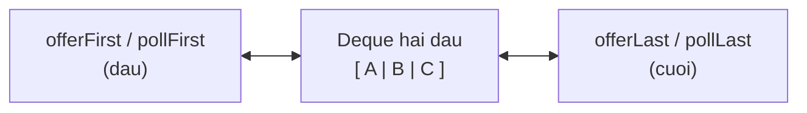

# Deque (Hàng đợi hai đầu)

Deque (hàng đợi hai đầu) cho phép bạn thêm và lấy phần tử ở cả hai đầu, nên có thể dùng vừa như Queue (FIFO) vừa như Stack (LIFO). Lớp ArrayDeque là lựa chọn được khuyến nghị vì nhanh và linh hoạt. Bài này giới thiệu Deque cùng các phương thức thao tác hai đầu; chi tiết nằm bên dưới.

[](pathname:///img/java/deque.webp)

---

:::note[Ghi nhớ nhanh]

- ⭐ **`Deque` thao tác cả hai đầu** — dùng được vừa như Queue (FIFO) vừa như Stack (LIFO), O(1).
- ⭐ **`ArrayDeque` được khuyến nghị** — nhanh, thay cho lớp `Stack` cũ và làm Queue linh hoạt.
- **Phương thức hai đầu** — `addFirst`/`addLast`, `pollFirst`/`pollLast`.
- **Ứng dụng** — cửa sổ trượt, lịch sử undo/redo.

:::

---

## Mục lục

- [Vì sao có Deque?](#vì-sao-có-deque)
- [Deque là gì?](#deque-là-gì)
- [Tạo Deque với ArrayDeque](#tạo-deque-với-arraydeque)
- [Thêm và lấy ở cả hai đầu](#thêm-và-lấy-ở-cả-hai-đầu)
- [Bảng tổng hợp các phương thức](#bảng-tổng-hợp-các-phương-thức)
- [Dùng Deque làm Queue (FIFO)](#dùng-deque-làm-queue-fifo)
- [Dùng Deque làm Stack (LIFO)](#dùng-deque-làm-stack-lifo)
- [Vì sao ArrayDeque tốt?](#vì-sao-arraydeque-tốt)
- [Ví dụ thực tế](#ví-dụ-thực-tế)
- [Lỗi thường gặp](#lỗi-thường-gặp)
- [Tóm tắt](#tóm-tắt)
- [Câu hỏi phỏng vấn](#câu-hỏi-phỏng-vấn)

---

## Vì sao có Deque?

**Vấn đề:** Có lúc ta cần thêm/lấy phần tử ở **cả hai đầu** (đầu và cuối) một cách hiệu quả — ví dụ cửa sổ trượt, lịch sử undo/redo, hoặc muốn dùng vừa như Stack vừa như Queue. Nhưng `Queue` thường chỉ thao tác ở một đầu, còn lớp `Stack` cũ lại bị đồng bộ hóa thừa (chậm) và thiết kế đã lỗi thời.

```java
import java.util.Stack;

// Lớp Stack cũ: chậm vì đồng bộ hóa thừa, thiết kế lỗi thời
Stack<Integer> stack = new Stack<>();
stack.push(1);
stack.push(2);

// Queue thường chỉ thêm một đầu, lấy một đầu -> không lấy/thêm linh hoạt hai đầu
```

**Giải pháp:** Dùng **`Deque`** (double-ended queue — hàng đợi hai đầu): thêm/lấy ở **cả hai đầu** với độ phức tạp O(1) (`addFirst/addLast/pollFirst/pollLast`). Lớp **`ArrayDeque`** là lựa chọn được **khuyến nghị** để dùng làm **Stack** (thay cho `Stack` cũ) lẫn **Queue** — linh hoạt và hiệu quả.

```java
import java.util.ArrayDeque;
import java.util.Deque;

// ArrayDeque: thao tác hai đầu O(1), nhanh hơn Stack cũ
Deque<Integer> dq = new ArrayDeque<>();

dq.addFirst(1); // thêm ở đầu
dq.addLast(2);  // thêm ở cuối
dq.pollFirst(); // lấy ở đầu
dq.pollLast();  // lấy ở cuối
```

:::tip[Dùng thực tế]
- **Thay `Stack` cũ**: cần ngăn xếp (LIFO) hiệu năng cao thì dùng `ArrayDeque` với `push`/`pop`.
- **Làm Queue (FIFO)**: thêm ở cuối, lấy ở đầu — xử lý hàng chờ tác vụ.
- **Cửa sổ trượt (sliding window)**: thêm/bỏ phần tử ở cả hai đầu khi cửa sổ dịch chuyển.
- **Undo/Redo hai chiều**: lưu lịch sử thao tác và duyệt qua lại ở cả hai đầu.
:::

---

## Deque là gì?

**Deque** (đọc là "đẹc", viết tắt của *Double Ended Queue* — hàng đợi hai đầu) là một cấu trúc cho phép bạn **thêm và lấy phần tử ở CẢ hai đầu**: đầu trước và đầu sau.

Hãy tưởng tượng một chồng đĩa mà bạn có thể đặt thêm hoặc lấy đĩa từ **cả phía trên lẫn phía dưới**. Hoặc một đoàn tàu có thể nối thêm toa ở đầu hoặc cuối.

Deque rất linh hoạt: nó có thể đóng vai trò vừa là **Queue** (hàng đợi — FIFO), vừa là **Stack** (ngăn xếp — LIFO). Vì vậy nó là cấu trúc được khuyên dùng cho cả hai mục đích.

Sơ đồ dưới cho thấy Deque thao tác được ở **cả hai đầu** (mỗi đầu đều thêm và lấy được):



---

## Tạo Deque với ArrayDeque

`Deque` là interface; lớp triển khai tốt nhất là **ArrayDeque** (deque dựa trên mảng):

```java
import java.util.ArrayDeque;
import java.util.Deque;

// Tạo deque chứa chuỗi
Deque<String> deque = new ArrayDeque<>();

deque.addFirst("B"); // thêm vào đầu
deque.addLast("C");  // thêm vào cuối
deque.addFirst("A"); // thêm vào đầu

System.out.println(deque); // [A, B, C]
```

---

## Thêm và lấy ở cả hai đầu

Deque có các phương thức rõ ràng cho từng đầu:

```java
import java.util.ArrayDeque;
import java.util.Deque;

Deque<Integer> dq = new ArrayDeque<>();

// THÊM
dq.offerFirst(2); // thêm vào đầu -> [2]
dq.offerFirst(1); // thêm vào đầu -> [1, 2]
dq.offerLast(3);  // thêm vào cuối -> [1, 2, 3]

// XEM (không xóa)
System.out.println(dq.peekFirst()); // 1 (phần tử đầu)
System.out.println(dq.peekLast());  // 3 (phần tử cuối)

// LẤY RA (xóa)
System.out.println(dq.pollFirst()); // 1, deque còn [2, 3]
System.out.println(dq.pollLast());  // 3, deque còn [2]
```

---

## Bảng tổng hợp các phương thức

| Hành động | Ở đầu (First) | Ở cuối (Last) |
|-----------|---------------|---------------|
| Thêm (an toàn) | `offerFirst(x)` | `offerLast(x)` |
| Lấy & xóa (an toàn) | `pollFirst()` | `pollLast()` |
| Xem (an toàn) | `peekFirst()` | `peekLast()` |

Các phương thức `offer/poll/peek` là an toàn (trả về `false`/`null` khi rỗng). Ngoài ra còn có `addFirst/addLast`, `removeFirst/removeLast`, `getFirst/getLast` nhưng chúng **ném lỗi** khi rỗng — người mới nên ưu tiên bộ `offer/poll/peek`.

---

## Dùng Deque làm Queue (FIFO)

Để dùng Deque như một hàng đợi vào-trước-ra-trước: **thêm ở cuối, lấy ở đầu**.

```java
import java.util.ArrayDeque;
import java.util.Deque;

Deque<String> hangDoi = new ArrayDeque<>();

// Thêm vào cuối
hangDoi.offerLast("An");
hangDoi.offerLast("Bình");

// Lấy từ đầu -> An ra trước (FIFO)
System.out.println(hangDoi.pollFirst()); // An
System.out.println(hangDoi.pollFirst()); // Bình
```

---

## Dùng Deque làm Stack (LIFO)

Để dùng Deque như một **ngăn xếp** vào-sau-ra-trước (LIFO — Last In First Out): **thêm và lấy ở CÙNG một đầu**. Deque có sẵn `push` và `pop` cho mục đích này:

```java
import java.util.ArrayDeque;
import java.util.Deque;

Deque<String> stack = new ArrayDeque<>();

// push: đẩy vào đỉnh (thực chất là addFirst)
stack.push("Trang 1");
stack.push("Trang 2");
stack.push("Trang 3");

// pop: lấy ra từ đỉnh (thực chất là pollFirst)
System.out.println(stack.pop()); // Trang 3 (vào sau ra trước)
System.out.println(stack.pop()); // Trang 2

// peek: xem đỉnh
System.out.println(stack.peek()); // Trang 1
```

---

## Vì sao ArrayDeque tốt?

ArrayDeque được Java khuyến nghị dùng cho **cả Queue lẫn Stack**, thay cho các lớp cũ:

- **Nhanh hơn** lớp `Stack` cũ (lớp `Stack` bị đồng bộ hóa không cần thiết nên chậm).
- **Nhanh hơn** dùng `LinkedList` cho phần lớn trường hợp.
- API rõ ràng, đầy đủ cho thao tác hai đầu.

> Quy tắc ghi nhớ: cần Stack hoặc Queue hiệu năng cao? Dùng **ArrayDeque**.

Lưu ý: ArrayDeque **không cho phép phần tử `null`**. Nếu cố thêm `null` sẽ bị lỗi.

---

## Ví dụ thực tế

Tính năng "Undo/Redo" (hoàn tác/làm lại) trong trình soạn thảo có thể dùng hai Deque:

```java
import java.util.ArrayDeque;
import java.util.Deque;

Deque<String> undo = new ArrayDeque<>(); // các hành động đã làm

// Người dùng thực hiện các thao tác
undo.push("Gõ chữ 'A'");
undo.push("Gõ chữ 'B'");
undo.push("Xóa chữ 'B'");

// Bấm Undo: lấy hành động gần nhất (LIFO)
String hanhDongCuoi = undo.pop();
System.out.println("Hoàn tác: " + hanhDongCuoi); // Hoàn tác: Xóa chữ 'B'
```

---

## Lỗi thường gặp

1. **Thêm `null` vào ArrayDeque**: không được phép, sẽ ném `NullPointerException`. Hãy đảm bảo giá trị khác null.

2. **Nhầm đầu nào là "đỉnh" khi dùng làm Stack**: `push`/`pop` đều thao tác ở **đầu (First)**. Nếu trộn lẫn `pollLast` vào, logic LIFO sẽ sai.

3. **Dùng add/remove rồi gặp lỗi khi rỗng**: `removeFirst()` trên deque rỗng ném lỗi. Dùng `pollFirst()` để an toàn.

4. **Quên import**: cần `import java.util.ArrayDeque;` và `import java.util.Deque;`.

---

## Tóm tắt

- **Deque** là hàng đợi **hai đầu** — thêm/lấy được ở cả đầu và cuối.
- Lớp triển khai tốt nhất là **ArrayDeque**.
- Bộ phương thức an toàn: `offerFirst/offerLast`, `pollFirst/pollLast`, `peekFirst/peekLast`.
- Dùng làm **Queue (FIFO)**: thêm cuối, lấy đầu.
- Dùng làm **Stack (LIFO)**: dùng `push`/`pop` (cùng một đầu).
- ArrayDeque **nhanh hơn** lớp `Stack` cũ và `LinkedList` — là lựa chọn được khuyến nghị.
- ArrayDeque **không nhận giá trị `null`**.

---

## Câu hỏi phỏng vấn

Những câu thường gặp về chủ đề này. Tự trả lời trước, rồi bấm **Xem đáp án** để đối chiếu.

**1. `Deque` khác `Queue` cốt lõi ở điểm nào?**

<details className="qa">
<summary>Xem đáp án</summary>

- `Queue` chỉ hỗ trợ thao tác **một đầu cho mỗi chiều**: thêm ở cuối (`offer`), lấy ở đầu (`poll`) — chỉ dùng được cho FIFO.
- `Deque` (Double-Ended Queue) hỗ trợ thao tác ở **cả hai đầu**: `addFirst`/`addLast`, `pollFirst`/`pollLast`, `peekFirst`/`peekLast` — nên dùng được cho cả FIFO (Queue) lẫn LIFO (Stack).
- Về mặt kế thừa, `Deque` là **interface con của `Queue`** (`Deque extends Queue`), nên mọi `Deque` đều có thể dùng như một `Queue`, nhưng không ngược lại.

</details>

**2. Vì sao `ArrayDeque` được khuyến nghị dùng thay cho lớp `Stack` cũ của Java?**

<details className="qa">
<summary>Xem đáp án</summary>

- Lớp `Stack` (trong `java.util`) kế thừa từ `Vector` — một cấu trúc **đồng bộ hóa (synchronized)** cho mọi thao tác, dù chương trình đơn luồng vẫn phải trả chi phí khóa (lock) không cần thiết, làm chậm hiệu năng.
- `Stack` cũng có thiết kế lỗi thời: kế thừa từ `Vector` khiến nó "lỡ" thừa hưởng các phương thức truy cập theo chỉ số (`get(i)`, `insertElementAt()`...) vốn phá vỡ nguyên tắc đóng gói của một ngăn xếp thuần túy.
- `ArrayDeque` không đồng bộ hóa (không thread-safe, nhưng nhanh hơn nhiều trong ngữ cảnh đơn luồng), cấu trúc dựa trên mảng động thuần túy, và có API `push()`/`pop()`/`peek()` rõ ràng, đúng ngữ nghĩa Stack. Java documentation chính thức khuyến nghị dùng `ArrayDeque` thay cho `Stack`.

</details>

**3. Đoạn code sau in ra gì? Giải thích cơ chế `push`/`pop` của `Deque`.**

```java
Deque<Integer> stack = new ArrayDeque<>();
stack.push(1);
stack.push(2);
stack.push(3);
System.out.println(stack.pop());
System.out.println(stack.peek());
```

<details className="qa">
<summary>Xem đáp án</summary>

In ra `3` rồi `2`.

- `push(x)` trên `Deque` thực chất là gọi `addFirst(x)` — luôn thêm vào **đầu** deque.
- `pop()` thực chất là gọi `removeFirst()` — luôn lấy và xóa phần tử ở **đầu** deque.
- Vì cả hai đều thao tác ở cùng một đầu (đầu = đỉnh stack), thứ tự lấy ra tuân theo **LIFO** (Last In, First Out): `3` được đẩy vào sau cùng nên lấy ra trước.
- Sau khi `pop()` lấy `3` ra, deque còn `[2, 1]`, nên `peek()` (thực chất là `peekFirst()`) trả về `2`.

</details>

**4. Nếu dùng nhầm `pollLast()` xen giữa các lệnh `push`/`pop` khi mô phỏng Stack, chuyện gì xảy ra?**

<details className="qa">
<summary>Xem đáp án</summary>

Logic LIFO sẽ **bị phá vỡ**, vì `push`/`pop` thao tác ở đầu (`First`), còn `pollLast()` lại lấy ở cuối (`Last`) — hai đầu khác nhau của cùng một deque.

```java
Deque<Integer> stack = new ArrayDeque<>();
stack.push(1); // [1]
stack.push(2); // [2, 1]
stack.push(3); // [3, 2, 1]

stack.pollLast(); // lấy nhầm ở cuối -> lấy ra 1 (không phải phần tử vừa push gần nhất!)
```

- Đây là lỗi thường gặp khi lập trình viên không nắm rõ Deque là cấu trúc **hai đầu**, và trộn lẫn hai bộ phương thức (`push`/`pop` cho Stack, `offerLast`/`pollLast` cho Queue) trên cùng một biến mà không nhất quán đầu nào là "đỉnh".
- Quy tắc an toàn: khi dùng Deque làm Stack, chỉ dùng nhất quán `push()`/`pop()`/`peek()` (đều ở đầu First); khi dùng làm Queue, chỉ dùng nhất quán `offerLast()`/`pollFirst()`.

</details>

**5. Nêu ứng dụng của `Deque` trong bài toán "cửa sổ trượt" (sliding window), ví dụ tìm giá trị lớn nhất trong mỗi cửa sổ kích thước k.**

<details className="qa">
<summary>Xem đáp án</summary>

Thuật toán **"Sliding Window Maximum"** dùng một `Deque` lưu **chỉ số** (index) của phần tử, giữ deque theo thứ tự **giảm dần giá trị**:

```java
Deque<Integer> deque = new ArrayDeque<>(); // lưu chỉ số

for (int i = 0; i < mang.length; i++) {
    // Xóa chỉ số ra khỏi phạm vi cửa sổ hiện tại
    if (!deque.isEmpty() && deque.peekFirst() <= i - k) {
        deque.pollFirst();
    }
    // Xóa các phần tử ở cuối deque nhỏ hơn phần tử hiện tại (chúng không còn cơ hội là max)
    while (!deque.isEmpty() && mang[deque.peekLast()] < mang[i]) {
        deque.pollLast();
    }
    deque.offerLast(i);

    if (i >= k - 1) {
        System.out.println(mang[deque.peekFirst()]); // giá trị lớn nhất của cửa sổ hiện tại
    }
}
```

- Nhờ thao tác được ở **cả hai đầu** với O(1), thuật toán đạt độ phức tạp tổng thể **O(n)**, thay vì O(n·k) nếu duyệt lại từng cửa sổ.

</details>

**6. `ArrayDeque` có cho phép phần tử `null` không? Vì sao thiết kế như vậy?**

<details className="qa">
<summary>Xem đáp án</summary>

**Không** — thêm `null` vào `ArrayDeque` (qua `add`, `offer`, `push`...) sẽ ném `NullPointerException` ngay lập tức.

- Lý do: các phương thức "xem/lấy an toàn" như `peekFirst()`, `pollFirst()` dùng giá trị trả về `null` để báo hiệu **"deque rỗng, không có phần tử"**. Nếu cho phép `null` là một phần tử hợp lệ, sẽ không thể phân biệt được "deque rỗng" và "phần tử đầu deque chính là `null`" — gây mơ hồ (ambiguous) khi kiểm tra kết quả trả về.
- Đây cũng là lý do tương tự khiến `ConcurrentHashMap` cấm `null` cho key và value.

</details>

**7. So sánh độ phức tạp và cách dùng bộ nhớ giữa `ArrayDeque` và `LinkedList` khi cùng đóng vai trò `Deque`.**

<details className="qa">
<summary>Xem đáp án</summary>

| Tiêu chí | `ArrayDeque` | `LinkedList` |
|----------|--------------|--------------|
| Cấu trúc bên trong | Mảng động (circular array) | Danh sách liên kết đôi (node + 2 con trỏ) |
| Thêm/xóa ở hai đầu | O(1) amortized | O(1) |
| Bộ nhớ mỗi phần tử | Chỉ dữ liệu, gần như không overhead | Mỗi phần tử là một `Node` object riêng, tốn thêm bộ nhớ cho 2 con trỏ (prev/next) |
| Cache locality (khả năng tận dụng cache CPU) | Tốt hơn (dữ liệu liên tục trong mảng) | Kém hơn (các node rải rác trên heap) |

- Vì lý do bộ nhớ và cache locality, `ArrayDeque` thường **nhanh hơn thực tế** dù độ phức tạp Big-O tương đương, và được Java khuyến nghị làm lựa chọn mặc định cho Stack/Queue thuần túy.

</details>

**8. `Deque` có thể dùng để cài đặt thuật toán kiểm tra chuỗi đối xứng (palindrome) như thế nào?**

<details className="qa">
<summary>Xem đáp án</summary>

```java
boolean laPalindrome(String s) {
    Deque<Character> deque = new ArrayDeque<>();
    for (char c : s.toCharArray()) {
        deque.addLast(c);
    }

    while (deque.size() > 1) {
        if (!deque.pollFirst().equals(deque.pollLast())) {
            return false; // ký tự đầu và cuối không khớp
        }
    }
    return true;
}
```

- Ý tưởng: đưa toàn bộ ký tự vào `Deque`, rồi liên tục so sánh **ký tự đầu và ký tự cuối**, thu hẹp dần vào giữa. Đây là ứng dụng trực tiếp của khả năng thao tác đồng thời ở cả hai đầu mà `Deque` cung cấp, điều mà `Queue` một chiều không làm được gọn gàng như vậy.

</details>

**9. `ArrayDeque` có thread-safe không? Nếu cần một Deque an toàn cho đa luồng thì dùng gì?**

<details className="qa">
<summary>Xem đáp án</summary>

**Không**, `ArrayDeque` không đồng bộ hóa và không an toàn khi nhiều luồng cùng đọc/ghi đồng thời — tương tự `ArrayList`/`HashMap`.

Với nhu cầu đa luồng, Java cung cấp các lựa chọn trong `java.util.concurrent`:

- `ConcurrentLinkedDeque` — deque non-blocking (không chặn luồng), dùng thuật toán lock-free, phù hợp khi cần hiệu năng cao và không cần luồng "chờ" khi deque rỗng/đầy.
- `LinkedBlockingDeque` — deque hỗ trợ **blocking** (luồng tự động chờ khi rỗng/đầy), thường dùng cho mô hình producer-consumer cần giới hạn dung lượng (bounded).

</details>
