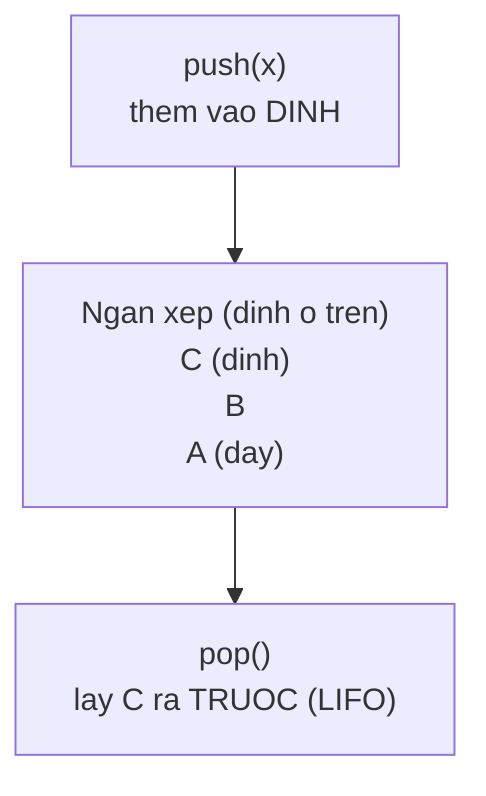

# Stack (Ngăn xếp)

Stack (ngăn xếp) là cấu trúc xử lý phần tử theo nguyên tắc vào sau ra trước (LIFO), giống như một chồng đĩa luôn lấy đĩa trên cùng. Nó hữu ích cho các bài toán như hoàn tác (undo), lịch sử trình duyệt hay kiểm tra ngoặc cân bằng. Bài này giới thiệu Stack và vì sao nên dùng ArrayDeque thay cho lớp Stack cũ; chi tiết nằm bên dưới.

---

## Mục lục

- [Vì sao có cấu trúc Stack (LIFO)?](#vì-sao-có-cấu-trúc-stack-lifo)
- [Stack là gì?](#stack-là-gì)
- [Nguyên tắc LIFO](#nguyên-tắc-lifo)
- [Lớp Stack cũ của Java](#lớp-stack-cũ-của-java)
- [push, pop, peek](#push-pop-peek)
- [Vì sao không nên dùng lớp Stack cũ?](#vì-sao-không-nên-dùng-lớp-stack-cũ)
- [Khuyến nghị: dùng ArrayDeque](#khuyến-nghị-dùng-arraydeque)
- [Ví dụ thực tế: kiểm tra ngoặc cân bằng](#ví-dụ-thực-tế-kiểm-tra-ngoặc-cân-bằng)
- [Lỗi thường gặp](#lỗi-thường-gặp)
- [Tóm tắt](#tóm-tắt)

---

## Vì sao có cấu trúc Stack (LIFO)?

**Vấn đề:** Nhiều bài toán cần xử lý theo kiểu **vào sau ra trước** (LIFO): hoàn tác (undo) phải lấy thao tác **gần nhất**, kiểm tra ngoặc cân bằng phải so với ngoặc mở **mới nhất**, hay lưu ngữ cảnh khi gọi hàm/đệ quy. Nếu dùng `List` thường, bạn phải tự nhớ chỉ số phần tử cuối và xử lý thủ công, dễ sai.

```java
import java.util.ArrayList;
import java.util.List;

// Tự quản lý "đỉnh" bằng List — rườm rà và dễ lỗi
List<String> history = new ArrayList<>();
history.add("gõ chữ A");
history.add("gõ chữ B");

// Muốn undo thao tác gần nhất phải tự tính chỉ số cuối
int last = history.size() - 1;
String undo = history.remove(last); // "gõ chữ B" — phải nhớ công thức này mỗi lần
```

**Giải pháp:** Dùng **Stack (LIFO)** với ba thao tác gọn gàng: `push` (thêm vào đỉnh), `pop` (lấy đỉnh ra), `peek` (xem đỉnh). Bản thân cấu trúc đã đảm bảo lấy đúng phần tử mới nhất.

```java
import java.util.ArrayDeque;
import java.util.Deque;

// ArrayDeque làm stack: rõ ràng, đúng ngữ nghĩa LIFO
Deque<String> history = new ArrayDeque<>();
history.push("gõ chữ A");
history.push("gõ chữ B");

String undo = history.pop(); // "gõ chữ B" — luôn lấy thao tác gần nhất
```

Lưu ý quan trọng: lớp `java.util.Stack` cũ kế thừa `Vector` và có **đồng bộ hoá** nên **chậm** và thiết kế đã lỗi thời. Java **khuyến nghị dùng `ArrayDeque`** làm stack thay thế.

:::tip[Dùng thực tế]

- **Undo/Redo:** mỗi thao tác `push` vào stack, khi hoàn tác thì `pop` ra thao tác gần nhất.
- **Kiểm tra ngoặc/biểu thức:** `push` ngoặc mở, gặp ngoặc đóng thì `pop` để so khớp cặp.
- **Duyệt đồ thị DFS:** dùng stack lưu các đỉnh chờ thăm, luôn đi sâu vào nhánh mới nhất trước.
- **Mô phỏng call stack:** chuyển đệ quy thành vòng lặp bằng cách tự lưu ngữ cảnh trên stack.

:::

---

## Stack là gì?

**Stack** (ngăn xếp — chồng phần tử xử lý theo kiểu vào sau ra trước) hoạt động giống như một **chồng đĩa**. Bạn đặt đĩa mới lên trên cùng, và khi cần lấy thì cũng lấy đĩa trên cùng xuống trước. Bạn không thể rút đĩa ở giữa hay dưới đáy ra trực tiếp.

Vị trí trên cùng gọi là **đỉnh** (top). Mọi thao tác thêm và lấy đều diễn ra ở đỉnh.

---

## Nguyên tắc LIFO

Stack tuân theo nguyên tắc **LIFO** (Last In, First Out — vào sau, ra trước). Phần tử thêm vào **gần nhất** sẽ được lấy ra **đầu tiên**.

```
push A  ->  [A]
push B  ->  [A, B]        (B nằm trên đỉnh)
push C  ->  [A, B, C]     (C nằm trên đỉnh)

pop     ->  trả về C      (lấy đỉnh ra trước)
pop     ->  trả về B
pop     ->  trả về A
```

Ngược lại với Queue (FIFO — vào trước ra trước), Stack lấy phần tử mới nhất ra trước.

Sơ đồ luồng LIFO: cả `push` và `pop` đều diễn ra ở **đỉnh** (top):



---

## Lớp Stack cũ của Java

Java có một lớp tên `Stack` từ rất sớm. Bạn có thể dùng nó như sau:

```java
import java.util.Stack;

// Tạo ngăn xếp chứa số nguyên
Stack<Integer> stack = new Stack<>();

stack.push(10); // đẩy 10 vào đỉnh
stack.push(20); // đẩy 20 vào đỉnh
stack.push(30); // đẩy 30 vào đỉnh

System.out.println(stack.peek()); // 30 (xem đỉnh, không xóa)
System.out.println(stack.pop());  // 30 (lấy đỉnh ra, xóa)
System.out.println(stack.pop());  // 20

System.out.println(stack.isEmpty()); // false (còn 10)
```

---

## push, pop, peek

Ba thao tác cốt lõi của Stack:

| Phương thức | Ý nghĩa |
|-------------|---------|
| `push(x)` | Đẩy `x` lên đỉnh ngăn xếp |
| `pop()` | Lấy và **xóa** phần tử ở đỉnh |
| `peek()` | **Xem** phần tử ở đỉnh (không xóa) |
| `isEmpty()` | Kiểm tra ngăn xếp có rỗng không |

```java
import java.util.Stack;

Stack<String> lichSu = new Stack<>();

lichSu.push("trang-chu");
lichSu.push("san-pham");
lichSu.push("chi-tiet");

// Bấm "Quay lại" -> lấy trang gần nhất
System.out.println("Quay lại từ: " + lichSu.pop()); // chi-tiet
System.out.println("Đang ở: " + lichSu.peek());     // san-pham
```

---

## Vì sao không nên dùng lớp Stack cũ?

Mặc dù lớp `Stack` vẫn chạy được, Java **khuyến cáo không nên dùng nó cho code mới** vì:

1. **Chậm**: lớp `Stack` kế thừa từ `Vector` — một lớp cũ bị **đồng bộ hóa** (synchronized — khóa luồng) ở mọi thao tác, gây chậm dù bạn không cần.

2. **Thiết kế kế thừa kém**: vì kế thừa `Vector`, lớp `Stack` lỡ cho phép truy cập phần tử theo chỉ số (`get(0)`, chèn vào giữa) — những điều **không nên có ở một ngăn xếp đúng nghĩa**. Điều này dễ gây hiểu nhầm và dùng sai.

Vì vậy, tài liệu chính thức của Java khuyên dùng **`ArrayDeque`** thay thế.

---

## Khuyến nghị: dùng ArrayDeque

`ArrayDeque` (đã học ở bài Deque) có thể làm Stack nhanh hơn và sạch hơn:

```java
import java.util.ArrayDeque;
import java.util.Deque;

// Khai báo kiểu Deque, dùng như Stack
Deque<Integer> stack = new ArrayDeque<>();

stack.push(10); // đẩy vào đỉnh
stack.push(20);
stack.push(30);

System.out.println(stack.peek()); // 30 (xem đỉnh)
System.out.println(stack.pop());  // 30 (lấy đỉnh)
System.out.println(stack.pop());  // 20

System.out.println(stack.isEmpty()); // false
```

API giống hệt (`push`, `pop`, `peek`) nên chuyển từ `Stack` sang `ArrayDeque` rất dễ.

| Tiêu chí | Lớp `Stack` cũ | `ArrayDeque` |
|----------|----------------|--------------|
| Tốc độ | Chậm (synchronized) | Nhanh |
| Thiết kế | Kém (kế thừa Vector) | Sạch |
| Khuyến nghị | Không nên dùng | **Nên dùng** |

---

## Ví dụ thực tế: kiểm tra ngoặc cân bằng

Một bài toán kinh điển dùng Stack: kiểm tra chuỗi ngoặc `()[]{}` có cân bằng không.

```java
import java.util.ArrayDeque;
import java.util.Deque;

public static boolean kiemTraNgoac(String s) {
    Deque<Character> stack = new ArrayDeque<>();

    for (char c : s.toCharArray()) {
        // Gặp ngoặc mở thì đẩy vào stack
        if (c == '(' || c == '[' || c == '{') {
            stack.push(c);
        }
        // Gặp ngoặc đóng thì kiểm tra với đỉnh stack
        else if (c == ')') {
            if (stack.isEmpty() || stack.pop() != '(') return false;
        }
        else if (c == ']') {
            if (stack.isEmpty() || stack.pop() != '[') return false;
        }
        else if (c == '}') {
            if (stack.isEmpty() || stack.pop() != '{') return false;
        }
    }
    // Cân bằng khi stack rỗng ở cuối
    return stack.isEmpty();
}

// kiemTraNgoac("(a[b]{c})") -> true
// kiemTraNgoac("(a[b)]")     -> false
```

---

## Lỗi thường gặp

1. **pop() trên ngăn xếp rỗng**: ném lỗi `EmptyStackException` (với lớp `Stack`) hoặc `NoSuchElementException` (với `ArrayDeque`). Luôn kiểm tra `isEmpty()` trước khi pop.

2. **Nhầm peek với pop**: `peek()` chỉ xem đỉnh, `pop()` xem **và** xóa. Nhầm lẫn dễ làm sai logic.

3. **Vẫn dùng lớp `Stack` cũ cho code mới**: nên chuyển sang `ArrayDeque` để nhanh và an toàn hơn.

4. **ArrayDeque không nhận `null`**: đừng push giá trị `null` vào `ArrayDeque`.

---

## Tóm tắt

- **Stack** là ngăn xếp theo nguyên tắc **LIFO** (vào sau, ra trước) — như chồng đĩa.
- Ba thao tác chính: `push` (đẩy lên đỉnh), `pop` (lấy & xóa đỉnh), `peek` (xem đỉnh).
- Lớp **`Stack` cũ** vẫn chạy nhưng **chậm** và **thiết kế kém** — không nên dùng cho code mới.
- Java khuyến nghị dùng **`ArrayDeque`** làm Stack: nhanh hơn, sạch hơn, API giống nhau.
- Stack rất hữu ích cho bài toán **hoàn tác (undo)**, **lịch sử trình duyệt**, **kiểm tra ngoặc cân bằng**.
- Luôn kiểm tra `isEmpty()` trước khi `pop` để tránh lỗi.
