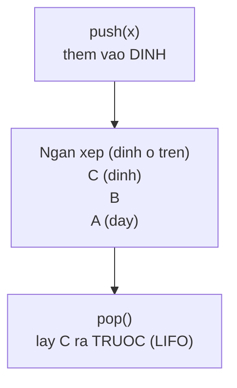

# Stack (Ngăn xếp)

Stack (ngăn xếp) là cấu trúc xử lý phần tử theo nguyên tắc vào sau ra trước (LIFO), giống như một chồng đĩa luôn lấy đĩa trên cùng. Nó hữu ích cho các bài toán như hoàn tác (undo), lịch sử trình duyệt hay kiểm tra ngoặc cân bằng. Bài này giới thiệu Stack và vì sao nên dùng ArrayDeque thay cho lớp Stack cũ; chi tiết nằm bên dưới.

[](pathname:///img/java/stack.webp)

---

:::note[Ghi nhớ nhanh]

- ⭐ **Stack là LIFO** — vào sau ra trước, với ba thao tác `push`/`pop`/`peek`.
- ⭐ **Không nên dùng lớp `Stack` cũ** — bị đồng bộ hóa thừa (chậm) và thiết kế lỗi thời (kế thừa `Vector`).
- **Khuyến nghị `ArrayDeque`** — làm stack đúng ngữ nghĩa LIFO và nhanh hơn.
- **Ứng dụng** — undo, lịch sử trình duyệt, kiểm tra ngoặc cân bằng, đệ quy.

:::

---

## Mục lục

- [Vì sao có cấu trúc Stack (LIFO)?](#vì-sao-có-cấu-trúc-stack-lifo)
- [Stack là gì?](#stack-là-gì)
- [Nguyên tắc LIFO](#nguyên-tắc-lifo)
- [Lớp Stack cũ của Java](#lớp-stack-cũ-của-java)
- [push, pop, peek](#push-pop-peek)
- [Vì sao không nên dùng lớp Stack cũ?](#vì-sao-không-nên-dùng-lớp-stack-cũ)
- [Khuyến nghị: dùng ArrayDeque](#khuyến-nghị-dùng-arraydeque)
- [Ví dụ thực tế: kiểm tra ngoặc cân bằng](#ví-dụ-thực-tế-kiểm-tra-ngoặc-cân-bằng)
- [Lỗi thường gặp](#lỗi-thường-gặp)
- [Tóm tắt](#tóm-tắt)
- [Câu hỏi phỏng vấn](#câu-hỏi-phỏng-vấn)

---

## Vì sao có cấu trúc Stack (LIFO)?

**Vấn đề:** Nhiều bài toán cần xử lý theo kiểu **vào sau ra trước** (LIFO): hoàn tác (undo) phải lấy thao tác **gần nhất**, kiểm tra ngoặc cân bằng phải so với ngoặc mở **mới nhất**, hay lưu ngữ cảnh khi gọi hàm/đệ quy. Nếu dùng `List` thường, bạn phải tự nhớ chỉ số phần tử cuối và xử lý thủ công, dễ sai.

```java
import java.util.ArrayList;
import java.util.List;

// Tự quản lý "đỉnh" bằng List — rườm rà và dễ lỗi
List<String> history = new ArrayList<>();
history.add("gõ chữ A");
history.add("gõ chữ B");

// Muốn undo thao tác gần nhất phải tự tính chỉ số cuối
int last = history.size() - 1;
String undo = history.remove(last); // "gõ chữ B" — phải nhớ công thức này mỗi lần
```

**Giải pháp:** Dùng **Stack (LIFO)** với ba thao tác gọn gàng: `push` (thêm vào đỉnh), `pop` (lấy đỉnh ra), `peek` (xem đỉnh). Bản thân cấu trúc đã đảm bảo lấy đúng phần tử mới nhất.

```java
import java.util.ArrayDeque;
import java.util.Deque;

// ArrayDeque làm stack: rõ ràng, đúng ngữ nghĩa LIFO
Deque<String> history = new ArrayDeque<>();
history.push("gõ chữ A");
history.push("gõ chữ B");

String undo = history.pop(); // "gõ chữ B" — luôn lấy thao tác gần nhất
```

Lưu ý quan trọng: lớp `java.util.Stack` cũ kế thừa `Vector` và có **đồng bộ hoá** nên **chậm** và thiết kế đã lỗi thời. Java **khuyến nghị dùng `ArrayDeque`** làm stack thay thế.

:::tip[Dùng thực tế]

- **Undo/Redo:** mỗi thao tác `push` vào stack, khi hoàn tác thì `pop` ra thao tác gần nhất.
- **Kiểm tra ngoặc/biểu thức:** `push` ngoặc mở, gặp ngoặc đóng thì `pop` để so khớp cặp.
- **Duyệt đồ thị DFS:** dùng stack lưu các đỉnh chờ thăm, luôn đi sâu vào nhánh mới nhất trước.
- **Mô phỏng call stack:** chuyển đệ quy thành vòng lặp bằng cách tự lưu ngữ cảnh trên stack.

:::

---

## Stack là gì?

**Stack** (ngăn xếp — chồng phần tử xử lý theo kiểu vào sau ra trước) hoạt động giống như một **chồng đĩa**. Bạn đặt đĩa mới lên trên cùng, và khi cần lấy thì cũng lấy đĩa trên cùng xuống trước. Bạn không thể rút đĩa ở giữa hay dưới đáy ra trực tiếp.

Vị trí trên cùng gọi là **đỉnh** (top). Mọi thao tác thêm và lấy đều diễn ra ở đỉnh.

---

## Nguyên tắc LIFO

Stack tuân theo nguyên tắc **LIFO** (Last In, First Out — vào sau, ra trước). Phần tử thêm vào **gần nhất** sẽ được lấy ra **đầu tiên**.

```
push A  ->  [A]
push B  ->  [A, B]        (B nằm trên đỉnh)
push C  ->  [A, B, C]     (C nằm trên đỉnh)

pop     ->  trả về C      (lấy đỉnh ra trước)
pop     ->  trả về B
pop     ->  trả về A
```

Ngược lại với Queue (FIFO — vào trước ra trước), Stack lấy phần tử mới nhất ra trước.

Sơ đồ luồng LIFO: cả `push` và `pop` đều diễn ra ở **đỉnh** (top):


```mermaid
flowchart TD
    P["push(x)<br/>them vao DINH"] --> T["Ngan xep (dinh o tren)<br/>C (dinh)<br/>B<br/>A (day)"]
    T --> O["pop()<br/>lay C ra TRUOC (LIFO)"]
```

---

## Lớp Stack cũ của Java

Java có một lớp tên `Stack` từ rất sớm. Bạn có thể dùng nó như sau:

```java
import java.util.Stack;

// Tạo ngăn xếp chứa số nguyên
Stack<Integer> stack = new Stack<>();

stack.push(10); // đẩy 10 vào đỉnh
stack.push(20); // đẩy 20 vào đỉnh
stack.push(30); // đẩy 30 vào đỉnh

System.out.println(stack.peek()); // 30 (xem đỉnh, không xóa)
System.out.println(stack.pop());  // 30 (lấy đỉnh ra, xóa)
System.out.println(stack.pop());  // 20

System.out.println(stack.isEmpty()); // false (còn 10)
```

---

## push, pop, peek

Ba thao tác cốt lõi của Stack:

| Phương thức | Ý nghĩa |
|-------------|---------|
| `push(x)` | Đẩy `x` lên đỉnh ngăn xếp |
| `pop()` | Lấy và **xóa** phần tử ở đỉnh |
| `peek()` | **Xem** phần tử ở đỉnh (không xóa) |
| `isEmpty()` | Kiểm tra ngăn xếp có rỗng không |

```java
import java.util.Stack;

Stack<String> lichSu = new Stack<>();

lichSu.push("trang-chu");
lichSu.push("san-pham");
lichSu.push("chi-tiet");

// Bấm "Quay lại" -> lấy trang gần nhất
System.out.println("Quay lại từ: " + lichSu.pop()); // chi-tiet
System.out.println("Đang ở: " + lichSu.peek());     // san-pham
```

---

## Vì sao không nên dùng lớp Stack cũ?

Mặc dù lớp `Stack` vẫn chạy được, Java **khuyến cáo không nên dùng nó cho code mới** vì:

1. **Chậm**: lớp `Stack` kế thừa từ `Vector` — một lớp cũ bị **đồng bộ hóa** (synchronized — khóa luồng) ở mọi thao tác, gây chậm dù bạn không cần.

2. **Thiết kế kế thừa kém**: vì kế thừa `Vector`, lớp `Stack` lỡ cho phép truy cập phần tử theo chỉ số (`get(0)`, chèn vào giữa) — những điều **không nên có ở một ngăn xếp đúng nghĩa**. Điều này dễ gây hiểu nhầm và dùng sai.

Vì vậy, tài liệu chính thức của Java khuyên dùng **`ArrayDeque`** thay thế.

---

## Khuyến nghị: dùng ArrayDeque

`ArrayDeque` (đã học ở bài Deque) có thể làm Stack nhanh hơn và sạch hơn:

```java
import java.util.ArrayDeque;
import java.util.Deque;

// Khai báo kiểu Deque, dùng như Stack
Deque<Integer> stack = new ArrayDeque<>();

stack.push(10); // đẩy vào đỉnh
stack.push(20);
stack.push(30);

System.out.println(stack.peek()); // 30 (xem đỉnh)
System.out.println(stack.pop());  // 30 (lấy đỉnh)
System.out.println(stack.pop());  // 20

System.out.println(stack.isEmpty()); // false
```

API giống hệt (`push`, `pop`, `peek`) nên chuyển từ `Stack` sang `ArrayDeque` rất dễ.

| Tiêu chí | Lớp `Stack` cũ | `ArrayDeque` |
|----------|----------------|--------------|
| Tốc độ | Chậm (synchronized) | Nhanh |
| Thiết kế | Kém (kế thừa Vector) | Sạch |
| Khuyến nghị | Không nên dùng | **Nên dùng** |

---

## Ví dụ thực tế: kiểm tra ngoặc cân bằng

Một bài toán kinh điển dùng Stack: kiểm tra chuỗi ngoặc `()[]{}` có cân bằng không.

```java
import java.util.ArrayDeque;
import java.util.Deque;

public static boolean kiemTraNgoac(String s) {
    Deque<Character> stack = new ArrayDeque<>();

    for (char c : s.toCharArray()) {
        // Gặp ngoặc mở thì đẩy vào stack
        if (c == '(' || c == '[' || c == '{') {
            stack.push(c);
        }
        // Gặp ngoặc đóng thì kiểm tra với đỉnh stack
        else if (c == ')') {
            if (stack.isEmpty() || stack.pop() != '(') return false;
        }
        else if (c == ']') {
            if (stack.isEmpty() || stack.pop() != '[') return false;
        }
        else if (c == '}') {
            if (stack.isEmpty() || stack.pop() != '{') return false;
        }
    }
    // Cân bằng khi stack rỗng ở cuối
    return stack.isEmpty();
}

// kiemTraNgoac("(a[b]{c})") -> true
// kiemTraNgoac("(a[b)]")     -> false
```

---

## Lỗi thường gặp

1. **pop() trên ngăn xếp rỗng**: ném lỗi `EmptyStackException` (với lớp `Stack`) hoặc `NoSuchElementException` (với `ArrayDeque`). Luôn kiểm tra `isEmpty()` trước khi pop.

2. **Nhầm peek với pop**: `peek()` chỉ xem đỉnh, `pop()` xem **và** xóa. Nhầm lẫn dễ làm sai logic.

3. **Vẫn dùng lớp `Stack` cũ cho code mới**: nên chuyển sang `ArrayDeque` để nhanh và an toàn hơn.

4. **ArrayDeque không nhận `null`**: đừng push giá trị `null` vào `ArrayDeque`.

---

## Tóm tắt

- **Stack** là ngăn xếp theo nguyên tắc **LIFO** (vào sau, ra trước) — như chồng đĩa.
- Ba thao tác chính: `push` (đẩy lên đỉnh), `pop` (lấy & xóa đỉnh), `peek` (xem đỉnh).
- Lớp **`Stack` cũ** vẫn chạy nhưng **chậm** và **thiết kế kém** — không nên dùng cho code mới.
- Java khuyến nghị dùng **`ArrayDeque`** làm Stack: nhanh hơn, sạch hơn, API giống nhau.
- Stack rất hữu ích cho bài toán **hoàn tác (undo)**, **lịch sử trình duyệt**, **kiểm tra ngoặc cân bằng**.
- Luôn kiểm tra `isEmpty()` trước khi `pop` để tránh lỗi.

---

## Câu hỏi phỏng vấn

Những câu thường gặp về chủ đề này. Tự trả lời trước, rồi bấm **Xem đáp án** để đối chiếu.

**1. Nguyên tắc LIFO của Stack là gì? Cho ví dụ thực tế ngoài đời.**

<details className="qa">
<summary>Xem đáp án</summary>

**LIFO** (Last In, First Out — vào sau, ra trước): phần tử được thêm vào **gần nhất** sẽ được lấy ra **đầu tiên**.

- Ví dụ ngoài đời: chồng đĩa trong bếp — bạn đặt đĩa mới rửa lên trên cùng, và khi cần dùng lại lấy đĩa trên cùng xuống trước, không rút được đĩa ở giữa hay dưới đáy.
- Trong Java: `push(x)` đẩy `x` lên đỉnh, `pop()` lấy và xóa phần tử ở đỉnh, `peek()` xem đỉnh mà không xóa.

</details>

**2. Vì sao Java khuyến nghị không dùng lớp `Stack` (`java.util.Stack`) cho code mới?**

<details className="qa">
<summary>Xem đáp án</summary>

Hai lý do chính:

1. **Chậm không cần thiết**: `Stack` kế thừa từ `Vector`, khiến mọi thao tác (`push`, `pop`, `peek`) đều bị **đồng bộ hóa (synchronized)** — tốn chi phí khóa (lock) ngay cả khi chương trình chạy đơn luồng và không cần an toàn đa luồng.
2. **Thiết kế kế thừa kém**: vì là subclass của `Vector`, `Stack` "lỡ" thừa hưởng các phương thức truy cập theo chỉ số như `get(i)`, `insertElementAt()`, `remove(i)` — những thao tác phá vỡ ngữ nghĩa thuần túy của một ngăn xếp (chỉ nên thao tác ở đỉnh), dễ khiến người dùng vô tình thao túng dữ liệu sai cách.

Java documentation chính thức khuyến nghị dùng `ArrayDeque` thay thế, với API `push`/`pop`/`peek` giữ nguyên.

</details>

**3. `Deque` (`ArrayDeque`) thay thế `Stack` như thế nào? Vì hai đầu của `Deque`, làm sao biết đầu nào là "đỉnh"?**

<details className="qa">
<summary>Xem đáp án</summary>

```java
Deque<Integer> stack = new ArrayDeque<>();
stack.push(10); // thực chất gọi addFirst(10)
stack.push(20); // thực chất gọi addFirst(20)
System.out.println(stack.pop()); // thực chất gọi removeFirst() -> 20
```

- Khi dùng `Deque` làm Stack, **đầu (First)** luôn đóng vai trò "đỉnh": `push()` = `addFirst()`, `pop()` = `removeFirst()`, `peek()` = `peekFirst()`.
- Miễn là chỉ dùng nhất quán bộ ba phương thức này (không trộn lẫn với `offerLast`/`pollLast`), logic LIFO luôn đúng, bất kể tên gọi bên trong là "đầu" hay "đỉnh".

</details>

**4. Đoạn code sau ném lỗi gì? So sánh cách xử lý lỗi giữa `Stack` cũ và `ArrayDeque`.**

```java
Stack<Integer> stack = new Stack<>();
stack.pop();
```

<details className="qa">
<summary>Xem đáp án</summary>

Ném `EmptyStackException` — một ngoại lệ **riêng của lớp `Stack`**, kế thừa `RuntimeException`.

- Nếu thay bằng `ArrayDeque`: `new ArrayDeque<Integer>().pop()` sẽ ném `NoSuchElementException` thay vì `EmptyStackException` — vì `pop()` của `Deque` thực chất gọi `removeFirst()`, và mọi phương thức `removeXxx()` trên collection rỗng đều ném `NoSuchElementException` theo quy ước chung của Collections Framework.
- Bài học: khi chuyển từ `Stack` sang `ArrayDeque`, nếu code cũ có bắt `catch (EmptyStackException e)`, phải đổi sang bắt `NoSuchElementException`.
- Cách phòng tránh chung cho cả hai: luôn kiểm tra `isEmpty()` trước khi `pop()`, hoặc dùng `pollFirst()` (trả về `null` thay vì ném lỗi) nếu chấp nhận xử lý `null`.

</details>

**5. Trình bày thuật toán dùng Stack để kiểm tra chuỗi ngoặc `()[]{}` có cân bằng hay không. Vì sao phải dùng Stack thay vì đếm số lượng ngoặc mở/đóng đơn giản?**

<details className="qa">
<summary>Xem đáp án</summary>

```java
boolean kiemTraNgoac(String s) {
    Deque<Character> stack = new ArrayDeque<>();
    for (char c : s.toCharArray()) {
        if (c == '(' || c == '[' || c == '{') {
            stack.push(c);
        } else if (c == ')' || c == ']' || c == '}') {
            if (stack.isEmpty()) return false;
            char mo = stack.pop();
            if ((c == ')' && mo != '(') || (c == ']' && mo != '[') || (c == '}' && mo != '{')) {
                return false;
            }
        }
    }
    return stack.isEmpty();
}
```

- Chỉ đếm số lượng ngoặc mở/đóng **không đủ**, vì không kiểm tra được **thứ tự lồng nhau đúng loại**. Ví dụ `"(a[b)]"` có số ngoặc mở/đóng bằng nhau, nhưng thứ tự sai — cặp `[...]` bị chồng chéo (overlap) không hợp lệ với `(...)`.
- Stack giải quyết được vì bản chất bài toán này chính là kiểm tra **LIFO**: ngoặc đóng gặp phải phải khớp với ngoặc mở **gần nhất, chưa đóng** — đúng thứ tự mà Stack đảm bảo tự nhiên.

</details>

**6. Nêu mối liên hệ giữa Stack và cơ chế Call Stack (ngăn xếp lời gọi hàm) khi Java thực thi đệ quy (recursion).**

<details className="qa">
<summary>Xem đáp án</summary>

- Mỗi khi một phương thức được gọi (kể cả gọi đệ quy chính nó), JVM đẩy một **stack frame** (khung ngăn xếp — chứa biến cục bộ, tham số, địa chỉ trả về) vào **Call Stack** của luồng hiện tại.
- Khi phương thức kết thúc (`return`), frame tương ứng bị **pop** ra khỏi Call Stack, và luồng thực thi quay lại đúng vị trí đã gọi.
- Đệ quy sâu quá mức (ví dụ vòng lặp vô hạn không có điều kiện dừng) sẽ khiến Call Stack tăng liên tục cho tới khi vượt quá dung lượng cho phép, ném ra `StackOverflowError`.
- Vì cùng nguyên lý LIFO này, nhiều bài toán đệ quy có thể được **chuyển đổi thành vòng lặp tường minh (iterative)** bằng cách tự quản lý một `Deque`/`Stack` để mô phỏng call stack thủ công — tránh rủi ro `StackOverflowError` với dữ liệu lớn.

</details>

**7. Stack được dùng trong thuật toán DFS (Depth-First Search) như thế nào? So sánh với Queue trong BFS.**

<details className="qa">
<summary>Xem đáp án</summary>

```java
Deque<Node> stack = new ArrayDeque<>();
stack.push(root);
Set<Node> daTham = new HashSet<>();

while (!stack.isEmpty()) {
    Node hienTai = stack.pop();
    if (daTham.contains(hienTai)) continue;
    daTham.add(hienTai);
    xuLy(hienTai);
    for (Node ke : hienTai.getNeighbors()) {
        stack.push(ke);
    }
}
```

- **DFS** dùng Stack (LIFO): luôn đi **sâu vào nhánh vừa phát hiện gần nhất** trước khi quay lại các nhánh khác — vì phần tử `push` sau cùng luôn được `pop` ra xử lý trước.
- **BFS** dùng Queue (FIFO): luôn xử lý hết các nút ở "lớp gần gốc hơn" trước khi sang lớp xa hơn.
- Bản thân đệ quy DFS (không tự khai báo Stack) cũng hoạt động theo nguyên lý này, vì nó dựa trên Call Stack có sẵn của JVM.

</details>

**8. `ArrayDeque` khi dùng làm Stack có thread-safe không? Nếu cần Stack an toàn cho đa luồng thì làm sao?**

<details className="qa">
<summary>Xem đáp án</summary>

**Không**, `ArrayDeque` không đồng bộ hóa, không an toàn khi nhiều luồng cùng `push`/`pop` đồng thời — đây chính là đánh đổi để đổi lấy tốc độ so với lớp `Stack` cũ.

Các lựa chọn khi cần an toàn đa luồng:

- `ConcurrentLinkedDeque` — cấu trúc **lock-free** (không dùng khóa truyền thống), phù hợp khi cần hiệu năng cao trong môi trường đa luồng mà không cần blocking.
- `Collections.synchronizedDeque(...)` không tồn tại sẵn trong JDK chuẩn — thường phải tự bọc thủ công bằng khóa (`synchronized` block) nếu bắt buộc phải dùng `ArrayDeque` trong ngữ cảnh đa luồng đơn giản.
- Nếu cần blocking (luồng tự chờ khi Stack rỗng/đầy), cân nhắc `LinkedBlockingDeque`.

</details>

**9. `EmptyStackException` và `NoSuchElementException` khác nhau thế nào trong hệ thống phân cấp exception của Java?**

<details className="qa">
<summary>Xem đáp án</summary>

- `EmptyStackException` (`java.util`): kế thừa trực tiếp từ `RuntimeException`, được thiết kế **riêng cho lớp `Stack`** — chỉ xuất hiện khi gọi `pop()`/`peek()` trên `Stack` rỗng.
- `NoSuchElementException` (`java.util`): cũng kế thừa `RuntimeException`, nhưng là ngoại lệ **dùng chung cho nhiều cấu trúc** trong Collections Framework — ném ra khi gọi các phương thức `removeXxx()`/`getXxx()`/`next()` (kể cả `Iterator`) trên cấu trúc rỗng hoặc đã hết phần tử.
- Cả hai đều là **unchecked exception** (không bắt buộc khai báo `throws` hay `try-catch`), nên lập trình viên dễ bỏ sót nếu không chủ động kiểm tra `isEmpty()` trước khi thao tác.

</details>
