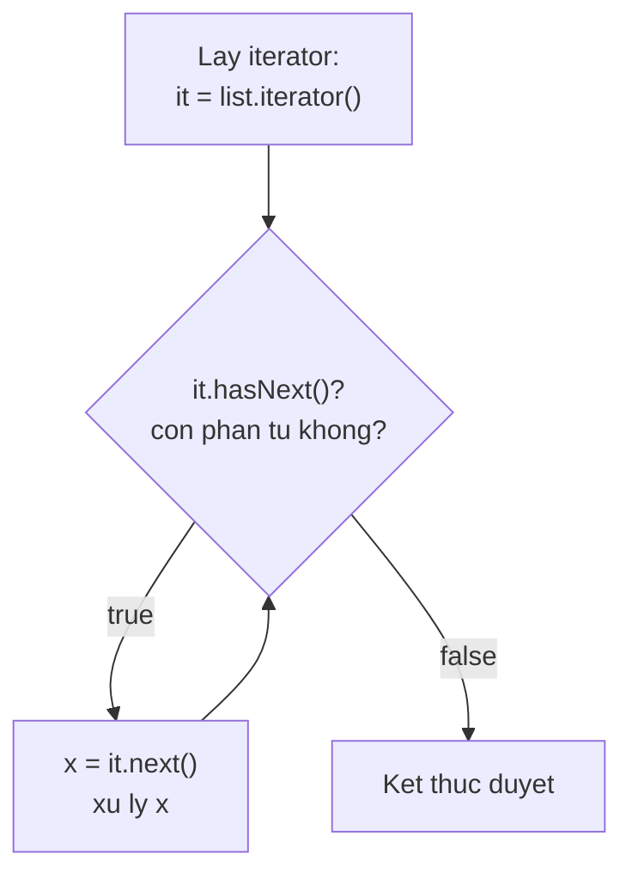

# Iterator

Iterator (bộ lặp) là công cụ giúp bạn duyệt qua từng phần tử của một collection (List, Set, Map...) như một con trỏ di chuyển lần lượt. Nó cũng là cách an toàn duy nhất để xóa phần tử trong khi đang duyệt. Bài này giới thiệu Iterator, hasNext/next và ListIterator; chi tiết nằm bên dưới.

[](pathname:///img/java/iterator.webp)

---

:::note[Ghi nhớ nhanh]

- ⭐ **Iterator = cách duyệt thống nhất** — `hasNext`/`next` cho mọi collection, không lộ cấu trúc bên trong.
- ⭐ **`iterator.remove()`** — cách an toàn duy nhất để xóa phần tử khi đang duyệt.
- **Fail-fast** — sửa collection trong lúc duyệt gây `ConcurrentModificationException`.
- **Nền tảng for-each** — vòng lặp `for-each` dùng Iterator bên dưới.
- **`ListIterator`** — duyệt hai chiều, chỉ dành cho `List`.

:::

---

## Mục lục

- [Vì sao có Iterator?](#vì-sao-có-iterator)
- [Iterator là gì?](#iterator-là-gì)
- [hasNext và next](#hasnext-và-next)
- [Lấy Iterator từ một collection](#lấy-iterator-từ-một-collection)
- [Xóa phần tử an toàn với remove](#xóa-phần-tử-an-toàn-với-remove)
- [ConcurrentModificationException](#concurrentmodificationexception)
- [So sánh với vòng lặp for-each](#so-sánh-với-vòng-lặp-for-each)
- [ListIterator — duyệt hai chiều](#listiterator--duyệt-hai-chiều)
- [Lỗi thường gặp](#lỗi-thường-gặp)
- [Tóm tắt](#tóm-tắt)
- [Câu hỏi phỏng vấn](#câu-hỏi-phỏng-vấn)

---

## Vì sao có Iterator?

**Vấn đề:** Mỗi cấu trúc dữ liệu lưu trữ một kiểu khác nhau: mảng theo chỉ số, linked list theo node, cây, bảng băm... Nếu mỗi loại duyệt một cách riêng thì code của bạn bị phụ thuộc vào chi tiết bên trong từng loại. Ngoài ra, xóa phần tử trong khi đang duyệt bằng vòng `for` theo chỉ số rất dễ gây lỗi hoặc bỏ sót phần tử.

```java
// Mỗi loại duyệt một kiểu, code phụ thuộc cấu trúc bên trong
for (int i = 0; i < mang.length; i++) { ... }          // mảng theo chỉ số
for (Node n = head; n != null; n = n.next) { ... }     // linked list theo node

// Xóa khi duyệt bằng for index dễ bỏ sót: xóa phần tử thì index trượt!
for (int i = 0; i < list.size(); i++) {
    if (list.get(i) % 2 == 0) {
        list.remove(i); // phần tử kế tiếp dồn lên, bị bỏ qua
    }
}
```

**Giải pháp:** **Iterator** cung cấp một giao diện **duyệt thống nhất** (`hasNext`/`next`/`remove`) cho mọi Collection mà **không lộ** cấu trúc bên trong. Đây là nền tảng của vòng lặp `for-each`. Iterator còn có cơ chế **fail-fast** phát hiện sửa đổi đồng thời, và `iterator.remove()` cho phép xóa **an toàn** ngay khi đang duyệt.

```java
// Cùng một cách duyệt cho MỌI collection, không cần biết cấu trúc bên trong
Iterator<Integer> it = list.iterator();
while (it.hasNext()) {
    int n = it.next();
    if (n % 2 == 0) {
        it.remove(); // xóa an toàn, không bỏ sót phần tử
    }
}
```

:::tip[Dùng thực tế]
- Duyệt mọi loại collection bằng `for-each` (List, Set, Map qua entrySet...).
- Xóa phần tử an toàn khi đang duyệt bằng `iterator.remove()`.
- Viết code duyệt độc lập với loại collection, dễ thay đổi sau này.
- Hiểu nguồn gốc `ConcurrentModificationException` để tránh và xử lý đúng.
:::

---

## Iterator là gì?

**Iterator** (bộ lặp — công cụ để duyệt từng phần tử của một tập hợp) giống như một "con trỏ" di chuyển lần lượt qua các phần tử trong collection (List, Set, Map...). Bạn dùng nó để **đi qua từng phần tử một** mà không cần quan tâm cấu trúc bên trong.

Hãy tưởng tượng bạn đọc một danh sách bằng cách đặt ngón tay lên từng dòng, đọc xong thì trượt ngón tay xuống dòng tiếp theo. Iterator chính là "ngón tay" đó.

Mọi collection trong Java đều cung cấp một Iterator, nên đây là cách duyệt **thống nhất** cho tất cả các loại tập hợp.

---

## hasNext và next

Iterator có hai phương thức cốt lõi:

- **`hasNext()`**: trả về `true` nếu **còn phần tử** phía sau để đọc.
- **`next()`**: trả về **phần tử tiếp theo** và dịch con trỏ tiến lên một bước.

```java
import java.util.ArrayList;
import java.util.Iterator;
import java.util.List;

List<String> ten = new ArrayList<>();
ten.add("An");
ten.add("Bình");
ten.add("Cường");

// Lấy iterator
Iterator<String> it = ten.iterator();

// Lặp: chừng nào còn phần tử thì lấy ra
while (it.hasNext()) {
    String t = it.next(); // lấy phần tử và tiến lên
    System.out.println(t);
}
// In ra: An, Bình, Cường
```

Quy trình luôn là: kiểm tra `hasNext()` trước, nếu còn thì gọi `next()`. Sơ đồ vòng lặp duyệt:



---

## Lấy Iterator từ một collection

Bất kỳ List hay Set nào cũng có phương thức `iterator()`:

```java
import java.util.HashSet;
import java.util.Iterator;
import java.util.Set;

Set<Integer> so = new HashSet<>();
so.add(1);
so.add(2);
so.add(3);

Iterator<Integer> it = so.iterator();
while (it.hasNext()) {
    System.out.println(it.next());
}
```

Map không có `iterator()` trực tiếp, nhưng bạn lấy iterator từ `entrySet()`, `keySet()` hoặc `values()`.

---

## Xóa phần tử an toàn với remove

Iterator có phương thức **`remove()`** để xóa phần tử **vừa được trả về bởi `next()`**. Đây là cách **an toàn duy nhất** để xóa phần tử trong khi đang duyệt.

```java
import java.util.ArrayList;
import java.util.Iterator;
import java.util.List;

List<Integer> so = new ArrayList<>();
so.add(1); so.add(2); so.add(3); so.add(4);

Iterator<Integer> it = so.iterator();
while (it.hasNext()) {
    int n = it.next();
    if (n % 2 == 0) {
        it.remove(); // xóa số chẵn một cách an toàn
    }
}

System.out.println(so); // [1, 3]
```

Lưu ý: phải gọi `next()` **trước** rồi mới gọi `it.remove()`. Gọi `remove()` hai lần liên tiếp hoặc trước `next()` sẽ gây lỗi.

---

## ConcurrentModificationException

Đây là lỗi rất hay gặp. Nếu bạn **sửa đổi collection (thêm/xóa)** trong khi đang duyệt bằng for-each hoặc iterator — mà **không** dùng `it.remove()` — Java sẽ ném **`ConcurrentModificationException`** (ngoại lệ sửa đổi đồng thời).

```java
import java.util.ArrayList;
import java.util.List;

List<Integer> so = new ArrayList<>();
so.add(1); so.add(2); so.add(3);

// SAI: xóa trực tiếp trên list trong khi for-each đang duyệt
for (Integer n : so) {
    if (n == 2) {
        so.remove(n); // ném ConcurrentModificationException!
    }
}
```

Cách sửa đúng là dùng `iterator.remove()`:

```java
// ĐÚNG: dùng iterator.remove()
Iterator<Integer> it = so.iterator();
while (it.hasNext()) {
    if (it.next() == 2) {
        it.remove(); // an toàn
    }
}
```

> Ghi nhớ: **không bao giờ** thêm/xóa trực tiếp vào collection bên trong vòng lặp for-each của chính nó.

---

## So sánh với vòng lặp for-each

Thực ra, vòng lặp **for-each** mà bạn hay dùng chính là Iterator được "che giấu" bên dưới:

```java
// Hai đoạn này tương đương nhau:

// Cách viết for-each (ngắn gọn)
for (String t : ten) {
    System.out.println(t);
}

// Cách Java thực sự chạy bên trong (dùng Iterator)
Iterator<String> it = ten.iterator();
while (it.hasNext()) {
    String t = it.next();
    System.out.println(t);
}
```

Vậy khi nào cần Iterator thủ công? Khi bạn cần **xóa phần tử trong lúc duyệt** — điều mà for-each không làm được an toàn.

---

## ListIterator — duyệt hai chiều

**ListIterator** là phiên bản mạnh hơn, chỉ dùng cho **List**. Nó cho phép:

- Duyệt **cả tiến lẫn lùi** (`hasNext`/`next` và `hasPrevious`/`previous`).
- **Thêm** phần tử (`add`) và **sửa** phần tử (`set`) trong lúc duyệt.

```java
import java.util.ArrayList;
import java.util.List;
import java.util.ListIterator;

List<String> ten = new ArrayList<>();
ten.add("An");
ten.add("Bình");

ListIterator<String> lit = ten.listIterator();

// Duyệt tiến và sửa giá trị
while (lit.hasNext()) {
    String t = lit.next();
    lit.set(t.toUpperCase()); // đổi thành chữ HOA
}
System.out.println(ten); // [AN, BÌNH]

// Duyệt lùi từ cuối về đầu
while (lit.hasPrevious()) {
    System.out.println(lit.previous());
}
// In ra: BÌNH, AN
```

---

## Lỗi thường gặp

1. **ConcurrentModificationException**: thêm/xóa trực tiếp vào collection khi đang for-each. Dùng `iterator.remove()` để xóa an toàn.

2. **Gọi `next()` khi đã hết phần tử**: nếu không kiểm tra `hasNext()` mà gọi `next()` khi hết, sẽ ném `NoSuchElementException`. Luôn kiểm tra `hasNext()` trước.

3. **Gọi `it.remove()` trước `next()`**: `remove()` chỉ hợp lệ sau khi `next()` đã được gọi. Gọi sai thứ tự ném `IllegalStateException`.

4. **Dùng ListIterator cho Set**: ListIterator chỉ dành cho List. Set không có chỉ số nên không hỗ trợ.

---

## Tóm tắt

- **Iterator** là công cụ duyệt từng phần tử của collection, hoạt động như một con trỏ.
- Hai phương thức cốt lõi: `hasNext()` (còn phần tử không?) và `next()` (lấy phần tử kế tiếp).
- `iterator.remove()` là cách **an toàn** để xóa phần tử trong khi duyệt.
- Sửa đổi collection trực tiếp khi for-each gây **`ConcurrentModificationException`**.
- Vòng lặp **for-each** thực chất dùng Iterator bên dưới.
- **ListIterator** (chỉ cho List) mạnh hơn: duyệt **hai chiều**, có thể `add` và `set`.

---

## Câu hỏi phỏng vấn

Những câu thường gặp về chủ đề này. Tự trả lời trước, rồi bấm **Xem đáp án** để đối chiếu.

**1. Vì sao Java thiết kế Iterator như một interface thống nhất thay vì để mỗi collection tự cung cấp cách duyệt riêng?**

<details className="qa">
<summary>Xem đáp án</summary>

- Mỗi cấu trúc dữ liệu lưu trữ khác nhau (mảng liên tục, node liên kết, cây, bảng băm...), nếu duyệt theo cách riêng của từng loại, code gọi sẽ **phụ thuộc chặt (tight coupling)** vào chi tiết cài đặt bên trong — khó thay đổi loại collection sau này mà không sửa code duyệt.
- `Iterator` là một ví dụ kinh điển của nguyên tắc **lập trình theo interface, không theo implementation cụ thể**: chỉ cần gọi `hasNext()`/`next()`, không cần biết bên dưới là `ArrayList` hay `LinkedList` hay `HashSet`.
- Đây cũng chính là nền tảng để vòng lặp `for-each` hoạt động thống nhất trên mọi lớp implement `Iterable`.

</details>

**2. Đoạn code sau ném lỗi gì? Giải thích nguyên nhân sâu xa.**

```java
List<Integer> list = new ArrayList<>(List.of(1, 2, 3));
for (Integer n : list) {
    if (n == 2) {
        list.remove(n);
    }
}
```

<details className="qa">
<summary>Xem đáp án</summary>

Ném `ConcurrentModificationException`.

- Vòng lặp `for-each` thực chất dùng `Iterator` bên dưới. `ArrayList` có một biến đếm nội bộ gọi là **`modCount`** (số lần cấu trúc bị sửa đổi cấu trúc — thêm/xóa phần tử).
- `Iterator` ghi nhớ giá trị `modCount` tại thời điểm được tạo ra (`expectedModCount`). Mỗi lần gọi `next()`, nó so sánh `modCount` hiện tại của list với `expectedModCount` đã lưu.
- `list.remove(n)` gọi trực tiếp trên list (không qua iterator) làm tăng `modCount`, nhưng không cập nhật `expectedModCount` của iterator đang duyệt dở. Lần gọi `next()` kế tiếp phát hiện chênh lệch và ném exception ngay — đây gọi là cơ chế **fail-fast**.

</details>

**3. `iterator.remove()` giải quyết vấn đề trên như thế nào? Vì sao nó được coi là an toàn?**

<details className="qa">
<summary>Xem đáp án</summary>

```java
Iterator<Integer> it = list.iterator();
while (it.hasNext()) {
    if (it.next() == 2) {
        it.remove(); // an toàn
    }
}
```

- `iterator.remove()` xóa phần tử **thông qua chính iterator đang duyệt**, nên nó có thể đồng bộ lại `expectedModCount` của iterator bằng `modCount` mới nhất của collection ngay sau khi xóa — không gây ra sự chênh lệch bị fail-fast phát hiện ở lần `next()` kế tiếp.
- Đây là lý do `iterator.remove()` được coi là cách **duy nhất an toàn** để xóa phần tử trong lúc đang duyệt bằng Iterator (for-each không cung cấp cách nào để xóa an toàn, vì nó không cho truy cập trực tiếp vào iterator ẩn bên dưới).

</details>

**4. Cơ chế fail-fast của Iterator có đảm bảo phát hiện MỌI trường hợp sửa đổi đồng thời không? Vì sao Javadoc khuyến cáo không nên dựa vào nó để viết logic quan trọng?**

<details className="qa">
<summary>Xem đáp án</summary>

**Không đảm bảo tuyệt đối.** Javadoc của `ConcurrentModificationException` nêu rõ: cơ chế fail-fast chỉ nỗ lực **phát hiện lỗi tốt nhất có thể (best-effort)**, không phải một đảm bảo chắc chắn.

- Trong môi trường đa luồng, có những tình huống race condition (tranh chấp luồng) mà `modCount` vẫn khớp một cách "may mắn" dù dữ liệu đã bị sửa đổi không nhất quán, khiến fail-fast **không phát hiện ra** lỗi.
- Vì vậy, Javadoc khuyến cáo: **không nên viết chương trình mà tính đúng đắn phụ thuộc vào việc `ConcurrentModificationException` chắc chắn được ném ra** — nó chỉ nên dùng để phát hiện bug khi debug/phát triển, không phải cơ chế đồng bộ hóa (synchronization) đáng tin cậy.
- Với môi trường đa luồng thực sự, cần dùng các cấu trúc thread-safe chuyên dụng như `CopyOnWriteArrayList` hoặc `ConcurrentHashMap` thay vì trông chờ vào fail-fast.

</details>

**5. `ListIterator` khác `Iterator` ở những điểm nào? Vì sao `ListIterator` chỉ áp dụng được cho `List`, không áp dụng cho `Set`?**

<details className="qa">
<summary>Xem đáp án</summary>

| Khả năng | `Iterator` | `ListIterator` |
|----------|-----------|-----------------|
| Duyệt tiến (`hasNext`/`next`) | Có | Có |
| Duyệt lùi (`hasPrevious`/`previous`) | Không | Có |
| Xóa phần tử (`remove()`) | Có | Có |
| Sửa phần tử vừa duyệt (`set()`) | Không | Có |
| Thêm phần tử mới (`add()`) | Không | Có |
| Lấy chỉ số hiện tại (`nextIndex`/`previousIndex`) | Không | Có |

- `ListIterator` cần khái niệm **vị trí/chỉ số (index)** để hỗ trợ duyệt lùi và `add`/`set` đúng vị trí — điều mà chỉ `List` (có thứ tự, truy cập theo chỉ số) mới có ý nghĩa.
- `Set` (không có thứ tự chỉ số cố định, đặc biệt `HashSet`) không có khái niệm "vị trí i" để `ListIterator` có thể thao tác, nên interface `Set` không cung cấp `listIterator()`.

</details>

**6. Vì sao gọi `it.remove()` hai lần liên tiếp (không gọi `next()` ở giữa) lại ném lỗi? Lỗi gì?**

<details className="qa">
<summary>Xem đáp án</summary>

Ném `IllegalStateException`.

- `remove()` chỉ được phép xóa phần tử **vừa mới được trả về bởi lần gọi `next()` gần nhất**. Nội bộ, Iterator ghi nhớ "phần tử hiện tại đã hợp lệ để xóa" chỉ ngay sau `next()`.
- Sau khi `remove()` được gọi một lần, trạng thái "hợp lệ để xóa" bị **reset**. Gọi `remove()` lần thứ hai mà chưa có `next()` mới ở giữa sẽ vi phạm điều kiện tiên quyết này, và Iterator ném `IllegalStateException` để báo lỗi sử dụng sai quy trình.
- Quy tắc đúng: mỗi lần `remove()` phải có đúng một lần `next()` đứng ngay trước nó.

</details>

**7. Điều gì xảy ra khi gọi `next()` trên một Iterator đã duyệt hết phần tử (khi `hasNext()` trả về `false`)?**

<details className="qa">
<summary>Xem đáp án</summary>

Ném `NoSuchElementException`.

- Đây là lý do quy trình chuẩn luôn là: kiểm tra `hasNext()` **trước**, chỉ gọi `next()` khi `hasNext()` trả về `true`.
- Đây cũng là ngoại lệ dùng chung trong nhiều tình huống "hết phần tử" khác của Collections Framework (ví dụ `Deque.remove()` khi rỗng), không riêng gì Iterator.

</details>

**8. `Iterable` và `Iterator` khác nhau thế nào? Vai trò của mỗi interface trong việc cho phép một class dùng được với vòng lặp `for-each`?**

<details className="qa">
<summary>Xem đáp án</summary>

- **`Iterable<T>`**: interface chỉ có một phương thức `iterator()`, trả về một `Iterator<T>`. Một class **implements `Iterable`** thì mới dùng được trực tiếp trong cú pháp `for (T x : obj)`.
- **`Iterator<T>`**: interface đại diện cho "trạng thái duyệt hiện tại" — có `hasNext()`, `next()`, `remove()`. Nó là đối tượng được **`Iterable.iterator()`** tạo ra và trả về mỗi lần gọi.
- Quan hệ: mọi `Collection` (List, Set...) đều `extends Iterable`, nên chúng đều dùng được với for-each. Nếu bạn tự viết một class dữ liệu tùy chỉnh (ví dụ cây nhị phân riêng) và muốn nó dùng được với for-each, class đó phải tự `implements Iterable<T>` và cài đặt `iterator()` trả về một `Iterator` tùy chỉnh.

</details>

**9. Vì sao Iterator có thể coi là một ứng dụng của Iterator Design Pattern? Lợi ích chính của pattern này là gì?**

<details className="qa">
<summary>Xem đáp án</summary>

**Iterator Pattern** (một trong các Gang of Four design pattern) tách rời **logic duyệt** ra khỏi **cấu trúc dữ liệu lưu trữ** — cho phép truy cập tuần tự các phần tử của một tập hợp mà không cần lộ chi tiết cài đặt bên trong (mảng, node, cây...).

Lợi ích chính:

- **Tính đa hình khi duyệt (polymorphic traversal)**: cùng một đoạn code duyệt (`hasNext`/`next`) hoạt động với mọi loại collection.
- **Nhiều iterator độc lập trên cùng một collection**: có thể tạo nhiều `Iterator` khác nhau đang duyệt collection đồng thời, mỗi cái giữ trạng thái vị trí riêng (con trỏ nội bộ) mà không ảnh hưởng lẫn nhau.
- **Tách biệt trách nhiệm (separation of concerns)**: collection chỉ lo lưu trữ dữ liệu, còn Iterator lo việc duyệt — tuân theo nguyên tắc Single Responsibility trong SOLID.

</details>

**10. Duyệt và xóa phần tử trong một `Map` (ví dụ xóa các entry có value âm) an toàn nhất bằng cách nào?**

<details className="qa">
<summary>Xem đáp án</summary>

```java
Map<String, Integer> map = new HashMap<>();
map.put("A", -1);
map.put("B", 5);

// Đúng cách: lấy Iterator từ entrySet() rồi remove qua iterator
Iterator<Map.Entry<String, Integer>> it = map.entrySet().iterator();
while (it.hasNext()) {
    Map.Entry<String, Integer> entry = it.next();
    if (entry.getValue() < 0) {
        it.remove(); // xóa an toàn khỏi map gốc
    }
}
```

- `Map` không implement `Iterable` trực tiếp và không có `remove()` an toàn khi duyệt trực tiếp bằng for-each trên `entrySet()`/`keySet()`. Phải lấy `Iterator` tường minh từ view (`entrySet().iterator()`) rồi gọi `it.remove()`, tương tự nguyên tắc áp dụng cho `List`/`Set`.
- Một lựa chọn thay thế gọn hơn từ Java 8: `map.values().removeIf(v -> v < 0)` hoặc `map.entrySet().removeIf(e -> e.getValue() < 0)` — dùng `Predicate` để lọc và xóa mà không cần tự viết Iterator thủ công.

</details>
