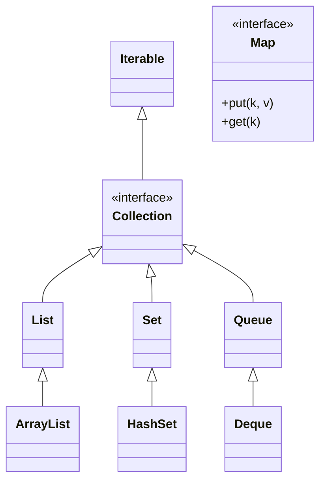

# Generic Collections

Generic (kiểu tổng quát) là phần `<...>` mà bạn thấy ở `ArrayList<String>` hay `HashMap<String, Integer>`, quy định loại dữ liệu mà collection được phép chứa. Nó mang lại type safety, giúp bắt lỗi sai kiểu ngay lúc biên dịch và không phải ép kiểu khi lấy ra. Bài này giới thiệu generic, wildcard, bounded type và cách tự viết phương thức generic; chi tiết nằm bên dưới.

---

:::note[Ghi nhớ nhanh]

- ⭐ **Generics `List<String>`** — tham số hóa kiểu phần tử, bắt lỗi sai kiểu ngay lúc biên dịch (type safety).
- **Không cần cast** — lấy phần tử ra không phải ép kiểu, IDE autocomplete đầy đủ.
- ⭐ **Raw type nguy hiểm** — chứa `Object`, dễ gây `ClassCastException` lúc chạy.
- **Wildcard `?`** — giúp API linh hoạt nhận nhiều kiểu.
- **Bounded type** — giới hạn kiểu (vd `<T extends Number>`); tự viết được phương thức generic.

:::

---

## Mục lục

- [Vì sao collection cần generics?](#vì-sao-collection-cần-generics)
- [Generic là gì?](#generic-là-gì)
- [Vấn đề khi không có generic](#vấn-đề-khi-không-có-generic)
- [Type safety — an toàn kiểu dữ liệu](#type-safety--an-toàn-kiểu-dữ-liệu)
- [Vì sao `List<String>` tốt hơn List thường](#vì-sao-liststring-tốt-hơn-list-thường)
- [Generic trong nhiều collection](#generic-trong-nhiều-collection)
- [Wildcard — dấu hỏi ?](#wildcard--dấu-hỏi-)
- [Bounded type — giới hạn kiểu](#bounded-type--giới-hạn-kiểu)
- [Tự viết phương thức generic](#tự-viết-phương-thức-generic)
- [Lỗi thường gặp](#lỗi-thường-gặp)
- [Tóm tắt](#tóm-tắt)

---

## Vì sao collection cần generics?

**Vấn đề:** Trước Java 5, collection chỉ chứa `Object` nên kiểu phần tử bị lẫn lộn. Lấy phần tử ra phải ép kiểu (cast) thủ công, lỡ bỏ nhầm kiểu khác vào thì lỗi chỉ lộ lúc **chạy** (`ClassCastException`), và IDE không gợi ý (autocomplete) được.

```java
import java.util.ArrayList;
import java.util.List;

List ds = new ArrayList();   // raw type — chứa Object
ds.add("An");
ds.add(123);                 // Java KHÔNG ngăn — kiểu bị lẫn lộn

// Phải ép kiểu thủ công, không autocomplete
String ten = (String) ds.get(1); // ClassCastException lúc CHẠY (vốn là 123)
```

**Giải pháp:** Generics `List<String>` tham số hoá kiểu phần tử. Compiler **đảm bảo** chỉ bỏ đúng kiểu vào (bắt lỗi ngay lúc biên dịch), lấy ra **không cần** ép kiểu, IDE autocomplete đầy đủ. Bounded type và wildcard giúp API linh hoạt hơn. Kết quả: type-safe và gọn gàng.

```java
import java.util.ArrayList;
import java.util.List;

List<String> ds = new ArrayList<>(); // tham số hoá kiểu
ds.add("An");
// ds.add(123);                       // LỖI ngay lúc biên dịch — sửa sớm

String ten = ds.get(0); // lấy ra không cần cast, có autocomplete
```

:::tip[Dùng thực tế]
- `List<User>` lấy ra dùng ngay, không phải `(User) list.get(i)`.
- Compiler chặn lỡ tay bỏ nhầm kiểu khác vào danh sách.
- Viết một method generic `<T>` tái sử dụng cho mọi kiểu mà vẫn an toàn.
- Wildcard `<? extends T>` cho API nhận nhiều loại List linh hoạt (vd cộng tổng mọi `Number`).
:::

---

## Generic là gì?

**Generic** (kiểu tổng quát — cơ chế cho phép một lớp/phương thức làm việc với nhiều loại dữ liệu một cách an toàn) là phần `<...>` mà bạn đã thấy ở `ArrayList<String>` hay `HashMap<String, Integer>`.

Phần trong dấu ngoặc nhọn `< >` cho Java biết: "tập hợp này chỉ chứa loại dữ liệu này thôi". Ví dụ:

```java
import java.util.ArrayList;
import java.util.List;

// List này CHỈ chứa String
List<String> ten = new ArrayList<>();
ten.add("An");      // OK
// ten.add(123);    // LỖI ngay khi biên dịch — không phải String
```

Ký hiệu chữ cái như `<T>`, `<E>` chỉ là **tên đại diện cho một kiểu chưa xác định**:

- `T` = Type (kiểu bất kỳ)
- `E` = Element (phần tử)
- `K`, `V` = Key, Value (khóa, giá trị — dùng cho Map)

---

## Vấn đề khi không có generic

Ngày xưa (trước Java 5), collection **không có** generic. Bạn có thể nhét bất cứ thứ gì vào, dẫn đến lỗi nguy hiểm:

```java
import java.util.ArrayList;
import java.util.List;

// List thường (raw type — kiểu thô, không generic)
List danhSach = new ArrayList();

danhSach.add("An");   // thêm chuỗi
danhSach.add(123);    // thêm số — Java KHÔNG ngăn cản!

// Khi lấy ra phải ép kiểu thủ công, và dễ sai
String ten = (String) danhSach.get(1); // LỖI lúc chạy: ClassCastException
// vì phần tử ở chỉ số 1 thực ra là số 123, không phải String
```

Lỗi này chỉ lộ ra **khi chương trình chạy** (runtime) — rất khó phát hiện và nguy hiểm.

---

## Type safety — an toàn kiểu dữ liệu

**Type safety** (an toàn kiểu — bảo đảm dữ liệu đúng loại ngay từ lúc viết code) là lợi ích lớn nhất của generic. Với generic, Java bắt lỗi **ngay khi biên dịch** (compile time), trước cả khi chương trình chạy:

```java
List<String> ten = new ArrayList<>();
ten.add("An");
// ten.add(123); // Trình biên dịch BÁO LỖI NGAY — bạn sửa được trước khi chạy

// Lấy ra KHÔNG cần ép kiểu, vì Java biết chắc là String
String t = ten.get(0); // an toàn, không cần (String)
```

Phát hiện lỗi sớm = ít bug hơn, code an toàn hơn.

---

## Vì sao List&lt;String&gt; tốt hơn List thường

| Tiêu chí | `List` thường (raw) | `List<String>` (generic) |
|----------|---------------------|--------------------------|
| Loại dữ liệu chứa | Bất kỳ (dễ lẫn lộn) | Chỉ String |
| Phát hiện lỗi | Lúc chạy (muộn, nguy hiểm) | Lúc biên dịch (sớm, an toàn) |
| Ép kiểu khi lấy ra | Phải tự ép `(String)` | Không cần |
| Khả năng đọc code | Khó đoán chứa gì | Rõ ràng chứa String |

> Quy tắc: **luôn luôn dùng generic** cho collection. Đừng bao giờ viết `List` trống không trong code mới.

---

## Generic trong nhiều collection

Generic áp dụng cho mọi collection:

```java
import java.util.*;

// List chứa số nguyên
List<Integer> diem = new ArrayList<>();

// Set chứa chuỗi
Set<String> email = new HashSet<>();

// Map: khóa String, giá trị Integer
Map<String, Integer> tuoi = new HashMap<>();
tuoi.put("An", 20);

// Có thể lồng nhau: Map mà giá trị là một List
Map<String, List<String>> lopHoc = new HashMap<>();
lopHoc.put("Lớp A", new ArrayList<>());
lopHoc.get("Lớp A").add("An");
lopHoc.get("Lớp A").add("Bình");
```

Nhìn tổng thể cây phân cấp Collection Framework (mọi interface đều nhận generic `<E>` hoặc `<K, V>`; lưu ý `Map` là nhánh **riêng**, không thuộc `Collection`):



---

## Wildcard — dấu hỏi ?

**Wildcard** (ký tự đại diện — dấu `?` nghĩa là "kiểu nào cũng được") dùng khi bạn viết phương thức nhận một collection mà **không cần biết chính xác kiểu phần tử**.

```java
import java.util.List;

// Phương thức in mọi List, bất kể chứa kiểu gì
public static void inDanhSach(List<?> ds) {
    for (Object phanTu : ds) { // lấy ra dưới dạng Object
        System.out.println(phanTu);
    }
}

// Dùng được với mọi loại List
inDanhSach(List.of("An", "Bình"));   // List<String>
inDanhSach(List.of(1, 2, 3));        // List<Integer>
```

`List<?>` nghĩa là "một List chứa kiểu nào đó (không xác định)". Bạn chỉ **đọc** được (dưới dạng `Object`), không thêm phần tử mới vào (trừ `null`), vì Java không biết kiểu thật là gì.

---

## Bounded type — giới hạn kiểu

**Bounded type** (kiểu có giới hạn — chỉ cho phép một nhóm kiểu nhất định) dùng từ khóa `extends` để giới hạn. Ví dụ chỉ nhận các kiểu **số** (`Number` và lớp con của nó như `Integer`, `Double`):

```java
import java.util.List;

// <? extends Number> nghĩa là: chứa Number hoặc lớp con của Number
public static double tinhTong(List<? extends Number> ds) {
    double tong = 0;
    for (Number n : ds) {
        tong += n.doubleValue(); // mọi Number đều có doubleValue()
    }
    return tong;
}

// Dùng được với List<Integer> và List<Double>
System.out.println(tinhTong(List.of(1, 2, 3)));       // 6.0
System.out.println(tinhTong(List.of(1.5, 2.5)));      // 4.0
// tinhTong(List.of("a", "b"));  // LỖI: String không phải Number
```

`<? extends Number>` đọc là "kiểu nào đó là Number hoặc con của Number". Nhờ vậy phương thức an toàn và linh hoạt cùng lúc.

---

## Tự viết phương thức generic

Bạn cũng có thể tự định nghĩa phương thức dùng kiểu tổng quát `<T>`:

```java
// <T> khai báo một kiểu tổng quát tên T
// Phương thức nhận và trả về cùng kiểu T, bất kể đó là kiểu gì
public static <T> T layPhanTuDau(java.util.List<T> ds) {
    if (ds.isEmpty()) {
        return null;
    }
    return ds.get(0); // trả về đúng kiểu T
}

// Java tự suy ra T là String hay Integer
String t = layPhanTuDau(java.util.List.of("An", "Bình")); // T = String
Integer n = layPhanTuDau(java.util.List.of(10, 20));       // T = Integer
```

`<T>` đặt ngay trước kiểu trả về giúp phương thức làm việc với **mọi kiểu** mà vẫn giữ type safety.

---

## Lỗi thường gặp

1. **Dùng raw type (`List` không có `<>`):** mất type safety, dễ gặp `ClassCastException` lúc chạy. Luôn ghi rõ kiểu trong `< >`.

2. **Dùng kiểu nguyên thủy trong generic:** `List<int>` là SAI. Phải dùng lớp bọc: `List<Integer>`, `List<Double>`, `List<Boolean>`.

3. **Cố thêm phần tử vào `List<?>`:** không thêm được (trừ `null`) vì Java không biết kiểu thật. Wildcard chủ yếu để **đọc**.

4. **Quên `<>` ở vế phải:** Java 7+ cho phép viết gọn `new ArrayList<>()` (gọi là *diamond operator* — toán tử kim cương). Vẫn cần ghi kiểu ở vế trái: `List<String> x = new ArrayList<>();`.

---

## Tóm tắt

- **Generic** (`<T>`, `<String>`...) quy định loại dữ liệu mà collection được phép chứa.
- Mang lại **type safety**: bắt lỗi sai kiểu **ngay lúc biên dịch**, không cần ép kiểu khi lấy ra.
- `List<String>` tốt hơn `List` thường vì rõ ràng, an toàn và phát hiện lỗi sớm.
- Luôn dùng **lớp bọc** (`Integer`, `Double`) trong generic, không dùng kiểu nguyên thủy.
- **Wildcard `?`** cho phép viết phương thức nhận collection bất kỳ kiểu (chủ yếu để đọc).
- **Bounded type** (`<? extends Number>`) giới hạn chỉ nhận một nhóm kiểu nhất định.
- Có thể tự viết **phương thức generic** với `<T>` để dùng cho mọi kiểu mà vẫn an toàn.
